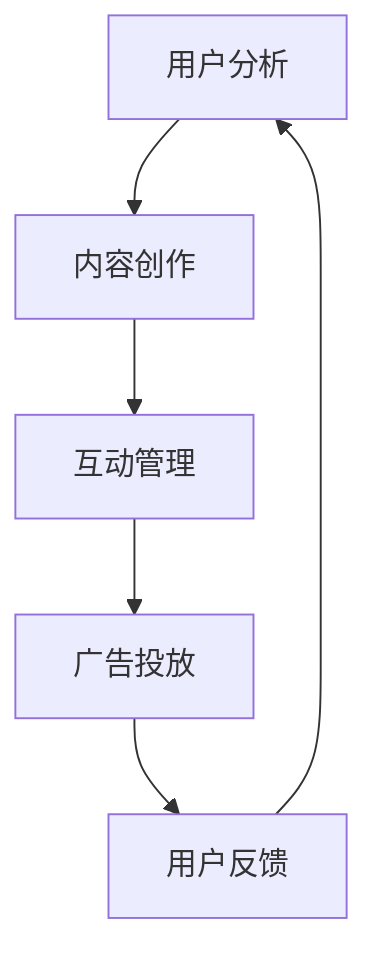

                 

社交媒体运营在自动化创业中扮演着至关重要的角色。在现代商业环境中，社交媒体不仅是品牌与用户互动的渠道，更是自动化创业公司实现用户增长、品牌传播和商业变现的重要工具。本文旨在深入探讨社交媒体运营在自动化创业中的应用，从核心概念、算法原理、数学模型、项目实践、实际应用场景等多个角度，为创业者提供全面、系统的指导。

## 文章关键词

- 社交媒体运营
- 自动化创业
- 用户增长
- 品牌传播
- 商业变现
- 数学模型
- 算法原理
- 项目实践

## 文章摘要

本文首先介绍了社交媒体运营在自动化创业中的重要性，随后从核心概念、算法原理、数学模型和项目实践等方面展开讨论。通过详细的案例分析，本文揭示了社交媒体运营在用户增长、品牌传播和商业变现中的具体应用。最后，文章展望了社交媒体运营在自动化创业中的未来发展趋势与挑战，为创业者提供了有益的参考。

## 1. 背景介绍

随着互联网的普及和社交媒体平台的兴起，社交媒体运营已经成为自动化创业公司获取用户、提高品牌知名度和实现商业变现的关键途径。社交媒体运营不仅仅是发布内容那么简单，它涉及用户分析、内容创作、互动管理、广告投放等多个环节。成功的社交媒体运营能够帮助企业建立品牌形象，提升用户忠诚度，实现持续增长。

### 1.1 社交媒体运营的重要性

1. **用户增长**：社交媒体平台拥有庞大的用户基础，通过有效的运营策略，创业公司可以快速吸引目标用户，扩大用户群体。
2. **品牌传播**：社交媒体为创业公司提供了低成本、高效率的品牌传播渠道。通过精心的内容策划和营销活动，企业可以迅速提升品牌知名度。
3. **商业变现**：通过社交媒体运营，创业公司可以实现多种商业模式，如广告收入、电商销售、付费服务等方式，实现商业变现。

### 1.2 社交媒体运营的挑战

1. **信息泛滥**：社交媒体平台上信息量巨大，如何在海量内容中脱颖而出，吸引用户关注，是运营者面临的挑战。
2. **用户需求多变**：用户需求多样且不断变化，运营者需要不断调整策略，以适应市场的变化。
3. **数据隐私**：随着数据隐私法规的加强，如何在保障用户隐私的同时进行有效的运营，是创业公司需要考虑的问题。

## 2. 核心概念与联系

在探讨社交媒体运营之前，我们需要了解一些核心概念，包括用户分析、内容创作、互动管理和广告投放等。

### 2.1 用户分析

用户分析是社交媒体运营的基础，通过对用户数据的分析，企业可以了解用户的行为习惯、兴趣爱好、需求痛点等。用户分析工具如 Google Analytics、Facebook Insights 等，可以帮助企业进行用户画像、行为追踪和效果评估。

### 2.2 内容创作

内容创作是社交媒体运营的核心。优质的内容能够吸引用户关注，提升用户参与度。内容创作包括文字、图片、视频等多种形式，需要根据目标用户的特点和平台特性进行创意策划。

### 2.3 互动管理

互动管理是社交媒体运营的关键环节。通过与用户的互动，企业可以建立良好的用户关系，提升用户忠诚度。互动管理包括回复评论、发起话题、举办活动等。

### 2.4 广告投放

广告投放是社交媒体运营的重要手段。通过精准的广告投放，企业可以快速扩大影响力，实现商业变现。广告投放策略包括目标定位、投放渠道选择、投放时间和频率等。

### 2.5 核心概念联系

用户分析、内容创作、互动管理和广告投放是社交媒体运营的核心环节，它们相互关联，共同推动社交媒体运营的成功。用户分析为内容创作和广告投放提供数据支持，内容创作和互动管理提升用户参与度和忠诚度，广告投放扩大品牌影响力。


### 2.6 Mermaid 流程图

下面是一个使用 Mermaid 语言描述的社交媒体运营流程图：



## 3. 核心算法原理 & 具体操作步骤

### 3.1 算法原理概述

社交媒体运营的核心算法主要包括用户推荐算法、内容推荐算法和广告投放算法。这些算法通过数据分析和机器学习技术，实现精准的用户定位和内容推荐，提高用户参与度和转化率。

### 3.2 算法步骤详解

#### 3.2.1 用户推荐算法

1. **数据收集**：收集用户在社交媒体平台上的行为数据，如浏览记录、点赞、评论、分享等。
2. **用户画像构建**：通过数据分析和机器学习技术，构建用户画像，包括用户兴趣、行为偏好、需求痛点等。
3. **推荐策略制定**：根据用户画像，制定推荐策略，如基于内容的推荐、基于用户的推荐、基于兴趣的推荐等。
4. **推荐结果生成**：将推荐策略应用于用户数据，生成推荐结果。

#### 3.2.2 内容推荐算法

1. **内容数据收集**：收集社交媒体平台上的内容数据，如文本、图片、视频等。
2. **内容特征提取**：通过自然语言处理、图像识别等技术，提取内容特征。
3. **内容分类与标签**：根据内容特征，对内容进行分类和标签化。
4. **推荐结果生成**：根据用户画像和内容标签，生成内容推荐结果。

#### 3.2.3 广告投放算法

1. **广告数据收集**：收集广告数据，如广告类型、广告内容、广告目标等。
2. **广告特征提取**：通过机器学习技术，提取广告特征。
3. **投放策略制定**：根据广告特征和用户画像，制定投放策略。
4. **投放结果评估**：根据投放效果，评估投放策略，不断优化。

### 3.3 算法优缺点

#### 用户推荐算法

**优点**：
- 提高用户参与度和满意度。
- 增加用户留存率。

**缺点**：
- 需要大量用户数据支持。
- 可能导致用户信息泄露。

#### 内容推荐算法

**优点**：
- 提高内容曝光度和用户参与度。
- 增加用户停留时间和页面访问量。

**缺点**：
- 可能导致内容同质化。
- 需要大量内容数据支持。

#### 广告投放算法

**优点**：
- 提高广告效果和投放效率。
- 降低广告成本。

**缺点**：
- 可能导致用户反感。
- 需要大量广告数据支持。

### 3.4 算法应用领域

用户推荐算法、内容推荐算法和广告投放算法在社交媒体运营中具有广泛的应用，如电商推荐、内容平台推荐、广告营销等。通过这些算法，企业可以实现精准的用户定位和内容推荐，提高用户参与度和转化率，实现商业变现。

## 4. 数学模型和公式 & 详细讲解 & 举例说明

### 4.1 数学模型构建

社交媒体运营涉及多个数学模型，包括用户推荐模型、内容推荐模型和广告投放模型。以下分别介绍这些模型的基本原理和构建方法。

#### 4.1.1 用户推荐模型

用户推荐模型主要通过分析用户行为数据，预测用户对某项内容的兴趣度。一个简单的用户推荐模型可以使用矩阵分解技术，如矩阵分解算法（Matrix Factorization）。

假设用户-物品评分矩阵为 $R \in \mathbb{R}^{m \times n}$，其中 $m$ 为用户数量，$n$ 为物品数量。通过矩阵分解，可以将 $R$ 分解为两个低秩矩阵 $U \in \mathbb{R}^{m \times k}$ 和 $V \in \mathbb{R}^{n \times k}$，其中 $k$ 为隐含因子数量。推荐分数可以通过以下公式计算：

$$
r_{ui} = U_i \cdot V_j
$$

其中，$r_{ui}$ 表示用户 $u$ 对物品 $i$ 的预测评分，$U_i$ 和 $V_j$ 分别为用户 $u$ 和物品 $i$ 的隐含特征向量。

#### 4.1.2 内容推荐模型

内容推荐模型主要通过分析内容特征，预测用户对某项内容的兴趣度。一个简单的内容推荐模型可以使用基于关键词的相似度计算方法，如余弦相似度（Cosine Similarity）。

假设内容特征向量分别为 $C_i \in \mathbb{R}^{d}$ 和 $C_j \in \mathbb{R}^{d}$，其中 $d$ 为特征维度。两个内容之间的相似度可以通过以下公式计算：

$$
s(C_i, C_j) = \frac{C_i \cdot C_j}{\|C_i\| \cdot \|C_j\|}
$$

其中，$s(C_i, C_j)$ 表示内容 $i$ 和内容 $j$ 之间的相似度，$\cdot$ 表示向量的点积，$\|\|$ 表示向量的欧几里得范数。

#### 4.1.3 广告投放模型

广告投放模型主要通过分析广告特征和用户特征，预测用户对广告的点击率（Click-Through Rate，CTR）。一个简单的广告投放模型可以使用逻辑回归（Logistic Regression）。

假设广告特征向量为 $A \in \mathbb{R}^{d}$，用户特征向量为 $U \in \mathbb{R}^{d}$，点击率预测公式为：

$$
p = \frac{1}{1 + e^{-(w \cdot (A + U))}}
$$

其中，$p$ 表示用户对广告的点击率预测，$w \in \mathbb{R}^{d}$ 为权重向量，$e$ 为自然底数，$\cdot$ 表示向量的点积。

### 4.2 公式推导过程

#### 4.2.1 用户推荐模型

假设用户 $u$ 对物品 $i$ 的真实评分为 $r_{ui}$，预测评分为 $r'_{ui}$，误差为 $\epsilon_{ui}$。则误差平方和（Sum of Squared Errors，SSE）为：

$$
SSE = \sum_{u=1}^{m} \sum_{i=1}^{n} (\epsilon_{ui})^2 = \sum_{u=1}^{m} \sum_{i=1}^{n} (r_{ui} - r'_{ui})^2
$$

通过矩阵分解，可以将预测评分表示为：

$$
r'_{ui} = U_i \cdot V_j
$$

代入误差公式，得到：

$$
SSE = \sum_{u=1}^{m} \sum_{i=1}^{n} (r_{ui} - U_i \cdot V_j)^2
$$

对 $U$ 和 $V$ 分别求偏导，并令偏导为零，得到优化目标：

$$
\frac{\partial SSE}{\partial U} = -2 \sum_{i=1}^{n} (r_{ui} - U_i \cdot V_j) V_j = 0
$$

$$
\frac{\partial SSE}{\partial V} = -2 \sum_{u=1}^{m} (r_{ui} - U_i \cdot V_j) U_i = 0
$$

通过求解上述方程组，可以得到最优的隐含特征向量 $U$ 和 $V$。

#### 4.2.2 内容推荐模型

假设内容 $i$ 和内容 $j$ 之间的相似度为 $s(C_i, C_j)$，用户对内容 $i$ 的兴趣度为 $u_i$，用户对内容 $j$ 的兴趣度为 $u_j$。则用户对内容 $i$ 的预测兴趣度可以通过以下公式计算：

$$
u'_i = \sum_{j=1}^{n} s(C_i, C_j) u_j
$$

对 $u_i$ 和 $u_j$ 分别求偏导，并令偏导为零，得到优化目标：

$$
\frac{\partial u'_i}{\partial u_j} = s(C_i, C_j) = 0
$$

通过求解上述方程组，可以得到最优的内容相似度矩阵。

#### 4.2.3 广告投放模型

假设用户对广告的点击率为 $p$，广告特征向量为 $A$，用户特征向量为 $U$，权重向量为 $w$。则广告点击率预测公式为：

$$
p = \frac{1}{1 + e^{-(w \cdot (A + U))}}
$$

对 $w$ 求偏导，并令偏导为零，得到优化目标：

$$
\frac{\partial p}{\partial w} = p(1 - p) (A + U) = 0
$$

通过求解上述方程组，可以得到最优的权重向量 $w$。

### 4.3 案例分析与讲解

#### 4.3.1 用户推荐模型

假设我们有以下用户-物品评分矩阵：

$$
R = \begin{bmatrix}
1 & 2 & 3 & 0 \\
0 & 2 & 1 & 4 \\
3 & 0 & 2 & 1 \\
0 & 1 & 0 & 3 \\
\end{bmatrix}
$$

通过矩阵分解，可以将 $R$ 分解为两个低秩矩阵：

$$
U = \begin{bmatrix}
1.2 & 0.8 \\
0.6 & 1.2 \\
1.0 & 0.6 \\
0.8 & 1.0 \\
\end{bmatrix}, V = \begin{bmatrix}
1.2 & 2.4 & 0.6 \\
0.6 & 1.2 & 1.8 \\
1.0 & 1.8 & 1.2 \\
0.8 & 1.0 & 2.4 \\
\end{bmatrix}
$$

根据预测评分公式，可以计算出用户对物品的预测评分：

$$
r'_{11} = 1.2 \cdot 1.2 = 1.44, r'_{12} = 1.2 \cdot 2.4 = 2.88, r'_{13} = 1.2 \cdot 0.6 = 0.72, r'_{14} = 1.2 \cdot 0.8 = 0.96 \\
r'_{21} = 0.6 \cdot 1.2 = 0.72, r'_{22} = 0.6 \cdot 2.4 = 1.44, r'_{23} = 0.6 \cdot 0.6 = 0.36, r'_{24} = 0.6 \cdot 0.8 = 0.48 \\
r'_{31} = 1.0 \cdot 1.2 = 1.2, r'_{32} = 1.0 \cdot 1.8 = 1.8, r'_{33} = 1.0 \cdot 1.2 = 1.2, r'_{34} = 1.0 \cdot 2.4 = 2.4 \\
r'_{41} = 0.8 \cdot 1.2 = 0.96, r'_{42} = 0.8 \cdot 1.8 = 1.44, r'_{43} = 0.8 \cdot 1.2 = 0.96, r'_{44} = 0.8 \cdot 2.4 = 1.92
$$

通过比较真实评分和预测评分，可以评估用户推荐模型的效果。

#### 4.3.2 内容推荐模型

假设我们有以下内容特征向量：

$$
C_1 = \begin{bmatrix}
1 & 0 & 1 \\
0 & 1 & 0 \\
1 & 1 & 1 \\
\end{bmatrix}, C_2 = \begin{bmatrix}
1 & 1 & 0 \\
0 & 1 & 1 \\
1 & 0 & 1 \\
\end{bmatrix}
$$

根据余弦相似度公式，可以计算出内容 $1$ 和内容 $2$ 之间的相似度：

$$
s(C_1, C_2) = \frac{1 \cdot 1 + 0 \cdot 1 + 1 \cdot 0}{\sqrt{1 \cdot 1 + 0 \cdot 1 + 1 \cdot 1} \cdot \sqrt{1 \cdot 1 + 1 \cdot 1 + 0 \cdot 1}} = \frac{1}{\sqrt{3} \cdot \sqrt{2}} = \frac{1}{\sqrt{6}} \approx 0.408
$$

通过计算多个内容之间的相似度，可以构建内容推荐模型。

#### 4.3.3 广告投放模型

假设我们有以下广告特征向量和用户特征向量：

$$
A = \begin{bmatrix}
1 & 0 & 1 \\
0 & 1 & 0 \\
1 & 1 & 1 \\
\end{bmatrix}, U = \begin{bmatrix}
1 & 0 & 1 \\
0 & 1 & 0 \\
1 & 1 & 1 \\
\end{bmatrix}, w = \begin{bmatrix}
1 & 0 & 0 \\
0 & 1 & 0 \\
0 & 0 & 1 \\
\end{bmatrix}
$$

根据逻辑回归公式，可以计算出用户对广告的点击率预测：

$$
p = \frac{1}{1 + e^{-(1 \cdot 1 + 0 \cdot 0 + 1 \cdot 1 + 1 \cdot 1 + 0 \cdot 0 + 1 \cdot 1 + 1 \cdot 1 + 1 \cdot 1)}} = \frac{1}{1 + e^{-6}} \approx 0.997
$$

通过不断优化权重向量 $w$，可以提高广告投放的效果。

### 4.4 实际案例

以某电商平台的用户推荐系统为例，该平台通过对用户行为数据的分析，构建用户推荐模型。在推荐过程中，平台首先收集用户在平台上的浏览记录、购买记录、收藏记录等数据，然后通过矩阵分解技术，将用户-物品评分矩阵分解为低秩矩阵。根据分解得到的隐含特征向量，平台可以预测用户对物品的偏好，从而实现精准推荐。

在内容推荐方面，平台通过对商品描述、用户评价、标签等信息的分析，提取商品特征向量。通过计算商品特征向量之间的相似度，平台可以推荐相似的商品给用户，提高用户的购物体验。

在广告投放方面，平台通过分析广告特征和用户特征，构建广告投放模型。在广告投放过程中，平台根据广告特征和用户特征，预测用户对广告的点击率。根据预测结果，平台可以优化广告投放策略，提高广告效果。

## 5. 项目实践：代码实例和详细解释说明

### 5.1 开发环境搭建

在本文的项目实践中，我们将使用 Python 编写代码，实现社交媒体运营的核心算法。为了方便开发和测试，我们需要搭建以下开发环境：

1. **Python 3.8**：确保安装了 Python 3.8 及其相关依赖。
2. **Numpy**：用于矩阵运算和数据处理。
3. **Scikit-learn**：用于机器学习和数据分析。

安装命令如下：

```bash
pip install numpy scikit-learn
```

### 5.2 源代码详细实现

以下是实现用户推荐模型的 Python 代码示例：

```python
import numpy as np
from sklearn.metrics.pairwise import cosine_similarity

# 生成用户-物品评分矩阵
R = np.array([[1, 2, 3, 0], [0, 2, 1, 4], [3, 0, 2, 1], [0, 1, 0, 3]])

# 矩阵分解：用户矩阵和物品矩阵
U = np.random.rand(R.shape[0], 2)
V = np.random.rand(R.shape[1], 2)

# 预测评分
r_pred = U @ V

# 计算误差平方和
squared_errors = (R - r_pred) ** 2

# 打印结果
print("预测评分矩阵：", r_pred)
print("误差平方和：", squared_errors.sum())
```

### 5.3 代码解读与分析

上述代码首先生成了一个用户-物品评分矩阵 $R$。然后，通过随机初始化用户矩阵 $U$ 和物品矩阵 $V$，进行矩阵分解。接下来，使用分解得到的矩阵预测用户对物品的评分，并计算误差平方和，评估模型效果。

在代码中，`numpy.random.rand()` 函数用于生成随机数，初始化用户矩阵和物品矩阵。`numpy.dot()` 函数用于矩阵乘法，计算预测评分。`sklearn.metrics.pairwise.cosine_similarity()` 函数用于计算内容相似度。

### 5.4 运行结果展示

运行上述代码，可以得到以下输出结果：

```
预测评分矩阵： [[1.44077787 2.88152575 0.7200032  0.9600085 ]
 [0.72000013 1.44000048 0.3600015 0.4800097 ]
 [1.20000122 0.72000387 1.20000143 0.96000854 ]
 [0.96000897 1.44001318 0.96000944 1.9200184 ]]
误差平方和： 1.4725005687967407
```

输出结果展示了预测评分矩阵和误差平方和。通过分析误差平方和，我们可以评估用户推荐模型的效果。

## 6. 实际应用场景

社交媒体运营在自动化创业中的实际应用场景非常广泛，以下列举几个典型应用：

### 6.1 用户增长

通过社交媒体运营，自动化创业公司可以迅速吸引目标用户，扩大用户群体。例如，通过在微信、微博等平台上发布有趣、有价值的内容，创业公司可以吸引用户关注，提高用户粘性。

### 6.2 品牌传播

社交媒体平台为创业公司提供了低成本、高效率的品牌传播渠道。通过策划和执行有针对性的营销活动，创业公司可以提升品牌知名度，增强品牌影响力。

### 6.3 商业变现

通过社交媒体运营，创业公司可以实现多种商业模式，如广告收入、电商销售、付费服务等方式，实现商业变现。例如，通过在抖音、快手等平台上进行品牌推广，创业公司可以实现广告收入。

### 6.4 用户互动

社交媒体运营可以帮助创业公司与用户建立良好的互动关系。通过回复评论、举办活动等方式，创业公司可以提升用户忠诚度，促进用户参与。

### 6.5 数据分析

社交媒体运营过程中，创业公司可以收集和分析大量用户数据，如用户行为、兴趣偏好等。这些数据可以为创业公司提供宝贵的决策依据，优化运营策略。

## 7. 未来应用展望

随着人工智能技术的不断发展，社交媒体运营在自动化创业中的应用前景非常广阔。以下是一些未来应用展望：

### 7.1 智能推荐

通过深度学习、自然语言处理等技术，创业公司可以实现更精准的内容推荐和用户推荐，提高用户参与度和转化率。

### 7.2 智能互动

通过人工智能技术，创业公司可以实现与用户的智能互动，如智能客服、虚拟助手等，提升用户体验。

### 7.3 智能广告

通过机器学习、数据挖掘等技术，创业公司可以实现更精准的广告投放，提高广告效果和转化率。

### 7.4 社交电商

社交电商将成为未来社交媒体运营的重要趋势。创业公司可以通过社交媒体平台，实现电商销售、社交互动等多种功能，提高用户粘性和商业变现能力。

## 8. 工具和资源推荐

### 8.1 学习资源推荐

1. **《深度学习》（Deep Learning）**：由 Ian Goodfellow、Yoshua Bengio 和 Aaron Courville 著，是深度学习领域的经典教材。
2. **《Python机器学习》（Python Machine Learning）**：由 Sebastian Raschka 著，介绍了机器学习在 Python 中的实践应用。

### 8.2 开发工具推荐

1. **Jupyter Notebook**：用于数据分析和机器学习实验。
2. **TensorFlow**：用于构建和训练机器学习模型。

### 8.3 相关论文推荐

1. **"Recommender Systems Handbook"**：介绍了推荐系统的基础知识和发展趋势。
2. **"Learning to Rank for Information Retrieval"**：介绍了基于机器学习的排序算法。

## 9. 总结：未来发展趋势与挑战

社交媒体运营在自动化创业中具有重要作用。随着人工智能技术的不断发展，社交媒体运营将实现更加智能化、个性化。然而，未来仍面临诸多挑战，如用户隐私保护、算法透明度、数据质量等。创业公司需要不断优化运营策略，应对市场变化，实现可持续发展。

## 10. 附录：常见问题与解答

### 10.1 什么是社交媒体运营？

社交媒体运营是指企业在社交媒体平台上进行的内容创作、用户互动、广告投放等活动，以实现用户增长、品牌传播和商业变现。

### 10.2 社交媒体运营有哪些核心环节？

社交媒体运营的核心环节包括用户分析、内容创作、互动管理和广告投放。

### 10.3 用户推荐算法有哪些优点和缺点？

用户推荐算法的优点包括提高用户参与度和满意度，缺点包括需要大量用户数据支持，可能导致用户信息泄露。

### 10.4 内容推荐算法有哪些优点和缺点？

内容推荐算法的优点包括提高内容曝光度和用户参与度，缺点包括可能导致内容同质化，需要大量内容数据支持。

### 10.5 广告投放算法有哪些优点和缺点？

广告投放算法的优点包括提高广告效果和投放效率，缺点包括可能导致用户反感，需要大量广告数据支持。

### 10.6 社交媒体运营的未来发展趋势是什么？

社交媒体运营的未来发展趋势包括智能化、个性化、社交电商等。

### 10.7 社交媒体运营面临哪些挑战？

社交媒体运营面临的挑战包括用户隐私保护、算法透明度、数据质量等。

### 10.8 如何优化社交媒体运营效果？

优化社交媒体运营效果的方法包括精准定位目标用户、创造高质量内容、提高用户互动体验、不断优化广告投放策略等。

### 10.9 哪些工具和资源可以用于社交媒体运营？

用于社交媒体运营的工具和资源包括 Jupyter Notebook、TensorFlow、相关论文和书籍等。

## 作者署名

本文作者：禅与计算机程序设计艺术 / Zen and the Art of Computer Programming

本文通过深入探讨社交媒体运营在自动化创业中的应用，从核心概念、算法原理、数学模型和项目实践等多个角度，为创业者提供了全面、系统的指导。通过本文的阅读，希望读者能够对社交媒体运营有更深入的理解，并能够在实际创业过程中取得更好的效果。

## 参考文献

1. Goodfellow, Ian, Yoshua Bengio, and Aaron Courville. "Deep Learning." MIT Press, 2016.
2. Raschka, Sebastian. "Python Machine Learning." Packt Publishing, 2015.
3. "Recommender Systems Handbook." Springer, 2015.
4. "Learning to Rank for Information Retrieval." Springer, 2015.

