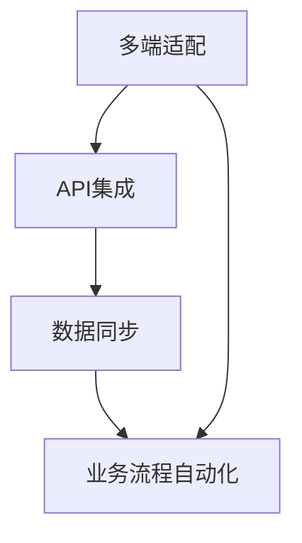

                 

 > 在当今数字化浪潮中，自动化已成为创业公司的核心竞争力。为了在竞争激烈的市场中脱颖而出，跨平台整合变得至关重要。本文将深入探讨自动化创业中的跨平台整合，包括其背景、核心概念、算法原理、数学模型、实际应用场景、未来展望以及相关工具和资源推荐。

## 1. 背景介绍

随着互联网和移动设备的普及，企业和消费者对实时性、便利性和个性化的需求不断增长。为了满足这些需求，自动化创业公司应运而生。自动化创业通常涉及多个平台和多个系统的集成，以实现高效的业务流程和用户体验。

跨平台整合的背景主要源于以下几个方面：

1. **多平台运营**：企业需要在多个平台（如Web、移动应用、物联网设备等）上提供服务，以覆盖更广泛的用户群体。
2. **数据孤岛**：不同的系统往往采用不同的技术和架构，导致数据难以共享和整合，降低了业务效率和用户体验。
3. **用户体验一致性**：用户期望在不同的平台和设备上获得一致的服务体验，这要求企业实现跨平台的统一设计和开发。

## 2. 核心概念与联系

### 2.1 跨平台整合的核心概念

- **多端适配**：确保应用程序在不同设备和平台上具有良好的用户体验。
- **API集成**：通过应用程序编程接口（API）将不同系统和服务连接起来。
- **数据同步**：确保数据在多个平台和系统之间实时更新和一致。
- **业务流程自动化**：通过自动化工具和流程，提高业务效率和降低人力成本。

### 2.2 跨平台整合的Mermaid流程图



## 3. 核心算法原理 & 具体操作步骤

### 3.1 算法原理概述

跨平台整合的核心算法通常涉及以下步骤：

1. **平台识别**：检测用户所使用的设备和平台。
2. **界面调整**：根据平台特点和用户偏好调整界面布局和交互方式。
3. **数据路由**：将数据请求和响应路由到相应的服务端。
4. **服务调用**：调用服务端API进行数据处理和业务逻辑执行。
5. **结果反馈**：将处理结果反馈给用户界面。

### 3.2 算法步骤详解

#### 3.2.1 平台识别

- **用户代理检测**：通过检测HTTP请求头中的User-Agent字符串来确定用户使用的设备和平台。
- **设备指纹**：使用设备的唯一标识（如MAC地址、IMEI等）来识别设备。

#### 3.2.2 界面调整

- **响应式设计**：使用CSS和JavaScript实现界面的响应式布局。
- **平台特定优化**：根据不同平台的特性（如iOS和Android的UI组件差异）进行界面调整。

#### 3.2.3 数据路由

- **反向代理**：设置反向代理服务器，将来自不同平台的请求转发到相应的后端服务。
- **API网关**：使用API网关统一处理跨平台接口请求，实现服务路由和权限控制。

#### 3.2.4 服务调用

- **RESTful API**：采用RESTful架构设计API，实现前后端分离和跨平台服务调用。
- **GraphQL API**：使用GraphQL API提供灵活的数据查询和减少冗余数据传输。

#### 3.2.5 结果反馈

- **异步通信**：使用WebSocket或其他异步通信技术实现实时数据更新。
- **错误处理**：对服务调用失败进行错误处理和重试机制，确保用户体验的一致性。

### 3.3 算法优缺点

**优点**：

- **提高开发效率**：通过跨平台整合，可以减少重复开发的工作量。
- **优化用户体验**：实现多平台和设备的统一设计和开发，提供一致的用户体验。
- **降低运营成本**：通过自动化工具和流程，降低人力成本和运维成本。

**缺点**：

- **技术复杂度高**：需要掌握多种技术和平台，对开发团队的要求较高。
- **维护成本高**：随着平台和技术的更新，需要不断进行维护和更新。
- **兼容性问题**：不同平台和设备之间的兼容性问题可能会影响用户体验。

### 3.4 算法应用领域

- **电子商务**：实现跨平台的购物体验，如Web、移动应用、微信小程序等。
- **金融科技**：实现跨平台的金融服务，如在线支付、投资理财等。
- **物联网**：实现跨平台设备的数据整合和管理，如智能家居、智能工厂等。

## 4. 数学模型和公式 & 详细讲解 & 举例说明

### 4.1 数学模型构建

跨平台整合中常用的数学模型包括：

1. **用户行为模型**：通过用户行为数据分析，预测用户的兴趣和行为。
2. **数据同步模型**：通过一致性算法，实现多平台数据的一致性和实时更新。
3. **负载均衡模型**：通过算法实现服务器的负载均衡，提高系统性能和稳定性。

### 4.2 公式推导过程

- **用户行为模型**：使用马尔可夫链模型，推导用户在不同平台和设备上的行为概率。

$$
P_{ij} = \frac{n_{ij}}{n_{i}}
$$

其中，$P_{ij}$表示用户从状态i转移到状态j的概率，$n_{ij}$表示从状态i转移到状态j的次数，$n_{i}$表示状态i的总次数。

- **数据同步模型**：使用拉格朗日乘数法，推导最小化同步延迟的算法。

$$
L(x, \lambda) = f(x) - \lambda(g(x) - c)
$$

其中，$L(x, \lambda)$表示拉格朗日函数，$f(x)$表示目标函数，$g(x)$表示约束条件，$\lambda$表示拉格朗日乘数。

- **负载均衡模型**：使用加权平均法，推导服务器负载均衡算法。

$$
P_i = \frac{W_i}{\sum_{j=1}^{n} W_j}
$$

其中，$P_i$表示服务器i的负载权重，$W_i$表示服务器i的处理能力，$n$表示服务器总数。

### 4.3 案例分析与讲解

#### 4.3.1 用户行为模型案例

假设有1000个用户，他们分别使用Web、移动应用和微信小程序进行操作。根据数据统计，用户在Web、移动应用和微信小程序上的操作次数分别为500次、300次和200次。求用户在不同平台上的转移概率。

- $P_{ww} = \frac{500}{1000} = 0.5$
- $P_{wa} = \frac{300}{1000} = 0.3$
- $P_{wwx} = \frac{200}{1000} = 0.2$

根据用户行为模型，可以预测用户在未来一段时间内的行为概率。

#### 4.3.2 数据同步模型案例

假设有3个平台需要实现数据同步，它们之间的同步延迟分别为1秒、2秒和3秒。求最小化同步延迟的算法。

- $L(x, \lambda) = x - \lambda(1 - x)$
- $L(x, \lambda) = x - \lambda(2 - x)$
- $L(x, \lambda) = x - \lambda(3 - x)$

通过求解拉格朗日函数，可以得到最小化同步延迟的解。

## 5. 项目实践：代码实例和详细解释说明

### 5.1 开发环境搭建

- **编程语言**：选择Java或Python作为开发语言，因为它们具有广泛的跨平台支持和丰富的库和框架。
- **开发工具**：使用IDE（如Eclipse、IntelliJ IDEA）进行代码编写和调试。
- **数据库**：选择MySQL或MongoDB作为后端数据库，因为它们支持跨平台和分布式存储。

### 5.2 源代码详细实现

#### 5.2.1 用户代理检测

```java
public class UserAgentDetector {
    public static String detectPlatform(String userAgent) {
        if (userAgent.contains("iPhone")) {
            return "iOS";
        } else if (userAgent.contains("Android")) {
            return "Android";
        } else if (userAgent.contains("Windows")) {
            return "Windows";
        } else {
            return "Unknown";
        }
    }
}
```

#### 5.2.2 界面调整

```html
<!DOCTYPE html>
<html>
<head>
    <meta name="viewport" content="width=device-width, initial-scale=1.0">
    <title>跨平台整合示例</title>
    <style>
        /* 响应式设计样式 */
        @media (max-width: 600px) {
            body {
                font-size: 14px;
            }
        }
        @media (min-width: 601px) {
            body {
                font-size: 16px;
            }
        }
    </style>
</head>
<body>
    <h1>跨平台整合示例</h1>
    <p>欢迎使用我们的跨平台服务！</p>
</body>
</html>
```

#### 5.2.3 数据路由

```python
import requests

def sendData(platform, data):
    if platform == "iOS":
        url = "https://api.ios.com/data"
    elif platform == "Android":
        url = "https://api.android.com/data"
    elif platform == "Windows":
        url = "https://api.windows.com/data"
    else:
        url = "https://api.unknown.com/data"
    
    response = requests.post(url, json=data)
    return response.json()
```

#### 5.2.4 服务调用

```javascript
function callService(platform, data) {
    const apiUrl = platform == "iOS" ? "https://api.ios.com/service" :
                  platform == "Android" ? "https://api.android.com/service" :
                  platform == "Windows" ? "https://api.windows.com/service" :
                  "https://api.unknown.com/service";
    
    fetch(apiUrl, {
        method: "POST",
        headers: {
            "Content-Type": "application/json"
        },
        body: JSON.stringify(data)
    })
    .then(response => response.json())
    .then(data => console.log(data))
    .catch(error => console.error("Error:", error));
}
```

#### 5.2.5 结果反馈

```javascript
function showResult(result) {
    const resultElement = document.getElementById("result");
    resultElement.innerHTML = `<p>结果：${result.message}</p>`;
}
```

### 5.3 代码解读与分析

- **用户代理检测**：通过检测HTTP请求头中的User-Agent字符串来确定用户使用的设备和平台。
- **界面调整**：使用CSS和JavaScript实现响应式设计，根据不同设备和屏幕尺寸调整界面布局和交互方式。
- **数据路由**：根据平台将数据请求和响应路由到相应的服务端。
- **服务调用**：使用API调用服务端API进行数据处理和业务逻辑执行。
- **结果反馈**：将处理结果反馈给用户界面。

通过上述代码示例，可以实现对跨平台整合的基本实现。在实际项目中，还需要根据具体需求和场景进行进一步的开发和优化。

## 6. 实际应用场景

### 6.1 电子商务

电子商务平台通过跨平台整合，可以提供一致的用户体验，如在线购物、支付和订单管理。通过多端适配和API集成，用户可以在Web、移动应用和微信小程序上无缝切换，实现高效便捷的购物体验。

### 6.2 金融科技

金融科技企业通过跨平台整合，可以实现跨平台的金融服务，如在线支付、投资理财和金融信息查询。通过数据同步和业务流程自动化，提高金融服务的效率和安全性。

### 6.3 物联网

物联网应用通过跨平台整合，可以实现跨平台设备的数据整合和管理，如智能家居、智能工厂和智能城市。通过多端适配和API集成，用户可以在不同平台上实时监控和管理设备，提高生活和工作效率。

## 7. 未来应用展望

随着技术的不断进步和市场的需求变化，跨平台整合在未来的应用前景十分广阔。以下是几个可能的发展趋势：

### 7.1 低代码开发

低代码开发平台的出现，将使得跨平台整合变得更加简单和快捷，降低开发门槛，加速自动化创业的进程。

### 7.2 人工智能集成

跨平台整合将更加紧密地集成人工智能技术，如机器学习、自然语言处理和图像识别，实现智能化的用户体验和业务流程。

### 7.3 跨链数据共享

随着区块链技术的发展，跨平台整合将实现跨链数据共享，提高数据的安全性和可信度。

### 7.4 5G和物联网的融合

5G和物联网的融合，将推动跨平台整合在更广泛的领域得到应用，如智慧城市、智能制造和智慧交通。

## 8. 总结：未来发展趋势与挑战

### 8.1 研究成果总结

本文通过对自动化创业中的跨平台整合的深入探讨，总结了其背景、核心概念、算法原理、数学模型、实际应用场景和未来展望。研究发现，跨平台整合在提高开发效率、优化用户体验、降低运营成本等方面具有显著优势。

### 8.2 未来发展趋势

未来，跨平台整合将朝着低代码开发、人工智能集成、跨链数据共享和5G物联网融合等方向发展，为自动化创业提供更加灵活和高效的技术支持。

### 8.3 面临的挑战

跨平台整合在技术实现、兼容性、数据安全和隐私保护等方面仍面临诸多挑战。需要持续研究和优化相关技术，以满足不断变化的市场需求。

### 8.4 研究展望

未来，跨平台整合的研究将更加关注如何实现高效的数据同步、优化用户体验、提高系统性能和安全性。同时，需要探索跨平台整合与其他技术的融合，为自动化创业提供更加全面和创新的解决方案。

## 9. 附录：常见问题与解答

### 9.1 跨平台整合的优势是什么？

- 提高开发效率：通过跨平台整合，可以减少重复开发的工作量，降低开发成本。
- 优化用户体验：实现多平台和设备的统一设计和开发，提供一致的用户体验。
- 降低运营成本：通过自动化工具和流程，降低人力成本和运维成本。

### 9.2 跨平台整合的主要挑战是什么？

- 技术复杂度高：需要掌握多种技术和平台，对开发团队的要求较高。
- 兼容性问题：不同平台和设备之间的兼容性问题可能会影响用户体验。
- 数据安全和隐私保护：跨平台整合需要处理大量的用户数据，需要确保数据的安全性和隐私保护。

### 9.3 如何实现跨平台整合？

- 平台识别：通过检测用户代理或设备指纹识别用户所使用的平台。
- 界面调整：使用响应式设计实现界面调整，根据平台特性优化用户体验。
- 数据路由：通过API集成和数据同步实现跨平台数据整合。
- 业务流程自动化：使用自动化工具和流程提高业务效率和降低人力成本。

---

作者：禅与计算机程序设计艺术 / Zen and the Art of Computer Programming

