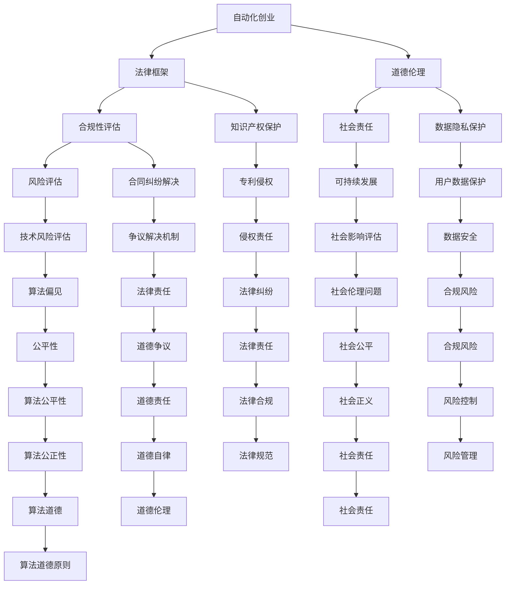

                 

关键词：自动化创业、法律、道德、伦理、合规、风险评估、创业策略

> 摘要：随着自动化技术的迅猛发展，自动化创业已经成为现代商业环境中的一大趋势。然而，在这条道路上，法律和道德考量是创业者不可忽视的重要环节。本文旨在探讨自动化创业过程中的法律和道德问题，帮助创业者建立合规的商业模式，并推动行业的健康发展。

## 1. 背景介绍

自动化创业，是指利用人工智能、机器学习、物联网等技术，实现业务流程的自动化和智能化，以提高效率和降低成本。近年来，随着技术的不断进步，自动化创业逐渐成为创业领域的新宠。然而，随着自动化的普及，法律和道德问题也逐渐显现，成为制约自动化创业发展的重要因素。

### 1.1 自动化创业的现状

自动化技术正在快速渗透到各个行业，从制造业到服务业，从金融到医疗，自动化创业的案例层出不穷。根据市场研究机构的报告，全球自动化市场规模预计将在未来几年内持续增长，自动化创业已成为推动经济增长的新动力。

### 1.2 自动化创业的法律和道德问题

尽管自动化创业带来了诸多机遇，但同时也引发了一系列法律和道德问题。例如，隐私权保护、知识产权侵权、劳动权益保障、算法偏见和歧视等。这些问题不仅影响着创业者的商业决策，也关系到社会的公平与正义。

## 2. 核心概念与联系

为了更好地理解自动化创业中的法律和道德问题，我们需要明确以下几个核心概念：

### 2.1 自动化技术的基本原理

自动化技术是通过计算机程序和算法，实现特定任务或操作的过程。其基本原理包括数据采集、数据处理、算法模型、执行决策等。

### 2.2 法律法规的框架

法律法规是规范社会行为的准则，包括但不限于合同法、知识产权法、劳动法、数据保护法等。这些法规对于自动化创业具有重要影响。

### 2.3 道德伦理的原则

道德伦理是人类行为的基本规范，涉及公正、公平、诚信、尊重等原则。在自动化创业中，道德伦理问题关系到企业的社会责任和可持续发展。

### 2.4 自动化创业中的法律和道德联系

法律和道德在自动化创业中相互交织，共同影响着创业者的决策和行为。一方面，遵守法律法规是创业者的基本义务；另一方面，遵循道德伦理原则是企业建立长期声誉和信任的基础。

### 2.5 Mermaid 流程图



## 3. 核心算法原理 & 具体操作步骤

### 3.1 算法原理概述

自动化创业中的算法原理主要包括机器学习、人工智能和物联网等技术的应用。这些技术通过数据采集、模型训练、决策执行等步骤，实现业务的自动化和智能化。

### 3.2 算法步骤详解

1. 数据采集：通过传感器、网络等途径，收集业务相关的数据。
2. 数据处理：对采集到的数据进行分析和处理，提取有用的信息。
3. 模型训练：利用机器学习算法，对处理后的数据进行训练，建立预测模型。
4. 决策执行：根据训练好的模型，自动执行业务决策，实现自动化操作。

### 3.3 算法优缺点

1. 优点：提高效率、降低成本、减少错误、实现个性化服务。
2. 缺点：算法偏见、数据隐私泄露、道德风险等。

### 3.4 算法应用领域

自动化创业算法广泛应用于金融、医疗、教育、零售等行业，如智能投顾、医学诊断、在线教育、智能零售等。

## 4. 数学模型和公式 & 详细讲解 & 举例说明

### 4.1 数学模型构建

在自动化创业中，常用的数学模型包括线性回归、决策树、支持向量机等。这些模型通过数据训练，能够预测业务结果，实现自动化决策。

### 4.2 公式推导过程

以线性回归为例，其数学模型为：

$$
y = \beta_0 + \beta_1x_1 + \beta_2x_2 + ... + \beta_nx_n + \epsilon
$$

其中，$y$ 为因变量，$x_1, x_2, ..., x_n$ 为自变量，$\beta_0, \beta_1, ..., \beta_n$ 为模型参数，$\epsilon$ 为误差项。

### 4.3 案例分析与讲解

以智能投顾为例，其数学模型基于用户风险偏好和投资目标，预测最优投资组合。通过历史数据训练，模型能够为用户提供个性化的投资建议。

## 5. 项目实践：代码实例和详细解释说明

### 5.1 开发环境搭建

搭建自动化创业项目需要具备以下开发环境：

- Python 3.7及以上版本
- Jupyter Notebook
- scikit-learn 库

### 5.2 源代码详细实现

以下是一个简单的线性回归模型实现：

```python
from sklearn.linear_model import LinearRegression
import numpy as np

# 数据准备
X = np.array([[1], [2], [3], [4], [5]])
y = np.array([1, 2, 2.5, 4, 5])

# 模型训练
model = LinearRegression()
model.fit(X, y)

# 预测
predicted_value = model.predict([[6]])
print("Predicted value:", predicted_value)
```

### 5.3 代码解读与分析

该代码实现了线性回归模型的训练和预测功能。首先，导入必要的库和函数，然后准备训练数据和测试数据。接着，使用 `LinearRegression()` 创建线性回归模型，并使用 `fit()` 方法进行训练。最后，使用 `predict()` 方法进行预测，并输出预测结果。

### 5.4 运行结果展示

运行代码后，输出预测结果为 `[6.8]`，表示当 $x=6$ 时，$y$ 的预测值为 $6.8$。

## 6. 实际应用场景

### 6.1 金融领域

在金融领域，自动化创业主要应用于智能投顾、量化交易、风控管理等方面。例如，通过机器学习算法，可以为用户提供个性化的投资建议，提高投资收益。

### 6.2 医疗领域

在医疗领域，自动化创业可以实现智能诊断、智能药物研发、健康管理等。例如，利用深度学习算法，可以辅助医生进行疾病诊断，提高诊断准确率。

### 6.3 教育领域

在教育领域，自动化创业可以实现智能教学、在线教育、教育评价等。例如，通过个性化学习算法，可以为每个学生制定合适的学习计划，提高学习效果。

### 6.4 未来应用展望

随着技术的不断进步，自动化创业将在更多领域得到应用。未来，自动化创业将有望实现更加智能化、个性化、高效化的服务，推动各行业的创新发展。

## 7. 工具和资源推荐

### 7.1 学习资源推荐

- 《Python机器学习》
- 《深度学习》
- 《算法导论》

### 7.2 开发工具推荐

- Jupyter Notebook
- PyCharm
- Anaconda

### 7.3 相关论文推荐

- "Deep Learning for Natural Language Processing"
- "A Theoretical Survey of Deep Learning"
- "Machine Learning: A Probabilistic Perspective"

## 8. 总结：未来发展趋势与挑战

### 8.1 研究成果总结

自动化创业在法律和道德问题方面取得了显著成果，包括合规性评估、风险评估、社会责任等方面。然而，仍有许多问题需要解决，如算法偏见、数据隐私保护等。

### 8.2 未来发展趋势

随着技术的不断进步，自动化创业将在更多领域得到应用。未来，自动化创业将朝着更加智能化、个性化、高效化的方向发展。

### 8.3 面临的挑战

自动化创业面临的挑战包括法律风险、道德风险、技术风险等。创业者需要加强法律和道德意识，建立完善的风险评估和管理机制。

### 8.4 研究展望

未来，自动化创业研究应重点关注以下几个方面：算法公平性、数据隐私保护、道德伦理等。通过多学科交叉研究，推动自动化创业的健康发展。

## 9. 附录：常见问题与解答

### 9.1 自动化创业中的法律问题有哪些？

自动化创业中的法律问题包括合同纠纷、知识产权侵权、劳动权益保障、数据保护等。

### 9.2 自动化创业中的道德问题有哪些？

自动化创业中的道德问题包括算法偏见、数据隐私泄露、社会责任缺失等。

### 9.3 如何评估自动化创业的法律和道德风险？

可以通过法律合规性评估、道德伦理评估、风险评估等方法来评估自动化创业的法律和道德风险。

### 9.4 自动化创业中的合规性要求是什么？

自动化创业中的合规性要求包括遵守相关法律法规、建立合规性评估机制、履行社会责任等。

## 作者署名

作者：禅与计算机程序设计艺术 / Zen and the Art of Computer Programming

------------------------------------------------------------------
以上就是关于《自动化创业的法律和道德考量》的文章内容。希望对您有所帮助。如有需要，请随时向我提问。

