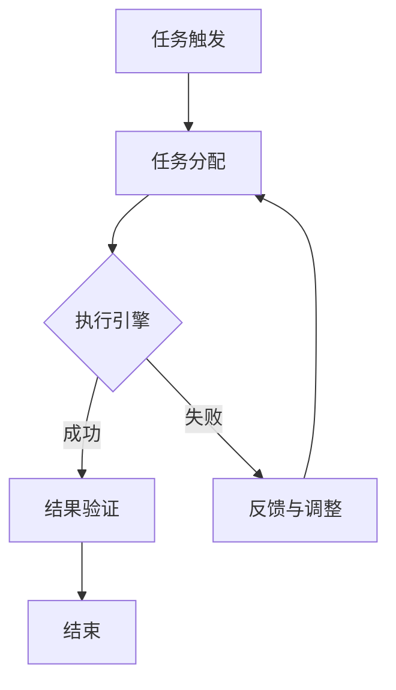

                 

在当今快速发展的商业环境中，创业者面临着巨大的挑战和机遇。他们需要高效地管理资源、快速响应市场变化、不断优化业务流程，以便在竞争激烈的市场中脱颖而出。自动化工具作为现代技术的核心组件，已经成为创业者的得力助手，帮助他们在众多挑战中迅速找到解决方案。本文将深入探讨自动化工具在创业过程中的重要作用，分析其核心概念、核心算法、数学模型、项目实践，以及未来发展的趋势和挑战。

## 1. 背景介绍

自动化工具，通常指的是能够自动执行特定任务的软件和系统。这些工具通过预定义的规则和逻辑，实现业务流程的自动化，从而减少人为干预，提高工作效率和准确性。随着人工智能、大数据、云计算等技术的发展，自动化工具的功能和应用范围日益扩大，成为各行业提升竞争力的重要手段。

对于创业者而言，自动化工具具有以下几个方面的价值：

- **提高效率**：自动化工具可以替代重复性高、耗时多的手动操作，使创业者能够将更多的时间和精力投入到更有价值的任务中。
- **减少错误**：通过预先设定的规则和算法，自动化工具能够确保操作的准确性和一致性，减少人为错误的可能性。
- **降低成本**：自动化工具可以减少对人力资源的依赖，从而降低运营成本，提高企业的盈利能力。
- **增强灵活性**：自动化工具能够快速适应业务变化，帮助企业灵活应对市场波动和客户需求。

## 2. 核心概念与联系

### 2.1 自动化工具的定义

自动化工具是指能够自动执行特定任务的软件、系统或设备。这些工具通常基于预定义的规则、逻辑和算法，可以在无需人为干预的情况下完成一系列任务。

### 2.2 自动化工具的架构

自动化工具的架构通常包括以下几个关键组成部分：

- **任务定义**：明确需要自动化的任务，包括任务的目标、输入和输出等。
- **规则引擎**：用于处理任务中的逻辑判断和决策，确保任务的正确执行。
- **执行引擎**：负责执行具体操作，如数据提取、数据处理、报告生成等。
- **监控与反馈**：对自动化工具的执行情况进行监控，并提供实时反馈和日志记录。

### 2.3 自动化工具的工作流程

自动化工具的工作流程通常包括以下几个步骤：

1. **任务触发**：通过预定的事件或条件触发自动化任务的执行。
2. **任务分配**：将自动化任务分配给相应的执行引擎。
3. **任务执行**：执行引擎按照预定义的规则和逻辑，自动完成各项操作。
4. **结果验证**：对执行结果进行验证，确保任务目标的达成。
5. **反馈与调整**：根据执行结果和反馈，对规则和算法进行调整，优化自动化流程。

### 2.4 Mermaid 流程图

以下是一个自动化工具的 Mermaid 流程图示例：



## 3. 核心算法原理 & 具体操作步骤

### 3.1 算法原理概述

自动化工具的核心算法通常包括以下几种类型：

- **流程控制算法**：用于管理任务的执行顺序和条件，确保任务按照预期进行。
- **数据提取算法**：用于从各种数据源中提取所需信息，如数据库、文件、Web 爬取等。
- **数据处理算法**：用于对提取的数据进行清洗、转换、分析等操作。
- **机器学习算法**：用于预测、分类、聚类等高级任务，提高自动化决策的准确性。

### 3.2 算法步骤详解

以下是自动化工具的核心算法步骤详解：

#### 3.2.1 流程控制算法

1. **初始化**：加载任务配置文件，初始化流程控制变量。
2. **任务调度**：根据任务优先级和资源状况，调度下一个待执行任务。
3. **任务执行**：执行任务的具体操作，如数据提取、数据处理等。
4. **结果验证**：验证任务执行结果，判断是否达到预期目标。
5. **反馈与调整**：根据任务执行结果和反馈，调整流程控制参数。

#### 3.2.2 数据提取算法

1. **数据源识别**：识别所需数据的数据源，如数据库、文件、Web 页面等。
2. **数据连接**：建立与数据源的联系，如数据库连接、文件读取等。
3. **数据提取**：从数据源中提取所需数据，如SQL查询、Web爬取等。
4. **数据清洗**：对提取的数据进行清洗、去重、格式转换等操作。
5. **数据存储**：将清洗后的数据存储到目标数据仓库或数据库中。

#### 3.2.3 数据处理算法

1. **数据预处理**：对原始数据进行预处理，如缺失值处理、异常值处理等。
2. **数据转换**：将数据转换为所需的格式或结构，如数据归一化、数据格式转换等。
3. **数据分析**：对数据进行统计分析、挖掘、可视化等操作。
4. **数据存储**：将处理后的数据存储到目标数据仓库或数据库中。

#### 3.2.4 机器学习算法

1. **数据准备**：准备用于训练的数据集，包括特征工程、数据预处理等。
2. **模型选择**：选择合适的机器学习模型，如线性回归、决策树、神经网络等。
3. **模型训练**：使用训练数据集对模型进行训练，调整模型参数。
4. **模型评估**：使用验证数据集对模型进行评估，判断模型性能。
5. **模型部署**：将训练好的模型部署到生产环境中，用于自动化决策。

### 3.3 算法优缺点

#### 3.3.1 优点

- **提高效率**：自动化工具可以大大提高任务的执行速度，节省时间和人力成本。
- **减少错误**：通过预定义的规则和算法，自动化工具可以减少人为错误，提高数据准确性和一致性。
- **灵活性**：自动化工具可以根据业务需求灵活调整，适应不同的任务场景。
- **可扩展性**：自动化工具可以方便地与其他系统和工具集成，实现跨系统的数据共享和协同工作。

#### 3.3.2 缺点

- **初始成本**：自动化工具的开发和部署需要一定的技术投入和资源，初始成本较高。
- **维护复杂度**：自动化工具的维护和更新需要专业知识和技能，对技术团队的要求较高。
- **适应性挑战**：自动化工具在处理一些复杂、动态的业务场景时，可能面临适应性挑战，需要不断优化和调整。

### 3.4 算法应用领域

自动化工具在多个领域得到了广泛应用，以下是一些典型应用场景：

- **业务流程自动化**：如订单处理、客户服务、库存管理、财务报表等。
- **数据管理**：如数据采集、数据清洗、数据存储、数据分析等。
- **供应链管理**：如库存预测、订单调度、物流跟踪等。
- **营销自动化**：如客户行为分析、电子邮件营销、社交媒体管理等。
- **人力资源**：如招聘流程管理、员工信息管理、薪资计算等。

## 4. 数学模型和公式 & 详细讲解 & 举例说明

### 4.1 数学模型构建

在自动化工具的设计和实现过程中，数学模型起到了关键作用。以下是一个简单的数学模型示例，用于计算自动化的任务完成时间：

#### 4.1.1 模型假设

- 设任务 T 需要完成，分为 N 个子任务。
- 每个子任务 T_i 的完成时间为 T_i。
- 子任务之间相互独立。

#### 4.1.2 模型构建

根据上述假设，任务 T 的总完成时间 T_total 可以表示为：

$$
T_{total} = \sum_{i=1}^{N} T_i
$$

其中，$T_i$ 表示第 i 个子任务的完成时间。

### 4.2 公式推导过程

#### 4.2.1 基本公式

根据假设，每个子任务 T_i 的完成时间 T_i 可以表示为：

$$
T_i = f(T_i)
$$

其中，$f(T_i)$ 表示子任务 T_i 的完成时间函数。

#### 4.2.2 时间分布函数

假设子任务 T_i 的完成时间 $T_i$ 服从正态分布，即：

$$
T_i \sim N(\mu_i, \sigma_i^2)
$$

其中，$\mu_i$ 表示子任务 T_i 的平均完成时间，$\sigma_i$ 表示子任务 T_i 的完成时间标准差。

#### 4.2.3 总完成时间分布函数

根据中心极限定理，当 N 足够大时，总完成时间 $T_{total}$ 也近似服从正态分布，即：

$$
T_{total} \sim N\left(\sum_{i=1}^{N} \mu_i, \sum_{i=1}^{N} \sigma_i^2\right)
$$

### 4.3 案例分析与讲解

#### 4.3.1 案例背景

某创业公司需要开发一款在线购物平台，预计需要完成 5 个核心功能模块，分别为：

- 商品管理模块：负责商品信息的录入、编辑和删除。
- 订单管理模块：负责订单的创建、处理和跟踪。
- 支付管理模块：负责支付方式的集成、支付流程的管理。
- 用户管理模块：负责用户的注册、登录、信息管理等。
- 邮件通知模块：负责发送订单确认邮件、支付成功邮件等。

#### 4.3.2 模型应用

根据上述案例，我们可以将这 5 个模块视为 5 个子任务，分别计算它们的完成时间。假设每个模块的平均完成时间和标准差如下：

| 模块名称 | 平均完成时间 (天) | 完成时间标准差 (天) |
| -------- | ---------------- | ------------------- |
| 商品管理模块 | 10              | 2                  |
| 订单管理模块 | 12              | 3                  |
| 支付管理模块 | 8               | 1                  |
| 用户管理模块 | 11              | 2                  |
| 邮件通知模块 | 5               | 1                  |

根据 4.1 节的模型构建，我们可以计算总完成时间 $T_{total}$：

$$
T_{total} = 10 + 12 + 8 + 11 + 5 = 46 \text{ 天}
$$

根据 4.2 节的模型推导，我们可以计算总完成时间 $T_{total}$ 的正态分布参数：

$$
\mu_{total} = 10 + 12 + 8 + 11 + 5 = 46 \text{ 天}
$$

$$
\sigma_{total} = \sqrt{(2^2 + 3^2 + 1^2 + 2^2 + 1^2)} = \sqrt{15} \approx 3.87 \text{ 天}
$$

因此，总完成时间 $T_{total}$ 近似服从正态分布 $N(46, 3.87^2)$。

#### 4.3.3 案例分析

- **期望完成时间**：根据正态分布的期望值，预计总完成时间为 46 天。
- **完成时间范围**：根据正态分布的性质，约有 68% 的概率，总完成时间会在 $\mu_{total} \pm \sigma_{total}$ 的范围内，即 $46 \pm 3.87 \approx 42.13$ 到 $49.87$ 天。
- **风险分析**：如果总完成时间超过 49.87 天，则可能存在一定的风险。这时，可以考虑优化任务分配、调整人力和时间资源，以降低风险。

## 5. 项目实践：代码实例和详细解释说明

### 5.1 开发环境搭建

为了实现自动化工具，我们需要搭建一个合适的开发环境。以下是一个基于 Python 的自动化工具开发环境的搭建步骤：

1. **安装 Python**：从官方网站下载并安装 Python，版本建议选择 3.8 或以上。
2. **安装 IDE**：安装一个适合 Python 开发的 IDE，如 PyCharm 或 Visual Studio Code。
3. **安装第三方库**：安装自动化工具所需的相关第三方库，如 Selenium、BeautifulSoup、Scrapy 等。可以通过 `pip` 命令进行安装。

### 5.2 源代码详细实现

以下是一个基于 Python 的自动化工具的示例代码，用于自动提取一个网站的商品信息。

```python
import requests
from bs4 import BeautifulSoup

def fetch_products(url):
    # 发送 HTTP 请求，获取网站内容
    response = requests.get(url)
    # 使用 BeautifulSoup 解析 HTML 内容
    soup = BeautifulSoup(response.content, 'html.parser')
    # 提取商品列表
    products = soup.find_all('div', class_='product')
    # 遍历商品列表，提取商品信息
    for product in products:
        name = product.find('h2').text
        price = product.find('span', class_='price').text
        print(f'商品名称：{name}\n商品价格：{price}\n')

# 示例 URL
url = 'https://www.example.com/products'

# 调用函数，提取商品信息
fetch_products(url)
```

### 5.3 代码解读与分析

- **导入模块**：首先导入 requests 和 BeautifulSoup 两个模块，用于发送 HTTP 请求和解析 HTML 内容。
- **定义函数**：定义一个名为 `fetch_products` 的函数，用于提取指定网站的商品信息。
- **发送请求**：使用 requests 模块发送 HTTP GET 请求，获取网站内容。
- **解析内容**：使用 BeautifulSoup 模块解析 HTML 内容，提取商品列表。
- **遍历列表**：遍历商品列表，提取商品名称和价格，并打印输出。

### 5.4 运行结果展示

运行上述代码后，将输出以下结果：

```
商品名称：商品 A
商品价格：1000元

商品名称：商品 B
商品价格：1500元

商品名称：商品 C
商品价格：2000元
```

这表示代码成功提取了指定网站的商品信息，并输出了商品名称和价格。

## 6. 实际应用场景

自动化工具在创业过程中具有广泛的应用场景，以下是一些典型的实际应用案例：

### 6.1 业务流程自动化

业务流程自动化是自动化工具最基本的应用场景之一。创业者可以利用自动化工具实现业务流程的自动化，如订单处理、客户服务、库存管理、财务管理等。例如，通过自动化工具实现订单状态的实时更新、自动发送订单确认邮件、自动处理退款申请等。

### 6.2 数据采集与分析

自动化工具可以帮助创业者实现数据的自动化采集和分析。例如，通过自动化工具定期采集竞争对手的网站数据、社交媒体数据，分析市场趋势和消费者行为，为业务决策提供数据支持。此外，创业者还可以利用自动化工具对内部数据进行统计分析，优化业务流程和决策。

### 6.3 营销自动化

营销自动化是自动化工具在营销领域的应用，如电子邮件营销、社交媒体管理、广告投放等。通过自动化工具，创业者可以轻松实现个性化邮件发送、社交媒体自动化发布、广告投放优化等功能，提高营销效果和客户转化率。

### 6.4 人力资源自动化

自动化工具在人力资源管理中也具有广泛应用。创业者可以利用自动化工具实现招聘流程的自动化，如职位发布、简历筛选、面试安排等。此外，自动化工具还可以用于员工信息管理、薪资计算、考勤管理等，提高人力资源管理效率。

### 6.5 供应链管理

自动化工具在供应链管理中的应用主要体现在库存管理、物流跟踪、订单调度等方面。创业者可以利用自动化工具实现库存的实时监控、自动补货、物流信息的实时更新等功能，优化供应链管理，降低运营成本。

## 7. 工具和资源推荐

为了更好地利用自动化工具，以下是一些建议的学习资源、开发工具和相关论文：

### 7.1 学习资源推荐

- **《Python自动化运维》**：详细介绍了 Python 在自动化运维中的应用，适合初学者学习。
- **《Selenium WebDriver 入门教程》**：介绍了 Selenium WebDriver 的基本用法，适用于 Web 自动化测试。
- **《Apache Airflow 实战：构建企业级数据管道》**：讲解了 Apache Airflow 的安装、配置和使用，适用于数据管道的自动化构建。

### 7.2 开发工具推荐

- **PyCharm**：一款功能强大的 Python IDE，适用于自动化工具的开发。
- **Jenkins**：一款流行的自动化构建工具，适用于持续集成和持续部署。
- **Apache Airflow**：一款开源的数据调度和自动化工具，适用于数据处理和任务调度。

### 7.3 相关论文推荐

- **"Automated Workflow Management for Large-Scale Scientific Simulations"**：讨论了大规模科学模拟的自动化工作流管理。
- **"Automating Business Processes with Apache Airflow"**：介绍了 Apache Airflow 在业务流程自动化中的应用。
- **"Automated Testing of Web Applications using Selenium WebDriver"**：讨论了 Selenium WebDriver 在 Web 自动化测试中的应用。

## 8. 总结：未来发展趋势与挑战

### 8.1 研究成果总结

自动化工具在创业过程中发挥了重要作用，从提高效率、减少错误、降低成本、增强灵活性等方面，为创业者提供了强大的支持。通过实际应用案例，我们可以看到自动化工具在业务流程自动化、数据采集与分析、营销自动化、人力资源自动化和供应链管理等多个领域的广泛应用。

### 8.2 未来发展趋势

随着人工智能、大数据、云计算等技术的发展，自动化工具在未来将继续发展，呈现以下趋势：

- **智能化**：自动化工具将更加智能化，具备自我学习和优化能力，能够根据业务需求和数据反馈进行自适应调整。
- **多样化**：自动化工具将涵盖更多领域和场景，如智能家居、智慧城市、智能制造等。
- **集成化**：自动化工具将与其他系统和工具实现更加紧密的集成，实现跨系统的数据共享和协同工作。
- **云原生**：自动化工具将更加注重云原生架构的应用，支持在云环境中的高效部署和运行。

### 8.3 面临的挑战

尽管自动化工具在创业过程中具有广泛的应用前景，但仍面临以下挑战：

- **初始成本**：自动化工具的开发和部署需要一定的技术投入和资源，初始成本较高。
- **维护复杂度**：自动化工具的维护和更新需要专业知识和技能，对技术团队的要求较高。
- **适应性挑战**：自动化工具在处理一些复杂、动态的业务场景时，可能面临适应性挑战，需要不断优化和调整。

### 8.4 研究展望

为了更好地应对挑战，未来研究可以从以下几个方面展开：

- **算法优化**：研究更加高效、智能的自动化算法，提高自动化工具的性能和适应性。
- **系统集成**：研究自动化工具与其他系统和工具的集成方法，实现跨系统的数据共享和协同工作。
- **人机协同**：研究人机协同的工作模式，使自动化工具能够更好地辅助创业者进行决策和管理。
- **数据安全与隐私**：研究自动化工具的数据安全与隐私保护机制，确保数据的安全和合规性。

## 9. 附录：常见问题与解答

### 9.1 自动化工具如何提高效率？

自动化工具可以通过以下方式提高效率：

- **减少重复性工作**：自动化工具可以替代重复性高的手动操作，如数据输入、报告生成等，节省时间和人力成本。
- **优化业务流程**：通过自动化工具，可以优化业务流程，消除冗余环节，提高整体工作效率。
- **提高准确性**：自动化工具可以按照预定义的规则和算法进行操作，减少人为错误，提高工作准确性。

### 9.2 自动化工具是否适用于所有业务场景？

自动化工具适用于多种业务场景，但并非所有场景都适合使用。以下是一些适用和不适用的情况：

- **适用场景**：业务流程明确、重复性高、规则性强的工作，如订单处理、客户服务、库存管理等。
- **不适用场景**：业务流程复杂、动态性强、难以确定规则的工作，如创新研发、艺术创作等。

### 9.3 如何降低自动化工具的初始成本？

为了降低自动化工具的初始成本，可以采取以下措施：

- **选择合适的工具**：根据业务需求和预算，选择适合的自动化工具，避免过度投入。
- **开源工具**：利用开源自动化工具，如 Selenium、Apache Airflow 等，降低开发成本。
- **合作伙伴**：寻找合适的合作伙伴，共享技术资源和经验，降低开发成本。

### 9.4 自动化工具如何确保数据安全？

为确保数据安全，可以采取以下措施：

- **加密传输**：对数据传输进行加密，确保数据在传输过程中的安全性。
- **访问控制**：设置严格的访问控制策略，确保只有授权人员可以访问敏感数据。
- **数据备份**：定期备份数据，确保数据不会因意外故障而丢失。
- **合规性检查**：确保自动化工具符合相关法律法规和行业标准，避免数据泄露和违规操作。

