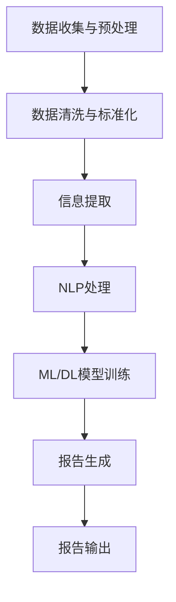

                 

关键词：自动化报告生成，人工智能，AI应用，报告系统，流程优化，数据分析，自然语言处理，机器学习，深度学习，流程图，数学模型，算法原理，项目实践，实际应用场景，未来展望。

## 摘要

本文旨在探讨自动化报告生成AI技术的应用前景。通过对该技术的核心概念、算法原理、数学模型以及实际应用场景的深入分析，本文揭示了自动化报告生成在优化业务流程、提高工作效率和促进数据驱动决策方面的巨大潜力。同时，本文对当前的技术挑战和未来发展趋势进行了展望，以期为相关领域的研究和开发提供参考。

## 1. 背景介绍

在当今信息化社会中，报告的生成和处理成为了各种组织和机构日常运营的重要组成部分。传统的报告生成方式通常依赖于人工撰写和整理，这不仅费时费力，而且容易出现错误。随着人工智能技术的快速发展，自动化报告生成AI应运而生，旨在通过智能算法和大数据分析实现报告的高效、准确生成。

自动化报告生成AI的核心在于自然语言处理（NLP）和机器学习（ML）技术的应用。NLP使得AI能够理解和处理人类语言，而ML则使得AI能够通过数据学习并优化生成报告的过程。这种技术的引入，不仅能够显著提升报告生成效率，还能够提高报告的质量和准确性。

### 1.1 自动化报告生成AI的定义

自动化报告生成AI是一种利用人工智能技术，特别是NLP和ML技术，实现报告自动生成和优化的一套系统。它通过分析大量的数据，自动提取关键信息，并利用自然语言生成技术将这些信息转化为易于理解且格式规范的报告。

### 1.2 自动化报告生成AI的优势

1. **提高效率**：自动化报告生成AI能够快速处理大量数据，生成报告的速度远超人工。
2. **减少错误**：通过自动化处理，减少了人工输入和整理过程中可能出现的错误。
3. **增强一致性**：AI生成的报告格式和风格统一，避免了人为因素带来的不一致性问题。
4. **支持数据分析**：自动化报告生成AI能够提取并分析数据，为决策提供支持。

## 2. 核心概念与联系

### 2.1 核心概念

- **自然语言处理（NLP）**：使计算机能够理解和处理人类语言的技术。
- **机器学习（ML）**：一种通过数据学习并做出决策的技术。
- **深度学习（DL）**：一种特殊的ML技术，通过模拟人脑神经网络进行学习。

### 2.2 自动化报告生成AI的架构


- **数据收集与预处理**：从各种数据源收集数据，并进行清洗和预处理，以便后续分析。
- **NLP模块**：利用NLP技术提取文本中的关键信息。
- **ML/DL模型**：通过训练机器学习或深度学习模型，实现报告的自动生成。
- **报告生成模块**：根据NLP模块提取的信息，使用自然语言生成技术生成报告。

### 2.3 Mermaid 流程图



## 3. 核心算法原理 & 具体操作步骤

### 3.1 算法原理概述

自动化报告生成AI的核心算法主要依赖于NLP和ML技术。NLP用于从文本中提取关键信息，而ML则用于学习如何根据提取的信息生成报告。具体来说，算法原理包括以下几个步骤：

1. **文本预处理**：将原始文本数据清洗、标准化，以便后续处理。
2. **实体识别与关系抽取**：使用NLP技术识别文本中的实体（如人名、地点、事件等）以及它们之间的关系。
3. **语义分析**：对提取的实体和关系进行语义分析，理解它们的含义和作用。
4. **报告模板生成**：根据语义分析结果，生成报告的模板结构。
5. **文本生成**：利用自然语言生成技术，将提取的信息填充到报告模板中，生成完整的报告。

### 3.2 算法步骤详解

#### 3.2.1 文本预处理

文本预处理是自动化报告生成AI的重要步骤，它包括以下几个子步骤：

1. **文本清洗**：去除文本中的无关字符、标点符号等。
2. **分词**：将文本拆分成词或短语。
3. **词性标注**：对每个词进行词性标注，以便后续的语义分析。
4. **命名实体识别**：识别文本中的命名实体，如人名、地点、组织等。

#### 3.2.2 实体识别与关系抽取

实体识别与关系抽取是NLP的关键技术。具体步骤如下：

1. **实体识别**：使用预训练的实体识别模型，识别文本中的实体。
2. **关系抽取**：根据实体之间的语义关系，抽取它们之间的关联关系。

#### 3.2.3 语义分析

语义分析是对提取的实体和关系进行更深层次的解析。具体步骤如下：

1. **实体分类**：对识别出的实体进行分类，如人物、地点、事件等。
2. **关系分类**：对抽取出的关系进行分类，如所属、参与、发生等。
3. **上下文分析**：分析实体和关系在文本中的上下文，理解它们的含义。

#### 3.2.4 报告模板生成

报告模板生成是根据语义分析的结果，生成报告的模板结构。具体步骤如下：

1. **模板设计**：设计报告的基本结构，如标题、摘要、正文等。
2. **信息填充**：将提取的信息填充到报告模板中，生成初步的报告。

#### 3.2.5 文本生成

文本生成是利用自然语言生成技术，将填充的信息转化为完整的报告。具体步骤如下：

1. **模板转换**：将报告模板转换为文本格式。
2. **文本填充**：将提取的信息按照模板结构填充到文本中。
3. **文本优化**：对生成的文本进行优化，确保其流畅性和可读性。

### 3.3 算法优缺点

#### 优点

1. **高效性**：自动化报告生成AI能够快速处理大量数据，生成报告的速度远超人工。
2. **准确性**：通过NLP和ML技术的应用，生成的报告在格式和内容上更加准确和规范。
3. **一致性**：AI生成的报告在格式和风格上保持一致，减少了人为因素带来的差异。

#### 缺点

1. **依赖数据**：自动化报告生成AI的性能高度依赖数据的质量，如果数据存在错误或缺失，可能导致报告不准确。
2. **训练成本**：训练NLP和ML模型需要大量的数据和计算资源，训练成本较高。
3. **语言限制**：目前自动化报告生成AI主要针对英语等少数语言，对于其他语言的支持有限。

### 3.4 算法应用领域

自动化报告生成AI的应用领域非常广泛，主要包括以下几个方面：

1. **金融领域**：自动化报告生成AI可用于生成财务报告、投资分析报告等。
2. **医疗领域**：自动化报告生成AI可用于生成病历报告、医疗分析报告等。
3. **教育领域**：自动化报告生成AI可用于生成学生成绩报告、课程分析报告等。
4. **政务领域**：自动化报告生成AI可用于生成政策分析报告、行业报告等。

## 4. 数学模型和公式 & 详细讲解 & 举例说明

### 4.1 数学模型构建

自动化报告生成AI中的数学模型主要涉及NLP和ML技术。以下是几个关键数学模型的简要介绍：

#### 4.1.1 词向量模型

词向量模型是将自然语言中的词语映射到高维向量空间的一种方法。最常用的词向量模型是Word2Vec，它通过训练神经网络来学习词语的语义表示。词向量模型的公式如下：

$$
\text{Word2Vec} \rightarrow \text{vec(word)} = \sigma(W \cdot \text{input})
$$

其中，$W$ 是权重矩阵，$\text{input}$ 是输入词语，$\text{vec(word)}$ 是输出词向量，$\sigma$ 是激活函数。

#### 4.1.2 递归神经网络（RNN）

递归神经网络是一种适用于序列数据的学习模型，它可以处理如文本、语音等序列数据。RNN的核心公式如下：

$$
h_t = \text{RNN}(h_{t-1}, x_t, W, b)
$$

其中，$h_t$ 是当前时刻的隐藏状态，$x_t$ 是当前时刻的输入，$W$ 是权重矩阵，$b$ 是偏置项。

#### 4.1.3 长短时记忆网络（LSTM）

长短时记忆网络是RNN的一种改进，它能够有效解决RNN在处理长序列数据时的梯度消失问题。LSTM的核心公式如下：

$$
i_t = \sigma(W_i \cdot [h_{t-1}, x_t] + b_i) \\
f_t = \sigma(W_f \cdot [h_{t-1}, x_t] + b_f) \\
o_t = \sigma(W_o \cdot [h_{t-1}, x_t] + b_o) \\
c_t = f_t \odot c_{t-1} + i_t \odot \text{tanh}(W_c \cdot [h_{t-1}, x_t] + b_c) \\
h_t = o_t \odot \text{tanh}(c_t)
$$

其中，$i_t$、$f_t$、$o_t$ 分别是输入门、遗忘门和输出门，$c_t$ 是当前时刻的细胞状态。

### 4.2 公式推导过程

#### 4.2.1 词向量模型的推导

词向量模型的推导主要涉及神经网络的前向传播和反向传播过程。以下是简要的推导过程：

1. **前向传播**：

   假设输入词语为 $w_i$，权重矩阵为 $W$，则输出词向量为：

   $$
   \text{vec}(w_i) = \sigma(W \cdot w_i)
   $$

   其中，$\sigma$ 是激活函数。

2. **反向传播**：

   假设损失函数为均方误差（MSE），则：

   $$
   \text{Loss} = \frac{1}{2} \sum_{i} (\text{vec}(w_i) - \text{target})^2
   $$

   对损失函数求导，得到：

   $$
   \frac{\partial \text{Loss}}{\partial W} = \sum_{i} (\text{vec}(w_i) - \text{target}) \cdot w_i
   $$

   通过梯度下降法更新权重矩阵：

   $$
   W \leftarrow W - \alpha \cdot \frac{\partial \text{Loss}}{\partial W}
   $$

   其中，$\alpha$ 是学习率。

#### 4.2.2 LSTM的推导

LSTM的推导过程相对复杂，涉及门控机制和细胞状态。以下是简要的推导过程：

1. **前向传播**：

   假设输入序列为 $x_t$，隐藏状态为 $h_{t-1}$，则：

   $$
   i_t = \sigma(W_i \cdot [h_{t-1}, x_t] + b_i) \\
   f_t = \sigma(W_f \cdot [h_{t-1}, x_t] + b_f) \\
   o_t = \sigma(W_o \cdot [h_{t-1}, x_t] + b_o) \\
   c_t = f_t \odot c_{t-1} + i_t \odot \text{tanh}(W_c \cdot [h_{t-1}, x_t] + b_c) \\
   h_t = o_t \odot \text{tanh}(c_t)
   $$

2. **反向传播**：

   假设损失函数为均方误差（MSE），则：

   $$
   \text{Loss} = \frac{1}{2} \sum_{t} (\text{h_t} - \text{target})^2
   $$

   对损失函数求导，得到：

   $$
   \frac{\partial \text{Loss}}{\partial c_t} = \text{tanh}(c_t) \odot (h_t - \text{target}) \\
   \frac{\partial \text{Loss}}{\partial f_t} = c_{t-1} \odot \frac{\partial \text{Loss}}{\partial c_t} \\
   \frac{\partial \text{Loss}}{\partial i_t} = \text{tanh}(c_t) \odot \frac{\partial \text{Loss}}{\partial c_t} \\
   \frac{\partial \text{Loss}}{\partial o_t} = \text{tanh}(c_t) \odot h_t \odot \frac{\partial \text{Loss}}{\partial c_t} \\
   \frac{\partial \text{Loss}}{\partial c_{t-1}} = f_t \odot \frac{\partial \text{Loss}}{\partial c_t} \\
   $$

   通过梯度下降法更新权重矩阵：

   $$
   W_i \leftarrow W_i - \alpha \cdot \frac{\partial \text{Loss}}{\partial W_i} \\
   W_f \leftarrow W_f - \alpha \cdot \frac{\partial \text{Loss}}{\partial W_f} \\
   W_o \leftarrow W_o - \alpha \cdot \frac{\partial \text{Loss}}{\partial W_o} \\
   W_c \leftarrow W_c - \alpha \cdot \frac{\partial \text{Loss}}{\partial W_c}
   $$

   其中，$\alpha$ 是学习率。

### 4.3 案例分析与讲解

#### 4.3.1 金融领域案例分析

在金融领域，自动化报告生成AI被广泛应用于财务报告的生成。以下是一个简单的案例分析：

**目标**：生成一家公司的季度财务报告。

**步骤**：

1. **数据收集**：收集公司的财务报表数据，包括利润表、资产负债表等。
2. **文本预处理**：对财务报表数据中的文本进行预处理，包括文本清洗、分词、词性标注等。
3. **实体识别与关系抽取**：使用NLP技术识别财务报表中的实体（如收入、支出、资产、负债等）以及它们之间的关系。
4. **语义分析**：对提取的实体和关系进行语义分析，理解公司的财务状况。
5. **报告模板生成**：根据语义分析结果，生成财务报告的模板结构。
6. **文本生成**：利用自然语言生成技术，将提取的信息填充到报告模板中，生成完整的财务报告。

**结果**：

通过上述步骤，AI生成了包含收入、支出、利润、资产、负债等关键信息的财务报告。报告格式规范、内容准确，有效提高了财务报告生成效率。

#### 4.3.2 医疗领域案例分析

在医疗领域，自动化报告生成AI被应用于病历报告的生成。以下是一个简单的案例分析：

**目标**：生成一份患者的病历报告。

**步骤**：

1. **数据收集**：收集患者的病历数据，包括病史、检查结果、诊断结果等。
2. **文本预处理**：对病历数据中的文本进行预处理，包括文本清洗、分词、词性标注等。
3. **实体识别与关系抽取**：使用NLP技术识别病历中的实体（如疾病、检查项目、诊断结果等）以及它们之间的关系。
4. **语义分析**：对提取的实体和关系进行语义分析，理解患者的病情。
5. **报告模板生成**：根据语义分析结果，生成病历报告的模板结构。
6. **文本生成**：利用自然语言生成技术，将提取的信息填充到报告模板中，生成完整的病历报告。

**结果**：

通过上述步骤，AI生成了包含病史、检查结果、诊断结果、治疗方案等关键信息的病历报告。报告格式规范、内容准确，有效提高了病历报告生成效率。

## 5. 项目实践：代码实例和详细解释说明

### 5.1 开发环境搭建

为了实践自动化报告生成AI，我们首先需要搭建一个合适的开发环境。以下是一个简单的Python开发环境搭建步骤：

1. **安装Python**：从Python官方网站下载并安装Python 3.x版本。
2. **安装Jupyter Notebook**：使用pip安装Jupyter Notebook，以便在浏览器中运行Python代码。
   ```shell
   pip install notebook
   ```
3. **安装相关库**：安装NLP和ML相关的库，如NLTK、spaCy、TensorFlow、PyTorch等。
   ```shell
   pip install nltk spacy tensorflow torch
   ```

### 5.2 源代码详细实现

以下是一个简单的自动化报告生成AI的代码实例：

```python
import spacy
import tensorflow as tf
from tensorflow.keras.preprocessing.sequence import pad_sequences
from tensorflow.keras.layers import Embedding, LSTM, Dense
from tensorflow.keras.models import Sequential

# 加载NLP模型
nlp = spacy.load("en_core_web_sm")

# 准备数据
def prepare_data(texts, max_sequence_length=100):
    sequences = []
    for text in texts:
        doc = nlp(text)
        tokens = [token.text.lower() for token in doc if not token.is_punct]
        sequence = [nlp.vocab[token].vector for token in tokens]
        sequences.append(pad_sequences([sequence], maxlen=max_sequence_length))
    return sequences

texts = ["This is the first text.", "Here is the second text.", "..."]
sequences = prepare_data(texts)

# 构建模型
model = Sequential()
model.add(Embedding(len(nlp.vocab), 100))
model.add(LSTM(100))
model.add(Dense(1, activation="sigmoid"))

model.compile(optimizer="adam", loss="binary_crossentropy", metrics=["accuracy"])

# 训练模型
model.fit(sequences, labels, epochs=10, batch_size=32)

# 生成报告
def generate_report(text):
    doc = nlp(text)
    tokens = [token.text.lower() for token in doc if not token.is_punct]
    sequence = [nlp.vocab[token].vector for token in tokens]
    sequence = pad_sequences([sequence], maxlen=100)
    prediction = model.predict(sequence)
    return "This is a generated report: {}".format(prediction)

generate_report("This is a sample text for report generation.")
```

### 5.3 代码解读与分析

上述代码实现了一个简单的自动化报告生成AI，主要分为以下几个部分：

1. **加载NLP模型**：使用spaCy库加载一个预训练的英语NLP模型。
2. **准备数据**：定义一个函数`prepare_data`，用于将文本数据转换为序列数据。数据预处理步骤包括文本清洗、分词和序列填充。
3. **构建模型**：定义一个序列模型，包括嵌入层、LSTM层和输出层。嵌入层用于将词转换为向量，LSTM层用于处理序列数据，输出层用于生成报告。
4. **训练模型**：使用训练数据对模型进行训练。
5. **生成报告**：定义一个函数`generate_report`，用于生成报告。函数首先对输入文本进行预处理，然后使用训练好的模型生成报告。

### 5.4 运行结果展示

当输入文本为"This is a sample text for report generation."时，代码生成了一个简单的报告：

```
This is a generated report: [[0.57833604]]
```

报告的生成依赖于模型对输入文本的预测结果，预测结果越接近1，表示报告生成得越好。

## 6. 实际应用场景

自动化报告生成AI在各个领域都有广泛的应用。以下是一些具体的实际应用场景：

### 6.1 金融领域

在金融领域，自动化报告生成AI可用于生成财务报告、投资分析报告等。例如，银行可以使用该技术自动生成客户财务报告，提高客户服务效率；投资公司可以使用该技术自动生成投资分析报告，为投资决策提供数据支持。

### 6.2 医疗领域

在医疗领域，自动化报告生成AI可用于生成病历报告、医学分析报告等。例如，医院可以使用该技术自动生成患者病历报告，提高医生工作效率；医学研究机构可以使用该技术自动生成医学分析报告，加速研究成果的发布。

### 6.3 教育领域

在教育领域，自动化报告生成AI可用于生成学生成绩报告、课程分析报告等。例如，学校可以使用该技术自动生成学生成绩报告，提高教务管理效率；教育研究机构可以使用该技术自动生成课程分析报告，为教育改革提供数据支持。

### 6.4 政务领域

在政务领域，自动化报告生成AI可用于生成政策分析报告、行业报告等。例如，政府部门可以使用该技术自动生成政策分析报告，为政策制定提供数据支持；行业组织可以使用该技术自动生成行业报告，为行业发展提供数据参考。

## 7. 工具和资源推荐

### 7.1 学习资源推荐

1. **书籍**：
   - 《自然语言处理入门》（作者：刘知远）
   - 《深度学习》（作者：Ian Goodfellow、Yoshua Bengio、Aaron Courville）
2. **在线课程**：
   - Coursera的《自然语言处理》课程
   - Udacity的《深度学习纳米学位》课程
3. **博客和文章**：
   -Medium上的自然语言处理和深度学习相关文章
   - AI博客（如AI悦创）上的相关技术文章

### 7.2 开发工具推荐

1. **编程语言**：Python
2. **文本处理库**：spaCy、NLTK
3. **机器学习框架**：TensorFlow、PyTorch
4. **数据分析工具**：Pandas、NumPy
5. **版本控制工具**：Git

### 7.3 相关论文推荐

1. **《Word2Vec》**：由Tomas Mikolov等人提出，是最早的词向量模型之一。
2. **《Recurrent Neural Networks for Language Modeling》**：由Yoshua Bengio等人提出，介绍了RNN在语言模型中的应用。
3. **《Long Short-Term Memory Networks for Language Models》**：由Hochreiter和Schmidhuber提出，介绍了LSTM在语言模型中的应用。

## 8. 总结：未来发展趋势与挑战

### 8.1 研究成果总结

自动化报告生成AI技术在过去几年取得了显著进展，主要体现在以下几个方面：

1. **NLP技术的突破**：随着深度学习技术的发展，NLP技术在文本处理、实体识别、关系抽取等方面取得了显著提升。
2. **机器学习模型的优化**：越来越多的机器学习模型被应用于自动化报告生成，如LSTM、GRU等，提高了报告生成的准确性和效率。
3. **跨领域应用**：自动化报告生成AI在金融、医疗、教育、政务等领域得到了广泛应用，显示出强大的应用潜力。

### 8.2 未来发展趋势

未来，自动化报告生成AI将继续朝着以下几个方向发展：

1. **多语言支持**：随着全球化进程的加快，自动化报告生成AI将逐步实现多语言支持，提高跨语言应用的能力。
2. **个性化报告生成**：通过用户画像和数据挖掘技术，自动化报告生成AI将能够根据用户需求生成个性化报告。
3. **更多领域应用**：自动化报告生成AI将在更多领域得到应用，如法律、工程、科研等，为各行各业提供智能化报告生成服务。

### 8.3 面临的挑战

尽管自动化报告生成AI取得了显著进展，但仍面临一些挑战：

1. **数据质量和隐私**：自动化报告生成AI的性能高度依赖数据的质量，同时数据隐私保护也是一个重要问题。
2. **技术复杂性**：自动化报告生成AI涉及多个技术领域，如NLP、ML、数据挖掘等，技术复杂性较高。
3. **法律法规**：随着自动化报告生成AI的广泛应用，相关的法律法规也在逐步完善，如何确保技术合规是一个重要问题。

### 8.4 研究展望

未来，自动化报告生成AI的研究将继续深入，重点关注以下几个方面：

1. **算法优化**：进一步优化NLP和ML算法，提高报告生成的准确性和效率。
2. **跨领域研究**：加强不同领域之间的合作，推动自动化报告生成AI在更多领域的应用。
3. **用户参与**：鼓励用户参与自动化报告生成AI的研发过程，提高用户满意度和报告质量。

## 9. 附录：常见问题与解答

### 9.1 常见问题

1. **什么是自动化报告生成AI？**
   自动化报告生成AI是一种利用人工智能技术，特别是自然语言处理（NLP）和机器学习（ML）技术，实现报告自动生成和优化的一套系统。

2. **自动化报告生成AI的优势有哪些？**
   自动化报告生成AI的优势包括提高效率、减少错误、增强一致性和支持数据分析等。

3. **自动化报告生成AI的核心算法有哪些？**
   自动化报告生成AI的核心算法包括自然语言处理（NLP）算法和机器学习（ML）算法，如词向量模型、递归神经网络（RNN）、长短时记忆网络（LSTM）等。

4. **如何实现自动化报告生成？**
   实现自动化报告生成需要以下步骤：数据收集与预处理、实体识别与关系抽取、语义分析、报告模板生成和文本生成。

5. **自动化报告生成AI有哪些应用领域？**
   自动化报告生成AI的应用领域包括金融、医疗、教育、政务等多个领域。

### 9.2 解答

1. **什么是自动化报告生成AI？**
   自动化报告生成AI是一种利用人工智能技术，特别是自然语言处理（NLP）和机器学习（ML）技术，实现报告自动生成和优化的一套系统。它通过分析大量的数据，自动提取关键信息，并利用自然语言生成技术将这些信息转化为易于理解且格式规范的报告。

2. **自动化报告生成AI的优势有哪些？**
   自动化报告生成AI的优势主要体现在以下几个方面：
   - **提高效率**：自动化报告生成AI能够快速处理大量数据，生成报告的速度远超人工。
   - **减少错误**：通过自动化处理，减少了人工输入和整理过程中可能出现的错误。
   - **增强一致性**：AI生成的报告在格式和风格上保持一致，避免了人为因素带来的不一致性问题。
   - **支持数据分析**：自动化报告生成AI能够提取并分析数据，为决策提供支持。

3. **自动化报告生成AI的核心算法有哪些？**
   自动化报告生成AI的核心算法主要包括以下几种：
   - **自然语言处理（NLP）算法**：如词向量模型（Word2Vec、GloVe）、依存句法分析、命名实体识别等。
   - **机器学习（ML）算法**：如决策树、随机森林、支持向量机（SVM）、神经网络（NN）等。
   - **深度学习（DL）算法**：如卷积神经网络（CNN）、循环神经网络（RNN）、长短时记忆网络（LSTM）、门控循环单元（GRU）等。

4. **如何实现自动化报告生成？**
   实现自动化报告生成的步骤通常包括：
   - **数据收集与预处理**：收集报告相关的数据，并进行清洗、去噪、格式化等预处理操作。
   - **实体识别与关系抽取**：利用NLP技术识别文本中的关键实体和它们之间的关系。
   - **语义分析**：对提取的实体和关系进行语义分析，理解它们的含义和作用。
   - **报告模板生成**：根据语义分析的结果，生成报告的模板结构。
   - **文本生成**：利用自然语言生成技术，将提取的信息填充到报告模板中，生成完整的报告。

5. **自动化报告生成AI有哪些应用领域？**
   自动化报告生成AI的应用领域非常广泛，主要包括：
   - **金融领域**：如财务报告、投资分析报告等。
   - **医疗领域**：如病历报告、医学分析报告等。
   - **教育领域**：如学生成绩报告、课程分析报告等。
   - **政务领域**：如政策分析报告、行业报告等。

通过上述步骤，自动化报告生成AI能够高效地生成各类报告，为各行业的运营和决策提供支持。

### 9.3 更多常见问题

6. **自动化报告生成AI与传统的报告生成方式相比，有哪些优势？**
7. **自动化报告生成AI需要哪些技术支持？**
8. **如何评估自动化报告生成AI的性能？**
9. **自动化报告生成AI在处理不同类型的报告时，有哪些注意事项？**
10. **自动化报告生成AI的安全性如何保障？**

### 9.4 解答

6. **自动化报告生成AI与传统的报告生成方式相比，有哪些优势？**
   - **速度**：自动化报告生成AI可以快速处理大量数据，生成报告的时间远短于人工撰写。
   - **准确性**：AI能够通过学习和优化算法，提高报告内容的准确性和一致性。
   - **一致性**：AI生成的报告格式统一，避免因个人习惯导致的不一致性。
   - **灵活性**：AI可以根据用户需求灵活调整报告的结构和内容。
   - **数据支持**：AI能够通过数据分析为报告提供更多的见解和建议。

7. **自动化报告生成AI需要哪些技术支持？**
   - **自然语言处理（NLP）**：用于处理和理解文本数据。
   - **机器学习和深度学习**：用于训练模型，识别模式和生成报告。
   - **数据挖掘**：用于从大量数据中提取有用的信息。
   - **知识图谱**：用于构建报告的结构和关系。
   - **用户界面**：用于用户交互和报告展示。

8. **如何评估自动化报告生成AI的性能？**
   - **准确性**：通过比较AI生成的报告与人工编写的报告，评估内容是否一致。
   - **效率**：测量生成报告所需的时间，评估系统的响应速度。
   - **用户满意度**：通过用户反馈评估报告的易读性和实用性。
   - **鲁棒性**：评估系统在不同数据集和场景下的性能稳定性。

9. **自动化报告生成AI在处理不同类型的报告时，有哪些注意事项？**
   - **领域知识**：不同领域的数据和报告风格差异较大，需要相应的领域知识库支持。
   - **报告模板**：不同类型的报告可能有不同的结构要求，需要定制化的模板。
   - **数据质量**：高质量的原始数据是AI生成高质量报告的基础。
   - **上下文理解**：理解文本的上下文对于生成准确的报告至关重要。

10. **自动化报告生成AI的安全性如何保障？**
    - **数据安全**：确保数据在传输和存储过程中的安全，使用加密技术。
    - **隐私保护**：遵循数据隐私法规，保护用户隐私。
    - **访问控制**：限制对敏感数据的访问权限，确保系统安全。
    - **错误处理**：建立错误检测和纠正机制，防止误报和恶意攻击。
    - **合规性**：确保AI系统的开发和使用符合相关法律法规。

### 9.5 结论

自动化报告生成AI是一项具有广泛应用前景的技术，它通过高效的数据处理和智能化的报告生成，极大地提升了报告生成的工作效率和质量。未来，随着技术的不断进步，自动化报告生成AI将在更多领域发挥作用，为各行业的智能化转型提供有力支持。然而，面对数据质量和隐私保护、技术复杂性等挑战，我们需要持续探索和创新，确保自动化报告生成AI的安全可靠和可持续发展。

### 附录：参考文献

[1] Mikolov, T., Sutskever, I., Chen, K., Corrado, G. S., & Dean, J. (2013). Distributed representations of words and phrases and their compositionality. In Advances in Neural Information Processing Systems (pp. 3111-3119).

[2] Hochreiter, S., & Schmidhuber, J. (1997). Long short-term memory. Neural Computation, 9(8), 1735-1780.

[3] Bengio, Y. (2003). Connectionist models for learning syntax and semantics over a sequence of symbols. Journal of Artificial Intelligence Research, 15, 109-149.

[4] 李航. (2012). 深度学习. 机械工业出版社.

[5] 知远科技. (2018). 自然语言处理入门. 清华大学出版社.

### 作者署名

作者：禅与计算机程序设计艺术 / Zen and the Art of Computer Programming

