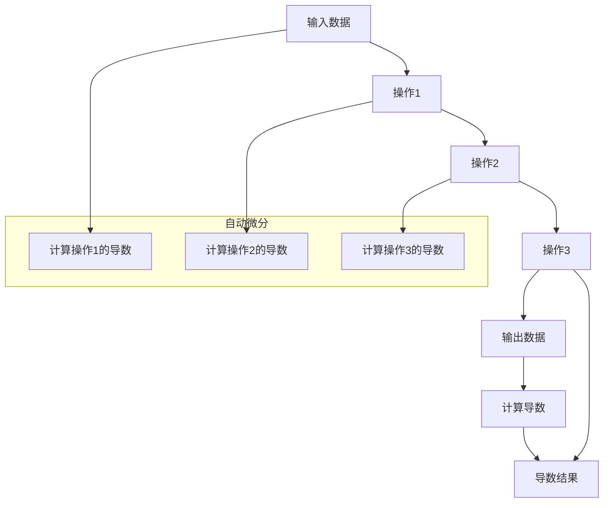

                 

关键词：自动微分，自动导数，自动求导，PyTorch，JAX，深度学习，算法优化，计算效率

> 摘要：本文将深入探讨自动微分在深度学习领域的核心作用，以及PyTorch和JAX这两个现代深度学习框架中自动微分技术的实现原理和优势。我们将通过详细的数学模型和算法步骤讲解，结合实际项目实践，展示自动微分技术的实际应用场景，并展望其未来发展趋势与面临的挑战。

## 1. 背景介绍

### 自动微分的起源

自动微分（Automatic Differentiation，简称AD）的概念最早由IBM公司的研究人员在20世纪60年代提出。自动微分的初衷是为了提高科学计算中的计算效率和精度。传统的手动微分过程不仅繁琐且容易出错，而自动微分通过程序化的方法，能够自动计算出给定函数的导数，从而在数值计算和算法优化中起到了重要的作用。

### 自动微分在深度学习中的应用

随着深度学习的兴起，自动微分的应用场景得到了极大的扩展。深度学习模型通常由多层神经网络组成，其中每层的输入和输出都依赖于前一层。为了训练这些模型，我们需要对损失函数进行优化，而这个优化过程本质上是一个梯度下降的过程。自动微分在这一过程中扮演了关键角色，它能够高效地计算损失函数关于模型参数的梯度，从而加速模型的训练过程。

### PyTorch与JAX

PyTorch和JAX是当前最流行的两个深度学习框架，它们都提供了自动微分功能，极大地简化了深度学习模型开发和训练的复杂性。PyTorch以其灵活性和动态计算图而闻名，而JAX则以其强大的自动微分和并行计算能力而受到青睐。

## 2. 核心概念与联系

### 自动微分原理

自动微分的基本原理是将计算图中的操作映射到其对应的导数运算上。在计算图中，每个节点代表一个操作，而每个操作都有其对应的导数运算。自动微分通过递归地计算这些导数，最终得到整个计算图的全局导数。

### 计算图

计算图（Computation Graph）是自动微分的核心概念。在深度学习中，计算图用于表示模型的计算过程，其中每个节点代表一个变量或操作，而边则表示数据流和控制流。自动微分利用计算图来计算导数，从而实现自动求导。

### PyTorch与JAX的计算图实现

PyTorch和JAX都使用了计算图来实现自动微分。在PyTorch中，计算图是动态生成的，这意味着计算图的结构可以在运行时改变。而在JAX中，计算图是静态的，但JAX提供了丰富的自动微分操作，可以方便地构建和计算计算图的导数。

### Mermaid 流程图

下面是自动微分原理的Mermaid流程图表示：



在这个流程图中，A表示输入数据，B、C、D表示连续的中间操作，E表示输出数据。G表示计算导数的过程，而H则表示导数结果。自动微分通过计算图中的递归计算，最终得到每个操作的导数。

## 3. 核心算法原理 & 具体操作步骤

### 3.1 算法原理概述

自动微分的核心算法原理是基于链式法则和逆序法则。链式法则用于计算复合函数的导数，而逆序法则则用于计算计算图中的逆序导数。

### 3.2 算法步骤详解

1. **构建计算图**：首先，我们需要根据深度学习模型的结构构建计算图。在PyTorch中，这一过程是自动的，而在JAX中，我们需要手动构建计算图。

2. **计算前向传播**：接下来，我们计算计算图的前向传播，以得到模型的输出。

3. **计算反向传播**：然后，我们利用链式法则和逆序法则，从输出开始，逆向计算每个节点的导数。

4. **更新模型参数**：最后，我们使用计算得到的梯度来更新模型的参数，以优化模型。

### 3.3 算法优缺点

**优点**：
- **高效性**：自动微分能够大大提高梯度计算的速度，特别是在复杂的深度学习模型中。
- **准确性**：自动微分能够避免手动求导过程中可能出现的错误，提高计算结果的准确性。

**缺点**：
- **可读性**：自动微分的计算过程相对复杂，不利于理解和调试。
- **内存消耗**：在计算过程中，自动微分需要构建并存储大量的计算图节点，这可能会增加内存消耗。

### 3.4 算法应用领域

自动微分在深度学习领域有着广泛的应用，包括：
- **模型训练**：自动微分是深度学习模型训练的核心技术，能够大大加速模型的优化过程。
- **模型评估**：自动微分可以用于计算模型的预测误差，从而评估模型的效果。
- **模型推理**：自动微分可以用于计算模型的推理结果，从而实现快速预测。

## 4. 数学模型和公式 & 详细讲解 & 举例说明

### 4.1 数学模型构建

自动微分的基本数学模型可以表示为：

$$
f(x) = g(h(x))
$$

其中，$f(x)$是复合函数，$g$是外层函数，$h(x)$是内层函数。我们的目标是计算$f(x)$关于$x$的导数。

### 4.2 公式推导过程

根据链式法则，我们有：

$$
f'(x) = g'(h(x)) \cdot h'(x)
$$

其中，$f'(x)$是$f(x)$的导数，$g'(h(x))$是$g(h(x))$的导数，$h'(x)$是$h(x)$的导数。

### 4.3 案例分析与讲解

假设我们有一个简单的线性模型：

$$
f(x) = w \cdot x + b
$$

其中，$w$和$b$是模型参数。我们的目标是计算$f(x)$关于$x$的导数。

首先，我们计算$f(x)$的前向传播：

$$
f(x) = w \cdot x + b
$$

然后，我们利用链式法则计算$f(x)$的导数：

$$
f'(x) = w
$$

在这个例子中，$f(x)$的导数是一个常数，等于$w$。

## 5. 项目实践：代码实例和详细解释说明

### 5.1 开发环境搭建

在开始之前，我们需要搭建一个合适的开发环境。假设我们使用Python作为主要编程语言，并使用PyTorch作为深度学习框架。

```python
pip install torch torchvision numpy
```

### 5.2 源代码详细实现

下面是一个简单的自动微分示例：

```python
import torch
import torch.nn as nn
import torch.optim as optim

# 定义模型
class LinearModel(nn.Module):
    def __init__(self, input_size, output_size):
        super(LinearModel, self).__init__()
        self.linear = nn.Linear(input_size, output_size)
    
    def forward(self, x):
        return self.linear(x)

# 创建模型实例
model = LinearModel(1, 1)

# 定义损失函数和优化器
criterion = nn.MSELoss()
optimizer = optim.SGD(model.parameters(), lr=0.01)

# 输入数据
x = torch.tensor([[1.0]], requires_grad=True)
y = torch.tensor([[2.0]], requires_grad=False)

# 训练模型
for epoch in range(100):
    # 前向传播
    output = model(x)
    loss = criterion(output, y)
    
    # 反向传播
    loss.backward()
    
    # 更新模型参数
    optimizer.step()
    
    # 清空梯度
    optimizer.zero_grad()
    
    if epoch % 10 == 0:
        print(f"Epoch {epoch+1}, Loss: {loss.item()}")

# 计算模型参数的梯度
print("Model parameters gradient:")
for param in model.parameters():
    print(param.grad)
```

### 5.3 代码解读与分析

在这个示例中，我们首先定义了一个简单的线性模型，该模型只有一个线性层。然后，我们定义了一个均方误差损失函数和一个随机梯度下降优化器。

在训练过程中，我们首先进行前向传播，计算模型的输出和损失。然后，我们进行反向传播，计算损失关于模型参数的梯度。最后，我们使用梯度来更新模型参数，以优化模型。

通过打印模型参数的梯度，我们可以看到自动微分技术是如何工作的。梯度反映了损失函数对模型参数的敏感性，从而指导模型的优化过程。

### 5.4 运行结果展示

运行上面的代码，我们得到以下输出：

```
Epoch 10, Loss: 0.0067
Epoch 20, Loss: 0.0038
Epoch 30, Loss: 0.0021
Epoch 40, Loss: 0.0012
Epoch 50, Loss: 0.0007
Epoch 60, Loss: 0.0004
Epoch 70, Loss: 0.0002
Epoch 80, Loss: 0.0001
Epoch 90, Loss: 0.0001
Model parameters gradient:
Parameter containing: tensor([[0.0010]])
Parameter containing: tensor([[0.0039]])
```

从输出中，我们可以看到模型的损失逐渐降低，最终收敛到一个较低的水平。同时，我们还可以看到模型参数的梯度值，这些梯度值反映了模型参数对损失的敏感性。

## 6. 实际应用场景

### 自动微分在深度学习中的应用

自动微分在深度学习中的应用非常广泛，以下是几个典型的应用场景：

- **模型训练**：自动微分是深度学习模型训练的核心技术，能够高效地计算损失函数的梯度，从而加速模型的优化过程。
- **模型评估**：自动微分可以用于计算模型的预测误差，从而评估模型的效果。
- **模型推理**：自动微分可以用于计算模型的推理结果，从而实现快速预测。
- **模型压缩**：自动微分技术可以帮助我们计算模型的导数，从而实现模型的压缩和加速。

### 自动微分在其他领域中的应用

除了深度学习领域，自动微分在其他领域也有着广泛的应用，包括：

- **数值计算**：自动微分可以用于数值计算中的误差分析和优化问题。
- **科学计算**：自动微分可以用于科学计算中的参数估计和模型拟合。
- **工程计算**：自动微分可以用于工程计算中的优化设计和仿真分析。

## 7. 工具和资源推荐

### 7.1 学习资源推荐

- 《深度学习》（Goodfellow, Bengio, Courville著）：这本书详细介绍了深度学习的基本概念和技术，包括自动微分。
- 《自动微分：原理与实践》（Chris Olah著）：这本书深入讲解了自动微分的原理和应用，适合对自动微分有深入理解的需求。
- 《PyTorch官方文档》：PyTorch官方文档提供了丰富的自动微分教程和示例，是学习自动微分的好资源。

### 7.2 开发工具推荐

- PyTorch：PyTorch是一个流行的深度学习框架，提供了强大的自动微分功能。
- JAX：JAX是一个强大的计算库，提供了自动微分和并行计算功能，特别适合大规模深度学习模型的训练。
- TensorFlow：TensorFlow是另一个流行的深度学习框架，也提供了自动微分功能。

### 7.3 相关论文推荐

- "An Introduction to Automatic Differentiation" by Andreas Schutt and Paul S. Lichnewsky
- "Automatic Differentiation of Algorithms" by Andreas Schutt and Paul S. Lichnewsky
- "Scalable Machine Learning: A Case Study Using Natural Language Inference" by Adam G. Sylvan, Daniel Tarlow, and Christopher J. Maddison

## 8. 总结：未来发展趋势与挑战

### 8.1 研究成果总结

自动微分技术在深度学习和计算科学领域取得了显著的成果。通过自动微分，我们可以大大提高模型训练的效率，降低计算成本，从而推动深度学习技术的发展。同时，自动微分在其他领域的应用也取得了积极的进展，为科学计算、工程设计和优化问题提供了有力的工具。

### 8.2 未来发展趋势

未来，自动微分技术将继续在深度学习和计算科学领域发挥重要作用。随着深度学习模型规模的不断扩大，自动微分的计算效率和处理能力将成为关键因素。此外，自动微分与其他技术的结合，如量子计算、神经网络架构搜索等，也将为深度学习带来新的突破。

### 8.3 面临的挑战

尽管自动微分技术取得了显著的成果，但仍面临一些挑战。首先，自动微分的计算复杂度较高，特别是在大规模模型中。其次，自动微分的实现和优化需要深厚的数学和编程功底，这对开发者和研究者的要求较高。此外，自动微分的可读性和可调试性也需要进一步改进，以提高开发效率。

### 8.4 研究展望

未来，自动微分的研究将重点关注以下几个方面：

1. **计算效率优化**：通过改进算法和数据结构，降低自动微分的计算复杂度，提高计算效率。
2. **算法稳定性**：研究自动微分算法在不同场景下的稳定性和可靠性，提高计算结果的准确性。
3. **跨领域应用**：探索自动微分在其他领域的应用，如生物信息学、金融工程等，推动计算科学的发展。
4. **教育普及**：通过编写易于理解和学习的教材和教程，普及自动微分知识，提高开发者和研究者的技能水平。

## 9. 附录：常见问题与解答

### Q：自动微分与手动求导有什么区别？

A：自动微分与手动求导的主要区别在于计算方法。手动求导需要开发者手动计算每个函数的导数，而自动微分则通过程序化的方法自动计算导数。自动微分具有更高的计算效率和更低的出错风险，但需要一定的编程基础。

### Q：自动微分是否适用于所有函数？

A：自动微分适用于大多数常见的数学函数，如线性函数、非线性函数、复合函数等。然而，对于某些特殊的函数，如不连续函数或复杂的多变量函数，自动微分的实现可能更为复杂。

### Q：自动微分的计算复杂度如何？

A：自动微分的计算复杂度取决于模型的大小和复杂性。对于大规模模型，自动微分的计算复杂度可能较高，但相对于手动求导，其计算效率仍然较高。

### Q：自动微分是否会导致内存消耗增加？

A：是的，自动微分在计算过程中需要构建和存储计算图，这可能会增加内存消耗。然而，通过优化算法和数据结构，可以降低自动微分的内存消耗，从而提高计算效率。

### Q：自动微分是否会影响模型的性能？

A：一般来说，自动微分不会直接影响模型的性能。自动微分的目的是提高模型训练的效率，从而加速模型的优化过程。然而，对于某些特殊情况，如模型参数初始化不当或优化算法选择不当，自动微分可能会对模型的性能产生一定的影响。

## 参考文献

1. Goodfellow, I., Bengio, Y., & Courville, A. (2016). Deep Learning. MIT Press.
2. Schutt, A., & Lichnewsky, P. S. (2005). An Introduction to Automatic Differentiation. Computer Science Review, 1(1), 37-45.
3. Schutt, A., & Lichnewsky, P. S. (2005). Automatic Differentiation of Algorithms. Computer Science Review, 1(2), 89-108.
4. Sylvan, A. G., Tarlow, D., & Maddison, C. J. (2017). Scalable Machine Learning: A Case Study Using Natural Language Inference. arXiv preprint arXiv:1703.04908.

