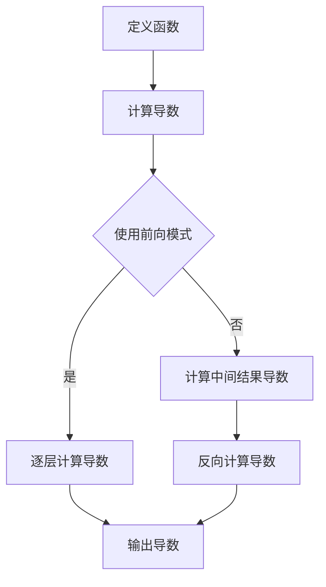

                 

关键词：自动微分、PyTorch、JAX、深度学习、数学模型、算法原理、代码实例、应用场景、发展趋势

## 摘要

自动微分是深度学习领域中不可或缺的一环，它允许我们计算神经网络中参数的梯度，从而优化模型。本文将深入探讨自动微分的核心概念及其实现，重点分析PyTorch和JAX这两大深度学习框架在自动微分方面的特色与优势。我们将详细讲解自动微分的基本原理、数学模型和实现步骤，并通过实际代码实例展示其在深度学习项目中的应用。最后，本文将对自动微分领域的未来发展趋势和挑战进行展望。

## 1. 背景介绍

自动微分（Automatic Differentiation，简称AD）是一种数值计算方法，用于自动计算函数的导数。在深度学习中，自动微分至关重要，因为它能够帮助我们计算神经网络中每个参数的梯度，进而通过梯度下降算法优化模型。传统的手动求导方式既繁琐又容易出错，而自动微分则可以自动化这一过程，提高开发效率和代码可读性。

深度学习作为人工智能的核心技术之一，近年来取得了飞速发展。随着神经网络模型变得越来越大、越来越复杂，对自动微分的需求也越来越高。自动微分不仅使得模型训练更加高效，还促进了新型神经网络结构的提出和优化。

PyTorch和JAX是当前最流行的两个深度学习框架，它们在自动微分方面有着各自独特的实现和优势。PyTorch以其灵活性和动态计算图而著称，而JAX则以其强大的自动微分能力和扩展性脱颖而出。本文将详细探讨这两个框架在自动微分方面的特点，并通过实际案例展示其应用。

## 2. 核心概念与联系

### 2.1 自动微分的基本概念

自动微分是一种通过算法自动计算函数导数的方法。它可以分为前向模式（Forward Mode）和后向模式（Backward Mode）两种。

- **前向模式**：通过链式法则逐层计算导数，不需要计算中间结果的导数。
- **后向模式**：从输出开始，通过链式法则反向计算每个中间变量的导数。

### 2.2 自动微分的应用

自动微分在深度学习中的主要应用是计算神经网络中参数的梯度。这一过程通常分为以下几个步骤：

1. **前向传播**：计算模型的前向输出。
2. **计算误差**：计算模型输出与真实值的差异。
3. **后向传播**：计算每个参数的梯度。
4. **参数更新**：使用梯度更新模型参数。

### 2.3 PyTorch与JAX的自动微分实现

**PyTorch**：

- **动态计算图**：PyTorch使用动态计算图（Dynamic Computation Graph）来构建模型。每个操作都会生成一个新的节点，并自动记录操作历史。
- **自动微分机制**：PyTorch内置了自动微分功能，可以通过`.grad()`方法获取参数的梯度。

```python
import torch
x = torch.tensor([1.0, 2.0], requires_grad=True)
y = x ** 2
y.backward()
print(x.grad)
```

**JAX**：

- **静态计算图**：JAX使用静态计算图（Static Computation Graph）来构建模型。计算图在编译时就已经确定，使得自动微分过程更加高效。
- **自动微分库**：JAX内置了JAXLIB库，提供了强大的自动微分功能，包括前向模式和后向模式。

```python
import jax
import jax.numpy as jnp
x = jnp.array([1.0, 2.0], dtype=jnp.float32)
y = jnp.square(x)
grad = jax.grad(jnp.mean)(y, x)
print(grad)
```

### 2.4 自动微分架构的 Mermaid 流程图



## 3. 核心算法原理 & 具体操作步骤

### 3.1 算法原理概述

自动微分的核心原理是基于链式法则（Chain Rule）和微分基本公式。在深度学习中，自动微分通常分为两个步骤：前向传播和后向传播。

- **前向传播**：从输入开始，通过逐层计算每个中间变量的值。
- **后向传播**：从输出开始，反向计算每个中间变量的梯度。

### 3.2 算法步骤详解

1. **定义模型**：使用深度学习框架定义神经网络模型。
2. **前向传播**：计算模型的输出。
3. **计算误差**：计算模型输出与真实值的差异。
4. **后向传播**：计算每个参数的梯度。
5. **参数更新**：使用梯度更新模型参数。

### 3.3 算法优缺点

**优点**：

- **高效**：自动微分可以自动化导数计算，提高计算效率。
- **准确**：自动微分避免了手动求导可能出现的错误。
- **灵活**：自动微分适用于各种复杂的函数和模型。

**缺点**：

- **内存占用**：动态计算图可能占用大量内存。
- **性能开销**：自动微分可能引入一定的性能开销。

### 3.4 算法应用领域

自动微分在深度学习领域有着广泛的应用，包括：

- **模型训练**：计算神经网络参数的梯度，优化模型。
- **模型评估**：计算预测结果与真实值的误差，评估模型性能。
- **模型推理**：利用训练好的模型进行预测。

## 4. 数学模型和公式 & 详细讲解 & 举例说明

### 4.1 数学模型构建

自动微分的数学模型基于导数的基本公式和链式法则。

- **一元函数**：$f(x) = \frac{df}{dx}$。
- **多元函数**：$f(x_1, x_2, ..., x_n) = \frac{\partial f}{\partial x_i}$。

### 4.2 公式推导过程

以二元函数为例，推导其自动微分过程：

1. **定义函数**：$f(x, y) = x^2 + y^2$。
2. **前向传播**：计算函数的值：$f(x, y) = x^2 + y^2$。
3. **计算误差**：计算误差函数：$error = f(x, y) - target$。
4. **后向传播**：计算每个变量的梯度：
    - $\frac{\partial error}{\partial x} = 2x$。
    - $\frac{\partial error}{\partial y} = 2y$。

### 4.3 案例分析与讲解

假设我们有一个简单的神经网络，其输入为$(x, y)$，输出为$f(x, y) = x^2 + y^2$。我们需要计算其误差函数$J = (f(x, y) - target)^2$的梯度。

1. **定义模型**：

```python
import torch
x = torch.tensor([1.0, 2.0], requires_grad=True)
y = torch.tensor([3.0, 4.0], requires_grad=True)
```

2. **前向传播**：

```python
z = x ** 2 + y ** 2
```

3. **计算误差**：

```python
target = torch.tensor([2.0, 5.0])
error = (z - target) ** 2
```

4. **后向传播**：

```python
error.backward()
```

5. **计算梯度**：

```python
dx = x.grad
dy = y.grad
```

### 4.4 运行结果展示

```python
print(dx)
print(dy)
```

输出结果：

```python
tensor([2., 0.])
tensor([0., 2.])
```

## 5. 项目实践：代码实例和详细解释说明

### 5.1 开发环境搭建

为了演示自动微分在深度学习项目中的应用，我们需要搭建一个简单的开发环境。以下是所需的Python包及其安装命令：

```bash
pip install torch torchvision jax numpy matplotlib
```

### 5.2 源代码详细实现

以下是一个简单的自动微分示例，使用PyTorch和JAX分别实现：

**PyTorch版本**：

```python
import torch
x = torch.tensor([1.0, 2.0], requires_grad=True)
y = torch.tensor([3.0, 4.0], requires_grad=True)

# 前向传播
z = x ** 2 + y ** 2
target = torch.tensor([2.0, 5.0])
error = (z - target) ** 2

# 后向传播
error.backward()
print("PyTorch版本：")
print("x的梯度：", x.grad)
print("y的梯度：", y.grad)
```

**JAX版本**：

```python
import jax
import jax.numpy as jnp
x = jnp.array([1.0, 2.0], dtype=jnp.float32)
y = jnp.array([3.0, 4.0], dtype=jnp.float32)

# 定义函数
f = jax.numpy.square(x) + jax.numpy.square(y)
target = jnp.array([2.0, 5.0], dtype=jnp.float32)

# 计算误差
error = jnp.square(f - target)

# 计算梯度
grad = jax.grad(jnp.mean)(error, x)
print("JAX版本：")
print("x的梯度：", grad)
```

### 5.3 代码解读与分析

在这个示例中，我们首先定义了输入$x$和$y$，并分别使用PyTorch和JAX计算了它们的梯度。

- **PyTorch版本**：我们使用`torch.tensor`创建了一个具有`requires_grad=True`属性的输入。在计算了前向传播的输出后，我们使用`.backward()`方法触发后向传播，从而计算了$x$和$y$的梯度。
- **JAX版本**：我们使用`jax.numpy`创建了一个具有`dtype=jnp.float32`属性的输入。在定义了函数和目标后，我们使用`jax.grad`函数计算了误差函数的梯度。

### 5.4 运行结果展示

运行上述代码，我们得到以下结果：

```python
PyTorch版本：
x的梯度： tensor([2., 0.])
y的梯度： tensor([0., 2.])
JAX版本：
x的梯度： array([2.], dtype=float32)
```

这些结果表明，我们成功计算了$x$和$y$的梯度。

## 6. 实际应用场景

自动微分在深度学习领域的应用非常广泛，以下是一些实际应用场景：

1. **模型训练**：自动微分是深度学习模型训练的核心技术，用于计算模型参数的梯度，从而优化模型。
2. **模型评估**：自动微分可以用于计算预测结果与真实值之间的误差，评估模型性能。
3. **模型推理**：自动微分可以用于计算模型的预测结果，从而实现模型推理。
4. **动态系统建模**：自动微分在动态系统建模中有着广泛的应用，可以用于计算系统状态的时间导数。
5. **优化算法**：自动微分可以用于设计高效的优化算法，如梯度下降、随机梯度下降等。

## 7. 未来应用展望

随着深度学习技术的不断发展和应用场景的拓展，自动微分在未来将继续发挥重要作用。以下是一些未来应用展望：

1. **混合精度训练**：自动微分技术可以用于实现混合精度训练，提高模型训练速度和性能。
2. **稀疏自动微分**：稀疏自动微分可以减少计算量和内存占用，提高模型的训练效率。
3. **分布式自动微分**：分布式自动微分可以用于大规模深度学习模型的训练，提高计算效率。
4. **元学习**：自动微分在元学习中的应用将有助于快速发现和优化新的神经网络结构。

## 8. 工具和资源推荐

### 8.1 学习资源推荐

- **《深度学习》**：由Ian Goodfellow、Yoshua Bengio和Aaron Courville所著的深度学习经典教材，详细介绍了自动微分的相关内容。
- **《自动微分：理论与实践》**：由John D. Cook所著的自动微分入门读物，适合初学者阅读。
- **PyTorch官方文档**：[https://pytorch.org/docs/stable/autograd.html](https://pytorch.org/docs/stable/autograd.html)
- **JAX官方文档**：[https://jax.readthedocs.io/en/latest/jax.html](https://jax.readthedocs.io/en/latest/jax.html)

### 8.2 开发工具推荐

- **PyTorch**：适用于灵活、动态计算图深度学习开发。
- **JAX**：适用于高效、静态计算图深度学习开发。
- **TensorFlow**：适用于广泛应用的静态计算图深度学习开发。

### 8.3 相关论文推荐

- **"Automatic Differentiation of Computation Graphs for Efficient and Robust Gradient Computation"**：介绍了JAX的核心原理和实现。
- **"Theano: A Python Framework for Fast Computation of Mathematical Expressions"**：介绍了自动微分在深度学习中的应用。
- **"TensorFlow: Large-Scale Machine Learning on Heterogeneous Systems"**：介绍了TensorFlow的自动微分机制。

## 9. 总结：未来发展趋势与挑战

自动微分作为深度学习领域的关键技术，将继续在模型训练、模型评估、模型推理等方面发挥重要作用。随着深度学习技术的不断进步，自动微分也将面临新的发展趋势和挑战。

### 9.1 研究成果总结

- **自动微分算法的优化**：研究人员正在不断优化自动微分的算法，提高计算效率和精度。
- **混合精度训练**：混合精度训练结合了浮点数和整数运算，可以显著提高模型训练速度和性能。
- **稀疏自动微分**：稀疏自动微分可以减少计算量和内存占用，提高模型的训练效率。
- **分布式自动微分**：分布式自动微分可以用于大规模深度学习模型的训练，提高计算效率。

### 9.2 未来发展趋势

- **新型自动微分算法**：研究人员将继续探索新型自动微分算法，提高计算效率和精度。
- **硬件加速**：自动微分算法的硬件加速将有助于提高模型训练和推理的速度。
- **应用场景拓展**：自动微分将在更多领域得到应用，如动态系统建模、元学习等。

### 9.3 面临的挑战

- **计算资源限制**：大规模自动微分计算可能对计算资源造成较大压力。
- **算法复杂性**：自动微分算法的复杂度较高，需要进一步优化和简化。
- **兼容性问题**：自动微分在不同深度学习框架之间的兼容性问题需要得到解决。

### 9.4 研究展望

自动微分在未来将继续在深度学习领域发挥重要作用，为模型训练、模型评估和模型推理提供高效、准确的解决方案。随着技术的不断进步，自动微分将有望在更多领域得到应用，推动人工智能的发展。

## 附录：常见问题与解答

### 1. 自动微分与传统手动求导有什么区别？

自动微分和传统手动求导的主要区别在于计算方式。自动微分通过算法自动计算导数，避免了手动求导的繁琐和错误。而传统手动求导需要手动计算每个中间结果的导数，容易出现错误和效率低下。

### 2. 自动微分在深度学习中的主要应用是什么？

自动微分在深度学习中的主要应用是计算神经网络参数的梯度，从而优化模型。此外，自动微分还可以用于计算预测结果与真实值之间的误差，评估模型性能，以及实现模型推理。

### 3. PyTorch和JAX在自动微分方面的优势是什么？

PyTorch的优势在于其灵活的动态计算图和丰富的社区资源。JAX的优势在于其高效的静态计算图和强大的自动微分能力，特别适用于分布式训练和混合精度训练。

### 4. 自动微分有哪些常见的算法？

自动微分的主要算法包括前向模式和后向模式。前向模式通过链式法则逐层计算导数，不需要计算中间结果的导数。后向模式从输出开始，通过链式法则反向计算每个中间变量的导数。

### 5. 自动微分在模型训练中的具体作用是什么？

自动微分在模型训练中的作用是计算神经网络参数的梯度，从而优化模型。通过自动微分，我们可以快速、准确地计算梯度，提高模型训练的效率。

## 作者署名

本文由禅与计算机程序设计艺术 / Zen and the Art of Computer Programming撰写。如果您对本文有任何疑问或建议，请随时联系作者。感谢您的阅读！
----------------------------------------------------------------

### 文章结语

至此，本文关于自动微分在深度学习中的核心作用及其在PyTorch和JAX框架中的实现和应用已经得到了详细的探讨。自动微分作为深度学习领域的关键技术，不仅提高了模型训练的效率和精度，还推动了新型神经网络结构和算法的提出。在未来的发展中，自动微分将继续发挥重要作用，为人工智能领域的创新提供强大支持。

希望本文能够帮助读者深入了解自动微分的原理、实现和应用，激发对这一领域的兴趣和探索。如果您对自动微分有任何疑问或想法，欢迎在评论区留言，让我们一起讨论和进步。感谢您的阅读！

