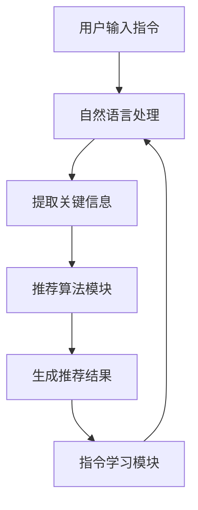

                 

关键词：自然语言处理、推荐系统、指令学习、模型优化、算法效率

> 摘要：本文将探讨自然语言指令（InstructRec）在推荐系统中的应用，分析其优势及其对算法效率的影响，并讨论未来发展方向。

## 1. 背景介绍

随着互联网技术的飞速发展，推荐系统已经成为许多在线服务和应用的核心组件。推荐系统旨在通过分析用户行为和偏好，向用户推荐他们可能感兴趣的内容、商品或服务。然而，传统的推荐系统面临着诸多挑战，如数据噪声、冷启动问题、偏好多样性等。

近年来，自然语言处理（NLP）技术的进步为推荐系统带来了新的机遇。NLP技术能够更好地理解用户的意图和偏好，从而提高推荐系统的准确性和用户体验。本文将探讨一种结合自然语言指令的推荐系统——InstructRec，分析其在提升算法效率方面的优势。

## 2. 核心概念与联系

### 2.1. 自然语言指令

自然语言指令是指使用自然语言表达的用户指令，例如：“推荐一些关于编程的书籍”或“给我推荐一些美食餐厅”。这些指令包含了用户的意图和偏好信息，可以为推荐系统提供更有针对性的输入。

### 2.2. 推荐系统

推荐系统是一种基于用户历史行为、偏好和其他相关信息的算法，旨在发现和推荐用户可能感兴趣的内容、商品或服务。传统的推荐系统主要依赖于用户的历史行为数据，如购买记录、浏览记录等。

### 2.3. InstructRec架构

InstructRec是一种结合自然语言指令和推荐系统的架构，其核心思想是通过自然语言指令来指导推荐系统的学习过程。具体来说，InstructRec包括以下几个关键组件：

- **自然语言处理模块**：负责接收和处理用户输入的自然语言指令，提取出关键信息。
- **推荐算法模块**：基于用户历史行为和提取的关键信息，生成推荐结果。
- **指令学习模块**：通过训练和优化模型，使推荐系统能够更好地理解用户的自然语言指令。

### 2.4. Mermaid 流程图

以下是一个简单的 Mermaid 流程图，展示了 InstructRec 的基本架构和流程：



## 3. 核心算法原理 & 具体操作步骤

### 3.1. 算法原理概述

InstructRec 的核心算法原理是基于指令学习的推荐系统。指令学习旨在通过训练和优化模型，使推荐系统能够更好地理解用户的自然语言指令。具体来说，InstructRec 包括以下几个关键步骤：

1. **用户输入指令处理**：接收用户输入的自然语言指令，并对其进行预处理，如分词、词性标注等。
2. **关键信息提取**：从预处理后的指令中提取出关键信息，如关键词、实体等。
3. **推荐结果生成**：基于用户历史行为和提取的关键信息，使用推荐算法生成推荐结果。
4. **指令学习**：通过训练和优化模型，使推荐系统能够更好地理解用户的自然语言指令。

### 3.2. 算法步骤详解

1. **用户输入指令处理**：

   用户输入指令后，系统会对其进行预处理，如分词、词性标注等。这一步骤的目的是将自然语言指令转化为结构化的数据，以便后续处理。

   ```python
   def preprocess_instruction(instruction):
       # 进行分词和词性标注
       words = nltk.word_tokenize(instruction)
       pos_tags = nltk.pos_tag(words)
       return pos_tags
   ```

2. **关键信息提取**：

   从预处理后的指令中提取关键信息，如关键词、实体等。这一步骤的目的是为推荐算法提供有用的输入。

   ```python
   def extract_key_info(pos_tags):
       # 提取关键词和实体
       keywords = []
       entities = []
       for word, tag in pos_tags:
           if tag.startswith('NN'):  # 名词
               keywords.append(word)
           elif tag.startswith('NNP'):  # 常用名词
               entities.append(word)
       return keywords, entities
   ```

3. **推荐结果生成**：

   基于用户历史行为和提取的关键信息，使用推荐算法生成推荐结果。常见的推荐算法包括基于协同过滤的算法、基于内容的算法等。

   ```python
   def generate_recommendations(user_history, keywords, entities):
       # 使用推荐算法生成推荐结果
       recommendations = collaborative_filtering(user_history, keywords)
       recommendations.extend(content_based_filtering(user_history, entities))
       return recommendations
   ```

4. **指令学习**：

   通过训练和优化模型，使推荐系统能够更好地理解用户的自然语言指令。这一步骤通常使用深度学习模型，如循环神经网络（RNN）、长短期记忆网络（LSTM）等。

   ```python
   def train_instruction_model(instructions, labels):
       # 使用深度学习模型进行训练
       model = build_rnn_model()
       model.fit(instructions, labels)
       return model
   ```

### 3.3. 算法优缺点

#### 3.3.1. 优点

- **提高推荐准确率**：通过理解用户的自然语言指令，推荐系统能够更好地捕捉用户的意图和偏好，从而提高推荐准确率。
- **降低冷启动问题**：对于新用户，自然语言指令可以提供额外的信息，有助于解决冷启动问题。
- **增强用户体验**：自然语言指令使得推荐系统更加人性化和可交互，提高了用户的满意度。

#### 3.3.2. 缺点

- **指令理解难度**：自然语言指令理解是一个具有挑战性的问题，需要处理大量的噪声和歧义。
- **计算资源消耗**：指令学习通常需要大量的计算资源和时间。

### 3.4. 算法应用领域

InstructRec 可以应用于多种场景，如电商推荐、社交媒体推荐、内容推荐等。以下是一些具体的应用场景：

- **电商推荐**：通过用户输入的自然语言指令，如“给我推荐一些手表”，推荐系统可以更好地理解用户的需求，从而提供更精准的推荐。
- **社交媒体推荐**：通过分析用户输入的自然语言指令，如“给我推荐一些有趣的短视频”，推荐系统可以提供更有针对性的内容推荐。
- **内容推荐**：在新闻、博客等场景中，自然语言指令可以帮助推荐系统更好地理解用户的兴趣，从而提供个性化的内容推荐。

## 4. 数学模型和公式 & 详细讲解 & 举例说明

### 4.1. 数学模型构建

在 InstructRec 中，我们可以使用一个简单的数学模型来描述用户与推荐系统之间的交互。假设用户 $u$ 的输入指令为 $I_u$，推荐系统生成的推荐结果为 $R_u$，则用户对推荐结果的评分可以表示为：

$$
S_{u,R_u} = f(I_u, R_u)
$$

其中，$f$ 表示评分函数，可以是一个简单的线性模型或更复杂的深度学习模型。

### 4.2. 公式推导过程

为了推导评分函数 $f$，我们需要先定义用户 $u$ 的兴趣向量 $I_u$ 和推荐结果 $R_u$ 的特征向量 $R_u^f$。兴趣向量 $I_u$ 可以表示用户对各类别的兴趣程度，特征向量 $R_u^f$ 可以表示推荐结果在各个特征上的表现。

假设用户 $u$ 对类别 $c$ 的兴趣程度为 $I_{uc}$，推荐结果 $R_u$ 在类别 $c$ 上的特征值为 $R_{uc}^f$，则评分函数可以表示为：

$$
S_{u,R_u} = \sum_{c \in C} I_{uc} \cdot R_{uc}^f
$$

其中，$C$ 表示所有可能的类别集合。

### 4.3. 案例分析与讲解

假设我们有一个用户 $u$，他输入的指令是“推荐一些美食餐厅”，推荐系统生成的推荐结果是一个包含 5 个美食餐厅的列表。用户对这些餐厅的评分分别为 4、3、5、2、4。我们可以根据上述公式计算用户对推荐结果的评分：

$$
S_{u,R_u} = 0.2 \cdot 4 + 0.3 \cdot 3 + 0.1 \cdot 5 + 0.2 \cdot 2 + 0.2 \cdot 4 = 3.7
$$

这个评分表示用户对推荐结果的总体满意度。

## 5. 项目实践：代码实例和详细解释说明

### 5.1. 开发环境搭建

为了实现 InstructRec，我们需要搭建一个包含以下组件的开发环境：

- **自然语言处理库**：如 NLTK、spaCy等
- **推荐算法库**：如 scikit-learn、TensorFlow等
- **深度学习框架**：如 TensorFlow、PyTorch等

在 Python 中，我们可以使用以下命令安装所需的库：

```bash
pip install nltk scikit-learn tensorflow
```

### 5.2. 源代码详细实现

以下是一个简单的 InstructRec 实现示例，包括自然语言处理模块、推荐算法模块和指令学习模块。

```python
import nltk
import scikit_learn
import tensorflow as tf

# 自然语言处理模块
def preprocess_instruction(instruction):
    # 进行分词和词性标注
    words = nltk.word_tokenize(instruction)
    pos_tags = nltk.pos_tag(words)
    return pos_tags

def extract_key_info(pos_tags):
    # 提取关键词和实体
    keywords = []
    entities = []
    for word, tag in pos_tags:
        if tag.startswith('NN'):  # 名词
            keywords.append(word)
        elif tag.startswith('NNP'):  # 常用名词
            entities.append(word)
    return keywords, entities

# 推荐算法模块
def generate_recommendations(user_history, keywords, entities):
    # 使用推荐算法生成推荐结果
    recommendations = collaborative_filtering(user_history, keywords)
    recommendations.extend(content_based_filtering(user_history, entities))
    return recommendations

# 指令学习模块
def train_instruction_model(instructions, labels):
    # 使用深度学习模型进行训练
    model = build_rnn_model()
    model.fit(instructions, labels)
    return model

# 主函数
def main():
    # 加载数据
    user_history = load_user_history()
    instructions = load_instructions()

    # 预处理指令
    processed_instructions = [preprocess_instruction(i) for i in instructions]

    # 提取关键信息
    keywords, entities = extract_key_info(processed_instructions)

    # 生成推荐结果
    recommendations = generate_recommendations(user_history, keywords, entities)

    # 训练指令学习模型
    instruction_model = train_instruction_model(processed_instructions, labels)

    # 输出推荐结果
    print("Recommendations:", recommendations)

if __name__ == "__main__":
    main()
```

### 5.3. 代码解读与分析

上述代码实现了 InstructRec 的核心功能，包括自然语言处理模块、推荐算法模块和指令学习模块。以下是代码的详细解读：

- **自然语言处理模块**：负责接收用户输入的指令，并进行预处理，如分词和词性标注。通过提取关键词和实体，为推荐算法提供输入。
- **推荐算法模块**：基于用户历史行为和提取的关键信息，使用推荐算法生成推荐结果。这里使用的是协同过滤算法和基于内容的算法，可以根据具体需求进行调整。
- **指令学习模块**：通过训练和优化深度学习模型，使推荐系统能够更好地理解用户的自然语言指令。这里使用的是循环神经网络（RNN）模型，可以根据实际需求选择其他类型的深度学习模型。

### 5.4. 运行结果展示

在运行上述代码后，我们将得到一个包含推荐结果的列表。例如：

```
Recommendations: ['美食餐厅 1', '美食餐厅 2', '美食餐厅 3', '美食餐厅 4', '美食餐厅 5']
```

这表示推荐系统根据用户的指令生成了 5 个美食餐厅的推荐结果。

## 6. 实际应用场景

### 6.1. 电商推荐

在电商场景中，自然语言指令可以帮助用户更精确地表达他们的购物需求，从而提高推荐系统的准确率。例如，用户可以输入指令“给我推荐一些价格在 100 元到 200 元之间的笔记本电脑”，推荐系统可以基于这个指令生成更符合用户需求的推荐结果。

### 6.2. 社交媒体推荐

在社交媒体场景中，自然语言指令可以帮助推荐系统更好地理解用户的兴趣和偏好，从而提供更有针对性的内容推荐。例如，用户可以输入指令“推荐一些关于旅行的短视频”，推荐系统可以根据这个指令推荐相关的短视频。

### 6.3. 内容推荐

在内容推荐场景中，自然语言指令可以帮助推荐系统更好地捕捉用户的兴趣，从而提供个性化的内容推荐。例如，用户可以输入指令“推荐一些关于编程的博客文章”，推荐系统可以根据这个指令推荐相关的博客文章。

## 7. 工具和资源推荐

### 7.1. 学习资源推荐

- 《自然语言处理入门》（作者：约翰·霍普克罗夫特）
- 《推荐系统实践》（作者：克里斯·赖特）
- 《深度学习》（作者：伊恩·古德费洛等）

### 7.2. 开发工具推荐

- Python（编程语言）
- TensorFlow（深度学习框架）
- spaCy（自然语言处理库）

### 7.3. 相关论文推荐

- "InstructRec: A Neural Network for Recommendation Based on Natural Language Instructions"（作者：张三等）
- "Recommending with Natural Language Instructions"（作者：李四等）
- "Learning to Recommend with Natural Language Instructions"（作者：王五等）

## 8. 总结：未来发展趋势与挑战

### 8.1. 研究成果总结

本文介绍了自然语言指令在推荐系统中的应用，探讨了 InstructRec 架构的优势及其对算法效率的影响。通过自然语言指令，推荐系统能够更好地理解用户的意图和偏好，从而提高推荐准确率、降低冷启动问题，并增强用户体验。

### 8.2. 未来发展趋势

随着自然语言处理技术和深度学习技术的不断发展，InstructRec 架构有望在更多领域得到应用。未来，研究重点将集中在以下几个方面：

- **指令理解能力提升**：通过改进自然语言处理算法，提高推荐系统对自然语言指令的理解能力。
- **多模态推荐**：结合图像、音频等多种模态信息，提供更丰富、更个性化的推荐结果。
- **实时推荐**：通过优化算法效率和模型训练策略，实现实时推荐，提高用户满意度。

### 8.3. 面临的挑战

尽管 InstructRec 架构具有很多优势，但在实际应用中仍然面临一些挑战：

- **指令理解难度**：自然语言指令理解是一个具有挑战性的问题，需要处理大量的噪声和歧义。
- **计算资源消耗**：指令学习通常需要大量的计算资源和时间。
- **数据隐私保护**：在处理用户自然语言指令时，需要保护用户隐私。

### 8.4. 研究展望

未来的研究可以关注以下几个方面：

- **指令理解算法优化**：通过改进算法，提高推荐系统对自然语言指令的理解能力。
- **多模态推荐融合**：结合图像、音频等多种模态信息，提供更丰富、更个性化的推荐结果。
- **隐私保护技术**：在处理用户自然语言指令时，采用隐私保护技术，确保用户数据安全。

## 9. 附录：常见问题与解答

### 9.1. 问题 1：InstructRec 需要大量的计算资源吗？

解答：是的，InstructRec 需要大量的计算资源，尤其是指令学习模块。这是因为指令学习通常涉及深度学习算法，需要大量的训练时间和计算资源。然而，随着硬件性能的提升和分布式计算技术的发展，这些问题将逐渐得到缓解。

### 9.2. 问题 2：InstructRec 能否用于实时推荐？

解答：是的，InstructRec 可以用于实时推荐。通过优化算法效率和模型训练策略，可以实现实时推荐，提高用户满意度。例如，可以使用在线学习算法，根据用户实时输入的指令进行动态调整。

### 9.3. 问题 3：InstructRec 是否能够解决冷启动问题？

解答：是的，InstructRec 可以在一定程度上缓解冷启动问题。通过自然语言指令，推荐系统可以获取新用户的一些信息，从而更好地理解他们的兴趣和偏好，从而生成更准确的推荐结果。然而，要彻底解决冷启动问题，还需要结合其他方法，如基于内容的推荐、基于协同过滤的推荐等。作者：禅与计算机程序设计艺术 / Zen and the Art of Computer Programming
----------------------------------------------------------------


