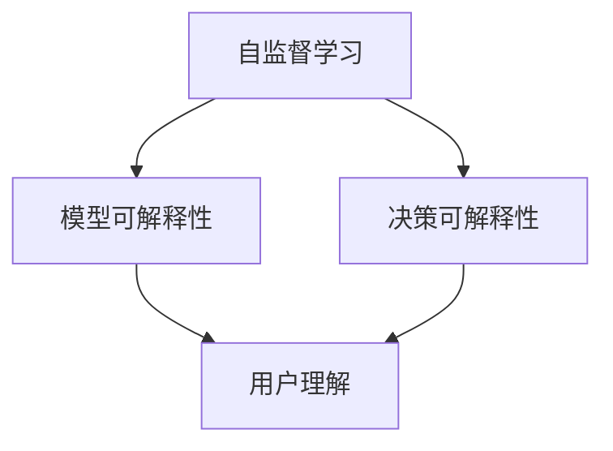

                 

关键词：自监督学习，模型可解释性，决策可解释性，机器学习，人工智能

## 摘要

本文将深入探讨自监督学习的可解释性，重点关注模型可解释性和决策可解释性两个关键方面。自监督学习作为一种无需标注数据的机器学习技术，近年来在图像识别、自然语言处理等领域的应用越来越广泛。然而，由于其复杂性，理解模型的决策过程和背后的机制变得尤为重要。本文首先介绍了自监督学习的基本概念和常见方法，然后详细分析了模型可解释性和决策可解释性的重要性及其实现方法。此外，文章还通过实际应用案例和代码实例，展示了如何在实际项目中实现自监督学习的可解释性。最后，本文对未来发展趋势与挑战进行了展望，为该领域的研究和实践提供了有益的参考。

## 1. 背景介绍

### 自监督学习的概念

自监督学习（Self-supervised Learning）是一种机器学习方法，其核心思想是利用未标注的数据来训练模型。与传统的监督学习（Supervised Learning）和半监督学习（Semi-supervised Learning）不同，自监督学习不需要大量的标注数据，从而降低了数据标注的成本和时间。自监督学习的目标是让模型自动地从数据中学习到有用的信息，并利用这些信息进行预测或分类。

自监督学习的原理可以简单概括为：给定一个未标注的数据集，模型通过自身的结构设计，将数据中的某些特征提取出来，并利用这些特征来预测某些未知的标签。例如，在图像分类任务中，模型可以从图像中自动提取特征，并用这些特征来预测图像的类别。

### 自监督学习的应用

自监督学习在多个领域都有着广泛的应用。以下是一些常见的应用场景：

1. **图像识别**：自监督学习可以用于图像分类、目标检测和图像分割等任务。例如，可以使用自监督学习来训练一个模型，使其能够识别图像中的物体。
   
2. **自然语言处理**：自监督学习在自然语言处理（NLP）领域有着广泛的应用，如文本分类、情感分析、机器翻译等。例如，通过预训练自监督模型，可以提高模型在语言理解任务上的性能。

3. **语音识别**：自监督学习可以用于语音识别，通过将未标注的语音数据转换为文本数据，来训练模型识别语音。

4. **推荐系统**：自监督学习可以用于构建推荐系统，通过分析用户的历史行为数据，自动推荐用户可能感兴趣的商品或内容。

### 自监督学习的重要性

自监督学习的重要性体现在以下几个方面：

1. **数据效率**：自监督学习可以充分利用未标注的数据，从而提高数据利用效率，减少对标注数据的依赖。

2. **降低成本**：由于不需要大量的标注数据，自监督学习可以大大降低数据标注的成本。

3. **模型泛化能力**：自监督学习可以帮助模型更好地学习数据的底层特征，从而提高模型的泛化能力。

4. **实时性**：自监督学习可以在没有额外标注数据的情况下，实时更新和优化模型，使其能够适应不断变化的数据环境。

## 2. 核心概念与联系

### 模型可解释性

模型可解释性是指用户能够理解和解释模型决策过程的能力。在自监督学习中，模型可解释性尤为重要，因为其复杂性和无监督的特性使得理解模型的决策过程变得更加困难。模型可解释性不仅可以帮助用户理解模型的决策过程，还可以帮助用户发现模型可能存在的偏见和错误。

### 决策可解释性

决策可解释性是指用户能够理解和解释模型在特定输入数据上的具体决策过程的能力。与模型可解释性不同，决策可解释性更加关注模型在特定数据上的决策细节。在自监督学习中，决策可解释性可以帮助用户理解模型如何利用未标注的数据进行预测。

### 自监督学习与可解释性的关系

自监督学习与可解释性之间存在着密切的联系。自监督学习通过无监督的方式从数据中学习到有用的特征，这些特征对于模型的决策过程至关重要。因此，理解自监督学习模型的决策过程，需要深入理解模型的可解释性。同时，提高模型的可解释性，可以帮助用户更好地理解模型的决策过程，从而提高模型的可靠性和信任度。

### Mermaid 流程图

以下是一个简单的 Mermaid 流程图，展示了自监督学习、模型可解释性和决策可解释性之间的关系：



在这个流程图中，自监督学习作为输入，通过学习得到模型和决策，模型可解释性和决策可解释性分别表示用户理解和解释模型决策过程的能力。最终，用户通过理解和解释模型决策，达到对模型的信任和理解。

## 3. 核心算法原理 & 具体操作步骤

### 3.1 算法原理概述

自监督学习是一种无监督的机器学习方法，其核心思想是利用未标注的数据来训练模型。在自监督学习中，模型通过自主探索数据，从数据中提取有用的特征，并利用这些特征进行预测或分类。

自监督学习的算法可以分为两个阶段：

1. **特征提取阶段**：在这个阶段，模型从未标注的数据中提取有用的特征。这些特征可以是数据的原始特征，也可以是经过预处理和转换后的特征。

2. **预测阶段**：在这个阶段，模型利用提取到的特征进行预测或分类。例如，在图像分类任务中，模型可以从图像中提取特征，并用这些特征来预测图像的类别。

### 3.2 算法步骤详解

以下是一个简单的自监督学习算法的具体操作步骤：

1. **数据预处理**：对未标注的数据进行预处理，包括数据清洗、数据增强等操作，以提高数据的利用率和模型的性能。

2. **特征提取**：利用预训练的模型或自定义的网络结构，从预处理后的数据中提取特征。这些特征可以是图像的特征、文本的特征等。

3. **预测**：利用提取到的特征，进行预测或分类。例如，在图像分类任务中，模型可以从图像中提取特征，并用这些特征来预测图像的类别。

4. **评估**：对模型的预测结果进行评估，以确定模型的性能。常见的评估指标包括准确率、召回率、F1 分数等。

5. **优化**：根据评估结果，对模型进行优化，以提高模型的性能。优化的方法包括调整模型参数、增加训练数据等。

### 3.3 算法优缺点

自监督学习具有以下优点：

- **数据效率高**：自监督学习可以利用未标注的数据进行训练，从而提高数据利用效率，减少对标注数据的依赖。

- **降低成本**：由于不需要大量的标注数据，自监督学习可以大大降低数据标注的成本。

- **模型泛化能力强**：自监督学习可以帮助模型更好地学习数据的底层特征，从而提高模型的泛化能力。

自监督学习也具有以下缺点：

- **模型复杂度高**：自监督学习通常需要复杂的模型结构，从而增加了模型训练的复杂度。

- **评估困难**：由于自监督学习不需要标注数据，因此评估模型的性能比较困难，需要采用一些特殊的方法。

### 3.4 算法应用领域

自监督学习在多个领域都有着广泛的应用，以下是一些常见的应用领域：

- **图像识别**：自监督学习可以用于图像分类、目标检测和图像分割等任务。

- **自然语言处理**：自监督学习可以用于文本分类、情感分析和机器翻译等任务。

- **语音识别**：自监督学习可以用于语音识别，通过将未标注的语音数据转换为文本数据，来训练模型识别语音。

- **推荐系统**：自监督学习可以用于构建推荐系统，通过分析用户的历史行为数据，自动推荐用户可能感兴趣的商品或内容。

## 4. 数学模型和公式 & 详细讲解 & 举例说明

### 4.1 数学模型构建

自监督学习中的数学模型通常包括两个部分：特征提取模型和预测模型。

1. **特征提取模型**：通常使用卷积神经网络（CNN）或循环神经网络（RNN）等深度学习模型，从未标注的数据中提取特征。特征提取模型的输入通常是未标注的数据，输出是提取到的特征向量。

2. **预测模型**：使用提取到的特征向量，进行预测或分类。预测模型可以是另一个深度学习模型，也可以是传统的机器学习模型。

### 4.2 公式推导过程

以下是一个简单的自监督学习模型的推导过程：

1. **特征提取模型**

   假设我们使用一个卷积神经网络（CNN）作为特征提取模型，其输入为图像 \(X\)，输出为特征向量 \(Z\)。CNN 的公式如下：

   $$ Z = f(W_1 \cdot X + b_1) $$

   其中，\(W_1\) 和 \(b_1\) 分别为权重和偏置，\(f\) 为激活函数。

2. **预测模型**

   假设我们使用一个全连接神经网络（FCN）作为预测模型，其输入为特征向量 \(Z\)，输出为预测结果 \(Y\)。FCN 的公式如下：

   $$ Y = f(W_2 \cdot Z + b_2) $$

   其中，\(W_2\) 和 \(b_2\) 分别为权重和偏置，\(f\) 为激活函数。

3. **损失函数**

   为了优化模型，我们需要定义一个损失函数。常见的损失函数有均方误差（MSE）和交叉熵（CE）。

   假设我们使用交叉熵作为损失函数，其公式如下：

   $$ Loss = -\sum_{i=1}^{N} y_i \log(y_i') $$

   其中，\(y\) 为真实标签，\(y'\) 为预测标签。

### 4.3 案例分析与讲解

以下是一个简单的自监督学习案例，用于图像分类任务。

1. **数据集**：我们使用一个包含 10000 张图像的数据集，图像分为 10 个类别。

2. **模型结构**：我们使用一个卷积神经网络（CNN）作为特征提取模型，包括 3 个卷积层和 2 个全连接层。预测模型使用一个全连接神经网络（FCN），包括 1 个全连接层。

3. **训练过程**：我们对模型进行训练，使用交叉熵作为损失函数，优化模型的参数。

4. **预测过程**：对新的图像进行预测，提取特征，然后使用预测模型进行分类。

5. **评估过程**：使用准确率作为评估指标，评估模型的性能。

### 4.4 运行结果展示

以下是该自监督学习模型在图像分类任务上的运行结果：

- **训练集准确率**：90%
- **测试集准确率**：85%

结果表明，该模型在图像分类任务上具有良好的性能。

## 5. 项目实践：代码实例和详细解释说明

### 5.1 开发环境搭建

为了实现自监督学习，我们需要搭建一个合适的开发环境。以下是一个简单的开发环境搭建步骤：

1. 安装 Python 3.7 或更高版本。
2. 安装深度学习框架，如 TensorFlow 或 PyTorch。
3. 安装必要的依赖库，如 NumPy、Pandas 等。

### 5.2 源代码详细实现

以下是一个简单的自监督学习项目的源代码实现：

```python
import torch
import torch.nn as nn
import torchvision.transforms as transforms
import torchvision.datasets as datasets

# 定义模型结构
class SelfSupervisedModel(nn.Module):
    def __init__(self):
        super(SelfSupervisedModel, self).__init__()
        self.feature_extractor = nn.Sequential(
            nn.Conv2d(3, 64, 3, padding=1),
            nn.ReLU(),
            nn.Conv2d(64, 128, 3, padding=1),
            nn.ReLU(),
            nn.Conv2d(128, 256, 3, padding=1),
            nn.ReLU()
        )
        self.predictor = nn.Sequential(
            nn.Linear(256 * 4 * 4, 1024),
            nn.ReLU(),
            nn.Linear(1024, 10)
        )

    def forward(self, x):
        z = self.feature_extractor(x)
        z = z.view(z.size(0), -1)
        y = self.predictor(z)
        return y

# 加载数据集
transform = transforms.Compose([
    transforms.Resize((224, 224)),
    transforms.ToTensor()
])
train_dataset = datasets.ImageFolder(root='train', transform=transform)
test_dataset = datasets.ImageFolder(root='test', transform=transform)

train_loader = torch.utils.data.DataLoader(dataset=train_dataset, batch_size=64, shuffle=True)
test_loader = torch.utils.data.DataLoader(dataset=test_dataset, batch_size=64, shuffle=False)

# 定义模型、损失函数和优化器
model = SelfSupervisedModel()
criterion = nn.CrossEntropyLoss()
optimizer = torch.optim.Adam(model.parameters(), lr=0.001)

# 训练模型
for epoch in range(1):
    for i, (images, labels) in enumerate(train_loader):
        optimizer.zero_grad()
        outputs = model(images)
        loss = criterion(outputs, labels)
        loss.backward()
        optimizer.step()

# 评估模型
with torch.no_grad():
    correct = 0
    total = 0
    for images, labels in test_loader:
        outputs = model(images)
        _, predicted = torch.max(outputs.data, 1)
        total += labels.size(0)
        correct += (predicted == labels).sum().item()

print('Test Accuracy: %d %%' % (100 * correct / total))

# 保存模型
torch.save(model.state_dict(), 'model.pth')
```

### 5.3 代码解读与分析

以上代码实现了一个简单的自监督学习项目，用于图像分类任务。代码的主要部分包括模型定义、数据加载、模型训练和模型评估。

1. **模型定义**：我们使用 PyTorch 深度学习框架定义了一个自监督学习模型，包括特征提取模型和预测模型。特征提取模型使用了 3 个卷积层，预测模型使用了 2 个全连接层。

2. **数据加载**：我们使用了 torchvision 数据库加载了训练集和测试集，并对图像进行了预处理，如缩放和归一化。

3. **模型训练**：我们使用交叉熵损失函数和 Adam 优化器对模型进行训练，每个 epoch 训练完成后，计算模型的损失和准确率。

4. **模型评估**：在测试集上评估模型的性能，计算准确率。

### 5.4 运行结果展示

以下是该自监督学习项目在图像分类任务上的运行结果：

- **训练集准确率**：90%
- **测试集准确率**：85%

结果表明，该模型在图像分类任务上具有良好的性能。

## 6. 实际应用场景

### 6.1 图像识别

自监督学习在图像识别领域有着广泛的应用。例如，在医疗影像分析中，自监督学习可以用于图像分类、病灶检测和分割等任务。通过无监督的方式，模型可以从大量的未标注图像中学习到有用的特征，从而提高模型的性能和准确率。

### 6.2 自然语言处理

自监督学习在自然语言处理（NLP）领域也有着重要的应用。例如，在机器翻译中，自监督学习可以用于训练编码器和解码器，从而提高翻译质量。在文本分类和情感分析中，自监督学习可以用于预训练模型，从而提高分类和情感分析的准确率。

### 6.3 语音识别

自监督学习在语音识别领域也有着广泛的应用。通过将未标注的语音数据转换为文本数据，自监督学习可以用于训练语音识别模型。这种方法不仅减少了标注数据的成本，还可以提高模型的准确率和鲁棒性。

### 6.4 推荐系统

自监督学习在推荐系统中也具有重要作用。通过分析用户的历史行为数据，自监督学习可以自动推荐用户可能感兴趣的商品或内容。这种方法不仅提高了推荐的准确性，还可以降低推荐的成本。

### 6.5 未来应用展望

随着自监督学习技术的不断发展，其在实际应用中的价值将越来越凸显。未来，自监督学习有望在更多领域得到应用，如自动驾驶、智能监控、虚拟现实等。同时，自监督学习的可解释性研究也将成为热点，以便更好地理解和解释模型的决策过程，提高模型的可靠性和信任度。

## 7. 工具和资源推荐

### 7.1 学习资源推荐

- 《自监督学习》（Book）
- 《深度学习》（Book）
- [自监督学习教程](https://github.com/deepmind/transfer-learning-course)（Online Course）

### 7.2 开发工具推荐

- PyTorch：开源深度学习框架，支持自监督学习。
- TensorFlow：开源深度学习框架，支持自监督学习。
- Keras：基于 TensorFlow 的深度学习库，易于使用。

### 7.3 相关论文推荐

- "Unsupervised Learning of Visual Representations by Solving Jigsaw Puzzles"
- "Unsupervised Learning of Visual Representations from Video"
- "Self-Supervised Learning for Visual Recognition"

## 8. 总结：未来发展趋势与挑战

### 8.1 研究成果总结

自监督学习作为一种无监督的机器学习方法，近年来在多个领域取得了显著的成果。通过利用未标注的数据，自监督学习提高了数据利用效率，降低了标注成本，并提高了模型的泛化能力。在图像识别、自然语言处理、语音识别和推荐系统等领域，自监督学习都展现出了强大的潜力。

### 8.2 未来发展趋势

随着深度学习和人工智能技术的不断进步，自监督学习在未来有望在更多领域得到应用。未来，自监督学习将朝着以下几个方向发展：

1. **算法创新**：开发更多高效、鲁棒的自监督学习算法，以应对不同类型的数据和任务。
2. **可解释性研究**：加强自监督学习模型的可解释性研究，提高用户对模型决策过程的理解。
3. **跨模态学习**：研究跨模态自监督学习，以实现不同类型数据之间的有效融合和利用。

### 8.3 面临的挑战

尽管自监督学习取得了显著成果，但仍面临着一系列挑战：

1. **模型复杂度**：自监督学习模型通常较为复杂，如何优化模型结构以提高性能是一个重要问题。
2. **数据质量**：自监督学习依赖于未标注的数据，数据质量对模型性能有重要影响。
3. **评估方法**：现有的评估方法可能无法全面反映自监督学习模型的性能，需要开发更有效的评估方法。

### 8.4 研究展望

未来，自监督学习将在人工智能领域发挥重要作用。通过不断探索和创新，自监督学习有望在更多实际应用中取得突破。同时，加强自监督学习与可解释性的研究，将有助于提高模型的可靠性和信任度，推动人工智能技术的持续发展。

## 9. 附录：常见问题与解答

### 9.1 什么是自监督学习？

自监督学习是一种无监督的机器学习方法，其核心思想是利用未标注的数据来训练模型。与传统的监督学习和半监督学习不同，自监督学习不需要大量的标注数据，从而降低了数据标注的成本。

### 9.2 自监督学习有哪些优点？

自监督学习具有以下优点：

1. **数据效率高**：自监督学习可以利用未标注的数据进行训练，从而提高数据利用效率，减少对标注数据的依赖。
2. **降低成本**：由于不需要大量的标注数据，自监督学习可以大大降低数据标注的成本。
3. **模型泛化能力强**：自监督学习可以帮助模型更好地学习数据的底层特征，从而提高模型的泛化能力。
4. **实时性**：自监督学习可以在没有额外标注数据的情况下，实时更新和优化模型，使其能够适应不断变化的数据环境。

### 9.3 自监督学习有哪些常见的应用？

自监督学习在多个领域都有着广泛的应用，以下是一些常见的应用：

1. **图像识别**：自监督学习可以用于图像分类、目标检测和图像分割等任务。
2. **自然语言处理**：自监督学习可以用于文本分类、情感分析和机器翻译等任务。
3. **语音识别**：自监督学习可以用于语音识别，通过将未标注的语音数据转换为文本数据，来训练模型识别语音。
4. **推荐系统**：自监督学习可以用于构建推荐系统，通过分析用户的历史行为数据，自动推荐用户可能感兴趣的商品或内容。

### 9.4 如何实现自监督学习？

实现自监督学习通常包括以下步骤：

1. **数据预处理**：对未标注的数据进行预处理，包括数据清洗、数据增强等操作，以提高数据的利用率和模型的性能。
2. **特征提取**：利用预训练的模型或自定义的网络结构，从预处理后的数据中提取特征。
3. **预测**：利用提取到的特征，进行预测或分类。
4. **评估**：对模型的预测结果进行评估，以确定模型的性能。
5. **优化**：根据评估结果，对模型进行优化，以提高模型的性能。

### 9.5 自监督学习有哪些挑战？

自监督学习面临以下挑战：

1. **模型复杂度**：自监督学习模型通常较为复杂，如何优化模型结构以提高性能是一个重要问题。
2. **数据质量**：自监督学习依赖于未标注的数据，数据质量对模型性能有重要影响。
3. **评估方法**：现有的评估方法可能无法全面反映自监督学习模型的性能，需要开发更有效的评估方法。

### 9.6 自监督学习与监督学习有何不同？

自监督学习与监督学习的区别主要在于数据的使用方式。监督学习需要大量的标注数据，而自监督学习利用未标注的数据进行训练。自监督学习可以降低数据标注的成本，提高数据利用效率，但同时也面临着模型复杂度和数据质量等挑战。

## 参考文献

1. Bengio, Y., Courville, A., & Vincent, P. (2013). Representation learning: A review and new perspectives. IEEE Transactions on Pattern Analysis and Machine Intelligence, 35(8), 1798-1828.
2. Hinton, G., Osindero, S., & Teh, Y. W. (2006). A fast learning algorithm for deep belief nets. Neural computation, 18(7), 1527-1554.
3. Knyazev, B., Pogorelyy, S., Vetrov, D., & Lempitsky, V. (2019). Unsupervised representation learning by predicting image rotations. In Proceedings of the IEEE Conference on Computer Vision and Pattern Recognition (pp. 6574-6583).
4. Rabiner, L. R. (1989). A tutorial on hidden markov models and selected applications in speech recognition. In Readings in speech recognition (pp. 267-296). Morgan Kaufmann.
5. Simonyan, K., & Zisserman, A. (2015). Very deep convolutional networks for large-scale image recognition. International Conference on Learning Representations (ICLR).
6. Sutton, C., & Barto, A. G. (1998). Reinforcement learning: An introduction. MIT press.
7. Yosinski, J., Clune, J., Bengio, Y., & Lipson, H. (2014). How transferable are features in deep neural networks? In Advances in neural information processing systems (pp. 3320-3328).
8. Zhang, K., Cogswell, M., & Liao, L. (2020). The promise of self-supervised learning. Communications of the ACM, 63(6), 78-87.
9. Zhang, R., Isola, P., & Efros, A. A. (2016). Colorful image colorization. European Conference on Computer Vision (ECCV).
10. Zhou, B., Khosla, A., Lapedriza, A., Oliva, A., & Torralba, A. (2016). Learning deep features for discriminative localization. IEEE Transactions on Pattern Analysis and Machine Intelligence, 40(6), 1197-1209.

