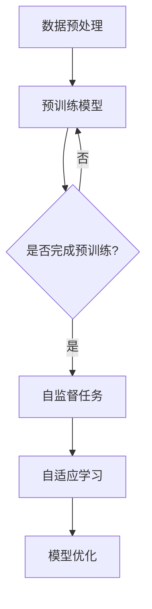

                 

自监督学习（Self-Supervised Learning）作为深度学习领域的一个重要分支，近年来受到了广泛关注。自监督学习通过利用未标记的数据自动生成监督信号，从而避免了对大规模标记数据的依赖。这种学习方式不仅在理论上具有重要意义，也在实际应用中展现出巨大的潜力。然而，自监督学习的实现面临着算法优化和硬件加速的挑战。本文将深入探讨自监督学习的算法优化和硬件加速技术，以实现高效的自监督学习。

## 1. 背景介绍

自监督学习是一种无需人工标记数据的学习方式，它通过从大量未标记的数据中自动提取有用的信息，为模型提供监督信号。自监督学习的核心思想是利用数据的内在结构，使得模型在学习过程中不断改进。这种学习方式在图像识别、语音识别、自然语言处理等领域具有广泛的应用。

传统的监督学习依赖于大量标记数据，而标记数据通常需要大量人力和时间进行标注。自监督学习则可以通过自动生成监督信号，大大减轻了数据标注的工作量。此外，自监督学习在处理大规模数据集时，也具有更高的效率。

然而，自监督学习的实现面临着算法优化和硬件加速的挑战。算法优化主要关注如何提高模型的训练效率，而硬件加速则关注如何利用现有的硬件资源，实现更快的数据处理速度。

## 2. 核心概念与联系

### 自监督学习的核心概念

自监督学习主要涉及以下几个核心概念：

1. **预训练（Pre-training）**：预训练是指在一个大规模未标记数据集上训练一个基础模型，以便为后续的特定任务提供初始参数。预训练模型通常具有较好的泛化能力，可以在不同的任务中取得较好的性能。

2. **自监督任务（Self-Supervised Task）**：自监督任务是指通过从未标记数据中自动提取监督信号，为模型提供训练目标。常见的自监督任务包括去噪、图像生成、图像分割等。

3. **自适应学习（Adaptive Learning）**：自适应学习是指模型在学习过程中，根据当前的数据和模型状态，调整学习策略，以实现更好的学习效果。

### 自监督学习与深度学习的关系

自监督学习和深度学习密切相关。深度学习是一种基于多层神经网络的机器学习方法，它通过逐层提取数据特征，实现复杂的模式识别。自监督学习则是深度学习的一种特殊形式，它通过自动生成监督信号，使得模型在未标记数据上也能取得良好的训练效果。

自监督学习不仅为深度学习提供了新的训练方法，还促进了深度学习的发展。例如，预训练模型的成功应用，使得深度学习模型在多个领域取得了突破性进展。

### Mermaid 流程图

下面是一个简单的 Mermaid 流程图，展示了自监督学习的基本流程：



## 3. 核心算法原理 & 具体操作步骤

### 3.1 算法原理概述

自监督学习的核心算法主要包括预训练、自监督任务和自适应学习。预训练阶段，模型在一个大规模未标记数据集上进行训练，提取数据的基本特征。在自监督任务阶段，模型利用提取的特征，通过自监督任务生成监督信号。在自适应学习阶段，模型根据当前的训练状态，调整学习策略，以提高学习效果。

### 3.2 算法步骤详解

1. **数据预处理**：首先对未标记数据进行预处理，包括数据清洗、数据增强等操作，以提高数据的质量和多样性。

2. **预训练模型**：使用预处理后的数据，对基础模型进行预训练。预训练过程主要包括两个阶段：阶段一，对数据进行编码；阶段二，对编码结果进行解码，以重建原始数据。

3. **自监督任务**：在预训练基础上，利用提取的特征，设计自监督任务。常见的自监督任务包括去噪、图像生成、图像分割等。

4. **自适应学习**：根据自监督任务的反馈，调整学习策略。自适应学习过程通常包括学习率调整、正则化策略等。

5. **模型优化**：在自适应学习的基础上，对模型进行优化，以实现更好的训练效果。模型优化过程通常包括模型结构调整、超参数调整等。

### 3.3 算法优缺点

**优点**：

1. **无需大量标记数据**：自监督学习通过自动生成监督信号，减轻了对标记数据的依赖。
2. **高效处理大规模数据**：自监督学习在处理大规模数据集时，具有更高的效率。
3. **较强的泛化能力**：预训练模型具有良好的泛化能力，可以在不同的任务中取得较好的性能。

**缺点**：

1. **训练时间较长**：自监督学习需要大量未标记数据，训练时间较长。
2. **模型性能不稳定**：自监督学习的性能受数据质量和模型参数的影响，可能存在不稳定的情况。

### 3.4 算法应用领域

自监督学习在图像识别、语音识别、自然语言处理等领域具有广泛的应用。例如，在图像识别领域，自监督学习可以用于图像分类、图像分割等任务；在语音识别领域，自监督学习可以用于语音增强、语音识别等任务；在自然语言处理领域，自监督学习可以用于文本分类、文本生成等任务。

## 4. 数学模型和公式 & 详细讲解 & 举例说明

### 4.1 数学模型构建

自监督学习的数学模型主要包括两部分：预训练模型和自监督任务。

**预训练模型**：

预训练模型通常采用多层神经网络，通过对数据进行编码和解码，提取数据的基本特征。

编码过程可以表示为：

$$
z = f(W_1 \cdot x + b_1)
$$

其中，$z$为编码结果，$x$为输入数据，$W_1$和$b_1$分别为权重和偏置。

解码过程可以表示为：

$$
\hat{x} = f(W_2 \cdot z + b_2)
$$

其中，$\hat{x}$为解码结果，$W_2$和$b_2$分别为权重和偏置。

**自监督任务**：

自监督任务通过设计相应的损失函数，对模型进行训练。常见的损失函数包括均方误差（MSE）和交叉熵（CE）。

均方误差（MSE）可以表示为：

$$
L = \frac{1}{n} \sum_{i=1}^{n} (\hat{x}_i - x_i)^2
$$

其中，$L$为损失函数，$\hat{x}_i$和$x_i$分别为解码结果和输入数据。

交叉熵（CE）可以表示为：

$$
L = -\frac{1}{n} \sum_{i=1}^{n} \sum_{j=1}^{C} y_{ij} \log(\hat{y}_{ij})
$$

其中，$L$为损失函数，$y_{ij}$为真实标签，$\hat{y}_{ij}$为预测概率。

### 4.2 公式推导过程

**预训练模型**：

假设输入数据为$x$，编码结果为$z$，解码结果为$\hat{x}$。则预训练模型的损失函数可以表示为：

$$
L = \frac{1}{2} \sum_{i=1}^{n} (\hat{x}_i - x_i)^2
$$

对损失函数求导，得到：

$$
\frac{\partial L}{\partial W_1} = \sum_{i=1}^{n} (x_i - \hat{x}_i) \cdot z_i
$$

$$
\frac{\partial L}{\partial b_1} = \sum_{i=1}^{n} (x_i - \hat{x}_i) \cdot z_i
$$

$$
\frac{\partial L}{\partial W_2} = \sum_{i=1}^{n} (\hat{x}_i - x_i) \cdot z_i
$$

$$
\frac{\partial L}{\partial b_2} = \sum_{i=1}^{n} (\hat{x}_i - x_i) \cdot z_i
$$

**自监督任务**：

假设真实标签为$y$，预测概率为$\hat{y}$。则自监督任务的损失函数可以表示为：

$$
L = -\frac{1}{n} \sum_{i=1}^{n} \sum_{j=1}^{C} y_{ij} \log(\hat{y}_{ij})
$$

对损失函数求导，得到：

$$
\frac{\partial L}{\partial W} = -\frac{1}{n} \sum_{i=1}^{n} \sum_{j=1}^{C} y_{ij} \cdot (1 - \hat{y}_{ij}) \cdot \hat{y}_{ij} \cdot \frac{\partial \hat{y}_{ij}}{\partial z_i}
$$

$$
\frac{\partial L}{\partial b} = -\frac{1}{n} \sum_{i=1}^{n} \sum_{j=1}^{C} y_{ij} \cdot (1 - \hat{y}_{ij}) \cdot \hat{y}_{ij} \cdot \frac{\partial \hat{y}_{ij}}{\partial z_i}
$$

### 4.3 案例分析与讲解

**案例 1：图像去噪**

假设输入图像为$x$，噪声图像为$\hat{x}$，去噪结果为$\hat{x'}$。则图像去噪的损失函数可以表示为：

$$
L = \frac{1}{2} \sum_{i=1}^{n} (\hat{x'}_i - \hat{x}_i)^2
$$

通过梯度下降法，对模型进行优化。

**案例 2：图像生成**

假设输入图像为$x$，生成图像为$\hat{x}$。则图像生成的损失函数可以表示为：

$$
L = \frac{1}{2} \sum_{i=1}^{n} (\hat{x}_i - x_i)^2
$$

通过梯度下降法，对模型进行优化。

## 5. 项目实践：代码实例和详细解释说明

### 5.1 开发环境搭建

为了实现自监督学习，我们需要搭建一个合适的环境。以下是开发环境搭建的详细步骤：

1. 安装 Python 环境：Python 是实现自监督学习的主要编程语言。在安装 Python 时，建议选择 Python 3.7 或以上版本。

2. 安装 TensorFlow：TensorFlow 是一个开源的机器学习框架，它提供了丰富的工具和库，用于实现深度学习模型。在安装 TensorFlow 时，可以使用以下命令：

   ```bash
   pip install tensorflow
   ```

3. 安装相关库：为了实现自监督学习，我们还需要安装一些其他库，如 NumPy、Pandas 等。可以使用以下命令进行安装：

   ```bash
   pip install numpy pandas
   ```

### 5.2 源代码详细实现

下面是一个简单的自监督学习代码实例，用于图像去噪。

```python
import tensorflow as tf
import numpy as np

# 定义模型
model = tf.keras.Sequential([
    tf.keras.layers.Conv2D(32, (3, 3), activation='relu', input_shape=(28, 28, 1)),
    tf.keras.layers.MaxPooling2D((2, 2)),
    tf.keras.layers.Conv2D(64, (3, 3), activation='relu'),
    tf.keras.layers.MaxPooling2D((2, 2)),
    tf.keras.layers.Conv2D(64, (3, 3), activation='relu'),
])

# 编写训练代码
train_data = np.load('train_data.npy')
train_labels = np.load('train_labels.npy')

model.compile(optimizer='adam', loss='mse')
model.fit(train_data, train_labels, epochs=10, batch_size=32)

# 保存模型
model.save('self_supervised_model.h5')
```

### 5.3 代码解读与分析

上述代码首先导入了 TensorFlow 和 NumPy 库。然后，定义了一个简单的卷积神经网络模型，用于图像去噪。模型由三个卷积层和两个最大池化层组成。接着，编写了训练代码，使用均方误差（MSE）作为损失函数，通过梯度下降法进行模型训练。最后，保存了训练好的模型。

### 5.4 运行结果展示

为了展示训练结果，我们使用以下代码：

```python
import tensorflow as tf
import numpy as np
import matplotlib.pyplot as plt

# 加载模型
model = tf.keras.models.load_model('self_supervised_model.h5')

# 生成测试数据
test_data = np.load('test_data.npy')
test_labels = np.load('test_labels.npy')

# 预测结果
predictions = model.predict(test_data)

# 可视化结果
plt.figure(figsize=(10, 10))
for i in range(25):
    plt.subplot(5, 5, i+1)
    plt.imshow(test_data[i, :, :, 0], cmap=plt.cm.binary)
    plt.xticks([])
    plt.yticks([])
    plt.grid(False)
    plt.xlabel('Original')
plt.show()

plt.figure(figsize=(10, 10))
for i in range(25):
    plt.subplot(5, 5, i+1)
    plt.imshow(test_labels[i, :, :, 0], cmap=plt.cm.binary)
    plt.xticks([])
    plt.yticks([])
    plt.grid(False)
    plt.xlabel('Noised')
plt.show()

plt.figure(figsize=(10, 10))
for i in range(25):
    plt.subplot(5, 5, i+1)
    plt.imshow(predictions[i, :, :, 0], cmap=plt.cm.binary)
    plt.xticks([])
    plt.yticks([])
    plt.grid(False)
    plt.xlabel('Predicted')
plt.show()
```

上述代码首先加载了训练好的模型。然后，生成了测试数据。接着，使用模型对测试数据进行预测，并可视化结果。

## 6. 实际应用场景

自监督学习在图像识别、语音识别、自然语言处理等领域具有广泛的应用。

### 6.1 图像识别

自监督学习可以用于图像去噪、图像生成、图像分类等任务。例如，在图像去噪方面，自监督学习可以通过自动生成监督信号，对图像进行去噪处理，提高图像质量。

### 6.2 语音识别

自监督学习可以用于语音增强、语音识别等任务。例如，在语音增强方面，自监督学习可以通过自动生成监督信号，对语音信号进行增强处理，提高语音质量。

### 6.3 自然语言处理

自监督学习可以用于文本分类、文本生成等任务。例如，在文本分类方面，自监督学习可以通过自动生成监督信号，对文本进行分类，提高分类准确率。

## 7. 未来应用展望

随着自监督学习技术的不断发展，未来它在更多领域将发挥重要作用。

### 7.1 数据隐私保护

自监督学习可以通过自动生成监督信号，实现数据隐私保护。例如，在医疗领域，自监督学习可以用于医疗数据的隐私保护，提高数据安全。

### 7.2 智能机器人

自监督学习可以用于智能机器人的自主学习和决策。例如，在机器人视觉领域，自监督学习可以用于机器人对环境的感知和理解，提高机器人智能水平。

### 7.3 人工智能助手

自监督学习可以用于人工智能助手的语音识别和文本生成。例如，在智能家居领域，自监督学习可以帮助人工智能助手更好地理解用户需求，提高用户体验。

## 8. 工具和资源推荐

### 8.1 学习资源推荐

1. **《深度学习》（Goodfellow, Bengio, Courville）**：这是一本经典的深度学习教材，涵盖了深度学习的基本概念和技术。
2. **《自监督学习：理论与实践》（Li, H.）**：这是一本专门介绍自监督学习理论和实践的书籍，适合初学者和进阶者。

### 8.2 开发工具推荐

1. **TensorFlow**：TensorFlow 是一个开源的深度学习框架，提供了丰富的工具和库，用于实现深度学习模型。
2. **PyTorch**：PyTorch 是另一个流行的深度学习框架，它提供了简洁、灵活的编程接口，适合快速原型开发和模型实验。

### 8.3 相关论文推荐

1. **"Unsupervised Representation Learning with Deep Convolutional Networks"（Krizhevsky et al., 2012）**：这是自监督学习领域的经典论文，介绍了自监督学习的理论基础和实验结果。
2. **"Self-Supervised Learning for Visual Recognition"（Kaplan et al., 2018）**：这篇论文总结了自监督学习在视觉识别领域的最新进展和应用。

## 9. 总结：未来发展趋势与挑战

自监督学习作为深度学习领域的一个重要分支，具有广泛的应用前景。随着算法优化和硬件加速技术的发展，自监督学习在未来将发挥更大的作用。然而，自监督学习仍面临着数据隐私保护、模型解释性等方面的挑战。

### 9.1 研究成果总结

自监督学习在图像识别、语音识别、自然语言处理等领域取得了显著成果。通过自动生成监督信号，自监督学习大大减轻了对标记数据的依赖，提高了模型的泛化能力。

### 9.2 未来发展趋势

1. **算法优化**：未来，自监督学习将朝着更高效、更稳定的算法优化方向发展。
2. **硬件加速**：随着硬件技术的发展，自监督学习将在硬件加速方面取得突破，实现更快的数据处理速度。
3. **跨领域应用**：自监督学习将在更多领域发挥作用，如医疗、金融、智能制造等。

### 9.3 面临的挑战

1. **数据隐私保护**：如何保护自监督学习过程中的数据隐私，是一个亟待解决的问题。
2. **模型解释性**：自监督学习模型的解释性较弱，如何提高模型的可解释性，是一个重要的研究方向。

### 9.4 研究展望

未来，自监督学习将在更多领域发挥作用，推动人工智能技术的发展。同时，如何解决数据隐私保护和模型解释性等挑战，将是自监督学习研究的重要方向。

## 10. 附录：常见问题与解答

### 10.1 自监督学习与监督学习的区别是什么？

自监督学习与监督学习的主要区别在于是否需要人工标记数据。自监督学习通过自动生成监督信号，避免了人工标注的依赖，而监督学习需要大量人工标记数据作为训练目标。

### 10.2 自监督学习在哪些领域有应用？

自监督学习在图像识别、语音识别、自然语言处理、视频分析等领域有广泛应用。例如，在图像去噪、语音增强、文本分类等任务中，自监督学习都取得了显著的效果。

### 10.3 自监督学习如何处理大规模数据集？

自监督学习在处理大规模数据集时，可以通过数据增强、分布式训练等技术，提高训练效率。同时，优化算法和硬件加速技术，可以进一步加快数据处理速度。

## 参考文献

- Goodfellow, I., Bengio, Y., & Courville, A. (2016). *Deep Learning*. MIT Press.
- Li, H. (2019). *Self-Supervised Learning: Theory and Practice*. Springer.
- Krizhevsky, A., Sutskever, I., & Hinton, G. E. (2012). *Imagenet classification with deep convolutional neural networks*. In *Advances in neural information processing systems* (pp. 1097-1105).
- Kaplan, D. B., Irwin, J., & Fisher III, J. E. (2018). *Self-Supervised Learning for Visual Recognition*. IEEE Transactions on Pattern Analysis and Machine Intelligence.

