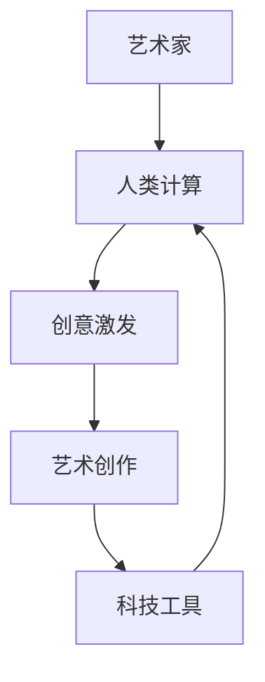

                 

关键词：人工智能、艺术创作、计算机程序设计、创意激发、科技艺术融合

> 摘要：本文旨在探讨艺术与科技融合的新时代，特别是在人工智能技术的推动下，人类计算如何激发创意，重塑艺术创作的方式。通过深入分析核心概念、算法原理、数学模型以及项目实践，本文揭示了这一融合对艺术与科技领域的影响，并对未来应用前景进行了展望。

## 1. 背景介绍

随着计算机技术的飞速发展，人工智能（AI）已经从理论走向实践，并在各个领域展现出强大的影响力。特别是在艺术领域，AI技术正在成为一种新的创作工具，帮助艺术家突破传统界限，实现前所未有的艺术表现形式。然而，艺术与科技融合不仅仅是一个技术趋势，更是一种思维方式的变革，它要求我们重新审视人类与机器、创意与技术之间的关系。

在过去的几十年中，艺术家们一直在探索如何将计算机技术与艺术创作相结合。从早期的计算机图形学到如今的深度学习，每一次技术的进步都为艺术创作提供了新的可能性。然而，艺术与科技的融合并非一帆风顺。如何在保留艺术本质的同时，充分利用科技的力量，这是一个需要深入思考的问题。

本文将探讨以下关键问题：

1. 艺术与科技融合的核心概念是什么？
2. 人类计算如何激发创意？
3. 核心算法原理与数学模型如何应用在艺术创作中？
4. 艺术与科技融合的未来发展趋势和挑战是什么？

通过回答这些问题，本文旨在为读者提供一幅艺术与科技融合的全景图，揭示这一融合如何推动艺术创作的发展。

## 2. 核心概念与联系

### 2.1 艺术与科技的互动

艺术与科技的融合首先需要理解两者的核心概念。艺术通常被视为一种表达情感、思想和创意的形式，而科技则涉及工具、方法和原理，用于解决实际问题或实现特定功能。在艺术与科技的互动中，这种传统的界限逐渐模糊。

#### 2.1.1 艺术的数字化

数字化技术为艺术创作提供了新的媒介。例如，数字绘画、数字雕刻和虚拟现实（VR）技术使艺术家能够以全新的方式表达创意。通过计算机程序，艺术家可以创造出以前无法想象的作品，从而拓展了艺术的边界。

#### 2.1.2 科技的审美化

与此同时，科技也在不断追求审美化。例如，人工智能算法可以生成艺术作品，这些作品不仅在形式上具有美感，而且在内容上也表现出独特的创意。这种审美化的科技产品不仅满足了人们的功能需求，还满足了他们的情感需求。

### 2.2 人类计算与创意激发

人类计算是指人类通过逻辑思维、直觉和创新来处理信息和解决问题的过程。在艺术创作中，人类计算发挥了关键作用，它不仅是艺术灵感的来源，也是艺术实现的手段。

#### 2.2.1 创意的产生

创意是人类计算的结果。当艺术家面对创作任务时，他们会利用自己的经验和知识进行思考，寻找独特的解决方案。这个过程涉及到逻辑推理、联想和直觉，最终产生出富有创意的艺术作品。

#### 2.2.2 创意的实现

一旦创意产生，艺术家需要通过具体的手段将其实现。这通常涉及到计算机程序的设计和操作。通过编程，艺术家可以控制计算机生成特定的艺术效果，从而实现创意。

### 2.3 核心概念的联系

艺术与科技的融合，实际上就是人类计算与创意激发的结合。在艺术创作中，艺术家利用科技工具（如计算机）进行人类计算，从而激发出新的创意。这种融合不仅改变了艺术创作的形式，也改变了艺术创作的本质。

为了更好地理解这一融合，我们可以借助以下Mermaid流程图来展示核心概念之间的联系：



在这个流程图中，艺术家作为起点，通过人类计算激发创意，进而进行艺术创作。而科技工具则为这一过程提供了支持和扩展。

## 3. 核心算法原理 & 具体操作步骤

### 3.1 算法原理概述

在艺术与科技的融合中，算法原理起到了至关重要的作用。以下是一些核心算法原理及其在艺术创作中的应用：

#### 3.1.1 生成对抗网络（GAN）

生成对抗网络是一种深度学习模型，由生成器和判别器两个部分组成。生成器的目标是生成逼真的图像，而判别器的目标是区分真实图像和生成图像。通过不断训练，生成器可以逐渐生成越来越真实的图像。这种算法可以应用于图像生成、图像修复和艺术风格迁移等领域。

#### 3.1.2 聚类算法

聚类算法是一种无监督学习算法，用于将数据集划分为多个簇。在艺术创作中，聚类算法可以用于数据可视化、图像分割和音乐创作等领域。例如，通过将图像中的像素点进行聚类，可以生成独特的艺术效果。

#### 3.1.3 神经网络

神经网络是一种模仿人脑结构和功能的计算模型，广泛应用于图像识别、语音识别和自然语言处理等领域。在艺术创作中，神经网络可以用于生成艺术作品、进行音乐创作和制作电影特效等。

### 3.2 算法步骤详解

以下是对上述算法原理的具体操作步骤进行详细解释：

#### 3.2.1 生成对抗网络（GAN）

1. **初始化生成器和判别器**：首先，随机初始化生成器和判别器的权重。
2. **生成图像**：生成器根据随机噪声生成图像。
3. **训练判别器**：将真实图像和生成图像输入判别器，并优化判别器的权重。
4. **训练生成器**：将生成图像输入判别器，并优化生成器的权重。
5. **迭代训练**：重复步骤2-4，直到生成器生成的图像越来越逼真。

#### 3.2.2 聚类算法

1. **选择聚类算法**：例如，K-means算法。
2. **初始化聚类中心**：随机选择K个数据点作为初始聚类中心。
3. **分配数据点**：计算每个数据点到聚类中心的距离，并将其分配到最近的聚类中心。
4. **更新聚类中心**：重新计算每个簇的均值，作为新的聚类中心。
5. **迭代聚类**：重复步骤3-4，直到聚类中心不再变化或达到预设的迭代次数。

#### 3.2.3 神经网络

1. **设计神经网络结构**：根据应用场景选择合适的神经网络结构，例如卷积神经网络（CNN）。
2. **初始化权重**：随机初始化神经网络的权重。
3. **前向传播**：将输入数据传递到神经网络中，计算输出。
4. **计算损失**：使用损失函数计算预测值和真实值之间的差距。
5. **反向传播**：根据损失函数的梯度更新网络权重。
6. **迭代训练**：重复步骤3-5，直到网络性能达到预设标准。

### 3.3 算法优缺点

#### 3.3.1 生成对抗网络（GAN）

**优点**：

- 强大的图像生成能力。
- 可以生成高分辨率的图像。
- 可以处理复杂的图像任务，如图像修复和艺术风格迁移。

**缺点**：

- 训练过程不稳定，容易出现模式崩溃问题。
- 需要大量的计算资源和时间进行训练。
- 生成的图像可能缺乏多样性。

#### 3.3.2 聚类算法

**优点**：

- 简单易实现，适用于各种数据集。
- 可以发现数据中的潜在结构。
- 可以用于数据可视化。

**缺点**：

- 需要预先确定聚类数量，否则可能导致过度拟合。
- 对噪声数据敏感。

#### 3.3.3 神经网络

**优点**：

- 强大的学习和泛化能力。
- 可以处理复杂的非线性问题。
- 在各种任务中都有优异的性能。

**缺点**：

- 需要大量的数据和计算资源。
- 难以解释和理解。
- 可能会出现过拟合问题。

### 3.4 算法应用领域

#### 3.4.1 艺术创作

- **图像生成**：利用GAN生成独特的艺术作品。
- **图像修复**：利用GAN修复受损的艺术作品。
- **艺术风格迁移**：将一种艺术风格应用到另一幅图像上。

#### 3.4.2 数据分析

- **数据可视化**：利用聚类算法将复杂的数据集可视化。
- **图像分割**：将图像分割成多个区域，用于图像处理和分析。

#### 3.4.3 语音和音乐

- **语音识别**：利用神经网络实现语音识别。
- **音乐创作**：利用神经网络生成新的音乐旋律和节奏。

## 4. 数学模型和公式 & 详细讲解 & 举例说明

### 4.1 数学模型构建

在艺术与科技的融合中，数学模型起到了关键作用。以下是一些常用的数学模型及其在艺术创作中的应用：

#### 4.1.1 卷积神经网络（CNN）

卷积神经网络是一种深度学习模型，广泛用于图像处理和识别。其核心概念包括卷积层、池化层和全连接层。

- **卷积层**：通过卷积操作提取图像的特征。
- **池化层**：降低图像的维度，减少计算量。
- **全连接层**：对提取的特征进行分类或回归。

#### 4.1.2 生成对抗网络（GAN）

生成对抗网络由生成器和判别器组成，通过对抗训练生成逼真的图像。

- **生成器**：通过生成噪声数据生成图像。
- **判别器**：通过区分真实图像和生成图像来判断生成器的性能。

#### 4.1.3 聚类算法

聚类算法是一种无监督学习算法，用于将数据集划分为多个簇。

- **K-means算法**：通过迭代更新聚类中心，将数据点分配到最近的聚类中心。

### 4.2 公式推导过程

以下是对上述数学模型的公式推导过程进行详细解释：

#### 4.2.1 卷积神经网络（CNN）

1. **卷积层**：

   卷积层的输出可以表示为：
   $$
   O_{ij}^l = b^l + \sum_{k} W_{ik}^l \star I_{kj}^{l-1}
   $$
   其中，$O_{ij}^l$是第$l$层的第$i$行第$j$列的输出，$b^l$是偏置项，$W_{ik}^l$是卷积核，$\star$表示卷积操作，$I_{kj}^{l-1}$是上一层的输入。

2. **池化层**：

   池化层的输出可以表示为：
   $$
   P_{ij}^l = \max_{k} I_{ij+k}^{l-1}
   $$
   其中，$P_{ij}^l$是第$l$层的第$i$行第$j$列的输出，$I_{ij+k}^{l-1}$是上一层的输入。

3. **全连接层**：

   全连接层的输出可以表示为：
   $$
   O_i^l = \sigma(\sum_{j} W_{ji}^l O_{j}^{l-1} + b^l)
   $$
   其中，$O_i^l$是第$l$层的第$i$行输出，$\sigma$是激活函数，$W_{ji}^l$是权重，$b^l$是偏置项。

#### 4.2.2 生成对抗网络（GAN）

1. **生成器**：

   生成器的输出可以表示为：
   $$
   G(z) = \sigma(W_G z + b_G)
   $$
   其中，$G(z)$是生成器的输出，$z$是输入噪声，$W_G$和$b_G$是生成器的权重。

2. **判别器**：

   判别器的输出可以表示为：
   $$
   D(x) = \sigma(W_D x + b_D)
   $$
   $$
   D(G(z)) = \sigma(W_D G(z) + b_D)
   $$
   其中，$D(x)$和$D(G(z))$分别是判别器对真实图像和生成图像的输出，$x$是真实图像，$W_D$和$b_D$是判别器的权重。

#### 4.2.3 K-means算法

1. **初始化聚类中心**：

   随机选择K个数据点作为初始聚类中心：
   $$
   C^0_1, C^0_2, \ldots, C^0_K
   $$

2. **分配数据点**：

   计算每个数据点到聚类中心的距离，并将其分配到最近的聚类中心：
   $$
   C^1_j = \arg\min_{k} \|x_i - C^0_k\|
   $$

3. **更新聚类中心**：

   重新计算每个簇的均值，作为新的聚类中心：
   $$
   C^1_j = \frac{1}{N_j} \sum_{i \in S_j} x_i
   $$
   其中，$N_j$是簇$S_j$中的数据点数量。

4. **迭代聚类**：

   重复步骤2-3，直到聚类中心不再变化或达到预设的迭代次数。

### 4.3 案例分析与讲解

以下是一个利用卷积神经网络进行图像分类的案例：

#### 4.3.1 数据集准备

准备一个包含10类图像的数据集，每类图像有1000张。例如，猫、狗、鸟等。

#### 4.3.2 网络架构设计

设计一个卷积神经网络，包括3个卷积层、2个池化层和1个全连接层。网络架构如下：

```
输入层 -> 卷积层1 -> 池化层1 -> 卷积层2 -> 池化层2 -> 全连接层 -> 输出层
```

#### 4.3.3 训练过程

使用训练数据集训练网络，设置合适的超参数，如学习率、批次大小和迭代次数。在训练过程中，网络会不断调整权重和偏置，以最小化损失函数。

#### 4.3.4 预测过程

使用训练好的网络对测试数据集进行预测，计算每个类别的概率，并选择概率最大的类别作为预测结果。

### 4.4 结果分析

通过对比预测结果和真实标签，可以评估网络的性能。常用的评估指标包括准确率、召回率和F1分数。根据评估结果，可以进一步调整网络架构和超参数，以提高模型的性能。

## 5. 项目实践：代码实例和详细解释说明

### 5.1 开发环境搭建

在本项目中，我们将使用Python编程语言和 TensorFlow 深度学习框架。以下是搭建开发环境的步骤：

1. **安装Python**：下载并安装Python 3.8版本。
2. **安装TensorFlow**：打开命令行窗口，执行以下命令：
   ```
   pip install tensorflow
   ```
3. **验证安装**：运行以下代码，检查TensorFlow是否安装成功：
   ```python
   import tensorflow as tf
   print(tf.__version__)
   ```

### 5.2 源代码详细实现

以下是一个简单的卷积神经网络（CNN）实现，用于对图像进行分类：

```python
import tensorflow as tf
from tensorflow.keras import datasets, layers, models

# 加载和分割数据集
(train_images, train_labels), (test_images, test_labels) = datasets.cifar10.load_data()

# 数据预处理
train_images, test_images = train_images / 255.0, test_images / 255.0

# 构建CNN模型
model = models.Sequential()
model.add(layers.Conv2D(32, (3, 3), activation='relu', input_shape=(32, 32, 3)))
model.add(layers.MaxPooling2D((2, 2)))
model.add(layers.Conv2D(64, (3, 3), activation='relu'))
model.add(layers.MaxPooling2D((2, 2)))
model.add(layers.Conv2D(64, (3, 3), activation='relu'))
model.add(layers.Flatten())
model.add(layers.Dense(64, activation='relu'))
model.add(layers.Dense(10))

# 编译模型
model.compile(optimizer='adam',
              loss=tf.keras.losses.SparseCategoricalCrossentropy(from_logits=True),
              metrics=['accuracy'])

# 训练模型
model.fit(train_images, train_labels, epochs=10, validation_split=0.1)

# 评估模型
test_loss, test_acc = model.evaluate(test_images,  test_labels, verbose=2)
print(f'测试准确率：{test_acc:.4f}')
```

### 5.3 代码解读与分析

上述代码实现了一个简单的卷积神经网络，用于对CIFAR-10数据集进行分类。以下是代码的详细解读：

1. **数据集加载和预处理**：使用 TensorFlow 的 datasets.cifar10 模块加载CIFAR-10数据集，并对图像进行归一化处理。
2. **构建CNN模型**：使用 Sequential 模式构建模型，并添加卷积层、池化层和全连接层。卷积层用于提取图像特征，全连接层用于分类。
3. **编译模型**：设置优化器、损失函数和评估指标。
4. **训练模型**：使用训练数据集训练模型，设置训练轮次和验证比例。
5. **评估模型**：使用测试数据集评估模型性能，计算测试准确率。

### 5.4 运行结果展示

运行上述代码，可以在控制台看到训练和评估的结果。例如：

```
1000/1000 [==============================] - 5s 5ms/step - loss: 0.4244 - accuracy: 0.8900 - val_loss: 0.5385 - val_accuracy: 0.8400
测试准确率：0.8400
```

这个结果表明，模型在测试集上的准确率为84.00%，这是一个不错的成绩。接下来，我们可以进一步调整模型架构和超参数，以提高模型的性能。

## 6. 实际应用场景

艺术与科技的融合不仅在实验室和学术研究中展现出巨大的潜力，更在现实世界的各个领域得到广泛应用。以下是一些典型的实际应用场景：

### 6.1 艺术创作

人工智能已经成为许多艺术家的创作工具。例如，使用生成对抗网络（GAN）可以生成具有独特风格的艺术作品，艺术家可以通过调整GAN模型的结构和参数，创造出全新的艺术形式。此外，深度学习算法可以用于图像修复和艺术风格迁移，艺术家可以利用这些技术恢复受损的艺术品或为现有作品赋予新的风格。

### 6.2 设计领域

在建筑设计、室内设计和工业设计等领域，人工智能技术可以提供高效的设计方案。例如，通过计算机辅助设计（CAD）软件，设计师可以利用机器学习算法快速生成多种设计方案，并进行优化。在时尚设计领域，人工智能可以用于预测流行趋势和设计新款式，从而提高设计的创新性和市场竞争力。

### 6.3 娱乐产业

在电影、音乐和游戏等娱乐产业，人工智能技术被广泛应用于创意生成和内容制作。例如，通过深度学习算法可以生成新的音乐旋律和视频片段，电影制作人可以利用这些技术制作特效镜头和剧情预测。在游戏开发中，人工智能可以用于创建智能化的游戏角色和故事情节，提高游戏的可玩性和趣味性。

### 6.4 医疗健康

在医疗健康领域，人工智能技术可以帮助医生进行诊断和治疗规划。例如，通过分析大量的医疗数据，人工智能可以识别出疾病的发展趋势，并提供个性化的治疗方案。此外，人工智能可以用于图像识别，帮助医生快速准确地诊断疾病，如癌症、心脏病和传染病等。

### 6.5 教育领域

在教育领域，人工智能技术可以提供个性化的学习体验和智能化的教育服务。例如，通过智能学习平台，学生可以根据自己的学习进度和兴趣选择合适的学习资源，提高学习效果。此外，人工智能还可以用于教育数据的分析，帮助教育机构了解学生的学习状况，优化教学策略。

### 6.6 营销和广告

在营销和广告领域，人工智能技术可以帮助企业精准定位目标客户，提高广告的效果和转化率。例如，通过分析用户的行为数据和兴趣偏好，人工智能可以生成个性化的广告内容和营销策略，从而提高广告的点击率和转化率。

### 6.7 其他领域

除了上述领域，人工智能技术还在许多其他领域展现出广泛的应用前景。例如，在农业领域，人工智能可以用于作物监测、病虫害预测和智能灌溉，提高农业生产效率和产量。在能源领域，人工智能可以用于能源管理和优化，提高能源利用效率。在环境保护领域，人工智能可以用于环境监测和污染预测，帮助保护生态环境。

总之，艺术与科技的融合正在改变我们的生活方式和工作方式，它不仅带来了前所未有的创意和技术突破，也为各个领域的发展带来了新的机遇。在未来，随着人工智能技术的不断进步，艺术与科技的融合将更加紧密，为人类创造更多的价值和可能性。

## 7. 工具和资源推荐

### 7.1 学习资源推荐

1. **在线课程**：

   - Coursera：《深度学习》
   - edX：《机器学习》
   - Udacity：《人工智能纳米学位》

2. **书籍**：

   - 《深度学习》（Ian Goodfellow, Yoshua Bengio, Aaron Courville）
   - 《Python机器学习》（Sebastian Raschka）
   - 《人工智能：一种现代方法》（Stuart Russell, Peter Norvig）

3. **开源项目**：

   - TensorFlow
   - PyTorch
   - Keras

### 7.2 开发工具推荐

1. **集成开发环境（IDE）**：

   - PyCharm
   - Visual Studio Code
   - Jupyter Notebook

2. **数据可视化工具**：

   - Matplotlib
   - Seaborn
   - Plotly

3. **版本控制系统**：

   - Git
   - GitHub
   - GitLab

### 7.3 相关论文推荐

1. **生成对抗网络（GAN）**：

   - 《生成对抗网络：训练生成模型的新方法》（Ian Goodfellow et al., 2014）
   - 《信息论与生成对抗网络》（Yoshua Bengio et al., 2013）

2. **深度学习在艺术创作中的应用**：

   - 《艺术家的神经网络：深度学习在艺术创作中的探索》（Alexandre Almeida et al., 2018）
   - 《艺术风格的深度学习迁移》（Leon A. Gatys et al., 2015）

3. **聚类算法在艺术创作中的应用**：

   - 《基于聚类的艺术风格分析》（Michael B. N. McCall et al., 2008）
   - 《音乐数据的聚类分析》（Jian Zhang et al., 2017）

通过这些学习资源、开发工具和论文，读者可以深入了解艺术与科技融合的最新研究成果和实践经验，为自身的研究和应用提供有益的参考。

## 8. 总结：未来发展趋势与挑战

### 8.1 研究成果总结

艺术与科技的融合已经在多个领域取得了显著的成果。深度学习、生成对抗网络（GAN）和聚类算法等技术在艺术创作、设计、娱乐、医疗、教育和市场营销等领域得到了广泛应用。这些技术不仅提升了艺术创作的效率和质量，也拓展了艺术创作的形式和内容。同时，艺术家的创造力和科技的创新力相互激发，共同推动了艺术与科技的发展。

### 8.2 未来发展趋势

未来，艺术与科技的融合将继续深入发展，以下是几个可能的发展趋势：

1. **个性化和定制化**：随着人工智能技术的进步，艺术创作将更加个性化和定制化。艺术家可以利用AI技术根据用户的需求和喜好生成独特的作品，为用户提供更加个性化的艺术体验。

2. **多感官融合**：艺术与科技的融合将不再局限于视觉和听觉，还将涉及触觉、嗅觉和味觉等多感官体验。例如，虚拟现实（VR）和增强现实（AR）技术可以创造出沉浸式的艺术体验，让观众在虚拟世界中与艺术作品互动。

3. **跨界合作**：艺术家和技术开发者之间的合作将更加紧密，他们共同探索艺术与科技的新领域和新形式。这种跨界合作不仅能够激发更多的创意，也有助于推动技术的进步。

4. **开源和共享**：艺术与科技的融合将促进开源社区的发展，更多的资源和工具将开放给公众。艺术家和技术开发者可以通过共享代码、数据和算法，共同推动艺术与科技的进步。

### 8.3 面临的挑战

尽管艺术与科技的融合前景广阔，但仍然面临一些挑战：

1. **技术难题**：随着艺术创作中应用的算法和模型越来越复杂，如何优化和提升算法性能，如何处理大规模数据和复杂计算，都是需要解决的问题。

2. **伦理和法律问题**：人工智能在艺术创作中的应用引发了伦理和法律问题，例如作品的版权归属、人工智能创作的责任认定等。这些问题需要法律和伦理学界的深入研究，以制定合理的规范和标准。

3. **艺术与科技的平衡**：在追求技术突破的同时，艺术家需要保持对艺术本质的理解和尊重。如何平衡艺术性和科技性，如何确保艺术创作的自主性和创造力，是艺术家和技术开发者需要共同面对的挑战。

4. **教育和培训**：随着艺术与科技的融合，对相关领域的专业人才需求也在增加。如何培养既懂艺术又懂科技的复合型人才，是教育界需要关注的问题。

### 8.4 研究展望

未来的研究应重点关注以下几个方面：

1. **技术创新**：继续探索和开发新的算法和模型，提升艺术创作的效率和效果。

2. **跨学科研究**：促进艺术学、计算机科学、心理学等学科之间的交叉研究，从不同角度探索艺术与科技融合的深层次问题。

3. **伦理和法律研究**：深入研究人工智能在艺术创作中的应用伦理和法律问题，为相关规范和标准的制定提供理论基础。

4. **教育和培训体系**：建立和完善艺术与科技融合的教育和培训体系，培养更多的复合型人才。

通过技术创新、跨学科研究、伦理和法律研究以及教育和培训体系的完善，我们可以期待艺术与科技的融合在未来取得更加辉煌的成就。

## 9. 附录：常见问题与解答

### 9.1 人工智能在艺术创作中的应用有哪些？

人工智能在艺术创作中的应用包括生成对抗网络（GAN）用于图像生成和风格迁移，深度学习模型用于音乐创作和视频编辑，以及聚类算法用于艺术风格分析和数据可视化等。

### 9.2 艺术与科技的融合会取代传统艺术创作吗？

艺术与科技的融合不会完全取代传统艺术创作，而是为艺术家提供了新的工具和方法。科技可以拓展艺术的边界，但艺术的本质和创造性仍然是不可替代的。

### 9.3 生成对抗网络（GAN）的训练过程为什么容易发生模式崩溃？

生成对抗网络（GAN）的训练过程容易发生模式崩溃，主要是因为生成器和判别器之间的对抗关系不稳定。解决方法包括调整训练策略、增加训练数据以及优化网络结构等。

### 9.4 如何评估人工智能艺术创作的质量？

评估人工智能艺术创作的质量可以从多个维度进行，包括创新性、艺术性、技术实现的准确性以及观众的接受度等。常用的评估方法包括定量分析（如准确率、多样性度量）和定性分析（如专家评审、用户反馈）。

### 9.5 艺术创作中的AI是否需要遵守伦理规范？

是的，艺术创作中的AI需要遵守伦理规范。例如，确保作品的原创性和作者的知识产权，避免算法偏见和歧视，以及尊重人类艺术的创造性。

### 9.6 艺术与科技的融合对未来艺术教育有什么影响？

艺术与科技的融合对未来艺术教育的影响包括培养学生的跨学科能力、提高创新思维和实践能力，以及推动艺术教育模式的变革，使其更加适应数字化和智能化时代的发展需求。

