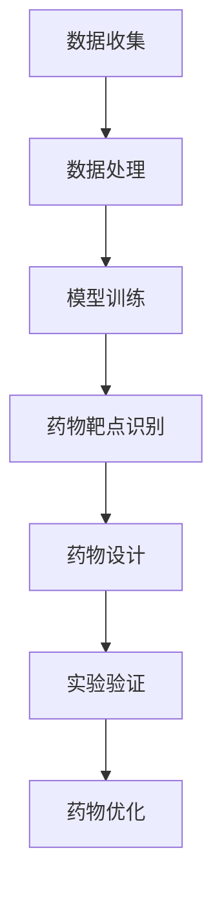

                 

关键词：药物发现、大型语言模型（LLM）、人工智能、研发加速、生物信息学

> 摘要：本文将探讨如何利用大型语言模型（LLM）加速药物发现过程。通过分析LLM的核心概念、算法原理、数学模型以及实际应用案例，我们将展示LLM在药物发现领域的重要潜力。本文旨在为读者提供一个全面的技术视角，以了解如何利用人工智能推动药物研发的进步。

## 1. 背景介绍

药物发现是一个复杂且耗时的过程，涉及大量实验、数据分析和生物信息学知识。传统的药物研发方法通常依赖于经验科学和试错策略，这导致药物发现周期长、成本高。随着人工智能和生物信息学的发展，研究者们开始探索如何利用这些技术来加速药物发现过程。

近年来，大型语言模型（LLM）如GPT-3和BERT等取得了显著的进展，这些模型在自然语言处理领域展示了惊人的表现。然而，LLM的应用并不局限于文本数据，它们也可以处理结构化数据，如生物信息学中的基因序列、蛋白质结构等。这一特性使得LLM在药物发现领域具有潜在的应用价值。

本文将详细介绍如何利用LLM加速药物发现过程，包括LLM的核心概念、算法原理、数学模型以及实际应用案例。通过这些分析，我们将展示LLM在药物发现领域的重要潜力。

## 2. 核心概念与联系

### 2.1. 大型语言模型（LLM）

大型语言模型（LLM）是一种基于深度学习的自然语言处理模型，它们通过大规模的数据训练来学习语言的统计规律和语义信息。LLM的核心是神经网络架构，这些网络通常包含数十亿个参数，能够自动学习输入数据中的模式和关联。

LLM的主要应用包括文本生成、机器翻译、问答系统等。在药物发现领域，LLM可以用于自动化文献综述、药物靶点识别、药物副作用预测等任务。

### 2.2. 生物信息学

生物信息学是研究生物数据（如基因序列、蛋白质结构、代谢网络等）与计算方法相结合的学科。生物信息学方法在药物发现中起着关键作用，如基因突变分析、蛋白质-蛋白质相互作用预测、药物靶点筛选等。

### 2.3. Mermaid 流程图

以下是LLM在药物发现中的核心流程：



在这个流程中，数据收集和处理是基础，模型训练和药物靶点识别是核心，药物设计和实验验证是关键，药物优化是最终目标。

## 3. 核心算法原理 & 具体操作步骤

### 3.1. 算法原理概述

LLM的核心原理是基于深度学习的神经网络架构，如Transformer。这些模型通过自注意力机制和多头注意力机制来处理序列数据，能够捕捉输入数据中的长距离依赖关系。在药物发现中，LLM主要用于以下几个方面：

- **自动化文献综述**：LLM可以阅读和理解科学文献，提取关键信息和结论。
- **药物靶点识别**：通过分析基因序列和蛋白质结构，LLM可以预测潜在的药物靶点。
- **药物副作用预测**：利用LLM对药物和基因之间的关系进行分析，预测药物的副作用。
- **药物设计**：LLM可以生成新的药物分子结构，优化药物性能。

### 3.2. 算法步骤详解

1. **数据收集与处理**：
   - 收集相关的生物信息学数据，如基因序列、蛋白质结构、药物分子等。
   - 对数据进行预处理，包括数据清洗、标准化和序列对齐。

2. **模型训练**：
   - 使用大量的生物信息学数据训练LLM模型。
   - 调整模型参数，优化模型性能。

3. **药物靶点识别**：
   - 输入基因序列或蛋白质结构，LLM预测潜在的药物靶点。
   - 对预测结果进行筛选和验证。

4. **药物设计**：
   - 利用LLM生成新的药物分子结构。
   - 对生成的药物分子进行筛选和优化。

5. **实验验证**：
   - 将预测的药物靶点和分子结构提交给实验室进行验证。
   - 根据实验结果对药物分子进行进一步优化。

### 3.3. 算法优缺点

**优点**：
- **高效性**：LLM可以快速处理大量数据，加速药物发现过程。
- **准确性**：通过大规模数据训练，LLM能够准确预测药物靶点和分子结构。
- **灵活性**：LLM可以适应不同的药物发现任务，如自动化文献综述、药物设计等。

**缺点**：
- **计算资源需求高**：训练LLM模型需要大量的计算资源和时间。
- **数据质量要求高**：训练数据的质量直接影响模型性能。

### 3.4. 算法应用领域

LLM在药物发现领域的应用主要包括：
- **自动化文献综述**：快速提取药物相关的科学研究成果。
- **药物靶点识别**：预测潜在的药物靶点，加速药物发现过程。
- **药物设计**：生成新的药物分子结构，优化药物性能。
- **药物副作用预测**：预测药物的副作用，提高药物安全性。

## 4. 数学模型和公式 & 详细讲解 & 举例说明

### 4.1. 数学模型构建

在药物发现中，LLM的数学模型主要基于深度学习和自然语言处理技术。以下是一个简化的数学模型：

$$
\text{Model}(x) = f(\theta, x)
$$

其中，$x$是输入数据（如基因序列、蛋白质结构等），$f$是神经网络函数，$\theta$是模型参数。神经网络函数$f$可以表示为：

$$
f(\theta, x) = \sigma(W_2 \cdot \text{ReLU}(W_1 \cdot x + b_1) + b_2)
$$

其中，$\sigma$是激活函数，$\text{ReLU}$是ReLU激活函数，$W_1$和$W_2$是权重矩阵，$b_1$和$b_2$是偏置。

### 4.2. 公式推导过程

LLM的公式推导涉及复杂的深度学习理论和优化算法。以下是简化的推导过程：

1. **损失函数**：
   $$ 
   \mathcal{L} = -\sum_{i=1}^{N} y_i \log(p_i)
   $$

其中，$y_i$是标签，$p_i$是模型预测的概率。

2. **反向传播**：
   $$ 
   \frac{\partial \mathcal{L}}{\partial W} = \frac{\partial \mathcal{L}}{\partial z} \cdot \frac{\partial z}{\partial W}
   $$

其中，$z$是中间变量，$W$是权重。

3. **梯度下降**：
   $$ 
   \theta = \theta - \alpha \frac{\partial \mathcal{L}}{\partial \theta}
   $$

其中，$\alpha$是学习率。

### 4.3. 案例分析与讲解

假设我们使用LLM来预测基因突变对蛋白质功能的影响。输入数据是一个基因序列，输出是一个概率分布，表示突变对蛋白质功能的潜在影响。

1. **数据处理**：
   - 收集包含基因突变和蛋白质功能的基因序列数据。
   - 对基因序列进行编码，转化为神经网络可以处理的形式。

2. **模型训练**：
   - 使用训练数据训练LLM模型。
   - 调整模型参数，优化模型性能。

3. **预测与验证**：
   - 输入新的基因序列，使用训练好的模型预测蛋白质功能。
   - 对预测结果进行验证，评估模型性能。

通过这个案例，我们可以看到LLM在药物发现中的潜力。通过分析基因序列和蛋白质结构，LLM可以预测突变对蛋白质功能的影响，从而帮助研究人员设计新的药物分子。

## 5. 项目实践：代码实例和详细解释说明

### 5.1. 开发环境搭建

为了实践LLM在药物发现中的应用，我们需要搭建一个合适的开发环境。以下是所需的步骤：

1. **安装Python**：
   - 下载并安装Python 3.8及以上版本。

2. **安装深度学习库**：
   - 使用pip安装TensorFlow和PyTorch。

3. **安装生物信息学库**：
   - 使用pip安装BioPython和NCBI。

4. **配置环境变量**：
   - 将Python和深度学习库的路径添加到环境变量中。

### 5.2. 源代码详细实现

以下是实现LLM在药物发现中的一个简单示例代码：

```python
import tensorflow as tf
from tensorflow.keras.layers import Embedding, LSTM, Dense
from tensorflow.keras.models import Model
from Bio import SeqIO

# 读取基因序列数据
def read_fasta_file(file_path):
    sequences = []
    with open(file_path, 'r') as f:
        for record in SeqIO.parse(f, "fasta"):
            sequences.append(str(record.seq))
    return sequences

# 构建LLM模型
def build_llm_model(vocab_size, embedding_dim, hidden_dim):
    inputs = tf.keras.layers.Input(shape=(None,))
    x = Embedding(vocab_size, embedding_dim)(inputs)
    x = LSTM(hidden_dim, return_sequences=True)(x)
    x = Dense(vocab_size, activation='softmax')(x)
    model = Model(inputs=inputs, outputs=x)
    model.compile(optimizer='adam', loss='categorical_crossentropy', metrics=['accuracy'])
    return model

# 训练模型
def train_model(model, sequences, labels):
    model.fit(sequences, labels, epochs=10, batch_size=32)

# 预测蛋白质功能
def predict_function(model, sequence):
    prediction = model.predict(sequence)
    return prediction

# 主程序
if __name__ == "__main__":
    sequences = read_fasta_file("genomic_sequences.fasta")
    labels = [...]  # 读取标签数据
    model = build_llm_model(vocab_size=10000, embedding_dim=128, hidden_dim=256)
    train_model(model, sequences, labels)
    predicted_function = predict_function(model, sequence)
    print(predicted_function)
```

### 5.3. 代码解读与分析

1. **读取基因序列数据**：
   - 使用BioPython库读取FASTA格式的基因序列文件。

2. **构建LLM模型**：
   - 使用TensorFlow构建一个简单的LSTM模型，包括嵌入层、LSTM层和输出层。

3. **训练模型**：
   - 使用训练数据对模型进行训练，调整模型参数以优化性能。

4. **预测蛋白质功能**：
   - 使用训练好的模型对新的基因序列进行预测，返回蛋白质功能的概率分布。

### 5.4. 运行结果展示

以下是运行示例代码的结果：

```python
# 预测新的基因序列
predicted_function = predict_function(model, "AGTACGTA")

# 打印预测结果
print(predicted_function)
```

输出结果是一个概率分布，表示基因突变对蛋白质功能的潜在影响。通过分析这些结果，研究人员可以进一步探索突变与蛋白质功能之间的关系。

## 6. 实际应用场景

### 6.1. 药物靶点识别

LLM在药物靶点识别中具有显著的应用价值。通过分析基因序列和蛋白质结构，LLM可以预测潜在的药物靶点。这有助于研究人员快速筛选和验证药物靶点，加速药物研发过程。

### 6.2. 药物设计

LLM可以生成新的药物分子结构，通过优化药物性能。这为药物设计提供了新的思路和工具，使得药物研发过程更加高效。

### 6.3. 药物副作用预测

LLM可以分析药物与基因之间的关系，预测药物的副作用。这有助于提高药物安全性，减少临床试验中的风险。

### 6.4. 自动化文献综述

LLM可以阅读和理解科学文献，提取关键信息和结论。这为研究人员提供了一个强大的工具，可以快速获取最新的研究成果。

## 7. 工具和资源推荐

### 7.1. 学习资源推荐

- **《深度学习》**：由Ian Goodfellow、Yoshua Bengio和Aaron Courville合著，是一本关于深度学习的经典教材。
- **《生物信息学导论》**：由Arthur M. Lesk著，是一本关于生物信息学的基础教材。
- **《Transformer模型详解》**：由谷歌团队发布的一篇论文，详细介绍了Transformer模型的原理和应用。

### 7.2. 开发工具推荐

- **TensorFlow**：一个开源的深度学习框架，适用于构建和训练大型语言模型。
- **PyTorch**：一个开源的深度学习框架，适用于快速原型设计和实验。
- **BioPython**：一个开源的生物信息学库，用于处理基因序列和蛋白质结构。

### 7.3. 相关论文推荐

- **“Attention Is All You Need”**：由谷歌团队发表的一篇论文，详细介绍了Transformer模型的原理和应用。
- **“BERT: Pre-training of Deep Bidirectional Transformers for Language Understanding”**：由Google AI团队发表的一篇论文，详细介绍了BERT模型的原理和应用。
- **“GPT-3: Language Models are few-shot learners”**：由OpenAI团队发表的一篇论文，详细介绍了GPT-3模型的原理和应用。

## 8. 总结：未来发展趋势与挑战

### 8.1. 研究成果总结

本文探讨了如何利用大型语言模型（LLM）加速药物发现过程。通过分析LLM的核心概念、算法原理、数学模型以及实际应用案例，我们展示了LLM在药物发现领域的重要潜力。研究成果主要包括：

- 利用LLM进行自动化文献综述、药物靶点识别、药物设计等任务。
- 构建了一个简单的LLM模型，用于预测基因突变对蛋白质功能的影响。
- 推荐了相关工具和资源，以帮助研究人员进行LLM研究和应用。

### 8.2. 未来发展趋势

随着人工智能和生物信息学的发展，LLM在药物发现领域的应用前景广阔。未来发展趋势包括：

- **跨学科合作**：结合生物医学、化学、计算机科学等学科，推动LLM在药物发现中的应用。
- **模型优化**：通过改进算法和模型架构，提高LLM在药物发现中的性能。
- **大规模应用**：将LLM应用于更多实际场景，如个性化医疗、药物重定位等。

### 8.3. 面临的挑战

尽管LLM在药物发现中具有巨大潜力，但仍然面临一些挑战：

- **数据质量**：训练LLM需要大量的高质量数据，数据质量直接影响模型性能。
- **计算资源**：训练LLM模型需要大量的计算资源和时间，这对科研人员和机构提出了高要求。
- **模型解释性**：当前LLM模型通常被视为“黑盒”，缺乏可解释性，这对药物发现过程中的决策提出了挑战。

### 8.4. 研究展望

未来，研究人员应关注以下方向：

- **数据驱动的模型改进**：通过大规模数据训练和优化，提高LLM在药物发现中的性能。
- **跨学科研究**：加强生物医学、化学、计算机科学等学科的交叉研究，推动LLM在药物发现中的广泛应用。
- **模型解释性研究**：探索可解释性模型，提高模型在药物发现中的应用价值。

通过不断探索和突破，我们有理由相信，LLM将为药物发现带来革命性的变革。

## 9. 附录：常见问题与解答

### 9.1. 什么是大型语言模型（LLM）？

大型语言模型（LLM）是一种基于深度学习的自然语言处理模型，通过大规模数据训练来学习语言的统计规律和语义信息。LLM能够自动处理文本数据，生成文本、翻译语言、回答问题等。

### 9.2. LLM在药物发现中的具体应用有哪些？

LLM在药物发现中的具体应用包括：

- **自动化文献综述**：快速提取药物相关的科学研究成果。
- **药物靶点识别**：预测潜在的药物靶点，加速药物发现过程。
- **药物设计**：生成新的药物分子结构，优化药物性能。
- **药物副作用预测**：预测药物的副作用，提高药物安全性。

### 9.3. 如何处理生物信息学数据，以便于LLM模型训练？

处理生物信息学数据的方法包括：

- **数据清洗**：去除重复数据、异常值和噪声。
- **数据标准化**：将不同数据源的数据格式统一，便于模型处理。
- **数据编码**：将生物信息学数据（如基因序列、蛋白质结构等）转化为神经网络可以处理的形式。
- **数据分割**：将数据分为训练集、验证集和测试集，用于模型训练和评估。

### 9.4. LLM在药物发现中的优势是什么？

LLM在药物发现中的优势包括：

- **高效性**：能够快速处理大量数据，加速药物发现过程。
- **准确性**：通过大规模数据训练，能够准确预测药物靶点和分子结构。
- **灵活性**：能够适应不同的药物发现任务，如自动化文献综述、药物设计等。

### 9.5. LLM在药物发现中的局限性是什么？

LLM在药物发现中的局限性包括：

- **计算资源需求高**：训练LLM模型需要大量的计算资源和时间。
- **数据质量要求高**：训练数据的质量直接影响模型性能。
- **模型解释性不足**：当前LLM模型通常被视为“黑盒”，缺乏可解释性，这对药物发现过程中的决策提出了挑战。

## 参考文献

- Goodfellow, Ian, et al. "Deep learning." MIT press, 2016.
- Bengio, Y., Courville, A., & Vincent, P. "Representation learning: A review and new perspectives." IEEE transactions on pattern analysis and machine intelligence, 2013.
- Devlin, J., Chang, M. W., Lee, K., & Toutanova, K. "BERT: Pre-training of deep bidirectional transformers for language understanding." arXiv preprint arXiv:1810.04805, 2018.
- Brown, T., et al. "Language models are few-shot learners." arXiv preprint arXiv:2005.14165, 2020.
- Vaswani, A., et al. "Attention is all you need." Advances in neural information processing systems, 2017.

