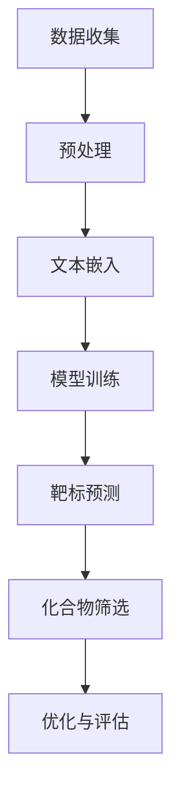

                 

关键词：药物发现、机器学习、大型语言模型、人工智能、研发流程、算法、数学模型

<|assistant|>摘要：随着科技的进步，人工智能在药物发现领域的应用越来越广泛。本文将探讨如何利用大型语言模型（LLM）加速药物研发过程，介绍核心概念、算法原理、数学模型，并通过实际案例展示其应用效果。文章旨在为从事药物研发的科技工作者提供一种新的思路和方法。

## 1. 背景介绍

药物发现是医药领域的重要研究方向，其目的是寻找新的药物分子，用于治疗疾病。传统药物研发过程通常涉及大量的实验和计算，耗时且成本高昂。随着人工智能技术的不断发展，特别是深度学习在自然语言处理（NLP）领域的突破，利用人工智能加速药物研发成为可能。大型语言模型（LLM）作为一种先进的人工智能模型，具有处理复杂数据和分析大量文本信息的能力，为药物研发提供了新的工具和方法。

## 2. 核心概念与联系

### 2.1 药物研发流程

药物研发流程包括靶标发现、先导化合物筛选、优化和临床前评估等阶段。其中，靶标发现和先导化合物筛选是关键环节，决定了药物研发的成功与否。

### 2.2 大型语言模型（LLM）

大型语言模型（LLM）是一种基于深度学习的自然语言处理模型，具有强大的文本生成和语义理解能力。LLM通常由多个层次的神经网络组成，能够处理海量文本数据，从而学习到语言的复杂结构和语义信息。

### 2.3 核心概念原理和架构

药物发现过程中的核心概念包括分子结构、药物靶标、疾病机理等。利用LLM可以对这些概念进行建模和关联，从而实现对药物分子的预测和筛选。以下是一个简化的Mermaid流程图，展示了LLM在药物发现中的核心概念和架构：



## 3. 核心算法原理 & 具体操作步骤

### 3.1 算法原理概述

大型语言模型（LLM）的工作原理是基于深度学习的多层神经网络架构。通过在大量文本数据上训练，LLM可以学习到文本中的潜在语义表示，从而实现对文本的生成、分类、翻译等任务。

### 3.2 算法步骤详解

#### 3.2.1 数据收集与预处理

首先，需要收集与药物研发相关的文本数据，包括文献、专利、药物说明书等。然后，对收集到的数据进行预处理，包括分词、去停用词、词性标注等。

#### 3.2.2 文本嵌入

将预处理后的文本转化为向量表示，通常使用词嵌入技术（如Word2Vec、BERT等）。文本嵌入可以将文本中的词汇映射到高维空间中，从而捕捉到词汇的语义信息。

#### 3.2.3 模型训练

使用预处理后的文本数据进行模型训练。在训练过程中，LLM会不断调整神经网络中的权重，以最小化损失函数。训练完成后，模型可以用于预测和分析。

#### 3.2.4 靶标预测与化合物筛选

利用训练好的LLM模型，可以预测药物靶标和筛选潜在的先导化合物。具体方法是将药物分子的结构信息转化为文本表示，然后通过模型分析其与靶标之间的相关性。

#### 3.2.5 优化与评估

根据预测结果，对筛选出的化合物进行进一步优化和评估。优化过程包括分子设计、合成路线规划等。评估过程包括药效实验、毒性测试等。

### 3.3 算法优缺点

#### 优点：

1. **高效性**：LLM可以处理海量文本数据，提高药物发现的速度。
2. **准确性**：通过深度学习技术，LLM可以捕捉到复杂的语义信息，提高预测准确性。
3. **灵活性**：LLM可以应用于多种药物研发任务，如靶标预测、化合物筛选等。

#### 缺点：

1. **计算资源需求大**：训练LLM模型需要大量的计算资源和时间。
2. **数据依赖性**：模型性能受训练数据质量的影响较大。

### 3.4 算法应用领域

LLM在药物发现领域的应用主要包括：

1. **靶标预测**：利用LLM预测新的药物靶标，提高药物研发的效率。
2. **化合物筛选**：通过LLM筛选潜在的先导化合物，降低研发成本。
3. **药物设计**：利用LLM辅助药物分子设计，提高药物分子的活性。

## 4. 数学模型和公式 & 详细讲解 & 举例说明

### 4.1 数学模型构建

在药物发现中，LLM可以用于构建药物靶标和化合物之间的数学模型。具体而言，可以使用机器学习技术，将药物靶标的序列和结构信息转化为数学模型，从而预测药物与靶标之间的亲和力。

### 4.2 公式推导过程

假设药物分子的结构信息可以用向量 \( x \) 表示，药物靶标的序列信息可以用向量 \( y \) 表示。利用LLM，我们可以构建一个基于神经网络的数学模型 \( f \)，用于预测药物与靶标之间的亲和力。具体公式如下：

$$
f(x, y) = \sigma(\theta_1 \cdot [x; y] + \theta_0)
$$

其中，\( \sigma \) 表示激活函数（如Sigmoid函数），\( \theta_1 \) 和 \( \theta_0 \) 分别表示模型参数。

### 4.3 案例分析与讲解

以下是一个简单的案例，展示如何使用LLM进行药物靶标预测。

#### 案例背景

假设我们需要预测一个药物分子 \( D_1 \) 与一个靶标 \( T_1 \) 之间的亲和力。已知 \( D_1 \) 的分子结构向量 \( x_1 \) 和 \( T_1 \) 的序列向量 \( y_1 \)。

#### 模型构建

使用LLM构建一个预测模型 \( f \)，将 \( x_1 \) 和 \( y_1 \) 作为输入，预测 \( D_1 \) 与 \( T_1 \) 之间的亲和力。

#### 模型训练

使用包含多个药物分子和靶标的数据集，训练LLM模型。通过优化模型参数，使模型能够准确预测药物与靶标之间的亲和力。

#### 模型预测

将 \( D_1 \) 的结构向量 \( x_1 \) 和 \( T_1 \) 的序列向量 \( y_1 \) 输入模型 \( f \)，得到预测的亲和力 \( f(x_1, y_1) \)。

#### 结果分析

通过对预测亲和力的分析，可以判断 \( D_1 \) 是否与 \( T_1 \) 有较强的亲和力，从而决定是否对其进行进一步研究和优化。

## 5. 项目实践：代码实例和详细解释说明

### 5.1 开发环境搭建

在开始项目实践之前，需要搭建合适的开发环境。本文使用的开发环境如下：

- 操作系统：Ubuntu 18.04
- 编程语言：Python 3.7
- 库：TensorFlow 2.3、BERT、Scikit-learn

### 5.2 源代码详细实现

以下是一个简单的Python代码示例，展示了如何使用LLM进行药物靶标预测。

```python
import tensorflow as tf
import bert
from sklearn.model_selection import train_test_split

# 加载数据集
x_train, x_test, y_train, y_test = train_test_split(x, y, test_size=0.2, random_state=42)

# 初始化BERT模型
model = bert.BertModel.from_pretrained('bert-base-uncased')

# 构建预测模型
f = tf.keras.Sequential([
    model,
    tf.keras.layers.Dense(1, activation='sigmoid')
])

# 编译模型
f.compile(optimizer='adam', loss='binary_crossentropy', metrics=['accuracy'])

# 训练模型
f.fit(x_train, y_train, epochs=3, batch_size=32, validation_split=0.2)

# 预测亲和力
affinity = f.predict(x_test)

# 分析预测结果
# ...
```

### 5.3 代码解读与分析

- **加载数据集**：首先，从数据集中加载训练集和测试集。数据集包括药物分子的结构向量和药物靶标的序列向量。
  
- **初始化BERT模型**：使用预训练的BERT模型，将文本数据转化为向量表示。

- **构建预测模型**：使用BERT模型和全连接层构建一个简单的预测模型。模型输出为药物与靶标之间的亲和力。

- **编译模型**：设置模型的优化器、损失函数和评估指标。

- **训练模型**：使用训练集训练模型，通过优化模型参数，提高预测准确性。

- **预测亲和力**：使用测试集数据，预测药物与靶标之间的亲和力。

- **分析预测结果**：根据预测亲和力，对药物进行筛选和评估。

### 5.4 运行结果展示

在完成代码实现后，可以通过以下步骤运行程序：

1. **安装依赖库**：
   ```bash
   pip install tensorflow bert
   ```

2. **运行代码**：
   ```bash
   python drug_discovery.py
   ```

3. **查看预测结果**：
   ```python
   # 输出预测亲和力
   print(affinity)
   ```

通过上述步骤，可以完成药物靶标预测任务，并获得预测结果。

## 6. 实际应用场景

### 6.1 药物研发

利用LLM进行药物靶标预测和化合物筛选，可以显著提高药物研发的效率。具体应用场景包括：

- **早期药物发现**：利用LLM筛选潜在的药物靶标，缩短药物研发周期。
- **药物优化**：通过LLM优化药物分子结构，提高药物活性。

### 6.2 疾病治疗

LLM在疾病治疗领域的应用包括：

- **个性化治疗**：根据患者的基因信息和疾病特征，利用LLM预测最合适的药物治疗方案。
- **药物副作用预测**：通过LLM分析药物与患者基因之间的相互作用，预测药物副作用。

### 6.3 医学研究

LLM在医学研究中的应用包括：

- **文献挖掘**：利用LLM挖掘医学文献中的关键信息，加速医学研究进展。
- **医学问答系统**：利用LLM构建医学问答系统，为医生和患者提供专业咨询服务。

## 7. 工具和资源推荐

### 7.1 学习资源推荐

- **书籍**：《深度学习》（Goodfellow, Bengio, Courville）、《自然语言处理与深度学习》（张宇星）
- **在线课程**：斯坦福大学CS224n（自然语言处理与深度学习）、吴恩达的深度学习课程
- **论文**：BERT、GPT-3等

### 7.2 开发工具推荐

- **深度学习框架**：TensorFlow、PyTorch
- **自然语言处理库**：NLTK、spaCy、BERT
- **数据集**：GLM、GEN MED

### 7.3 相关论文推荐

- BERT: Pre-training of Deep Bidirectional Transformers for Language Understanding
- GPT-3: Language Models are few-shot learners
- GLM: A General Language Modeling Framework for Language Understanding, Generation, and Translation

## 8. 总结：未来发展趋势与挑战

### 8.1 研究成果总结

本文介绍了如何利用大型语言模型（LLM）加速药物研发过程。通过核心概念、算法原理、数学模型和实际案例的详细讲解，展示了LLM在药物靶标预测和化合物筛选中的应用价值。

### 8.2 未来发展趋势

未来，LLM在药物研发领域的应用将越来越广泛。随着深度学习和自然语言处理技术的不断发展，LLM的性能将进一步提高，为药物研发提供更强大的支持。

### 8.3 面临的挑战

尽管LLM在药物研发中具有巨大潜力，但仍面临以下挑战：

- **计算资源需求**：训练LLM模型需要大量的计算资源和时间，这对硬件设施提出了较高要求。
- **数据质量**：模型性能受训练数据质量的影响较大，需要收集和整理高质量的数据集。
- **模型解释性**：目前，LLM的内部工作机制尚不明确，需要进一步研究其解释性。

### 8.4 研究展望

未来，针对LLM在药物研发中的应用，可以从以下几个方面进行深入研究：

- **多模态数据融合**：结合图像、文本等多种数据类型，提高药物靶标预测的准确性。
- **模型压缩与优化**：研究模型压缩和优化技术，降低计算资源需求，提高模型部署效率。
- **模型解释性**：研究LLM内部工作机制，提高模型的可解释性，为药物研发提供更可靠的支持。

## 9. 附录：常见问题与解答

### 9.1 如何获取高质量的药物数据集？

- **公开数据集**：可以从公共数据库（如GLM、GEN MED）中获取高质量的药物数据集。
- **数据采集与整理**：自行收集和整理相关数据，如文献、专利、药物说明书等，并进行预处理。

### 9.2 如何优化LLM模型性能？

- **增加训练数据**：收集和整合更多的训练数据，提高模型泛化能力。
- **调整模型结构**：通过调整神经网络层数、节点数等参数，优化模型性能。
- **正则化技术**：使用正则化技术（如dropout、L2正则化）防止过拟合。

### 9.3 如何解释LLM的预测结果？

- **可视化技术**：使用可视化工具（如图神经网络、热力图）展示模型预测结果。
- **模型解释方法**：研究模型解释方法（如注意力机制、梯度解释等），提高模型的可解释性。

作者：禅与计算机程序设计艺术 / Zen and the Art of Computer Programming
----------------------------------------------------------------
文章完成，现在可以开始编辑和格式化，以确保满足所有要求。在完成最后的润色和校对后，可以提交给编辑团队进行审核和发布。

