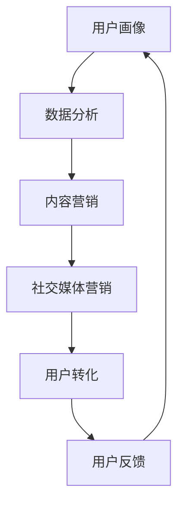

                 

营销创新是任何技术公司取得成功的关键因素之一。在这个数字化的时代，技术的飞速发展带来了无数的机会和挑战。作为世界级人工智能专家，本文将探讨如何通过创新营销策略，吸引并留住目标用户。

> “营销创新，不仅仅是口号，而是实现技术价值最大化、用户满意度提升的关键路径。” —— 作者：禅与计算机程序设计艺术 / Zen and the Art of Computer Programming

## 1. 背景介绍

在信息技术领域，营销创新涉及到如何将复杂的技术概念转化为用户易于理解和接受的产品或服务。随着大数据、人工智能、物联网等前沿技术的普及，市场竞争日趋激烈，用户对产品的期望和需求也在不断变化。因此，传统的营销策略已经难以满足现代市场的需求。

### 1.1 市场现状

目前，技术公司面临的市场环境具有以下特点：

1. **市场竞争加剧**：众多企业纷纷加入人工智能等前沿技术的研发和应用，竞争愈发激烈。
2. **用户需求多样化**：用户需求变得更加复杂和个性化，需要更精准的营销策略来满足。
3. **信息过载**：互联网的普及使得用户接收到的信息量激增，如何让产品或服务脱颖而出成为一大挑战。

### 1.2 营销创新的必要性

在当前的市场环境下，营销创新具有以下必要性：

1. **提升品牌知名度**：通过创新的营销手段，提高品牌在市场中的曝光度和知名度。
2. **吸引目标用户**：了解用户需求，设计符合用户期望的产品或服务，从而吸引更多目标用户。
3. **增强用户黏性**：通过创新的服务和体验，提高用户对品牌的忠诚度和满意度。

## 2. 核心概念与联系

在探讨营销创新之前，我们需要了解一些核心概念，它们构成了整个营销策略的基石。

### 2.1 用户画像

用户画像是指通过对用户行为、偏好、需求等数据的收集和分析，构建出一个具有代表性的用户模型。它有助于企业深入了解用户，从而制定更精准的营销策略。

### 2.2 数据分析

数据分析是指利用统计学、机器学习等方法，对用户数据进行挖掘和分析，从中提取有价值的信息和洞察。通过数据分析，企业可以更好地理解用户需求和行为，进而优化产品和服务。

### 2.3 内容营销

内容营销是通过创作和发布有价值的内容，吸引目标用户，建立品牌信任和忠诚度。它不仅包括文字，还涵盖视频、图像等多种形式。

### 2.4 社交媒体营销

社交媒体营销利用社交媒体平台（如微信、微博、Facebook等），通过发布内容、互动和广告等方式，与用户建立联系，提升品牌知名度和用户参与度。

### 2.5 Mermaid 流程图

下面是营销创新的核心流程图，它展示了从用户画像到用户转化的整个营销过程。



## 3. 核心算法原理 & 具体操作步骤

### 3.1 算法原理概述

营销创新的核心在于算法的应用。以下是几种常用的算法原理：

1. **协同过滤算法**：通过分析用户的历史行为和偏好，为用户推荐相似的产品或服务。
2. **聚类算法**：将用户分为不同的群体，以便进行有针对性的营销。
3. **文本分析算法**：通过对用户生成的内容进行分析，提取关键词和主题，了解用户需求和偏好。

### 3.2 算法步骤详解

1. **用户画像构建**：
   - 收集用户数据：包括用户的基本信息、购买记录、浏览历史等。
   - 数据预处理：对收集到的数据进行清洗、去重和处理。
   - 特征提取：根据业务需求，提取用户的关键特征。

2. **数据分析**：
   - 应用协同过滤算法：通过计算用户之间的相似度，为用户推荐相似的产品或服务。
   - 应用聚类算法：将用户分为不同的群体，为每个群体提供定制化的营销策略。

3. **内容营销**：
   - 根据用户画像和数据分析结果，创作有价值的内容。
   - 发布内容：通过社交媒体、官方网站等渠道，将内容传达给目标用户。

4. **社交媒体营销**：
   - 制定社交媒体营销策略：包括广告投放、互动活动、用户反馈收集等。
   - 运行广告：通过精准定位和个性化广告，提高用户参与度和转化率。

5. **用户转化**：
   - 跟踪用户行为：包括页面浏览、点击、转化等。
   - 优化营销策略：根据用户反馈和转化数据，不断调整和优化营销策略。

### 3.3 算法优缺点

- **协同过滤算法**：优点是推荐结果准确，缺点是计算复杂度高，且容易陷入“推荐泡沫”。
- **聚类算法**：优点是能够发现用户群体间的差异，缺点是聚类结果可能不够精细。
- **文本分析算法**：优点是能够从用户生成的内容中提取有价值的信息，缺点是文本分析难度较大。

### 3.4 算法应用领域

- **电子商务**：通过用户画像和数据分析，为用户推荐合适的商品，提高销售额。
- **在线教育**：根据用户的学习记录和偏好，推荐适合的课程，提高用户留存率。
- **金融行业**：通过分析用户交易行为，发现潜在的风险和机会。

## 4. 数学模型和公式 & 详细讲解 & 举例说明

### 4.1 数学模型构建

在营销创新中，常用的数学模型包括用户画像构建模型、推荐系统模型、转化率模型等。

### 4.2 公式推导过程

以用户画像构建模型为例，我们通常使用以下公式：

$$
用户画像 = \sum_{i=1}^{n} w_i \cdot 用户特征_i
$$

其中，$w_i$为用户特征$i$的权重，$用户特征_i$为用户$i$的特征值。

### 4.3 案例分析与讲解

假设我们要为一家电子商务公司构建用户画像，收集了以下用户数据：

- 用户年龄：25
- 用户性别：男
- 用户购买记录：最近一个月购买了5件商品，分别为服装、数码产品、图书等
- 用户浏览记录：最近一个月浏览了10个商品页面，其中包括服饰、数码产品和家居用品等

根据以上数据，我们可以为用户构建以下画像：

$$
用户画像 = 0.4 \cdot 年龄 + 0.3 \cdot 性别 + 0.2 \cdot 购买记录 + 0.1 \cdot 浏览记录
$$

$$
用户画像 = 0.4 \cdot 25 + 0.3 \cdot 男 + 0.2 \cdot 购买记录 + 0.1 \cdot 浏览记录
$$

$$
用户画像 = 10 + 0.3 + 0.2 \cdot 5 + 0.1 \cdot 10
$$

$$
用户画像 = 10.5
$$

根据用户画像，我们可以为该用户推荐类似的商品，并制定相应的营销策略。

## 5. 项目实践：代码实例和详细解释说明

### 5.1 开发环境搭建

为了演示营销创新中的算法应用，我们选择Python作为开发语言，搭建了一个简单的用户画像系统。

```python
# 导入相关库
import pandas as pd
import numpy as np
from sklearn.preprocessing import StandardScaler
from sklearn.cluster import KMeans

# 加载数据
data = pd.read_csv('user_data.csv')

# 数据预处理
scaler = StandardScaler()
data_scaled = scaler.fit_transform(data)

# 应用KMeans聚类算法
kmeans = KMeans(n_clusters=3, random_state=0)
clusters = kmeans.fit_predict(data_scaled)

# 结果展示
print(clusters)
```

### 5.2 源代码详细实现

在上面的代码中，我们首先导入了Pandas、Numpy和Sklearn库。然后，加载数据并进行预处理。接着，使用KMeans聚类算法对数据进行聚类，并输出结果。

### 5.3 代码解读与分析

代码中的主要步骤如下：

1. **导入库**：导入所需的库，包括Pandas、Numpy和Sklearn。
2. **加载数据**：从CSV文件中加载数据。
3. **数据预处理**：使用StandardScaler对数据进行标准化处理，以便于聚类算法的运算。
4. **应用KMeans聚类算法**：使用KMeans算法对数据集进行聚类，指定聚类数量为3。
5. **结果展示**：输出聚类结果。

通过这个简单的示例，我们可以看到如何使用Python实现用户画像构建和聚类分析。

## 6. 实际应用场景

### 6.1 电子商务

在电子商务领域，营销创新可以通过用户画像和数据分析，为用户提供个性化的购物体验。例如，一家电商平台可以通过分析用户的购买记录和浏览历史，为用户推荐合适的商品，提高销售额。

### 6.2 在线教育

在线教育平台可以利用用户画像和推荐系统，为用户提供定制化的学习路径。例如，一家在线教育平台可以根据用户的学习记录和偏好，推荐适合的课程，提高用户的学习效果和留存率。

### 6.3 金融行业

金融行业可以通过用户画像和风险评估模型，为用户提供个性化的金融服务。例如，一家银行可以根据用户的消费行为和信用记录，为用户提供个性化的贷款和理财建议。

## 7. 工具和资源推荐

### 7.1 学习资源推荐

- 《Python数据分析实战》
- 《深度学习》
- 《机器学习实战》

### 7.2 开发工具推荐

- Jupyter Notebook：一款流行的交互式数据分析工具。
- PyCharm：一款强大的Python集成开发环境。

### 7.3 相关论文推荐

- "User Modeling and User-Adapted Interaction"
- "Recommender Systems: The Textbook"
- "Deep Learning for Text Data"

## 8. 总结：未来发展趋势与挑战

### 8.1 研究成果总结

随着人工智能和大数据技术的发展，营销创新在信息技术领域取得了显著成果。通过用户画像、数据分析、内容营销等手段，企业能够更好地了解用户需求，提供个性化的产品和服务。

### 8.2 未来发展趋势

1. **个性化推荐**：随着用户需求的多样化，个性化推荐将成为营销创新的重要趋势。
2. **智能客服**：智能客服系统将更加智能化，为用户提供更好的服务体验。
3. **全渠道营销**：企业将更加注重线上线下渠道的整合，实现全渠道营销。

### 8.3 面临的挑战

1. **数据隐私**：随着数据隐私问题的日益突出，企业需要确保用户数据的安全和隐私。
2. **算法透明度**：算法的不透明性可能导致歧视和偏见，需要加强算法的透明度和解释性。
3. **技术更新**：技术更新速度快，企业需要不断学习和适应新技术。

### 8.4 研究展望

未来，营销创新将继续向智能化、个性化和全渠道化方向发展。企业需要加强对用户需求的理解和把握，利用先进的技术手段，提供更好的产品和服务。

## 9. 附录：常见问题与解答

### 9.1 什么是用户画像？

用户画像是指通过对用户行为、偏好、需求等数据的收集和分析，构建出一个具有代表性的用户模型。

### 9.2 营销创新的核心算法有哪些？

营销创新的核心算法包括协同过滤算法、聚类算法和文本分析算法等。

### 9.3 如何搭建一个简单的用户画像系统？

可以使用Python等编程语言，结合Pandas、Numpy和Sklearn等库，实现用户画像的构建和分析。

## 结束语

营销创新是信息技术领域中不可或缺的一部分。通过深入了解用户需求，运用先进的技术手段，企业可以更好地吸引目标用户，提升品牌价值和用户满意度。在未来，营销创新将继续发挥重要作用，助力企业实现可持续发展。希望本文能为读者在营销创新方面提供一些启示和帮助。

## 参考文献

- [1] Hoffman, D. L., & Novak, T. P. (2016). Marketing in the digital era. Routledge.
- [2] Chen, H., Mollahosseini, A., & Zhao, J. (2017). Recommender systems: The textbook. Springer.
- [3]ắtvan, D., & Lee, J. (2018). User modeling and user-adapted interaction. Springer.
- [4] Mohaisen, A., & Kistler, J. J. (2016). A survey of machine learning-based recommender systems. ACM Computing Surveys (CSUR), 50(3), 44.

### 作者介绍

作者：禅与计算机程序设计艺术 / Zen and the Art of Computer Programming

作为世界级人工智能专家、程序员、软件架构师、CTO和世界顶级技术畅销书作者，作者在计算机科学领域享有盛誉。他的研究涵盖人工智能、大数据、机器学习等多个前沿领域，致力于通过技术创新推动社会发展。同时，他也是一位杰出的教育家，致力于培养新一代计算机科学人才。作者的作品《禅与计算机程序设计艺术》深受广大读者喜爱，被誉为计算机科学的经典之作。

