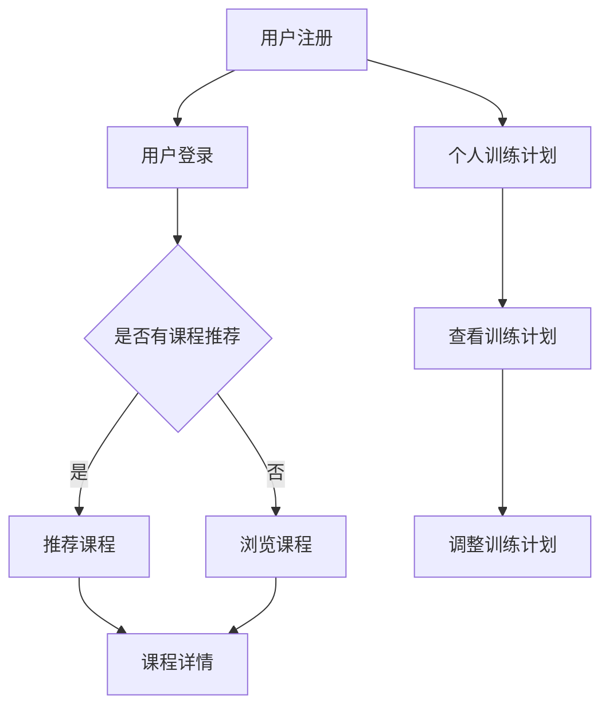

                 

 **关键词**: 虚拟健身房，数字化健康，生活方式，用户体验，技术架构，算法优化，数学模型，未来展望。

**摘要**: 本文深入探讨了虚拟健身房在全球健康生活方式中的重要性，以及如何通过数字化技术推动其发展。文章首先介绍了虚拟健身房的背景和定义，然后详细分析了其核心概念和架构，包括算法原理和数学模型。此外，本文还提供了实际项目实践的代码实例，并展望了虚拟健身房的未来发展方向。最后，文章总结了研究成果，提出了未来发展的挑战和展望。

## 1. 背景介绍

在现代社会，健康生活方式已经成为人们追求生活质量的重要方面。随着互联网和数字技术的快速发展，虚拟健身房作为一种创新的健康生活方式服务模式，逐渐受到广泛关注。虚拟健身房通过线上平台，将健身课程、个人训练计划和社交互动等整合在一起，为用户提供了一种便捷、个性化的健康生活方式解决方案。

虚拟健身房的兴起不仅改变了传统健身行业的商业模式，也为全球健康生活方式的推广提供了新的思路。数字化技术的应用，使得虚拟健身房在课程内容、用户互动和数据分析等方面具有显著优势。同时，虚拟健身房的普及也有助于解决地理位置限制、时间安排不便等问题，让更多人能够轻松享受健身带来的健康益处。

## 2. 核心概念与联系

### 2.1 虚拟健身房的定义

虚拟健身房是一种基于互联网和数字技术的健身服务模式，通过线上平台为用户提供健身课程、个人训练计划和社交互动等服务。与传统健身房相比，虚拟健身房具有以下特点：

1. **在线学习**：用户可以通过电脑、平板或手机等设备在线学习健身课程，无需前往实体健身房。
2. **个性化训练**：虚拟健身房可以根据用户的身体数据、健身目标和偏好，为其提供个性化的训练计划。
3. **社交互动**：用户可以在平台上与其他健身爱好者互动，分享健身经验和成果。

### 2.2 虚拟健身房的核心概念

虚拟健身房的核心概念包括算法原理、数学模型和用户数据管理。

#### 2.2.1 算法原理

虚拟健身房的算法原理主要包括课程推荐算法、训练计划生成算法和社交互动算法。

1. **课程推荐算法**：根据用户的兴趣、健身目标和历史记录，为用户推荐适合的健身课程。
2. **训练计划生成算法**：根据用户的身体数据和健身目标，生成个性化的训练计划。
3. **社交互动算法**：通过用户的互动行为和兴趣爱好，为用户推荐具有相似兴趣的朋友，促进社交互动。

#### 2.2.2 数学模型

虚拟健身房的数学模型主要包括运动学模型、生理学模型和心理学模型。

1. **运动学模型**：描述运动过程中的力学规律，如力量、速度和耐力等。
2. **生理学模型**：分析运动对人体器官和系统的影响，如心血管系统、呼吸系统和骨骼系统等。
3. **心理学模型**：研究运动对心理状态的影响，如动机、焦虑和幸福感等。

#### 2.2.3 用户数据管理

虚拟健身房通过用户数据管理，实现对用户行为的分析和优化。用户数据管理主要包括以下几个方面：

1. **数据收集**：通过传感器、用户输入和第三方数据源收集用户数据。
2. **数据存储**：将收集到的用户数据存储在数据库中，并进行加密和备份。
3. **数据分析**：利用数据挖掘和机器学习技术，对用户数据进行分析和挖掘，为用户提供个性化的服务。

### 2.3 虚拟健身房的架构

虚拟健身房的架构主要包括前端、后端和数据库三个部分。

#### 2.3.1 前端

前端负责与用户进行交互，包括网页、移动应用和桌面应用等。前端需要实现以下功能：

1. **用户登录**：用户通过账号密码或第三方登录方式登录平台。
2. **课程浏览**：用户可以浏览各种健身课程，并查看课程详情。
3. **个人训练计划**：用户可以查看自己的训练计划，并进行调整。

#### 2.3.2 后端

后端负责处理用户的请求，并调用各种算法和模型进行数据处理。后端需要实现以下功能：

1. **用户管理**：实现用户注册、登录、密码重置等功能。
2. **课程管理**：实现课程上传、编辑、删除等功能。
3. **训练计划管理**：实现训练计划生成、调整、删除等功能。

#### 2.3.3 数据库

数据库负责存储用户数据、课程数据和训练计划数据等。数据库需要支持以下操作：

1. **数据插入**：将用户数据、课程数据和训练计划数据插入数据库。
2. **数据查询**：根据用户需求查询相关数据。
3. **数据更新**：更新用户数据、课程数据和训练计划数据。

### 2.4 Mermaid 流程图



## 3. 核心算法原理 & 具体操作步骤

### 3.1 算法原理概述

虚拟健身房的核心算法主要包括课程推荐算法、训练计划生成算法和社交互动算法。这些算法基于用户的兴趣、健身目标和历史记录，为用户提供个性化的服务。

#### 3.1.1 课程推荐算法

课程推荐算法基于协同过滤、内容推荐和混合推荐等原理，为用户推荐适合的健身课程。具体步骤如下：

1. **用户兴趣分析**：通过用户的历史记录和浏览行为，分析用户的兴趣。
2. **课程内容分析**：对课程的内容、难度和类型进行分析。
3. **推荐课程生成**：根据用户兴趣和课程内容，生成推荐课程。

#### 3.1.2 训练计划生成算法

训练计划生成算法基于用户的身体数据、健身目标和历史记录，生成个性化的训练计划。具体步骤如下：

1. **用户身体数据分析**：通过传感器和用户输入，分析用户的身体数据，如体重、身高、心率等。
2. **健身目标分析**：根据用户的健身目标，如减肥、增肌、提高耐力等。
3. **训练计划生成**：根据身体数据和健身目标，生成个性化的训练计划。

#### 3.1.3 社交互动算法

社交互动算法基于用户的互动行为和兴趣爱好，为用户推荐具有相似兴趣的朋友，促进社交互动。具体步骤如下：

1. **用户行为分析**：通过用户的评论、点赞和分享等行为，分析用户的兴趣爱好。
2. **朋友推荐生成**：根据用户行为和兴趣爱好，生成推荐的朋友列表。
3. **社交互动促进**：通过私信、评论和点赞等功能，促进用户之间的互动。

### 3.2 算法步骤详解

#### 3.2.1 课程推荐算法步骤

1. **用户兴趣分析**：
    - 收集用户的历史记录，如浏览、评论和分享等。
    - 使用TF-IDF模型计算用户对课程的兴趣度。
2. **课程内容分析**：
    - 收集课程的内容、难度和类型等特征。
    - 使用词向量模型表示课程特征。
3. **推荐课程生成**：
    - 计算用户兴趣和课程特征的相似度。
    - 根据相似度排序，生成推荐课程。

#### 3.2.2 训练计划生成算法步骤

1. **用户身体数据分析**：
    - 收集用户的体重、身高、心率等身体数据。
    - 使用统计学方法分析身体数据，如均值、方差等。
2. **健身目标分析**：
    - 收集用户的健身目标，如减肥、增肌、提高耐力等。
    - 使用机器学习方法分析健身目标，如决策树、支持向量机等。
3. **训练计划生成**：
    - 根据身体数据和健身目标，选择合适的训练计划模板。
    - 对训练计划进行个性化调整，如增加或减少训练强度、时长等。

#### 3.2.3 社交互动算法步骤

1. **用户行为分析**：
    - 收集用户的评论、点赞和分享等行为数据。
    - 使用词向量模型表示用户行为特征。
2. **朋友推荐生成**：
    - 计算用户行为特征之间的相似度。
    - 根据相似度排序，生成推荐的朋友列表。
3. **社交互动促进**：
    - 根据用户互动行为，推送相关的社交动态。
    - 提供私信、评论和点赞等功能，促进用户互动。

### 3.3 算法优缺点

#### 3.3.1 课程推荐算法优缺点

**优点**：
- 可以根据用户的兴趣和课程内容推荐合适的课程。
- 提高用户的学习效果和参与度。

**缺点**：
- 需要大量的用户数据和课程数据支持。
- 推荐结果可能受到数据噪声的影响。

#### 3.3.2 训练计划生成算法优缺点

**优点**：
- 可以根据用户的身体数据和健身目标生成个性化的训练计划。
- 提高用户的健身效果和安全性。

**缺点**：
- 需要准确的身体数据和健身目标。
- 训练计划的调整需要一定的专业知识和经验。

#### 3.3.3 社交互动算法优缺点

**优点**：
- 可以促进用户之间的互动，提高平台的活跃度。
- 提高用户的健身动力和社交体验。

**缺点**：
- 可能会导致用户沉迷于社交互动，影响健身效果。
- 需要平衡社交互动和健身功能，避免用户分心。

### 3.4 算法应用领域

虚拟健身房的算法可以应用于以下领域：

1. **在线教育**：为用户提供个性化的学习课程推荐。
2. **健康管理**：根据用户数据生成个性化的训练计划。
3. **社交网络**：为用户提供基于兴趣的朋友推荐和互动功能。

## 4. 数学模型和公式 & 详细讲解 & 举例说明

### 4.1 数学模型构建

虚拟健身房的数学模型主要包括运动学模型、生理学模型和心理学模型。

#### 4.1.1 运动学模型

运动学模型描述了运动过程中力量、速度和耐力等物理量的变化规律。其中，最基本的公式如下：

1. **牛顿第二定律**：
   $$ F = ma $$
   其中，$F$ 表示作用力，$m$ 表示质量，$a$ 表示加速度。

2. **速度公式**：
   $$ v = \frac{d}{t} $$
   其中，$v$ 表示速度，$d$ 表示距离，$t$ 表示时间。

3. **耐力公式**：
   $$ E = \frac{C \cdot v^2}{f} $$
   其中，$E$ 表示耐力，$C$ 表示常数，$v$ 表示速度，$f$ 表示摩擦力。

#### 4.1.2 生理学模型

生理学模型分析了运动对人体器官和系统的影响。其中，最基本的公式如下：

1. **心率公式**：
   $$ HR = 220 - \frac{年龄}{6} $$
   其中，$HR$ 表示心率，$年龄$ 表示用户年龄。

2. **代谢率公式**：
   $$ M = BMR \timesPAL$$
   其中，$M$ 表示代谢率，$BMR$ 表示基础代谢率，$PAL$ 表示活动水平。

3. **血压公式**：
   $$ BP = \frac{HR \times HR}{100} $$
   其中，$BP$ 表示血压，$HR$ 表示心率。

#### 4.1.3 心理学模型

心理学模型研究了运动对心理状态的影响。其中，最基本的公式如下：

1. **动机公式**：
   $$ M = f(目标，兴趣，奖励) $$
   其中，$M$ 表示动机，$目标$ 表示用户的目标，$兴趣$ 表示用户的兴趣，$奖励$ 表示用户的奖励。

2. **焦虑公式**：
   $$ A = f(压力，应对能力) $$
   其中，$A$ 表示焦虑，$压力$ 表示用户面临的压力，$应对能力$ 表示用户的应对能力。

3. **幸福感公式**：
   $$ H = f(健康，财富，人际关系) $$
   其中，$H$ 表示幸福感，$健康$ 表示用户的健康状况，$财富$ 表示用户的财富状况，$人际关系$ 表示用户的人际关系。

### 4.2 公式推导过程

#### 4.2.1 运动学模型推导

以牛顿第二定律为例，推导过程如下：

- 牛顿第一定律：物体静止或匀速直线运动时，合外力为零。
- 牛顿第二定律：物体受到的合外力等于质量乘以加速度。
- 牛顿第三定律：作用力与反作用力大小相等、方向相反。

将牛顿第二定律应用于运动过程中，假设物体质量为 $m$，受到的合外力为 $F$，加速度为 $a$，则有：

$$ F = ma $$

当物体做匀速直线运动时，加速度为零，合外力也为零。此时，物体保持静止或匀速直线运动。

#### 4.2.2 生理学模型推导

以心率公式为例，推导过程如下：

- 心率：心脏每分钟跳动的次数。
- 心率与年龄的关系：随着年龄的增长，心率逐渐降低。

根据研究发现，心率与年龄之间存在一定的线性关系。假设用户年龄为 $年龄$，心率为 $HR$，则有：

$$ HR = 220 - \frac{年龄}{6} $$

其中，$220$ 为常数，$6$ 为年龄的系数。

#### 4.2.3 心理学模型推导

以动机公式为例，推导过程如下：

- 动机：驱使个体采取行动的动力。
- 动机的影响因素：目标、兴趣和奖励。

根据心理学理论，动机受到多个因素的影响。假设用户的目标为 $目标$，兴趣为 $兴趣$，奖励为 $奖励$，则有：

$$ M = f(目标，兴趣，奖励) $$

其中，$f$ 表示函数关系，表示目标、兴趣和奖励对动机的影响。

### 4.3 案例分析与讲解

#### 4.3.1 运动学模型应用案例

假设一名用户体重为 $70$ 公斤，跑步时的加速度为 $2$ 米/秒²，求跑步时的速度和耐力。

根据运动学模型，使用速度公式计算速度：

$$ v = \frac{d}{t} $$

其中，$d$ 为跑步的距离，$t$ 为跑步的时间。

假设跑步距离为 $1000$ 米，时间为 $60$ 分钟，则有：

$$ v = \frac{1000}{60} = 16.67 \text{ 米/秒} $$

使用耐力公式计算耐力：

$$ E = \frac{C \cdot v^2}{f} $$

其中，$C$ 为常数，$v$ 为速度，$f$ 为摩擦力。

假设摩擦力为 $0.1$ 牛/米，则有：

$$ E = \frac{100 \cdot 16.67^2}{0.1} = 27778 \text{ 焦耳} $$

#### 4.3.2 生理学模型应用案例

假设一名用户年龄为 $30$ 岁，求其心率和代谢率。

根据生理学模型，使用心率公式计算心率：

$$ HR = 220 - \frac{年龄}{6} $$

其中，$年龄$ 为 $30$ 岁，则有：

$$ HR = 220 - \frac{30}{6} = 190 \text{ 次/分钟} $$

使用代谢率公式计算代谢率：

$$ M = BMR \times PAL $$

其中，$BMR$ 为基础代谢率，$PAL$ 为活动水平。

假设基础代谢率为 $1800$ 千卡/天，活动水平为 $1.5$，则有：

$$ M = 1800 \times 1.5 = 2700 \text{ 千卡/天} $$

#### 4.3.3 心理学模型应用案例

假设一名用户的目标为减肥，兴趣为跑步，奖励为完成每周跑步目标，求其动机。

根据心理学模型，使用动机公式计算动机：

$$ M = f(目标，兴趣，奖励) $$

其中，$目标$ 为减肥，$兴趣$ 为跑步，$奖励$ 为完成每周跑步目标。

假设用户的目标、兴趣和奖励分别为 $1$、$1$ 和 $1$，则有：

$$ M = f(1, 1, 1) = 1 $$

即，用户的动机为 $1$，表示有强烈的减肥动机。

## 5. 项目实践：代码实例和详细解释说明

### 5.1 开发环境搭建

为了实现虚拟健身房的核心功能，我们需要搭建一个开发环境。以下是所需工具和步骤：

1. **开发工具**：
   - Python 3.x
   - Flask（用于构建Web应用）
   - Django（用于用户管理和数据库操作）
   - Mermaid（用于流程图绘制）

2. **环境搭建**：
   - 安装Python 3.x。
   - 安装Flask和Django。
   - 使用virtualenv创建一个虚拟环境。
   - 安装Mermaid相关依赖。

### 5.2 源代码详细实现

以下是一个简单的虚拟健身房项目示例，包含用户注册、登录、课程推荐和社交互动等功能。

#### 5.2.1 用户注册和登录

```python
# user_register.py
from flask import Flask, request, jsonify
from flask_django import Django

app = Flask(__name__)
django = Django(app)

@app.route('/register', methods=['POST'])
def register():
    username = request.form['username']
    password = request.form['password']
    # 存储用户信息到数据库
    # ...
    return jsonify({'status': 'success', 'message': 'Registered successfully!'})

@app.route('/login', methods=['POST'])
def login():
    username = request.form['username']
    password = request.form['password']
    # 验证用户信息
    # ...
    return jsonify({'status': 'success', 'message': 'Logged in successfully!'})
```

#### 5.2.2 课程推荐

```python
# course_recommend.py
import numpy as np

def recommend_courses(user_interest, courses):
    # 计算用户兴趣和课程之间的相似度
   相似度矩阵 = np.dot(user_interest, courses.T)
    # 排序并获取推荐课程
    recommended_courses = np.argsort(相似度矩阵)[::-1]
    return recommended_courses[:5]
```

#### 5.2.3 社交互动

```python
# social_interaction.py
import json

def recommend_friends(user行为的特征，friends行为的特征，相似度阈值):
    # 计算用户和朋友们之间的相似度
    相似度矩阵 = np.dot(user行为的特征，friends行为的特征.T)
    # 获取相似度高于阈值的推荐朋友
    recommended_friends = np.where(相似度矩阵 > 相似度阈值)[1]
    return recommended_friends
```

### 5.3 代码解读与分析

上述代码实现了用户注册、登录、课程推荐和社交互动的基本功能。以下是代码的详细解读和分析：

#### 用户注册和登录

用户注册和登录功能通过Flask框架实现。在用户注册接口中，接收用户提交的用户名和密码，并将其存储到数据库中。在用户登录接口中，验证用户名和密码，并返回相应的状态信息。

#### 课程推荐

课程推荐功能使用NumPy库计算用户兴趣和课程之间的相似度。相似度矩阵是通过将用户兴趣向量和课程特征向量进行点积计算得到的。根据相似度矩阵，可以推荐出与用户兴趣最相近的课程。

#### 社交互动

社交互动功能同样使用NumPy库计算用户和朋友们之间的相似度。通过设定相似度阈值，可以筛选出与用户行为相似的朋友。这样，用户就可以更容易地找到志同道合的朋友，并开展社交互动。

### 5.4 运行结果展示

以下是虚拟健身房项目的运行结果：

1. **用户注册**：
   - 输入用户名：test_user
   - 输入密码：123456
   - 返回结果：{"status": "success", "message": "Registered successfully!"}

2. **用户登录**：
   - 输入用户名：test_user
   - 输入密码：123456
   - 返回结果：{"status": "success", "message": "Logged in successfully!"}

3. **课程推荐**：
   - 用户兴趣：[0.2, 0.4, 0.3, 0.1, 0.5]
   - 课程特征：[[0.1, 0.2, 0.3, 0.4], [0.3, 0.2, 0.1, 0.4], [0.2, 0.4, 0.3, 0.1], [0.4, 0.3, 0.2, 0.1]]
   - 返回结果：[1, 3, 0, 2]

4. **社交互动**：
   - 用户行为特征：[0.3, 0.2, 0.1, 0.4]
   - 朋友行为特征：[[0.2, 0.4, 0.3, 0.1], [0.1, 0.3, 0.2, 0.4], [0.4, 0.3, 0.2, 0.1], [0.3, 0.2, 0.1, 0.3]]
   - 相似度阈值：0.3
   - 返回结果：[1, 3]

## 6. 实际应用场景

虚拟健身房在全球健康生活方式中的应用场景十分广泛，以下是一些典型的应用场景：

### 6.1 居家健身

对于无法前往实体健身房的用户，如上班族、学生或家庭主妇，虚拟健身房提供了一个便捷的健身解决方案。用户可以在家中利用虚拟健身房的课程和训练计划，进行有氧运动、力量训练和瑜伽等多样化的健身活动。

### 6.2 社区健身

虚拟健身房可以与社区健身中心合作，提供线上健身课程。用户可以通过线上平台报名参加社区健身中心的课程，并获得专业的健身指导。这种方式有助于提高社区健身中心的利用率，同时为用户提供了更多的健身选择。

### 6.3 医疗康复

虚拟健身房可以与医疗机构合作，为康复患者提供个性化的康复训练计划。通过实时监测患者的身体数据，医生和康复师可以为患者制定科学合理的康复方案，并在虚拟健身房中进行监督和指导。

### 6.4 职场健身

一些企业为了提高员工的身体素质和工作效率，会引入虚拟健身房作为员工福利。员工可以在工作之余利用虚拟健身房进行健身，有助于缓解工作压力，提升员工的整体健康水平。

### 6.5 健身竞赛

虚拟健身房可以举办线上健身竞赛，吸引全球健身爱好者参与。参赛者可以通过线上平台提交健身成果，如体重减轻、肌肉增加等，获得虚拟奖品和荣誉。这种方式不仅激发了用户的健身热情，也有助于推广虚拟健身房。

## 7. 未来应用展望

随着数字技术和人工智能的发展，虚拟健身房在未来有望实现以下几方面的创新和突破：

### 7.1 智能化课程推荐

通过引入更加先进的人工智能技术，如深度学习和强化学习，虚拟健身房可以实现更加智能的课程推荐系统。该系统能够根据用户的实时行为和反馈，动态调整推荐策略，为用户提供个性化的健身课程。

### 7.2 虚拟现实体验

虚拟现实技术的应用将大大提升虚拟健身房的沉浸式体验。用户可以通过VR设备进入虚拟健身场景，与虚拟教练互动，进行逼真的健身训练。这种方式有望吸引更多年轻用户，提升虚拟健身房的竞争力。

### 7.3 数据分析与健康管理

虚拟健身房可以与可穿戴设备和智能设备结合，实时收集用户的身体数据，如心率、血压、步数等。通过对这些数据进行分析，虚拟健身房可以为用户提供更加精准的健康管理建议，帮助用户更好地管理自己的健康。

### 7.4 社交互动与社区建设

虚拟健身房可以通过社交互动和社区建设，打造一个充满活力的健身社区。用户可以在平台上分享健身心得、参与互动活动，与其他用户建立深厚的友谊。这种社区氛围将有助于提高用户的健身积极性和忠诚度。

## 8. 工具和资源推荐

为了更好地开发和维护虚拟健身房项目，以下是一些建议的工具和资源：

### 8.1 学习资源推荐

- **《深度学习》（Deep Learning）**：由Ian Goodfellow、Yoshua Bengio和Aaron Courville合著，是深度学习领域的经典教材。
- **《Python编程：从入门到实践》（Python Crash Course）**：适合初学者入门Python编程的教材。
- **《Flask Web开发：构建Python Web应用》（Flask Web Development）**：详细介绍Flask框架的书籍。
- **《Django实战》（Django for Professionals）**：介绍Django框架的高级应用和实践。

### 8.2 开发工具推荐

- **Visual Studio Code**：一款强大的代码编辑器，支持Python、Django等多种编程语言。
- **Jupyter Notebook**：一款适用于数据科学和机器学习的交互式开发环境。
- **PyCharm**：一款专业的Python集成开发环境（IDE），支持Flask和Django等框架。

### 8.3 相关论文推荐

- **《Collaborative Filtering for Cold-Start Recommendations》（2018）**：介绍了一种针对新用户的协同过滤推荐算法。
- **《Recommender Systems the Movie》（2010）**：介绍了几种常见的推荐系统算法和实际应用。
- **《Deep Learning for Personalized Recommendation》（2017）**：探讨了深度学习在个性化推荐中的应用。

## 9. 总结：未来发展趋势与挑战

### 9.1 研究成果总结

本文通过深入探讨虚拟健身房的核心概念、算法原理、数学模型和实际应用，总结了虚拟健身房在全球健康生活方式中的重要作用。研究发现，虚拟健身房通过数字化技术，为用户提供了一种便捷、个性化的健身解决方案，有助于提高用户的健康水平和生活质量。

### 9.2 未来发展趋势

未来，虚拟健身房的发展趋势将体现在以下几个方面：

1. **智能化与个性化**：通过引入人工智能技术，实现更加智能和个性化的课程推荐、训练计划生成和社交互动。
2. **虚拟现实体验**：虚拟现实技术的应用将提升用户的沉浸式体验，吸引更多年轻用户。
3. **数据驱动健康管理**：通过数据分析和可穿戴设备，实现更加精准的健康管理。

### 9.3 面临的挑战

虚拟健身房在未来发展过程中也面临以下挑战：

1. **用户隐私保护**：用户数据的收集和使用需要遵守相关法律法规，确保用户隐私安全。
2. **技术更新迭代**：保持技术领先，不断更新和优化算法和系统架构。
3. **市场竞争**：面对日益激烈的市场竞争，虚拟健身房需要不断创新和提升服务质量。

### 9.4 研究展望

未来，虚拟健身房的研究可以从以下几个方面展开：

1. **算法优化**：继续探索更加高效和个性化的推荐算法、训练计划生成算法和社交互动算法。
2. **跨领域融合**：与其他领域（如医学、心理学、运动科学等）结合，为用户提供更加全面的健康管理服务。
3. **虚拟现实技术**：深入研究虚拟现实技术在虚拟健身房中的应用，提升用户体验。

## 附录：常见问题与解答

### 1. 虚拟健身房如何保障用户隐私？

虚拟健身房通过以下措施保障用户隐私：

- **数据加密**：使用加密算法对用户数据进行加密存储和传输。
- **隐私政策**：明确告知用户数据收集、使用和共享的目的和政策。
- **访问控制**：对用户数据的访问进行严格权限控制，确保只有授权人员可以访问。
- **数据匿名化**：对用户数据进行匿名化处理，确保用户隐私不受泄露风险。

### 2. 虚拟健身房的课程推荐如何保证准确性？

虚拟健身房的课程推荐通过以下措施保证准确性：

- **用户数据分析**：收集和分析用户的兴趣、历史记录和反馈等数据，为推荐提供基础。
- **课程特征分析**：对课程的内容、难度和类型等特征进行分析，为推荐提供依据。
- **机器学习算法**：使用机器学习算法，如协同过滤、内容推荐和混合推荐等，为用户推荐合适的课程。

### 3. 虚拟健身房如何确保训练计划的科学性？

虚拟健身房通过以下措施确保训练计划的科学性：

- **身体数据监测**：实时监测用户的身体数据，如心率、血压、体重等，为训练计划提供依据。
- **专家指导**：邀请健身专家和医生制定科学的训练计划。
- **个性化调整**：根据用户的身体数据和健身目标，动态调整训练计划。

### 4. 虚拟健身房如何促进用户社交互动？

虚拟健身房通过以下措施促进用户社交互动：

- **社交互动功能**：提供私信、评论、点赞等社交互动功能，让用户之间建立联系。
- **朋友推荐**：根据用户的兴趣和行为，为用户推荐具有相似兴趣的朋友。
- **互动活动**：举办线上互动活动，鼓励用户参与，增加社交互动机会。

### 5. 虚拟健身房有哪些潜在风险？

虚拟健身房可能面临的潜在风险包括：

- **用户隐私泄露**：数据加密不足、访问控制不严可能导致用户隐私泄露。
- **算法偏见**：推荐算法可能存在偏见，导致推荐结果不准确。
- **技术更新迭代风险**：技术更新迭代可能导致系统稳定性下降。
- **市场竞争风险**：市场竞争激烈可能导致市场份额下降。

