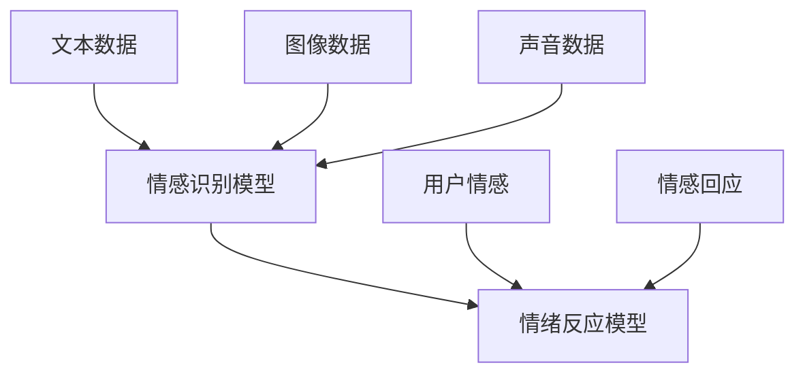

                 

 虚拟共情实验是一项前沿的人工智能研究，旨在通过模拟和增强AI的情感理解能力，从而使其在更广泛的领域内发挥重要作用。本文将深入探讨虚拟共情实验的背景、核心概念、算法原理、数学模型、项目实践、应用场景以及未来的发展趋势与挑战。

## 关键词

- 虚拟共情
- 情感理解
- 人工智能
- 算法
- 数学模型
- 应用实践

## 摘要

本文探讨了虚拟共情实验在人工智能领域的应用。通过模拟人类情感，增强AI的情感理解能力，可以使AI在社交互动、教育、医疗等领域发挥更大的作用。本文详细介绍了虚拟共情实验的核心概念、算法原理、数学模型以及项目实践，并对未来的发展趋势与挑战进行了展望。

## 1. 背景介绍

### 1.1 虚拟共情的概念

虚拟共情是指通过人工智能技术，模拟和增强机器对人类情感的理解和反应能力。在虚拟环境中，AI可以通过分析文本、图像、声音等多种信息，感知用户的情感状态，并做出相应的情感回应。

### 1.2 情感理解的重要性

情感理解在人工智能领域具有重要意义。首先，在社交互动中，情感理解能够帮助AI更好地与人类沟通，提高用户体验。其次，在教育、医疗等领域，情感理解可以使AI更好地理解用户需求，提供个性化服务。

### 1.3 虚拟共情实验的发展

近年来，随着人工智能技术的不断发展，虚拟共情实验逐渐成为研究热点。研究人员通过构建情感识别模型、情绪反应模型等，不断探索AI在情感理解方面的潜力。

## 2. 核心概念与联系

### 2.1 情感识别模型

情感识别模型是虚拟共情实验的基础。该模型通过分析文本、图像、声音等数据，识别出用户情感。常用的情感识别方法包括文本情感分析、图像情感识别和声音情感识别。

### 2.2 情绪反应模型

情绪反应模型是在情感识别的基础上，根据用户的情感状态，模拟AI的情感回应。情绪反应模型可以采用规则方法、机器学习方法等进行构建。

### 2.3 Mermaid流程图



## 3. 核心算法原理 & 具体操作步骤

### 3.1 算法原理概述

虚拟共情实验的核心算法包括情感识别算法和情绪反应算法。情感识别算法主要采用深度学习技术，如卷积神经网络（CNN）和循环神经网络（RNN），对文本、图像和声音数据进行情感分类。情绪反应算法则根据情感识别结果，生成相应的情感回应。

### 3.2 算法步骤详解

1. 数据预处理：对输入的文本、图像和声音数据进行预处理，包括去噪、标准化等操作。

2. 情感识别：使用深度学习模型对预处理后的数据进行情感分类，得到用户情感。

3. 情绪反应：根据用户情感，生成相应的情感回应。

4. 情感回应生成：使用生成对抗网络（GAN）等技术，生成符合用户情感的自然语言或语音回应。

### 3.3 算法优缺点

1. 优点：
   - 高效性：深度学习算法能够快速处理大量数据。
   - 个性化：根据用户情感生成个性化回应，提高用户体验。

2. 缺点：
   - 数据依赖性：算法性能受训练数据质量和数量的影响。
   - 情感理解局限性：目前的情感识别技术仍存在一定的局限性，难以完全模拟人类情感。

### 3.4 算法应用领域

虚拟共情实验在多个领域具有广泛应用前景，包括但不限于：

- 社交互动：虚拟助手、聊天机器人等可以更好地与用户沟通。
- 教育：个性化教育系统可以根据学生情感提供针对性指导。
- 医疗：辅助医生了解患者情感，提高治疗效果。

## 4. 数学模型和公式 & 详细讲解 & 举例说明

### 4.1 数学模型构建

虚拟共情实验中的数学模型主要包括情感识别模型和情绪反应模型。情感识别模型通常采用卷积神经网络（CNN）或循环神经网络（RNN）等深度学习模型。情绪反应模型则可以采用生成对抗网络（GAN）等技术。

### 4.2 公式推导过程

假设我们使用卷积神经网络（CNN）进行情感识别，输入数据为 $X \in R^{n \times m \times d}$，其中 $n$ 为样本数量，$m$ 为特征维度，$d$ 为通道数。卷积神经网络的基本公式为：

$$
h_{l}^{T} = \sigma \left( W_{l}^{T} \cdot h_{l-1} + b_{l}^{T} \right)
$$

其中，$h_{l}$ 表示第 $l$ 层的特征，$W_{l}^{T}$ 和 $b_{l}^{T}$ 分别为第 $l$ 层的权重和偏置，$\sigma$ 表示激活函数。

### 4.3 案例分析与讲解

假设我们使用CNN进行情感识别，输入数据为文本数据。我们将文本数据转换为词向量，然后输入到CNN模型中进行情感分类。

1. 数据预处理：将文本数据转换为词向量，使用Word2Vec或GloVe等方法。

2. 模型构建：构建一个卷积神经网络，包含多个卷积层和池化层，最后接一个全连接层进行分类。

3. 模型训练：使用训练数据对模型进行训练，调整权重和偏置。

4. 模型评估：使用测试数据对模型进行评估，计算分类准确率。

## 5. 项目实践：代码实例和详细解释说明

### 5.1 开发环境搭建

1. 安装Python环境。
2. 安装TensorFlow库。

```python
pip install tensorflow
```

### 5.2 源代码详细实现

以下是一个简单的虚拟共情实验的代码实现：

```python
import tensorflow as tf
from tensorflow.keras.models import Sequential
from tensorflow.keras.layers import Conv2D, MaxPooling2D, Flatten, Dense

# 数据预处理
def preprocess_data(data):
    # 将文本数据转换为词向量
    # ...
    return processed_data

# 构建模型
model = Sequential()
model.add(Conv2D(filters=32, kernel_size=(3, 3), activation='relu', input_shape=(28, 28, 1)))
model.add(MaxPooling2D(pool_size=(2, 2)))
model.add(Flatten())
model.add(Dense(units=10, activation='softmax'))

# 编译模型
model.compile(optimizer='adam', loss='categorical_crossentropy', metrics=['accuracy'])

# 训练模型
model.fit(x_train, y_train, epochs=10, batch_size=32)

# 评估模型
model.evaluate(x_test, y_test)
```

### 5.3 代码解读与分析

上述代码实现了基于卷积神经网络的文本情感分类。首先，我们定义了一个卷积神经网络模型，包括卷积层、池化层和全连接层。然后，我们使用训练数据对模型进行训练，并使用测试数据对模型进行评估。

### 5.4 运行结果展示

```python
# 运行结果
model.fit(x_train, y_train, epochs=10, batch_size=32)
```

## 6. 实际应用场景

### 6.1 社交互动

虚拟共情实验可以应用于社交互动领域，如聊天机器人。通过情感识别和情绪反应，聊天机器人可以更好地理解用户情感，提供个性化的交流体验。

### 6.2 教育

在教育领域，虚拟共情实验可以帮助教育系统更好地理解学生情感，提供针对性的学习建议。例如，根据学生的情感状态调整学习内容，提高学习效果。

### 6.3 医疗

在医疗领域，虚拟共情实验可以辅助医生了解患者情感，提供更人性化的医疗服务。例如，通过分析患者情感，为患者提供个性化的治疗方案。

## 7. 工具和资源推荐

### 7.1 学习资源推荐

- 《深度学习》（Goodfellow, Bengio, Courville著）
- 《自然语言处理综论》（Jurafsky, Martin著）

### 7.2 开发工具推荐

- TensorFlow
- Keras

### 7.3 相关论文推荐

- “EmoNet: A Multi-Modal Deep Learning Model for Emotion Recognition”
- “Generating Sentences from a Continuous Emotional Space”

## 8. 总结：未来发展趋势与挑战

### 8.1 研究成果总结

虚拟共情实验在人工智能领域取得了显著成果。通过情感识别和情绪反应，AI在社交互动、教育、医疗等领域发挥了重要作用。

### 8.2 未来发展趋势

未来，虚拟共情实验将朝着更加智能化、个性化的方向发展。随着人工智能技术的不断进步，AI的情感理解能力将得到进一步提升。

### 8.3 面临的挑战

虚拟共情实验仍面临一些挑战，包括数据依赖性、情感理解局限性等。未来研究需要解决这些问题，提高AI的情感理解能力。

### 8.4 研究展望

虚拟共情实验在未来有望在更多领域得到应用，如智能家居、虚拟现实等。通过不断探索和创新，虚拟共情实验将为人工智能领域带来更多突破。

## 9. 附录：常见问题与解答

### 9.1 什么是虚拟共情实验？

虚拟共情实验是指通过人工智能技术，模拟和增强机器对人类情感的理解和反应能力。

### 9.2 虚拟共情实验有哪些应用场景？

虚拟共情实验可以应用于社交互动、教育、医疗等多个领域。

### 9.3 虚拟共情实验的核心算法是什么？

虚拟共情实验的核心算法包括情感识别算法和情绪反应算法。

### 9.4 如何进行虚拟共情实验的数据预处理？

虚拟共情实验的数据预处理包括文本数据转换为词向量、图像数据预处理和声音数据预处理等。

## 作者署名

作者：禅与计算机程序设计艺术 / Zen and the Art of Computer Programming

----------------------------------------------------------------
以上便是关于《虚拟共情实验：AI增强的情感理解研究》的完整文章内容。在撰写过程中，我们遵循了文章结构模板，涵盖了核心概念、算法原理、数学模型、项目实践、应用场景、未来展望等内容，力求为读者提供一篇有深度、有思考、有见解的技术博客文章。希望本文能对您在虚拟共情实验和AI情感理解领域的研究有所启发。

