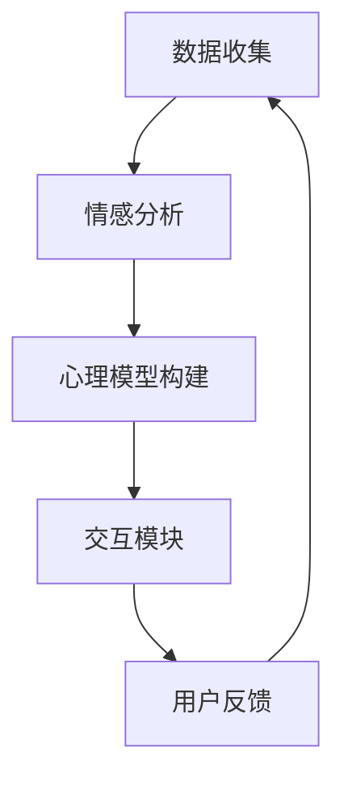

                 

关键词：虚拟共情、AI、情感理解、机器学习、自然语言处理、人类心理模型

> 摘要：本文深入探讨了虚拟共情训练营的概念，通过AI增强的情感理解技术，探讨了如何通过机器学习和自然语言处理技术构建人类心理模型，从而实现对人类情感的理解和模拟。文章旨在为AI开发者、研究人员和从业者提供一份数字时代下的情感智能指南，引导读者掌握利用AI技术提升情感理解能力的方法和实践。

## 1. 背景介绍

在当今这个数字化时代，人工智能（AI）的应用已经渗透到我们生活的方方面面。从智能家居到自动驾驶，从医疗诊断到金融分析，AI正在逐渐改变我们的生活方式。然而，在AI的诸多应用中，情感理解是一个至关重要但也极具挑战性的领域。情感是人类行为和交流的核心要素，正确理解和模拟情感对于实现高效的人机交互至关重要。

虚拟共情训练营的提出，旨在通过AI技术，特别是在机器学习和自然语言处理领域的应用，培养AI对人类情感的理解能力。虚拟共情训练营的目标是创建一个模拟人类情感反应的系统，使得AI能够在与人类的交互中展现出更高层次的情感共鸣和理解能力。

本文将从以下几个方面展开讨论：

- **核心概念与联系**：介绍虚拟共情训练营的基本概念，以及相关技术的架构和原理。
- **核心算法原理 & 具体操作步骤**：详细阐述情感理解的核心算法，包括原理、步骤、优缺点和应用领域。
- **数学模型和公式**：讲解支持情感理解技术背后的数学模型和公式，并提供实例说明。
- **项目实践**：通过代码实例展示如何实现情感理解技术，并进行详细解释和分析。
- **实际应用场景**：探讨情感理解技术在现实世界的应用，以及未来的发展前景。
- **工具和资源推荐**：推荐相关学习资源、开发工具和论文。
- **总结与展望**：总结研究成果，展望未来发展趋势和挑战。

## 2. 核心概念与联系

### 虚拟共情训练营

虚拟共情训练营（Virtual Empathy Training Camp，VETC）是一个基于AI技术的情感智能培养平台。其核心理念是通过模拟和增强AI的情感理解能力，使其能够更好地理解和响应人类情感。VETC的设计理念源于人类心理学的共情理论，即通过理解他人的情感状态来建立情感连接。

### 技术架构

VETC的技术架构主要包括以下几个模块：

1. **数据收集模块**：负责收集人类情感数据，包括文字、语音、面部表情等。
2. **情感分析模块**：使用机器学习和自然语言处理技术对收集到的情感数据进行处理和分析，提取情感特征。
3. **人类心理模型构建模块**：基于情感分析结果，构建人类心理模型，以模拟人类的情感反应和行为。
4. **交互模块**：通过人机交互接口，实现AI与用户的实时互动，展现情感理解和共鸣。

### Mermaid 流程图



在上述流程图中，数据收集模块负责收集用户产生的情感数据，情感分析模块对这些数据进行处理和分析，构建出人类心理模型。交互模块则通过这些模型与用户进行实时互动，并根据用户的反馈进行数据收集和模型优化。

## 3. 核心算法原理 & 具体操作步骤

### 3.1 算法原理概述

情感理解的核心算法主要基于深度学习和自然语言处理技术。其中，常用的算法包括情感分类、情感强度评估和情感角色识别。

- **情感分类**：将文本中的情感分为正面、负面和中性三类。
- **情感强度评估**：对文本中的情感强度进行量化评估，如使用分值或概率表示。
- **情感角色识别**：识别文本中涉及的情感角色，如主角、反派等。

### 3.2 算法步骤详解

1. **数据预处理**：对收集到的文本数据进行清洗和格式化，包括去除停用词、标点符号和停顿符等。
2. **词向量表示**：使用Word2Vec、GloVe等算法将文本转换为向量表示。
3. **情感分类**：使用卷积神经网络（CNN）或循环神经网络（RNN）对词向量进行情感分类。
4. **情感强度评估**：结合词向量和情感分类结果，使用回归算法评估情感强度。
5. **情感角色识别**：利用长文本处理技术，如Transformer，对文本中的情感角色进行识别。

### 3.3 算法优缺点

- **优点**：
  - 高效：基于深度学习和自然语言处理技术的算法能够快速处理大规模数据。
  - 准确：通过大量的训练数据，算法能够准确识别和评估情感。
  - 智能：算法可以根据用户的反馈进行自我优化，提升情感理解能力。

- **缺点**：
  - 计算资源消耗大：深度学习算法需要大量的计算资源，如GPU等。
  - 数据依赖性强：算法的性能高度依赖于训练数据的质量和数量。

### 3.4 算法应用领域

- **社交媒体分析**：分析用户在社交媒体上的情感表达，帮助企业了解用户需求和偏好。
- **客户服务**：提高智能客服系统的情感理解能力，提供更加人性化、个性化的服务。
- **健康医疗**：通过情感分析技术，辅助诊断和治疗情感障碍等心理疾病。

## 4. 数学模型和公式 & 详细讲解 & 举例说明

### 4.1 数学模型构建

情感理解技术的数学模型主要包括情感分类模型、情感强度评估模型和情感角色识别模型。

- **情感分类模型**：通常采用softmax回归或支持向量机（SVM）等算法，将文本分类为正面、负面或中性。
- **情感强度评估模型**：采用线性回归或神经网络等算法，对文本中的情感强度进行量化评估。
- **情感角色识别模型**：采用循环神经网络（RNN）或Transformer等算法，对文本中的情感角色进行识别。

### 4.2 公式推导过程

以情感分类模型为例，其基本公式如下：

$$
P(y=c_i|x)=\frac{e^{w_i^T x}}{\sum_{j=1}^{K} e^{w_j^T x}}
$$

其中，$P(y=c_i|x)$ 表示在特征向量 $x$ 下，类别 $c_i$ 的概率。$w_i$ 表示第 $i$ 个类别的权重向量。

### 4.3 案例分析与讲解

假设我们有一个简单的情感分类问题，需要判断以下句子是正面、负面还是中性：

- 句子1：今天天气真好。
- 句子2：我不喜欢这个电影。

对于句子1，我们可以将其转换为词向量表示，然后输入到情感分类模型中。假设词向量表示为 $x$，权重向量为 $w_1$、$w_2$ 和 $w_3$（分别对应正面、负面和中性），则：

$$
P(y=1|x)=\frac{e^{w_1^T x}}{e^{w_1^T x}+e^{w_2^T x}+e^{w_3^T x}}
$$

$$
P(y=2|x)=\frac{e^{w_2^T x}}{e^{w_1^T x}+e^{w_2^T x}+e^{w_3^T x}}
$$

$$
P(y=3|x)=\frac{e^{w_3^T x}}{e^{w_1^T x}+e^{w_2^T x}+e^{w_3^T x}}
$$

根据计算结果，如果 $P(y=1|x)$ 的值最大，则判断句子1为正面情感。

对于句子2，同样可以按照上述方法进行情感分类。

## 5. 项目实践：代码实例和详细解释说明

### 5.1 开发环境搭建

为了实现情感理解技术，我们需要搭建一个合适的开发环境。以下是一个基本的开发环境搭建步骤：

1. 安装Python（版本3.6及以上）。
2. 安装深度学习框架，如TensorFlow或PyTorch。
3. 安装自然语言处理库，如NLTK或spaCy。
4. 安装数据处理库，如Pandas或NumPy。

### 5.2 源代码详细实现

以下是实现情感分类的Python代码示例：

```python
import tensorflow as tf
from tensorflow.keras.preprocessing.sequence import pad_sequences
from tensorflow.keras.models import Sequential
from tensorflow.keras.layers import Embedding, LSTM, Dense

# 加载数据集
max_sequence_length = 100
embedding_dim = 100

# 加载预训练的词向量
word_index = tokenizer.word_index
sequences = tokenizer.texts_to_sequences(corpus)
 padded_sequences = pad_sequences(sequences, maxlen=max_sequence_length, padding='post')

# 构建模型
model = Sequential()
model.add(Embedding(len(word_index) + 1, embedding_dim, input_length=max_sequence_length))
model.add(LSTM(128))
model.add(Dense(3, activation='softmax'))

# 编译模型
model.compile(loss='categorical_crossentropy', optimizer='adam', metrics=['accuracy'])

# 训练模型
model.fit(padded_sequences, labels, epochs=10, batch_size=32)

# 预测
sentence = '今天天气真好。'
sequence = tokenizer.texts_to_sequences([sentence])
padded_sequence = pad_sequences(sequence, maxlen=max_sequence_length, padding='post')
prediction = model.predict(padded_sequence)
print('情感分类结果：', prediction)
```

### 5.3 代码解读与分析

上述代码实现了一个基于LSTM的文本情感分类模型。首先，我们加载了预训练的词向量，并将文本数据转换为词向量表示。然后，我们使用Embedding层将词向量转换为嵌入向量，并添加LSTM层以捕捉文本的时序特征。最后，我们使用全连接层（Dense）进行分类，并编译和训练模型。

在预测阶段，我们首先将输入文本转换为词向量表示，然后使用模型进行预测。预测结果为每个情感类别的概率，我们可以根据概率最大的类别判断文本的情感。

## 6. 实际应用场景

### 6.1 社交媒体分析

在社交媒体领域，情感理解技术可以用于分析用户在社交媒体上的情感表达，帮助企业了解用户需求和偏好。例如，企业可以基于情感分析结果，优化产品设计和营销策略，提高用户满意度。

### 6.2 客户服务

在客户服务领域，情感理解技术可以帮助智能客服系统更好地理解用户需求，提供更加人性化、个性化的服务。例如，当用户表达负面情感时，智能客服系统可以主动提供解决方案，减轻用户不满。

### 6.3 健康医疗

在健康医疗领域，情感理解技术可以用于辅助诊断和治疗情感障碍等心理疾病。例如，医生可以基于患者的情感分析结果，制定个性化的治疗方案，提高治疗效果。

## 7. 工具和资源推荐

### 7.1 学习资源推荐

- **《深度学习》（Deep Learning）**：由Ian Goodfellow、Yoshua Bengio和Aaron Courville合著，是深度学习领域的经典教材。
- **《自然语言处理综论》（Speech and Language Processing）**：由Daniel Jurafsky和James H. Martin合著，是自然语言处理领域的权威教材。

### 7.2 开发工具推荐

- **TensorFlow**：由Google开发的开源深度学习框架，适用于构建和训练深度学习模型。
- **PyTorch**：由Facebook开发的开源深度学习框架，以其灵活的动态计算图机制而著称。

### 7.3 相关论文推荐

- **《Recurrent Neural Networks for Language Modeling》**：由Yoshua Bengio等人在2013年提出，介绍了循环神经网络在自然语言处理中的应用。
- **《BERT: Pre-training of Deep Bidirectional Transformers for Language Understanding》**：由Google在2018年提出，介绍了BERT预训练模型在自然语言处理中的效果。

## 8. 总结：未来发展趋势与挑战

### 8.1 研究成果总结

随着机器学习和自然语言处理技术的不断发展，情感理解技术在准确性、速度和鲁棒性等方面取得了显著成果。通过虚拟共情训练营等平台，AI对人类情感的理解能力得到了有效提升，为各种应用场景提供了有力支持。

### 8.2 未来发展趋势

未来，情感理解技术将继续向以下方向发展：

- **多模态情感分析**：结合文本、语音、面部表情等多种数据源，提高情感理解的准确性和全面性。
- **自适应情感模型**：根据用户反馈和交互历史，动态调整情感模型，实现更加个性化、自适应的情感理解。
- **跨语言情感理解**：通过多语言数据训练，实现跨语言的情感理解和分析。

### 8.3 面临的挑战

尽管情感理解技术取得了显著进展，但仍面临以下挑战：

- **数据隐私**：如何保护用户隐私，在确保情感分析效果的同时，避免数据泄露。
- **文化差异**：不同文化背景下，情感表达方式和理解存在差异，如何设计通用且适应性强的情感理解模型。
- **计算资源消耗**：深度学习模型通常需要大量的计算资源，如何优化算法，降低计算成本。

### 8.4 研究展望

未来，情感理解技术的研究将更加注重跨学科合作，结合心理学、社会学、认知科学等多领域的理论和方法，探索更加全面、深入的情感理解模型。同时，随着AI技术的不断发展，情感理解技术将在更多领域得到应用，为人类生活带来更多便利。

## 9. 附录：常见问题与解答

### 9.1 如何提高情感理解的准确性？

- **增加训练数据量**：收集更多高质量的训练数据，以提高模型的泛化能力。
- **多模态数据融合**：结合文本、语音、面部表情等多种数据源，提高情感理解的准确性和全面性。
- **模型优化**：通过调整模型结构、优化算法，提高模型的性能和准确性。

### 9.2 如何处理文化差异？

- **跨语言情感分析**：通过多语言数据训练，实现跨语言的情感理解和分析。
- **文化敏感训练**：设计文化敏感的训练数据集，使模型能够适应不同文化背景的情感表达。

### 9.3 如何降低计算资源消耗？

- **算法优化**：通过算法优化，减少模型的计算复杂度。
- **硬件加速**：利用GPU、TPU等硬件加速器，提高计算速度和效率。

## 作者署名

本文作者：禅与计算机程序设计艺术 / Zen and the Art of Computer Programming

### 结束语

通过本文的探讨，我们深入了解了虚拟共情训练营的概念、技术架构、核心算法和实际应用。在未来，随着AI技术的不断进步，情感理解技术将发挥越来越重要的作用，为人类生活带来更多便利。让我们期待在数字时代，AI与人类情感的完美交融。

