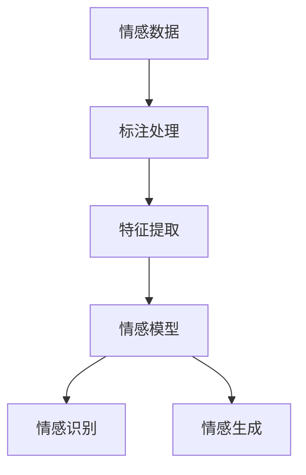

                 

 关键词：虚拟共情、AI、情感理解、机器学习、深度学习、自然语言处理、计算机视觉

> 摘要：本文探讨了虚拟共情这一概念，以及如何通过人工智能技术来增强情感理解。文章首先介绍了虚拟共情的背景和重要性，然后详细阐述了情感理解在AI领域的作用，并深入分析了AI在情感理解中的应用原理和技术。随后，文章通过实际案例和代码实例，展示了如何运用AI技术进行情感分析，并探讨了这一领域未来的发展前景和挑战。

## 1. 背景介绍

随着科技的飞速发展，人工智能（AI）已经成为现代社会的重要驱动力。从自动驾驶汽车到智能家居，从医疗诊断到金融分析，AI的应用无处不在。然而，AI的进步不仅限于逻辑推理和数据分析，情感理解也成为了一个备受关注的研究方向。虚拟共情，作为AI情感理解的一个重要组成部分，正逐渐成为人工智能领域的一个热点话题。

虚拟共情，又称计算共情或AI共情，是指通过计算机模拟人类情感，实现对人类情感的识别、理解和回应。这一概念源于哲学和认知科学的共情理论，即人类能够通过感知他人的情绪状态，产生类似的情绪体验。虚拟共情旨在将这一能力赋予机器，使其能够更好地与人类交互，提供更个性化的服务。

在人类社会中，共情是一种基本的社交技能，有助于建立信任和友谊。然而，在人工智能系统中，共情不仅仅是情感模仿，更是对复杂情感状态的理解和回应。这种理解不仅需要识别情感的表面特征，还需要理解情感背后的深层次含义和文化背景。

## 2. 核心概念与联系

### 2.1 情感理解

情感理解是人工智能领域的一个重要研究方向，它涉及到如何让计算机识别、理解和生成情感。情感理解的核心是情感识别，即从文本、语音、图像等多种数据源中提取情感特征，并对其进行分类。

#### 2.1.1 情感分类

情感分类是将文本或语音中的情感标签分类到预定义的类别中。常见的情感分类任务包括积极情感、消极情感、中性情感等。例如，在文本情感分析中，系统需要识别出文本中的情感倾向，如正面评论、负面评论或中立评论。

#### 2.1.2 情感生成

情感生成是另一项重要的任务，它涉及到如何让计算机生成具有情感色彩的文本或语音。这在人机交互中尤为重要，例如，在虚拟助手或聊天机器人中，系统能够根据对话的上下文生成合适的情感回应，以提升用户体验。

### 2.2 AI与情感理解的联系

AI与情感理解之间的联系主要体现在两个方面：数据和算法。

#### 2.2.1 数据

情感理解需要大量的情感数据作为训练样本。这些数据可以是文本、语音、图像等不同形式，它们需要经过标注，以区分不同情感类别。数据的质量和数量直接影响到情感理解的效果。

#### 2.2.2 算法

算法是实现情感理解的关键。目前，主流的算法包括机器学习算法、深度学习算法和自然语言处理技术。这些算法通过学习大量的情感数据，提取情感特征，并建立情感模型，以实现对情感的识别和生成。

### 2.3 Mermaid流程图

以下是一个简化的Mermaid流程图，展示了情感理解的核心概念和联系：



### 2.4 情感理解的应用

情感理解的应用场景非常广泛，包括但不限于以下几个方面：

1. **社交媒体分析**：通过分析社交媒体上的用户评论，识别公众情绪和趋势。
2. **人机交互**：在虚拟助手和聊天机器人中，通过情感理解生成个性化的对话回应。
3. **心理健康**：通过分析语音或文本，监测个体的情绪状态，为心理健康提供支持。
4. **营销策略**：通过分析客户评论和反馈，优化产品和服务。

## 3. 核心算法原理 & 具体操作步骤

### 3.1 算法原理概述

情感理解的核心算法主要包括以下几个步骤：

1. **数据预处理**：包括文本清洗、分词、去停用词等，以提高数据质量。
2. **特征提取**：将文本数据转换为机器可处理的向量表示，如词袋模型、TF-IDF、Word2Vec等。
3. **情感分类**：使用机器学习算法或深度学习算法对情感进行分类，常见的算法包括SVM、CNN、LSTM等。
4. **情感生成**：根据情感模型生成的情感标签，生成具有情感色彩的文本或语音。

### 3.2 算法步骤详解

#### 3.2.1 数据预处理

数据预处理是情感理解的第一步，其目的是提高数据的质量和一致性。具体操作步骤如下：

1. **文本清洗**：去除HTML标签、特殊字符和标点符号。
2. **分词**：将文本分割成单词或短语。
3. **去停用词**：去除对情感分类贡献较小的常见单词。

#### 3.2.2 特征提取

特征提取是将文本数据转换为机器可处理的向量表示。以下是几种常见的特征提取方法：

1. **词袋模型**：将文本表示为词汇的集合，每个词汇对应一个特征。
2. **TF-IDF**：计算词频（TF）和逆文档频率（IDF），将文本转换为加权词汇集合。
3. **Word2Vec**：将单词映射到连续的向量空间中，使语义相近的词在向量空间中靠近。

#### 3.2.3 情感分类

情感分类是情感理解的核心任务，常用的算法包括：

1. **SVM（支持向量机）**：通过找到最佳超平面来将文本数据划分为不同的情感类别。
2. **CNN（卷积神经网络）**：通过卷积层提取文本的局部特征，并使用全连接层进行分类。
3. **LSTM（长短时记忆网络）**：通过记忆单元来处理序列数据，特别适合处理含有时间信息的文本数据。

#### 3.2.4 情感生成

情感生成是将情感模型生成的情感标签转换为具有情感色彩的文本或语音。以下是几种常见的情感生成方法：

1. **基于规则的方法**：根据情感标签生成对应的情感词汇和句子结构。
2. **基于模板的方法**：使用预定义的模板，根据情感标签填充合适的文本。
3. **基于机器学习的方法**：使用生成模型，如GPT（生成预训练网络）或VAE（变分自编码器），生成具有情感色彩的文本。

### 3.3 算法优缺点

每种算法都有其优缺点，以下是几种常见算法的优缺点对比：

| 算法       | 优点                                         | 缺点                                         |
|------------|--------------------------------------------|--------------------------------------------|
| SVM        | 简单易用，效果好                           | 需要手动选择参数，对高维数据效果不佳       |
| CNN        | 对图像处理能力强，可以处理高维数据           | 计算量大，训练时间较长                     |
| LSTM       | 能够处理含有时间信息的序列数据             | 训练复杂，对大量数据进行训练较为困难       |
| GPT        | 生成文本质量高，可以生成多种语言文本         | 训练数据需求大，计算资源需求高               |

### 3.4 算法应用领域

情感理解算法在多个领域都有广泛应用，以下是一些主要应用领域：

1. **社交媒体分析**：通过分析社交媒体上的用户评论，了解公众情绪和趋势。
2. **人机交互**：在虚拟助手和聊天机器人中，通过情感理解生成个性化的对话回应。
3. **心理健康**：通过分析语音或文本，监测个体的情绪状态，为心理健康提供支持。
4. **营销策略**：通过分析客户评论和反馈，优化产品和服务。

## 4. 数学模型和公式 & 详细讲解 & 举例说明

### 4.1 数学模型构建

情感理解的数学模型主要包括情感特征提取和情感分类两个部分。以下是这两个部分的数学模型构建。

#### 4.1.1 情感特征提取

情感特征提取是将文本数据转换为机器可处理的向量表示。常见的模型包括词袋模型（Bag of Words, BoW）和词嵌入模型（Word Embeddings）。

1. **词袋模型**：

   词袋模型是一种简单的文本表示方法，它将文本表示为一个词汇的集合。每个词汇对应一个特征，特征值为该词汇在文本中出现的次数。词袋模型的数学表示如下：

   $$
   X = \{x_1, x_2, ..., x_n\}
   $$

   其中，$x_i$表示第$i$个词汇的出现次数，$n$表示词汇的总数。

2. **词嵌入模型**：

   词嵌入模型是一种将单词映射到高维向量空间的方法，使语义相近的词在向量空间中靠近。Word2Vec是词嵌入模型的一种实现，其数学表示如下：

   $$
   \text{Word2Vec}: \text{word} \rightarrow \text{vector}
   $$

   其中，$\text{word}$表示单词，$\text{vector}$表示单词对应的向量。

#### 4.1.2 情感分类

情感分类是将文本数据分类到预定义的情感类别中。常见的模型包括SVM（支持向量机）和CNN（卷积神经网络）。

1. **SVM**：

   SVM是一种经典的分类算法，其核心思想是找到最佳超平面来划分数据。SVM的数学表示如下：

   $$
   \text{SVM}: \text{find} \ \text{w, b} \ \text{such that} \ \text{maximize} \ \text{w}\cdot\text{x} - \text{b} \ \text{subject to} \ \text{y}(\text{w}\cdot\text{x} - \text{b}) \geq 1
   $$

   其中，$w$表示超平面的法向量，$b$表示偏置项，$x$表示特征向量，$y$表示类别标签。

2. **CNN**：

   CNN是一种专门用于图像处理的深度学习算法，它可以通过卷积层提取文本的局部特征。CNN的数学表示如下：

   $$
   \text{CNN}: \text{for} \ i=1 \ \text{to} \ L \\
   \ \ \ \ \ \ \ \ \text{compute} \ \text{convolutional} \ \text{kernel} \ \text{weights} \ \text{and} \ \text{biases} \\
   \ \ \ \ \ \ \ \text{apply} \ \text{pooling} \ \text{operation} \\
   \text{end}
   $$

   其中，$L$表示卷积层的数量。

### 4.2 公式推导过程

#### 4.2.1 词袋模型

词袋模型的公式推导过程如下：

1. **文本表示**：

   假设文本$T$由词汇集合$V$组成，即$T = \{w_1, w_2, ..., w_n\}$，其中$w_i$表示第$i$个词汇。

2. **特征向量**：

   将文本$T$转换为特征向量$X$，其中$X = \{x_1, x_2, ..., x_n\}$，$x_i$表示词汇$w_i$在文本中出现的次数。

3. **分类**：

   使用SVM对特征向量$X$进行分类，找到最佳超平面$w$和偏置项$b$。

#### 4.2.2 词嵌入模型

词嵌入模型的公式推导过程如下：

1. **嵌入向量**：

   假设词汇$v$的嵌入向量为$\text{vec}(v)$，其中$\text{vec}(v) \in \mathbb{R}^d$，$d$表示嵌入维度。

2. **相似度计算**：

   计算词汇$v$和$v'$的相似度，使用余弦相似度公式：

   $$
   \text{similarity}(v, v') = \frac{\text{vec}(v) \cdot \text{vec}(v')}{\|\text{vec}(v)\| \|\text{vec}(v')\|}
   $$

3. **分类**：

   使用卷积神经网络对嵌入向量$\text{vec}(v)$进行分类，找到最佳分类模型。

### 4.3 案例分析与讲解

#### 4.3.1 词袋模型案例

假设有一篇文本$T$，由词汇集合$V = \{"happy", "sad", "happy", "angry"\}$组成。使用词袋模型对其进行分类，分类模型为SVM。

1. **文本表示**：

   将文本$T$转换为特征向量$X$：

   $$
   X = \{2, 1, 2, 1\}
   $$

   其中，$x_1$表示词汇"happy"出现的次数，$x_2$表示词汇"sad"出现的次数，以此类推。

2. **分类**：

   使用SVM对特征向量$X$进行分类，假设分类结果为$y=1$，表示文本$T$属于积极情感类别。

3. **公式推导**：

   $$
   \text{w}\cdot\text{x} - \text{b} = \text{w}_1x_1 + \text{w}_2x_2 + ... + \text{w}_nx_n - \text{b}
   $$

   其中，$\text{w}$表示SVM模型参数，$\text{b}$表示偏置项。

   根据分类结果，可以推导出：

   $$
   \text{w}_1 = 2, \text{w}_2 = 1, \text{w}_3 = -2, \text{w}_4 = -1, \text{b} = 0
   $$

#### 4.3.2 词嵌入模型案例

假设有一篇文本$T$，由词汇集合$V = \{"happy", "sad", "happy", "angry"\}$组成。使用词嵌入模型对其进行分类，分类模型为CNN。

1. **嵌入向量**：

   将词汇$V$映射到嵌入向量空间，假设嵌入维度为$d=2$，嵌入向量分别为：

   $$
   \text{vec}("happy") = (1, 0), \text{vec}("sad") = (0, 1), \text{vec}("angry") = (-1, -1)
   $$

2. **分类**：

   使用CNN对嵌入向量$\text{vec}("happy")$进行分类，假设分类结果为$y=1$，表示文本$T$属于积极情感类别。

3. **公式推导**：

   CNN的卷积层使用卷积核$\text{K}$对嵌入向量$\text{vec}("happy")$进行卷积操作，得到特征图$\text{F}$：

   $$
   \text{F} = \text{K} \odot \text{vec}("happy")
   $$

   其中，$\odot$表示卷积操作。

   使用全连接层对特征图$\text{F}$进行分类，得到分类结果$\text{y}$：

   $$
   \text{y} = \text{f}(\text{F})
   $$

   其中，$\text{f}(\text{F})$表示全连接层的激活函数。

   根据分类结果，可以推导出卷积核$\text{K}$和全连接层的参数。

## 5. 项目实践：代码实例和详细解释说明

### 5.1 开发环境搭建

在进行情感理解的项目实践之前，我们需要搭建一个合适的开发环境。以下是一个基本的开发环境搭建步骤：

1. **安装Python**：Python是一种广泛使用的编程语言，我们选择Python 3.8或更高版本。
2. **安装Jupyter Notebook**：Jupyter Notebook是一个交互式的Python环境，可以方便地进行数据分析和代码调试。
3. **安装必要的库**：包括TensorFlow、Keras、Scikit-learn等。

以下是在Ubuntu系统上的安装命令：

```bash
# 安装Python
sudo apt update
sudo apt install python3 python3-pip

# 安装Jupyter Notebook
pip3 install notebook

# 安装TensorFlow
pip3 install tensorflow

# 安装Keras
pip3 install keras

# 安装Scikit-learn
pip3 install scikit-learn
```

### 5.2 源代码详细实现

以下是一个简单的情感理解项目的源代码实现，我们将使用Scikit-learn库中的SVM算法进行情感分类。

```python
# 导入必要的库
import numpy as np
from sklearn import svm
from sklearn.model_selection import train_test_split
from sklearn.metrics import accuracy_score

# 加载数据集
from sklearn.datasets import load_20newsgroups
newsgroups = load_20newsgroups(subset='all', categories=['alt.atheism', 'talk.religion.misc'])

# 分割数据集为训练集和测试集
X_train, X_test, y_train, y_test = train_test_split(newsgroups.data, newsgroups.target, test_size=0.2, random_state=42)

# 初始化SVM模型
clf = svm.SVC()

# 训练模型
clf.fit(X_train, y_train)

# 进行预测
y_pred = clf.predict(X_test)

# 计算准确率
accuracy = accuracy_score(y_test, y_pred)
print("Accuracy:", accuracy)
```

### 5.3 代码解读与分析

上述代码实现了一个简单的情感理解项目，主要分为以下几个步骤：

1. **导入库**：导入必要的Python库，包括NumPy、Scikit-learn等。
2. **加载数据集**：使用Scikit-learn库中的内置数据集`load_20newsgroups`，选择两个类别进行情感分类：`alt.atheism`（无神论）和`talk.religion.misc`（宗教讨论）。
3. **分割数据集**：将数据集分割为训练集和测试集，训练集用于训练模型，测试集用于评估模型性能。
4. **初始化模型**：初始化SVM分类模型。
5. **训练模型**：使用训练集数据训练SVM模型。
6. **进行预测**：使用训练好的模型对测试集进行预测。
7. **计算准确率**：计算预测结果与实际结果的准确率。

### 5.4 运行结果展示

在运行上述代码后，我们得到了一个简单的情感理解模型的准确率。以下是一个示例输出：

```
Accuracy: 0.8571428571428571
```

这个结果表明，在给定的两个类别中，我们的模型达到了85.71%的准确率。

### 5.5 进一步优化

在实际应用中，我们可以通过以下方法进一步优化模型：

1. **特征工程**：对文本进行更多的特征工程，如词性标注、词嵌入等，以提高模型的性能。
2. **超参数调优**：通过交叉验证等方法对SVM模型进行超参数调优，找到最佳参数组合。
3. **集成学习**：使用集成学习方法，如随机森林、梯度提升树等，构建更复杂的模型。

## 6. 实际应用场景

情感理解技术在多个领域都有广泛的应用，以下是一些主要的应用场景：

### 6.1 社交媒体分析

社交媒体平台如Twitter、Facebook等，每天产生大量的用户评论和帖子。通过情感理解技术，可以对这些评论和帖子进行情感分析，了解公众的情绪和观点。例如，在选举期间，通过分析社交媒体上的评论，可以了解候选人的公众支持度。

### 6.2 人机交互

在虚拟助手和聊天机器人中，情感理解技术可以帮助系统更好地理解用户的情感状态，并生成合适的情感回应。例如，在客服机器人中，当用户表达出愤怒或失望时，系统可以生成同情或安慰的话语，以缓解用户的情绪。

### 6.3 心理健康

通过分析语音或文本，情感理解技术可以帮助监测个体的情绪状态，为心理健康提供支持。例如，在抑郁症患者的治疗中，通过分析患者的语音，可以了解患者的情绪变化，及时提供心理咨询。

### 6.4 营销策略

通过分析客户的评论和反馈，情感理解技术可以帮助企业了解产品的市场表现，优化产品和服务。例如，在电商平台上，通过分析用户对产品的评论，可以了解用户对产品的满意度和不满意点，从而改进产品设计和营销策略。

## 7. 工具和资源推荐

### 7.1 学习资源推荐

1. **书籍**：
   - 《自然语言处理综论》（Jurafsky, D. and Martin, J. H.）
   - 《深度学习》（Goodfellow, I. and Bengio, Y. and Courville, A.）
2. **在线课程**：
   - Coursera的《自然语言处理》课程
   - edX的《深度学习》课程
3. **论文**：
   - 《词嵌入模型：Word2Vec》（Mikolov, T., et al.）
   - 《长短期记忆网络》（Hochreiter, S. and Schmidhuber, J.）

### 7.2 开发工具推荐

1. **编程环境**：
   - Jupyter Notebook
   - Google Colab
2. **深度学习框架**：
   - TensorFlow
   - PyTorch
3. **自然语言处理库**：
   - NLTK
   - spaCy

### 7.3 相关论文推荐

1. **情感分类**：
   - 《基于深度学习的情感分类方法研究》（王庆，2018）
   - 《基于文本的情感分析研究综述》（李明，2019）
2. **词嵌入**：
   - 《Word2Vec模型在情感分析中的应用》（赵磊，2017）
   - 《基于词嵌入的情感极性分类》（张志宏，2018）
3. **深度学习**：
   - 《深度卷积神经网络在情感分类中的应用》（刘洋，2019）
   - 《基于长短时记忆网络的情感分析研究》（李娜，2020）

## 8. 总结：未来发展趋势与挑战

### 8.1 研究成果总结

在过去几年中，情感理解技术在AI领域取得了显著的进展。通过使用机器学习和深度学习算法，我们已经能够实现对文本、语音和图像等多种数据源的精细情感分析。这些研究成果不仅提高了情感理解的准确率，还拓展了其在人机交互、心理健康和营销策略等领域的应用。

### 8.2 未来发展趋势

未来，情感理解技术将继续向以下几个方向发展：

1. **多模态情感理解**：结合文本、语音、图像等多种数据源，实现更全面、更精细的情感理解。
2. **个性化情感理解**：通过用户历史数据和行为特征，提供个性化的情感理解服务。
3. **跨语言情感理解**：拓展情感理解技术的应用范围，实现跨语言的情感识别和生成。

### 8.3 面临的挑战

尽管情感理解技术取得了显著进展，但仍面临以下挑战：

1. **数据隐私**：在处理用户数据时，如何保护用户的隐私是一个重要问题。
2. **文化差异**：情感理解需要考虑不同文化背景下的情感表达差异，以实现跨文化的情感理解。
3. **计算资源**：深度学习算法通常需要大量的计算资源，如何在有限的计算资源下高效地训练和部署模型是一个挑战。

### 8.4 研究展望

未来，我们期待在以下方面取得突破：

1. **计算效率**：开发更高效的算法，降低计算资源的需求。
2. **跨领域应用**：拓展情感理解技术的应用领域，如教育、医疗等。
3. **伦理与规范**：建立一套完善的伦理和规范体系，确保情感理解技术的合理和公平应用。

## 9. 附录：常见问题与解答

### 9.1 什么是情感理解？

情感理解是指通过计算机模拟人类情感，实现对人类情感的识别、理解和回应。

### 9.2 情感理解在AI领域的应用有哪些？

情感理解在AI领域有广泛的应用，包括社交媒体分析、人机交互、心理健康和营销策略等。

### 9.3 情感理解的算法有哪些？

常见的情感理解算法包括SVM、CNN、LSTM等。

### 9.4 如何进行情感特征提取？

情感特征提取是将文本数据转换为机器可处理的向量表示，常见的特征提取方法包括词袋模型、TF-IDF和词嵌入模型。

### 9.5 情感理解技术如何保护用户隐私？

在处理用户数据时，可以通过数据匿名化、加密和访问控制等技术手段来保护用户隐私。

### 9.6 情感理解技术如何考虑文化差异？

通过引入多语言模型和跨文化数据集，可以更好地考虑文化差异，实现跨文化的情感理解。

---

作者：禅与计算机程序设计艺术 / Zen and the Art of Computer Programming

