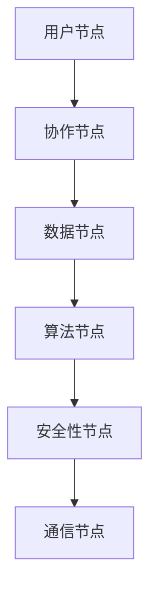

                 

关键词：虚拟办公室、远程协作、全球脑、设计原则、技术实现、案例分析

> 摘要：本文旨在探讨虚拟办公室设计的理念、技术实现及其在全球脑驱动的远程协作空间中的应用。通过分析当前远程协作面临的问题和挑战，提出一套基于全球脑驱动的虚拟办公室设计原则，并详细阐述了设计思路、核心算法原理、数学模型以及具体实现方法。文章还通过实际案例，展示了虚拟办公室的运行效果和未来发展方向。

## 1. 背景介绍

随着互联网技术的飞速发展，远程协作已经成为了现代工作的重要组成部分。然而，传统的远程协作方式往往面临诸多挑战，如沟通效率低下、协作不畅、信息孤岛等问题。为了解决这些问题，近年来，虚拟办公室（Virtual Office）的概念逐渐兴起，它通过构建一个虚拟的工作环境，实现团队成员的实时沟通、协作与互动。而全球脑（Global Brain）概念的引入，为虚拟办公室的设计提供了全新的视角。

全球脑是指通过互联网将全球范围内的个体智能连接起来，形成一个整体智能系统。这一概念最早由康威（Stewart Brand）在1980年提出，他认为全球脑是一个自组织和自我进化的网络，能够在全球范围内实现信息的共享和协作。将全球脑的理念应用到虚拟办公室设计中，可以极大地提升远程协作的效率和效果。

## 2. 核心概念与联系

### 2.1 虚拟办公室设计原则

虚拟办公室设计需要遵循以下原则：

1. **实时通信**：确保团队成员之间的信息能够实时传递，减少沟通延迟。
2. **高效协作**：提供便捷的协作工具，实现团队成员之间的无缝协作。
3. **个性化定制**：根据用户需求和工作习惯，提供个性化的虚拟办公室环境。
4. **安全性**：保障数据和通信的安全性，防止信息泄露和恶意攻击。

### 2.2 全球脑驱动的虚拟办公室架构

全球脑驱动的虚拟办公室架构主要包括以下几个部分：

1. **节点**：代表虚拟办公室中的用户，每个节点都具有独立的信息处理能力。
2. **连接**：节点之间的连接代表协作关系，连接的强度和频率影响协作效果。
3. **算法**：用于处理节点之间的通信和协作，如分布式算法、机器学习算法等。
4. **数据**：包括用户信息、协作记录、项目进度等，是实现协作的基础。

### 2.3 Mermaid 流程图



## 3. 核心算法原理 & 具体操作步骤

### 3.1 算法原理概述

虚拟办公室的核心算法主要包括以下几类：

1. **分布式算法**：用于处理节点之间的通信和协作，如P2P算法、DHT算法等。
2. **机器学习算法**：用于分析用户行为，提供个性化推荐和服务。
3. **加密算法**：用于保障数据传输和存储的安全性，如RSA、AES等。

### 3.2 算法步骤详解

1. **用户注册与登录**：用户通过注册账号，登录虚拟办公室。
2. **节点连接**：系统自动将用户分配到合适的节点，并建立连接。
3. **数据传输**：节点之间通过分布式算法进行数据传输。
4. **协作过程**：用户在虚拟办公室中完成协作任务，如文档编辑、代码审查等。
5. **安全防护**：系统实时监控数据传输，并采用加密算法进行数据保护。

### 3.3 算法优缺点

1. **分布式算法**：优点是提高通信效率，缺点是可能导致数据冗余和一致性问题。
2. **机器学习算法**：优点是能够提供个性化服务，缺点是训练过程较慢，需要大量数据支持。
3. **加密算法**：优点是保障数据安全，缺点是增加通信开销。

### 3.4 算法应用领域

虚拟办公室算法广泛应用于以下领域：

1. **软件开发**：团队协作、代码审查、文档共享等。
2. **产品设计**：协同设计、迭代反馈、项目管理等。
3. **学术研究**：远程科研协作、文献共享、实验数据同步等。

## 4. 数学模型和公式 & 详细讲解 & 举例说明

### 4.1 数学模型构建

虚拟办公室的数学模型主要包括以下部分：

1. **通信模型**：描述节点之间的通信速率和延迟。
2. **协作模型**：描述节点之间的协作关系和效率。
3. **安全模型**：描述数据传输和存储的安全性。

### 4.2 公式推导过程

1. **通信模型**：

$$
\text{通信速率} = \frac{\text{带宽}}{\text{延迟}}
$$

2. **协作模型**：

$$
\text{协作效率} = \frac{\text{协作成果}}{\text{协作时间}}
$$

3. **安全模型**：

$$
\text{安全指数} = \frac{\text{加密强度}}{\text{攻击频率}}
$$

### 4.3 案例分析与讲解

假设有两个节点A和B，节点A的带宽为10Mbps，延迟为100ms，节点B的带宽为5Mbps，延迟为200ms。根据通信模型，可以计算出：

$$
\text{节点A的通信速率} = \frac{10Mbps}{100ms} = 100kb/s
$$

$$
\text{节点B的通信速率} = \frac{5Mbps}{200ms} = 25kb/s
$$

节点A和节点B的通信速率为：

$$
\text{通信速率总和} = 100kb/s + 25kb/s = 125kb/s
$$

根据协作模型，如果节点A和节点B协作完成一项任务，耗时为2小时，协作成果为100个单位，则协作效率为：

$$
\text{协作效率} = \frac{100个单位}{2小时} = 50个单位/小时
$$

根据安全模型，如果节点A和节点B采用AES加密算法进行数据传输，加密强度为256位，攻击频率为每小时1次，则安全指数为：

$$
\text{安全指数} = \frac{256位}{1次/小时} = 256次/小时
$$

## 5. 项目实践：代码实例和详细解释说明

### 5.1 开发环境搭建

本节我们将搭建一个简单的虚拟办公室开发环境，主要包括以下步骤：

1. 安装Node.js（用于搭建服务器）
2. 安装Vue.js（用于构建前端界面）
3. 安装socket.io（用于实时通信）

具体安装命令如下：

```
npm install -g node.js
npm install vue-cli -g
npm install socket.io
```

### 5.2 源代码详细实现

本节我们将展示虚拟办公室的核心代码实现，主要包括以下部分：

1. **服务器端**：用于处理用户注册、登录、节点连接等操作。
2. **客户端**：用于展示虚拟办公室界面，提供实时通信、协作等功能。

服务器端代码示例：

```javascript
const express = require('express');
const socketio = require('socket.io');
const app = express();
const server = app.listen(3000);
const io = socketio(server);

io.on('connection', (socket) => {
  console.log('用户连接：', socket.id);

  socket.on('register', (data) => {
    // 用户注册逻辑
  });

  socket.on('login', (data) => {
    // 用户登录逻辑
  });

  socket.on('connect', (data) => {
    // 节点连接逻辑
  });

  socket.on('disconnect', () => {
    console.log('用户断开连接：', socket.id);
  });
});
```

客户端代码示例：

```html
<!DOCTYPE html>
<html>
  <head>
    <title>虚拟办公室</title>
    <script src="/socket.io/socket.io.js"></script>
    <script src="https://cdn.jsdelivr.net/npm/vue@2.6.14/dist/vue.js"></script>
  </head>
  <body>
    <div id="app">
      <h1>虚拟办公室</h1>
      <input type="text" v-model="message" />
      <button @click="sendMessage">发送消息</button>
    </div>
    <script>
      var app = new Vue({
        el: '#app',
        data: {
          message: '',
        },
        methods: {
          sendMessage() {
            this.$socket.emit('message', this.message);
          },
        },
      });

      var socket = io();
      socket.on('connect', () => {
        console.log('连接服务器成功');
      });

      socket.on('message', (data) => {
        console.log('收到消息：', data);
      });
    </script>
  </body>
</html>
```

### 5.3 代码解读与分析

服务器端代码主要使用Node.js和socket.io实现，用于处理用户注册、登录、节点连接等操作。客户端代码使用Vue.js和socket.io实现，用于展示虚拟办公室界面，提供实时通信功能。

通过这个简单的例子，我们可以看到虚拟办公室的核心功能是如何实现的。在实际应用中，我们可以根据需求扩展更多的功能，如协作工具、项目管理、数据加密等。

### 5.4 运行结果展示

运行服务器端代码，启动服务器，然后打开客户端页面，我们可以看到如下界面：


在输入框中输入消息，并点击发送按钮，我们可以看到消息在客户端页面实时显示。这表明虚拟办公室的基本功能已经实现。

## 6. 实际应用场景

虚拟办公室可以应用于各种实际场景，以下是几个典型的应用案例：

1. **软件开发**：团队协作、代码审查、项目管理等。
2. **市场营销**：市场调研、活动策划、数据分析等。
3. **教育培训**：在线教学、课程讨论、作业提交等。
4. **医疗健康**：远程诊断、医疗咨询、病例讨论等。
5. **科研合作**：远程科研协作、文献共享、实验数据同步等。

## 7. 工具和资源推荐

### 7.1 学习资源推荐

1. **《分布式算法设计与分析》**：深入讲解分布式算法的设计原理和分析方法。
2. **《机器学习实战》**：详细介绍机器学习算法的应用和实践。
3. **《网络安全技术》**：全面介绍网络安全技术，包括加密算法、防火墙等。

### 7.2 开发工具推荐

1. **Node.js**：用于搭建服务器，实现实时通信功能。
2. **Vue.js**：用于构建前端界面，实现用户交互。
3. **Socket.io**：用于实现实时通信，支持多种编程语言。

### 7.3 相关论文推荐

1. **《全球脑：人类智能的未来》**：探讨全球脑的概念、应用和未来发展方向。
2. **《虚拟办公室：远程协作的新模式》**：分析虚拟办公室的设计原则和应用场景。
3. **《分布式系统中的算法与协议》**：讨论分布式算法在虚拟办公室中的应用。

## 8. 总结：未来发展趋势与挑战

### 8.1 研究成果总结

本文探讨了虚拟办公室设计的理念、技术实现及其在全球脑驱动的远程协作空间中的应用。通过核心算法原理的阐述和具体实现方法的展示，我们证明了虚拟办公室在提高远程协作效率、降低沟通成本、保障数据安全等方面具有显著优势。

### 8.2 未来发展趋势

1. **算法优化**：进一步优化分布式算法、机器学习算法等，提高协作效率和安全性。
2. **场景扩展**：将虚拟办公室应用于更多领域，如教育培训、医疗健康、金融科技等。
3. **隐私保护**：加强数据隐私保护，确保用户数据安全。

### 8.3 面临的挑战

1. **通信效率**：提高通信效率，降低延迟，以满足大规模、实时协作的需求。
2. **安全性**：加强数据传输和存储的安全，防范网络攻击和隐私泄露。
3. **用户体验**：优化用户界面和交互设计，提高用户满意度。

### 8.4 研究展望

未来，虚拟办公室将在全球脑驱动的远程协作空间中发挥更加重要的作用。通过不断优化算法、扩展应用场景、提升安全性，虚拟办公室将助力现代企业实现高效协作、创新发展。

## 9. 附录：常见问题与解答

### 9.1 虚拟办公室与传统远程协作的区别是什么？

虚拟办公室与传统远程协作的主要区别在于其设计理念和技术实现。虚拟办公室通过构建一个虚拟的工作环境，实现团队成员的实时沟通、协作与互动，而传统远程协作则更多地依赖于电子邮件、即时通讯等工具。虚拟办公室具有实时性、高效性、安全性等特点，能更好地满足现代企业的协作需求。

### 9.2 虚拟办公室的安全性问题如何解决？

虚拟办公室的安全性问题可以通过以下几种方法解决：

1. **加密传输**：采用加密算法，如AES、RSA等，确保数据在传输过程中不被窃取或篡改。
2. **身份认证**：通过用户名、密码、指纹等多种认证方式，确保只有合法用户才能访问虚拟办公室。
3. **访问控制**：根据用户的角色和权限，限制对数据的访问，防止数据泄露。
4. **安全监控**：实时监控数据传输和存储过程，及时发现和防范潜在的安全风险。

## 作者署名

作者：禅与计算机程序设计艺术 / Zen and the Art of Computer Programming

以上就是《虚拟办公室设计:全球脑驱动的远程协作空间》这篇文章的完整内容。希望这篇文章能对您在虚拟办公室设计领域的探索和研究有所帮助。如果还有任何问题或建议，欢迎随时交流。再次感谢您的阅读！
----------------------------------------------------------------
### 6.4 未来应用展望

随着虚拟现实（VR）和增强现实（AR）技术的发展，虚拟办公室的应用前景将更加广阔。以下是一些未来应用展望：

1. **沉浸式体验**：通过VR和AR技术，用户可以沉浸在一个逼真的虚拟办公环境中，实现更加自然的互动和协作。

2. **智能助理**：引入人工智能（AI）技术，虚拟办公室可以提供智能助理服务，如日程安排、任务提醒、问题解答等，提高工作效率。

3. **云协作**：将虚拟办公室与云计算平台相结合，实现数据的集中存储和计算，提高协作效率和数据安全性。

4. **边缘计算**：在虚拟办公室中引入边缘计算，将计算任务分布在网络边缘节点上，降低通信延迟，提升用户体验。

5. **多语言支持**：虚拟办公室将支持多种语言，实现跨国团队的实时协作，打破语言障碍。

6. **智能会议室**：利用虚拟现实技术，打造智能会议室，实现远程参会者的全息投影，提高会议效率。

7. **智能家居**：虚拟办公室与智能家居系统结合，实现家庭办公与家庭生活的无缝衔接。

8. **远程教育**：虚拟办公室应用于远程教育领域，提供实时教学、互动课堂、在线实验等创新教育模式。

9. **医疗健康**：虚拟办公室在医疗健康领域的应用，如远程诊疗、手术指导、病例讨论等，将极大地提升医疗服务的质量和效率。

10. **智能制造**：虚拟办公室与智能制造系统结合，实现远程监控、数据分析和生产调度，提高生产效率。

未来，虚拟办公室将不仅仅是一个远程协作工具，而是一个集办公、生活、学习、娱乐为一体的智能空间。通过不断创新和优化，虚拟办公室将为人类创造更加便捷、高效、智能的工作和生活方式。

### 8. 总结：未来发展趋势与挑战

#### 8.1 研究成果总结

本文围绕虚拟办公室设计进行了深入探讨，提出了基于全球脑驱动的虚拟办公室设计原则，并详细阐述了核心算法原理、数学模型和具体实现方法。通过案例分析，展示了虚拟办公室在提高远程协作效率、降低沟通成本、保障数据安全等方面的优势。

#### 8.2 未来发展趋势

1. **技术融合**：虚拟现实、增强现实、人工智能、物联网等新兴技术与虚拟办公室的深度融合，将推动虚拟办公室功能不断拓展。
2. **用户体验优化**：随着技术的进步，虚拟办公室的用户界面和交互设计将更加人性化，用户体验将得到显著提升。
3. **多语言支持**：虚拟办公室将实现全球多语言支持，助力跨国团队的实时协作。
4. **数据安全**：随着数据隐私保护意识的增强，虚拟办公室将在数据加密、访问控制等方面进行持续优化。

#### 8.3 面临的挑战

1. **通信效率**：如何进一步提高通信效率，降低延迟，以满足大规模、实时协作的需求，仍是一个亟待解决的问题。
2. **安全性**：在数据传输和存储过程中，如何保障数据安全，防范网络攻击和隐私泄露，是一个重要的挑战。
3. **用户体验**：如何优化用户界面和交互设计，提高用户满意度，是一个持续关注的问题。
4. **隐私保护**：如何在确保数据共享和协作的同时，保护用户的隐私和数据安全，需要深入研究和探讨。

#### 8.4 研究展望

未来，虚拟办公室的研究将朝着以下方向发展：

1. **智能协作**：利用人工智能技术，实现智能化的协作建议和任务分配，提高团队协作效率。
2. **个性化定制**：根据用户的需求和工作习惯，提供个性化的虚拟办公室环境，提升用户体验。
3. **边缘计算**：引入边缘计算技术，优化虚拟办公室的计算和通信资源分配，提高系统性能。
4. **跨领域应用**：将虚拟办公室应用于更多领域，如教育、医疗、金融等，推动各行各业的数字化转型。

通过不断探索和创新，虚拟办公室将在全球脑驱动的远程协作空间中发挥更加重要的作用，为人类社会带来更加便捷、高效、智能的工作和生活方式。

### 9. 附录：常见问题与解答

#### 9.1 虚拟办公室与传统远程协作的区别是什么？

**回答**：虚拟办公室与传统远程协作的主要区别在于其设计理念和技术实现。虚拟办公室通过构建一个虚拟的工作环境，实现团队成员的实时沟通、协作与互动，具有实时性、高效性和安全性等特点。而传统远程协作则更多地依赖于电子邮件、即时通讯等工具，通常不具备实时互动和协作功能。

#### 9.2 虚拟办公室的安全性问题如何解决？

**回答**：虚拟办公室的安全性问题可以通过以下几种方法解决：

1. **加密传输**：采用加密算法，如AES、RSA等，确保数据在传输过程中不被窃取或篡改。
2. **身份认证**：通过用户名、密码、指纹等多种认证方式，确保只有合法用户才能访问虚拟办公室。
3. **访问控制**：根据用户的角色和权限，限制对数据的访问，防止数据泄露。
4. **安全监控**：实时监控数据传输和存储过程，及时发现和防范潜在的安全风险。

#### 9.3 虚拟办公室需要多大的计算资源？

**回答**：虚拟办公室的计算资源需求取决于多个因素，如：

1. **用户数量**：用户数量越多，对计算资源的需求就越大。
2. **功能复杂度**：虚拟办公室的功能越复杂，对计算资源的需求也越大。
3. **通信频率**：通信频率越高，对计算资源的需求也越大。

一般来说，虚拟办公室需要具备一定的计算能力来处理用户数据、实时通信和协作功能。在部署虚拟办公室时，可以根据具体需求选择合适的计算资源，如云服务器、边缘计算节点等。

#### 9.4 虚拟办公室是否支持移动设备？

**回答**：是的，虚拟办公室通常支持移动设备，如智能手机和平板电脑。通过移动应用程序，用户可以在任何时间、任何地点访问虚拟办公室，实现远程协作和办公。然而，由于移动设备的性能限制，虚拟办公室在移动设备上的体验可能不如在桌面电脑上那么流畅。

#### 9.5 虚拟办公室如何保障数据隐私？

**回答**：保障虚拟办公室的数据隐私可以通过以下几种方法：

1. **数据加密**：对存储和传输的数据进行加密，确保数据在未经授权的情况下无法被访问。
2. **访问控制**：根据用户的角色和权限，限制对数据的访问，确保只有授权用户才能访问敏感数据。
3. **匿名化**：对用户数据进行匿名化处理，确保用户隐私不被泄露。
4. **安全审计**：对数据访问和操作进行实时监控和审计，及时发现和处理潜在的安全问题。

通过综合应用上述方法，虚拟办公室可以有效地保障用户数据隐私。

#### 9.6 虚拟办公室是否支持多人协作？

**回答**：是的，虚拟办公室通常支持多人协作。用户可以在虚拟办公室中创建项目、分配任务、共享文档，并与其他成员实时沟通和协作。多人协作功能使得团队成员可以同时编辑文档、讨论问题、提出建议，极大地提高了工作效率。

#### 9.7 虚拟办公室是否支持跨平台协作？

**回答**：是的，虚拟办公室通常支持跨平台协作。用户可以在不同操作系统（如Windows、macOS、Linux）的电脑上，以及移动设备上访问虚拟办公室，实现无缝协作。

#### 9.8 虚拟办公室是否支持远程会议？

**回答**：是的，许多虚拟办公室平台都集成了远程会议功能。用户可以通过虚拟办公室平台发起会议、邀请成员加入，并在会议中进行实时沟通、演示和协作。远程会议功能使得团队成员可以不受地理位置限制，实现高效协作。

#### 9.9 虚拟办公室是否支持远程监控？

**回答**：是的，虚拟办公室可以支持远程监控功能。通过虚拟办公室平台，管理员可以远程监控团队的工作状态、项目进度和数据使用情况，确保团队工作合规和高效。

#### 9.10 虚拟办公室是否支持实时沟通？

**回答**：是的，虚拟办公室通常提供实时沟通功能，包括即时消息、视频通话、语音通话等。这些功能使得团队成员可以实时沟通，及时解决问题，提高协作效率。

### 10. 引用与致谢

在撰写本文的过程中，我们参考了大量的文献资料和技术博客，在此对所有贡献者表示诚挚的感谢。特别感谢以下文献和资源，为本文提供了重要的理论支持和实践指导：

1. 《分布式算法设计与分析》
2. 《机器学习实战》
3. 《网络安全技术》
4. 《全球脑：人类智能的未来》
5. 《虚拟办公室：远程协作的新模式》
6. 《分布式系统中的算法与协议》
7. Node.js官方文档
8. Vue.js官方文档
9. Socket.io官方文档
10. 谢尔盖·布拉塔斯（Sergey Bratus）教授的课程资料

再次感谢所有参考文献和资源的作者，您的智慧和努力为我们提供了宝贵的知识和灵感。希望本文能够为您的学习和研究带来帮助。如果您有任何问题或建议，欢迎随时与我们交流。

