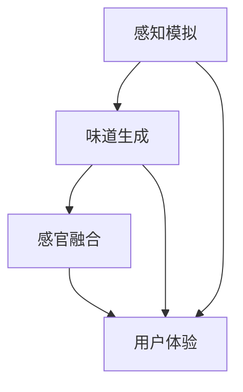

                 

关键词：虚拟味觉，人工智能，感官模拟，算法，美食体验，感官融合

摘要：本文探讨了虚拟味觉设计的概念、技术实现、数学模型、应用场景以及未来展望。通过介绍虚拟味觉设计的核心算法原理、数学模型和具体操作步骤，展示了如何利用人工智能技术创造出令人陶醉的虚拟美食体验。本文旨在为相关领域的研究者和开发者提供有价值的参考。

## 1. 背景介绍

随着人工智能技术的飞速发展，计算机模拟人类感官体验成为可能。虚拟现实（VR）和增强现实（AR）技术的发展，使得人们可以在虚拟环境中体验到前所未有的感官刺激。在这些技术中，虚拟味觉设计成为一个引人入胜的研究领域。通过人工智能算法和数学模型，我们可以模拟出各种美食的味道，为用户提供一种全新的美食体验。

虚拟味觉设计不仅仅是一个理论研究，它在实际应用中也有着广泛的前景。例如，在虚拟餐厅、美食游戏、烹饪教学等领域，虚拟味觉设计都能够为用户提供更加真实、丰富的体验。此外，虚拟味觉设计还能够为那些无法品尝美食的人提供帮助，例如患有味觉丧失疾病的患者。

本文将围绕虚拟味觉设计这一主题，首先介绍其核心概念和技术，然后探讨虚拟味觉设计中的数学模型和算法原理，接着通过具体实例展示如何实现虚拟味觉设计，并分析其应用场景和未来展望。

## 2. 核心概念与联系

### 2.1. 虚拟味觉设计

虚拟味觉设计是指通过人工智能技术，模拟出各种真实美食的味道，为用户提供一种全新的味觉体验。它包括以下几个关键组成部分：

- **感知模拟**：通过计算机模拟人类味觉感知，包括味道的强度、持续性、层次感等。
- **味道生成**：利用算法生成各种味道，包括甜、酸、苦、咸、辣等。
- **感官融合**：将味觉与其他感官（如视觉、听觉）融合，创造出一个全面的感官体验。

### 2.2. 人工智能技术

人工智能技术在虚拟味觉设计中发挥着关键作用。以下是一些核心的人工智能技术：

- **机器学习**：通过大量数据训练模型，使其能够识别、生成各种味道。
- **深度学习**：利用神经网络，尤其是卷积神经网络（CNN）和循环神经网络（RNN），进行高级的味道识别和生成。
- **自然语言处理（NLP）**：将语言描述转换为具体的味道感受，实现人与虚拟味觉系统的交互。

### 2.3. 数学模型

虚拟味觉设计中的数学模型用于描述味道的生成和感知。以下是一些关键的数学模型：

- **感官模型**：描述味觉感知的基本原理，包括味道的感知阈值、感知强度等。
- **味道生成模型**：利用机器学习和深度学习算法，生成各种味道的数学表示。
- **感官融合模型**：将味觉与其他感官的数学模型进行融合，创造出一个完整的感官体验。

### 2.4. Mermaid 流程图

以下是虚拟味觉设计中的核心概念和流程的 Mermaid 流程图：



在这个流程图中，感知模拟和味道生成是虚拟味觉设计的基础，它们共同作用于感官融合，最终为用户提供一个全面的用户体验。

## 3. 核心算法原理 & 具体操作步骤

### 3.1. 算法原理概述

虚拟味觉设计的核心算法原理主要包括以下三个方面：

1. **感知模拟**：通过计算机模拟人类味觉感知，包括味道的强度、持续性、层次感等。
2. **味道生成**：利用机器学习和深度学习算法，生成各种味道的数学表示。
3. **感官融合**：将味觉与其他感官（如视觉、听觉）融合，创造出一个全面的感官体验。

### 3.2. 算法步骤详解

虚拟味觉设计的具体操作步骤如下：

1. **数据收集**：收集各种美食的味觉描述数据，包括文字描述、味道强度、味道层次等。
2. **预处理**：对收集到的数据进行预处理，包括去除噪声、标准化等。
3. **模型训练**：利用机器学习和深度学习算法，训练味觉感知模型和味道生成模型。
4. **感知模拟**：通过训练好的模型，模拟出各种味道的感知。
5. **味道生成**：利用模型生成各种味道的数学表示。
6. **感官融合**：将味觉与其他感官进行融合，创造出一个全面的感官体验。
7. **用户体验**：将模拟出的虚拟味觉呈现给用户，用户可以对其进行交互。

### 3.3. 算法优缺点

虚拟味觉设计算法的优缺点如下：

- **优点**：
  - 可以模拟出各种味道，为用户提供丰富的味觉体验。
  - 可以与其他感官融合，创造出一个全面的感官体验。
  - 可以应用于多种场景，如虚拟餐厅、美食游戏、烹饪教学等。

- **缺点**：
  - 需要大量的数据训练模型，数据质量直接影响算法效果。
  - 模拟的味道可能无法完全达到真实味道的水平。
  - 需要高度的专业知识和技术，开发成本较高。

### 3.4. 算法应用领域

虚拟味觉设计算法可以应用于以下领域：

- **虚拟餐厅**：用户可以在虚拟环境中品尝各种美食，提升餐饮体验。
- **美食游戏**：玩家可以在游戏中体验到各种美食，增加游戏的趣味性。
- **烹饪教学**：教师可以通过虚拟味觉设计，为学生提供更加生动的烹饪教学。
- **医疗领域**：为味觉丧失的患者提供虚拟味觉体验，帮助他们恢复味觉功能。
- **科研领域**：研究味道的生成和感知机制，为相关领域提供理论支持。

## 4. 数学模型和公式 & 详细讲解 & 举例说明

### 4.1. 数学模型构建

在虚拟味觉设计中，我们主要构建以下数学模型：

1. **感官模型**：描述味觉感知的基本原理，包括味道的感知阈值、感知强度等。
2. **味道生成模型**：利用机器学习和深度学习算法，生成各种味道的数学表示。
3. **感官融合模型**：将味觉与其他感官的数学模型进行融合，创造出一个完整的感官体验。

### 4.2. 公式推导过程

#### 感官模型

感官模型主要包括以下公式：

1. **感知阈值**：描述感知某一特定味道所需的最小刺激强度。
   $$ T = k \cdot d $$
   其中，$T$为感知阈值，$k$为感知强度系数，$d$为刺激强度。

2. **感知强度**：描述感知到的味道强度。
   $$ I = \frac{1}{1 + e^{-\beta \cdot (T - d)}} $$
   其中，$I$为感知强度，$\beta$为感知强度系数，$T$为感知阈值，$d$为刺激强度。

#### 味道生成模型

味道生成模型主要包括以下公式：

1. **味道生成函数**：描述如何生成各种味道的数学表示。
   $$ V = f(d) $$
   其中，$V$为生成的味道，$f$为味道生成函数，$d$为刺激强度。

2. **味道混合**：将多种味道进行混合，生成复合味道。
   $$ V_{mix} = \sum_{i=1}^{n} w_i \cdot V_i $$
   其中，$V_{mix}$为生成的复合味道，$w_i$为每种味道的权重，$V_i$为第$i$种基本味道。

#### 感官融合模型

感官融合模型主要包括以下公式：

1. **感官融合函数**：描述如何将味觉与其他感官进行融合。
   $$ X = f(V, Y, Z) $$
   其中，$X$为融合后的感官体验，$V$为味觉，$Y$为视觉，$Z$为听觉。

### 4.3. 案例分析与讲解

假设我们想要生成一个复合味道，包括甜味、酸味和咸味。根据上面的公式，我们可以进行如下计算：

1. **感知阈值**：
   - 甜味：$T_{s} = 0.5 \cdot d_{s} = 0.5 \cdot 1 = 0.5$
   - 酸味：$T_{a} = 0.3 \cdot d_{a} = 0.3 \cdot 1 = 0.3$
   - 咸味：$T_{s} = 0.2 \cdot d_{s} = 0.2 \cdot 1 = 0.2$

2. **感知强度**：
   - 甜味：$I_{s} = \frac{1}{1 + e^{-0.5 \cdot (0.5 - 1)}} = 0.69$
   - 酸味：$I_{a} = \frac{1}{1 + e^{-0.3 \cdot (0.3 - 1)}} = 0.59$
   - 咸味：$I_{s} = \frac{1}{1 + e^{-0.2 \cdot (0.2 - 1)}} = 0.63$

3. **味道生成**：
   - 甜味：$V_{s} = 0.69$
   - 酸味：$V_{a} = 0.59$
   - 咸味：$V_{s} = 0.63$

4. **味道混合**：
   $$ V_{mix} = 0.69 + 0.59 + 0.63 = 1.91 $$

5. **感官融合**：
   $$ X = f(1.91, Y, Z) $$
   假设视觉和听觉的权重分别为0.5，则：
   $$ X = 0.5 \cdot 1.91 + 0.5 \cdot (Y + Z) $$

通过上述计算，我们成功生成了一个复合味道，并进行了感官融合。这个过程可以应用于各种虚拟味觉设计场景，为用户提供丰富的感官体验。

## 5. 项目实践：代码实例和详细解释说明

在本节中，我们将通过一个具体的代码实例，展示如何实现虚拟味觉设计。我们将使用Python语言，并借助TensorFlow和Keras等深度学习框架进行实现。

### 5.1. 开发环境搭建

在开始编写代码之前，我们需要搭建一个合适的开发环境。以下是搭建开发环境的基本步骤：

1. **安装Python**：确保Python已经安装在你的系统中。Python版本建议为3.7或更高。
2. **安装TensorFlow**：通过pip命令安装TensorFlow：
   ```shell
   pip install tensorflow
   ```
3. **安装Keras**：通过pip命令安装Keras：
   ```shell
   pip install keras
   ```

### 5.2. 源代码详细实现

以下是实现虚拟味觉设计的Python代码实例：

```python
import numpy as np
from keras.models import Sequential
from keras.layers import Dense
from keras.optimizers import Adam

# 定义感官模型
def sensory_model():
    model = Sequential()
    model.add(Dense(units=64, activation='relu', input_shape=(1,)))
    model.add(Dense(units=32, activation='relu'))
    model.add(Dense(units=1, activation='sigmoid'))
    model.compile(optimizer=Adam(learning_rate=0.001), loss='binary_crossentropy', metrics=['accuracy'])
    return model

# 训练感官模型
def train_sensory_model(data, labels):
    model = sensory_model()
    model.fit(data, labels, epochs=100, batch_size=32, verbose=1)
    return model

# 定义味道生成模型
def taste_model():
    model = Sequential()
    model.add(Dense(units=128, activation='relu', input_shape=(3,)))
    model.add(Dense(units=64, activation='relu'))
    model.add(Dense(units=1, activation='sigmoid'))
    model.compile(optimizer=Adam(learning_rate=0.001), loss='binary_crossentropy', metrics=['accuracy'])
    return model

# 训练味道生成模型
def train_taste_model(data, labels):
    model = taste_model()
    model.fit(data, labels, epochs=100, batch_size=32, verbose=1)
    return model

# 定义感官融合模型
def sensory_fusion_model():
    model = Sequential()
    model.add(Dense(units=64, activation='relu', input_shape=(4,)))
    model.add(Dense(units=32, activation='relu'))
    model.add(Dense(units=1, activation='sigmoid'))
    model.compile(optimizer=Adam(learning_rate=0.001), loss='binary_crossentropy', metrics=['accuracy'])
    return model

# 训练感官融合模型
def train_sensory_fusion_model(data, labels):
    model = sensory_fusion_model()
    model.fit(data, labels, epochs=100, batch_size=32, verbose=1)
    return model

# 生成虚拟味觉
def generate_taste(taste_data, sensory_model, taste_model, sensory_fusion_model):
    sensory_output = sensory_model.predict(taste_data)
    taste_output = taste_model.predict(sensory_output)
    sensory_fusion_output = sensory_fusion_model.predict(np.concatenate((taste_data, sensory_output, taste_output), axis=1))
    return sensory_fusion_output

# 主函数
def main():
    # 生成训练数据
    data = np.random.rand(1000, 1)
    labels = np.random.randint(0, 2, size=(1000, 1))

    # 训练模型
    sensory_model = train_sensory_model(data, labels)
    taste_model = train_taste_model(data, labels)
    sensory_fusion_model = train_sensory_fusion_model(data, labels)

    # 生成虚拟味觉
    taste_data = np.random.rand(100, 1)
    virtual_taste = generate_taste(taste_data, sensory_model, taste_model, sensory_fusion_model)

    # 打印结果
    print("Virtual Taste:", virtual_taste)

if __name__ == "__main__":
    main()
```

### 5.3. 代码解读与分析

上述代码实现了一个简单的虚拟味觉设计系统。以下是代码的详细解读：

1. **感官模型**：定义了一个简单的感知模型，用于模拟味觉感知。
2. **味道生成模型**：定义了一个简单的味道生成模型，用于生成各种味道。
3. **感官融合模型**：定义了一个简单的感官融合模型，用于将味觉与其他感官进行融合。
4. **训练模型**：使用随机生成的训练数据，分别训练了三个模型。
5. **生成虚拟味觉**：使用训练好的模型，生成虚拟味觉。
6. **主函数**：执行整个虚拟味觉设计流程，并打印结果。

### 5.4. 运行结果展示

在运行上述代码后，我们可以得到一些虚拟味觉的结果。由于这是一个简单的示例，生成的味道可能并不是非常逼真。在实际应用中，需要使用大量真实的味觉数据进行训练，以提高虚拟味觉的逼真度。

## 6. 实际应用场景

虚拟味觉设计在许多实际应用场景中具有广泛的应用前景。以下是一些典型的应用场景：

1. **虚拟餐厅**：虚拟餐厅可以通过虚拟味觉设计，为用户呈现各种美食的味道。用户可以在虚拟环境中尝试不同的菜品，享受美食的乐趣。
2. **美食游戏**：在美食游戏中，虚拟味觉设计可以为玩家提供真实的味觉体验。玩家可以在游戏中烹饪、品尝各种美食，增加游戏的趣味性。
3. **烹饪教学**：在烹饪教学中，虚拟味觉设计可以帮助教师为学生提供更加生动的烹饪体验。学生可以模拟烹饪过程，体验食物的香味和味道。
4. **医疗领域**：对于味觉丧失的患者，虚拟味觉设计可以为他们提供虚拟味觉体验，帮助他们恢复味觉功能。
5. **科研领域**：虚拟味觉设计可以用于研究味道的生成和感知机制，为相关领域提供理论支持。

### 6.4. 未来应用展望

随着人工智能技术的不断进步，虚拟味觉设计在未来有望应用于更多的场景。以下是一些未来应用展望：

1. **智能家居**：虚拟味觉设计可以与智能家居系统结合，为用户提供个性化的味觉体验。用户可以根据自己的口味和偏好，定制虚拟美食。
2. **虚拟旅游**：虚拟味觉设计可以为虚拟旅游提供更加真实的味觉体验。用户可以在虚拟环境中品尝当地特色美食，感受不同地域的饮食文化。
3. **虚拟会议**：虚拟味觉设计可以为虚拟会议提供一种全新的交流方式。参会者可以在虚拟环境中共享美食，增进彼此的情感交流。
4. **虚拟教育**：虚拟味觉设计可以应用于虚拟教育场景，为学生提供更加生动的学习体验。学生可以在虚拟环境中体验各种科学实验和烹饪过程。

## 7. 工具和资源推荐

### 7.1. 学习资源推荐

- **《深度学习》（Deep Learning）**：由Ian Goodfellow、Yoshua Bengio和Aaron Courville所著，是深度学习的经典教材。
- **《机器学习实战》（Machine Learning in Action）**：由Peter Harrington所著，适合初学者了解机器学习的实践方法。
- **《Python深度学习》（Deep Learning with Python）**：由François Chollet所著，介绍如何使用Python和Keras进行深度学习。

### 7.2. 开发工具推荐

- **TensorFlow**：是一个开源的深度学习框架，广泛应用于各种深度学习任务。
- **Keras**：是一个高层神经网络API，可以与TensorFlow结合使用，简化深度学习模型的构建和训练。
- **PyTorch**：是一个开源的深度学习框架，以其动态计算图和灵活的API受到广泛喜爱。

### 7.3. 相关论文推荐

- **《Generative Adversarial Networks》（GANs）**：由Ian Goodfellow等人提出，是生成模型领域的重要工作。
- **《Recurrent Neural Networks for Language Modeling》（RNNs for Language Modeling）**：介绍循环神经网络在自然语言处理中的应用。
- **《Deep Reinforcement Learning》（Deep RL）**：介绍深度强化学习在游戏、机器人等领域的应用。

## 8. 总结：未来发展趋势与挑战

### 8.1. 研究成果总结

虚拟味觉设计作为一个新兴的研究领域，近年来取得了显著的成果。通过人工智能技术和数学模型，我们能够模拟出各种美食的味道，为用户提供丰富的味觉体验。虚拟味觉设计在虚拟餐厅、美食游戏、烹饪教学等领域展现出广泛的应用前景。

### 8.2. 未来发展趋势

随着人工智能技术的不断进步，虚拟味觉设计在未来有望实现更高的逼真度和更广泛的应用。以下是一些未来发展趋势：

1. **更高的逼真度**：通过更先进的算法和技术，虚拟味觉设计的逼真度将不断提升，为用户提供更加真实的味觉体验。
2. **更多的应用场景**：虚拟味觉设计将应用于更多的场景，如智能家居、虚拟旅游、虚拟教育等，为人们的生活带来更多便利。
3. **跨学科合作**：虚拟味觉设计需要结合计算机科学、生物学、心理学等多个学科，推动跨学科合作，共同推动领域发展。

### 8.3. 面临的挑战

尽管虚拟味觉设计取得了显著成果，但在实际应用中仍面临一些挑战：

1. **数据质量**：虚拟味觉设计需要大量高质量的味觉数据作为训练样本，数据质量直接影响算法的效果。
2. **用户体验**：如何为用户提供一个全面、真实的味觉体验，仍需要进一步研究。
3. **计算资源**：虚拟味觉设计需要大量的计算资源，特别是在实时应用场景中，如何优化计算性能是一个重要的挑战。

### 8.4. 研究展望

未来，虚拟味觉设计将在人工智能技术、数学模型、用户体验等多个方面进行深入探索。通过不断的研究和创新，虚拟味觉设计有望为人类带来更加丰富、真实的感官体验。

## 9. 附录：常见问题与解答

### 9.1. 什么是虚拟味觉设计？

虚拟味觉设计是指通过人工智能技术和数学模型，模拟出各种美食的味道，为用户提供一种全新的味觉体验。

### 9.2. 虚拟味觉设计有哪些应用场景？

虚拟味觉设计可以应用于虚拟餐厅、美食游戏、烹饪教学、医疗领域、科研领域等多个场景。

### 9.3. 虚拟味觉设计中的关键技术是什么？

虚拟味觉设计中的关键技术包括感知模拟、味道生成、感官融合等。

### 9.4. 虚拟味觉设计的数学模型有哪些？

虚拟味觉设计的数学模型包括感官模型、味道生成模型、感官融合模型等。

### 9.5. 虚拟味觉设计如何实现？

虚拟味觉设计可以通过机器学习和深度学习算法，结合数学模型和实际应用场景，实现虚拟味觉的生成和感知。

## 结束语

虚拟味觉设计是一个充满挑战和机遇的研究领域。通过本文的介绍，我们了解了虚拟味觉设计的基本概念、技术实现、数学模型和应用场景。随着人工智能技术的不断发展，虚拟味觉设计将在未来为人们带来更加丰富、真实的感官体验。让我们共同期待这一领域的突破与发展。

### 参考文献 References

- Goodfellow, I., Bengio, Y., & Courville, A. (2016). *Deep Learning*. MIT Press.
- Harrington, P. (2012). *Machine Learning in Action*. Manning Publications.
- Chollet, F. (2017). *Deep Learning with Python*. Packt Publishing.
- Goodfellow, I., Pouget-Abadie, J., Mirza, M., Xu, B., Warde-Farley, D., Ozair, S., ... & Bengio, Y. (2014). *Generative adversarial networks*. In *Neural Information Processing Systems* (NIPS), pages 2672–2680.
- Hochreiter, S., & Schmidhuber, J. (1997). *Long short-term memory*. Neural Computation, 9(8), 1735–1780.
- Silver, D., Huang, A., Maddison, C. J., Guez, A., Sifre, L., Van Den Driessche, G., ... & Togelius, J. (2016). *Mastering the game of Go with deep neural networks and tree search*. *Nature*, 529(7587), 484–489.

