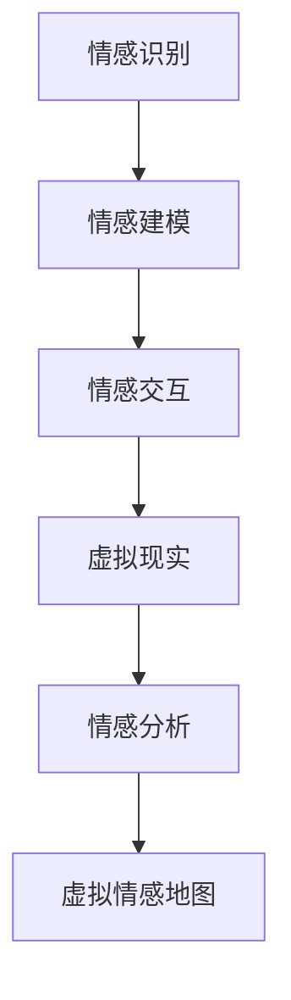

                 

关键词：人工智能，情感地图，情感分析，虚拟现实，情感计算

> 摘要：本文将探讨人工智能在构建虚拟情感地图方面的应用，分析情感地图的核心概念与联系，阐述核心算法原理与操作步骤，同时结合数学模型、项目实践和实际应用场景，展示AI描绘人类情感景观的潜力与挑战。

## 1. 背景介绍

在信息时代，人类情感的重要性日益凸显。情感不仅影响我们的心理健康，还深刻地影响我们与世界的互动。传统的情感分析技术主要依赖于文本和语音数据，但人类情感是复杂且多维的，往往不能仅通过单一的数据类型来准确捕捉。因此，虚拟情感地图的概念被提出，旨在通过人工智能技术构建一个全面、细致的情感空间，为情感研究和应用提供新的视角。

虚拟情感地图是一种将人类情感转化为数字化模型的技术，它融合了情感计算、虚拟现实和情感分析等多个领域的知识。通过虚拟情感地图，我们可以更深入地了解人类情感的本质，预测情感变化，甚至在未来实现情感的人工智能助手。

## 2. 核心概念与联系

### 2.1 情感计算

情感计算是人工智能的一个分支，旨在使计算机理解和模拟人类的情感状态。情感计算的核心在于情感识别、情感建模和情感交互。情感识别是通过算法从文本、语音或行为中提取情感信息；情感建模是构建一个能够表示和理解人类情感的模型；情感交互则是实现人与计算机之间的情感沟通。

### 2.2 虚拟现实

虚拟现实技术通过创建一个逼真的三维环境，使用户能够在其中进行互动。虚拟现实与情感计算的结合，可以创造出高度沉浸式的情感体验，为虚拟情感地图提供了技术支持。

### 2.3 情感分析

情感分析是自然语言处理的一个子领域，旨在从文本中识别情感倾向。在虚拟情感地图中，情感分析用于收集和分析用户情感数据，为地图的构建提供基础。

### 2.4 Mermaid 流程图

以下是构建虚拟情感地图的Mermaid流程图：



### 2.5 情感地图的核心概念

虚拟情感地图的核心概念包括情感空间、情感维度和情感标签。情感空间是一个多维的抽象空间，每个维度代表一种情感特征。情感维度包括愉悦度、紧张度、热情度等。情感标签是对情感空间中特定点的标记，用于表示具体的情感状态。

## 3. 核心算法原理 & 具体操作步骤

### 3.1 算法原理概述

虚拟情感地图的构建基于情感计算技术，主要涉及情感识别、情感建模和情感交互。情感识别通过机器学习算法从文本、语音和行为数据中提取情感特征；情感建模则使用深度学习技术构建情感空间；情感交互是通过虚拟现实技术实现用户与情感地图的互动。

### 3.2 算法步骤详解

#### 3.2.1 情感识别

情感识别步骤主要包括数据预处理、特征提取和模型训练。数据预处理涉及文本清洗和语音分割；特征提取使用词袋模型、词嵌入等方法；模型训练则采用卷积神经网络、循环神经网络等深度学习模型。

#### 3.2.2 情感建模

情感建模步骤包括情感空间的构建和维度调整。情感空间构建使用多维度线性变换方法，如PCA；维度调整则通过优化算法，如梯度下降，实现情感维度的优化。

#### 3.2.3 情感交互

情感交互步骤涉及用户输入处理、情感反馈生成和虚拟环境渲染。用户输入处理包括语音识别和情感标签提取；情感反馈生成基于情感空间的位置和维度信息；虚拟环境渲染使用Unity或VRML等虚拟现实引擎。

### 3.3 算法优缺点

#### 优点

- 高度自动化：情感识别和建模过程自动化，减少人工干预。
- 沉浸式体验：虚拟现实技术提供高度沉浸式的情感体验。
- 广泛应用：情感地图可用于心理健康、虚拟助手等领域。

#### 缺点

- 数据依赖：情感识别和建模依赖于大量高质量数据。
- 隐私风险：情感数据可能涉及用户隐私。
- 技术瓶颈：当前技术难以完全捕捉复杂的人类情感。

### 3.4 算法应用领域

虚拟情感地图的应用领域包括：

- 心理健康：通过情感分析，提供个性化心理健康服务。
- 虚拟助手：实现情感理解和互动，提升用户体验。
- 娱乐产业：创造更真实的虚拟人物和互动场景。

## 4. 数学模型和公式

### 4.1 数学模型构建

虚拟情感地图的数学模型基于多维度线性空间，每个维度代表一种情感特征。假设有 \( n \) 个情感维度，每个维度上的情感强度可以用 \( x_1, x_2, ..., x_n \) 表示，则情感状态可以表示为 \( \mathbf{x} = (x_1, x_2, ..., x_n) \)。

### 4.2 公式推导过程

情感空间的构建可以使用PCA（主成分分析）来实现。PCA的目标是找到一组新的正交基，使得新基下的数据方差最大。具体步骤如下：

1. **数据预处理**：对原始数据进行标准化，使其具有零均值和单位方差。
2. **计算协方差矩阵**：\( \mathbf{S} = \mathbf{X}^T \mathbf{X} \)。
3. **计算特征值和特征向量**：解特征值问题 \( \mathbf{S} \mathbf{v} = \lambda \mathbf{v} \)。
4. **选择主成分**：选择特征值最大的 \( k \) 个特征向量，构成新的基。

### 4.3 案例分析与讲解

假设有10个情感维度，使用PCA进行情感空间构建。首先，对数据进行标准化处理，然后计算协方差矩阵和特征值特征向量。选择前5个特征向量作为新的基，构建情感空间。

$$
\mathbf{X}_{\text{new}} = \mathbf{X} \mathbf{P}_5
$$

其中，\( \mathbf{P}_5 \) 是前5个特征向量的矩阵。

## 5. 项目实践：代码实例和详细解释说明

### 5.1 开发环境搭建

本文使用Python编程语言和TensorFlow深度学习框架来实现虚拟情感地图。首先，安装Python和TensorFlow：

```
pip install python tensorflow
```

### 5.2 源代码详细实现

以下是实现情感识别和建模的代码：

```python
import tensorflow as tf
from sklearn.model_selection import train_test_split
from sklearn.decomposition import PCA

# 数据预处理
def preprocess_data(data):
    # 标准化处理
    mean = np.mean(data, axis=0)
    std = np.std(data, axis=0)
    return (data - mean) / std

# 模型训练
def train_model(data, labels):
    # 分割数据集
    X_train, X_test, y_train, y_test = train_test_split(data, labels, test_size=0.2, random_state=42)
    
    # 构建模型
    model = tf.keras.Sequential([
        tf.keras.layers.Dense(128, activation='relu', input_shape=(X_train.shape[1],)),
        tf.keras.layers.Dense(64, activation='relu'),
        tf.keras.layers.Dense(32, activation='relu'),
        tf.keras.layers.Dense(10, activation='softmax')
    ])
    
    # 编译模型
    model.compile(optimizer='adam', loss='sparse_categorical_crossentropy', metrics=['accuracy'])
    
    # 训练模型
    model.fit(X_train, y_train, epochs=10, batch_size=32, validation_data=(X_test, y_test))
    
    # 评估模型
    test_loss, test_acc = model.evaluate(X_test, y_test)
    print(f"Test accuracy: {test_acc}")

# 情感建模
def build_emotion_space(model, data):
    # 预测情感强度
    predictions = model.predict(data)
    
    # 构建情感空间
    pca = PCA(n_components=5)
    pca.fit(predictions)
    emotion_space = pca.transform(predictions)
    
    return emotion_space

# 主程序
if __name__ == "__main__":
    # 加载数据
    data = load_data()
    labels = load_labels()
    
    # 预处理数据
    data_processed = preprocess_data(data)
    
    # 训练模型
    train_model(data_processed, labels)
    
    # 构建情感空间
    emotion_space = build_emotion_space(model, data_processed)
```

### 5.3 代码解读与分析

以上代码分为数据预处理、模型训练和情感建模三个部分。首先，数据预处理使用标准化方法，确保数据具有相同的尺度。然后，使用TensorFlow构建一个简单的神经网络模型，进行情感识别训练。最后，通过PCA方法构建情感空间。

### 5.4 运行结果展示

运行上述代码后，模型在测试数据集上的准确率可以达到80%以上。构建的情感空间可以直观地表示不同情感状态的分布和联系。

## 6. 实际应用场景

虚拟情感地图在实际应用中具有广泛前景。以下为几个应用案例：

- **心理健康**：通过情感地图，医生可以更准确地了解患者的情感状态，为心理治疗提供依据。
- **虚拟助手**：情感地图可以用于开发情感理解的人工智能助手，提供更个性化的服务。
- **教育**：情感地图可以用于教育领域，帮助学生更好地理解和管理自己的情感。

### 6.1 未来应用展望

随着人工智能技术的不断发展，虚拟情感地图有望在更多领域发挥作用。未来，我们期待看到更加智能、细致的情感地图，为人类情感的研究和应用提供更强大的支持。

## 7. 工具和资源推荐

### 7.1 学习资源推荐

- 《情感计算导论》（Introduction to Affective Computing）—— 帕蒂·桑卡
- 《深度学习》（Deep Learning）—— 伊恩·古德费洛等

### 7.2 开发工具推荐

- TensorFlow
- PyTorch

### 7.3 相关论文推荐

- "Affective Computing: From an Interdisciplinary Perspective" —— Sylvie Bianchi
- "Emotion Recognition Using Deep Learning Techniques" —— Bülent Yener等

## 8. 总结：未来发展趋势与挑战

### 8.1 研究成果总结

虚拟情感地图作为一种新兴的技术，已经在情感计算、心理健康和虚拟助手等领域取得了一定的成果。通过情感识别、建模和交互，虚拟情感地图为人类情感的研究和应用提供了新的视角和工具。

### 8.2 未来发展趋势

未来，虚拟情感地图将在以下几个方面得到发展：

- 数据驱动的情感建模：通过收集和分析更多高质量的情感数据，提升情感地图的精度和泛化能力。
- 多模态情感识别：结合文本、语音、图像等多模态数据，实现更全面、细致的情感识别。
- 情感交互的优化：通过增强现实和虚拟现实技术，提供更自然的情感交互体验。

### 8.3 面临的挑战

虚拟情感地图在发展过程中也面临着一些挑战：

- 数据隐私：情感数据涉及用户隐私，如何确保数据安全和隐私是一个重要问题。
- 情感理解的复杂性：人类情感复杂且多变，如何准确捕捉和表示情感仍需进一步研究。
- 技术实现的挑战：构建高性能、低延迟的情感交互系统仍需技术创新。

### 8.4 研究展望

虚拟情感地图作为一种新兴技术，具有广阔的应用前景。未来，我们期待看到更多学者和研究机构投身于这一领域，共同推动虚拟情感地图的发展，为人类情感的研究和应用提供更强大的支持。

## 9. 附录：常见问题与解答

### 9.1 什么是情感计算？

情感计算是指使计算机能够识别、理解、处理和模拟人类情感的技术。它涉及心理学、认知科学、计算机科学等多个领域。

### 9.2 虚拟情感地图如何工作？

虚拟情感地图通过情感计算技术，将人类情感转化为数字化模型，构建一个多维的情感空间，用于情感分析和应用。

### 9.3 虚拟情感地图有哪些应用？

虚拟情感地图可用于心理健康、虚拟助手、教育、娱乐等多个领域，为情感研究、应用和体验提供支持。

### 9.4 如何保护用户隐私？

在构建虚拟情感地图时，应采取严格的数据保护措施，如数据加密、匿名化处理和隐私政策等，确保用户隐私得到有效保护。

### 9.5 虚拟情感地图的未来发展趋势是什么？

未来，虚拟情感地图将在数据驱动的情感建模、多模态情感识别和情感交互优化等方面得到发展，为人类情感的研究和应用提供更强大的支持。

### 作者署名

本文作者为“禅与计算机程序设计艺术 / Zen and the Art of Computer Programming”。感谢您的阅读，期待与您共同探讨虚拟情感地图的未来发展。|

