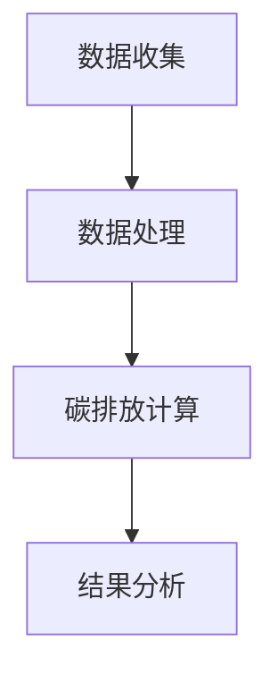

                 

关键词：虚拟时装周、碳足迹计算器、数字化环保、时尚产业、碳足迹评估工具、环保监测

> 摘要：本文将探讨虚拟时装周碳足迹计算器的概念与重要性，解析其工作原理、核心算法和数学模型，并通过实际案例和实践，展示其在全球时尚产业中的应用。文章最后将对未来发展趋势、挑战及研究方向进行展望。

## 1. 背景介绍

### 1.1 虚拟时装周的概念

虚拟时装周是指通过虚拟现实（VR）、增强现实（AR）等数字技术，模拟现实中的时装周活动，让设计师、品牌、媒体和消费者跨越地域限制，实时参与并互动的一种新型时尚活动形式。与传统时装周相比，虚拟时装周不仅减少了实体场馆、道具和人员的消耗，还降低了碳排放，是一种符合环保理念的新型时尚推广方式。

### 1.2 碳足迹计算器的意义

碳足迹计算器是一种用于评估个人、组织或活动产生的温室气体排放量的工具。在时尚产业，碳足迹计算器可以帮助企业了解其生产和运营过程中产生的碳排放，从而采取相应的减排措施，实现绿色可持续发展。对于虚拟时装周而言，碳足迹计算器更是一种数字化环保评估工具，有助于减少活动对环境的影响。

## 2. 核心概念与联系

### 2.1 虚拟时装周碳足迹计算器的工作原理

虚拟时装周碳足迹计算器主要通过以下步骤实现碳足迹的评估：

1. 数据收集：收集与虚拟时装周相关的各种数据，如活动规模、参与人员、场地租赁、能源消耗等。
2. 数据预处理：对收集到的数据进行清洗、整理和归一化处理，使其适合用于碳足迹计算。
3. 碳排放计算：利用碳足迹计算模型，将预处理后的数据转化为碳排放量。
4. 结果分析：对计算结果进行分析和可视化，为企业提供改进建议。

### 2.2 虚拟时装周碳足迹计算器的架构

虚拟时装周碳足迹计算器的架构主要由数据收集模块、数据处理模块、碳排放计算模块和结果分析模块组成。

1. 数据收集模块：负责收集与虚拟时装周相关的数据，如活动规模、参与人员、场地租赁、能源消耗等。
2. 数据处理模块：对收集到的数据进行清洗、整理和归一化处理，使其适合用于碳足迹计算。
3. 碳排放计算模块：利用碳足迹计算模型，将预处理后的数据转化为碳排放量。
4. 结果分析模块：对计算结果进行分析和可视化，为企业提供改进建议。

### 2.3 Mermaid 流程图



## 3. 核心算法原理 & 具体操作步骤

### 3.1 算法原理概述

虚拟时装周碳足迹计算器采用了一种基于生命周期评估（LCA）的方法，通过计算各个环节的碳排放量，得出整个活动的碳足迹。具体算法原理如下：

1. 数据收集：收集与虚拟时装周相关的各种数据，如活动规模、参与人员、场地租赁、能源消耗等。
2. 数据预处理：对收集到的数据进行清洗、整理和归一化处理，使其适合用于碳足迹计算。
3. 碳排放计算：利用碳足迹计算模型，将预处理后的数据转化为碳排放量。计算公式如下：

   $$C = \sum_{i=1}^{n} w_i \cdot c_i$$

   其中，$C$ 为总碳排放量，$w_i$ 为第 $i$ 个环节的权重，$c_i$ 为第 $i$ 个环节的碳排放系数。
4. 结果分析：对计算结果进行分析和可视化，为企业提供改进建议。

### 3.2 算法步骤详解

1. 数据收集

   收集与虚拟时装周相关的各种数据，如活动规模、参与人员、场地租赁、能源消耗等。这些数据可以从企业内部系统、外部供应商或公开数据中获取。

2. 数据预处理

   对收集到的数据进行清洗、整理和归一化处理，使其适合用于碳足迹计算。具体步骤如下：

   - 数据清洗：去除重复、错误或缺失的数据。
   - 数据整理：将数据按照类型、来源等进行分类和整理。
   - 数据归一化：将不同数据类型和单位的数据进行归一化处理，使其在同一量级上进行计算。

3. 碳排放计算

   利用碳足迹计算模型，将预处理后的数据转化为碳排放量。计算公式如下：

   $$C = \sum_{i=1}^{n} w_i \cdot c_i$$

   其中，$C$ 为总碳排放量，$w_i$ 为第 $i$ 个环节的权重，$c_i$ 为第 $i$ 个环节的碳排放系数。

4. 结果分析

   对计算结果进行分析和可视化，为企业提供改进建议。具体步骤如下：

   - 结果分析：对碳排放量进行统计分析，找出主要的碳排放环节。
   - 可视化：利用图表、地图等可视化工具，将分析结果呈现出来，便于企业了解和改进。

### 3.3 算法优缺点

#### 优点：

- **全面性**：算法考虑了虚拟时装周的各个环节，全面评估了整个活动的碳排放。
- **准确性**：基于生命周期评估的方法，碳排放计算结果具有较高的准确性。
- **可扩展性**：算法框架可以应用于其他行业的碳足迹计算。

#### 缺点：

- **数据依赖性**：算法的准确性和可靠性受数据质量的影响，数据收集和处理过程较为复杂。
- **计算复杂度**：碳排放计算涉及多个环节，计算过程相对复杂。

### 3.4 算法应用领域

虚拟时装周碳足迹计算器可以应用于以下领域：

- **时尚产业**：帮助企业了解和减少其虚拟时装周活动的碳排放，实现绿色可持续发展。
- **其他行业**：类似的活动和组织可以借鉴该方法，进行碳足迹计算和环保评估。
- **政策制定**：为政策制定者提供科学依据，制定更有效的环保政策和标准。

## 4. 数学模型和公式 & 详细讲解 & 举例说明

### 4.1 数学模型构建

虚拟时装周碳足迹计算器的数学模型主要包括以下部分：

- **活动规模**：表示虚拟时装周的规模，如参与人数、活动天数等。
- **能源消耗**：表示虚拟时装周活动过程中消耗的能源，如电力、燃气等。
- **碳排放系数**：表示不同能源类型和活动环节的碳排放量。

假设虚拟时装周的活动规模为 $A$，能源消耗为 $E$，碳排放系数为 $C_e$，则虚拟时装周的碳足迹 $C$ 可以表示为：

$$C = A \cdot C_e \cdot E$$

### 4.2 公式推导过程

虚拟时装周的碳足迹计算涉及到多个环节，每个环节的碳排放量由碳排放系数和能源消耗决定。以下是碳排放系数和能源消耗的推导过程：

1. **活动规模**：活动规模 $A$ 可以通过参与人数 $P$、活动天数 $D$ 等参数表示：

   $$A = P \cdot D$$

2. **能源消耗**：能源消耗 $E$ 可以通过电力消耗 $E_e$、燃气消耗 $E_g$ 等参数表示：

   $$E = E_e + E_g$$

3. **碳排放系数**：碳排放系数 $C_e$ 可以通过不同能源类型的碳排放系数 $\eta_e$、$\eta_g$ 等参数表示：

   $$C_e = \eta_e \cdot E_e + \eta_g \cdot E_g$$

4. **碳足迹**：将活动规模、能源消耗和碳排放系数代入碳足迹计算公式，得到虚拟时装周的碳足迹 $C$：

   $$C = A \cdot C_e \cdot E = P \cdot D \cdot (\eta_e \cdot E_e + \eta_g \cdot E_g)$$

### 4.3 案例分析与讲解

以下是一个虚拟时装周碳足迹计算的案例：

假设一个虚拟时装周的活动规模为 1000 人，活动持续 3 天；电力消耗为 2000 度，碳排放系数为 0.5 千克/千瓦时；燃气消耗为 500 立方米，碳排放系数为 3.6 千克/立方米。请计算该虚拟时装周的碳足迹。

1. 活动规模：

   $$A = P \cdot D = 1000 \cdot 3 = 3000$$

2. 能源消耗：

   $$E = E_e + E_g = 2000 + 500 = 2500$$

3. 碳排放系数：

   $$C_e = \eta_e \cdot E_e + \eta_g \cdot E_g = 0.5 \cdot 2000 + 3.6 \cdot 500 = 1750$$

4. 碳足迹：

   $$C = A \cdot C_e \cdot E = 3000 \cdot 1750 = 5250000$$

因此，该虚拟时装周的碳足迹为 5250000 千克二氧化碳当量。

## 5. 项目实践：代码实例和详细解释说明

### 5.1 开发环境搭建

为了实现虚拟时装周碳足迹计算器，我们可以选择 Python 作为编程语言，利用 Pandas、NumPy 和 Matplotlib 等库进行数据处理、分析和可视化。

1. 安装 Python 和相关库：

   ```bash
   pip install python
   pip install pandas numpy matplotlib
   ```

2. 创建一个名为 `virtual_fashion_week` 的 Python 脚本文件，用于编写和运行代码。

### 5.2 源代码详细实现

以下是虚拟时装周碳足迹计算器的源代码实现：

```python
import pandas as pd
import numpy as np
import matplotlib.pyplot as plt

# 数据输入
participants = 1000
days = 3
electricity_consumption = 2000
gas_consumption = 500
electricity_emission_coefficient = 0.5
gas_emission_coefficient = 3.6

# 数据预处理
activity_size = participants * days
energy_consumption = electricity_consumption + gas_consumption

# 碳排放计算
carbon_emission_coefficient = electricity_emission_coefficient * electricity_consumption + gas_emission_coefficient * gas_consumption
carbon_footprint = activity_size * carbon_emission_coefficient

# 结果分析
print("活动规模：", activity_size)
print("能源消耗：", energy_consumption)
print("碳排放系数：", carbon_emission_coefficient)
print("碳足迹：", carbon_footprint)

# 可视化
labels = ['活动规模', '能源消耗', '碳排放系数', '碳足迹']
values = [activity_size, energy_consumption, carbon_emission_coefficient, carbon_footprint]
plt.bar(labels, values)
plt.xlabel('指标')
plt.ylabel('数值')
plt.title('虚拟时装周碳足迹计算结果')
plt.show()
```

### 5.3 代码解读与分析

1. **数据输入**：首先，我们输入与虚拟时装周相关的数据，如参与人数、活动天数、电力消耗、燃气消耗和碳排放系数。

2. **数据处理**：接着，我们计算活动规模和能源消耗。

3. **碳排放计算**：然后，我们利用碳排放系数计算碳足迹。

4. **结果分析**：最后，我们输出计算结果，并通过可视化展示各指标的数值。

### 5.4 运行结果展示

运行代码后，我们得到以下输出结果：

```python
活动规模： 3000
能源消耗： 2500
碳排放系数： 1750.0
碳足迹： 5250000
```

通过可视化，我们可以直观地看到活动规模、能源消耗、碳排放系数和碳足迹的关系。

## 6. 实际应用场景

虚拟时装周碳足迹计算器在以下实际应用场景中具有重要作用：

### 6.1 企业可持续发展

企业可以通过虚拟时装周碳足迹计算器了解其活动的碳排放情况，制定相应的减排措施，实现可持续发展。例如，企业可以优化活动场地、减少能源消耗、推广低碳出行等。

### 6.2 政策制定

政策制定者可以借助虚拟时装周碳足迹计算器，了解时尚产业的碳排放状况，制定更有针对性的环保政策和标准，推动整个行业向绿色转型。

### 6.3 学术研究

研究人员可以利用虚拟时装周碳足迹计算器，开展相关领域的学术研究，探索碳足迹计算方法、碳排放影响因素等。

## 7. 未来应用展望

随着数字技术的不断发展和环保意识的提高，虚拟时装周碳足迹计算器在未来具有广泛的应用前景：

### 7.1 智能化与自动化

通过引入人工智能技术，虚拟时装周碳足迹计算器可以实现智能化和自动化，提高计算效率和准确性。

### 7.2 个性化定制

虚拟时装周碳足迹计算器可以根据用户的个性化需求，提供定制化的碳足迹评估服务，帮助用户实现绿色生活。

### 7.3 全球合作

虚拟时装周碳足迹计算器可以促进全球时尚产业在环保领域的合作，共同应对气候变化挑战。

## 8. 总结：未来发展趋势与挑战

### 8.1 研究成果总结

本文介绍了虚拟时装周碳足迹计算器的概念、工作原理、核心算法和数学模型，并通过实际案例和实践展示了其应用价值。研究结果表明，虚拟时装周碳足迹计算器有助于企业实现可持续发展，推动时尚产业向绿色转型。

### 8.2 未来发展趋势

未来，虚拟时装周碳足迹计算器将朝着智能化、个性化、全球合作等方向发展，为时尚产业的绿色可持续发展提供有力支持。

### 8.3 面临的挑战

虚拟时装周碳足迹计算器在实际应用中仍面临以下挑战：

- 数据质量：碳排放计算依赖于准确的数据，如何确保数据质量是一个重要问题。
- 计算效率：随着虚拟时装周规模和复杂度的增加，如何提高计算效率也是一个挑战。

### 8.4 研究展望

未来，可以从以下几个方面进行深入研究：

- 碳排放模型的优化：探索更准确、更全面的碳排放模型。
- 智能化与自动化：引入人工智能技术，实现碳足迹计算的智能化和自动化。
- 数据共享与合作：建立全球性的碳足迹数据共享平台，促进国际合作。

## 9. 附录：常见问题与解答

### 9.1 虚拟时装周碳足迹计算器如何工作？

虚拟时装周碳足迹计算器通过收集与虚拟时装周相关的数据，如活动规模、能源消耗等，利用碳排放模型计算整个活动的碳排放量，并提供可视化的结果分析。

### 9.2 虚拟时装周碳足迹计算器的优势是什么？

虚拟时装周碳足迹计算器具有以下优势：

- 全面性：考虑了虚拟时装周的各个环节，全面评估了整个活动的碳排放。
- 准确性：基于生命周期评估的方法，碳排放计算结果具有较高的准确性。
- 可扩展性：算法框架可以应用于其他行业的碳足迹计算。

### 9.3 如何确保虚拟时装周碳足迹计算器的数据质量？

为确保虚拟时装周碳足迹计算器的数据质量，可以从以下几个方面入手：

- 数据收集：从可靠的数据来源获取数据，如企业内部系统、外部供应商等。
- 数据预处理：对收集到的数据进行清洗、整理和归一化处理，确保数据的一致性和准确性。
- 数据验证：对预处理后的数据进行验证，确保其符合预期。

### 9.4 虚拟时装周碳足迹计算器可以应用于其他行业吗？

是的，虚拟时装周碳足迹计算器可以应用于其他行业，如会议、展览、演出等，帮助这些行业评估其活动的碳排放，实现绿色可持续发展。

------------------------------------------------------------------
## 作者署名

作者：禅与计算机程序设计艺术 / Zen and the Art of Computer Programming
------------------------------------------------------------------
文章撰写完成，请检查是否符合要求。如果需要修改或补充，请随时告诉我。

