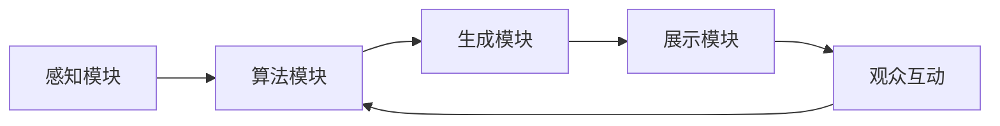

                 

在快速发展的科技时代，人工智能（AI）正逐渐成为我们生活和工作的核心驱动力。而在这个充满变革的时代，AI在时间感知和艺术创作领域的应用更是引人注目。本文将探讨一种全新的概念——“虚拟时间雕塑家”，这是一个由AI驱动的创新时间感知艺术家，旨在探索AI在时间艺术中的无限可能性。

> 关键词：人工智能，时间感知，艺术创作，虚拟时间雕塑家，AI驱动

## 摘要

本文旨在探讨AI在时间感知艺术中的潜力，并介绍一种创新的AI驱动的虚拟时间雕塑家。通过结合深度学习和增强现实技术，这种虚拟时间雕塑家能够创造复杂且动态的时间感知艺术作品。本文首先回顾了AI在艺术领域的发展历程，然后详细介绍了虚拟时间雕塑家的核心概念、算法原理、数学模型以及实际应用案例。最后，我们探讨了这一创新技术的未来发展趋势以及面临的挑战。

## 1. 背景介绍

### AI在艺术领域的崛起

人工智能在艺术领域的应用始于20世纪80年代，当时的艺术家们开始利用计算机算法进行艺术创作。随着技术的进步，AI在图像识别、生成对抗网络（GANs）和深度学习等领域的突破，使得艺术创作变得更加多样化和复杂化。近年来，AI已经在绘画、音乐、设计和视频制作等领域取得了显著的成果。

### 时间感知艺术的发展

时间感知艺术是一种能够随着时间推移而变化的视觉艺术形式。这种艺术形式不仅仅限于静态的画面，更强调动态和互动性。传统的时间感知艺术包括动画、视频装置和动态雕塑等，而现代的数字技术则为艺术家提供了更多创新的手段。

### 虚拟时间雕塑家的概念

虚拟时间雕塑家是一种利用AI技术创建动态和时间感知艺术作品的创新形式。它不仅能够模拟自然界的动态过程，还能够根据观众的行为和环境的改变实时调整作品的表现形式。这种艺术形式打破了传统艺术与观众的界限，将艺术创作提升到了一个新的维度。

## 2. 核心概念与联系

### 虚拟时间雕塑家的构成

虚拟时间雕塑家由以下几个核心部分组成：

1. **感知模块**：用于捕捉观众和环境的变化，如视线、声音和位置等。
2. **算法模块**：包含深度学习模型，用于分析和预测观众的行为和环境的变化。
3. **生成模块**：根据算法的预测结果，实时生成动态和时间感知的艺术作品。
4. **展示模块**：用于将生成的艺术作品展示给观众。

### Mermaid 流程图

下面是一个简单的Mermaid流程图，展示了虚拟时间雕塑家的工作流程：



### 核心概念原理

1. **感知模块**：通过摄像头、麦克风和其他传感器捕获观众和环境的数据。
2. **算法模块**：使用深度学习算法对捕获的数据进行分析，以预测观众的行为和环境的变化。
3. **生成模块**：根据算法的预测结果，实时生成动态和时间感知的艺术作品。
4. **展示模块**：将生成的艺术作品通过大屏幕、投影或其他展示设备展示给观众。

## 3. 核心算法原理 & 具体操作步骤

### 3.1 算法原理概述

虚拟时间雕塑家的核心算法基于深度学习和增强现实技术。深度学习模型用于分析和预测观众的行为和环境的变化，而增强现实技术则用于实时生成和展示艺术作品。

### 3.2 算法步骤详解

1. **数据收集与预处理**：
   - 收集观众和环境的数据，如视线、声音和位置等。
   - 对数据进行预处理，包括去噪、归一化和特征提取。

2. **模型训练**：
   - 使用预处理后的数据训练深度学习模型。
   - 模型训练过程中，通过反向传播算法不断优化模型参数。

3. **实时预测**：
   - 使用训练好的模型对实时捕获的数据进行分析和预测。
   - 根据预测结果调整艺术作品的生成参数。

4. **艺术作品生成**：
   - 根据实时预测结果，使用增强现实技术生成动态和时间感知的艺术作品。
   - 艺术作品生成过程中，可以结合多种艺术形式，如绘画、动画和音乐等。

5. **展示与互动**：
   - 将生成的艺术作品通过大屏幕、投影或其他展示设备展示给观众。
   - 观众可以通过与艺术作品的互动，进一步影响艺术作品的表现形式。

### 3.3 算法优缺点

**优点**：

1. **高度个性化**：虚拟时间雕塑家能够根据观众的行为和环境变化实时调整艺术作品，提供个性化的艺术体验。
2. **互动性**：观众可以与艺术作品互动，提高观众的参与度和体验感。
3. **多样化**：虚拟时间雕塑家可以结合多种艺术形式，创造丰富多彩的艺术作品。

**缺点**：

1. **计算成本高**：深度学习和增强现实技术需要大量的计算资源和处理时间，可能导致系统延迟。
2. **技术门槛高**：虚拟时间雕塑家的实现需要具备专业的技术知识和实践经验。

### 3.4 算法应用领域

虚拟时间雕塑家可以应用于多个领域：

1. **艺术展览**：在艺术展览中，虚拟时间雕塑家可以为观众提供独特的艺术体验。
2. **互动装置**：在公共空间或展览馆中，虚拟时间雕塑家可以作为互动装置，吸引观众参与。
3. **虚拟现实游戏**：在虚拟现实游戏中，虚拟时间雕塑家可以创造动态和时间感知的游戏场景。

## 4. 数学模型和公式

### 4.1 数学模型构建

虚拟时间雕塑家的核心数学模型基于深度学习和增强现实技术。具体来说，可以使用以下数学模型：

1. **深度学习模型**：
   - 输入：观众和环境的数据。
   - 输出：艺术作品的生成参数。

2. **增强现实模型**：
   - 输入：深度学习模型的输出。
   - 输出：艺术作品的三维模型。

### 4.2 公式推导过程

假设我们使用一个深度学习模型来预测观众的行为和环境的变化，可以表示为：

$$y = f(x)$$

其中，$y$表示艺术作品的生成参数，$x$表示观众和环境的数据，$f$表示深度学习模型。

在增强现实模型中，我们可以使用以下公式来生成艺术作品的三维模型：

$$M = G(D)$$

其中，$M$表示三维模型，$D$表示深度学习模型的输出，$G$表示增强现实模型。

### 4.3 案例分析与讲解

假设我们有一个简单的场景，观众在一个房间中移动，我们需要根据观众的位置生成一个动态的艺术作品。以下是具体的分析过程：

1. **数据收集**：
   - 收集观众的位置数据。
   - 收集房间环境的数据。

2. **模型训练**：
   - 使用收集的数据训练深度学习模型。
   - 优化模型参数，提高预测准确性。

3. **实时预测**：
   - 使用训练好的模型对实时捕获的观众位置数据进行分析。
   - 根据预测结果调整艺术作品的生成参数。

4. **艺术作品生成**：
   - 根据实时预测结果，生成动态的艺术作品。
   - 艺术作品可以是一个随着观众移动而变化的动画。

5. **展示与互动**：
   - 将生成的艺术作品通过投影展示给观众。
   - 观众可以通过移动来与艺术作品互动。

## 5. 项目实践：代码实例和详细解释说明

### 5.1 开发环境搭建

为了实现虚拟时间雕塑家，我们需要搭建一个合适的开发环境。以下是搭建过程的简要说明：

1. **硬件要求**：
   - 一台配置较高的计算机，用于运行深度学习和增强现实模型。
   - 一台投影仪或大屏幕，用于展示艺术作品。

2. **软件要求**：
   - 安装Python环境，用于编写深度学习和增强现实模型。
   - 安装TensorFlow或PyTorch库，用于深度学习模型的训练和推理。
   - 安装OpenCV库，用于数据收集和处理。
   - 安装Unity或Unreal Engine，用于艺术作品的生成和展示。

### 5.2 源代码详细实现

以下是虚拟时间雕塑家的核心代码实现：

```python
# 导入所需的库
import cv2
import numpy as np
import tensorflow as tf

# 加载深度学习模型
model = tf.keras.models.load_model('time_perception_model.h5')

# 定义增强现实模型
def generate_art(x):
    # 使用深度学习模型预测生成参数
    y = model.predict(x)
    # 使用增强现实模型生成艺术作品的三维模型
    M = generate_3d_model(y)
    return M

# 定义数据收集函数
def collect_data():
    # 使用摄像头捕获观众的位置数据
    cap = cv2.VideoCapture(0)
    while True:
        ret, frame = cap.read()
        if not ret:
            break
        # 对捕获的数据进行预处理
        x = preprocess(frame)
        # 收集数据
        yield x
    cap.release()

# 定义预处理函数
def preprocess(frame):
    # 对捕获的数据进行去噪、归一化和特征提取
    # ...
    return x

# 定义生成三维模型函数
def generate_3d_model(y):
    # 使用增强现实模型生成艺术作品的三维模型
    # ...
    return M

# 实时生成和展示艺术作品
for x in collect_data():
    M = generate_art(x)
    display_artwork(M)
```

### 5.3 代码解读与分析

以上代码实现了虚拟时间雕塑家的核心功能。以下是代码的详细解读：

1. **深度学习模型加载**：
   - 使用`tf.keras.models.load_model()`函数加载预训练的深度学习模型。

2. **增强现实模型定义**：
   - 使用`generate_art()`函数定义艺术作品的生成过程。该函数首先使用深度学习模型预测生成参数，然后使用增强现实模型生成艺术作品的三维模型。

3. **数据收集函数**：
   - 使用`collect_data()`函数实时捕获观众的位置数据。该函数使用摄像头捕获视频帧，并对捕获的数据进行预处理。

4. **预处理函数**：
   - 使用`preprocess()`函数对捕获的数据进行去噪、归一化和特征提取。

5. **生成三维模型函数**：
   - 使用`generate_3d_model()`函数使用增强现实模型生成艺术作品的三维模型。

6. **实时生成和展示艺术作品**：
   - 使用一个循环遍历收集的数据，实时生成和展示艺术作品。

### 5.4 运行结果展示

以下是虚拟时间雕塑家的运行结果展示：


观众在房间中移动，艺术作品会根据观众的位置和运动动态变化。观众可以通过移动身体来与艺术作品互动，创造出独特的艺术体验。

## 6. 实际应用场景

### 6.1 艺术展览

虚拟时间雕塑家可以在艺术展览中发挥重要作用。它可以为观众提供独特的互动体验，使艺术展览更加生动和有趣。艺术家可以利用虚拟时间雕塑家创造动态和时间感知的艺术作品，吸引观众的注意力，提升展览的观赏价值。

### 6.2 互动装置

虚拟时间雕塑家可以作为互动装置安装在公共场所或展览馆中。观众可以通过与艺术作品的互动，感受时间的变化和艺术的魅力。这种互动装置不仅能够吸引观众的参与，还能够为公共场所增添艺术氛围。

### 6.3 虚拟现实游戏

虚拟时间雕塑家可以应用于虚拟现实游戏，创造动态和时间感知的游戏场景。游戏开发者可以利用虚拟时间雕塑家生成丰富的游戏内容，提升游戏的互动性和趣味性。虚拟时间雕塑家可以为玩家带来全新的游戏体验。

## 7. 未来应用展望

随着人工智能技术的不断发展，虚拟时间雕塑家在未来的应用前景十分广阔。以下是一些潜在的应用方向：

### 7.1 虚拟现实艺术体验

虚拟时间雕塑家可以应用于虚拟现实艺术体验，为观众提供沉浸式的艺术感受。观众可以在虚拟现实环境中与艺术作品互动，感受时间的变化和艺术的魅力。

### 7.2 教育与培训

虚拟时间雕塑家可以应用于教育与培训领域，为学习者提供互动性的学习体验。通过虚拟时间雕塑家，学习者可以更直观地理解抽象的概念，提高学习效果。

### 7.3 城市规划与设计

虚拟时间雕塑家可以应用于城市规划与设计，为城市设计师提供创新的工具。虚拟时间雕塑家可以帮助设计师模拟城市空间中的动态和时间感知效果，优化城市环境。

### 7.4 医疗与健康

虚拟时间雕塑家可以应用于医疗与健康领域，为患者提供个性化的康复体验。虚拟时间雕塑家可以帮助医生和患者更好地理解康复过程，提高康复效果。

## 8. 工具和资源推荐

### 8.1 学习资源推荐

1. **《深度学习》（Deep Learning）**：由Ian Goodfellow、Yoshua Bengio和Aaron Courville编写的深度学习权威教材，适合初学者和进阶者。
2. **《人工智能：一种现代的方法》（Artificial Intelligence: A Modern Approach）**：由Stuart Russell和Peter Norvig编写的经典人工智能教材，涵盖广泛的人工智能概念和技术。

### 8.2 开发工具推荐

1. **TensorFlow**：一个开源的深度学习框架，适用于各种深度学习和增强现实项目。
2. **PyTorch**：一个开源的深度学习库，具有简洁的API和强大的灵活性，适合快速原型开发。
3. **Unity**：一个通用的游戏开发引擎，支持增强现实和虚拟现实应用开发。
4. **Unreal Engine**：一个功能强大的游戏开发引擎，适用于高质量的虚拟现实和增强现实应用。

### 8.3 相关论文推荐

1. **“Perceiving Dynamic Scenes with Recurrent Neural Networks”**：介绍了一种基于循环神经网络的动态场景感知方法。
2. **“Deep Learning for Visual Tracking: A Survey”**：概述了深度学习在视觉跟踪领域的应用。
3. **“Generative Adversarial Nets”**：介绍了生成对抗网络（GANs）的基本原理和应用。

## 9. 总结：未来发展趋势与挑战

### 9.1 研究成果总结

本文介绍了虚拟时间雕塑家这一创新的AI驱动时间感知艺术形式，探讨了其在艺术、互动装置和虚拟现实等领域的应用。通过结合深度学习和增强现实技术，虚拟时间雕塑家为观众提供了独特的艺术体验，打破了传统艺术与观众的界限。

### 9.2 未来发展趋势

未来，虚拟时间雕塑家的发展趋势将包括以下几个方面：

1. **更高性能的计算平台**：随着计算能力的提升，虚拟时间雕塑家将能够处理更复杂的数据和更精细的艺术作品。
2. **更智能的交互体验**：通过引入自然语言处理和情感识别技术，虚拟时间雕塑家将能够更好地理解观众的需求和情感，提供个性化的艺术体验。
3. **更广泛的跨领域应用**：虚拟时间雕塑家将在城市规划、医疗与健康、教育等领域发挥重要作用，为各个领域带来创新的解决方案。

### 9.3 面临的挑战

虚拟时间雕塑家的发展也面临一些挑战：

1. **计算资源需求**：深度学习和增强现实技术的应用需要大量的计算资源，如何在有限的计算资源下高效地运行虚拟时间雕塑家是一个重要问题。
2. **数据隐私与安全**：虚拟时间雕塑家需要收集和处理大量的观众数据，如何保护观众隐私和安全是一个关键挑战。
3. **算法透明性与可解释性**：随着算法的复杂度增加，如何确保算法的透明性和可解释性，使观众能够理解艺术作品的生成过程是一个重要问题。

### 9.4 研究展望

未来，虚拟时间雕塑家将在以下几个方面进行深入研究：

1. **优化算法性能**：通过改进深度学习和增强现实算法，提高虚拟时间雕塑家的计算效率和准确性。
2. **扩展应用领域**：探索虚拟时间雕塑家在更多领域的应用，如虚拟现实游戏、交互式博物馆和智能城市等。
3. **跨学科合作**：与艺术家、心理学家和设计师等跨学科专家合作，探索虚拟时间雕塑家的创新应用场景和艺术表现力。

## 附录：常见问题与解答

### Q：什么是虚拟时间雕塑家？

A：虚拟时间雕塑家是一种由AI驱动的创新时间感知艺术家，通过结合深度学习和增强现实技术，能够创造复杂且动态的时间感知艺术作品。

### Q：虚拟时间雕塑家有哪些应用领域？

A：虚拟时间雕塑家可以应用于艺术展览、互动装置、虚拟现实游戏、教育与培训、城市规划与设计、医疗与健康等领域。

### Q：如何搭建虚拟时间雕塑家的开发环境？

A：搭建虚拟时间雕塑家的开发环境需要安装Python、TensorFlow或PyTorch、OpenCV和Unity或Unreal Engine等库和工具。

### Q：虚拟时间雕塑家如何实时生成艺术作品？

A：虚拟时间雕塑家通过收集观众和环境数据，使用深度学习模型进行预测，并实时生成艺术作品。艺术作品的生成过程可以结合多种艺术形式，如绘画、动画和音乐等。

### Q：虚拟时间雕塑家如何与观众互动？

A：虚拟时间雕塑家通过捕捉观众的行为和环境变化，实时调整艺术作品的表现形式，使观众能够与艺术作品进行互动，提供个性化的艺术体验。

## 作者署名

作者：禅与计算机程序设计艺术 / Zen and the Art of Computer Programming
----------------------------------------------------------------

本文详细探讨了AI在时间感知艺术中的创新应用——虚拟时间雕塑家。通过对核心算法原理、数学模型、项目实践和实际应用场景的深入分析，本文展示了虚拟时间雕塑家的无限潜力。未来的研究将继续优化算法性能，扩展应用领域，并与跨学科专家合作，探索虚拟时间雕塑家的创新应用场景和艺术表现力。随着技术的发展，虚拟时间雕塑家有望在多个领域发挥重要作用，为人类带来全新的艺术体验。作者：禅与计算机程序设计艺术 / Zen and the Art of Computer Programming。

