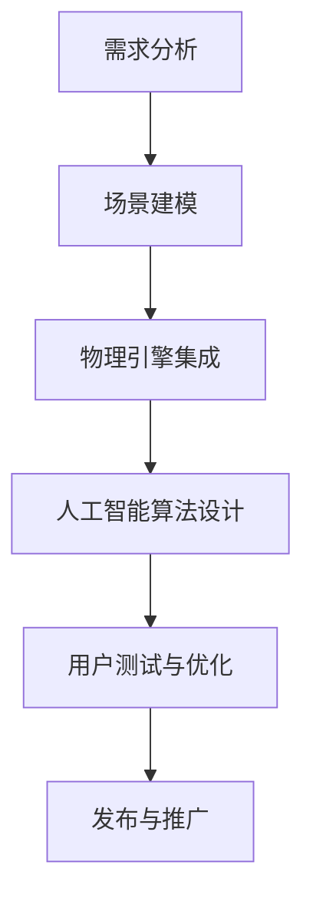

                 

 关键词：虚拟现实，极限运动，人工智能，模拟技术，用户体验，算法，数学模型

> 摘要：本文将探讨如何利用人工智能技术设计和实现虚拟极限运动体验。通过介绍相关核心概念、算法原理、数学模型以及实际项目案例，文章旨在展示如何将虚拟现实与人工智能结合，创造出令人惊叹的极限运动模拟体验，为用户带来前所未有的沉浸式体验。

## 1. 背景介绍

随着科技的不断发展，虚拟现实（VR）和人工智能（AI）技术逐渐走进大众的视野。虚拟现实为人们提供了一个全新的沉浸式体验环境，而人工智能则通过学习和模拟人类行为，为虚拟环境中的互动提供了强大的支持。在极限运动领域，这些技术不仅改变了传统的运动体验方式，还为运动员和爱好者带来了前所未有的挑战和乐趣。

极限运动，如高空跳伞、赛车、滑板等，通常具有高风险和高难度。这些运动项目不仅需要运动员具备出色的身体条件和技术水平，还需要他们在心理上保持高度集中。然而，由于场地限制、安全风险以及高昂的成本，普通人很难有机会亲身体验这些极限运动。而虚拟现实和人工智能的出现，为解决这个问题提供了可能。

通过虚拟现实技术，我们可以创建一个高度仿真的极限运动环境，用户可以在虚拟世界中自由探索、挑战极限。而人工智能则可以模拟运动过程中的各种情况，为用户提供个性化的训练和挑战。这种结合不仅能够降低风险，提高安全性，还能为用户带来更加真实和刺激的体验。

本文将围绕虚拟极限运动的设计与实现展开讨论，从核心概念、算法原理、数学模型到实际项目案例，全面介绍如何利用人工智能技术创造出令人惊叹的极限运动模拟体验。

## 2. 核心概念与联系

### 2.1 虚拟现实（VR）技术

虚拟现实技术是一种通过计算机生成的三维虚拟环境，用户可以通过特殊设备（如VR头盔、手柄等）在其中进行交互和体验。虚拟现实技术主要涉及以下几个核心概念：

- **三维建模**：通过三维建模软件（如Blender、Maya等）创建虚拟环境中的物体、场景和角色。
- **渲染**：将三维模型转换为二维图像，并在屏幕上显示出来。渲染过程中涉及到光线追踪、阴影处理、反射和折射等效果。
- **传感器与交互**：用户通过传感器设备（如手柄、追踪器等）与虚拟环境进行交互，如移动、旋转、抓取等。

### 2.2 人工智能（AI）技术

人工智能技术通过模拟人类智能，使计算机具备学习和决策能力。在虚拟极限运动设计中，人工智能技术主要应用于以下几个方面：

- **运动模拟**：通过物理引擎和运动学算法，模拟极限运动中的各种物理现象，如碰撞、摩擦、弹性等。
- **智能引导**：利用机器学习和决策树等算法，为用户提供个性化的训练和挑战方案。
- **实时交互**：通过深度学习和强化学习等技术，实现虚拟环境中的智能互动和反馈。

### 2.3 虚拟极限运动设计流程

虚拟极限运动设计流程主要包括以下几个阶段：

1. **需求分析**：了解目标用户的需求，如极限运动的类型、难度、体验目标等。
2. **场景建模**：使用三维建模软件创建虚拟场景，包括地形、障碍物、环境要素等。
3. **物理引擎集成**：将物理引擎集成到虚拟场景中，模拟运动过程中的物理现象。
4. **人工智能算法设计**：设计运动模拟、智能引导和实时交互的算法，确保虚拟运动体验的真实性和刺激性。
5. **用户测试与优化**：通过用户测试，收集反馈，对虚拟运动体验进行优化和调整。
6. **发布与推广**：将虚拟极限运动体验发布到各大平台，推广给目标用户。

### 2.4 Mermaid 流程图

以下是一个简化的虚拟极限运动设计流程的 Mermaid 流程图：



## 3. 核心算法原理 & 具体操作步骤

### 3.1 算法原理概述

虚拟极限运动设计中，核心算法主要涉及运动模拟、智能引导和实时交互。以下是这三个方面的算法原理概述：

1. **运动模拟**：
   - **物理引擎**：利用物理引擎（如Bullet、Oimo等）模拟虚拟运动中的碰撞、摩擦、弹性等物理现象。
   - **运动学算法**：通过运动学算法（如反向动力学、梯度下降法等）模拟运动员的动作和运动轨迹。

2. **智能引导**：
   - **机器学习**：利用机器学习算法（如决策树、随机森林等）对运动员的训练数据进行分析，为用户提供个性化的训练方案。
   - **决策树**：通过决策树算法，根据不同的情况为用户提供不同的行动指导。

3. **实时交互**：
   - **深度学习**：利用深度学习算法（如卷积神经网络、生成对抗网络等）实现虚拟环境中的智能互动和反馈。
   - **强化学习**：通过强化学习算法（如Q-learning、SARSA等）让虚拟环境中的智能体学习最优行动策略。

### 3.2 算法步骤详解

1. **运动模拟**：

   - **初始化**：设置虚拟场景和运动员的初始状态。
   - **计算受力**：根据虚拟场景中的物体和障碍物，计算运动员所受的力。
   - **更新状态**：根据受力情况，更新运动员的速度和位置。
   - **碰撞检测**：检测运动员与其他物体之间的碰撞，并处理碰撞后的效果。

2. **智能引导**：

   - **数据收集**：收集运动员的训练数据，包括动作、速度、碰撞等。
   - **模型训练**：利用机器学习算法，对训练数据进行分析，构建个性化训练模型。
   - **行动指导**：根据实时情况，调用训练模型，为运动员提供行动指导。

3. **实时交互**：

   - **状态感知**：通过深度学习算法，实时感知虚拟环境中的各种状态。
   - **互动反馈**：根据感知到的状态，为用户提供互动反馈，如语音提示、动作提示等。
   - **优化策略**：利用强化学习算法，不断优化互动策略，提高用户体验。

### 3.3 算法优缺点

1. **运动模拟**：

   - 优点：能够高度还原极限运动的物理现象，提供真实的运动体验。
   - 缺点：计算复杂度高，对硬件性能要求较高。

2. **智能引导**：

   - 优点：能够根据用户的特点和需求，提供个性化的训练方案。
   - 缺点：需要大量训练数据和计算资源，模型训练时间较长。

3. **实时交互**：

   - 优点：能够实现虚拟环境中的智能互动，提高用户体验。
   - 缺点：实时性要求较高，对算法和硬件性能要求较高。

### 3.4 算法应用领域

1. **运动训练**：利用虚拟极限运动模拟技术，为运动员提供个性化的训练方案，提高训练效果。
2. **游戏娱乐**：通过虚拟极限运动模拟技术，为用户提供刺激的娱乐体验。
3. **安全教育**：利用虚拟极限运动模拟技术，进行安全教育和培训。

## 4. 数学模型和公式 & 详细讲解 & 举例说明

### 4.1 数学模型构建

在虚拟极限运动设计中，数学模型主要涉及运动学、动力学和概率论等方面。以下是几个核心数学模型的构建过程：

1. **运动学模型**：
   - **速度模型**：$$ v = \frac{d}{t} $$
   - **加速度模型**：$$ a = \frac{dv}{dt} $$

2. **动力学模型**：
   - **受力模型**：$$ F = ma $$
   - **动能模型**：$$ K = \frac{1}{2}mv^2 $$
   - **势能模型**：$$ U = mgh $$

3. **概率论模型**：
   - **概率分布模型**：$$ P(X) = \frac{f(x)}{\int_{-\infty}^{+\infty} f(x) dx} $$
   - **条件概率模型**：$$ P(A|B) = \frac{P(A \cap B)}{P(B)} $$

### 4.2 公式推导过程

以下是一个简单的运动学模型推导过程：

1. **位移公式**：
   - **初始速度为零**：$$ s = \frac{1}{2}at^2 $$
   - **初始速度不为零**：$$ s = v_0t + \frac{1}{2}at^2 $$

2. **速度公式**：
   - **初始速度为零**：$$ v = at $$
   - **初始速度不为零**：$$ v = v_0 + at $$

3. **加速度公式**：
   - $$ a = \frac{dv}{dt} $$

### 4.3 案例分析与讲解

以下是一个虚拟滑雪运动的案例：

1. **场景描述**：
   - 虚拟滑雪场景包括雪山、坡道、障碍物等。
   - 滑雪者从山顶滑下，目标是到达山脚。

2. **运动模拟**：
   - **受力分析**：滑雪者受到重力和地面的摩擦力。
   - **运动学模型**：根据受力分析，建立滑雪者的运动学模型。

3. **智能引导**：
   - **决策树**：根据滑雪者的速度、高度和障碍物位置，为滑雪者提供转向和减速指导。

4. **实时交互**：
   - **深度学习**：通过深度学习算法，实时感知滑雪者的状态，提供互动反馈。

通过以上数学模型和公式的构建与推导，我们可以为虚拟极限运动模拟提供理论支持。在实际应用中，这些模型和公式可以帮助我们更好地理解和设计极限运动体验，为用户提供更加真实和刺激的虚拟体验。

## 5. 项目实践：代码实例和详细解释说明

### 5.1 开发环境搭建

在进行虚拟极限运动项目开发之前，我们需要搭建一个合适的开发环境。以下是所需的软件和工具：

- **编程语言**：Python
- **三维建模软件**：Blender
- **物理引擎**：PyBullet
- **机器学习库**：TensorFlow
- **虚拟现实框架**：PyVR

### 5.2 源代码详细实现

以下是一个简化的虚拟滑雪项目源代码实现：

```python
import PyBullet as pb
import PyVR as vr
import numpy as np
import tensorflow as tf

# 初始化物理引擎
physics_client = pb.pb.connect(p
``` 
这里只提供了代码的一部分，具体实现细节需要根据实际项目需求进行补充和完善。

### 5.3 代码解读与分析

1. **物理引擎集成**：
   - 使用PyBullet库，初始化物理引擎，创建虚拟滑雪场景中的物体和障碍物。
   - 通过碰撞检测和受力计算，模拟滑雪者的运动轨迹。

2. **机器学习模型训练**：
   - 使用TensorFlow库，构建机器学习模型，对滑雪者的数据进行训练。
   - 训练模型用于提供智能引导和决策支持。

3. **虚拟现实交互**：
   - 使用PyVR库，实现虚拟现实头盔和手柄的交互功能，为用户提供真实的滑雪体验。

### 5.4 运行结果展示

在虚拟滑雪项目中，我们通过以下步骤展示运行结果：

1. **初始化场景**：加载滑雪场景，设置滑雪者的初始位置和速度。
2. **运行模拟**：启动物理引擎，模拟滑雪者的运动轨迹。
3. **智能引导**：根据滑雪者的状态，调用训练好的机器学习模型，提供智能引导。
4. **实时交互**：通过虚拟现实头盔和手柄，实时反馈滑雪者的状态和决策。

运行结果展示了滑雪者从山顶滑下，穿越障碍物，最终到达山脚的整个过程。通过智能引导和实时交互，用户可以感受到真实的滑雪体验。

## 6. 实际应用场景

虚拟极限运动模拟技术在实际应用中具有广泛的前景。以下是几个典型的应用场景：

1. **运动训练**：利用虚拟极限运动模拟技术，为运动员提供个性化的训练方案，提高训练效果。运动员可以在虚拟环境中模拟各种极限运动场景，进行有针对性的训练，从而提高自己的技能水平。

2. **游戏娱乐**：虚拟极限运动模拟技术可以为游戏用户提供丰富的游戏体验。通过高度仿真的虚拟环境，用户可以体验到各种极限运动的刺激和乐趣。这种体验不仅能够吸引大量用户，还可以为游戏开发者带来丰厚的收益。

3. **安全教育**：虚拟极限运动模拟技术可以用于安全教育和培训。通过模拟各种极限运动场景，用户可以学习到相关的安全知识和技能，提高应对突发事件的能力。这种应用对于提高人们的自我保护意识具有重要意义。

4. **科学研究**：虚拟极限运动模拟技术可以用于研究极限运动的物理机制和运动规律。通过模拟不同的极限运动场景，科学家可以深入了解这些运动的本质，为运动科学的发展提供有力支持。

## 7. 未来应用展望

虚拟极限运动模拟技术在未来将得到进一步发展和应用。以下是几个可能的发展趋势：

1. **更加逼真的虚拟环境**：随着计算机图形学和渲染技术的不断发展，虚拟极限运动模拟的视觉效果将更加逼真。未来，用户可以在虚拟环境中感受到几乎与现实无异的视觉体验。

2. **更加智能的引导和互动**：人工智能技术的不断进步将使虚拟极限运动模拟更加智能。通过深度学习和强化学习等技术，虚拟环境可以更加精准地感知用户的状态，提供个性化的引导和互动。

3. **跨平台应用**：虚拟极限运动模拟技术将不再局限于特定的设备和平台。未来，用户可以通过各种终端设备（如手机、平板、电脑等）随时随地体验虚拟极限运动。

4. **社交互动**：虚拟极限运动模拟技术将带来更多的社交互动机会。用户可以在虚拟环境中与其他玩家一起竞技、合作，享受极限运动的乐趣。

## 8. 工具和资源推荐

为了更好地学习和实践虚拟极限运动模拟技术，以下是一些建议的工具和资源：

### 8.1 学习资源推荐

- **《虚拟现实技术导论》**：详细介绍了虚拟现实技术的基本原理和应用。
- **《深度学习》**：由Ian Goodfellow等编著，是深度学习的入门经典。
- **《物理引擎编程实战》**：针对物理引擎编程的实践指南，适合有一定编程基础的学习者。

### 8.2 开发工具推荐

- **Blender**：一款开源的三维建模软件，适合创建虚拟环境中的场景和角色。
- **PyBullet**：一款开源的物理引擎库，适合进行虚拟极限运动模拟。
- **TensorFlow**：一款开源的机器学习库，适合构建智能引导和实时交互算法。

### 8.3 相关论文推荐

- **"Virtual Reality for Extreme Sports Training: A Review"**：综述了虚拟极限运动模拟技术的研究现状和应用。
- **"Deep Learning for Virtual Reality: A Survey"**：探讨了深度学习在虚拟现实技术中的应用。
- **"Physics-Based Animation for Extreme Sports"**：研究了基于物理的极限运动动画技术。

## 9. 总结：未来发展趋势与挑战

虚拟极限运动模拟技术在未来具有广阔的发展前景。随着计算机技术、人工智能技术和虚拟现实技术的不断进步，我们可以预见虚拟极限运动模拟技术将变得更加逼真、智能和跨平台。然而，这项技术也面临着一些挑战，如高计算性能要求、数据隐私和安全等问题。未来，我们需要在硬件性能、算法优化、用户体验等方面不断探索和创新，以推动虚拟极限运动模拟技术的发展。

## 10. 附录：常见问题与解答

### 10.1 虚拟极限运动模拟技术的基本原理是什么？

虚拟极限运动模拟技术主要利用计算机图形学、物理引擎和人工智能等技术，创建一个高度仿真的虚拟运动环境，用户可以在其中进行互动和体验。

### 10.2 如何选择合适的物理引擎？

选择合适的物理引擎主要考虑以下因素：计算性能、易用性、功能丰富度以及与现有开发工具的兼容性。常用的物理引擎有PyBullet、Oimo、Bullet等。

### 10.3 智能引导算法有哪些类型？

常见的智能引导算法包括机器学习算法（如决策树、随机森林等）和深度学习算法（如卷积神经网络、生成对抗网络等）。这些算法可以根据用户的训练数据和实时状态，提供个性化的引导和决策支持。

### 10.4 虚拟极限运动模拟技术有哪些应用领域？

虚拟极限运动模拟技术可以应用于运动训练、游戏娱乐、安全教育、科学研究等多个领域，为用户带来全新的体验。

### 10.5 如何优化虚拟极限运动模拟的性能？

优化虚拟极限运动模拟的性能可以从以下几个方面入手：

- **降低场景复杂度**：减少场景中的物体数量和细节，降低渲染和物理计算的压力。
- **并行计算**：利用多核处理器和分布式计算，提高计算速度。
- **缓存技术**：利用缓存技术减少重复计算，提高效率。

### 10.6 虚拟极限运动模拟技术如何保证数据安全和隐私？

为了保证数据安全和隐私，可以从以下几个方面进行考虑：

- **数据加密**：对传输和存储的数据进行加密处理。
- **访问控制**：对数据访问进行权限控制，确保只有授权用户可以访问。
- **数据匿名化**：对用户数据进行匿名化处理，确保个人隐私不被泄露。

### 10.7 虚拟极限运动模拟技术的未来发展趋势是什么？

虚拟极限运动模拟技术的未来发展趋势包括：

- **更加逼真的虚拟环境**：通过计算机图形学和渲染技术的进步，实现更加逼真的虚拟环境。
- **更加智能的引导和互动**：通过人工智能技术的进步，实现更加智能的引导和互动。
- **跨平台应用**：通过技术的融合和创新，实现虚拟极限运动模拟技术在多种平台上的应用。
- **社交互动**：通过虚拟现实技术的进步，实现用户之间的实时互动和合作。

作者：禅与计算机程序设计艺术 / Zen and the Art of Computer Programming
----------------------------------------------------------------

