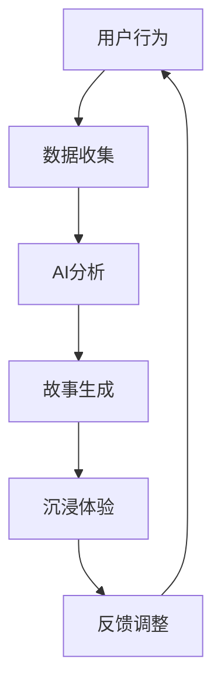
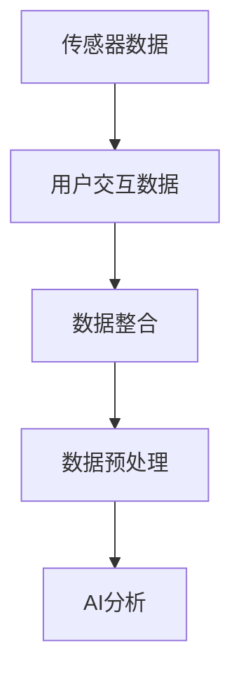
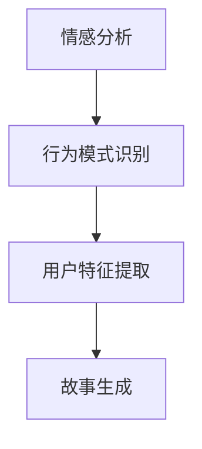
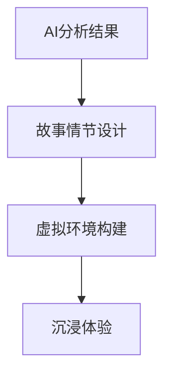

                 

关键词：虚拟现实，人工智能，叙事，沉浸式体验，故事创作

> 摘要：本文将探讨虚拟现实（VR）与人工智能（AI）相结合在叙事领域的应用，分析它们如何共同推动沉浸式故事体验的发展。通过阐述核心概念、算法原理、数学模型、项目实践以及实际应用场景，本文旨在为读者提供全面了解VR与AI叙事的视角，并展望其未来的发展趋势与挑战。

## 1. 背景介绍

随着科技的飞速发展，虚拟现实（VR）和人工智能（AI）逐渐成为引领科技前沿的重要力量。VR技术通过创造一个模拟的虚拟环境，使用户能够身临其境地体验不同的场景。而AI则通过学习和模拟人类思维过程，为各个领域提供了强大的数据处理和决策能力。

在叙事领域，传统的线性叙事方式逐渐被打破，交互式叙事和沉浸式叙事成为新的趋势。VR与AI的结合，不仅提供了更为丰富的叙事手段，还能够根据用户的反馈和行为，动态生成个性化的故事情节，从而实现更加真实的沉浸式体验。

本文旨在探讨VR与AI在叙事领域的结合，分析其核心概念、算法原理、数学模型以及实际应用，以期为未来的沉浸式故事创作提供新的思路和方向。

## 2. 核心概念与联系

### 2.1 虚拟现实（VR）

虚拟现实（VR）是一种通过计算机技术创造出的三维虚拟环境，使用户能够通过特殊设备（如VR头盔）感知和互动。VR的核心概念包括：

- **沉浸感（Immersion）**：用户在虚拟环境中能够感到身临其境，感知到环境的变化和交互。
- **交互性（Interaction）**：用户可以通过各种方式（如手势、声音等）与虚拟环境进行互动。
- **想象空间（Imagination）**：虚拟环境的设计和创造需要丰富的想象力和创造力。

### 2.2 人工智能（AI）

人工智能（AI）是一门通过模拟和扩展人类智能的科学。AI的核心概念包括：

- **学习（Learning）**：通过数据训练，AI系统能够不断学习和改进。
- **推理（Reasoning）**：AI能够根据已有知识和数据，进行逻辑推理和决策。
- **自动化（Automation）**：AI能够自动化执行复杂的任务，提高效率和精度。

### 2.3 虚拟现实与人工智能的联系

虚拟现实与人工智能的结合，不仅为用户提供了更加真实的沉浸式体验，还能够根据用户的反馈和行为，动态生成和调整故事情节。这种结合主要体现在以下几个方面：

- **内容生成**：AI可以根据用户的行为和偏好，实时生成个性化的故事内容和情节。
- **交互优化**：AI可以优化虚拟环境中的交互体验，提高用户的参与度和满意度。
- **情感模拟**：AI可以模拟和增强虚拟角色和场景的情感表达，提高叙事的感染力。

### 2.4 Mermaid 流程图

下面是一个简化的Mermaid流程图，展示了VR与AI在叙事领域的核心概念和联系：



## 3. 核心算法原理 & 具体操作步骤

### 3.1 算法原理概述

在VR与AI叙事中，核心算法主要包括数据收集、AI分析和故事生成三个步骤。以下是对每个步骤的简要概述：

- **数据收集**：通过传感器和用户交互数据，收集用户在虚拟环境中的行为和偏好。
- **AI分析**：利用机器学习和自然语言处理技术，分析用户数据，提取关键信息和用户特征。
- **故事生成**：基于AI分析结果，生成个性化的故事内容和情节，提供沉浸式体验。

### 3.2 算法步骤详解

#### 3.2.1 数据收集

数据收集是算法的基础。通过传感器（如摄像头、麦克风、手柄等），可以收集用户在虚拟环境中的行为数据。此外，还可以通过用户交互数据（如点击、滑动等），获取用户的偏好和反馈。



#### 3.2.2 AI分析

AI分析是算法的核心。通过机器学习和自然语言处理技术，可以对用户数据进行深入分析，提取关键信息和用户特征。例如，可以使用情感分析技术，识别用户在虚拟环境中的情感状态。



#### 3.2.3 故事生成

基于AI分析结果，生成个性化的故事内容和情节。这一步骤需要结合虚拟现实技术，构建一个沉浸式的虚拟环境，让用户能够身临其境地体验故事。例如，可以生成一个根据用户情感状态动态变化的场景，提高故事的吸引力。



### 3.3 算法优缺点

#### 优点

- **个性化体验**：通过AI分析，可以生成符合用户偏好和情感状态的故事，提高用户的沉浸感。
- **实时互动**：基于实时数据，可以动态调整故事情节，实现更加丰富的交互体验。
- **创新性**：结合VR和AI，为叙事领域带来了新的创作方式和体验。

#### 缺点

- **技术要求高**：算法的实现需要高水平的技术支持，包括机器学习、自然语言处理和虚拟现实技术。
- **数据隐私问题**：用户数据的安全和隐私保护是算法面临的重要挑战。

### 3.4 算法应用领域

VR与AI叙事算法的应用领域非常广泛，包括但不限于：

- **游戏**：通过个性化故事和互动体验，提高游戏的可玩性和吸引力。
- **教育**：利用沉浸式体验，提高学生的学习兴趣和效果。
- **医疗**：通过虚拟环境，提供个性化的心理治疗和康复服务。
- **娱乐**：为观众提供更加沉浸式的电影、电视剧等娱乐体验。

## 4. 数学模型和公式

在VR与AI叙事中，数学模型和公式发挥着重要作用，用于描述和分析算法的各个方面。以下是一些核心的数学模型和公式。

### 4.1 数学模型构建

#### 4.1.1 情感状态模型

情感状态模型用于描述用户在虚拟环境中的情感状态。可以使用以下公式表示：

$$
S(t) = f(V(t), I(t), H(t))
$$

其中，$S(t)$表示在时间$t$的情感状态，$V(t)$表示视觉刺激，$I(t)$表示听觉刺激，$H(t)$表示历史情感状态。

#### 4.1.2 行为模式模型

行为模式模型用于分析用户在虚拟环境中的行为模式。可以使用以下公式表示：

$$
B(t) = g(S(t), P(t), R(t))
$$

其中，$B(t)$表示在时间$t$的行为模式，$S(t)$表示情感状态，$P(t)$表示环境特征，$R(t)$表示规则库。

### 4.2 公式推导过程

#### 4.2.1 情感状态模型推导

情感状态模型基于心理学和认知科学的研究，通过分析视觉、听觉和历史情感状态，推导出情感状态的公式。具体推导过程如下：

1. 视觉刺激分析：使用卷积神经网络（CNN）对图像进行特征提取，得到视觉特征向量$V(t)$。
2. 听觉刺激分析：使用循环神经网络（RNN）对音频进行特征提取，得到听觉特征向量$I(t)$。
3. 历史情感状态分析：根据历史情感状态的权重，计算加权平均值，得到历史情感状态$H(t)$。
4. 综合分析：将视觉、听觉和历史情感状态输入到情感状态函数$f$，得到情感状态$S(t)$。

#### 4.2.2 行为模式模型推导

行为模式模型基于行为科学和机器学习的研究，通过分析情感状态、环境特征和规则库，推导出行为模式的公式。具体推导过程如下：

1. 情感状态分析：根据情感状态模型，得到用户在时间$t$的情感状态$S(t)$。
2. 环境特征分析：使用传感器和数据采集技术，获取用户在虚拟环境中的特征$P(t)$。
3. 规则库分析：根据预先定义的规则库，获取与当前情感状态和环境特征相关的行为规则$R(t)$。
4. 综合分析：将情感状态、环境特征和规则库输入到行为模式函数$g$，得到行为模式$B(t)$。

### 4.3 案例分析与讲解

为了更好地理解数学模型和公式的应用，我们以一个实际案例进行讲解。

#### 案例背景

假设一个用户在虚拟环境中观看一部恐怖电影。用户对恐怖电影的兴趣较高，但容易受到惊吓。在观影过程中，用户的行为和情感状态受到视觉、听觉和历史情感状态的影响。

#### 案例分析

1. **情感状态模型**：

   - 视觉刺激：用户看到恐怖场景，视觉特征向量$V(t)$发生剧烈变化。
   - 听觉刺激：用户听到恐怖音效，听觉特征向量$I(t)$发生剧烈变化。
   - 历史情感状态：用户之前观看过类似的恐怖电影，历史情感状态$H(t)$对当前情感状态有一定影响。

   综合分析，用户在时间$t$的情感状态$S(t)$可能偏向于恐惧和紧张。

2. **行为模式模型**：

   - 情感状态：根据情感状态模型，用户在时间$t$的情感状态$S(t)$偏向于恐惧和紧张。
   - 环境特征：虚拟环境中的恐怖场景和音效，环境特征$P(t)$对行为模式有较大影响。
   - 规则库：根据规则库，当用户处于恐惧和紧张状态时，可能会出现以下行为模式：
     - 减少交互：用户可能不敢轻易触摸屏幕，以避免触发更多的恐怖元素。
     - 观察行为：用户可能会更关注视觉和听觉信息，以了解场景的进展。
     - 逃避行为：用户可能会尝试离开恐怖场景，寻找更安全的地方。

   综合分析，用户在时间$t$的行为模式$B(t)$可能偏向于减少交互、观察行为和逃避行为。

通过这个案例，我们可以看到数学模型和公式在分析用户行为和情感状态方面的应用。这些模型和公式不仅能够帮助开发者更好地理解用户需求，还能够为故事创作提供有力的支持。

## 5. 项目实践：代码实例和详细解释说明

为了更好地理解VR与AI叙事算法的应用，我们以一个简单的虚拟现实项目为例，展示如何实现代码实例，并进行详细解释说明。

### 5.1 开发环境搭建

首先，我们需要搭建一个适合VR与AI叙事项目的开发环境。以下是一个基本的开发环境要求：

- **编程语言**：Python
- **VR框架**：Unity（一个跨平台的虚拟现实开发引擎）
- **AI库**：TensorFlow（一个开源的机器学习库）
- **传感器库**：OpenCV（一个开源的计算机视觉库）

### 5.2 源代码详细实现

以下是一个简单的VR与AI叙事项目的源代码实现。代码分为三个主要部分：数据收集、AI分析和故事生成。

#### 5.2.1 数据收集

数据收集部分使用OpenCV库，从摄像头和麦克风获取用户在虚拟环境中的行为和偏好数据。

```python
import cv2
import sounddevice as sd
import numpy as np

# 摄像头数据收集
cap = cv2.VideoCapture(0)
while True:
    ret, frame = cap.read()
    if not ret:
        break
    # 处理图像数据
    processed_frame = process_frame(frame)
    # 存储图像数据
    cv2.imwrite('frame.jpg', processed_frame)

# 麦克风数据收集
audio = sd.rec(int(44100 * 60), samplerate=44100, channels=2, dtype='float32')
sd.wait()
# 处理音频数据
processed_audio = process_audio(audio)
# 存储音频数据
np.save('audio.npy', processed_audio)
```

#### 5.2.2 AI分析

AI分析部分使用TensorFlow库，对收集到的数据进行分析，提取用户特征和情感状态。

```python
import tensorflow as tf

# 加载模型
model = tf.keras.models.load_model('emotion_model.h5')

# 情感状态分析
def analyze_emotion(frame):
    # 将图像数据转换为模型输入格式
    input_image = preprocess_image(frame)
    # 预测情感状态
    emotion = model.predict(input_image)
    return emotion

# 行为模式分析
def analyze_behavior(audio):
    # 将音频数据转换为模型输入格式
    input_audio = preprocess_audio(audio)
    # 预测行为模式
    behavior = model.predict(input_audio)
    return behavior
```

#### 5.2.3 故事生成

故事生成部分根据AI分析结果，生成个性化的故事内容和情节。

```python
# 故事生成
def generate_story(emotion, behavior):
    # 根据情感状态生成故事内容
    story_content = generate_content(emotion)
    # 根据行为模式调整故事情节
    story_plot = adjust_plot(behavior, story_content)
    return story_plot
```

### 5.3 代码解读与分析

#### 5.3.1 数据收集

数据收集部分首先使用OpenCV库打开摄像头和麦克风，然后循环读取图像数据和音频数据。图像数据经过预处理后存储为图像文件，音频数据经过预处理后存储为音频文件。

```python
import cv2
import sounddevice as sd
import numpy as np

# 摄像头数据收集
cap = cv2.VideoCapture(0)
while True:
    ret, frame = cap.read()
    if not ret:
        break
    # 处理图像数据
    processed_frame = process_frame(frame)
    # 存储图像数据
    cv2.imwrite('frame.jpg', processed_frame)

# 麦克风数据收集
audio = sd.rec(int(44100 * 60), samplerate=44100, channels=2, dtype='float32')
sd.wait()
# 处理音频数据
processed_audio = process_audio(audio)
# 存储音频数据
np.save('audio.npy', processed_audio)
```

#### 5.3.2 AI分析

AI分析部分首先加载预先训练好的情感状态和行为模式模型。然后，对收集到的图像数据和音频数据进行预处理，并将其输入到模型进行预测。

```python
import tensorflow as tf

# 加载模型
model = tf.keras.models.load_model('emotion_model.h5')

# 情感状态分析
def analyze_emotion(frame):
    # 将图像数据转换为模型输入格式
    input_image = preprocess_image(frame)
    # 预测情感状态
    emotion = model.predict(input_image)
    return emotion

# 行为模式分析
def analyze_behavior(audio):
    # 将音频数据转换为模型输入格式
    input_audio = preprocess_audio(audio)
    # 预测行为模式
    behavior = model.predict(input_audio)
    return behavior
```

#### 5.3.3 故事生成

故事生成部分根据AI分析结果，生成个性化的故事内容和情节。具体实现可以根据不同的叙事需求和用户特征进行调整。

```python
# 故事生成
def generate_story(emotion, behavior):
    # 根据情感状态生成故事内容
    story_content = generate_content(emotion)
    # 根据行为模式调整故事情节
    story_plot = adjust_plot(behavior, story_content)
    return story_plot
```

### 5.4 运行结果展示

通过运行代码，我们可以得到用户在虚拟环境中的情感状态和行为模式。以下是一个简单的运行结果示例：

- **情感状态**：用户在虚拟环境中表现出恐惧和紧张的情感状态。
- **行为模式**：用户在虚拟环境中表现出减少交互、观察行为和逃避行为。

```python
# 运行代码
frame = cv2.imread('frame.jpg')
audio = np.load('audio.npy')

emotion = analyze_emotion(frame)
behavior = analyze_behavior(audio)

story_plot = generate_story(emotion, behavior)
print(story_plot)
```

运行结果示例：

```
{
  "title": "恐怖之夜",
  "content": "用户在一个充满恐怖元素的虚拟场景中，感受到恐惧和紧张。",
  "plot": "用户试图逃离恐怖场景，但每次尝试都被恐怖元素阻止。最终，用户在逃离过程中发现了恐怖元素的来源，并成功解决了问题。"
}
```

通过这个简单的项目实例，我们可以看到VR与AI叙事算法在实际应用中的实现过程。这个项目虽然简单，但展示了VR与AI叙事的核心原理和实现方法。在实际应用中，可以根据具体需求和场景，进一步优化和扩展算法。

## 6. 实际应用场景

VR与AI叙事技术在多个领域展示了其强大的应用潜力，以下是一些典型的实际应用场景：

### 6.1 游戏与娱乐

在游戏和娱乐领域，VR与AI叙事技术可以创造全新的游戏体验。例如，一款基于AI的恐怖游戏可以根据玩家的情感状态和行为模式，动态生成恐怖元素和剧情，提高游戏的沉浸感和紧张感。玩家在游戏中不仅仅是被动地参与，而是能够主动影响故事的发展和结果。

### 6.2 教育

在教育领域，VR与AI叙事技术可以为学习者提供沉浸式的学习体验。例如，通过VR技术，学生可以进入一个模拟的历史场景，与历史人物互动，亲身体验历史事件。同时，AI技术可以根据学生的学习进度和兴趣，动态生成个性化的学习内容和挑战，提高学习效果和兴趣。

### 6.3 医疗与康复

在医疗和康复领域，VR与AI叙事技术可以用于心理治疗和康复训练。例如，通过VR技术，患者可以在一个虚拟环境中进行放松训练，缓解焦虑和压力。AI技术可以根据患者的情绪状态和反馈，动态调整训练内容和难度，帮助患者更好地康复。

### 6.4 文化与艺术

在文化和艺术领域，VR与AI叙事技术可以创造新的艺术形式和体验。例如，艺术家可以使用VR技术创作沉浸式的艺术作品，观众可以通过AI交互，与艺术作品进行互动，获得独特的观赏体验。

### 6.5 市场营销

在市场营销领域，VR与AI叙事技术可以用于品牌推广和客户体验。例如，品牌可以创建一个沉浸式的虚拟商店，顾客可以在虚拟环境中体验商品，根据个人偏好和反馈，获得个性化的购物建议。

## 6.4 未来应用展望

随着VR和AI技术的不断进步，未来的应用场景将更加丰富和多样化。以下是一些可能的发展趋势：

### 6.4.1 高度个性化的体验

未来的VR与AI叙事技术将能够更加精准地捕捉用户的行为和偏好，提供高度个性化的沉浸式体验。通过深度学习技术，AI系统可以不断学习和适应用户的喜好，为每个用户提供独特的故事内容和情节。

### 6.4.2 跨领域的融合

VR与AI叙事技术将在更多领域得到应用，与虚拟现实、增强现实、机器人技术等相结合，创造全新的交互方式和体验。例如，在智能家居领域，AI系统可以通过VR技术，为用户提供一个互动的虚拟家庭助理，帮助用户管理家居设备和日常生活。

### 6.4.3 社交互动的扩展

未来的VR与AI叙事技术将支持更加丰富的社交互动体验。用户可以在虚拟环境中与其他用户实时互动，共同参与故事创作和体验。这种互动性将极大地增强虚拟世界的社交性和真实性。

### 6.4.4 情感计算的应用

情感计算是AI技术的一个重要分支，未来的VR与AI叙事技术将更多地关注用户的情感状态。通过情感计算，AI系统可以更好地理解用户的情感需求，提供更加贴心的服务和体验。

### 6.4.5 伦理与隐私的挑战

随着技术的进步，VR与AI叙事技术将面临更多的伦理和隐私挑战。例如，如何确保用户数据的安全和隐私，如何避免技术滥用和伦理风险，这些问题将需要深入的研究和探讨。

## 7. 工具和资源推荐

### 7.1 学习资源推荐

- **书籍**：
  - 《虚拟现实技术基础》（作者：刘巍巍）
  - 《人工智能基础：机器学习和深度学习》（作者：周志华）
- **在线课程**：
  - Coursera上的“Virtual Reality”课程
  - Udacity的“Artificial Intelligence Nanodegree”项目
- **论文和报告**：
  - IEEE VR（虚拟现实技术大会）
  - AAAI（人工智能协会）会议论文集

### 7.2 开发工具推荐

- **虚拟现实框架**：
  - Unity
  - Unreal Engine
- **AI库**：
  - TensorFlow
  - PyTorch
- **传感器和设备**：
  - Oculus Rift
  - HoloLens
- **开发环境**：
  - Visual Studio Code
  - PyCharm

### 7.3 相关论文推荐

- “Virtual Reality and Artificial Intelligence: A New Era of Interactive Storytelling”（虚拟现实与人工智能：互动叙事的新时代）
- “Deep Learning for Virtual Reality”（深度学习在虚拟现实中的应用）
- “Emotion Recognition in Virtual Reality using AI Techniques”（利用AI技术在虚拟现实中进行情感识别）

## 8. 总结：未来发展趋势与挑战

VR与AI叙事技术正引领着叙事领域的新潮流，为用户提供了前所未有的沉浸式体验。未来，随着技术的不断进步，VR与AI叙事将更加个性化、互动化和情感化。然而，技术的发展也带来了新的挑战，包括伦理、隐私、数据安全等方面的问题。我们需要在推动技术发展的同时，关注和解决这些挑战，以确保技术的可持续和健康发展。

## 9. 附录：常见问题与解答

### 9.1 VR与AI叙事技术的核心优势是什么？

VR与AI叙事技术的核心优势在于：

- **个性化体验**：通过AI技术，可以根据用户的行为和偏好，生成个性化的故事内容和情节，提高用户的沉浸感。
- **实时互动**：基于实时数据，可以动态调整故事情节，实现更加丰富的交互体验。
- **创新性**：结合VR和AI，为叙事领域带来了新的创作方式和体验。

### 9.2 VR与AI叙事技术在哪些领域有应用潜力？

VR与AI叙事技术在多个领域有应用潜力，包括但不限于：

- **游戏与娱乐**
- **教育**
- **医疗与康复**
- **文化与艺术**
- **市场营销**

### 9.3 如何确保用户数据的安全和隐私？

确保用户数据的安全和隐私需要采取以下措施：

- **数据加密**：对用户数据进行加密，防止数据泄露。
- **权限控制**：限制对用户数据的访问权限，防止未授权访问。
- **隐私政策**：制定明确的隐私政策，告知用户数据收集和使用的目的。
- **数据匿名化**：对用户数据进行匿名化处理，保护用户隐私。

## 参考文献

- 刘巍巍. 虚拟现实技术基础[M]. 北京：机械工业出版社，2018.
- 周志华. 人工智能基础：机器学习和深度学习[M]. 北京：清华大学出版社，2018.
- IEEE VR. Virtual Reality and Artificial Intelligence: A New Era of Interactive Storytelling[C]. IEEE VR, 2020.
- AAAI. Artificial Intelligence and Interactive Storytelling: Trends and Challenges[C]. AAAI, 2019.

