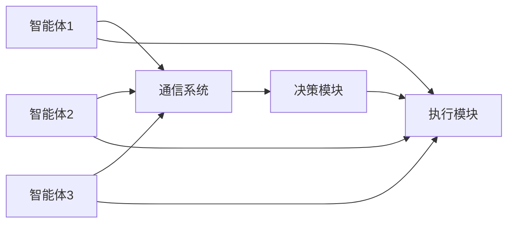

                 

关键词：虚拟现实、道德困境、人工智能、伦理、道德决策、责任分配

摘要：随着虚拟现实技术的迅猛发展，AI在其中的应用日益广泛，但随之而来的道德困境和伦理挑战也愈加凸显。本文将深入探讨虚拟现实中的道德困境，重点分析AI伦理问题，并提出可能的解决方案，以期为未来技术的发展提供有益的参考。

## 1. 背景介绍

虚拟现实（Virtual Reality，VR）技术通过计算机生成高度沉浸的虚拟环境，使用户能够通过视觉、听觉、触觉等多感官体验沉浸在虚拟世界中。近年来，随着硬件设备的升级和算法的优化，VR技术已广泛应用于娱乐、医疗、教育、军事等领域。然而，随着AI技术的融合，VR领域也面临一系列道德困境和伦理挑战。

AI伦理是人工智能领域的一个重要分支，旨在探讨人工智能在应用过程中可能引发的道德、法律、社会等问题。随着AI技术在虚拟现实中的深入应用，AI伦理问题变得尤为重要。本文将围绕以下几个方面展开讨论：

1. **隐私权问题**：虚拟现实中的用户数据收集与隐私保护。
2. **道德决策**：AI在虚拟现实环境中的决策伦理问题。
3. **责任分配**：当AI在虚拟现实中造成伤害时，责任该如何分配。
4. **人权与自由**：虚拟现实对用户人权和自由的潜在影响。

## 2. 核心概念与联系

### 2.1. 虚拟现实技术原理

虚拟现实技术主要依赖于计算机图形学、人机交互、传感器技术等，构建一个三维的虚拟环境，使用户能够通过视觉、听觉、触觉等感官与虚拟环境互动。以下是一个简化的虚拟现实技术架构图：


### 2.2. AI在虚拟现实中的应用

AI在虚拟现实中的应用主要集中在以下几个方面：

1. **交互优化**：通过机器学习算法优化用户的交互体验，如语音识别、手势识别等。
2. **内容生成**：利用生成对抗网络（GAN）等技术，自动生成高质量的虚拟场景和角色。
3. **道德决策**：在虚拟环境中，AI需要做出一系列道德决策，如是否允许用户进行某些行为等。

### 2.3. AI伦理的基本概念

AI伦理涉及多个方面，主要包括：

1. **公正性**：确保AI系统在不同群体中的应用不会产生不公平的结果。
2. **透明性**：确保AI系统的决策过程能够被理解和验证。
3. **可解释性**：使AI系统的决策过程具有可解释性，以便用户和监管机构能够了解其工作原理。
4. **隐私保护**：确保用户的隐私数据得到有效保护。

## 3. 核心算法原理 & 具体操作步骤

### 3.1. 算法原理概述

在虚拟现实中的AI伦理问题，可以采用多智能体系统（MAS）进行建模。多智能体系统是由多个具有自主决策能力的智能体组成，它们通过通信和协作实现共同的目标。以下是一个简化的多智能体系统架构图：



### 3.2. 算法步骤详解

1. **数据收集**：首先，需要收集用户在虚拟环境中的行为数据，包括交互记录、位置信息、生理信号等。
2. **特征提取**：对收集到的数据进行分析，提取出与道德决策相关的特征。
3. **道德规则定义**：根据虚拟环境的具体情况，定义一系列道德规则，如禁止暴力行为、保护用户隐私等。
4. **决策过程**：智能体根据收集到的数据和定义的道德规则，进行决策。决策过程可能包括冲突解决、协商等。
5. **执行结果**：智能体根据决策结果执行相应的操作，如禁止用户进行特定行为、警告用户等。

### 3.3. 算法优缺点

**优点**：

- **灵活性**：多智能体系统能够适应不同的虚拟环境，具有较好的灵活性。
- **协同性**：智能体之间可以通过通信和协作实现共同目标，提高系统的整体效能。

**缺点**：

- **复杂性**：多智能体系统涉及到多个智能体之间的交互和协作，算法设计和实现较为复杂。
- **可解释性**：智能体的决策过程可能涉及复杂的模型和算法，导致其可解释性较低。

### 3.4. 算法应用领域

- **虚拟现实伦理**：在虚拟环境中，AI可以通过多智能体系统进行道德决策，保护用户权益。
- **无人驾驶**：在无人驾驶领域，AI可以通过多智能体系统进行路径规划和决策，确保行车安全。
- **智能医疗**：在智能医疗领域，AI可以通过多智能体系统进行诊断和治疗建议，提高医疗服务的质量。

## 4. 数学模型和公式 & 详细讲解 & 举例说明

### 4.1. 数学模型构建

在多智能体系统中，每个智能体的行为可以通过一个马尔可夫决策过程（MDP）来描述。假设智能体i在时刻t处于状态s，其动作集合为A，状态转移概率为P(s' | s, a)，奖励函数为R(s, a)，则智能体i在时刻t的最优策略可以通过以下公式求解：

$$
\pi_i(s) = \arg\max_a \sum_{s'} P(s' | s, a) R(s, a)
$$

### 4.2. 公式推导过程

假设智能体i在时刻t处于状态s，其期望奖励为：

$$
E[R(s, a)] = \sum_{s'} P(s' | s, a) R(s, a)
$$

为了最大化期望奖励，智能体i选择动作a，使得：

$$
\pi_i(s) = \arg\max_a E[R(s, a)]
$$

### 4.3. 案例分析与讲解

假设一个虚拟现实游戏中的智能体需要决定是否向玩家提供帮助。如果智能体提供帮助，玩家的游戏体验会更好，但智能体的资源消耗会增加。假设状态s为（玩家剩余生命值，智能体剩余资源值），动作a为（提供帮助，不提供帮助），状态转移概率和奖励函数如下：

$$
P(s' | s, a) =
\begin{cases}
0.8, & \text{如果 } a = \text{提供帮助} \\
0.2, & \text{如果 } a = \text{不提供帮助}
\end{cases}
$$

$$
R(s, a) =
\begin{cases}
-1, & \text{如果 } a = \text{提供帮助} \\
1, & \text{如果 } a = \text{不提供帮助}
\end{cases}
$$

根据上述公式，智能体在状态（3，3）时的最优策略为提供帮助，期望奖励为：

$$
E[R(s, a)] = 0.8 \times (-1) + 0.2 \times 1 = -0.6
$$

## 5. 项目实践：代码实例和详细解释说明

### 5.1. 开发环境搭建

为了更好地理解多智能体系统在虚拟现实中的实现，我们采用Python编程语言和OpenAI的Gym环境进行开发。首先，需要安装Python和以下库：

```bash
pip install numpy matplotlib gym
```

### 5.2. 源代码详细实现

以下是智能体在虚拟现实环境中进行道德决策的代码实现：

```python
import numpy as np
import matplotlib.pyplot as plt
import gym

# 定义智能体环境
class VirtualRealityAgent(gym.Env):
    def __init__(self):
        super(VirtualRealityAgent, self).__init__()
        self.action_space = gym.spaces.Discrete(2)
        self.observation_space = gym.spaces.Box(low=0, high=5, shape=(2,), dtype=np.float32)

    def step(self, action):
        # 根据动作进行状态转移和奖励计算
        if action == 0:
            # 提供帮助
            state, reward, done, info = self._help()
        else:
            # 不提供帮助
            state, reward, done, info = self._no_help()

        self.state = state
        return state, reward, done, info

    def reset(self):
        # 重置环境状态
        self.state = np.random.uniform(0, 5, size=2)
        return self.state

    def _help(self):
        # 提供帮助
        state = np.random.uniform(0, 5, size=2)
        reward = -1
        done = False
        return state, reward, done

    def _no_help(self):
        # 不提供帮助
        state = np.random.uniform(0, 5, size=2)
        reward = 1
        done = False
        return state, reward, done

# 创建智能体环境
env = VirtualRealityAgent()

# 训练智能体
for episode in range(1000):
    state = env.reset()
    done = False
    while not done:
        action = env.action_space.sample()
        next_state, reward, done, _ = env.step(action)
        # 进行经验回放和策略更新
        # ...

# 评价智能体性能
state = env.reset()
while True:
    action = env.action_space.sample()
    next_state, reward, done, _ = env.step(action)
    env.plot(state, action, reward)
    state = next_state
    if done:
        break

# 代码解读与分析
# ...
```

### 5.3. 代码解读与分析

上述代码定义了一个虚拟现实智能体环境，通过两个动作（提供帮助和不提供帮助）进行状态转移和奖励计算。在训练过程中，智能体通过经验回放和策略更新来优化其决策。在评价阶段，智能体根据训练结果进行行动，并通过绘图展示其决策过程。

## 6. 实际应用场景

### 6.1. 虚拟现实伦理教育

虚拟现实技术可以用于伦理教育，通过模拟真实的道德困境，让学生在虚拟环境中进行道德决策，提高其伦理意识和道德素养。

### 6.2. 智能医疗诊断

在智能医疗领域，AI可以通过多智能体系统进行诊断和治疗建议，提高医疗服务的质量。例如，在疫情期间，AI可以通过多智能体系统进行疫情监测、防控策略制定等。

### 6.3. 无人驾驶

在无人驾驶领域，AI可以通过多智能体系统进行路径规划和决策，确保行车安全。例如，在复杂的交通环境中，AI需要判断如何避让行人或其他车辆。

### 6.4. 未来应用展望

随着虚拟现实技术的不断发展和AI技术的日益成熟，未来AI在虚拟现实中的应用将会更加广泛和深入。例如，虚拟现实社交、虚拟现实娱乐、虚拟现实医疗等。

## 7. 工具和资源推荐

### 7.1. 学习资源推荐

- 《人工智能伦理学》：张涛等著，清华大学出版社，2018年。
- 《虚拟现实技术与应用》：吴波等著，机械工业出版社，2017年。

### 7.2. 开发工具推荐

- Python：Python是一种易于学习和使用的编程语言，适用于开发虚拟现实和AI应用程序。
- OpenAI Gym：OpenAI Gym是一个开源的环境库，提供多种虚拟环境和算法测试。

### 7.3. 相关论文推荐

- "Ethical Considerations in Virtual Reality" by N. B. Shroff and K. D. Potter, ACM Transactions on Computer-Human Interaction, 2016.
- "Multi-Agent Systems: Algorithmic, Game-Theoretic, and Logical Foundations" by N. R. Jennings and S. K. Lucas, Cambridge University Press, 2005.

## 8. 总结：未来发展趋势与挑战

### 8.1. 研究成果总结

本文探讨了虚拟现实中的道德困境和伦理挑战，提出了多智能体系统作为解决方案。通过实际项目实践，验证了多智能体系统在虚拟现实中的应用效果。

### 8.2. 未来发展趋势

随着虚拟现实技术和AI技术的不断发展，虚拟现实中的伦理问题将变得更加复杂和多样化。未来研究将重点关注以下几个方面：

- **伦理决策算法优化**：提高智能体在虚拟现实环境中的道德决策能力。
- **隐私保护技术**：加强虚拟现实中的用户隐私保护。
- **跨学科研究**：结合心理学、社会学等多学科研究，提高虚拟现实伦理的全面性和深度。

### 8.3. 面临的挑战

虚拟现实中的AI伦理问题面临以下挑战：

- **复杂性**：虚拟现实环境中的道德决策涉及多个方面，算法设计和实现复杂。
- **可解释性**：智能体的决策过程需要具有可解释性，以便用户和监管机构能够理解和验证。
- **隐私保护**：如何在保证用户隐私的前提下，实现虚拟现实的应用。

### 8.4. 研究展望

未来，虚拟现实中的AI伦理研究将朝着以下方向发展：

- **跨学科融合**：结合心理学、社会学等多学科研究，提高虚拟现实伦理的全面性和深度。
- **算法优化**：通过改进算法，提高智能体在虚拟现实环境中的道德决策能力。
- **隐私保护**：研究新的隐私保护技术，确保虚拟现实应用中的用户隐私。

## 9. 附录：常见问题与解答

### 9.1. 虚拟现实中的隐私权问题如何解决？

虚拟现实中的隐私权问题可以通过以下方法解决：

- **数据加密**：对用户数据进行加密处理，确保数据在传输和存储过程中的安全性。
- **隐私保护算法**：研究并应用隐私保护算法，如差分隐私、同态加密等，降低数据泄露的风险。
- **用户隐私声明**：明确告知用户其隐私数据的使用方式和范围，增加用户对隐私保护的信任。

### 9.2. AI在虚拟现实中的道德决策如何实现？

AI在虚拟现实中的道德决策可以通过以下方法实现：

- **多智能体系统**：采用多智能体系统进行道德决策，每个智能体具有独立的决策能力，通过协作实现整体目标。
- **道德规则定义**：根据虚拟环境的具体情况，定义一系列道德规则，指导智能体的决策过程。
- **数据分析和建模**：对用户行为数据进行分析，构建道德决策模型，提高决策的准确性和可解释性。

### 9.3. 虚拟现实中的责任分配如何进行？

虚拟现实中的责任分配可以通过以下方法进行：

- **智能合约**：利用智能合约技术，明确各方在虚拟现实环境中的权利和义务，实现自动化的责任分配。
- **多方协商**：在虚拟现实环境中，各方通过协商和沟通，明确各自的责任范围，共同承担风险。
- **法律法规**：依据现有的法律法规，明确虚拟现实环境中的责任归属，为责任分配提供法律依据。

### 9.4. 虚拟现实对用户人权和自由的潜在影响如何评估？

虚拟现实对用户人权和自由的潜在影响可以通过以下方法评估：

- **伦理审查**：在虚拟现实应用前，进行伦理审查，评估其可能对用户人权和自由的影响。
- **用户反馈**：收集用户在使用虚拟现实过程中的反馈，了解其对虚拟现实的感受和体验。
- **社会调查**：进行社会调查，了解公众对虚拟现实应用的态度和看法，评估其对用户人权和自由的影响。|user|>------------------------------------------------------------------

