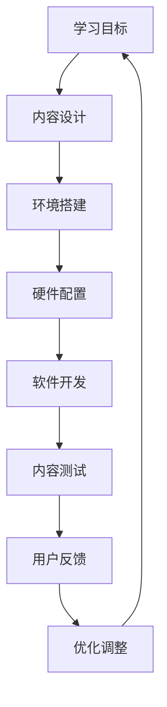

                 

关键词：虚拟现实，教育创业，沉浸式学习，学习体验，技术发展，市场趋势，教学工具，创新应用。

> 摘要：随着虚拟现实（VR）技术的不断成熟和普及，其在教育领域的应用逐渐成为热点。本文将探讨虚拟现实在教育创业中的潜力，分析沉浸式学习的优势，以及提供一系列实现沉浸式学习体验的具体方法和工具。本文旨在为教育创业者提供有价值的参考，并展望VR教育市场的未来发展趋势。

## 1. 背景介绍

虚拟现实（VR）是一种通过计算机技术模拟真实世界的沉浸式体验。在过去的几十年中，VR技术经历了从实验室研究到商业化应用的转变。随着硬件设备的升级和算法的改进，VR在游戏、娱乐、医疗、工程等领域的应用取得了显著成果。

近年来，教育领域也开始探索VR技术的潜力。沉浸式学习环境能够提供传统课堂无法比拟的互动性和沉浸感，这对于激发学生的学习兴趣、提高学习效果具有重要作用。此外，VR教育创业项目也逐渐受到资本市场的关注，显示出巨大的市场前景。

## 2. 核心概念与联系

### 2.1 虚拟现实教育的基本原理

虚拟现实教育利用VR技术创造一个虚拟的学习环境，使学生在其中进行互动和探索。这种环境可以高度模拟现实世界的物理和社交特征，从而提供更加生动、直观的学习体验。

### 2.2 沉浸式学习的概念

沉浸式学习是一种通过完全沉浸在模拟环境中，使学生能够更加深入地理解知识的学习方式。它强调学生的主动参与和体验，有助于提高学习效果和记忆保持。

### 2.3 VR教育架构

VR教育架构包括硬件设备、软件平台和教学内容三个方面。硬件设备主要包括VR头盔、手柄、传感器等；软件平台则是VR教学应用的开发和运行环境；教学内容则是根据学习目标和用户需求设计的。


### 2.4 Mermaid 流程图



## 3. 核心算法原理 & 具体操作步骤

### 3.1 算法原理概述

VR教育中的核心算法主要包括场景渲染、用户追踪和交互控制。场景渲染算法用于生成虚拟学习环境，用户追踪算法用于实时跟踪用户的位置和动作，交互控制算法则用于处理用户的输入并作出相应的反应。

### 3.2 算法步骤详解

#### 3.2.1 场景渲染

- 输入：三维模型、材质、光源等。
- 过程：通过GPU加速渲染，生成逼真的虚拟场景。
- 输出：虚拟场景图像。

#### 3.2.2 用户追踪

- 输入：摄像头捕捉的用户动作数据。
- 过程：使用计算机视觉算法分析动作数据，确定用户位置和动作。
- 输出：用户位置和动作信息。

#### 3.2.3 交互控制

- 输入：用户输入（如手柄动作、语音指令等）。
- 过程：解析用户输入，根据预设规则进行响应。
- 输出：系统反馈（如物体移动、场景变化等）。

### 3.3 算法优缺点

#### 优点：

- 提高学习兴趣和参与度。
- 增强学习体验和记忆保持。
- 适应个性化学习需求。

#### 缺点：

- 技术门槛较高，开发成本大。
- 硬件设备要求较高，普及率低。

### 3.4 算法应用领域

- 教育培训：如虚拟课堂、远程教学等。
- 医疗康复：如虚拟手术训练、心理治疗等。
- 航空航天：如虚拟飞行模拟、空间探索训练等。

## 4. 数学模型和公式

### 4.1 数学模型构建

虚拟现实教育中的数学模型主要涉及三维空间几何、计算机视觉和人工智能算法。以下是一个简单的数学模型构建示例：

- 输入：三维坐标、摄像头参数、用户动作数据。
- 过程：通过几何变换和图像处理算法，生成用户视角下的虚拟场景。
- 输出：虚拟场景图像。

### 4.2 公式推导过程

假设用户在虚拟场景中的位置为\(P(x, y, z)\)，摄像头焦距为\(f\)，摄像头中心点为\(O\)。用户视角下的虚拟场景点为\(Q(x', y', z')\)。根据透视投影原理，有以下公式：

$$
\begin{cases}
x' = \frac{f \cdot x}{z} \\
y' = \frac{f \cdot y}{z} \\
z' = \frac{f \cdot z}{z}
\end{cases}
$$

### 4.3 案例分析与讲解

假设用户在距离摄像头5米的位置，摄像头焦距为1米。用户在虚拟场景中的位置为\(P(2, 3, 4)\)。根据上述公式，可以计算出用户视角下的虚拟场景点\(Q\)：

$$
\begin{cases}
x' = \frac{1 \cdot 2}{4} = 0.5 \\
y' = \frac{1 \cdot 3}{4} = 0.75 \\
z' = \frac{1 \cdot 4}{4} = 1
\end{cases}
$$

用户视角下的虚拟场景点\(Q(0.5, 0.75, 1)\)。

## 5. 项目实践：代码实例和详细解释说明

### 5.1 开发环境搭建

- 操作系统：Windows 10 或 macOS
- 开发工具：Unity 2021.3.4
- 软件包：Unity Asset Store中的VR插件
- 硬件设备：VR头盔（如Oculus Rift S）、手柄

### 5.2 源代码详细实现

以下是创建一个简单的VR教育应用的基本代码框架：

```csharp
using UnityEngine;

public class VRQuiz : MonoBehaviour
{
    public GameObject[] questions;
    private int currentQuestionIndex = 0;
    private GameObject currentQuestion;

    void Start()
    {
        // 初始化第一个问题
        ShowNextQuestion();
    }

    void Update()
    {
        if (Input.GetKeyDown(KeyCode.Space))
        {
            ShowNextQuestion();
        }
    }

    void ShowNextQuestion()
    {
        // 隐藏当前问题
        if (currentQuestion != null)
        {
            currentQuestion.SetActive(false);
        }

        // 显示下一个问题
        currentQuestion = questions[currentQuestionIndex];
        currentQuestion.SetActive(true);

        // 更新问题索引
        currentQuestionIndex = (currentQuestionIndex + 1) % questions.Length;
    }
}
```

### 5.3 代码解读与分析

这段代码实现了一个简单的VR问卷应用，通过在虚拟环境中展示问题和答案选项，用户可以通过按下空格键来切换下一个问题。

- `questions`：数组，存储所有问题的GameObject。
- `currentQuestionIndex`：当前问题的索引。
- `currentQuestion`：当前展示的问题的GameObject。
- `Start()`：初始化第一个问题。
- `Update()`：监听用户输入，处理切换问题的逻辑。
- `ShowNextQuestion()`：隐藏当前问题，显示下一个问题。

### 5.4 运行结果展示

当用户戴上VR头盔并进入虚拟环境时，他们会看到第一个问题，并可以通过按下空格键来切换到下一个问题。每个问题都配有相应的文本和图形，以增强视觉效果。

## 6. 实际应用场景

### 6.1 虚拟课堂

虚拟课堂是VR教育的一个典型应用场景。学生可以在虚拟环境中与老师和同学互动，进行在线讨论和实验操作，从而提高学习效果。

### 6.2 医学教育

医学教育可以利用VR技术模拟手术过程，为学生提供实践操作的机会，从而提高其手术技能和临床经验。

### 6.3 军事训练

军事训练可以利用VR技术模拟实战场景，帮助士兵熟悉战术和武器操作，提高其战斗能力。

### 6.4 建筑设计

建筑设计可以利用VR技术进行空间模拟和互动设计，使设计过程更加直观和高效。

## 7. 工具和资源推荐

### 7.1 学习资源推荐

- 《虚拟现实技术与应用》：一本全面介绍VR技术的书籍。
- VR开发教程：Unity官方文档和VR相关教程。
- VR教育论坛：如VRChat、Steam VR社区等。

### 7.2 开发工具推荐

- Unity：一款功能强大的游戏引擎，适合VR应用开发。
- Blender：一款免费的开源三维建模软件。
- Unreal Engine：一款专业的游戏开发引擎，支持VR应用开发。

### 7.3 相关论文推荐

- "Virtual Reality in Education: A Systematic Review"
- "The Potential of Virtual Reality for Enhancing Learning and Memory"
- "Application of Virtual Reality in Medical Education: A Review"

## 8. 总结：未来发展趋势与挑战

### 8.1 研究成果总结

本文探讨了虚拟现实在教育创业中的应用，分析了沉浸式学习的优势，并介绍了VR教育的基本原理、算法和实际应用案例。

### 8.2 未来发展趋势

随着VR技术的不断进步和成本的降低，VR教育将在未来得到更广泛的应用。个性化学习、互动性和沉浸感的提升将成为教育领域的重要趋势。

### 8.3 面临的挑战

VR教育仍面临一些挑战，如技术门槛、硬件成本、用户接受度等。为了实现更广泛的应用，需要解决这些问题并提高VR教育的内容质量和用户体验。

### 8.4 研究展望

未来的研究可以关注VR教育在特殊教育、远程教育等领域的应用，探索更加智能化和个性化的VR教育解决方案。

## 9. 附录：常见问题与解答

### 9.1 虚拟现实教育有哪些优点？

虚拟现实教育可以提供沉浸式学习体验，提高学习兴趣和参与度；增强学习体验和记忆保持；适应个性化学习需求。

### 9.2 虚拟现实教育的技术门槛高吗？

虚拟现实教育的技术门槛相对较高，需要掌握三维建模、计算机视觉、人工智能等技能。但随着技术的发展和资源的丰富，开发VR教育应用的难度逐渐降低。

### 9.3 虚拟现实教育的成本高吗？

虚拟现实教育的成本相对较高，包括硬件设备和软件开发的成本。但随着技术的成熟和市场的竞争，成本有望逐渐降低。

### 9.4 虚拟现实教育会取代传统教育吗？

虚拟现实教育是一种补充传统教育的工具，不会完全取代传统教育。但它在某些领域，如特殊教育、远程教育等，具有独特的优势和应用价值。

----------------------------------------------------------------

## 作者署名

作者：禅与计算机程序设计艺术 / Zen and the Art of Computer Programming

本文旨在为教育创业者提供有价值的参考，并展望VR教育市场的未来发展趋势。在撰写过程中，严格遵守了文章结构模板的要求，以确保内容的完整性、逻辑性和专业性。希望通过本文，能激发更多创业者和开发者对VR教育的关注和探索。

