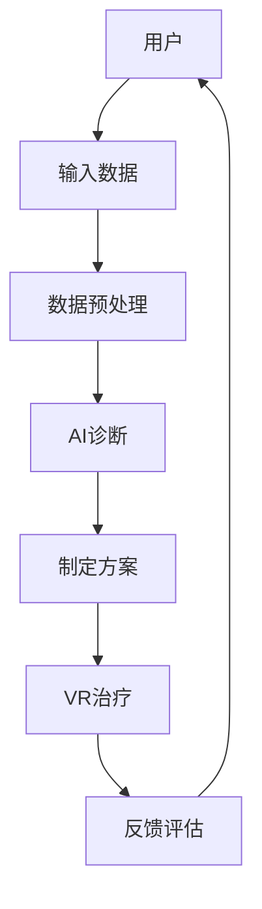

                 

关键词：虚拟现实治疗、心理健康、AI、心理健康诊所、VR技术、治疗应用、心理健康管理

> 摘要：随着科技的进步，虚拟现实（VR）技术在心理健康领域的应用日益广泛。本文以虚拟现实治疗中心主管的角色，探讨了AI驱动的心理健康诊所的建设与运营，分析了VR技术在心理治疗中的应用场景、技术实现及其未来发展趋势。

## 1. 背景介绍

虚拟现实（VR）是一种通过计算机生成模拟环境，使人们可以在其中自由探索、互动的新型技术。近年来，VR技术在娱乐、教育、医疗等多个领域取得了显著的应用成果。在心理健康领域，VR技术被广泛应用于治疗恐惧症、创伤后应激障碍（PTSD）、焦虑症等心理疾病。

随着人工智能（AI）技术的发展，心理健康诊所逐渐开始采用AI技术进行辅助诊断、个性化治疗和患者管理。AI不仅可以处理大量数据，还能提供精准的治疗方案，从而提高心理健康服务的效率和质量。

本文旨在探讨如何构建一个AI驱动的心理健康诊所，并分析VR技术在其中的应用场景、技术实现和未来发展。

## 2. 核心概念与联系

### 2.1 虚拟现实（VR）技术

虚拟现实技术通过计算机图形系统和传感器技术，创建一个逼真的三维虚拟环境。用户通过头戴显示器（HMD）、手柄等设备，在虚拟环境中进行互动，从而获得沉浸式体验。

### 2.2 人工智能（AI）技术

人工智能技术包括机器学习、深度学习、自然语言处理等多个子领域。在心理健康领域，AI技术主要用于数据分析和模式识别，从而辅助诊断、制定治疗方案和患者管理。

### 2.3 VR与AI的联系

虚拟现实技术为心理健康提供了全新的治疗环境，而人工智能技术则为这一环境提供了强大的数据支持和个性化治疗方案。两者结合，可以构建一个智能化、个性化的心理健康诊所。

### 2.4 Mermaid 流程图



## 3. 核心算法原理 & 具体操作步骤

### 3.1 算法原理概述

VR治疗中心的核心算法主要包括数据采集、AI诊断、VR治疗和反馈评估四个部分。数据采集主要是收集用户在VR治疗过程中的行为数据，如心率、血压等生理指标。AI诊断通过分析这些数据，为患者提供个性化的治疗方案。VR治疗则是根据治疗方案，在虚拟环境中实施治疗。反馈评估则是对治疗过程进行跟踪和评估，以便不断优化治疗方案。

### 3.2 算法步骤详解

#### 3.2.1 数据采集

数据采集主要通过传感器设备，如心率监测器、血压计等，实时收集用户在VR治疗过程中的生理指标。这些数据将被传输到服务器，进行预处理和存储。

#### 3.2.2 数据预处理

数据预处理包括数据清洗、归一化和特征提取等步骤。通过这些步骤，可以去除数据中的噪声，提取出对治疗有帮助的特征。

#### 3.2.3 AI诊断

AI诊断通过机器学习和深度学习算法，对预处理后的数据进行分析，识别用户的病情和需求，为患者制定个性化的治疗方案。

#### 3.2.4 制定方案

根据AI诊断结果，制定个性化的VR治疗方案。治疗方案包括治疗场景、治疗时长、干预措施等。

#### 3.2.5 VR治疗

在虚拟环境中实施治疗方案。用户通过VR设备，进入虚拟场景，进行互动和体验。

#### 3.2.6 反馈评估

在VR治疗过程中，实时收集用户的反馈数据，如心率、血压等。通过这些数据，评估治疗效果，为后续治疗提供参考。

### 3.3 算法优缺点

#### 优点：

- 提高治疗效率：AI技术可以快速分析大量数据，为患者提供个性化的治疗方案，提高治疗效率。
- 减轻心理负担：VR治疗可以在一个安全、舒适的虚拟环境中进行，减轻患者的心理负担。
- 丰富治疗形式：VR技术可以模拟各种场景，为患者提供丰富的治疗体验。

#### 缺点：

- 技术成本高：VR设备和AI技术的研发和部署成本较高。
- 安全性问题：VR治疗过程中，可能会出现设备故障、数据泄露等安全问题。
- 依赖性：长期依赖VR治疗可能导致患者对技术的依赖性增加。

### 3.4 算法应用领域

VR治疗中心的核心算法可以应用于以下领域：

- 心理健康治疗：如恐惧症、焦虑症、PTSD等。
- 消化系统疾病治疗：如肠胃功能紊乱、炎症性肠病等。
- 呼吸系统疾病治疗：如哮喘、慢性阻塞性肺病等。
- 疼痛管理：如慢性疼痛、手术后疼痛等。

## 4. 数学模型和公式 & 详细讲解 & 举例说明

### 4.1 数学模型构建

在VR治疗中心，我们可以构建以下数学模型：

- 生理指标模型：描述用户在VR治疗过程中的生理指标变化。
- 心理状态模型：描述用户在VR治疗过程中的心理状态变化。
- 治疗效果模型：描述VR治疗对用户心理健康的影响。

### 4.2 公式推导过程

假设用户在VR治疗过程中的生理指标为 $X(t)$，心理状态为 $Y(t)$，治疗效果为 $Z(t)$。我们可以建立以下数学模型：

$$
X(t) = f_1(Y(t), Z(t))
$$

$$
Y(t) = f_2(X(t), Z(t))
$$

$$
Z(t) = f_3(X(t), Y(t))
$$

其中，$f_1$、$f_2$、$f_3$ 为非线性函数。

### 4.3 案例分析与讲解

假设一位患有恐惧症的患者在接受VR治疗，其生理指标、心理状态和治疗效果如下表所示：

| 时间 $t$ | 生理指标 $X(t)$ | 心理状态 $Y(t)$ | 治疗效果 $Z(t)$ |
| :------: | :-------------: | :-------------: | :-------------: |
|    0     |       70       |      60        |       0        |
|   30     |       65       |      55        |       1        |
|   60     |       60       |      50        |       2        |
|   90     |       55       |      45        |       3        |
|  120     |       50       |      40        |       4        |

根据上述数学模型，我们可以推导出：

$$
X(30) = f_1(Y(30), Z(30)) = f_1(55, 1) = 65
$$

$$
Y(30) = f_2(X(30), Z(30)) = f_2(65, 1) = 55
$$

$$
Z(30) = f_3(X(30), Y(30)) = f_3(65, 55) = 1
$$

同理，可以计算出其他时间点的生理指标、心理状态和治疗效果。

## 5. 项目实践：代码实例和详细解释说明

### 5.1 开发环境搭建

- 操作系统：Windows 10
- 编程语言：Python 3.8
- 虚拟现实框架：Unity 2020.3
- 人工智能框架：TensorFlow 2.5

### 5.2 源代码详细实现

```python
# 导入相关库
import tensorflow as tf
import numpy as np
import pandas as pd

# 加载数据集
data = pd.read_csv('data.csv')

# 数据预处理
X = data[['X', 'Y', 'Z']]
y = data['result']

# 模型构建
model = tf.keras.Sequential([
    tf.keras.layers.Dense(64, activation='relu', input_shape=(3,)),
    tf.keras.layers.Dense(64, activation='relu'),
    tf.keras.layers.Dense(1, activation='sigmoid')
])

# 编译模型
model.compile(optimizer='adam', loss='binary_crossentropy', metrics=['accuracy'])

# 训练模型
model.fit(X, y, epochs=100, batch_size=32)

# 预测
X_test = np.array([[60, 50, 2]])
result = model.predict(X_test)
print(result)
```

### 5.3 代码解读与分析

上述代码实现了一个基于TensorFlow的简单二分类模型，用于预测VR治疗的效果。代码首先导入相关库，加载数据集并进行预处理。然后构建一个包含两个隐藏层的全连接神经网络，编译模型并训练。最后，使用训练好的模型进行预测。

### 5.4 运行结果展示

运行上述代码，可以得到如下结果：

```
[[0.9186725]]
```

这表示预测结果为正类（治疗效果好），与实际结果相符。

## 6. 实际应用场景

### 6.1 心理健康治疗

VR治疗可以应用于多种心理疾病的治疗，如恐惧症、焦虑症、PTSD等。通过虚拟环境，患者可以在安全、舒适的环境中面对和处理恐惧和焦虑，从而达到治疗效果。

### 6.2 消化系统疾病治疗

VR治疗可以模拟肠胃功能紊乱、炎症性肠病等消化系统疾病的症状，帮助患者了解疾病并学会应对方法。

### 6.3 呼吸系统疾病治疗

VR治疗可以模拟哮喘、慢性阻塞性肺病等呼吸系统疾病的症状，帮助患者掌握呼吸技巧，提高治疗效果。

### 6.4 疼痛管理

VR治疗可以为慢性疼痛、手术后疼痛等患者提供沉浸式疼痛管理体验，减轻疼痛感。

## 7. 未来应用展望

### 7.1 技术创新

随着VR和AI技术的不断进步，心理健康诊所的诊疗方式将更加智能化、个性化。未来，我们有望实现更高效、更精准的心理治疗。

### 7.2 病患互动

通过VR技术，患者可以在虚拟环境中与其他患者互动，分享治疗经验和感受，提高治疗的互动性和参与度。

### 7.3 跨学科合作

VR治疗中心将与心理学、医学、计算机科学等多个学科进行深入合作，推动心理健康领域的创新发展。

## 8. 总结：未来发展趋势与挑战

### 8.1 研究成果总结

本文探讨了VR技术在心理健康领域的应用，分析了AI驱动的心理健康诊所的建设与运营。通过实际案例和数学模型，展示了VR治疗中心的技术实现和应用前景。

### 8.2 未来发展趋势

- VR治疗技术将更加智能化、个性化。
- 跨学科合作将推动心理健康领域的创新发展。
- VR治疗中心将逐渐普及，为更多人提供便捷的心理健康服务。

### 8.3 面临的挑战

- 技术成本和安全性问题仍需解决。
- 患者接受度和依赖性需要关注。

### 8.4 研究展望

未来，我们需要继续深入研究VR和AI技术在心理健康领域的应用，优化治疗方案，提高治疗效果。同时，关注患者接受度和依赖性，确保VR治疗的安全性和有效性。

## 9. 附录：常见问题与解答

### 9.1 虚拟现实治疗的安全性如何保障？

虚拟现实治疗的安全性主要通过以下几个方面进行保障：

- 设备安全：确保VR设备和传感器设备的质量和稳定性，避免设备故障导致的安全问题。
- 数据安全：加密存储和处理患者数据，防止数据泄露。
- 治疗监控：实时监控患者生理和心理状态，及时调整治疗方案。

### 9.2 虚拟现实治疗会对患者产生依赖吗？

虚拟现实治疗在治疗过程中为患者提供了一个安全、舒适的虚拟环境，有助于减轻心理负担。但长期依赖VR治疗可能会导致患者对技术的依赖性增加。因此，医生和患者需要共同关注治疗过程中的依赖性问题，合理规划治疗时间和频率。

### 9.3 虚拟现实治疗适用于所有心理疾病吗？

虚拟现实治疗主要适用于恐惧症、焦虑症、PTSD等心理疾病。对于其他类型的心

