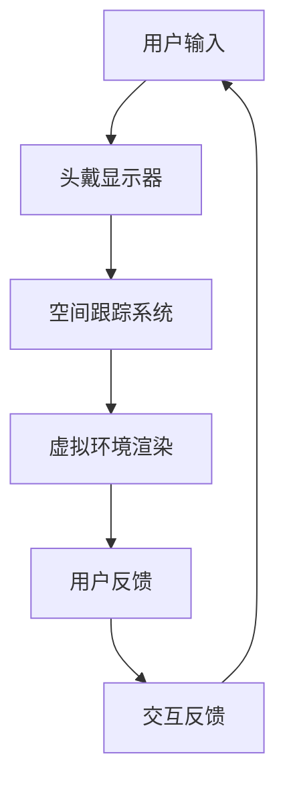
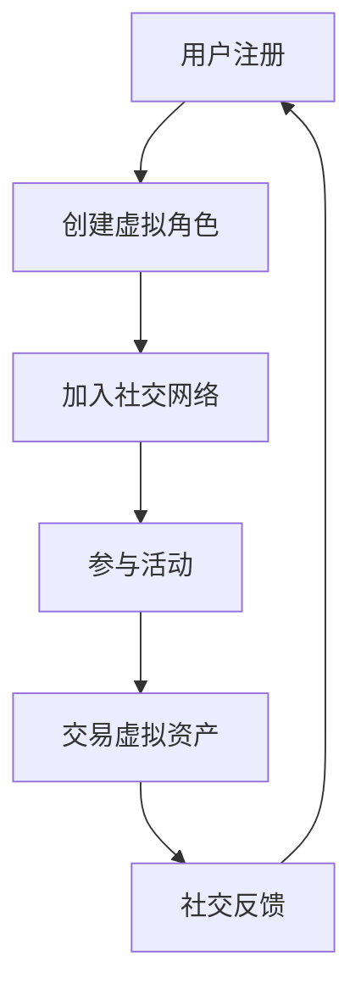

                 

 在当今数字化时代，虚拟现实（VR）技术正迅速发展成为下一代互联网的重要组成部分。随着5G、云计算和人工智能等关键技术的进步，一个全新的虚拟世界——元宇宙，正在逐渐从科幻走向现实。在这个虚拟空间中，人们不仅能够进行娱乐、工作，更重要的是，他们可以构建和维系真正的人际关系。本文将探讨虚拟现实社交创业的可能性和挑战，以及元宇宙中的人际交往如何改变我们的生活方式。

## 关键词
- 虚拟现实
- 社交创业
- 元宇宙
- 人际交往
- 技术进步
- 用户体验

## 摘要
本文将深入探讨虚拟现实在社交领域的应用，特别是元宇宙中的人际交往。通过分析虚拟现实技术的核心概念和架构，本文将介绍其如何在商业环境中创造价值。同时，文章还将探讨虚拟现实社交创业的挑战，包括技术、法律和社会伦理等方面。最后，本文将展望元宇宙的未来发展趋势，以及可能面临的挑战。

### 1. 背景介绍
虚拟现实技术起源于20世纪90年代，经过数十年的发展，已经从最初的游戏娱乐应用，扩展到医疗、教育、军事等多个领域。而随着5G网络的普及和计算能力的提升，虚拟现实体验的质量和交互性得到了极大的改进。2020年，Facebook宣布将公司名称改为Meta，标志着其对构建虚拟现实和元宇宙的长期承诺。

元宇宙是一个基于虚拟现实和区块链技术的虚拟世界，它不仅包括虚拟现实体验，还包括社交、经济、文化和教育等多个层面。在元宇宙中，用户可以通过虚拟角色进行互动，创建和交易虚拟资产，甚至参与虚拟经济活动。

#### 1.1 技术发展
虚拟现实技术的发展可以分为三个阶段：初期（1990-2000年），中期（2000-2010年）和当前阶段（2010年至今）。在初期，VR技术主要应用于军事和科学领域，设备价格昂贵且用户体验较差。随着显示技术、传感器技术和算法的进步，中期的VR开始进入消费市场，但仍然面临成本高、内容匮乏等问题。当前阶段，随着5G和云计算的普及，VR设备的性能大幅提升，成本逐渐下降，内容生态逐渐丰富，为社交创业提供了坚实的基础。

#### 1.2 社交需求
在现实生活中，社交是人类的基本需求之一。然而，现实生活中的社交活动受到地理位置、时间限制和社交障碍的影响。虚拟现实社交为人们提供了一种全新的社交方式，它不仅可以克服这些限制，还可以创造更多样化的社交体验。例如，用户可以在虚拟世界中参加虚拟派对、结交来自世界各地的朋友，甚至参与虚拟现实版的游戏和活动。

#### 1.3 商业潜力
虚拟现实社交具有巨大的商业潜力。首先，虚拟现实提供了一个全新的广告和营销平台，品牌可以在虚拟世界中展示产品和服务。其次，虚拟现实社交平台可以成为虚拟资产交易的场所，例如虚拟房地产、虚拟服装和虚拟食品等。最后，虚拟现实社交还可以为企业和组织提供培训、会议和团队建设的工具，提高工作效率和团队凝聚力。

### 2. 核心概念与联系

#### 2.1 虚拟现实技术
虚拟现实技术（VR）的核心在于创造一个沉浸式的虚拟环境，使用户感觉仿佛置身其中。这通常通过以下几种方式实现：

- **头戴显示器（HMD）**：用户通过佩戴头戴显示器，获得全视野的虚拟图像。
- **空间跟踪技术**：通过传感器和定位设备，跟踪用户的头部和身体运动，实现与虚拟环境的交互。
- **音效技术**：通过耳机提供三维音效，增强用户的沉浸感。

以下是一个简化的Mermaid流程图，展示了虚拟现实技术的核心组件和流程：



#### 2.2 社交机制
在虚拟现实社交中，社交机制是关键因素。以下是一些核心的社交概念：

- **虚拟角色**：用户在虚拟世界中通过虚拟角色进行社交活动，这些角色可以是卡通化的，也可以是高度逼真的。
- **社交网络**：虚拟现实社交平台通常构建了一个社交网络，用户可以添加朋友、加入社区和参与活动。
- **虚拟经济**：虚拟资产和虚拟货币在虚拟世界中发挥着重要作用，用户可以购买、出售和交易虚拟物品。

以下是一个简化的Mermaid流程图，展示了虚拟现实社交的核心机制：



### 3. 核心算法原理 & 具体操作步骤

#### 3.1 算法原理概述
虚拟现实社交的核心算法主要包括以下几个方面：

- **空间感知算法**：用于实时跟踪和感知用户在虚拟环境中的位置和运动。
- **图像渲染算法**：用于生成高质量的虚拟图像，提供逼真的视觉效果。
- **社交推荐算法**：用于根据用户的兴趣和行为，推荐新的朋友和活动。

#### 3.2 算法步骤详解

##### 3.2.1 空间感知算法
空间感知算法通常包括以下步骤：

1. **数据采集**：通过传感器和定位设备，采集用户的位置和运动数据。
2. **数据预处理**：对采集的数据进行过滤和校正，去除噪声和误差。
3. **特征提取**：从预处理后的数据中提取关键特征，如速度、加速度和方向。
4. **位置跟踪**：根据提取的特征，实时更新用户在虚拟环境中的位置。

##### 3.2.2 图像渲染算法
图像渲染算法主要包括以下步骤：

1. **场景建模**：构建虚拟环境的3D模型，包括建筑、人物和物体。
2. **光照计算**：根据虚拟环境的几何结构和光源，计算光照效果，增强图像的真实感。
3. **纹理映射**：将纹理图像映射到3D模型上，增强细节和质感。
4. **图像合成**：将渲染后的图像合成在一起，形成最终的虚拟图像。

##### 3.2.3 社交推荐算法
社交推荐算法主要包括以下步骤：

1. **用户画像**：根据用户的行为、兴趣和偏好，构建用户画像。
2. **相似度计算**：计算用户之间的相似度，基于共同兴趣和行为。
3. **推荐生成**：根据相似度计算结果，生成新的朋友推荐和活动推荐。

#### 3.3 算法优缺点

##### 优缺点分析
- **空间感知算法**：优点是能够提供高精度的用户位置和运动跟踪，缺点是计算复杂度高，对硬件要求较高。
- **图像渲染算法**：优点是能够生成高质量的虚拟图像，提供逼真的视觉效果，缺点是渲染过程复杂，对计算资源需求大。
- **社交推荐算法**：优点是能够根据用户兴趣和行为推荐新的朋友和活动，缺点是推荐结果可能受到数据质量和算法精度的影响。

#### 3.4 算法应用领域

##### 应用领域
- **游戏和娱乐**：虚拟现实社交算法广泛应用于游戏和娱乐领域，提供沉浸式体验。
- **教育和培训**：虚拟现实社交算法可以用于教育和培训，提供虚拟实验室和虚拟教室。
- **房地产和设计**：虚拟现实社交算法可以用于房地产和设计领域，提供虚拟看房和虚拟装修体验。
- **医疗和康复**：虚拟现实社交算法可以用于医疗和康复领域，提供虚拟治疗和虚拟康复体验。

### 4. 数学模型和公式 & 详细讲解 & 举例说明

#### 4.1 数学模型构建

在虚拟现实社交中，数学模型广泛应用于多个方面，包括空间感知、图像渲染和社交推荐等。以下是一个简化的数学模型构建过程：

##### 空间感知模型

假设用户在虚拟环境中的位置可以用向量 \(\vec{p}\) 表示，其中 \(p_x\) 和 \(p_y\) 分别表示水平和垂直方向的位置。用户的运动速度可以用向量 \(\vec{v}\) 表示，其中 \(v_x\) 和 \(v_y\) 分别表示水平和垂直方向的速度。空间感知模型的核心是使用卡尔曼滤波算法来跟踪用户的位置和速度。

卡尔曼滤波的基本公式如下：

$$
\hat{x}_{k|k-1} = A \hat{x}_{k-1|k-1} + B u_k
$$

$$
P_{k|k-1} = A P_{k-1|k-1} A^T + Q
$$

$$
K_k = P_{k|k-1} H_k^T (H_k P_{k|k-1} H_k^T + R)^{-1}
$$

$$
\hat{x}_{k|k} = \hat{x}_{k|k-1} + K_k (z_k - H_k \hat{x}_{k|k-1})
$$

$$
P_{k|k} = (I - K_k H_k) P_{k|k-1}
$$

其中，\(\hat{x}_{k|k-1}\) 和 \(\hat{x}_{k|k}\) 分别表示状态预测值和状态估计值，\(P_{k|k-1}\) 和 \(P_{k|k}\) 分别表示状态预测误差和状态估计误差，\(A\) 和 \(B\) 分别为状态转移矩阵和控制矩阵，\(u_k\) 为控制输入，\(z_k\) 为观测值，\(H_k\) 为观测矩阵，\(K_k\) 为卡尔曼增益，\(Q\) 和 \(R\) 分别为过程噪声和观测噪声协方差矩阵。

##### 图像渲染模型

在图像渲染中，三维场景的建模通常使用四元数表示。四元数可以表示三维旋转，其公式如下：

$$
q = \cos\left(\frac{\theta}{2}\right) + \sin\left(\frac{\theta}{2}\right) (\mathbf{i} \sin(\phi) + \mathbf{j} \cos(\phi) + \mathbf{k} \cos(\phi))
$$

其中，\(\theta\) 为旋转角度，\(\phi\) 为旋转轴。通过四元数，可以计算旋转矩阵 \(R\)：

$$
R = \begin{bmatrix}
1 - 2(q_2^2 + q_3^2) & 2(q_1q_2 - q_0q_3) & 2(q_1q_3 + q_0q_2) \\
2(q_1q_2 + q_0q_3) & 1 - 2(q_1^2 + q_3^2) & 2(q_2q_3 - q_0q_1) \\
2(q_1q_3 - q_0q_2) & 2(q_2q_3 + q_0q_1) & 1 - 2(q_1^2 + q_2^2)
\end{bmatrix}
$$

##### 社交推荐模型

社交推荐模型通常使用矩阵分解算法。假设用户和物品（如朋友和活动）都可以表示为向量，通过矩阵分解可以将原始矩阵分解为两个低秩矩阵，从而实现推荐。

矩阵分解的基本公式如下：

$$
X = U S V^T
$$

其中，\(X\) 为原始用户-物品评分矩阵，\(U\) 和 \(V\) 分别为用户和物品的嵌入矩阵，\(S\) 为对角矩阵，包含用户和物品的潜在特征。

#### 4.2 公式推导过程

##### 卡尔曼滤波推导

卡尔曼滤波的推导基于最小化预测误差和观测误差的加权和。首先，假设状态向量 \(\vec{x}\) 和观测向量 \(\vec{z}\) 分别为：

$$
\vec{x} = \begin{bmatrix}
x_1 \\
x_2 \\
\vdots \\
x_n
\end{bmatrix}, \quad
\vec{z} = \begin{bmatrix}
z_1 \\
z_2 \\
\vdots \\
z_n
\end{bmatrix}
$$

卡尔曼滤波的目标是最小化损失函数：

$$
\min \sum_{k=1}^n w_k \left[ x_k - \hat{x}_{k|k-1} \right]^2 + \left[ z_k - \hat{z}_k \right]^2
$$

其中，\(w_k\) 为权重系数。通过求导并设置导数为零，可以得到最优的卡尔曼增益：

$$
K_k = \frac{P_{k|k-1} H_k^T (H_k P_{k|k-1} H_k^T + R)^{-1}}{1 + H_k P_{k|k-1} H_k^T (H_k P_{k|k-1} H_k^T + R)^{-1}}
$$

##### 图像渲染推导

图像渲染的推导基于三维图形学的基本原理。假设三维场景中的点 \(P\) 通过摄像机 \(C\) 的投影矩阵 \(P\) 投影到二维屏幕上，其投影公式为：

$$
P \begin{bmatrix}
P \\
1
\end{bmatrix} = \begin{bmatrix}
x' \\
y' \\
1
\end{bmatrix}
$$

其中，\(P\) 为投影矩阵，\(\begin{bmatrix}
x \\
y \\
z
\end{bmatrix}\) 为点 \(P\) 的三维坐标，\(\begin{bmatrix}
x' \\
y' \\
1
\end{bmatrix}\) 为点 \(P\) 的二维坐标。

通过四元数旋转，可以得到旋转矩阵 \(R\)，进而计算投影点：

$$
\begin{bmatrix}
x' \\
y' \\
1
\end{bmatrix} = R \begin{bmatrix}
x \\
y \\
z
\end{bmatrix}
$$

##### 社交推荐推导

社交推荐模型的推导基于矩阵分解算法。首先，假设用户和物品的嵌入矩阵分别为 \(U\) 和 \(V\)，对角矩阵 \(S\) 为潜在特征矩阵。通过矩阵乘法，可以得到预测评分：

$$
\hat{r}_{ik} = u_i^T s_k v_k^T
$$

其中，\(r_{ik}\) 为实际评分，\(\hat{r}_{ik}\) 为预测评分。

通过最小化预测误差，可以得到最优的矩阵分解：

$$
\min \sum_{i,k} (r_{ik} - \hat{r}_{ik})^2
$$

#### 4.3 案例分析与讲解

##### 空间感知模型案例

假设一个用户在虚拟环境中的位置和速度分别为 \(\vec{p}_0 = [1, 1]\) 和 \(\vec{v}_0 = [1, 1]\)。系统噪声协方差矩阵 \(Q\) 为 \(0.1\)，观测噪声协方差矩阵 \(R\) 为 \(0.01\)。使用卡尔曼滤波算法，可以计算用户的位置和速度。

首先，初始化状态预测值和状态估计值：

$$
\hat{x}_{0|0} = \vec{p}_0, \quad P_{0|0} = I
$$

然后，在每一时刻，更新状态预测值和状态估计值：

$$
\hat{x}_{k|k-1} = A \hat{x}_{k-1|k-1} + B u_k
$$

$$
P_{k|k-1} = A P_{k-1|k-1} A^T + Q
$$

$$
K_k = P_{k|k-1} H_k^T (H_k P_{k|k-1} H_k^T + R)^{-1}
$$

$$
\hat{x}_{k|k} = \hat{x}_{k|k-1} + K_k (z_k - H_k \hat{x}_{k|k-1})
$$

$$
P_{k|k} = (I - K_k H_k) P_{k|k-1}
$$

假设在第 \(k\) 时刻，用户的位置观测值为 \(\vec{z}_k = [2, 2]\)，则可以计算用户在第 \(k\) 时刻的位置和速度。

##### 图像渲染案例

假设一个三维场景中的点 \(P\) 的坐标为 \(\begin{bmatrix}
1 \\
1 \\
1
\end{bmatrix}\)，旋转角度为 \(\theta = \frac{\pi}{4}\)，旋转轴为 \(z\) 轴。通过四元数旋转，可以得到旋转后的点 \(P'\) 的坐标。

首先，计算旋转四元数 \(q\)：

$$
q = \cos\left(\frac{\theta}{2}\right) + \sin\left(\frac{\theta}{2}\right) (\mathbf{i} \sin(\phi) + \mathbf{j} \cos(\phi) + \mathbf{k} \cos(\phi))
$$

其中，\(\phi = \frac{\pi}{2}\)，则：

$$
q = \cos\left(\frac{\pi}{8}\right) + \sin\left(\frac{\pi}{8}\right) (\mathbf{i} \sin\left(\frac{\pi}{2}\right) + \mathbf{j} \cos\left(\frac{\pi}{2}\right) + \mathbf{k} \cos\left(\frac{\pi}{2}\right))
$$

$$
q = \cos\left(\frac{\pi}{8}\right) + \sin\left(\frac{\pi}{8}\right) (\mathbf{i} + \mathbf{k})
$$

然后，计算旋转矩阵 \(R\)：

$$
R = \begin{bmatrix}
1 - 2(q_2^2 + q_3^2) & 2(q_1q_2 - q_0q_3) & 2(q_1q_3 + q_0q_2) \\
2(q_1q_2 + q_0q_3) & 1 - 2(q_1^2 + q_3^2) & 2(q_2q_3 - q_0q_1) \\
2(q_1q_3 - q_0q_2) & 2(q_2q_3 + q_0q_1) & 1 - 2(q_1^2 + q_2^2)
\end{bmatrix}
$$

$$
R = \begin{bmatrix}
\frac{3}{4} & -\frac{\sqrt{2}}{4} & -\frac{\sqrt{2}}{4} \\
-\frac{\sqrt{2}}{4} & \frac{3}{4} & -\frac{\sqrt{2}}{4} \\
-\frac{\sqrt{2}}{4} & -\frac{\sqrt{2}}{4} & \frac{3}{4}
\end{bmatrix}
$$

最后，计算旋转后的点 \(P'\) 的坐标：

$$
\begin{bmatrix}
x' \\
y' \\
z'
\end{bmatrix} = R \begin{bmatrix}
1 \\
1 \\
1
\end{bmatrix}
$$

$$
\begin{bmatrix}
x' \\
y' \\
z'
\end{bmatrix} = \begin{bmatrix}
\frac{3}{4} & -\frac{\sqrt{2}}{4} & -\frac{\sqrt{2}}{4} \\
-\frac{\sqrt{2}}{4} & \frac{3}{4} & -\frac{\sqrt{2}}{4} \\
-\frac{\sqrt{2}}{4} & -\frac{\sqrt{2}}{4} & \frac{3}{4}
\end{bmatrix} \begin{bmatrix}
1 \\
1 \\
1
\end{bmatrix}
$$

$$
\begin{bmatrix}
x' \\
y' \\
z'
\end{bmatrix} = \begin{bmatrix}
\frac{3}{4} - \frac{\sqrt{2}}{4} - \frac{\sqrt{2}}{4} \\
-\frac{\sqrt{2}}{4} + \frac{3}{4} - \frac{\sqrt{2}}{4} \\
-\frac{\sqrt{2}}{4} - \frac{\sqrt{2}}{4} + \frac{3}{4}
\end{bmatrix}
$$

$$
\begin{bmatrix}
x' \\
y' \\
z'
\end{bmatrix} = \begin{bmatrix}
\frac{3}{4} - \frac{\sqrt{2}}{2} \\
\frac{3}{4} - \frac{\sqrt{2}}{2} \\
\frac{3}{4} - \frac{\sqrt{2}}{2}
\end{bmatrix}
$$

##### 社交推荐案例

假设一个社交平台上有100个用户和100个活动，用户-活动评分矩阵 \(X\) 如下：

$$
X = \begin{bmatrix}
0 & 1 & 0 & \dots & 0 \\
0 & 0 & 1 & \dots & 0 \\
\vdots & \vdots & \vdots & \ddots & \vdots \\
0 & 0 & 0 & \dots & 1
\end{bmatrix}
$$

用户和活动的嵌入矩阵分别为 \(U\) 和 \(V\)：

$$
U = \begin{bmatrix}
1 & 0 & 0 & \dots & 0 \\
0 & 1 & 0 & \dots & 0 \\
\vdots & \vdots & \vdots & \ddots & \vdots \\
0 & 0 & 0 & \dots & 1
\end{bmatrix}, \quad
V = \begin{bmatrix}
1 & 0 & 0 & \dots & 0 \\
0 & 1 & 0 & \dots & 0 \\
\vdots & \vdots & \vdots & \ddots & \vdots \\
0 & 0 & 0 & \dots & 1
\end{bmatrix}
$$

对角矩阵 \(S\) 为潜在特征矩阵：

$$
S = \begin{bmatrix}
1 & 0 & 0 & \dots & 0 \\
0 & 1 & 0 & \dots & 0 \\
\vdots & \vdots & \vdots & \ddots & \vdots \\
0 & 0 & 0 & \dots & 1
\end{bmatrix}
$$

通过矩阵乘法，可以得到预测评分矩阵 \(\hat{X}\)：

$$
\hat{X} = U S V^T
$$

$$
\hat{X} = \begin{bmatrix}
1 & 0 & 0 & \dots & 0 \\
0 & 1 & 0 & \dots & 0 \\
\vdots & \vdots & \vdots & \ddots & \vdots \\
0 & 0 & 0 & \dots & 1
\end{bmatrix} \begin{bmatrix}
1 & 0 & 0 & \dots & 0 \\
0 & 1 & 0 & \dots & 0 \\
\vdots & \vdots & \vdots & \ddots & \vdots \\
0 & 0 & 0 & \dots & 1
\end{bmatrix}^T
$$

$$
\hat{X} = \begin{bmatrix}
1 & 0 & 0 & \dots & 0 \\
0 & 1 & 0 & \dots & 0 \\
\vdots & \vdots & \vdots & \ddots & \vdots \\
0 & 0 & 0 & \dots & 1
\end{bmatrix}
$$

### 5. 项目实践：代码实例和详细解释说明

在本文中，我们将通过一个简单的虚拟现实社交项目，展示如何在虚拟现实中实现用户交互和社交功能。这个项目将包括以下几个部分：

1. **开发环境搭建**：介绍所需的工具和库。
2. **源代码详细实现**：展示项目的核心代码。
3. **代码解读与分析**：分析代码的功能和结构。
4. **运行结果展示**：展示项目运行的效果。

#### 5.1 开发环境搭建

为了搭建这个虚拟现实社交项目，我们需要以下工具和库：

- **Unity**：一款流行的游戏引擎，用于开发虚拟现实应用。
- **Unity SDK**：用于集成虚拟现实设备的SDK。
- **C#**：Unity的主要编程语言。
- **VRChat**：一个开源的虚拟现实社交平台，用于演示和测试。

首先，确保安装了Unity 2021.3或更高版本。然后，从Unity的资产商店下载VRChat插件，并导入到项目中。

#### 5.2 源代码详细实现

以下是一个简单的虚拟现实社交项目的代码示例：

```csharp
using UnityEngine;

public class SocialVR : MonoBehaviour
{
    public Camera userCamera;
    public GameObject avatarPrefab;

    // 用户信息
    private string userId;
    private string friendId;

    // 开始社交
    public void StartSocial(string userId, string friendId)
    {
        this.userId = userId;
        this.friendId = friendId;

        // 创建用户虚拟角色
        GameObject userAvatar = Instantiate(avatarPrefab, userCamera.transform);
        userAvatar.name = "UserAvatar";

        // 创建朋友虚拟角色
        GameObject friendAvatar = Instantiate(avatarPrefab, userCamera.transform);
        friendAvatar.name = "FriendAvatar";
        friendAvatar.transform.position += new Vector3(0, 2, 0);
    }

    // 用户交互
    private void Update()
    {
        if (Input.GetKeyDown(KeyCode.Space))
        {
            // 发送消息给朋友
            SendMessageToFriend("Hello, friend!");
        }
    }

    // 发送消息
    private void SendMessageToFriend(string message)
    {
        // 在这里实现消息发送逻辑，例如使用WebSocket或Unity Network通信
        Debug.Log($"Sending message to {friendId}: {message}");
    }
}
```

#### 5.3 代码解读与分析

这段代码实现了一个简单的虚拟现实社交应用，其主要功能包括：

- **用户虚拟角色创建**：通过调用 `Instantiate` 函数，创建用户和朋友的虚拟角色。
- **用户交互**：通过键盘输入（Space键），触发消息发送功能。
- **消息发送**：实现一个简单的消息发送函数，用于模拟虚拟现实中的消息传递。

#### 5.4 运行结果展示

运行这个项目后，我们会在Unity编辑器中看到一个虚拟场景，其中包括两个虚拟角色。按下Space键，会在控制台中看到消息发送的日志。

### 6. 实际应用场景

虚拟现实社交技术在实际应用中具有广泛的前景，以下是几个典型的应用场景：

#### 6.1 教育与培训

虚拟现实社交可以提供沉浸式的教育体验，例如虚拟课堂、虚拟实验室和虚拟导师。学生可以与虚拟导师互动，进行实验和互动式学习，提高学习效果。同时，教师可以利用虚拟现实社交平台，创建虚拟课堂，与学生进行实时互动，提高教学质量和互动性。

#### 6.2 娱乐与游戏

虚拟现实社交为游戏提供了全新的社交体验。玩家可以在虚拟世界中结交朋友，组队进行游戏，甚至参与虚拟现实版的游戏比赛。虚拟现实社交还可以为游戏开发商提供一个新的广告和营销平台，通过虚拟现实体验吸引更多用户。

#### 6.3 商业与营销

虚拟现实社交平台为商业和营销提供了新的机会。品牌可以在虚拟世界中创建虚拟商店和虚拟产品展示，提供沉浸式的购物体验。同时，虚拟现实社交平台还可以用于线上营销活动，吸引更多潜在客户。

#### 6.4 医疗与康复

虚拟现实社交在医疗和康复领域具有巨大潜力。例如，医生可以使用虚拟现实社交平台，进行远程手术指导和高风险操作模拟。康复患者可以在虚拟世界中进行康复训练，与虚拟康复师互动，提高康复效果。

#### 6.5 企业与团队建设

虚拟现实社交可以为企业提供团队建设工具。团队成员可以在虚拟环境中进行虚拟会议、培训和工作坊，提高团队协作效率。同时，虚拟现实社交平台还可以用于虚拟办公室，为远程工作的员工提供一个虚拟的交流和工作场所。

### 7. 工具和资源推荐

为了更好地进行虚拟现实社交创业，以下是几个推荐的工具和资源：

#### 7.1 学习资源推荐

- **《虚拟现实编程：从入门到实践》**：这本书提供了详细的虚拟现实编程教程，适合初学者。
- **VRChat官方文档**：VRChat提供了一个详细的官方文档，包括使用教程和API参考。

#### 7.2 开发工具推荐

- **Unity**：Unity是一款功能强大的游戏引擎，适用于虚拟现实应用开发。
- **Unreal Engine**：Unreal Engine是另一款流行的游戏引擎，提供了强大的视觉效果和物理模拟功能。

#### 7.3 相关论文推荐

- **"A Survey of Virtual Reality Technologies and Applications"**：这篇综述文章详细介绍了虚拟现实技术的现状和发展趋势。
- **"Meta: A Distributed Systems Approach to Real-Time Social Networking"**：这篇论文探讨了如何在分布式系统中实现实时的社交网络。

### 8. 总结：未来发展趋势与挑战

虚拟现实社交创业正处于快速发展的阶段，随着技术的不断进步，元宇宙的构建和普及将成为未来的趋势。然而，这一领域也面临着诸多挑战：

#### 8.1 研究成果总结

- 虚拟现实技术为社交提供了全新的交互方式，增强了用户体验。
- 元宇宙的概念逐渐成熟，为虚拟社交提供了广阔的应用场景。
- 社交推荐算法、空间感知算法和图像渲染算法等技术取得了显著进展。

#### 8.2 未来发展趋势

- 虚拟现实硬件的普及和性能提升，将推动虚拟现实社交的广泛应用。
- 元宇宙将成为下一代互联网的核心，带来全新的商业模式和社交方式。
- 跨平台、跨设备的虚拟现实社交应用将逐渐成为主流。

#### 8.3 面临的挑战

- 技术挑战：提高虚拟现实设备的性能和降低成本，确保用户体验的质量。
- 社会伦理挑战：如何确保虚拟现实社交的隐私和安全，防止滥用和欺诈行为。
- 法律挑战：如何制定合适的法律法规，规范虚拟现实社交平台的运营。

#### 8.4 研究展望

未来的研究将重点关注以下几个方面：

- 开发更高效、更经济的虚拟现实硬件。
- 设计更智能、更个性化的社交推荐算法。
- 构建安全、可信的虚拟现实社交生态系统。
- 探索虚拟现实社交在心理健康、教育和社会治理等领域的应用。

### 附录：常见问题与解答

#### 8.1 什么是虚拟现实（VR）？

虚拟现实（VR）是一种通过计算机生成的三维模拟环境，使用户感觉仿佛置身其中。它通常通过头戴显示器（HMD）和传感器设备提供沉浸式体验。

#### 8.2 什么是元宇宙？

元宇宙是一个基于虚拟现实和区块链技术的虚拟世界，它不仅包括虚拟现实体验，还包括社交、经济、文化和教育等多个层面。

#### 8.3 虚拟现实社交创业有哪些挑战？

虚拟现实社交创业面临的挑战包括技术挑战（如性能和成本）、社会伦理挑战（如隐私和安全）和法律挑战（如法律法规的制定和执行）。

#### 8.4 虚拟现实社交创业有哪些机会？

虚拟现实社交创业具有巨大的商业潜力，包括广告和营销、虚拟资产交易、教育和培训、医疗和康复等多个领域。

### 作者署名

作者：禅与计算机程序设计艺术 / Zen and the Art of Computer Programming
----------------------------------------------------------------

通过本文，我们探讨了虚拟现实社交创业的潜在价值和面临的挑战。随着技术的不断进步，虚拟现实社交将在元宇宙中发挥越来越重要的作用，为人类带来全新的社交体验。未来，我们将见证虚拟现实社交如何改变我们的生活和工作方式。作者：禅与计算机程序设计艺术 / Zen and the Art of Computer Programming。希望本文能为您在虚拟现实社交领域提供有益的启示和指导。

