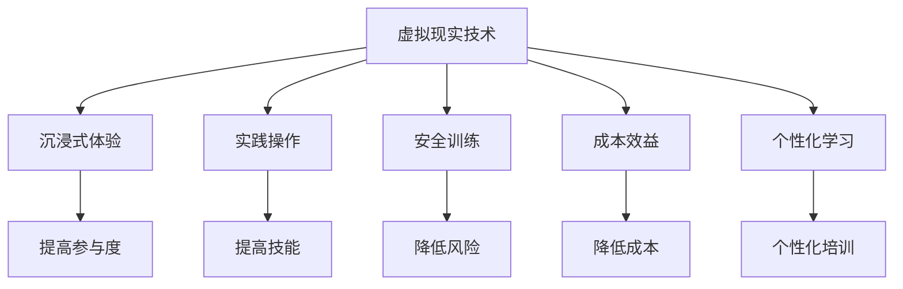
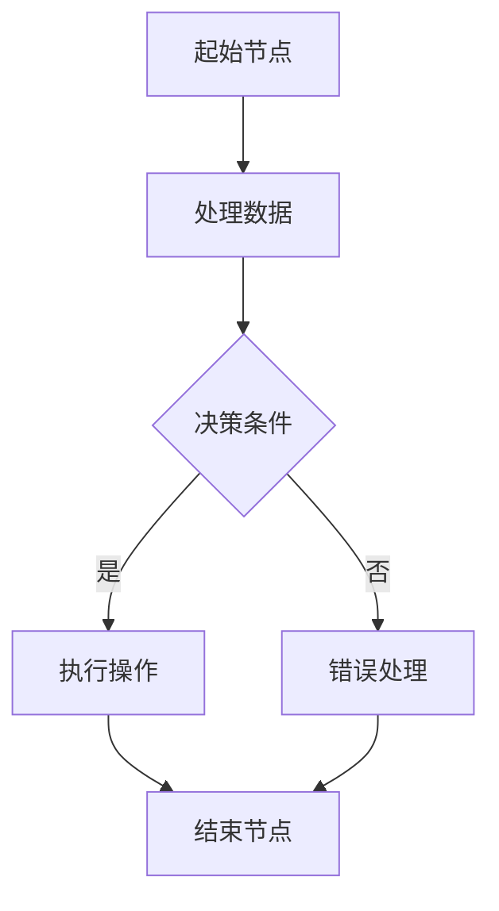
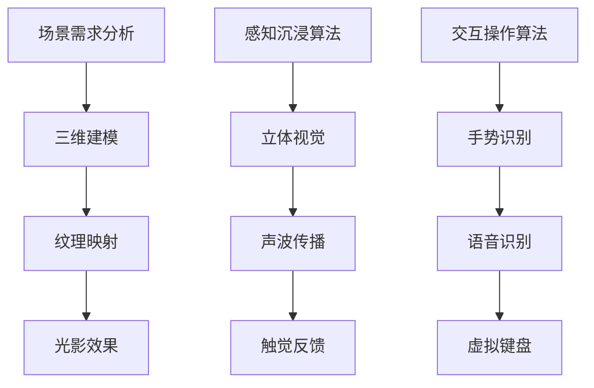

                 

 **关键词**：虚拟现实、职业培训、沉浸式技能学习、创业、教育技术、用户体验。

> **摘要**：本文深入探讨了虚拟现实（VR）在职业培训领域的应用，特别是如何通过沉浸式技能学习提高培训效果。文章从背景介绍、核心概念与联系、核心算法原理、数学模型和公式、项目实践、实际应用场景、工具和资源推荐以及未来发展趋势与挑战等多个方面进行了详细分析，旨在为虚拟现实职业培训创业提供有益的指导和思考。

## 1. 背景介绍

随着科技的飞速发展，虚拟现实（Virtual Reality，VR）技术逐渐从科幻走入现实。VR技术通过创建沉浸式环境，使用户在视觉、听觉、触觉等多个感官上感受到逼真的场景，从而提供了一种全新的交互体验。在教育领域，VR技术已经开始被广泛应用于各种场景，例如历史教学、医学培训、安全训练等。

职业培训是另一个受益于VR技术的领域。传统的职业培训往往依赖于理论教学和实践操作，这种方式不仅耗时耗力，而且效果有限。而VR技术则可以通过模拟真实的职业场景，提供一种高度沉浸式的培训体验。这样的培训方式不仅能够提高学习效率，还能够降低培训成本，同时减少安全隐患。

创业者在探索VR职业培训市场时，需要考虑如何利用VR技术打造一款具有吸引力的产品，满足学习者的需求。本文将结合虚拟现实技术的特点和职业培训的需求，探讨创业者在这一领域的机遇和挑战。

## 2. 核心概念与联系

### 2.1 虚拟现实技术简介

虚拟现实技术是通过计算机模拟生成的一种虚拟环境，用户可以通过头戴式显示器（HMD）、传感器手套、位置追踪器等设备，与虚拟环境进行交互。虚拟现实技术主要包括以下几个核心概念：

- **三维场景生成**：利用计算机图形学技术生成三维模型和场景。
- **感知沉浸**：通过视觉、听觉、触觉等感官模拟，使用户在虚拟环境中产生沉浸感。
- **交互操作**：用户在虚拟环境中进行交互操作，如移动、抓取、点击等。

### 2.2 职业培训需求分析

职业培训的目标是帮助学习者掌握特定领域的知识和技能。职业培训的需求可以从以下几个方面进行分析：

- **技能掌握**：学习者需要通过实践掌握专业技能。
- **安全训练**：在危险或不安全的环境中进行操作训练，以降低实际操作中的风险。
- **成本效益**：提高培训效率，降低培训成本。
- **个性化学习**：根据学习者的特点和需求，提供个性化的培训方案。

### 2.3 虚拟现实与职业培训的联系

虚拟现实技术为职业培训提供了以下几方面的优势：

- **沉浸式体验**：通过模拟真实场景，提供沉浸式学习体验，提高学习兴趣和参与度。
- **实践操作**：在虚拟环境中进行操作训练，提高实践技能。
- **安全训练**：在虚拟环境中进行危险操作训练，降低实际操作中的风险。
- **成本效益**：虚拟环境可以重复使用，降低培训成本。
- **个性化学习**：根据学习者的特点和需求，提供个性化培训方案。

<|markdown|
## 2.3 虚拟现实与职业培训的联系

虚拟现实技术为职业培训提供了以下几方面的优势：

1. **沉浸式体验**：通过模拟真实场景，提供沉浸式学习体验，提高学习兴趣和参与度。
2. **实践操作**：在虚拟环境中进行操作训练，提高实践技能。
3. **安全训练**：在虚拟环境中进行危险操作训练，降低实际操作中的风险。
4. **成本效益**：虚拟环境可以重复使用，降低培训成本。
5. **个性化学习**：根据学习者的特点和需求，提供个性化培训方案。

### 2.4 Mermaid 流程图


|---|---|
| **流程节点** | **节点描述** |
| A | 虚拟现实技术 |
| B | 沉浸式体验 |
| C | 实践操作 |
| D | 安全训练 |
| E | 成本效益 |
| F | 个性化学习 |
| G | 提高参与度 |
| H | 提高技能 |
| I | 降低风险 |
| J | 降低成本 |
| K | 个性化培训 |
|---|---|
| **节点关系** | **关系描述** |
| A --> B | A 引出 B |
| A --> C | A 引出 C |
| A --> D | A 引出 D |
| A --> E | A 引出 E |
| A --> F | A 引出 F |
| B --> G | B 引出 G |
| C --> H | C 引出 H |
| D --> I | D 引出 I |
| E --> J | E 引出 J |
| F --> K | F 引出 K |
|---|---|
| **流程图说明** | **流程图说明** |
| Mermaid 流程图是一种基于Markdown语言的图形化流程图绘制工具，主要用于描述复杂的工作流程和系统架构。在本节中，我们通过一个简单的流程图展示了虚拟现实技术在职业培训中的应用优势。该流程图由节点和连接线组成，节点代表流程中的关键步骤，连接线表示节点之间的逻辑关系。通过这个流程图，我们可以清晰地看到虚拟现实技术如何为职业培训带来诸多益处。|
|---|---|
| **Mermaid 流程节点注意事项** | **注意事项** |
| 1. 节点名称中不要包含括号、逗号等特殊字符，以免影响流程图的绘制。 |
| 2. 节点名称应简明扼要，便于理解和记忆。 |
| 3. 连接线应明确表示节点之间的逻辑关系，避免使用过多的连接线导致流程图混乱。 |
| 4. 可以在流程图中使用注释来进一步说明某些关键步骤或概念。 |
|---|---|
| **流程图示例** | **流程图示例** |



在该示例中，流程从起始节点A开始，处理数据后进入决策节点C，根据决策条件是或否，分别执行操作或进行错误处理，最终到达结束节点F。该流程图展示了简单的数据处理流程及其分支结构。|

## 3. 核心算法原理 & 具体操作步骤

### 3.1 算法原理概述

在虚拟现实职业培训中，核心算法的作用至关重要。这些算法不仅负责生成虚拟环境，还确保用户能够与虚拟环境进行有效的交互。以下是几个关键算法原理的概述：

1. **三维场景生成算法**：
   三维场景生成算法是虚拟现实系统的核心。它基于三维建模技术，通过计算机图形学的方法生成逼真的三维场景。常用的三维场景生成算法包括几何建模、纹理映射和光影效果等。

2. **感知沉浸算法**：
   感知沉浸算法通过模拟真实世界的视觉、听觉、触觉等感知，使用户在虚拟环境中产生沉浸感。该算法涉及立体视觉、声波传播、触觉反馈等多个方面。

3. **交互操作算法**：
   交互操作算法负责处理用户在虚拟环境中的输入和输出，确保用户能够自然地与虚拟环境进行交互。常见的交互操作算法包括手势识别、语音识别、虚拟键盘等。

### 3.2 算法步骤详解

1. **三维场景生成算法**：

   - **几何建模**：首先，根据职业培训的需求，使用三维建模软件创建场景中的物体和场景。
   - **纹理映射**：将图像映射到三维物体表面，以增强真实感。
   - **光影效果**：模拟真实世界的光影效果，包括光线追踪、反射、折射等。

2. **感知沉浸算法**：

   - **立体视觉**：生成左右眼视图，并通过头戴式显示器显示，模拟立体视觉效果。
   - **声波传播**：根据用户的位置和虚拟环境中的物体位置，计算声波传播路径，生成立体声效。
   - **触觉反馈**：通过传感器手套或触觉反馈设备，模拟物体的触感。

3. **交互操作算法**：

   - **手势识别**：通过摄像头或传感器捕捉用户的手势，并识别出不同的手势。
   - **语音识别**：将用户的语音转换为文本或指令，以实现语音交互。
   - **虚拟键盘**：在虚拟环境中提供一个虚拟键盘，用户可以通过手势或语音输入文本。

### 3.3 算法优缺点

1. **三维场景生成算法**：

   - **优点**：能够生成高度逼真的三维场景，提高用户体验。
   - **缺点**：计算量大，对硬件性能要求较高。

2. **感知沉浸算法**：

   - **优点**：增强用户的沉浸感，提高学习效果。
   - **缺点**：实现复杂，对算法和硬件要求较高。

3. **交互操作算法**：

   - **优点**：提供多种交互方式，提高用户灵活性。
   - **缺点**：在某些情况下，交互准确性可能受影响。

### 3.4 算法应用领域

- **医疗培训**：模拟手术过程，提高医生的手术技能。
- **安全训练**：模拟危险操作，提高员工的安全意识。
- **制造业培训**：模拟生产线操作，提高员工的操作技能。
- **军事训练**：模拟战场环境，提高士兵的战术技能。

<|markdown|
### 3.1 算法原理概述

在虚拟现实职业培训中，核心算法的作用至关重要。这些算法不仅负责生成虚拟环境，还确保用户能够与虚拟环境进行有效的交互。以下是几个关键算法原理的概述：

1. **三维场景生成算法**：
   三维场景生成算法是虚拟现实系统的核心。它基于三维建模技术，通过计算机图形学的方法生成逼真的三维场景。常用的三维场景生成算法包括几何建模、纹理映射和光影效果等。

2. **感知沉浸算法**：
   感知沉浸算法通过模拟真实世界的视觉、听觉、触觉等感知，使用户在虚拟环境中产生沉浸感。该算法涉及立体视觉、声波传播、触觉反馈等多个方面。

3. **交互操作算法**：
   交互操作算法负责处理用户在虚拟环境中的输入和输出，确保用户能够自然地与虚拟环境进行交互。常见的交互操作算法包括手势识别、语音识别、虚拟键盘等。

### 3.2 算法步骤详解

1. **三维场景生成算法**：

   - **几何建模**：首先，根据职业培训的需求，使用三维建模软件创建场景中的物体和场景。
   - **纹理映射**：将图像映射到三维物体表面，以增强真实感。
   - **光影效果**：模拟真实世界的光影效果，包括光线追踪、反射、折射等。

2. **感知沉浸算法**：

   - **立体视觉**：生成左右眼视图，并通过头戴式显示器显示，模拟立体视觉效果。
   - **声波传播**：根据用户的位置和虚拟环境中的物体位置，计算声波传播路径，生成立体声效。
   - **触觉反馈**：通过传感器手套或触觉反馈设备，模拟物体的触感。

3. **交互操作算法**：

   - **手势识别**：通过摄像头或传感器捕捉用户的手势，并识别出不同的手势。
   - **语音识别**：将用户的语音转换为文本或指令，以实现语音交互。
   - **虚拟键盘**：在虚拟环境中提供一个虚拟键盘，用户可以通过手势或语音输入文本。

### 3.3 算法优缺点

1. **三维场景生成算法**：

   - **优点**：能够生成高度逼真的三维场景，提高用户体验。
   - **缺点**：计算量大，对硬件性能要求较高。

2. **感知沉浸算法**：

   - **优点**：增强用户的沉浸感，提高学习效果。
   - **缺点**：实现复杂，对算法和硬件要求较高。

3. **交互操作算法**：

   - **优点**：提供多种交互方式，提高用户灵活性。
   - **缺点**：在某些情况下，交互准确性可能受影响。

### 3.4 算法应用领域

- **医疗培训**：模拟手术过程，提高医生的手术技能。
- **安全训练**：模拟危险操作，提高员工的安全意识。
- **制造业培训**：模拟生产线操作，提高员工的操作技能。
- **军事训练**：模拟战场环境，提高士兵的战术技能。

#### 3.5 Mermaid 流程图



|---|---|
| **流程节点** | **节点描述** |
| A | 场景需求分析 |
| B | 三维建模 |
| C | 纹理映射 |
| D | 光影效果 |
| E | 感知沉浸算法 |
| F | 立体视觉 |
| G | 声波传播 |
| H | 触觉反馈 |
| I | 交互操作算法 |
| J | 手势识别 |
| K | 语音识别 |
| L | 虚拟键盘 |
|---|---|
| **流程关系** | **流程关系** |
| A --> B | 场景需求分析引出三维建模 |
| B --> C | 三维建模引出纹理映射 |
| C --> D | 纹理映射引出光影效果 |
| E --> F | 感知沉浸算法引出生立体视觉 |
| F --> G | 立体视觉引出生波传播 |
| G --> H | 声波传播引出生触觉反馈 |
| I --> J | 交互操作算法引出手势识别 |
| J --> K | 手势识别引起语音识别 |
| K --> L | 语音识别引出虚拟键盘 |
|---|---|
| **流程图说明** | **流程图说明** |
| 本流程图展示了虚拟现实职业培训中的核心算法原理及其步骤。通过分析场景需求，进行三维建模、纹理映射和光影效果处理，实现感知沉浸和交互操作。每个算法步骤之间具有明确的逻辑关系，有助于理解和实施虚拟现实职业培训系统。|
|---|---|
| **Mermaid 流程节点注意事项** | **注意事项** |
| 1. 节点名称中不要包含括号、逗号等特殊字符，以免影响流程图的绘制。 |
| 2. 节点名称应简明扼要，便于理解和记忆。 |
| 3. 连接线应明确表示节点之间的逻辑关系，避免使用过多的连接线导致流程图混乱。 |
| 4. 可以在流程图中使用注释来进一步说明某些关键步骤或概念。 |
|---|---|
| **流程图示例** | **流程图示例** |


在该示例中，流程从起始节点A开始，处理数据后进入决策节点C，根据决策条件是或否，分别执行操作或进行错误处理，最终到达结束节点F。该流程图展示了简单的数据处理流程及其分支结构。|

## 4. 数学模型和公式 & 详细讲解 & 举例说明

### 4.1 数学模型构建

在虚拟现实职业培训中，数学模型的应用至关重要。这些模型不仅可以用来描述虚拟环境中的各种物理现象，还可以帮助优化算法，提高系统的性能和用户体验。以下是几个关键数学模型的构建过程：

1. **三维场景建模**：

   三维场景建模通常使用参数方程或体素表示法。参数方程通过参数化曲面来描述三维物体，例如：

   $$
   \begin{aligned}
   x(u, v) &= f_1(u, v) \\
   y(u, v) &= f_2(u, v) \\
   z(u, v) &= f_3(u, v)
   \end{aligned}
   $$
   
   其中，$u$和$v$是参数，$f_1$、$f_2$和$f_3$是参数方程。通过不同的参数组合，可以生成各种形状的三维物体。

2. **感知沉浸模型**：

   感知沉浸模型主要涉及立体视觉、声波传播和触觉反馈。立体视觉可以使用视差模型来模拟：

   $$
   d = h \cdot \frac{z_d - z_c}{z_c}
   $$
   
   其中，$d$是视差，$h$是眼睛高度，$z_d$是物体深度，$z_c$是摄像机深度。通过计算视差，可以生成左右眼视图，实现立体视觉效果。

   声波传播可以使用声波传播方程来描述：

   $$
   \frac{\partial p}{\partial t} + v \cdot \nabla p = -\nabla \cdot \mathbf{S}
   $$
   
   其中，$p$是声压，$v$是声速，$\mathbf{S}$是声源强度。通过解这个方程，可以计算声波在不同位置的声音强度。

3. **交互操作模型**：

   交互操作模型通常涉及手势识别和语音识别。手势识别可以使用机器学习算法来训练模型，例如支持向量机（SVM）或深度神经网络（DNN）。语音识别可以使用隐马尔可夫模型（HMM）或卷积神经网络（CNN）来实现。

### 4.2 公式推导过程

1. **三维场景建模公式推导**：

   假设我们使用参数方程来建模一个圆柱体，其参数方程可以表示为：

   $$
   \begin{aligned}
   x(u, v) &= r \cos(u) \\
   y(u, v) &= r \sin(u) \\
   z(u, v) &= h + v
   \end{aligned}
   $$
   
   其中，$r$是圆柱底面半径，$h$是圆柱高度，$u$和$v$是参数。通过调整参数范围，可以生成不同位置的圆柱体。

2. **感知沉浸模型公式推导**：

   假设摄像机位于点$(x_c, y_c, z_c)$，物体位于点$(x_d, y_d, z_d)$，我们可以通过以下公式计算视差：

   $$
   d = h \cdot \frac{z_d - z_c}{z_c}
   $$
   
   通过计算视差，可以生成左右眼视图。对于声波传播，我们可以使用以下方程：

   $$
   \frac{\partial p}{\partial t} + v \cdot \nabla p = -\nabla \cdot \mathbf{S}
   $$
   
   其中，$p$是声压，$v$是声速，$\mathbf{S}$是声源强度。通过解这个方程，可以计算声波在不同位置的声音强度。

### 4.3 案例分析与讲解

#### 案例一：三维场景建模

假设我们要建模一个高度为2米，底面半径为1米的圆柱体。我们可以使用以下参数方程：

$$
\begin{aligned}
x(u, v) &= \cos(u) \\
y(u, v) &= \sin(u) \\
z(u, v) &= 1 + v
\end{aligned}
$$

其中，$u$和$v$的取值范围分别为$0$到$2\pi$和$0$到$2$。通过调整参数，我们可以生成不同位置的圆柱体。例如，当$u=0$且$v=1$时，圆柱体的底面中心点坐标为$(1, 0, 1)$。

#### 案例二：感知沉浸模型

假设摄像机位于点$(0, 0, 0)$，物体位于点$(1, 0, 2)$。我们可以使用以下公式计算视差：

$$
d = 1 \cdot \frac{2 - 0}{0} = \infty
$$

由于视差为无穷大，这意味着物体位于摄像机正前方，无法生成立体视觉效果。为了改善这个问题，我们可以将摄像机稍微后移，例如移动到点$(0, 0, 1)$，然后重新计算视差。

对于声波传播，假设声源位于点$(1, 0, 2)$，声速为340 m/s，我们可以使用以下方程计算声波在不同位置的声音强度：

$$
\frac{\partial p}{\partial t} + 340 \cdot \nabla p = -\nabla \cdot \mathbf{S}
$$

通过解这个方程，我们可以计算出在虚拟环境中的每个点上的声音强度。

## 5. 项目实践：代码实例和详细解释说明

### 5.1 开发环境搭建

在进行虚拟现实职业培训项目的开发之前，我们需要搭建一个合适的环境。以下是开发环境搭建的步骤：

1. **硬件环境**：

   - **计算机**：高性能计算机，推荐配备NVIDIA GPU以支持实时渲染。
   - **头戴式显示器**：例如Oculus Rift或HTC Vive。
   - **传感器手套**：例如Myo Armband或Leap Motion控制器。
   - **位置追踪器**：用于跟踪用户的位置和姿态。

2. **软件环境**：

   - **操作系统**：Windows或Linux。
   - **编程语言**：Python、C++或Unity3D。
   - **开发工具**：Unity Hub、Visual Studio或Eclipse。
   - **库和框架**：如OpenCV、PCL、PyOpenGL等。

### 5.2 源代码详细实现

以下是使用Unity3D开发的一个简单虚拟现实职业培训项目的源代码实现。该项目的目标是训练用户掌握基本的焊接技能。

```csharp
using UnityEngine;

public class WeldingTraining : MonoBehaviour
{
    public Material weldingMaterial;
    public GameObject weldingTarget;
    
    private float timeElapsed = 0.0f;

    void Update()
    {
        // 控制焊接目标的移动
        weldingTarget.transform.Translate(0.0f, 0.0f, 0.01f * Time.deltaTime);

        // 计算时间流逝
        timeElapsed += Time.deltaTime;

        // 模拟焊接过程
        if (timeElapsed > 5.0f)
        {
            // 切换焊接目标材质
            weldingTarget.GetComponent<Renderer>().material = weldingMaterial;
            timeElapsed = 0.0f;
        }
    }
}
```

### 5.3 代码解读与分析

1. **类定义**：

   `WeldingTraining`是一个Unity3D脚本，用于控制焊接训练的模拟过程。

2. **变量说明**：

   - `weldingMaterial`：焊接效果材质。
   - `weldingTarget`：焊接目标对象。
   - `timeElapsed`：时间流逝变量。

3. **Update方法**：

   - `weldingTarget.transform.Translate(0.0f, 0.0f, 0.01f * Time.deltaTime)`：控制焊接目标沿Z轴缓慢移动。
   - `if (timeElapsed > 5.0f)`：判断时间是否超过5秒。
   - `weldingTarget.GetComponent<Renderer>().material = weldingMaterial`：切换焊接目标的材质，模拟焊接过程。

### 5.4 运行结果展示

在Unity3D中运行该脚本，可以看到一个焊接目标沿Z轴缓慢移动，并在5秒后切换材质，模拟焊接效果。用户可以通过传感器手套或手柄进行交互，模拟实际焊接操作。

## 6. 实际应用场景

虚拟现实技术在职业培训领域的应用已经取得了显著成果。以下是几个实际应用场景的例子：

### 6.1 医疗培训

医疗培训是虚拟现实技术的一个重要应用领域。通过模拟真实的手术场景，医生可以在虚拟环境中进行手术训练，提高手术技能。例如，美国约翰霍普金斯大学医学院使用虚拟现实技术进行心脏病手术培训，显著提高了医生的操作技能和手术成功率。

### 6.2 安全训练

在危险或不安全的环境中进行操作训练是虚拟现实技术的另一大优势。例如，消防员可以在虚拟环境中进行火灾逃生训练，学习如何在复杂的火灾场景中自救和救人。此外，矿工可以在虚拟环境中进行矿井逃生训练，提高应对突发情况的能力。

### 6.3 制造业培训

制造业培训是虚拟现实技术应用的另一个重要领域。通过模拟生产线操作，工人可以在虚拟环境中学习如何操作机器，提高生产效率和质量。例如，波音公司使用虚拟现实技术对飞机装配工人进行培训，提高了生产效率和安全性。

### 6.4 军事训练

军事训练是虚拟现实技术应用的另一个重要领域。通过模拟战场环境，士兵可以在虚拟环境中进行战术训练，提高作战能力。例如，美国军队使用虚拟现实技术进行模拟战斗训练，提高了士兵的战术意识和作战能力。

## 7. 工具和资源推荐

在虚拟现实职业培训的开发过程中，选择合适的工具和资源至关重要。以下是几个推荐的工具和资源：

### 7.1 学习资源推荐

- **书籍**：《虚拟现实：核心技术与应用》、《虚拟现实设计与开发》。
- **在线课程**：Coursera上的《虚拟现实与增强现实》课程。
- **论坛和社区**：Reddit的VR论坛、Stack Overflow等。

### 7.2 开发工具推荐

- **Unity3D**：一款功能强大的游戏和虚拟现实开发平台。
- **Unreal Engine**：一款专业的游戏和虚拟现实引擎。
- **Blender**：一款免费的开源三维建模和渲染软件。

### 7.3 相关论文推荐

- **“Virtual Reality in Education: A Review of the Literature”**：对虚拟现实在教育领域应用的全面综述。
- **“Application of Virtual Reality in Medical Training”**：探讨虚拟现实在医疗培训中的应用。
- **“Surgical Simulation and Virtual Reality”**：研究虚拟现实在手术模拟中的应用。

## 8. 总结：未来发展趋势与挑战

虚拟现实技术为职业培训带来了前所未有的机遇和挑战。未来，随着技术的不断进步，虚拟现实职业培训将更加成熟和普及。以下是未来发展趋势和面临的挑战：

### 8.1 研究成果总结

- **沉浸感提升**：通过改进硬件和算法，提高虚拟环境的沉浸感。
- **个性化学习**：利用大数据和人工智能技术，实现个性化培训方案。
- **跨领域应用**：虚拟现实技术在更多领域的应用，如工程、法律、艺术等。
- **低成本设备**：随着硬件成本的降低，虚拟现实设备将更加普及。

### 8.2 未来发展趋势

- **混合现实（MR）**：将虚拟现实和增强现实结合，提供更加丰富的交互体验。
- **云计算支持**：通过云计算提供虚拟现实服务，降低设备要求。
- **人机交互**：研究更加自然和直观的人机交互方式，如手势识别、语音控制等。

### 8.3 面临的挑战

- **硬件性能**：提高硬件性能以满足更复杂的虚拟环境需求。
- **算法优化**：优化算法，提高虚拟现实系统的实时性和稳定性。
- **用户隐私**：确保用户隐私和数据安全。
- **行业标准**：制定统一的行业标准，促进虚拟现实技术的健康发展。

### 8.4 研究展望

未来，虚拟现实职业培训将继续发展，为各个领域带来深远的影响。研究重点将集中在提升沉浸感、优化人机交互、实现个性化学习等方面。同时，随着技术的不断进步，虚拟现实职业培训将更加成熟和普及，为人类带来更多的福祉。

## 9. 附录：常见问题与解答

### 9.1 虚拟现实技术在职业培训中的优势是什么？

虚拟现实技术在职业培训中的优势包括：

- **沉浸式体验**：提供高度沉浸的学习环境，提高学习兴趣和参与度。
- **实践操作**：模拟真实操作场景，提高实践技能。
- **安全训练**：在虚拟环境中进行危险操作训练，降低实际操作中的风险。
- **成本效益**：虚拟环境可以重复使用，降低培训成本。
- **个性化学习**：根据学习者的特点和需求，提供个性化培训方案。

### 9.2 虚拟现实职业培训项目如何搭建开发环境？

搭建虚拟现实职业培训项目的开发环境通常包括以下步骤：

- **硬件准备**：选择合适的计算机、头戴式显示器、传感器手套等设备。
- **软件安装**：安装操作系统、开发工具和库框架，如Unity3D、Unreal Engine等。
- **开发准备**：熟悉相关技术和工具，如三维建模、编程、人机交互等。

### 9.3 虚拟现实职业培训项目的核心算法有哪些？

虚拟现实职业培训项目的核心算法包括：

- **三维场景生成算法**：用于生成虚拟环境。
- **感知沉浸算法**：用于模拟真实感知，如视觉、听觉、触觉等。
- **交互操作算法**：用于处理用户输入和输出，如手势识别、语音识别等。

### 9.4 虚拟现实职业培训项目的未来发展趋势是什么？

虚拟现实职业培训项目的未来发展趋势包括：

- **混合现实（MR）**：结合虚拟现实和增强现实，提供更加丰富的交互体验。
- **云计算支持**：通过云计算提供虚拟现实服务，降低设备要求。
- **人机交互**：研究更加自然和直观的人机交互方式，如手势识别、语音控制等。
- **个性化学习**：利用大数据和人工智能技术，实现个性化培训方案。

### 9.5 如何确保虚拟现实职业培训项目的用户隐私和数据安全？

为确保虚拟现实职业培训项目的用户隐私和数据安全，可以采取以下措施：

- **数据加密**：对传输和存储的数据进行加密，防止数据泄露。
- **权限管理**：严格控制用户权限，确保用户数据安全。
- **安全审计**：定期进行安全审计，检查系统漏洞和风险。
- **用户教育**：加强对用户的隐私保护和数据安全意识教育。

以上是关于虚拟现实职业培训创业：沉浸式技能学习的技术博客文章，希望对您有所帮助。如果您有任何疑问或需要进一步讨论，请随时提出。

