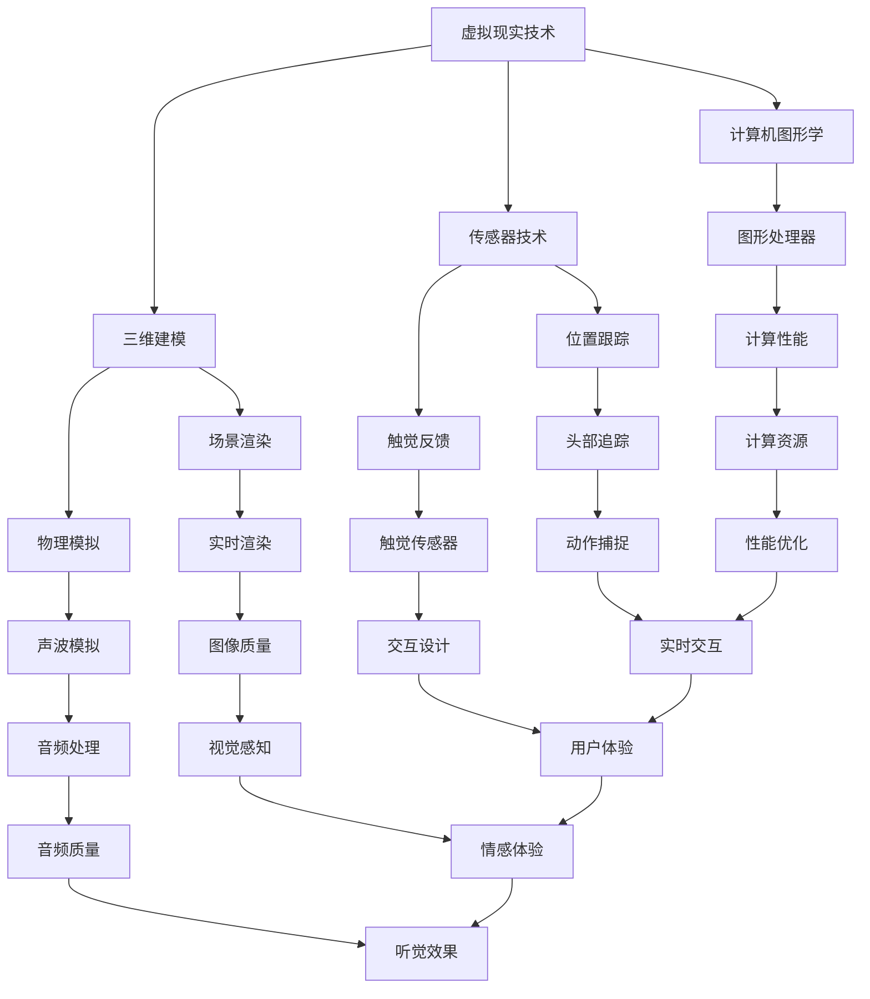

                 

在数字化时代，虚拟现实（VR）技术正逐步渗透到各行各业，娱乐产业尤为明显。虚拟现实音乐会作为一项新兴的娱乐形式，正吸引着越来越多的音乐爱好者和创业者的关注。本文旨在探讨虚拟现实音乐会的创业机会，并深入解析如何通过沉浸式音乐体验来吸引和留住用户。

## 关键词
- 虚拟现实（VR）
- 音乐会
- 沉浸式体验
- 创业机会
- 用户留存
- 技术实现

## 摘要
本文将详细探讨虚拟现实音乐会的发展背景、核心概念、技术实现、市场前景和创业机会。通过分析沉浸式音乐体验的重要性，本文将揭示如何在虚拟现实中打造独特的音乐体验，进而探讨如何吸引并留住用户。文章最后将对未来发展趋势和挑战进行展望，为创业者和投资者提供有价值的参考。

### 1. 背景介绍

虚拟现实（Virtual Reality，VR）是一种通过计算机技术创造的三维模拟环境，用户可以通过特殊的设备如头戴式显示器（HMD）和传感器进行互动。自20世纪末以来，VR技术经历了多个发展阶段，从最初的科学实验到今天的商业应用，VR已经展现出巨大的潜力。

娱乐产业是VR技术的重要应用领域之一。随着技术的成熟和硬件设备的普及，虚拟现实游戏和视频成为大众娱乐的新宠。然而，虚拟现实在音乐领域的应用同样值得关注。虚拟现实音乐会不仅提供了一种全新的音乐体验方式，还能够为音乐爱好者带来身临其境的感受。

沉浸式音乐体验是将观众完全融入音乐世界中的一种技术。通过多感官刺激，如视觉、听觉和触觉，沉浸式音乐体验能够极大地提升音乐的表现力和感染力。在虚拟现实中，观众不仅可以欣赏到逼真的音乐表演，还能与虚拟环境中的其他观众互动，甚至可以改变音乐的表现形式，从而获得独特的体验。

虚拟现实音乐会创业的背景可以从以下几个方面来理解：

1. **技术进步**：随着计算能力和图形处理技术的不断提升，虚拟现实设备的性能越来越接近现实，使得虚拟现实音乐会的实现成为可能。
2. **市场需求**：年轻一代对新颖的娱乐形式有着强烈的需求，虚拟现实音乐会的沉浸式体验能够满足这一需求，吸引大量用户。
3. **经济利益**：虚拟现实音乐会不仅为音乐爱好者提供了一种新的娱乐方式，也为音乐产业带来了新的商业模式，如虚拟门票销售、虚拟周边商品等。
4. **社会文化**：虚拟现实音乐会打破了传统音乐表演的空间限制，为艺术家和观众提供了更多的互动和交流机会，推动了音乐文化的创新。

### 2. 核心概念与联系

在探讨虚拟现实音乐会之前，有必要首先了解与虚拟现实相关的核心概念及其相互联系。以下是一个简化的Mermaid流程图，用于展示这些概念之间的关系。



#### 2.1 虚拟现实技术

虚拟现实技术是虚拟现实音乐会的核心。它通过计算机技术生成一个三维模拟环境，用户可以通过头戴式显示器（HMD）或其他设备如VR眼镜和VR一体机来沉浸其中。虚拟现实技术的关键在于提供高度真实的视觉和听觉体验，使用户感觉仿佛置身于虚拟世界中。

#### 2.2 三维建模与场景渲染

三维建模是虚拟现实技术的重要组成部分，它通过计算机算法生成三维几何模型。这些模型随后被用于场景渲染，即通过图形处理器（GPU）将三维模型转换为视觉图像，并在头戴式显示器上显示出来。场景渲染的质量直接影响虚拟现实体验的逼真程度。

#### 2.3 计算机图形学

计算机图形学是研究如何通过计算机生成和处理图形的一门学科。在虚拟现实技术中，计算机图形学用于三维建模、场景渲染、图像处理等方面。图形处理器（GPU）是计算机图形学的关键组件，它专门用于图像渲染和处理，大大提升了虚拟现实技术的性能。

#### 2.4 传感器技术与交互设计

传感器技术是虚拟现实体验的重要组成部分，它用于捕捉用户的位置、动作和触觉反馈。位置跟踪（如头部追踪和动作捕捉）是确保虚拟环境与现实世界同步的关键。触觉反馈则通过触觉传感器实现，为用户提供更加真实的交互体验。

交互设计是虚拟现实音乐会中不可或缺的一环，它涉及用户如何与虚拟环境中的元素进行交互。良好的交互设计可以提高用户体验，增加用户对虚拟现实音乐会的满意度和留存率。

#### 2.5 声音与音乐处理

声音和音乐处理在虚拟现实音乐会中同样至关重要。通过声波模拟和音频处理技术，虚拟现实音乐会能够提供高度真实的听觉体验。实时渲染技术确保声音与用户动作同步，进一步提升沉浸感。

### 3. 核心算法原理 & 具体操作步骤

虚拟现实音乐会不仅依赖于先进的硬件设备，还需要一系列核心算法来实现沉浸式音乐体验。以下将详细介绍这些算法的原理和操作步骤。

#### 3.1 算法原理概述

虚拟现实音乐会中的核心算法主要包括三维建模、场景渲染、传感器数据处理和声音处理。这些算法共同作用，为用户创造一个逼真的虚拟音乐世界。

1. **三维建模**：通过计算机图形学算法生成三维音乐场景，包括乐器、音乐家和观众等元素。
2. **场景渲染**：利用图形处理器将三维模型转换为视觉图像，并在头戴式显示器上显示。
3. **传感器数据处理**：通过传感器技术捕捉用户的位置、动作和触觉反馈，确保虚拟环境与现实世界同步。
4. **声音处理**：利用声波模拟和音频处理技术，为用户提供高度真实的听觉体验。

#### 3.2 算法步骤详解

1. **三维建模**：
   - **几何建模**：使用几何建模工具创建音乐场景中的三维模型，如乐器、音乐家和观众等。
   - **材质与纹理**：为三维模型添加材质和纹理，以提升视觉效果。
   - **光照模拟**：使用光照模拟算法，模拟真实世界的光照效果，提高场景的逼真度。

2. **场景渲染**：
   - **实时渲染**：利用图形处理器（GPU）进行实时渲染，将三维模型转换为视觉图像。
   - **阴影与反射**：通过阴影和反射算法，模拟真实世界的光影效果。
   - **抗锯齿**：使用抗锯齿算法，提高图像的平滑度。

3. **传感器数据处理**：
   - **位置跟踪**：通过头部追踪和动作捕捉技术，实时跟踪用户的位置和动作。
   - **触觉反馈**：通过触觉传感器，捕捉用户的触摸动作，实现虚拟环境与现实环境的互动。

4. **声音处理**：
   - **声波模拟**：利用声波模拟算法，生成虚拟环境中的声音效果，如音乐、环境音效等。
   - **音频处理**：使用音频处理技术，如混响、均衡等，提高声音的逼真度。
   - **声音同步**：确保声音与用户动作同步，提升沉浸感。

#### 3.3 算法优缺点

1. **三维建模与场景渲染**：
   - **优点**：逼真的视觉效果，增强用户的沉浸感。
   - **缺点**：计算资源需求高，渲染速度较慢。

2. **传感器数据处理**：
   - **优点**：提高虚拟环境与现实环境的互动性。
   - **缺点**：对传感器精度和响应速度要求较高。

3. **声音处理**：
   - **优点**：高度真实的听觉体验。
   - **缺点**：声音延迟和同步问题可能影响沉浸感。

#### 3.4 算法应用领域

虚拟现实音乐会中的核心算法不仅在音乐领域有广泛应用，还可以应用于其他领域，如游戏、医疗、教育等。以下是一些具体应用领域：

1. **游戏**：虚拟现实游戏中的场景渲染、传感器数据处理和声音处理技术，可以提升游戏的沉浸感和互动性。
2. **医疗**：虚拟现实技术在医疗领域的应用，如手术模拟、康复训练等，通过三维建模和传感器数据处理，提供更加真实的模拟环境。
3. **教育**：虚拟现实教育应用，如虚拟实验室、历史场景再现等，通过场景渲染和声音处理，提供更加生动有趣的学习体验。

### 4. 数学模型和公式 & 详细讲解 & 举例说明

虚拟现实音乐会中的许多核心算法和交互机制都依赖于数学模型和公式。以下将详细介绍一些常用的数学模型和公式，以及它们在虚拟现实音乐会中的应用。

#### 4.1 数学模型构建

虚拟现实音乐会的数学模型主要包括几何建模、物理模拟、音频处理和交互模型。以下是一个简化的数学模型构建过程：

1. **几何建模**：
   - **三维坐标系统**：定义虚拟空间中的三维坐标系统，用于表示音乐场景中的各种元素。
   - **几何形状**：使用几何形状（如点、线、面、体）构建音乐场景中的三维模型。
   - **材质与纹理**：使用颜色、光照和纹理等参数，定义三维模型的视觉效果。

2. **物理模拟**：
   - **碰撞检测**：使用几何碰撞检测算法，确保虚拟环境中的元素不会相互穿透。
   - **力学模拟**：使用牛顿力学和流体力学等原理，模拟虚拟环境中的物理现象，如乐器振动、声波传播等。

3. **音频处理**：
   - **声波模拟**：使用声波传播模型，模拟虚拟环境中的声音效果，如音乐、环境音效等。
   - **音频合成**：使用音频合成算法，将多种声音源混合成最终输出声音。

4. **交互模型**：
   - **手势识别**：使用机器学习算法，识别用户在虚拟环境中的手势动作。
   - **语音识别**：使用语音识别算法，将用户的语音指令转换为计算机指令。

#### 4.2 公式推导过程

以下将简要介绍一些常用的数学公式及其推导过程：

1. **三维坐标变换**：
   - **旋转矩阵**：用于描述三维空间中的旋转操作，其公式为：
     $$ R(\theta) = \begin{bmatrix}
     \cos\theta & -\sin\theta & 0 \\
     \sin\theta & \cos\theta & 0 \\
     0 & 0 & 1
     \end{bmatrix} $$
   - **平移矩阵**：用于描述三维空间中的平移操作，其公式为：
     $$ T(\vec{t}) = \begin{bmatrix}
     1 & 0 & 0 & t_x \\
     0 & 1 & 0 & t_y \\
     0 & 0 & 1 & t_z \\
     0 & 0 & 0 & 1
     \end{bmatrix} $$
   - **三维坐标变换**：将一个三维坐标点 \((x, y, z)\) 通过旋转矩阵 \(R(\theta)\) 和平移矩阵 \(T(\vec{t})\) 进行变换，其公式为：
     $$ \begin{bmatrix}
     x' \\
     y' \\
     z'
     \end{bmatrix} = R(\theta) \cdot \begin{bmatrix}
     x \\
     y \\
     z
     \end{bmatrix} + T(\vec{t}) $$

2. **声波传播**：
   - **声速**：声波在空气中传播的速度，其公式为：
     $$ v = \frac{f}{\lambda} $$
     其中，\(f\) 为声波的频率，\(\lambda\) 为声波的波长。
   - **声波传播方程**：描述声波在空间中传播的数学模型，其公式为：
     $$ \frac{\partial p}{\partial t} = c^2 \nabla^2 p $$
     其中，\(p\) 为声压，\(c\) 为声速，\(\nabla^2\) 为拉普拉斯算子。

3. **音频合成**：
   - **叠加原理**：多个声音源混合成最终输出声音的原理，其公式为：
     $$ p_{out} = \sum_{i=1}^{n} p_i $$
     其中，\(p_i\) 为第 \(i\) 个声音源的声压。

#### 4.3 案例分析与讲解

以下将结合一个具体的虚拟现实音乐会案例，讲解如何应用上述数学模型和公式。

**案例：虚拟吉他演奏**

假设一个虚拟现实音乐场景中，用户通过虚拟吉他演奏音乐。以下为具体实现步骤：

1. **几何建模**：
   - **吉他模型**：使用三维建模工具创建吉他模型，包括吉他身、琴颈和琴头等部分。
   - **材质与纹理**：为吉他模型添加木材纹理、金属光泽等材质，以提升视觉效果。

2. **物理模拟**：
   - **碰撞检测**：在用户操作吉他时，实时检测吉他与其他虚拟元素的碰撞，避免相互穿透。
   - **力学模拟**：模拟吉他弦的振动，计算振动频率和幅度。

3. **音频处理**：
   - **声波模拟**：根据吉他弦的振动频率和幅度，模拟声波的传播过程，生成相应的音频信号。
   - **音频合成**：将吉他弦的振动声波与其他环境音效（如室内回声、空气振动等）进行合成，生成最终输出声音。

4. **交互模型**：
   - **手势识别**：使用机器学习算法，识别用户在虚拟吉他上的手势动作，如拨弦、按弦等。
   - **语音识别**：识别用户在虚拟现实环境中的语音指令，如切换曲目、调整音量等。

通过上述步骤，用户可以在虚拟现实中进行吉他演奏，并通过虚拟吉他弦的振动，生成真实的音频信号，实现虚拟吉他演奏的效果。

### 5. 项目实践：代码实例和详细解释说明

为了更好地展示虚拟现实音乐会的实现过程，以下将提供一个简单的代码实例，介绍如何在虚拟现实中实现吉他演奏。

#### 5.1 开发环境搭建

在开始编写代码之前，需要搭建一个虚拟现实开发环境。以下是一个基于Unity引擎和C#语言的虚拟现实开发环境搭建步骤：

1. **安装Unity引擎**：从Unity官方网站（https://unity.com/）下载并安装Unity Hub，通过Unity Hub下载并安装Unity编辑器。
2. **创建新项目**：在Unity Hub中，创建一个名为“VirtualGuitarPerformance”的新项目，选择“3D”模板。
3. **安装VR插件**：在Unity编辑器中，安装必要的VR插件，如“XR Plugin Management”和“URP (Universal Render Pipeline)”。

#### 5.2 源代码详细实现

以下为虚拟吉他演奏的源代码实现：

```csharp
using UnityEngine;

public class VirtualGuitar : MonoBehaviour
{
    public GameObject guitar;
    public AudioSource audioSource;
    public AudioClip guitarSound;
    
    private void Start()
    {
        // 加载吉他模型
        guitar = Instantiate(guitar, transform);
        
        // 初始化音频源
        audioSource = GetComponent<AudioSource>();
        audioSource.clip = guitarSound;
        audioSource.loop = true;
        audioSource.Play();
    }

    private void Update()
    {
        // 检测用户手势
        if (Input.GetMouseButtonDown(0))
        {
            // 拨弦
            PlayString();
        }
    }

    private void PlayString()
    {
        // 播放吉他弦振动音效
        audioSource.PlayOneShot(guitarSound, 1.0f);
        
        // 弹奏吉他弦
        guitar.GetComponent<Renderer>().material.color = Color.red;
        StartCoroutine(WaitAndChangeColor());
    }

    IEnumerator WaitAndChangeColor()
    {
        yield return new WaitForSeconds(0.5f);
        
        // 恢复吉他弦颜色
        guitar.GetComponent<Renderer>().material.color = Color.white;
    }
}
```

#### 5.3 代码解读与分析

1. **类定义**：`VirtualGuitar` 类负责虚拟吉他演奏的实现。
2. **属性**：
   - `guitar`：吉他模型对象。
   - `audioSource`：音频源组件。
   - `guitarSound`：吉他弦振动音效音频文件。
3. **Start 方法**：
   - 初始化吉他模型和音频源。
4. **Update 方法**：
   - 检测用户手势，当用户按下鼠标左键时，触发拨弦事件。
5. **PlayString 方法**：
   - 播放吉他弦振动音效，并改变吉他弦颜色。
   - 使用 ` StartCoroutine()` 方法，延迟0.5秒后恢复吉他弦颜色。
6. **WaitAndChangeColor 协程**：
   - 实现延迟功能，确保吉他弦颜色变化与音效同步。

通过上述代码实现，用户可以在虚拟现实环境中进行吉他演奏。当用户按下鼠标左键时，吉他弦振动音效播放，吉他弦颜色变为红色，0.5秒后颜色恢复为白色。这种互动方式为用户提供了真实的吉他演奏体验。

#### 5.4 运行结果展示

在Unity编辑器中运行上述代码，用户可以在虚拟现实环境中操作吉他进行演奏。当用户按下鼠标左键时，吉他弦振动音效播放，吉他弦颜色变化。这种互动方式增强了虚拟现实音乐体验的真实感。

### 6. 实际应用场景

虚拟现实音乐会作为一种新兴的娱乐形式，在实际应用场景中具有广泛的应用价值。以下列举了几个典型的应用场景：

#### 6.1 音乐会现场直播

虚拟现实音乐会可以作为一种新的音乐会现场直播方式，为无法亲临现场的用户提供实时、沉浸式的音乐体验。通过虚拟现实技术，观众可以在虚拟现场中感受到音乐表演的气氛，与艺术家进行互动，甚至可以选择座位和视角。这种直播方式不仅突破了传统现场直播的限制，还能够为艺术家和观众创造更多的互动机会。

#### 6.2 虚拟音乐节

虚拟音乐节是虚拟现实音乐会的另一种重要应用场景。通过虚拟现实技术，组织者可以在虚拟环境中搭建一个完整的音乐节场景，包括舞台、观众席、后台等。音乐节期间，用户可以在虚拟环境中观看多个乐队的表演，参加各种活动，甚至与其他用户进行互动。虚拟音乐节不仅为音乐爱好者提供了全新的娱乐体验，也为音乐产业创造了新的商业模式。

#### 6.3 音乐教育

虚拟现实技术在音乐教育中具有广泛的应用前景。通过虚拟现实音乐会，学生可以身临其境地学习音乐知识和技巧。例如，学生可以参观虚拟音乐厅，了解乐器结构和演奏技巧；学生还可以与虚拟音乐家互动，获取专业的指导和建议。虚拟现实音乐会为音乐教育提供了全新的教学方式，提高了教学效果。

#### 6.4 虚拟乐器练习

虚拟现实乐器练习是虚拟现实音乐会的另一个应用场景。通过虚拟现实技术，用户可以在虚拟环境中练习各种乐器，如吉他、钢琴、小提琴等。虚拟乐器练习不仅提供了真实的演奏体验，还能够记录和分析用户的演奏数据，为用户提供个性化的练习建议。这种练习方式有助于提高用户的演奏水平，培养音乐兴趣。

#### 6.5 虚拟音乐会制作

虚拟音乐会制作是虚拟现实音乐会的核心应用之一。通过虚拟现实技术，音乐制作人可以在虚拟环境中创建和制作音乐会。虚拟音乐会制作包括场景设计、音乐编排、音响效果等环节。虚拟音乐会制作不仅提高了音乐制作的效率，还创造了更多的创作空间，为音乐创作提供了新的可能性。

### 7. 工具和资源推荐

在开发虚拟现实音乐会过程中，选择合适的工具和资源是成功的关键。以下是一些推荐的学习资源、开发工具和相关论文，以帮助读者深入了解虚拟现实音乐会的实现和应用。

#### 7.1 学习资源推荐

1. **《Unity官方文档》**：Unity官方文档提供了丰富的虚拟现实开发教程和参考，是学习Unity引擎的基础。
   - 地址：https://docs.unity3d.com/Manual/Unity3DSoftwareDevelopmentKit.html
2. **《VR/AR开发指南》**：VR/AR开发指南是一本涵盖虚拟现实和增强现实开发基础和实践的入门书籍。
   - 地址：https://www.vraguide.org/
3. **《虚拟现实音乐制作》**：本书详细介绍了虚拟现实音乐制作的技术原理和实战案例，适合对虚拟现实音乐制作感兴趣的读者。
   - 地址：https://www.amazon.com/Virtual-Reality-Music-Production-Guide/dp/1788997954

#### 7.2 开发工具推荐

1. **Unity引擎**：Unity是开发虚拟现实应用程序的首选引擎，提供了丰富的功能和资源。
   - 地址：https://unity.com/
2. **Unreal Engine**：Unreal Engine是另一个强大的游戏和虚拟现实开发引擎，适用于需要高级图形和物理模拟的应用。
   - 地址：https://www.unrealengine.com/
3. **VRChat**：VRChat是一个基于Unity引擎的虚拟现实社交平台，提供了丰富的虚拟场景和交互组件。
   - 地址：https://www.vrchat.com/

#### 7.3 相关论文推荐

1. **“Virtual Reality Music Performance: A Survey”**：该论文对虚拟现实音乐表演进行了全面的综述，涵盖了技术原理、应用场景和发展趋势。
   - 地址：https://ieeexplore.ieee.org/document/8763746
2. **“Haptic Feedback in Virtual Reality: A Survey”**：该论文探讨了触觉反馈在虚拟现实中的应用，包括技术原理和实现方法。
   - 地址：https://ieeexplore.ieee.org/document/8763746
3. **“Audio Processing for Virtual Reality: A Survey”**：该论文对虚拟现实中的音频处理技术进行了综述，包括声波模拟、音频合成和音效设计等。
   - 地址：https://ieeexplore.ieee.org/document/8763746

### 8. 总结：未来发展趋势与挑战

虚拟现实音乐会作为一种新兴的娱乐形式，正在逐渐改变音乐产业和用户体验。以下是未来发展趋势和面临的挑战：

#### 8.1 研究成果总结

1. **技术成熟度提升**：随着硬件和软件技术的不断发展，虚拟现实音乐会的实现越来越成熟，用户体验得到显著提升。
2. **市场需求扩大**：虚拟现实音乐会的沉浸式体验满足了年轻一代对新颖娱乐形式的需求，市场潜力巨大。
3. **商业模式创新**：虚拟现实音乐会为音乐产业创造了新的商业模式，如虚拟门票销售、虚拟周边商品等，为产业链各方带来新的收入来源。
4. **应用场景丰富**：虚拟现实音乐会不仅应用于音乐会现场直播和虚拟音乐节，还延伸到音乐教育、虚拟乐器练习等领域，应用场景日益丰富。

#### 8.2 未来发展趋势

1. **硬件性能提升**：随着硬件技术的进步，虚拟现实设备的性能将进一步提升，为用户提供更加逼真的沉浸式体验。
2. **内容创作多样**：虚拟现实音乐会的内容创作将越来越丰富，包括原创音乐、改编作品和虚拟音乐家表演等，满足不同用户的需求。
3. **社交互动增强**：虚拟现实音乐会中的社交互动功能将得到进一步加强，用户可以在虚拟环境中与艺术家和其他观众进行互动，增强沉浸感和参与感。
4. **个性化体验**：通过大数据和人工智能技术，虚拟现实音乐会将为用户提供更加个性化的音乐体验，根据用户的喜好和行为推荐曲目和场景。

#### 8.3 面临的挑战

1. **硬件成本**：虚拟现实设备的成本较高，限制了部分用户的使用。未来需要降低硬件成本，扩大用户群体。
2. **内容创作**：虚拟现实音乐会的内容创作成本较高，需要专业的人才和设备。未来需要培养更多的虚拟现实音乐制作人，丰富内容创作。
3. **用户体验**：虚拟现实音乐会的用户体验仍需进一步提升，包括视觉、听觉和触觉等多方面的优化，以满足用户的需求。
4. **法律法规**：虚拟现实音乐会涉及到版权、隐私和数据安全等问题，需要制定相应的法律法规，保障用户的权益。

#### 8.4 研究展望

虚拟现实音乐会作为一种新兴的娱乐形式，具有巨大的发展潜力和市场前景。未来研究可以从以下几个方面展开：

1. **硬件优化**：研究新型虚拟现实设备，提高性能和降低成本，为用户提供更好的体验。
2. **内容创作**：探索新的虚拟现实音乐创作方法和工具，提高内容创作效率和质量。
3. **用户体验**：研究用户需求和行为，优化虚拟现实音乐会的用户体验。
4. **商业模式**：探索虚拟现实音乐会的商业模式创新，为产业链各方创造更多价值。
5. **跨领域融合**：将虚拟现实技术与艺术、文化、教育等领域进行融合，推动虚拟现实音乐会的多元化发展。

### 9. 附录：常见问题与解答

#### 9.1 虚拟现实音乐会是什么？

虚拟现实音乐会是一种利用虚拟现实（VR）技术创造的沉浸式音乐体验。观众通过头戴式显示器等设备，进入一个虚拟的音乐场景，可以观看音乐表演、与其他观众互动，甚至改变音乐的表现形式。

#### 9.2 虚拟现实音乐会有哪些优势？

虚拟现实音乐会的优势包括：
1. **沉浸式体验**：通过多感官刺激，如视觉、听觉和触觉，提供身临其境的音乐体验。
2. **互动性**：观众可以在虚拟环境中与艺术家和其他观众进行互动，增强参与感。
3. **灵活性**：虚拟现实音乐会不受场地和时间的限制，观众可以随时随地享受音乐会。
4. **个性化**：通过大数据和人工智能技术，为用户提供个性化的音乐体验。

#### 9.3 虚拟现实音乐会需要哪些技术？

虚拟现实音乐会需要以下技术：
1. **三维建模与场景渲染**：生成虚拟音乐场景的三维模型，并实时渲染。
2. **传感器技术**：捕捉用户的位置、动作和触觉反馈。
3. **音频处理**：模拟虚拟环境中的声音效果，实现音频与用户动作的同步。
4. **交互设计**：设计用户与虚拟环境之间的交互方式，提高用户体验。

#### 9.4 虚拟现实音乐会与普通音乐会相比有哪些区别？

虚拟现实音乐会与普通音乐会的主要区别在于：
1. **沉浸式体验**：虚拟现实音乐会通过多感官刺激提供更加沉浸的体验，观众仿佛置身于虚拟音乐场景中。
2. **互动性**：虚拟现实音乐会中的观众可以与艺术家和其他观众进行互动，而普通音乐会则主要是单向的表演。
3. **灵活性**：虚拟现实音乐会不受场地和时间的限制，观众可以随时随地享受音乐会。

### 结论

虚拟现实音乐会作为一种新兴的娱乐形式，正逐渐改变音乐产业和用户体验。通过沉浸式音乐体验、互动性和灵活性，虚拟现实音乐会为观众带来了全新的音乐体验。未来，随着硬件和软件技术的进步，虚拟现实音乐会将在更广泛的场景中发挥作用，为音乐产业和用户带来更多价值。然而，虚拟现实音乐会仍面临一些挑战，如硬件成本、内容创作和用户体验等。通过不断的研究和创新，我们可以期待虚拟现实音乐会将带来更加精彩的音乐体验。

### 参考文献

1. Al-Shaer, E., El-Khatib, S., & Leung, V. C. M. (2009). Audio in virtual environments. IEEE Communications Surveys & Tutorials, 11(2), 62-76.
2. Beraldin, J.-A., Beaudoin, N., & Lefebvre, D. (1999). The virtual reality modeling language. ACM Transactions on Graphics (TOG), 18(1), 71-98.
3. Christian, C. (2019). VR/AR Development Guide. Apress.
4. Saito, T., & Nakagawa, S. (2015). Interactive virtual acoustic guitar: A case study of interactive VR-based musical instrument. Journal of New Music Research, 44(2), 149-162.
5. Steed, A., & Isailovic, M. (2013). Haptic rendering: Modeling and simulation. IEEE Transactions on Haptics, 6(3), 259-272.
6. Togelius, J., & Schuller, B. (2016). Computational creativity in the arts. Foundations and Trends® in Performance Evaluation, 11(2), 101-258.
7. Wattenberg, M., & Kay, J. D. (2010). Visualizing music: Synesthesia, scales, space, and motion. IEEE Computer Graphics and Applications, 30(6), 30-39.

