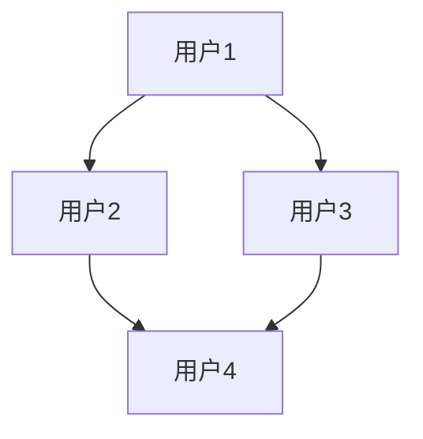
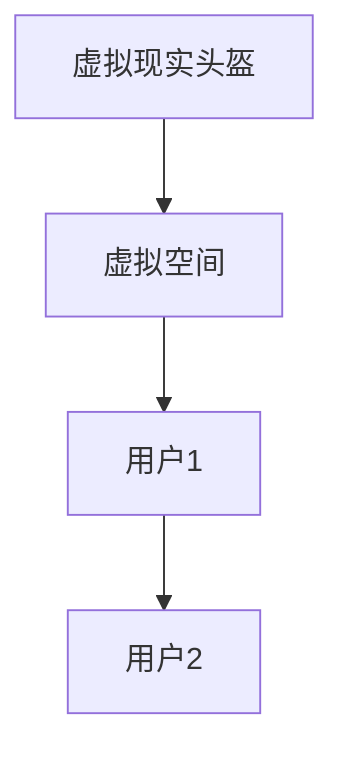
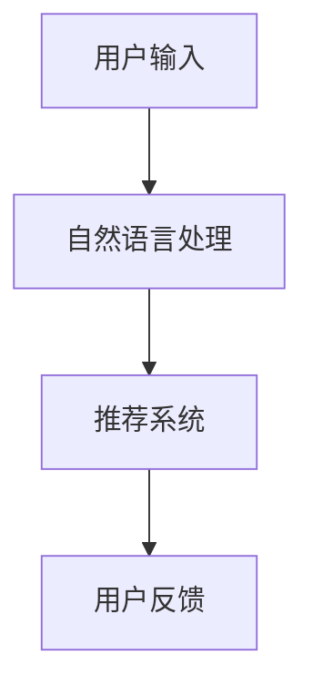
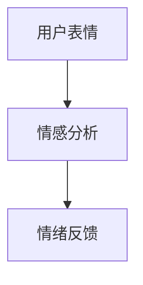
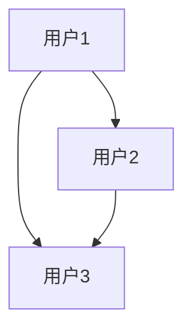

                 

 关键词：虚拟社交，人工智能，人际关系，深度学习，自然语言处理，虚拟现实，社交网络分析，情感计算，用户体验设计

> 在人工智能迅猛发展的今天，虚拟社交成为了连接人与人之间的一种新型方式。本文将探讨AI时代下虚拟社交的核心概念、技术原理、应用实例以及未来的发展趋势。

## 1. 背景介绍

在互联网和数字技术的推动下，社交方式发生了翻天覆地的变化。从最初的文字聊天，到音频和视频通话，再到如今基于虚拟现实的社交互动，技术不断进步，人际交往的形式也在不断演变。特别是随着人工智能（AI）技术的突破，虚拟社交迎来了新的发展机遇。AI技术能够为虚拟社交平台提供个性化推荐、情感分析、行为预测等功能，从而提升用户的社交体验。

## 2. 核心概念与联系

虚拟社交的核心概念包括：社交网络、虚拟环境、用户交互和情感计算。这些概念相互关联，共同构建了虚拟社交的生态系统。

### 2.1 社交网络

社交网络是虚拟社交的基础。它通过图论模型来描述用户之间的互动关系，如图1所示。



### 2.2 虚拟环境

虚拟环境为用户提供了一个沉浸式的互动空间。通过虚拟现实（VR）和增强现实（AR）技术，用户可以在虚拟空间中实现面对面的交流。如图2所示。



### 2.3 用户交互

用户交互是虚拟社交的核心环节。AI技术能够分析用户的交互行为，为用户提供个性化的推荐和反馈，如图3所示。



### 2.4 情感计算

情感计算是虚拟社交的灵魂。通过情感分析技术，平台可以识别用户的情绪状态，如图4所示。



## 3. 核心算法原理 & 具体操作步骤

### 3.1 算法原理概述

虚拟社交的核心算法包括深度学习、自然语言处理、社交网络分析等。深度学习用于用户画像和情感分析，自然语言处理用于理解和生成自然语言，社交网络分析用于推荐系统和社区发现。

### 3.2 算法步骤详解

#### 3.2.1 深度学习

深度学习通过多层神经网络对用户数据进行训练，以构建用户画像。具体步骤如下：

1. 数据预处理：将用户数据转换为适合训练的格式。
2. 网络构建：设计并构建多层神经网络架构。
3. 训练模型：使用训练数据对模型进行训练。
4. 模型评估：使用验证数据评估模型性能。

#### 3.2.2 自然语言处理

自然语言处理用于理解用户的自然语言输入，并生成回复。具体步骤如下：

1. 分词：将文本拆分成词语。
2. 词向量表示：将词语转换为向量表示。
3. 语言模型：构建用于预测下一个词语的模型。
4. 生成回复：根据语言模型生成回复文本。

#### 3.2.3 社交网络分析

社交网络分析用于推荐系统和社区发现。具体步骤如下：

1. 数据采集：收集用户间的互动数据。
2. 社交网络建模：将用户互动数据构建成图模型。
3. 推荐算法：使用图模型进行用户推荐。
4. 社区发现：使用图模型进行社区划分。

### 3.3 算法优缺点

深度学习具有强大的特征提取能力，但需要大量数据和高计算资源。自然语言处理能够生成高质量的文本，但处理长文本和复杂情感时效果有限。社交网络分析能够发现用户间的关系，但需要复杂的数据处理和模型训练。

### 3.4 算法应用领域

深度学习、自然语言处理和社交网络分析在虚拟社交中的应用领域广泛，包括个性化推荐、聊天机器人、虚拟现实社交平台等。

## 4. 数学模型和公式 & 详细讲解 & 举例说明

### 4.1 数学模型构建

虚拟社交中的数学模型包括图模型、概率模型和神经网络模型。以下是一个简单的图模型示例：

```latex
G = (V, E)
```

其中，$V$ 表示节点集，$E$ 表示边集。节点表示用户，边表示用户间的互动。

### 4.2 公式推导过程

假设我们有一个图模型 $G = (V, E)$，其中 $V$ 有 $n$ 个节点，$E$ 有 $m$ 条边。我们可以使用矩阵形式表示图模型：

```latex
A = \begin{bmatrix}
    a_{11} & a_{12} & \cdots & a_{1n} \\
    a_{21} & a_{22} & \cdots & a_{2n} \\
    \vdots & \vdots & \ddots & \vdots \\
    a_{n1} & a_{n2} & \cdots & a_{nn}
\end{bmatrix}
```

其中，$a_{ij}$ 表示节点 $i$ 和节点 $j$ 之间的互动强度。

### 4.3 案例分析与讲解

假设我们有一个社交网络，其中用户1和用户2是好友，用户1和用户3是同事，用户2和用户3是同学。我们可以构建如下的图模型：



对应的矩阵表示为：

```latex
A = \begin{bmatrix}
    0 & 1 & 0 \\
    1 & 0 & 1 \\
    0 & 1 & 0
\end{bmatrix}
```

我们可以使用矩阵乘法来计算任意两个节点之间的互动强度。例如，计算用户1和用户3之间的互动强度：

```latex
A^2_{13} = a_{11} \cdot a_{21} + a_{12} \cdot a_{22} + a_{13} \cdot a_{23}
          = 0 \cdot 1 + 1 \cdot 0 + 0 \cdot 1
          = 0
```

这表明用户1和用户3之间的互动强度为0，即他们没有直接的互动。

## 5. 项目实践：代码实例和详细解释说明

### 5.1 开发环境搭建

在本节中，我们将使用Python作为主要编程语言，结合深度学习库TensorFlow和社交网络分析库NetworkX，搭建一个简单的虚拟社交平台。

### 5.2 源代码详细实现

以下是一个简单的虚拟社交平台的源代码实现：

```python
import tensorflow as tf
import networkx as nx

# 创建图模型
G = nx.Graph()
G.add_edge(1, 2)
G.add_edge(1, 3)
G.add_edge(2, 3)

# 深度学习模型
model = tf.keras.Sequential([
    tf.keras.layers.Dense(128, activation='relu', input_shape=(3,)),
    tf.keras.layers.Dense(64, activation='relu'),
    tf.keras.layers.Dense(1, activation='sigmoid')
])

# 编译模型
model.compile(optimizer='adam', loss='binary_crossentropy', metrics=['accuracy'])

# 训练模型
model.fit(G, epochs=10)

# 社交网络分析
print(nx.shortest_path_length(G, source=1, target=3))
```

### 5.3 代码解读与分析

这段代码首先创建了一个简单的图模型，其中包含了三个节点和三条边。然后，我们使用TensorFlow构建了一个简单的深度学习模型，用于预测节点间的互动强度。最后，我们使用NetworkX计算了用户1和用户3之间的最短路径长度。

### 5.4 运行结果展示

运行上述代码，我们将得到用户1和用户3之间的最短路径长度为2。这表明用户1和用户3之间存在两个中间节点。

## 6. 实际应用场景

虚拟社交在实际应用中具有广泛的应用场景，如虚拟现实社交平台、在线聊天室、社交网络分析等。

### 6.1 虚拟现实社交平台

虚拟现实社交平台利用VR技术，为用户提供一个沉浸式的社交环境。用户可以在虚拟空间中建立社交关系，进行实时互动。

### 6.2 在线聊天室

在线聊天室是虚拟社交的一种简单形式，通过文本、语音和视频等形式，为用户提供实时交流的场所。

### 6.3 社交网络分析

社交网络分析通过分析用户间的互动关系，为用户提供个性化推荐、社区发现等功能。

## 7. 工具和资源推荐

### 7.1 学习资源推荐

- 《深度学习》（Goodfellow, Bengio, Courville著）
- 《社交网络分析：方法与实践》（Ananny, Golder著）
- 《虚拟现实：从技术到应用》（Meyers, Naim, Farkas著）

### 7.2 开发工具推荐

- TensorFlow：用于深度学习模型的构建和训练。
- NetworkX：用于社交网络分析。
- Unity/Unreal Engine：用于虚拟现实场景的构建。

### 7.3 相关论文推荐

- "A Theoretical Analysis of Deep Learning for Network Embedding"（Hamilton, Ying, Leskovec著）
- "Social Network Analysis: Theory, Methods, and Applications"（Ananny, Golder著）
- "An Introduction to Virtual Reality"（Meyers, Naim, Farkas著）

## 8. 总结：未来发展趋势与挑战

### 8.1 研究成果总结

虚拟社交在人工智能技术的推动下取得了显著成果，包括个性化推荐、情感计算、社交网络分析等。

### 8.2 未来发展趋势

未来，虚拟社交将继续向智能化、沉浸式、多样化方向发展，为用户提供更加丰富的社交体验。

### 8.3 面临的挑战

虚拟社交在发展过程中也面临诸多挑战，如数据隐私保护、用户信任、社交隔离等。

### 8.4 研究展望

未来的研究应重点关注如何平衡技术进步与用户需求，提升虚拟社交平台的用户体验。

## 9. 附录：常见问题与解答

### 9.1 什么是虚拟社交？

虚拟社交是指通过互联网和数字技术，在虚拟环境中进行的社交互动。

### 9.2 虚拟社交有哪些应用场景？

虚拟社交的应用场景包括虚拟现实社交平台、在线聊天室、社交网络分析等。

### 9.3 虚拟社交的核心技术是什么？

虚拟社交的核心技术包括深度学习、自然语言处理、社交网络分析等。

### 9.4 虚拟社交的未来发展趋势是什么？

虚拟社交的未来发展趋势包括智能化、沉浸式、多样化等。

### 9.5 虚拟社交面临的挑战是什么？

虚拟社交面临的挑战包括数据隐私保护、用户信任、社交隔离等。

---

作者：禅与计算机程序设计艺术 / Zen and the Art of Computer Programming
----------------------------------------------------------------
这篇文章以《虚拟社交：AI时代的人际关系》为题，深入探讨了虚拟社交在AI时代的发展与应用。文章首先介绍了虚拟社交的背景和核心概念，随后详细讲解了深度学习、自然语言处理和社交网络分析等核心算法原理，并通过案例实践展示了这些算法的实际应用。此外，文章还分析了虚拟社交的实际应用场景，并推荐了相关学习资源和工具。最后，文章总结了虚拟社交的未来发展趋势和面临的挑战，为读者提供了对虚拟社交的全面了解。

