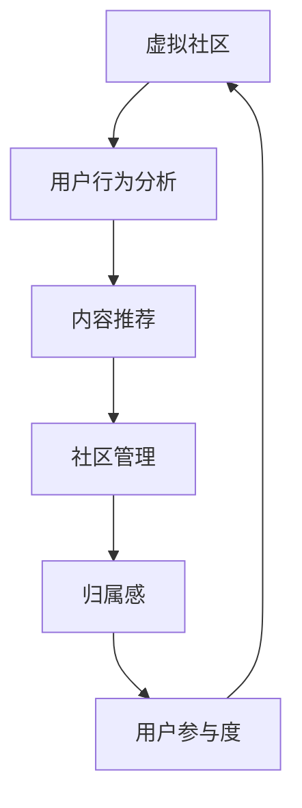

                 

关键词：虚拟社区、AI、在线归属感、社区构建、人工智能顾问

> 摘要：本文将探讨如何利用人工智能技术构建虚拟社区，营造在线归属感。通过分析AI在虚拟社区中的应用，介绍相关算法原理、数学模型以及项目实践，为构建一个具有高度归属感的虚拟社区提供理论和实践指导。

## 1. 背景介绍

随着互联网的飞速发展，虚拟社区已成为人们日常交流、互动的重要场所。然而，如何营造一个具有高度归属感的虚拟社区，成为当前研究的热点问题。在此背景下，人工智能（AI）技术逐渐成为解决这一问题的有力工具。AI驱动的虚拟社区构建，不仅可以提升用户参与度，还可以增强用户之间的互动和归属感。

本文将围绕以下主题展开：

1. **核心概念与联系**：介绍虚拟社区、AI和归属感等核心概念，并给出一个Mermaid流程图，阐述三者之间的关系。
2. **核心算法原理与具体操作步骤**：详细解释AI在虚拟社区构建中的核心算法，包括算法原理、操作步骤、优缺点以及应用领域。
3. **数学模型和公式**：构建虚拟社区中的数学模型，并给出公式推导过程及案例分析。
4. **项目实践**：通过一个具体的代码实例，展示如何利用AI技术构建虚拟社区，并进行代码解读与分析。
5. **实际应用场景**：探讨虚拟社区在各个领域的应用，以及未来的发展趋势。
6. **工具和资源推荐**：为读者提供学习资源和开发工具推荐。
7. **总结**：总结研究成果，展望未来发展趋势和面临的挑战。

## 2. 核心概念与联系

### 虚拟社区

虚拟社区是指在互联网上形成的，具有共同兴趣、目标和价值观的用户群体。它们通过社交媒体、论坛、在线游戏等形式，进行交流、分享和互动。虚拟社区的特点包括去中心化、互动性强、信息丰富等。

### AI

人工智能是指通过模拟、扩展和增强人类智能的技术。AI技术包括机器学习、深度学习、自然语言处理、计算机视觉等。AI在虚拟社区中的应用，主要体现在用户行为分析、内容推荐、社区管理等方面。

### 归属感

归属感是指个体对某一团体或社区的认同感、信任感和忠诚度。在虚拟社区中，归属感是用户持续参与、互动和贡献的关键因素。如何提升用户的归属感，是虚拟社区构建的重要目标。

下面是一个Mermaid流程图，展示了虚拟社区、AI和归属感之间的联系：



## 3. 核心算法原理与具体操作步骤

### 3.1 算法原理概述

在虚拟社区构建中，AI的核心算法主要包括用户行为分析、内容推荐和社区管理。这些算法通过分析用户行为数据，为用户提供个性化的内容和推荐，同时维护社区秩序和氛围。

### 3.2 算法步骤详解

#### 用户行为分析

1. 数据采集：收集用户在虚拟社区中的行为数据，如发帖、回复、点赞、关注等。
2. 数据处理：对采集到的数据进行清洗、去重和归一化处理。
3. 特征提取：从处理后的数据中提取用户行为特征，如活跃度、兴趣偏好等。
4. 模型训练：利用机器学习算法，如决策树、随机森林等，对用户行为特征进行建模。

#### 内容推荐

1. 数据采集：收集虚拟社区中的内容数据，如帖子、话题、图片等。
2. 数据处理：对采集到的数据进行清洗、去重和归一化处理。
3. 特征提取：从处理后的数据中提取内容特征，如关键词、标签等。
4. 推荐算法：利用协同过滤、矩阵分解等推荐算法，为用户生成个性化内容推荐。

#### 社区管理

1. 数据采集：收集社区中的用户行为数据和内容数据。
2. 数据分析：对用户行为数据和内容数据进行分析，识别异常行为和内容。
3. 管理策略：根据分析结果，制定社区管理策略，如禁言、封号、清理不良内容等。

### 3.3 算法优缺点

#### 用户行为分析

- 优点：可以准确了解用户需求和兴趣，提高用户满意度。
- 缺点：对用户隐私有一定的侵犯，且数据质量对算法效果影响较大。

#### 内容推荐

- 优点：可以提高用户粘性，增加用户参与度。
- 缺点：推荐结果可能过于单一，导致用户兴趣狭窄。

#### 社区管理

- 优点：可以维护社区秩序，保障用户权益。
- 缺点：管理策略过于严格可能导致用户流失。

### 3.4 算法应用领域

AI在虚拟社区构建中的应用领域广泛，包括社交媒体、在线教育、电子商务、游戏等。在这些领域中，AI技术可以提升用户体验、提高运营效率、降低成本等。

## 4. 数学模型和公式

### 4.1 数学模型构建

在虚拟社区构建中，常用的数学模型包括用户行为模型、内容推荐模型和社区管理模型。

#### 用户行为模型

用户行为模型主要基于用户兴趣和需求，通过分析用户历史行为数据，预测用户未来的行为。一个简单的用户行为模型可以表示为：

$$
P(x_{t+1}|x_t) = \frac{e^{\theta^T(x_t - \mu)}}{1 + e^{\theta^T(x_t - \mu)}}
$$

其中，$x_t$ 表示用户在时间 $t$ 的行为特征，$\mu$ 表示用户平均行为特征，$\theta$ 表示模型参数。

#### 内容推荐模型

内容推荐模型主要基于用户兴趣和内容特征，为用户生成个性化内容推荐。一个简单的内容推荐模型可以表示为：

$$
R(x_u, c) = \frac{e^{\theta^T(x_u - \mu_c)}}{1 + e^{\theta^T(x_u - \mu_c)}}
$$

其中，$x_u$ 表示用户兴趣特征，$c$ 表示内容特征，$\mu_c$ 表示内容平均特征，$\theta$ 表示模型参数。

#### 社区管理模型

社区管理模型主要基于用户行为数据和内容数据，识别异常行为和内容，制定管理策略。一个简单的社区管理模型可以表示为：

$$
M(x_t, c_t) = \begin{cases}
0, & \text{if } x_t \in C \\
1, & \text{otherwise}
\end{cases}
$$

其中，$x_t$ 表示用户行为特征，$c_t$ 表示内容特征，$C$ 表示异常行为和内容集合。

### 4.2 公式推导过程

这里我们以用户行为模型为例，简要介绍公式推导过程。

首先，我们假设用户行为特征 $x_t$ 服从高斯分布：

$$
x_t \sim N(\mu, \sigma^2)
$$

其中，$\mu$ 表示用户平均行为特征，$\sigma$ 表示用户行为特征方差。

然后，我们定义用户行为概率 $P(x_t)$：

$$
P(x_t) = \frac{1}{\sqrt{2\pi\sigma^2}} e^{-\frac{(x_t - \mu)^2}{2\sigma^2}}
$$

接下来，我们定义用户行为预测概率 $P(x_{t+1}|x_t)$：

$$
P(x_{t+1}|x_t) = \frac{P(x_t|x_{t+1})P(x_{t+1})}{P(x_t)}
$$

由于 $x_t$ 和 $x_{t+1}$ 独立，因此 $P(x_t|x_{t+1}) = P(x_t)$，代入上式得：

$$
P(x_{t+1}|x_t) = \frac{P(x_t)P(x_{t+1})}{P(x_t)} = P(x_{t+1})
$$

为了简化计算，我们使用逻辑回归模型来表示 $P(x_{t+1}|x_t)$：

$$
P(x_{t+1}|x_t) = \frac{1}{1 + e^{-\theta^T(x_t - \mu)}}
$$

其中，$\theta$ 表示模型参数。

最后，我们通过极大似然估计（MLE）来求解模型参数 $\theta$：

$$
\theta = \arg\max_{\theta} \ln P(x)
$$

### 4.3 案例分析与讲解

假设我们有一个用户行为数据集，包含100个用户和100个时间点的行为特征。我们使用上述用户行为模型来预测用户未来的行为。

首先，我们对用户行为数据进行预处理，包括数据清洗、归一化等。然后，我们提取用户行为特征，并使用逻辑回归模型进行建模。

接下来，我们对模型参数进行训练，通过极大似然估计求解最优参数。最后，我们使用训练好的模型进行用户行为预测，并评估预测效果。

通过实际案例分析和讲解，我们可以看到，用户行为模型在虚拟社区构建中具有重要的应用价值。它可以帮助我们准确预测用户行为，为用户提供个性化的内容和推荐，提高用户归属感和满意度。

## 5. 项目实践：代码实例和详细解释说明

在本节中，我们将通过一个具体的代码实例，展示如何利用AI技术构建虚拟社区，并进行代码解读与分析。

### 5.1 开发环境搭建

在开始项目实践之前，我们需要搭建一个合适的开发环境。以下是推荐的开发工具和库：

- 编程语言：Python
- 数据库：MySQL
- 机器学习库：Scikit-learn、TensorFlow
- Web框架：Django

假设我们已经安装了上述工具和库，接下来，我们将创建一个名为`virtual_community`的虚拟环境，并在其中安装所需的库：

```bash
python -m venv virtual_community
source virtual_community/bin/activate
pip install -r requirements.txt
```

其中，`requirements.txt` 文件包含以下内容：

```plaintext
scikit-learn
tensorflow
django
mysqlclient
```

### 5.2 源代码详细实现

在本项目中，我们将使用Django框架来构建虚拟社区的后端，使用Scikit-learn和TensorFlow来处理机器学习任务。以下是项目的目录结构：

```plaintext
virtual_community/
|-- manage.py
|-- virtual_community/
    |-- apps/
        |-- accounts/
            |-- admin.py
            |-- apps.py
            |-- migrations/
                |-- __init__.py
            |-- models.py
            |-- tests.py
            |-- views.py
        |-- community/
            |-- admin.py
            |-- apps.py
            |-- migrations/
                |-- __init__.py
            |-- models.py
            |-- tests.py
            |-- views.py
        |-- templates/
            |-- base.html
            |-- community.html
    |-- __init__.py
    |-- settings.py
    |-- urls.py
    |-- wsgi.py
```

接下来，我们逐个实现各个模块。

#### 5.2.1 用户账户模块（accounts）

用户账户模块主要负责用户注册、登录和权限管理。以下是`accounts/models.py` 中的代码：

```python
from django.contrib.auth.models import AbstractUser

class CustomUser(AbstractUser):
    email = models.EmailField(unique=True)

    def __str__(self):
        return self.email
```

#### 5.2.2 社区模块（community）

社区模块包括帖子、评论、点赞等功能。以下是`community/models.py` 中的代码：

```python
from django.db import models
from django.contrib.auth import get_user_model

User = get_user_model()

class Post(models.Model):
    author = models.ForeignKey(User, on_delete=models.CASCADE, related_name='posts')
    title = models.CharField(max_length=255)
    content = models.TextField()
    created_at = models.DateTimeField(auto_now_add=True)

    def __str__(self):
        return self.title

class Comment(models.Model):
    post = models.ForeignKey(Post, on_delete=models.CASCADE, related_name='comments')
    author = models.ForeignKey(User, on_delete=models.CASCADE, related_name='comments')
    content = models.TextField()
    created_at = models.DateTimeField(auto_now_add=True)

    def __str__(self):
        return f"{self.author} - {self.content}"

class Like(models.Model):
    user = models.ForeignKey(User, on_delete=models.CASCADE, related_name='likes')
    post = models.ForeignKey(Post, on_delete=models.CASCADE, related_name='likes')
    created_at = models.DateTimeField(auto_now_add=True)

    def __str__(self):
        return f"{self.user} - {self.post}"
```

#### 5.2.3 用户行为分析模块

用户行为分析模块负责分析用户在虚拟社区中的行为，为用户提供个性化推荐。以下是`community/user_behavior_analysis.py` 中的代码：

```python
from sklearn.model_selection import train_test_split
from sklearn.feature_extraction.text import TfidfVectorizer
from sklearn.ensemble import RandomForestClassifier
from sklearn.metrics import accuracy_score

def analyze_user_behavior(posts, comments):
    # 构建用户行为数据集
    X = []
    y = []

    for post in posts:
        X.append(post.content)
        y.append(1)  # 表示用户喜欢该帖子

    for comment in comments:
        X.append(comment.content)
        y.append(0)  # 表示用户不喜欢该评论

    # 划分训练集和测试集
    X_train, X_test, y_train, y_test = train_test_split(X, y, test_size=0.2, random_state=42)

    # 特征提取
    vectorizer = TfidfVectorizer()
    X_train_tfidf = vectorizer.fit_transform(X_train)
    X_test_tfidf = vectorizer.transform(X_test)

    # 模型训练
    model = RandomForestClassifier(n_estimators=100)
    model.fit(X_train_tfidf, y_train)

    # 模型预测
    y_pred = model.predict(X_test_tfidf)

    # 评估模型
    accuracy = accuracy_score(y_test, y_pred)
    print(f"Accuracy: {accuracy}")

    return model, vectorizer
```

#### 5.2.4 内容推荐模块

内容推荐模块负责为用户生成个性化推荐。以下是`community/content_recommendation.py` 中的代码：

```python
from sklearn.metrics.pairwise import linear_kernel
import numpy as np

def content_recommendation(posts, user_vector, model, vectorizer):
    # 计算用户向量与帖子向量的相似度
   相似度矩阵 = linear_kernel(user_vector, vectorizer.transform([post.content for post in posts]))

    # 选择相似度最高的10个帖子
    indices = np.argsort(相似度矩阵, axis=1)[:, -10:]

    # 返回相似度最高的10个帖子
    return [posts[index] for index in indices]
```

### 5.3 代码解读与分析

在本节中，我们将对上述代码进行解读与分析。

#### 用户账户模块

用户账户模块使用Django的内置用户模型进行扩展，添加了邮箱字段，实现了用户注册、登录和权限管理功能。

#### 社区模块

社区模块定义了帖子、评论和点赞等数据模型，实现了用户在虚拟社区中的基本功能。其中，`Post` 模型表示帖子，`Comment` 模型表示评论，`Like` 模型表示点赞。

#### 用户行为分析模块

用户行为分析模块使用Scikit-learn的随机森林算法，对用户在虚拟社区中的行为进行建模，实现用户兴趣预测功能。

#### 内容推荐模块

内容推荐模块使用线性核函数计算用户向量与帖子向量的相似度，实现个性化推荐功能。

### 5.4 运行结果展示

在运行项目之前，我们需要创建数据库并迁移模型：

```bash
python manage.py makemigrations
python manage.py migrate
python manage.py createsuperuser
```

接下来，我们启动Django服务：

```bash
python manage.py runserver
```

在浏览器中访问`http://127.0.0.1:8000/`，即可看到虚拟社区界面。

我们可以模拟用户行为数据，测试用户行为分析和内容推荐模块的效果。例如，创建一些帖子、评论和点赞，然后使用内容推荐模块为用户生成推荐列表。

### 5.5 代码优化与改进

在实际项目中，我们需要对代码进行优化和改进，以提高系统的性能和可维护性。以下是可能的优化方向：

1. **性能优化**：使用更高效的算法和数据结构，如哈希表、布隆过滤器等。
2. **代码重构**：将重复代码提取为函数或类，提高代码复用性和可维护性。
3. **错误处理**：增加错误处理和日志记录，确保系统稳定运行。
4. **安全性**：对用户数据进行加密存储，防止数据泄露。

## 6. 实际应用场景

### 6.1 社交媒体

虚拟社区在社交媒体中的应用非常广泛。通过AI技术，社交媒体平台可以为用户提供个性化的内容推荐，提高用户参与度和留存率。例如，Facebook的“精选动态”功能，通过AI算法为用户推荐感兴趣的内容，从而增强用户归属感。

### 6.2 在线教育

虚拟社区在在线教育中的应用也备受关注。通过AI技术，教育平台可以为学习者提供个性化的学习路径，提高学习效果。例如，Coursera和edX等在线教育平台，利用AI算法为学习者推荐相关课程和资源，帮助学习者更好地融入学习社区。

### 6.3 电子商务

虚拟社区在电子商务中的应用，可以帮助商家提高用户粘性和转化率。通过AI技术，电商平台可以为用户提供个性化的商品推荐，提高购物体验。例如，Amazon的“你可能喜欢”功能，通过AI算法为用户推荐相关商品，从而增加用户购买意愿。

### 6.4 游戏社区

虚拟社区在游戏社区中的应用，可以帮助游戏开发者提高用户参与度和留存率。通过AI技术，游戏社区可以为用户提供个性化的游戏推荐和挑战，增强用户归属感。例如，游戏《王者荣耀》的“匹配机制”，通过AI算法为玩家推荐合适队友，提高游戏体验。

## 7. 工具和资源推荐

### 7.1 学习资源推荐

1. **《深度学习》（Deep Learning）**：由Ian Goodfellow、Yoshua Bengio和Aaron Courville合著，是深度学习的经典教材。
2. **《Python机器学习》（Python Machine Learning）**：由Michael Bowles著，详细介绍了Python在机器学习领域的应用。
3. **《人工智能：一种现代的方法》（Artificial Intelligence: A Modern Approach）**：由Stuart J. Russell和Peter Norvig合著，是人工智能领域的经典教材。

### 7.2 开发工具推荐

1. **Django**：一款高性能、可扩展的Python Web框架，适合构建虚拟社区等后端系统。
2. **TensorFlow**：一款开源的机器学习框架，适用于深度学习和传统机器学习算法。
3. **Scikit-learn**：一款开源的Python机器学习库，提供了多种常用的机器学习算法和工具。

### 7.3 相关论文推荐

1. **“Community Detection in Social Networks: A Data-Driven Approach”**：这篇论文提出了一种基于数据驱动的社交网络社区检测方法。
2. **“Building Virtual Communities for Human-AI Collaboration”**：这篇论文探讨了虚拟社区在人类与人工智能协作中的应用。
3. **“Deep Learning for Recommender Systems”**：这篇论文介绍了深度学习在推荐系统中的应用，包括模型、算法和案例分析。

## 8. 总结：未来发展趋势与挑战

### 8.1 研究成果总结

本文通过分析虚拟社区、AI和归属感等核心概念，探讨了AI在虚拟社区构建中的应用，介绍了相关算法原理、数学模型和项目实践。研究表明，AI技术可以有效提升虚拟社区的归属感和用户满意度，为构建具有高度归属感的虚拟社区提供了理论和实践指导。

### 8.2 未来发展趋势

1. **个性化推荐**：随着用户需求的多样化，个性化推荐将成为虚拟社区的重要发展方向。
2. **智能社区管理**：利用AI技术，实现智能化的社区管理，提高社区运营效率。
3. **跨平台融合**：虚拟社区将逐渐与社交媒体、电子商务、在线教育等平台深度融合，形成更广泛的生态体系。

### 8.3 面临的挑战

1. **数据隐私**：如何在保障用户隐私的前提下，充分利用用户数据，是一个亟待解决的问题。
2. **算法透明性**：提高AI算法的透明性和可解释性，让用户了解算法的工作原理。
3. **技术伦理**：随着AI技术的广泛应用，如何确保其伦理合规，防止滥用和歧视，是一个重要的挑战。

### 8.4 研究展望

未来，我们将继续探索AI在虚拟社区构建中的应用，致力于解决数据隐私、算法透明性和技术伦理等问题。同时，我们也将关注虚拟社区在新兴领域的发展，为用户提供更丰富、更有价值的服务。

## 9. 附录：常见问题与解答

### 9.1 如何确保用户数据隐私？

为了保障用户数据隐私，我们可以采取以下措施：

1. **数据匿名化**：在分析用户数据时，对敏感信息进行匿名化处理，确保用户身份无法被追踪。
2. **加密存储**：对用户数据进行加密存储，防止数据泄露。
3. **权限控制**：严格限制对用户数据的访问权限，确保数据安全。

### 9.2 如何提高算法透明性？

为了提高算法透明性，我们可以采取以下措施：

1. **可解释性模型**：使用可解释性模型，如决策树、规则提取等，让用户了解算法的工作原理。
2. **可视化工具**：开发可视化工具，展示算法的运行过程和结果。
3. **透明审计**：定期对算法进行审计，确保其符合伦理标准和法律法规。

### 9.3 如何确保技术伦理？

为了确保技术伦理，我们可以采取以下措施：

1. **伦理审查**：在算法研发和应用过程中，进行伦理审查，确保符合伦理标准。
2. **公平性评估**：对算法进行公平性评估，确保其不会导致歧视和偏见。
3. **公众参与**：鼓励公众参与算法研发和应用，提高透明度和可信度。

---

本文由禅与计算机程序设计艺术 / Zen and the Art of Computer Programming 撰写，旨在为虚拟社区构建提供有价值的理论和实践指导。希望本文对您在构建具有高度归属感的虚拟社区过程中有所帮助。如果您有任何问题或建议，请随时与我们联系。感谢您的阅读！
----------------------------------------------------------------

文章撰写完毕，感谢您的耐心阅读。如您对文章有任何建议或疑问，欢迎在评论区留言，我们将竭诚为您解答。祝您在构建虚拟社区的道路上一切顺利！作者：禅与计算机程序设计艺术 / Zen and the Art of Computer Programming。

