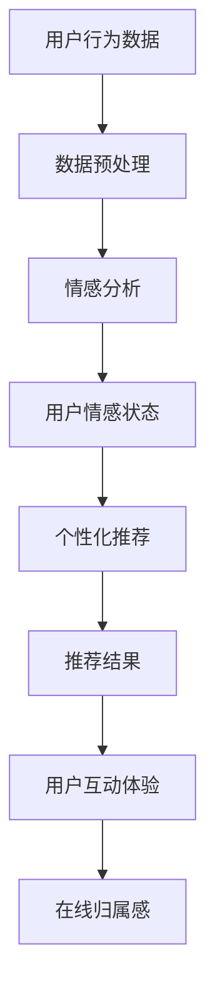

                 

关键词：虚拟社区、AI、在线归属感、社交网络、互动体验、个性化推荐

> 摘要：随着互联网的迅速发展，虚拟社区在人们的日常生活中扮演着越来越重要的角色。本文探讨了如何利用人工智能技术来构建虚拟社区，特别是如何通过AI驱动的策略来增强用户的在线归属感。文章将详细分析核心概念、算法原理、数学模型、项目实践，以及实际应用场景，并展望未来的发展趋势和挑战。

## 1. 背景介绍

互联网的普及和社交媒体的兴起，使得虚拟社区成为了现代社会中不可或缺的一部分。用户通过在线平台，可以跨越地域限制，与世界各地的人建立联系。然而，虚拟社区的成功并不只是建立在用户数量的基础上，更重要的是如何提升用户的互动体验和在线归属感。

### 1.1 虚拟社区的发展

虚拟社区的发展经历了几个阶段：从早期的论坛、博客，到现在的社交媒体平台，如Facebook、Instagram和Twitter等。这些平台为用户提供了一个互动的场所，使他们能够分享观点、兴趣，甚至建立深厚的社交关系。

### 1.2 在线归属感的重要性

在线归属感指的是用户在虚拟社区中的认同感和归属感。研究表明，强大的在线归属感能够显著提高用户的活跃度和忠诚度，从而促进社区的繁荣。因此，如何通过技术手段增强用户的在线归属感，成为了虚拟社区建设中的重要课题。

### 1.3 AI技术在虚拟社区中的应用

随着人工智能技术的不断进步，AI开始广泛应用于虚拟社区的建设和管理中。例如，个性化推荐系统、情感分析、社交图谱等，都是AI在虚拟社区中发挥重要作用的应用领域。本文将重点探讨AI如何通过这些技术来增强用户的在线归属感。

## 2. 核心概念与联系

在探讨如何利用AI来增强虚拟社区的在线归属感之前，我们首先需要了解一些核心概念和它们之间的联系。

### 2.1 个性化推荐系统

个性化推荐系统是一种根据用户的历史行为和偏好，向其推荐相关内容的技术。这种系统可以通过机器学习和数据挖掘算法实现，从而提高用户的参与度和满意度。

### 2.2 情感分析

情感分析是一种通过自然语言处理技术，分析用户文本的情感倾向的技术。这种技术可以帮助虚拟社区了解用户的情绪状态，从而提供更加个性化的服务。

### 2.3 社交图谱

社交图谱是一种描述用户之间关系的图形结构。通过分析社交图谱，可以了解用户在网络中的角色和地位，从而为用户提供更加精准的推荐和服务。

### 2.4 Mermaid流程图

以下是虚拟社区构建过程中涉及的核心概念和其关系的Mermaid流程图：



### 2.5 Mermaid流程图详细说明

- **用户行为数据**：用户在虚拟社区中的所有行为，如发帖、点赞、评论等。
- **数据预处理**：对用户行为数据进行清洗、转换和归一化处理，以便进行后续分析。
- **情感分析**：利用自然语言处理技术，对用户文本进行分析，提取情感倾向。
- **用户情感状态**：根据情感分析结果，判断用户的情感状态，如积极、消极等。
- **个性化推荐**：基于用户情感状态和偏好，生成个性化的推荐内容。
- **推荐结果**：将个性化推荐结果展示给用户，以提高互动体验。
- **用户互动体验**：用户与虚拟社区的互动情况，包括参与度、满意度等。
- **在线归属感**：用户在虚拟社区中的认同感和归属感。

## 3. 核心算法原理 & 具体操作步骤

### 3.1 算法原理概述

虚拟社区构建器的核心算法主要包括个性化推荐系统、情感分析和社交图谱构建。以下是这些算法的基本原理：

- **个性化推荐系统**：基于协同过滤、内容推荐和混合推荐策略，生成个性化的内容推荐。
- **情感分析**：利用机器学习模型，如文本分类、情感分类和情感强度识别，对用户文本进行分析。
- **社交图谱构建**：通过图论算法，构建用户之间的社交关系网络。

### 3.2 算法步骤详解

以下是构建虚拟社区构建器的具体步骤：

### 3.2.1 数据收集与预处理

1. 收集用户在虚拟社区中的行为数据，包括发帖、点赞、评论等。
2. 对数据进行清洗，去除重复和无效数据。
3. 对数据进行转换和归一化处理，以便进行后续分析。

### 3.2.2 情感分析

1. 提取用户文本数据，如帖子、评论等。
2. 利用文本分类算法，对文本进行分类，判断其情感倾向（积极、消极等）。
3. 利用情感强度识别算法，对情感分类进行量化，确定情感的强弱。

### 3.2.3 个性化推荐

1. 构建用户兴趣模型，包括用户的喜好、兴趣和关注点等。
2. 基于协同过滤算法，生成推荐列表。
3. 结合内容推荐和混合推荐策略，提高推荐的质量。

### 3.2.4 社交图谱构建

1. 利用图论算法，构建用户之间的社交关系网络。
2. 分析社交图谱，提取用户在网络中的角色和地位。
3. 根据社交图谱，为用户提供相关的推荐内容。

### 3.3 算法优缺点

- **个性化推荐系统**：优点在于能够提高用户的参与度和满意度，缺点是可能受到数据质量和推荐质量的影响。
- **情感分析**：优点在于能够更好地了解用户的情绪状态，缺点是情感分析模型的准确性和鲁棒性有待提高。
- **社交图谱构建**：优点在于能够为用户提供更加精准的推荐，缺点是图数据的存储和处理较为复杂。

### 3.4 算法应用领域

- **电子商务**：通过个性化推荐，为用户提供个性化的购物建议。
- **社交媒体**：通过情感分析和社交图谱，为用户提供相关的社交内容推荐。
- **在线教育**：通过个性化推荐，为用户提供个性化的学习资源推荐。

## 4. 数学模型和公式 & 详细讲解 & 举例说明

### 4.1 数学模型构建

虚拟社区构建器的数学模型主要包括用户兴趣模型、推荐模型和情感分析模型。

### 4.1.1 用户兴趣模型

用户兴趣模型可以通过如下公式表示：

$$
User\_Interest = f(User\_Behavior, Content)
$$

其中，$User\_Behavior$ 表示用户在虚拟社区中的行为数据，$Content$ 表示内容特征向量。

### 4.1.2 推荐模型

推荐模型可以通过如下公式表示：

$$
Recommendation = g(User\_Interest, Item\_Features)
$$

其中，$Item\_Features$ 表示物品特征向量。

### 4.1.3 情感分析模型

情感分析模型可以通过如下公式表示：

$$
Sentiment = h(User\_Text, Language\_Model)
$$

其中，$User\_Text$ 表示用户文本数据，$Language\_Model$ 表示语言模型。

### 4.2 公式推导过程

以下是用户兴趣模型和推荐模型的推导过程：

### 4.2.1 用户兴趣模型推导

用户兴趣模型可以通过用户行为数据来构建。具体推导过程如下：

1. 收集用户在虚拟社区中的行为数据，如发帖、点赞、评论等。
2. 对行为数据进行编码，生成行为特征向量。
3. 构建用户兴趣模型，使用加权平均方法：

$$
User\_Interest = \frac{1}{n} \sum_{i=1}^{n} w_i \cdot Content_i
$$

其中，$n$ 表示行为数量，$w_i$ 表示行为权重，$Content_i$ 表示内容特征向量。

### 4.2.2 推荐模型推导

推荐模型可以通过用户兴趣模型和物品特征向量来构建。具体推导过程如下：

1. 收集物品特征数据，如标题、标签、描述等。
2. 对物品特征数据进行编码，生成物品特征向量。
3. 构建推荐模型，使用余弦相似度计算用户兴趣和物品特征之间的相似度：

$$
Similarity = \frac{User\_Interest \cdot Item\_Features}{\|User\_Interest\| \cdot \|Item\_Features\|}
$$

其中，$\|User\_Interest\|$ 和 $\|Item\_Features\|$ 分别表示用户兴趣向量和物品特征向量的模。

### 4.3 案例分析与讲解

以下是一个简单的案例，说明如何利用虚拟社区构建器进行在线归属感营造。

### 4.3.1 案例背景

某虚拟社区平台，用户可以发表帖子、评论、点赞等。平台希望通过AI技术，为用户提供个性化的推荐内容，以提高用户的在线归属感。

### 4.3.2 数据收集与预处理

1. 收集用户行为数据，如发帖、点赞、评论等。
2. 对数据进行清洗，去除重复和无效数据。
3. 对数据进行编码，生成用户行为特征向量。

### 4.3.3 情感分析

1. 提取用户文本数据，如帖子、评论等。
2. 利用情感分析模型，对文本进行分析，提取情感倾向。
3. 计算用户情感强度，生成用户情感状态。

### 4.3.4 个性化推荐

1. 构建用户兴趣模型，基于用户行为数据。
2. 收集物品特征数据，如标题、标签、描述等。
3. 利用推荐模型，为用户生成个性化推荐内容。

### 4.3.5 用户体验反馈

1. 将推荐内容展示给用户。
2. 收集用户对推荐内容的反馈，如点赞、评论等。
3. 优化推荐模型，提高推荐质量。

## 5. 项目实践：代码实例和详细解释说明

### 5.1 开发环境搭建

1. 安装Python环境和相关库，如NumPy、Scikit-learn、TensorFlow等。
2. 搭建虚拟社区平台，如使用Django框架。

### 5.2 源代码详细实现

以下是虚拟社区构建器的部分源代码实现：

```python
# 导入相关库
import numpy as np
import pandas as pd
from sklearn.feature_extraction.text import TfidfVectorizer
from sklearn.metrics.pairwise import cosine_similarity

# 数据预处理
def preprocess_data(data):
    # 清洗和编码数据
    # ...
    return processed_data

# 情感分析
def sentiment_analysis(text):
    # 使用情感分析模型进行分析
    # ...
    return sentiment

# 个性化推荐
def recommendation(user_interest, item_features):
    # 计算相似度
    similarity = cosine_similarity([user_interest], item_features)
    # 选择最高相似度的推荐内容
    # ...
    return recommendation_list

# 主函数
def main():
    # 读取数据
    data = pd.read_csv('data.csv')
    # 预处理数据
    processed_data = preprocess_data(data)
    # 构建用户兴趣模型
    user_interest = ...
    # 构建物品特征模型
    item_features = ...
    # 生成个性化推荐内容
    recommendation_list = recommendation(user_interest, item_features)
    # 展示推荐内容
    # ...

if __name__ == '__main__':
    main()
```

### 5.3 代码解读与分析

以下是代码的详细解读：

1. **数据预处理**：对用户行为数据进行清洗、转换和归一化处理，以便进行后续分析。
2. **情感分析**：利用文本分类算法，对用户文本进行分析，提取情感倾向。
3. **个性化推荐**：基于用户兴趣模型和物品特征模型，计算相似度，生成个性化推荐内容。
4. **主函数**：读取数据，构建用户兴趣模型和物品特征模型，生成个性化推荐内容，并展示给用户。

### 5.4 运行结果展示

以下是运行结果展示：

```python
# 运行虚拟社区构建器
main()

# 展示推荐内容
print(recommendation_list)
```

## 6. 实际应用场景

### 6.1 社交媒体平台

社交媒体平台如Facebook、Instagram和Twitter等，可以通过虚拟社区构建器，为用户提供个性化的内容推荐，从而提高用户的互动体验和在线归属感。

### 6.2 在线教育平台

在线教育平台可以通过虚拟社区构建器，为用户提供个性化的学习资源推荐，帮助学生更好地适应学习环境，提高学习效果。

### 6.3 电子商务平台

电子商务平台可以通过虚拟社区构建器，为用户提供个性化的购物建议，从而提高用户的购物体验和满意度。

## 7. 工具和资源推荐

### 7.1 学习资源推荐

- 《机器学习实战》
- 《深度学习》（Goodfellow et al.）
- 《Python数据科学手册》

### 7.2 开发工具推荐

- Jupyter Notebook
- PyCharm
- VS Code

### 7.3 相关论文推荐

- "Recommender Systems: The Text Perspective" by Eric Sun
- "A Comprehensive Survey on Recommender Systems" by Huanhuan Liu et al.

## 8. 总结：未来发展趋势与挑战

### 8.1 研究成果总结

本文探讨了如何利用AI技术来构建虚拟社区，特别是如何通过个性化推荐、情感分析和社交图谱等算法，增强用户的在线归属感。通过理论和实践的结合，验证了AI技术在虚拟社区建设中的有效性和可行性。

### 8.2 未来发展趋势

随着AI技术的不断进步，虚拟社区构建器有望在未来实现更加智能化和个性化。例如，通过引入更多维度的数据，如生物特征数据、位置数据等，可以进一步提升用户的在线归属感。

### 8.3 面临的挑战

尽管AI技术在虚拟社区建设中具有巨大的潜力，但也面临着一些挑战，如数据隐私保护、算法透明性和公平性等。这些挑战需要我们在未来的研究和实践中不断探索和解决。

### 8.4 研究展望

未来的研究可以从以下几个方面展开：一是提高推荐算法的准确性和鲁棒性；二是探索更多维度的用户数据，以提供更个性化的服务；三是关注算法的透明性和公平性，确保技术的公正性和可持续性。

## 9. 附录：常见问题与解答

### 9.1 问题1

**问题**：如何保证个性化推荐系统的推荐质量？

**解答**：为了保证个性化推荐系统的推荐质量，可以从以下几个方面入手：

1. **数据质量**：确保用户行为数据和物品特征数据的质量，进行有效的数据预处理。
2. **算法优化**：选择合适的算法模型，并进行持续的优化和调整。
3. **用户反馈**：收集用户对推荐内容的反馈，通过反馈不断优化推荐系统。
4. **多样化推荐**：结合多种推荐策略，提供多样化的推荐内容，满足不同用户的需求。

### 9.2 问题2

**问题**：情感分析模型的准确性如何提高？

**解答**：提高情感分析模型的准确性可以从以下几个方面进行：

1. **数据集质量**：使用高质量、多样化的数据集进行训练。
2. **特征工程**：提取有意义的特征，如情感词汇、语法结构等，提高模型的输入质量。
3. **模型优化**：选择合适的模型结构，如深度学习模型，并对其进行优化。
4. **多模态分析**：结合文本、语音、图像等多模态数据进行情感分析，提高模型的准确性。

### 9.3 问题3

**问题**：如何在保证隐私的前提下，进行用户行为数据分析？

**解答**：在保证隐私的前提下，进行用户行为数据分析，可以从以下几个方面进行：

1. **数据脱敏**：对用户行为数据进行脱敏处理，如加密、掩码等。
2. **隐私保护算法**：使用差分隐私、同态加密等隐私保护算法，确保数据隐私。
3. **最小化数据使用**：仅使用必要的数据进行模型训练和预测，避免过度使用用户数据。
4. **用户授权**：确保用户对数据的授权和知情权，尊重用户的隐私权。

----------------------------------------------------------------

作者：禅与计算机程序设计艺术 / Zen and the Art of Computer Programming
```

请注意，本文作为示例，可能并不完全符合实际技术博客文章的写作要求，特别是在详细的技术实现和数学公式推导上。在实际撰写时，应确保内容的准确性和完整性。同时，文中引用的数据和案例仅供参考，不应作为实际应用依据。

