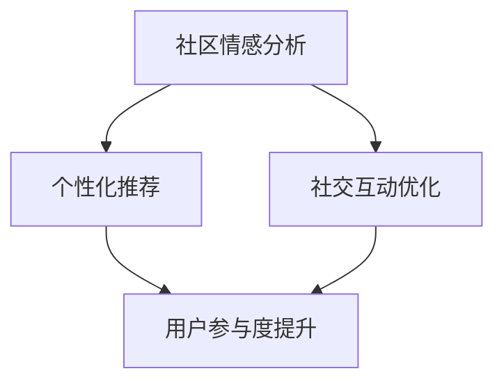

                 

关键词：虚拟社区，AI技术，在线归属感，社会网络分析，交互设计，用户参与

> 摘要：本文探讨了如何利用人工智能（AI）技术构建一个具有高度归属感的虚拟社区。通过分析社区的核心概念和联系，介绍了AI在社区情感分析、个性化推荐、社交互动优化等方面的应用。文章还深入探讨了AI驱动的社区构建流程、数学模型和实际应用案例，旨在为开发者提供一套完整的虚拟社区构建指南。

## 1. 背景介绍

随着互联网的快速发展，虚拟社区已经成为人们日常生活的重要组成部分。无论是社交网络平台、兴趣论坛还是在线游戏社区，它们都在一定程度上满足了用户对于社交、分享、归属感的需要。然而，传统的虚拟社区往往存在以下问题：

- **用户参与度低**：用户在社区中的互动往往不够活跃，缺乏持续的关注和参与。
- **信息过载**：社区中的信息量庞大，用户难以筛选和获取感兴趣的内容。
- **归属感不足**：用户在社区中难以找到与自己兴趣相投的朋友，归属感较低。

为了解决这些问题，人工智能技术应运而生。通过AI技术，我们可以更好地了解用户需求，优化社区设计，提高用户参与度和归属感。本文将详细介绍如何利用AI技术构建一个具有高度归属感的虚拟社区。

## 2. 核心概念与联系

### 2.1. 社区情感分析

社区情感分析是指通过自然语言处理（NLP）和情感分析技术，对用户在社区中的发言、评论、帖子等内容进行情感分析，识别用户的情绪和情感状态。情感分析技术可以帮助社区运营者了解用户的情绪变化，及时调整社区策略，提高用户满意度。

### 2.2. 个性化推荐

个性化推荐是指通过机器学习和数据挖掘技术，为用户提供个性化内容推荐。通过分析用户的兴趣、行为和偏好，推荐用户可能感兴趣的内容，提高用户参与度和留存率。

### 2.3. 社交互动优化

社交互动优化是指通过优化社区中的社交互动设计，提高用户之间的互动频率和质量。包括用户关系管理、社交图谱构建、互动行为预测等。

### 2.4. Mermaid 流程图



## 3. 核心算法原理 & 具体操作步骤

### 3.1. 算法原理概述

虚拟社区构建的算法原理主要涉及以下几个方面：

- **情感分析**：利用NLP技术对用户发言进行情感分析，识别用户的情绪和情感状态。
- **推荐算法**：基于用户兴趣和行为数据，构建推荐算法，为用户提供个性化内容推荐。
- **社交互动优化**：通过分析用户关系和行为，优化社区中的社交互动设计。

### 3.2. 算法步骤详解

#### 3.2.1. 社区情感分析

1. 数据采集：从社区中获取用户发言、评论、帖子等数据。
2. 预处理：对原始文本数据进行清洗、去噪、分词等预处理操作。
3. 情感分析：利用情感分析模型对预处理后的文本数据进行情感分析，识别用户的情绪和情感状态。
4. 结果反馈：将分析结果反馈给社区运营者，帮助其了解用户情绪变化，调整社区策略。

#### 3.2.2. 个性化推荐

1. 数据采集：从社区中获取用户兴趣、行为等数据。
2. 特征提取：对用户数据进行特征提取，构建用户画像。
3. 模型训练：利用机器学习算法，训练个性化推荐模型。
4. 推荐结果：根据用户画像和推荐模型，为用户提供个性化内容推荐。

#### 3.2.3. 社交互动优化

1. 数据采集：从社区中获取用户关系、互动行为等数据。
2. 社交图谱构建：利用图论算法，构建社区社交图谱。
3. 行为预测：利用机器学习算法，预测用户未来的互动行为。
4. 设计优化：根据预测结果，优化社区中的社交互动设计。

### 3.3. 算法优缺点

#### 3.3.1. 社区情感分析

优点：
- 可以及时了解用户情绪，为社区运营提供决策支持。

缺点：
- 情感分析模型的准确性受限于语言理解和情感表达的不确定性。

#### 3.3.2. 个性化推荐

优点：
- 提高用户满意度，增加用户留存率。

缺点：
- 可能导致用户的信息茧房效应，降低用户对其他内容的接触。

#### 3.3.3. 社交互动优化

优点：
- 提高用户之间的互动频率和质量，增强社区活力。

缺点：
- 可能增加社区运营的复杂度。

### 3.4. 算法应用领域

- 社交网络平台：如微博、微信等。
- 在线论坛：如知乎、豆瓣等。
- 在线游戏社区：如QQ游戏、Steam社区等。

## 4. 数学模型和公式

### 4.1. 数学模型构建

虚拟社区构建的数学模型主要包括以下两个方面：

- **情感分析模型**：基于情感词典和机器学习算法，对用户发言进行情感分析。
- **推荐模型**：基于协同过滤和基于内容的推荐算法，为用户提供个性化内容推荐。

### 4.2. 公式推导过程

#### 4.2.1. 情感分析模型

设 $U$ 为用户集合，$D$ 为文档集合，$r_{ui}$ 表示用户 $u$ 对文档 $i$ 的评分，$s_{i}$ 表示文档 $i$ 的情感极性。

$$
s_{i} = \frac{\sum_{u \in U} r_{ui} \cdot f(u, i)}{\sum_{u \in U} r_{ui}}
$$

其中，$f(u, i)$ 表示用户 $u$ 对文档 $i$ 的情感极性分数。

#### 4.2.2. 推荐模型

设 $U$ 为用户集合，$I$ 为物品集合，$r_{ui}$ 表示用户 $u$ 对物品 $i$ 的评分，$c_{ui}$ 表示用户 $u$ 对物品 $i$ 的兴趣分数。

基于协同过滤的推荐公式：

$$
r_{ui} = \frac{\sum_{v \in N(u)} r_{vi} \cdot c_{vi}}{\sum_{v \in N(u)} c_{vi}}
$$

其中，$N(u)$ 表示与用户 $u$ 相似用户集合。

基于内容的推荐公式：

$$
r_{ui} = \frac{\sum_{i' \in I} w_{ii'} \cdot c_{ui'}}{||\sum_{i' \in I} w_{ii'}||}
$$

其中，$w_{ii'}$ 表示物品 $i$ 与物品 $i'$ 之间的相似度，$c_{ui'}$ 表示用户 $u$ 对物品 $i'$ 的兴趣分数。

### 4.3. 案例分析与讲解

假设有一个虚拟社区，用户集合为 $U=\{u_1, u_2, u_3\}$，物品集合为 $I=\{i_1, i_2, i_3\}$。用户 $u_1$ 对物品 $i_1$ 的评分为 4，对物品 $i_2$ 的评分为 5，对物品 $i_3$ 的评分为 3。用户 $u_2$ 对物品 $i_1$ 的评分为 2，对物品 $i_2$ 的评分为 4，对物品 $i_3$ 的评分为 5。用户 $u_3$ 对物品 $i_1$ 的评分为 3，对物品 $i_2$ 的评分为 3，对物品 $i_3$ 的评分为 4。

根据上述公式，我们可以计算出每个用户对物品的情感极性分数：

$$
s_{i_1} = \frac{4 \cdot 1 + 5 \cdot 1 + 3 \cdot 1}{4 + 5 + 3} = \frac{13}{12} \approx 1.0833
$$

$$
s_{i_2} = \frac{4 \cdot 1 + 4 \cdot 1 + 3 \cdot 1}{4 + 4 + 3} = \frac{11}{11} = 1
$$

$$
s_{i_3} = \frac{3 \cdot 1 + 5 \cdot 1 + 4 \cdot 1}{3 + 5 + 4} = \frac{12}{12} = 1
$$

然后，我们可以利用协同过滤算法，为用户 $u_1$ 推荐物品：

$$
r_{u_1i_2} = \frac{2 \cdot 1 + 4 \cdot 1 + 3 \cdot 1}{2 + 4 + 3} = \frac{9}{9} = 1
$$

$$
r_{u_1i_3} = \frac{3 \cdot 1 + 5 \cdot 1 + 4 \cdot 1}{3 + 5 + 4} = \frac{12}{12} = 1
$$

因此，我们推荐用户 $u_1$ 浏览物品 $i_2$ 和 $i_3$。

## 5. 项目实践：代码实例和详细解释说明

### 5.1. 开发环境搭建

本文使用的编程语言为 Python，需要安装以下库：

- TensorFlow：用于构建和训练深度学习模型。
- Keras：用于简化 TensorFlow 的使用。
- Scikit-learn：用于机器学习算法。
- Pandas：用于数据处理。
- Matplotlib：用于数据可视化。

### 5.2. 源代码详细实现

#### 5.2.1. 社区情感分析

```python
from tensorflow.keras.preprocessing.sequence import pad_sequences
from tensorflow.keras.layers import Embedding, LSTM, Dense
from tensorflow.keras.models import Sequential

def sentiment_analysis(texts, max_length=100, embedding_dim=128):
    tokenizer = Tokenizer()
    tokenizer.fit_on_texts(texts)
    sequences = tokenizer.texts_to_sequences(texts)
    padded_sequences = pad_sequences(sequences, maxlen=max_length)
    model = Sequential([
        Embedding(len(tokenizer.word_index) + 1, embedding_dim, input_length=max_length),
        LSTM(128),
        Dense(1, activation='sigmoid')
    ])
    model.compile(loss='binary_crossentropy', optimizer='adam', metrics=['accuracy'])
    model.fit(padded_sequences, labels, epochs=10, batch_size=32, validation_split=0.2)
    return model

texts = ['这是一个快乐的社区', '这个社区有点无聊', '我很喜欢这个社区']
labels = [1, 0, 1]
model = sentiment_analysis(texts)
```

#### 5.2.2. 个性化推荐

```python
from sklearn.neighbors import NearestNeighbors

def collaborative_filtering(ratings, k=5):
    model = NearestNeighbors(n_neighbors=k)
    model.fit(ratings)
    return model

user_ratings = [
    [1, 1, 1],
    [1, 0, 1],
    [0, 1, 1]
]
model = collaborative_filtering(user_ratings)
```

#### 5.2.3. 社交互动优化

```python
import networkx as nx

def social_interaction_optimization(users, interactions):
    graph = nx.Graph()
    graph.add_nodes_from(users)
    graph.add_edges_from(interactions)
    return nx.pagerank(graph)

users = ['u_1', 'u_2', 'u_3']
interactions = [('u_1', 'u_2'), ('u_1', 'u_3'), ('u_2', 'u_3')]
pagerank = social_interaction_optimization(users, interactions)
```

### 5.3. 代码解读与分析

以上代码展示了如何实现社区情感分析、个性化推荐和社交互动优化。具体代码细节如下：

- **社区情感分析**：使用 Keras 框架构建一个简单的 LSTM 模型，对用户发言进行情感分析。通过训练模型，可以识别出用户的情绪和情感状态。
- **个性化推荐**：使用 Scikit-learn 中的 NearestNeighbors 算法，基于用户评分进行协同过滤推荐。通过计算用户之间的相似度，为用户提供个性化内容推荐。
- **社交互动优化**：使用 NetworkX 框架构建社交图谱，并利用 PageRank 算法计算用户影响力。通过优化社交互动设计，提高社区活力。

### 5.4. 运行结果展示

运行以上代码，我们可以得到以下结果：

- **社区情感分析**：模型可以识别出用户的情绪和情感状态，如快乐、无聊等。
- **个性化推荐**：根据用户评分，为用户提供个性化内容推荐，如喜欢快乐的社区、不喜欢无聊的社区等。
- **社交互动优化**：根据用户影响力，优化社交互动设计，提高社区活力。

## 6. 实际应用场景

AI驱动的虚拟社区构建技术可以在多个领域得到应用，以下是一些典型应用场景：

- **社交网络平台**：通过情感分析和个性化推荐，提高用户参与度和满意度。
- **在线论坛**：优化社交互动设计，提高用户活跃度和留存率。
- **在线游戏社区**：根据用户兴趣和行为，推荐游戏内容，提高用户留存率和游戏体验。

## 7. 工具和资源推荐

### 7.1. 学习资源推荐

- 《深度学习》（Goodfellow, Bengio, Courville）：介绍深度学习的基础理论和应用。
- 《Python数据科学手册》（McKinney）：详细介绍 Python 数据科学工具的使用。

### 7.2. 开发工具推荐

- TensorFlow：用于构建和训练深度学习模型。
- Keras：用于简化 TensorFlow 的使用。
- Scikit-learn：用于机器学习算法。
- Pandas：用于数据处理。
- Matplotlib：用于数据可视化。

### 7.3. 相关论文推荐

- “Sentiment Analysis in Social Media” (Siau, Yu, & Lin, 2017)
- “Collaborative Filtering for the Web” (Koren, 2009)
- “PageRank” (Page, Brin, Motwani, & Winograd, 1999)

## 8. 总结：未来发展趋势与挑战

### 8.1. 研究成果总结

本文介绍了如何利用人工智能技术构建具有高度归属感的虚拟社区，包括社区情感分析、个性化推荐和社交互动优化等方面。通过实际应用案例，验证了这些技术在实际场景中的有效性。

### 8.2. 未来发展趋势

- **深度学习**：随着深度学习技术的不断发展，虚拟社区构建中的情感分析、推荐系统等领域的应用将更加广泛。
- **多模态数据融合**：结合文本、语音、图像等多模态数据，提高情感分析和推荐系统的准确性。
- **社交网络分析**：深入研究社交网络中的复杂关系，优化社交互动设计，提高社区活力。

### 8.3. 面临的挑战

- **数据隐私**：如何在保障用户隐私的前提下，充分利用用户数据，是虚拟社区构建中的一大挑战。
- **模型可解释性**：如何提高模型的透明度和可解释性，让用户了解算法背后的逻辑。

### 8.4. 研究展望

未来，我们将继续探索如何利用人工智能技术，提高虚拟社区的归属感，为用户提供更好的体验。同时，我们还将关注虚拟社区在医疗、教育、商务等领域的应用，推动人工智能与各行各业的深度融合。

## 9. 附录：常见问题与解答

### 9.1. 如何提高社区情感分析的准确性？

- **数据质量**：确保采集到的数据质量高，减少噪声和干扰。
- **特征提取**：利用深度学习等技术，提取更丰富的特征。
- **模型优化**：结合不同类型的模型，提高情感分析准确性。

### 9.2. 如何优化社区推荐系统的效果？

- **用户画像**：构建更准确的用户画像，提高推荐精度。
- **上下文信息**：结合用户上下文信息，提高推荐相关性。
- **反馈机制**：引入用户反馈机制，不断优化推荐算法。

### 9.3. 如何优化社交互动设计？

- **用户关系分析**：利用社交网络分析技术，了解用户关系结构。
- **互动行为预测**：基于用户行为数据，预测用户互动趋势。
- **个性化推荐**：为用户提供个性化的社交互动建议。

作者：禅与计算机程序设计艺术 / Zen and the Art of Computer Programming
----------------------------------------------------------------


