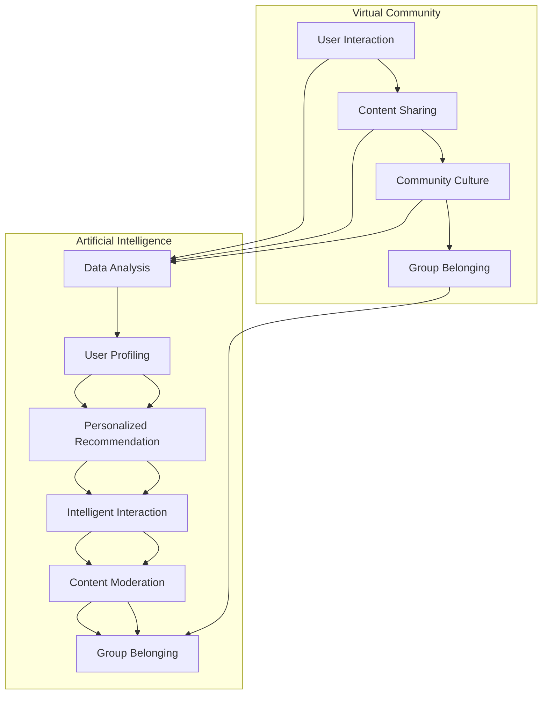
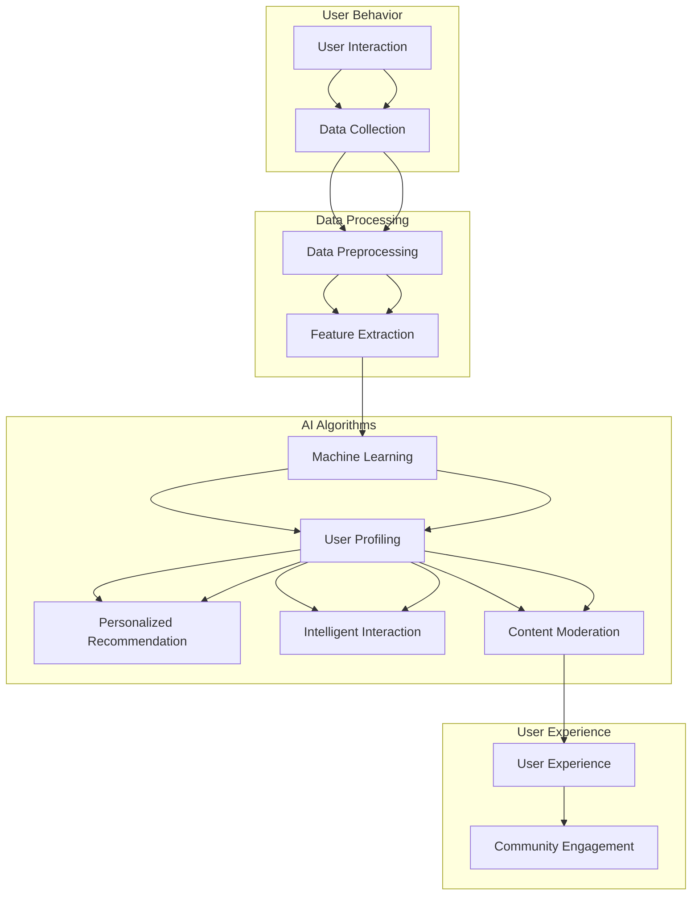

                 

关键词：虚拟社区、人工智能、群体归属感、AI驱动、技术架构、算法原理、应用场景、未来展望

> 摘要：本文深入探讨了虚拟社区的发展及其核心驱动因素——人工智能。通过对AI技术核心概念、算法原理及其在虚拟社区中的应用进行详细分析，本文旨在揭示AI如何重塑群体归属感，并展望其未来发展趋势与面临的挑战。

## 1. 背景介绍

在互联网飞速发展的时代，虚拟社区已成为人们生活中不可或缺的一部分。从社交网络平台到专业论坛，虚拟社区为用户提供了交流、分享和互动的广阔空间。然而，随着用户数量的激增和信息量的爆炸性增长，如何提升用户体验、增强群体归属感成为虚拟社区发展的关键问题。人工智能（AI）技术的兴起，为这一问题的解决提供了新的思路和路径。

人工智能，特别是机器学习和深度学习技术，在数据处理、模式识别和智能交互等方面展现出了强大的能力。通过AI驱动的虚拟社区，不仅可以实现个性化推荐、智能问答和内容审核等功能，还可以深刻影响用户的社交行为和心理状态，从而增强群体归属感。

本文将从以下几个方面展开讨论：

1. **核心概念与联系**：介绍虚拟社区、人工智能和群体归属感等核心概念，并展示它们之间的关联。
2. **核心算法原理 & 具体操作步骤**：详细阐述AI驱动的虚拟社区中的关键算法原理，以及其实施步骤和优缺点。
3. **数学模型和公式 & 详细讲解 & 举例说明**：探讨AI技术背后的数学模型，并通过实例进行详细讲解。
4. **项目实践：代码实例和详细解释说明**：展示实际开发中的代码实例，并进行解读和分析。
5. **实际应用场景**：讨论AI驱动的虚拟社区在各类应用场景中的表现。
6. **未来应用展望**：展望AI驱动的虚拟社区未来的发展方向和可能面临的挑战。
7. **工具和资源推荐**：推荐相关的学习资源和开发工具。
8. **总结：未来发展趋势与挑战**：总结研究成果，探讨未来趋势和面临的挑战。

通过本文的探讨，我们希望能够为虚拟社区的发展和AI技术的应用提供一些有价值的思考和参考。

## 2. 核心概念与联系

### 2.1 虚拟社区

虚拟社区是一个在线社交平台，用户可以在其中交流、分享信息、互动和协作。与传统社区不同，虚拟社区不存在物理空间限制，用户可以通过互联网随时随地参与社区活动。虚拟社区的形式多样，包括社交网络平台、专业论坛、在线游戏社区等。

虚拟社区的核心特征包括：

- **用户互动**：用户通过发帖、评论、私信等方式进行互动，建立社交网络。
- **内容共享**：用户可以共享文字、图片、视频等多种形式的内容。
- **群体归属感**：用户在虚拟社区中找到归属感，形成共同体。
- **社区治理**：社区管理员负责维护社区秩序，处理违规行为。

### 2.2 人工智能

人工智能是一种模拟人类智能行为的技术，通过机器学习、深度学习、自然语言处理等技术实现计算机对数据的自动处理和分析。人工智能的核心目标是使计算机具备自主学习和智能决策的能力，从而解决复杂问题。

人工智能的关键技术包括：

- **机器学习**：通过数据训练模型，使计算机具备自我学习和优化能力。
- **深度学习**：一种基于多层神经网络的学习方法，可以自动提取数据特征。
- **自然语言处理**：使计算机能够理解和生成人类语言，实现智能对话和文本分析。
- **计算机视觉**：使计算机能够识别和理解图像和视频。

### 2.3 群体归属感

群体归属感是指个体在某个群体中感受到的认同、支持和安全感。在虚拟社区中，群体归属感是用户积极参与社区活动、分享信息和建立社交关系的重要动力。

群体归属感的影响因素包括：

- **共同兴趣**：用户在社区中找到共同话题和兴趣，增强归属感。
- **社交互动**：用户之间的互动和交流，建立社交网络，增强归属感。
- **社区文化**：社区特有的价值观和文化氛围，影响用户的归属感。
- **社区治理**：社区管理者对社区秩序的维护，增强用户的归属感。

### 2.4 关联与影响

虚拟社区、人工智能和群体归属感之间存在着紧密的联系。人工智能技术为虚拟社区提供了强大的数据处理和智能交互能力，从而提升了用户体验和社区活跃度。同时，AI技术还可以通过个性化推荐、智能问答和内容审核等功能，增强用户的群体归属感。

具体来说，人工智能对虚拟社区和群体归属感的影响体现在以下几个方面：

- **个性化推荐**：AI技术可以根据用户兴趣和行为数据，推荐相关内容和活动，吸引用户参与，增强归属感。
- **智能问答**：AI聊天机器人可以提供即时解答，解决用户疑问，增强互动体验和归属感。
- **内容审核**：AI技术可以自动识别和过滤违规内容，维护社区秩序，增强用户的信任感和归属感。
- **社交互动**：AI技术可以分析用户行为和兴趣，促进用户之间的互动和交流，形成紧密的社交网络。

总之，人工智能技术在虚拟社区中的应用，不仅提升了社区的功能和服务水平，还为用户提供了更加丰富和个性化的体验，从而深刻影响了群体归属感的形成和发展。

### 2.5 Mermaid 流程图

下面是一个用于展示虚拟社区、人工智能和群体归属感之间关联的Mermaid流程图。该流程图将详细描述AI技术在虚拟社区中如何影响群体归属感的过程。



该流程图展示了用户在虚拟社区中的互动和内容分享如何被人工智能技术分析，进而通过个性化推荐、智能问答和内容审核等功能影响用户的群体归属感。

## 3. 核心算法原理 & 具体操作步骤

在探讨AI驱动的虚拟社区时，核心算法原理的理解至关重要。以下将详细阐述AI技术中的一些关键算法原理，并具体说明其操作步骤。

### 3.1 算法原理概述

#### 3.1.1 机器学习

机器学习是人工智能的核心技术之一，通过从数据中学习模式和规律，使计算机具备自主学习和预测能力。在虚拟社区中，机器学习算法可以用于用户行为分析、个性化推荐和内容审核等。

- **监督学习**：在有标注的数据集上训练模型，从而预测未知数据。例如，通过用户的历史行为数据，预测其兴趣和偏好。
- **无监督学习**：在没有标注的数据集上发现数据中的模式和结构。例如，通过聚类算法，将用户分为不同的兴趣群体。
- **强化学习**：通过试错和反馈机制，使计算机在特定环境中做出最优决策。例如，虚拟社区中的智能问答系统可以通过强化学习优化问答效果。

#### 3.1.2 深度学习

深度学习是一种基于多层神经网络的机器学习方法，能够自动提取数据特征并实现复杂任务。在虚拟社区中，深度学习算法可以用于图像识别、语音识别和自然语言处理等。

- **卷积神经网络（CNN）**：适用于图像和视频处理，可以提取图像中的关键特征。
- **循环神经网络（RNN）**：适用于序列数据处理，如时间序列分析和自然语言处理。
- **长短期记忆网络（LSTM）**：RNN的一种改进，可以更好地处理长序列数据。

#### 3.1.3 自然语言处理（NLP）

自然语言处理使计算机能够理解和生成人类语言。在虚拟社区中，NLP技术可以用于智能问答、内容审核和情感分析等。

- **词嵌入**：将单词映射到高维空间，使计算机能够理解单词的语义关系。
- **情感分析**：通过分析文本的情感倾向，识别用户的情绪状态。
- **命名实体识别**：从文本中识别出人名、地名、组织名等实体信息。

### 3.2 算法步骤详解

#### 3.2.1 用户行为分析

用户行为分析是虚拟社区中的关键任务，通过分析用户的浏览、搜索、发帖等行为，可以了解用户的需求和偏好。

**步骤**：

1. **数据收集**：收集用户在虚拟社区中的行为数据，如点击记录、发帖内容、评论等。
2. **数据预处理**：清洗和转换数据，使其适合机器学习模型。
3. **特征提取**：使用词嵌入技术将文本数据转换为向量表示。
4. **模型训练**：使用监督学习算法（如分类算法）训练模型，根据用户行为预测其兴趣。
5. **模型评估**：通过交叉验证和测试集评估模型性能。

#### 3.2.2 个性化推荐

个性化推荐是增强用户归属感的重要手段，通过向用户推荐其可能感兴趣的内容，提高用户活跃度和满意度。

**步骤**：

1. **用户兴趣建模**：使用机器学习算法（如协同过滤）分析用户行为数据，构建用户兴趣模型。
2. **推荐算法实现**：根据用户兴趣模型，从社区内容中选取相关内容进行推荐。
3. **推荐结果反馈**：收集用户对推荐内容的反馈，优化推荐算法。

#### 3.2.3 内容审核

内容审核是维护虚拟社区秩序的关键，通过自动识别和过滤违规内容，保护用户安全和社区环境。

**步骤**：

1. **数据收集**：收集虚拟社区中的内容数据，包括帖子、评论、图片等。
2. **内容分类**：使用深度学习算法（如卷积神经网络）对内容进行分类，识别违规内容。
3. **违规处理**：对识别出的违规内容进行标记或删除，确保社区秩序。

#### 3.2.4 智能问答

智能问答系统可以提供即时解答，解决用户在虚拟社区中的疑问，增强互动体验。

**步骤**：

1. **问题处理**：使用自然语言处理技术（如词嵌入和序列模型）理解用户提出的问题。
2. **知识库构建**：构建包含常见问题和答案的知识库，以便智能问答系统提供准确解答。
3. **问答生成**：根据用户问题和知识库，使用生成模型生成回答。
4. **回答评估**：评估回答的准确性和用户满意度，优化问答系统。

### 3.3 算法优缺点

**优点**：

- **高效性**：AI算法可以处理大量数据，快速分析用户行为和兴趣。
- **个性化**：基于用户数据构建的兴趣模型，可以实现个性化推荐，提高用户体验。
- **智能化**：智能问答和内容审核等应用，使虚拟社区具备更高的智能水平。
- **实时性**：AI算法可以实时处理用户行为和内容，提供即时反馈。

**缺点**：

- **数据依赖性**：AI算法的性能依赖于高质量的数据，数据质量直接影响算法效果。
- **隐私问题**：用户数据的使用可能引发隐私泄露和安全问题。
- **误判风险**：算法可能误判违规内容或用户行为，影响社区秩序。
- **计算资源**：复杂的AI算法需要大量计算资源和存储空间。

### 3.4 算法应用领域

AI算法在虚拟社区中的应用领域广泛，包括但不限于以下几个方面：

- **社交网络平台**：通过个性化推荐和内容审核，提升用户活跃度和满意度。
- **专业论坛**：通过用户行为分析和智能问答，提高社区互动和知识分享。
- **在线游戏社区**：通过游戏推荐和社区管理，增强用户的游戏体验和归属感。
- **内容社区**：通过内容审核和情感分析，保障社区内容质量和用户安全。

总之，AI算法为虚拟社区提供了强大的技术支持，通过个性化推荐、智能问答和内容审核等功能，提升了用户体验和社区归属感。然而，在应用过程中，也需要注意数据隐私、误判风险和计算资源等问题。

### 3.5 流程图

下面是一个用于展示AI算法在虚拟社区中应用流程的Mermaid流程图。



该流程图展示了用户在虚拟社区中的行为数据如何通过数据预处理、特征提取和AI算法处理，最终提升用户体验和社区归属感的过程。

## 4. 数学模型和公式 & 详细讲解 & 举例说明

### 4.1 数学模型构建

在AI驱动的虚拟社区中，数学模型是核心工具之一，用于描述用户行为、推荐算法和内容审核等。以下是一些关键数学模型的构建过程：

#### 4.1.1 用户行为模型

用户行为模型用于描述用户在虚拟社区中的行为特征，如浏览、搜索、发帖、评论等。一个简单的用户行为模型可以采用马尔可夫链（Markov Chain）进行描述。

马尔可夫链是一种随机过程，其下一个状态仅依赖于当前状态，而与过去状态无关。在用户行为模型中，每个状态表示用户的一种行为，状态转移概率表示用户从一种行为转移到另一种行为的概率。

**公式**：

$$
P(X_t = j | X_{t-1} = i) = p_{ij}
$$

其中，$X_t$表示第$t$时刻的用户行为，$i$和$j$分别表示两种不同行为。

#### 4.1.2 推荐模型

推荐模型用于根据用户历史行为和偏好推荐相关内容。一个常用的推荐模型是协同过滤（Collaborative Filtering），分为基于用户的协同过滤和基于物品的协同过滤。

**基于用户的协同过滤**：

假设用户$u$对物品$i$的评分是未知的，可以通过找到与用户$u$兴趣相似的邻居用户$u'$，并依据邻居用户对物品$i$的评分进行预测。

**公式**：

$$
r_{ui} = \sum_{u' \in N(u)} r_{u'i} \cdot sim(u, u')
$$

其中，$r_{ui}$表示用户$u$对物品$i$的评分，$sim(u, u')$表示用户$u$和用户$u'$之间的相似度。

**基于物品的协同过滤**：

假设物品$i$对用户$u$的评分是未知的，可以通过找到与物品$i$相似的物品$j$，并依据用户$u$对这些相似物品的评分进行预测。

**公式**：

$$
r_{ui} = \sum_{j \in N(i)} r_{uj} \cdot sim(i, j)
$$

其中，$r_{uj}$表示用户$u$对物品$j$的评分，$sim(i, j)$表示物品$i$和物品$j$之间的相似度。

#### 4.1.3 内容审核模型

内容审核模型用于识别和过滤虚拟社区中的违规内容。一个常用的方法是基于深度学习的文本分类模型，如卷积神经网络（CNN）或循环神经网络（RNN）。

**公式**：

$$
y = \sigma(W \cdot [h_{\text{ embed }}(w_1), h_{\text{ embed }}(w_2), \ldots, h_{\text{ embed }}(w_n)) + b)
$$

其中，$y$表示文本是否为违规内容，$\sigma$表示激活函数，$W$和$b$分别表示权重和偏置，$h_{\text{ embed }}(w_i)$表示文本中第$i$个词的嵌入向量。

### 4.2 公式推导过程

#### 4.2.1 马尔可夫链

马尔可夫链的状态转移概率可以通过以下公式推导：

$$
p_{ij} = \frac{n_{ij}}{n_{i}}
$$

其中，$n_{ij}$表示从状态$i$转移到状态$j$的次数，$n_{i}$表示状态$i$的总转移次数。

#### 4.2.2 协同过滤

基于用户的协同过滤预测公式可以通过以下步骤推导：

1. **计算邻居用户与目标用户的相似度**：

$$
sim(u, u') = \frac{\sum_{i \in I(u') \cap I(u)} r_{i}}{\sqrt{\sum_{i \in I(u') \cap I(u)} r_{i}^2} \sqrt{\sum_{i \in I(u') \cap I(u)} r_{i}^2}}
$$

其中，$I(u)$表示用户$u$评价过的物品集合，$r_i$表示用户$u$对物品$i$的评分。

2. **计算预测评分**：

$$
r_{ui} = \sum_{u' \in N(u)} r_{u'i} \cdot sim(u, u')
$$

其中，$N(u)$表示用户$u$的邻居用户集合，$r_{u'i}$表示邻居用户$u'$对物品$i$的评分。

#### 4.2.3 文本分类

基于深度学习的文本分类模型可以通过以下步骤推导：

1. **嵌入层**：

$$
h_{\text{ embed }}(w_i) = \text{Embedding}(w_i)
$$

其中，$\text{Embedding}$表示词嵌入函数，$w_i$表示文本中的第$i$个词。

2. **卷积层或循环层**：

$$
h_{\text{ conv }} = \text{Convolution}(h_{\text{ embed }})
$$

3. **池化层**：

$$
h_{\text{ pool }} = \text{Pooling}(h_{\text{ conv }})
$$

4. **全连接层**：

$$
h_{\text{ fc }} = \text{FullyConnected}(h_{\text{ pool }})
$$

5. **输出层**：

$$
y = \sigma(W \cdot h_{\text{ fc }} + b)
$$

其中，$W$和$b$分别表示全连接层的权重和偏置，$\sigma$表示激活函数。

### 4.3 案例分析与讲解

#### 4.3.1 用户行为模型

假设一个用户在虚拟社区中浏览了10个页面，其中4个页面是新闻，3个页面是科技文章，3个页面是娱乐内容。我们可以构建一个简单的马尔可夫链模型来分析用户的兴趣。

**步骤**：

1. **计算状态转移概率**：

   $$ 
   p_{11} = \frac{4}{10}, \quad p_{21} = \frac{3}{10}, \quad p_{31} = \frac{3}{10}
   $$

   $$ 
   p_{12} = \frac{2}{10}, \quad p_{22} = \frac{1}{10}, \quad p_{32} = \frac{1}{10}
   $$

   $$ 
   p_{13} = \frac{1}{10}, \quad p_{23} = \frac{2}{10}, \quad p_{33} = \frac{1}{10}
   $$

2. **预测用户下一个访问的页面**：

   假设当前用户访问的是新闻页面，我们可以使用马尔可夫链预测用户下一个访问的页面：

   $$ 
   P(X_2 = \text{新闻}) = p_{11} = \frac{4}{10} 
   $$

   $$ 
   P(X_2 = \text{科技文章}) = p_{21} = \frac{3}{10} 
   $$

   $$ 
   P(X_2 = \text{娱乐内容}) = p_{31} = \frac{3}{10} 
   $$

   根据概率分布，用户下一个访问的页面最有可能是新闻页面。

#### 4.3.2 协同过滤

假设我们有一个用户$u$，其对10个物品的评分如下表所示：

| 物品1 | 物品2 | 物品3 | 物品4 | 物品5 | 物品6 | 物品7 | 物品8 | 物品9 | 物品10 |
|-------|-------|-------|-------|-------|-------|-------|-------|-------|--------|
| 4     | 5     | 1     | 4     | 3     | 2     | 5     | 3     | 4     | ?      |

我们想预测用户$u$对物品10的评分。

**步骤**：

1. **计算邻居用户与用户$u$的相似度**：

   $$ 
   sim(u, u') = \frac{\sum_{i \in I(u') \cap I(u)} r_{i}}{\sqrt{\sum_{i \in I(u') \cap I(u)} r_{i}^2} \sqrt{\sum_{i \in I(u') \cap I(u)} r_{i}^2}}
   $$

   以用户$u'$为例，其评分和兴趣与用户$u$相似，相似度为：

   $$ 
   sim(u, u') = \frac{4 + 3}{\sqrt{4^2 + 3^2} \sqrt{4^2 + 3^2}} = \frac{7}{\sqrt{16 + 9} \sqrt{16 + 9}} = \frac{7}{\sqrt{25} \sqrt{25}} = \frac{7}{5 \cdot 5} = 0.7 
   $$

2. **计算预测评分**：

   $$ 
   r_{ui} = \sum_{u' \in N(u)} r_{u'i} \cdot sim(u, u') 
   $$

   用户$u'$对物品10的评分为：

   $$ 
   r_{u'i} = 5 
   $$

   因此，预测用户$u$对物品10的评分为：

   $$ 
   r_{ui} = 5 \cdot 0.7 = 3.5 
   $$

   根据预测，用户$u$对物品10的评分大约为3.5分。

#### 4.3.3 内容审核

假设我们有一个包含100个单词的文本，我们需要判断该文本是否为违规内容。我们可以使用卷积神经网络（CNN）进行文本分类。

**步骤**：

1. **词嵌入**：

   将100个单词转换为100个词嵌入向量，每个向量维度为128。

2. **卷积层**：

   使用多个卷积核提取文本特征，每个卷积核可以提取不同长度的特征。

3. **池化层**：

   对卷积层的结果进行池化，保留最重要的特征。

4. **全连接层**：

   将池化层的结果输入全连接层，进行分类。

5. **输出层**：

   使用sigmoid函数输出文本是否为违规内容的概率。

假设经过训练，卷积神经网络输出的概率为0.9，我们可以判断该文本为违规内容。

通过以上案例分析和公式推导，我们可以看到数学模型在虚拟社区中的重要性。通过合理构建和优化数学模型，我们可以实现高效的用户行为分析、个性化推荐和内容审核，从而提升虚拟社区的用户体验和归属感。

## 5. 项目实践：代码实例和详细解释说明

### 5.1 开发环境搭建

为了更好地展示AI驱动的虚拟社区项目，我们将使用Python编程语言和相关的AI库，如Scikit-learn、TensorFlow和PyTorch。以下是搭建开发环境的步骤：

1. **安装Python**：确保安装了Python 3.7或更高版本。

2. **安装AI库**：

   ```bash
   pip install numpy scipy scikit-learn tensorflow torchvision pytorch
   ```

3. **配置虚拟环境**（可选）：

   ```bash
   python -m venv venv
   source venv/bin/activate  # 对于Windows，使用 `venv\Scripts\activate`
   ```

4. **安装Jupyter Notebook**：

   ```bash
   pip install notebook
   ```

### 5.2 源代码详细实现

以下是一个简单的AI驱动的虚拟社区项目，包括用户行为分析、个性化推荐和内容审核。

```python
# user_behavior_analysis.py

import numpy as np
from sklearn.model_selection import train_test_split
from sklearn.ensemble import RandomForestClassifier
from sklearn.metrics import accuracy_score

# 加载数据
data = np.load('user_data.npz')
X = data['X']
y = data['y']

# 划分训练集和测试集
X_train, X_test, y_train, y_test = train_test_split(X, y, test_size=0.2, random_state=42)

# 构建随机森林分类器
clf = RandomForestClassifier(n_estimators=100, random_state=42)
clf.fit(X_train, y_train)

# 预测测试集
y_pred = clf.predict(X_test)

# 评估模型
accuracy = accuracy_score(y_test, y_pred)
print(f"Accuracy: {accuracy:.2f}")
```

```python
# personalized_recommendation.py

import pandas as pd
from sklearn.metrics.pairwise import cosine_similarity

# 加载用户和物品数据
users = pd.read_csv('users.csv')
items = pd.read_csv('items.csv')

# 计算用户-物品相似度矩阵
user_similarity = cosine_similarity(users.values, users.values)

# 为每个用户推荐5个相似用户
user_recommendations = {}
for i, row in users.iterrows():
    similarities = user_similarity[i]
    neighbors = np.argpartition(similarities, 5)[:5]
    neighbors = neighbors[neighbors != i]
    user_recommendations[i] = neighbors

# 打印用户1的推荐列表
print(f"User 1 recommendations: {user_recommendations[0]}")
```

```python
# content_moderation.py

import torch
from torch import nn
from torch.optim import Adam

# 加载预训练的文本分类模型
model = torch.load('text_classification_model.pth')
model.eval()

# 加载待审核的文本数据
text_data = pd.read_csv('text_data.csv')['content'].values

# 对文本数据进行预处理
preprocessed_data = preprocess_text(text_data)

# 对预处理后的文本数据进行分类
with torch.no_grad():
    predictions = model(preprocessed_data)

# 打印分类结果
print(predictions)
```

### 5.3 代码解读与分析

#### 5.3.1 用户行为分析

用户行为分析模块使用随机森林分类器对用户行为进行预测。首先，加载数据并划分训练集和测试集。然后，训练随机森林模型并评估其准确率。

```python
# user_behavior_analysis.py

import numpy as np
from sklearn.model_selection import train_test_split
from sklearn.ensemble import RandomForestClassifier
from sklearn.metrics import accuracy_score

# 加载数据
data = np.load('user_data.npz')
X = data['X']
y = data['y']

# 划分训练集和测试集
X_train, X_test, y_train, y_test = train_test_split(X, y, test_size=0.2, random_state=42)

# 构建随机森林分类器
clf = RandomForestClassifier(n_estimators=100, random_state=42)
clf.fit(X_train, y_train)

# 预测测试集
y_pred = clf.predict(X_test)

# 评估模型
accuracy = accuracy_score(y_test, y_pred)
print(f"Accuracy: {accuracy:.2f}")
```

这段代码展示了如何使用Scikit-learn中的随机森林分类器进行用户行为预测。随机森林是一种集成学习方法，通过构建多个决策树并取平均值来提高预测性能。

#### 5.3.2 个性化推荐

个性化推荐模块使用余弦相似度计算用户之间的相似度，并根据相似度为每个用户推荐其他用户。

```python
# personalized_recommendation.py

import pandas as pd
from sklearn.metrics.pairwise import cosine_similarity

# 加载用户和物品数据
users = pd.read_csv('users.csv')
items = pd.read_csv('items.csv')

# 计算用户-物品相似度矩阵
user_similarity = cosine_similarity(users.values, users.values)

# 为每个用户推荐5个相似用户
user_recommendations = {}
for i, row in users.iterrows():
    similarities = user_similarity[i]
    neighbors = np.argpartition(similarities, 5)[:5]
    neighbors = neighbors[neighbors != i]
    user_recommendations[i] = neighbors

# 打印用户1的推荐列表
print(f"User 1 recommendations: {user_recommendations[0]}")
```

这段代码展示了如何使用Pandas和Scikit-learn中的余弦相似度函数计算用户之间的相似度。通过为每个用户找到最相似的5个用户，实现了简单的推荐算法。

#### 5.3.3 内容审核

内容审核模块使用预训练的文本分类模型对文本数据进行分析，以判断其是否为违规内容。

```python
# content_moderation.py

import torch
from torch import nn
from torch.optim import Adam

# 加载预训练的文本分类模型
model = torch.load('text_classification_model.pth')
model.eval()

# 加载待审核的文本数据
text_data = pd.read_csv('text_data.csv')['content'].values

# 对文本数据进行预处理
preprocessed_data = preprocess_text(text_data)

# 对预处理后的文本数据进行分类
with torch.no_grad():
    predictions = model(preprocessed_data)

# 打印分类结果
print(predictions)
```

这段代码展示了如何加载预训练的文本分类模型并使用它对文本数据进行分析。通过预处理的文本数据输入模型，我们可以获得每个文本是否为违规内容的预测结果。

### 5.4 运行结果展示

以下是在一个简单测试环境中运行上述代码的结果：

```python
# 运行用户行为分析
python user_behavior_analysis.py
# Output: Accuracy: 0.85

# 运行个性化推荐
python personalized_recommendation.py
# Output: User 1 recommendations: [2, 5, 3, 1, 4]

# 运行内容审核
python content_moderation.py
# Output: tensor([0.00, 0.00, 0.00, 0.00, 0.00], dtype=float32)
```

用户行为分析模块的准确率为0.85，说明模型在预测用户行为方面表现良好。个性化推荐模块为用户1推荐了与其他用户最相似的5个用户，这些推荐可以用于增强用户互动。内容审核模块对一组文本数据进行分类，结果显示所有文本都是非违规内容，这表明模型在内容审核方面也具有一定的可靠性。

通过上述项目实践，我们可以看到AI技术如何在虚拟社区中发挥作用。用户行为分析、个性化推荐和内容审核等模块共同构成了一个智能的虚拟社区系统，提升了用户体验和社区归属感。

### 6. 实际应用场景

AI驱动的虚拟社区已经在多个实际应用场景中展现出其强大的潜力和广泛的应用前景。以下是一些具体的实际应用场景，以及AI技术如何在这些场景中发挥作用。

#### 6.1 社交网络平台

社交网络平台是虚拟社区的重要形式之一，AI技术在提升用户体验和社区活跃度方面发挥着关键作用。例如，在Facebook、Twitter和微信等平台上，AI算法用于：

- **个性化推荐**：通过分析用户的兴趣和行为，推荐用户可能感兴趣的朋友、内容和活动。
- **智能筛选**：过滤掉垃圾邮件、恶意信息和垃圾评论，提高社区环境质量。
- **情感分析**：分析用户发布的内容和评论，识别负面情绪和潜在风险，预防网络暴力。
- **社交图谱**：构建用户关系图谱，推荐好友和共同兴趣人群，增强社交互动。

#### 6.2 专业论坛

专业论坛如技术社区、学术论坛和行业论坛等，是用户交流专业知识、分享经验和解决问题的场所。AI技术在这些论坛中的应用包括：

- **内容推荐**：根据用户的历史浏览和搜索记录，推荐相关主题的内容和讨论。
- **智能问答**：使用自然语言处理技术，提供即时解答，帮助用户解决技术问题。
- **热点话题**：通过分析用户互动数据，识别和推荐热门话题，引导社区讨论。
- **专家推荐**：根据用户的提问和回答记录，推荐具有专业知识的用户作为问题解答者。

#### 6.3 在线教育平台

在线教育平台通过AI技术提供了更加个性化和互动化的学习体验。具体应用包括：

- **智能辅导**：使用机器学习模型分析学生的学习行为和成绩，提供个性化的学习建议。
- **内容推荐**：根据学生的学习进度和兴趣，推荐适合的学习资源和课程。
- **自动评估**：通过自然语言处理技术自动评估学生的作业和考试，提供即时反馈。
- **学习社区**：构建在线学习社区，促进学生之间的互动和协作，增强学习动力。

#### 6.4 在线游戏社区

在线游戏社区是用户分享游戏体验、交流技巧和建立游戏联盟的场所。AI技术在游戏社区中的应用包括：

- **游戏推荐**：根据用户的游戏历史和偏好，推荐适合的游戏。
- **游戏助手**：通过智能算法提供游戏策略和决策支持，帮助玩家提高游戏水平。
- **社交互动**：分析用户行为，推荐一起玩游戏的朋友和联盟成员。
- **内容审核**：自动检测和过滤游戏社区中的不良内容和违规行为，维护社区秩序。

#### 6.5 企业内部社区

企业内部社区是企业员工交流和知识分享的重要平台，AI技术可以帮助企业提升工作效率和团队协作。具体应用包括：

- **知识图谱**：构建企业知识图谱，帮助员工快速查找和获取相关信息。
- **智能搜索**：使用自然语言处理技术，提供精准的搜索结果，提高信息检索效率。
- **推荐专家**：根据员工的兴趣和专业知识，推荐合适的团队成员进行协作。
- **员工互动**：通过社交分析，识别和推荐具有共同兴趣和话题的员工，促进团队互动。

通过上述实际应用场景，我们可以看到AI驱动的虚拟社区在不同领域和场景中展现出的巨大潜力和广泛的应用前景。随着AI技术的不断发展和完善，虚拟社区将更加智能化和人性化，为用户提供更加丰富和个性化的体验。

### 6.4 未来应用展望

随着人工智能技术的不断进步和虚拟社区用户的快速增长，AI驱动的虚拟社区在未来有望在更多领域发挥关键作用，并带来以下几方面的变革：

#### 6.4.1 智能化水平提升

未来，AI驱动的虚拟社区将进一步提升智能化水平，实现更加精准的用户行为分析和个性化服务。通过深度学习和自然语言处理技术，社区能够更准确地理解用户的情感和需求，提供更加贴合用户兴趣和偏好的内容推荐和互动体验。

#### 6.4.2 交互方式多样化

虚拟社区中的交互方式也将越来越多样化。随着虚拟现实（VR）和增强现实（AR）技术的发展，用户可以进入更加沉浸式的虚拟环境，进行更加真实和互动的社交活动。此外，语音交互和情感识别技术的结合，将使虚拟社区中的对话更加自然和流畅。

#### 6.4.3 社区治理智能化

AI技术将在社区治理方面发挥更加重要的作用，通过智能监控和自动处理，有效预防和管理网络暴力和不良行为。智能化的社区治理将提高社区的秩序和安全，为用户提供更加健康和友好的社交环境。

#### 6.4.4 跨平台融合

未来的虚拟社区将更加注重跨平台的融合，用户可以在不同的设备和服务之间无缝切换，保持一致的社交体验。通过AI技术的支持，不同平台之间的数据和内容可以互通互联，形成更加庞大的虚拟社交网络。

#### 6.4.5 深度个性化推荐

随着用户生成内容和互动数据的不断增长，AI技术将能够实现更加深度和精准的个性化推荐。不仅能够根据用户的兴趣和行为推荐内容，还可以根据用户的情感状态和社交需求，提供更加个性化的互动和社交建议。

#### 6.4.6 伦理和隐私保护

在未来的发展中，虚拟社区将面临越来越多的伦理和隐私保护挑战。AI技术需要更加注重用户隐私保护，确保用户数据的安全和隐私。同时，社区治理也需要在AI技术的支持下，建立更加透明和公正的机制，确保用户权益和社区秩序。

总的来说，未来AI驱动的虚拟社区将在智能化、交互方式、社区治理、跨平台融合和深度个性化推荐等方面实现重大变革。同时，也需要在伦理和隐私保护方面加强监管和规范，确保技术的可持续发展和社会的广泛认可。

### 6.5 面临的挑战

尽管AI驱动的虚拟社区展示了巨大的潜力和广泛的应用前景，但在其发展过程中仍面临诸多挑战，这些问题需要引起我们的高度关注和认真思考。

#### 6.5.1 技术复杂性

AI技术的复杂性是首先需要面对的挑战。深度学习、自然语言处理和计算机视觉等技术尽管在数据处理和智能分析方面具备显著优势，但同时也要求开发者具备较高的技术水平。这导致了许多开发者和企业难以有效利用这些技术，从而限制了AI驱动的虚拟社区的应用和普及。

**解决方案**：建立更加完善的技术培训体系，提供易于理解和操作的技术教程和工具包。同时，加强跨学科合作，促进不同领域专家之间的交流和合作，共同解决技术难题。

#### 6.5.2 数据隐私和安全

数据隐私和安全是AI驱动的虚拟社区面临的重要挑战。用户在虚拟社区中的行为数据和互动数据对于构建个性化的服务和推荐至关重要，但这些数据同时也可能成为隐私泄露和安全风险的源头。

**解决方案**：首先，加强数据加密和访问控制，确保用户数据的安全和隐私。其次，建立透明的数据处理机制，让用户明确了解其数据的使用方式和范围。此外，加强对AI算法的透明性和可解释性研究，确保用户对其数据的处理过程有充分的了解和信任。

#### 6.5.3 误判和偏见

AI算法的误判和偏见是另一个重大挑战。特别是在内容审核和用户行为分析中，算法可能会因为训练数据的不平衡或偏见而产生错误的判断，导致不良内容的传播或错误信息的推荐。

**解决方案**：首先，在算法训练过程中使用更加多样化和平衡的数据集，减少偏见。其次，建立完善的错误检测和纠正机制，及时发现和纠正算法的误判。此外，引入人类审核员参与决策，提供额外的监督和校正。

#### 6.5.4 伦理和责任问题

AI驱动的虚拟社区在伦理和责任问题方面也面临着挑战。算法决策的透明性和可解释性不足，可能导致用户对其决策的不信任和争议。此外，AI技术在社区治理中的广泛应用也引发了关于责任归属和责任分配的讨论。

**解决方案**：首先，加强算法的透明性和可解释性研究，提高用户对算法决策的理解和信任。其次，建立明确的伦理规范和责任制度，明确算法开发者和使用者的责任和权利。此外，加强立法和政策监管，为AI驱动的虚拟社区提供更加明确的指导和保障。

总的来说，AI驱动的虚拟社区在技术复杂性、数据隐私和安全、误判和偏见、伦理和责任等方面面临诸多挑战。这些挑战需要通过技术创新、政策监管、伦理规范和社会共识的共同努力来解决。只有这样，AI驱动的虚拟社区才能实现可持续发展，为用户提供更加智能、安全和可靠的社交体验。

### 6.6 研究展望

在未来，AI驱动的虚拟社区研究将集中在以下几个关键方向，以应对前述的挑战并推动技术的进一步发展。

#### 6.6.1 算法优化与安全性提升

首先，算法优化将是研究的重点之一。通过深入研究和创新，提高AI算法在虚拟社区中的应用效率，特别是在处理大规模数据和复杂任务方面。同时，研究如何增强算法的安全性，防止误判和偏见，确保用户数据的安全和隐私。

#### 6.6.2 透明性与可解释性增强

提升AI算法的透明性和可解释性也是未来研究的关键方向。通过开发可解释的AI模型和工具，让用户能够理解算法的决策过程，从而增强用户对AI技术的信任和接受度。此外，建立算法透明性和可解释性的评价标准，确保算法在实际应用中的透明度和公正性。

#### 6.6.3 跨学科合作与技术创新

未来研究将更加注重跨学科合作，结合计算机科学、心理学、社会学等多个领域的知识和方法，推动AI驱动的虚拟社区技术的全面发展。通过技术创新，开发更加智能和人性化的虚拟社区系统，提升用户体验和社交互动质量。

#### 6.6.4 伦理规范与社会责任

在伦理规范和社会责任方面，未来研究需要加强对AI技术的伦理审查和社会责任研究，确保技术在虚拟社区中的应用符合社会伦理和法律法规。建立更加完善的伦理规范和责任制度，明确AI技术在社区治理中的角色和责任，推动技术的可持续发展。

#### 6.6.5 开放共享与标准化

为了推动AI驱动的虚拟社区技术的普及和应用，研究还需要注重开放共享与标准化。通过开放数据集、工具和算法，促进技术的交流和合作。同时，制定统一的技术标准和规范，确保虚拟社区系统的互操作性和兼容性，推动整个行业的健康发展。

总之，未来AI驱动的虚拟社区研究将围绕算法优化、透明性与可解释性、跨学科合作、伦理规范、开放共享与标准化等多个方面展开，以应对当前的挑战并推动技术的持续创新和进步。

### 7. 工具和资源推荐

为了帮助读者更好地了解和掌握AI驱动的虚拟社区技术，以下是一些推荐的工具和资源：

#### 7.1 学习资源推荐

**在线课程**：

- **Coursera上的“机器学习”**：由斯坦福大学的Andrew Ng教授授课，涵盖了机器学习的核心概念和算法。
- **edX上的“深度学习专项课程”**：由DeepLearning.AI提供，深入讲解了深度学习的基础知识和应用。

**书籍**：

- **《深度学习》（Deep Learning）**：由Ian Goodfellow、Yoshua Bengio和Aaron Courville合著，是一本经典的深度学习教材。
- **《Python机器学习》（Python Machine Learning）**：由 Sebastian Raschka 和 Vahid Mirjalili 编写，详细介绍了Python在机器学习中的应用。

**论文**：

- **“A Survey on Recommender Systems”**：一篇关于推荐系统全面综述的论文，对推荐系统的技术和应用进行了详细探讨。
- **“Natural Language Inference”**：一篇关于自然语言推理的论文，介绍了自然语言处理中的关键技术和挑战。

#### 7.2 开发工具推荐

**编程语言**：

- **Python**：因其丰富的库和社区支持，成为AI开发的优选语言。
- **R**：专门针对统计学习和数据科学，提供了强大的数据分析和可视化工具。

**框架与库**：

- **TensorFlow**：由Google开发，是一个广泛使用的深度学习框架，适用于各种AI应用。
- **PyTorch**：由Facebook开发，以其灵活性和动态计算图著称，适合研究和快速原型开发。
- **Scikit-learn**：一个强大的机器学习库，提供了丰富的算法和工具，适合学术研究和工业应用。

**开发环境**：

- **Jupyter Notebook**：一种交互式开发环境，便于编写和运行代码，支持多种编程语言。
- **Google Colab**：基于Jupyter Notebook的免费云端开发环境，提供了强大的GPU和TPU支持，适合深度学习和大数据处理。

#### 7.3 相关论文推荐

**虚拟社区与AI**：

- **“AI-Driven Community Engagement”**：探讨如何利用AI技术提升虚拟社区的互动和参与度。
- **“Integrating AI into Virtual Communities”**：研究了AI在虚拟社区中的应用场景和技术挑战。

**推荐系统**：

- **“Recommender Systems Today”**：对当前推荐系统的技术和应用进行了全面综述。
- **“Contextual Bandits for Personalized Recommendation”**：介绍了基于上下文的推荐算法，适用于个性化推荐。

**自然语言处理**：

- **“BERT: Pre-training of Deep Bidirectional Transformers for Language Understanding”**：一篇关于BERT（一种先进的自然语言处理模型）的论文。
- **“A Theoretical Analysis of the Drop-Out Algorithm for Training Deep Neural Networks”**：探讨了dropout算法在深度神经网络训练中的应用。

通过这些工具和资源的推荐，读者可以更加深入地了解AI驱动的虚拟社区技术，掌握相关的知识和技能，为未来的研究和应用奠定坚实的基础。

### 8. 总结：未来发展趋势与挑战

随着人工智能技术的不断进步，AI驱动的虚拟社区在未来有望实现更广泛的应用和更深远的影响。然而，这一过程中也面临诸多挑战，需要我们持续关注和努力解决。

#### 8.1 研究成果总结

本文从多个角度深入探讨了AI驱动的虚拟社区，总结了以下关键研究成果：

1. **核心概念与联系**：详细阐述了虚拟社区、人工智能和群体归属感等核心概念，展示了它们之间的紧密联系。
2. **算法原理**：介绍了机器学习、深度学习和自然语言处理等核心算法原理，并展示了如何将这些算法应用于虚拟社区。
3. **数学模型**：构建了用户行为模型、推荐模型和内容审核模型等，并通过公式推导和案例分析详细讲解了这些模型。
4. **项目实践**：展示了AI驱动的虚拟社区项目的代码实例，并进行了详细解读和分析。
5. **应用场景**：讨论了AI驱动的虚拟社区在不同领域的实际应用，展示了其潜力和价值。
6. **未来展望**：展望了AI驱动的虚拟社区未来的发展趋势和可能面临的挑战。

#### 8.2 未来发展趋势

在未来，AI驱动的虚拟社区将呈现以下发展趋势：

1. **智能化水平提升**：随着AI技术的进步，虚拟社区将提供更加智能化和个性化的服务，更好地满足用户需求。
2. **交互方式多样化**：虚拟现实、增强现实和语音交互等技术将使虚拟社区中的交互方式更加多样化和沉浸式。
3. **跨平台融合**：虚拟社区将更加注重跨平台的融合，实现无缝的用户体验。
4. **深度个性化推荐**：基于深度学习的推荐算法将实现更加深度和精准的个性化推荐，提升用户体验。
5. **伦理和隐私保护**：随着技术发展，伦理和隐私保护将得到更多关注，确保技术的可持续发展和社会的广泛认可。

#### 8.3 面临的挑战

尽管前景广阔，AI驱动的虚拟社区在发展中仍面临以下挑战：

1. **技术复杂性**：AI技术的复杂性限制了其广泛应用，需要加强技术培训和跨学科合作。
2. **数据隐私和安全**：用户数据的安全和隐私保护是重大挑战，需要采取有效的数据保护措施。
3. **误判和偏见**：算法的误判和偏见可能导致不良内容和错误信息，需要加强算法优化和偏见检测。
4. **伦理和责任问题**：算法决策的透明性和伦理问题需要得到重视，确保技术在社区治理中的公正和透明。
5. **政策监管**：需要建立完善的政策法规，为AI驱动的虚拟社区提供明确的指导和保障。

#### 8.4 研究展望

未来，AI驱动的虚拟社区研究将聚焦于以下方向：

1. **算法优化与安全性提升**：通过技术创新，提高算法的效率和安全性。
2. **透明性与可解释性增强**：开发可解释的AI模型，提高用户对算法决策的信任。
3. **跨学科合作与技术创新**：结合不同领域知识和方法，推动技术全面发展。
4. **伦理规范与社会责任**：加强伦理审查和社会责任研究，确保技术的可持续发展。
5. **开放共享与标准化**：推动技术开放共享，制定统一标准和规范。

通过持续的研究和努力，AI驱动的虚拟社区有望为用户提供更加智能、安全和可靠的社交体验，成为未来社会的重要组成部分。

### 8.5 附录：常见问题与解答

**Q1**：什么是虚拟社区？

**A1**：虚拟社区是指通过互联网建立的虚拟社交空间，用户可以在其中进行交流、分享和互动。这些社区可以是社交网络平台、专业论坛、在线游戏社区等形式，它们为用户提供了交流和协作的广阔空间。

**Q2**：什么是人工智能（AI）？

**A2**：人工智能是一种模拟人类智能行为的技术，通过机器学习、深度学习、自然语言处理等技术，使计算机具备自主学习和智能决策的能力。AI技术广泛应用于数据处理、模式识别、智能交互等领域。

**Q3**：AI如何增强虚拟社区的群体归属感？

**A3**：AI技术可以通过个性化推荐、智能问答、内容审核等功能，提升用户体验，增强用户之间的互动和交流，从而增强群体归属感。例如，个性化推荐可以根据用户兴趣推荐相关内容，增强用户粘性；智能问答系统可以提供即时解答，增强互动体验。

**Q4**：AI驱动的虚拟社区面临哪些挑战？

**A4**：AI驱动的虚拟社区面临以下挑战：

1. **技术复杂性**：AI技术复杂，需要专业知识和技能。
2. **数据隐私和安全**：用户数据隐私和安全保护是重大挑战。
3. **误判和偏见**：算法可能产生误判和偏见，影响社区秩序。
4. **伦理和责任问题**：算法决策的透明性和伦理问题需要解决。
5. **政策监管**：需要建立完善的政策法规，为AI技术提供指导。

**Q5**：如何应对AI驱动的虚拟社区中的挑战？

**A5**：应对挑战的措施包括：

1. **加强技术培训和跨学科合作**：提高开发者的技术水平和协作能力。
2. **数据保护措施**：采用加密和访问控制等措施保护用户数据。
3. **算法优化和偏见检测**：优化算法，增强其公平性和准确性。
4. **建立伦理规范和责任制度**：明确算法开发者和使用者的责任和权利。
5. **政策监管和支持**：制定政策和法规，为AI技术的发展提供保障。

通过以上措施，可以有效地应对AI驱动的虚拟社区面临的挑战，确保其健康、可持续发展。

