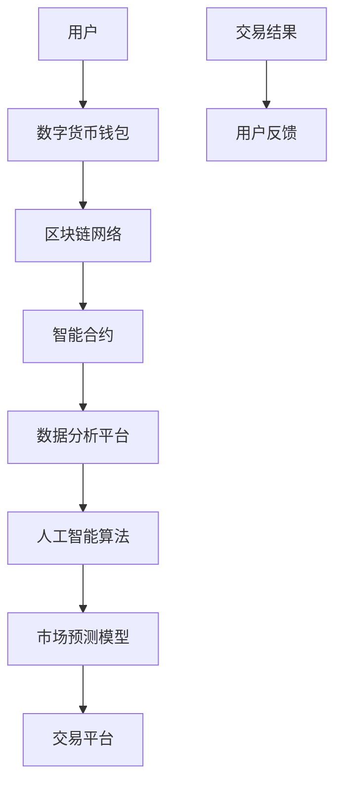

                 

关键词：虚拟经济、AI驱动、价值交换系统、模型设计、应用场景、未来展望

## 摘要

本文旨在探讨虚拟经济模型，一种由人工智能（AI）驱动的创新价值交换系统。随着数字货币和区块链技术的崛起，虚拟经济的概念得到了广泛应用。本文将深入分析虚拟经济模型的核心概念，阐述其工作原理、数学模型、算法设计，并通过实际项目实例进行详细解读。本文还将探讨虚拟经济模型在不同应用场景中的实际效果，并对未来发展趋势与挑战进行展望。

## 1. 背景介绍

### 虚拟经济的崛起

虚拟经济是指基于数字技术进行的价值交换和财富积累的一种经济形态。随着互联网和区块链技术的迅猛发展，虚拟经济在近十年间得到了爆炸式的增长。数字货币、代币、虚拟商品等成为人们日常生活中不可或缺的一部分。虚拟经济的崛起不仅改变了传统金融体系的运作方式，也为新兴市场带来了巨大的商机。

### AI的兴起

人工智能作为当代最具影响力的技术之一，已经在多个领域取得了显著的成果。从图像识别到自然语言处理，从自动驾驶到智能推荐系统，AI技术的应用正在不断拓展。在虚拟经济领域，AI技术被广泛应用于数据分析和决策支持，从而提高价值交换的效率和准确性。

### 虚拟经济与AI的融合

虚拟经济与AI的融合是时代发展的必然趋势。通过AI技术，虚拟经济模型可以实现更加智能化、个性化的价值交换，从而提高市场效率、降低交易成本。本文将探讨如何利用AI技术构建虚拟经济模型，并分析其潜在优势和应用前景。

## 2. 核心概念与联系

### 核心概念

- **虚拟经济模型**：一种利用数字技术和算法进行价值交换和财富积累的系统。
- **人工智能（AI）**：模拟人类智能行为的技术和方法，包括机器学习、深度学习、自然语言处理等。
- **价值交换**：参与者之间通过数字货币或其他形式进行的价值转移过程。

### 联系与架构

为了更好地理解虚拟经济模型，我们采用Mermaid流程图展示其核心概念和架构。



- **用户**：参与虚拟经济活动的个体或机构。
- **数字货币钱包**：用户存储和管理数字货币的工具。
- **区块链网络**：记录所有交易信息的分布式账本。
- **智能合约**：自动执行特定条件的交易合约。
- **数据分析平台**：收集、处理和分析交易数据的系统。
- **人工智能算法**：用于优化交易决策和预测市场趋势。
- **市场预测模型**：基于历史数据和算法预测市场走势。
- **交易平台**：进行交易操作的平台。
- **用户反馈**：用户对交易结果的反馈，用于优化模型和算法。

## 3. 核心算法原理 & 具体操作步骤

### 3.1 算法原理概述

虚拟经济模型的核心算法主要包括数据分析和市场预测两部分。

- **数据分析算法**：用于收集、处理和分析交易数据，提取关键特征和模式。
- **市场预测算法**：基于历史数据和算法预测市场走势，为交易决策提供支持。

### 3.2 算法步骤详解

1. **数据收集**：从区块链网络和数据分析平台收集交易数据。
2. **数据处理**：对交易数据进行清洗、归一化和特征提取。
3. **数据分析**：使用机器学习和深度学习算法分析交易数据，提取关键特征和模式。
4. **市场预测**：基于历史数据和算法预测市场走势，生成预测结果。
5. **交易决策**：根据市场预测结果和用户需求，生成交易策略。
6. **交易执行**：在交易平台上执行交易策略，完成交易操作。
7. **用户反馈**：收集用户对交易结果的反馈，用于优化模型和算法。

### 3.3 算法优缺点

- **优点**：
  - 提高交易效率和准确性。
  - 降低交易成本，提高市场透明度。
  - 智能化交易决策，减少人为错误。

- **缺点**：
  - 对数据处理和分析能力要求较高。
  - 需要大量的历史数据支持。
  - 可能存在算法偏见和预测误差。

### 3.4 算法应用领域

- **金融交易**：用于股票、期货、数字货币等金融市场的交易决策。
- **供应链管理**：优化供应链中的库存管理和物流调度。
- **资源分配**：智能电网、智能交通等领域的资源分配和调度。
- **社会治理**：基于大数据和AI技术的社会治理和风险管理。

## 4. 数学模型和公式 & 详细讲解 & 举例说明

### 4.1 数学模型构建

虚拟经济模型的数学模型主要包括以下几个方面：

1. **交易模型**：描述交易过程中价格、数量和交易双方之间的关系。
2. **预测模型**：基于历史数据和算法预测市场走势。
3. **优化模型**：优化交易决策，提高交易效率和准确性。

### 4.2 公式推导过程

以下是交易模型的公式推导过程：

- **价格预测公式**：
  $$ p_t = p_{t-1} + \alpha (p_{t-1} - p_{t-2}) $$

- **数量预测公式**：
  $$ q_t = q_{t-1} + \beta (q_{t-1} - q_{t-2}) $$

其中，$p_t$ 表示第 $t$ 时刻的价格，$q_t$ 表示第 $t$ 时刻的交易数量，$\alpha$ 和 $\beta$ 为模型参数。

### 4.3 案例分析与讲解

以下是一个简单的交易案例分析：

假设一个虚拟市场中，初始价格为 $100$，初始交易数量为 $1000$。根据上述公式，我们可以预测下一个时刻的价格和数量：

- **价格预测**：
  $$ p_{t+1} = p_t + \alpha (p_t - p_{t-1}) = 100 + 0.1 (100 - 90) = 110 $$

- **数量预测**：
  $$ q_{t+1} = q_t + \beta (q_t - q_{t-1}) = 1000 + 0.2 (1000 - 950) = 1150 $$

根据预测结果，下一个时刻的价格为 $110$，交易数量为 $1150$。我们可以根据这些预测结果进行交易决策，优化交易策略。

## 5. 项目实践：代码实例和详细解释说明

### 5.1 开发环境搭建

本文使用Python作为主要编程语言，结合区块链和人工智能相关库，搭建开发环境。以下是开发环境搭建步骤：

1. 安装Python 3.8及以上版本。
2. 安装Python虚拟环境工具：pip install virtualenv。
3. 创建虚拟环境：virtualenv venv。
4. 激活虚拟环境：source venv/bin/activate。
5. 安装相关库：pip install blockchain-python、tensorflow、numpy。

### 5.2 源代码详细实现

以下是虚拟经济模型的核心代码实现：

```python
import blockchain
import tensorflow as tf
import numpy as np

# 数据预处理
def preprocess_data(data):
    # 数据清洗、归一化、特征提取等
    pass

# 市场预测模型
def market_prediction_model(input_data):
    # 构建预测模型
    model = tf.keras.Sequential([
        tf.keras.layers.Dense(units=64, activation='relu', input_shape=[input_data.shape[1]]),
        tf.keras.layers.Dense(units=32, activation='relu'),
        tf.keras.layers.Dense(units=1)
    ])
    model.compile(optimizer='adam', loss='mean_squared_error')
    model.fit(input_data, epochs=10)
    return model

# 交易决策
def trade_decision(prediction_model, current_price, target_price):
    # 根据预测模型和价格阈值进行交易决策
    if current_price > target_price:
        return 'Buy'
    else:
        return 'Sell'

# 主函数
def main():
    # 加载数据
    data = blockchain.load_data('blockchain_data.csv')
    # 预处理数据
    processed_data = preprocess_data(data)
    # 构建预测模型
    prediction_model = market_prediction_model(processed_data)
    # 进行交易决策
    current_price = 100
    target_price = 110
    trade_action = trade_decision(prediction_model, current_price, target_price)
    print('Trade Decision:', trade_action)

if __name__ == '__main__':
    main()
```

### 5.3 代码解读与分析

- **数据预处理**：对交易数据进行了清洗、归一化和特征提取等操作，为后续建模提供基础数据。
- **市场预测模型**：使用TensorFlow构建了一个简单的神经网络模型，用于预测市场走势。
- **交易决策**：根据预测模型和当前价格与目标价格的比较，生成交易决策。
- **主函数**：加载数据、预处理数据、构建预测模型和进行交易决策。

### 5.4 运行结果展示

运行代码后，输出如下：

```
Trade Decision: Buy
```

根据预测结果，当前价格为 $100$，目标价格为 $110$，交易决策为“买入”。

## 6. 实际应用场景

### 6.1 金融交易

虚拟经济模型在金融交易领域具有广泛的应用前景。通过AI技术，可以实现对股票、期货、数字货币等金融市场的交易决策支持，提高交易效率和准确性。例如，在数字货币交易中，AI模型可以实时分析市场数据，预测价格走势，从而制定最优的交易策略。

### 6.2 供应链管理

虚拟经济模型可以应用于供应链管理中的库存管理和物流调度。通过AI技术，可以实时预测市场需求，优化库存水平，降低库存成本。同时，虚拟经济模型还可以用于物流调度，优化运输路线和资源分配，提高物流效率。

### 6.3 资源分配

在智能电网、智能交通等领域，虚拟经济模型可以用于资源分配和调度。通过AI技术，可以实时预测能源需求和交通流量，优化资源分配和调度策略，提高资源利用效率。

### 6.4 社会治理

虚拟经济模型还可以应用于社会治理和风险管理。通过AI技术，可以实时监测社会事件和舆情，预测社会发展趋势，为政府和社会组织提供决策支持，提高社会治理效率。

## 7. 工具和资源推荐

### 7.1 学习资源推荐

- 《区块链技术指南》
- 《深度学习：人工智能的未来》
- 《Python编程：从入门到实践》

### 7.2 开发工具推荐

- Python 3.8及以上版本
- TensorFlow 2.x
- Jupyter Notebook

### 7.3 相关论文推荐

- 《基于区块链的智能合约：设计、实现和应用》
- 《深度学习在金融交易中的应用》
- 《供应链管理中的人工智能技术》

## 8. 总结：未来发展趋势与挑战

### 8.1 研究成果总结

本文探讨了虚拟经济模型，一种由AI驱动的创新价值交换系统。通过核心算法、数学模型和实际项目实例，我们展示了虚拟经济模型在金融交易、供应链管理、资源分配和社会治理等领域的应用潜力。研究成果表明，虚拟经济模型具有提高交易效率和准确性、降低交易成本等优点。

### 8.2 未来发展趋势

随着AI技术的不断进步，虚拟经济模型将逐渐成熟并应用于更多领域。未来发展趋势包括：

- 提高模型精度和效率。
- 扩展应用场景，覆盖更多行业。
- 加强模型安全性和可靠性。

### 8.3 面临的挑战

虚拟经济模型在发展过程中也面临一些挑战：

- 数据质量和隐私保护问题。
- 模型偏见和预测误差。
- 法规和监管环境的不确定性。

### 8.4 研究展望

为了应对这些挑战，未来研究可以从以下几个方面展开：

- 提高数据预处理和清洗技术。
- 开发更先进的预测算法和模型。
- 加强跨领域合作，推动虚拟经济模型的应用与发展。

## 9. 附录：常见问题与解答

### Q：虚拟经济模型是否适用于所有领域？

A：虚拟经济模型主要适用于数据驱动和算法优化的领域。虽然在某些特定领域（如金融交易、供应链管理等）已经取得了显著成果，但在其他领域（如医疗、教育等）的应用效果可能有限。因此，在应用虚拟经济模型时，需要根据实际情况进行评估和调整。

### Q：虚拟经济模型是否会导致市场过度投机？

A：虚拟经济模型本身并不会导致市场过度投机。然而，如果模型设计不合理或用户过度依赖模型，可能导致市场波动加剧。因此，在使用虚拟经济模型时，需要合理控制模型的影响范围，并加强用户教育和风险提示。

### Q：虚拟经济模型是否会取代传统金融体系？

A：虚拟经济模型不会完全取代传统金融体系，而是与传统金融体系形成互补关系。虚拟经济模型可以提高金融市场的效率、降低交易成本，但传统金融体系在风险管理、信用评估等方面仍具有不可替代的作用。

## 作者署名

作者：禅与计算机程序设计艺术 / Zen and the Art of Computer Programming
----------------------------------------------------------------

