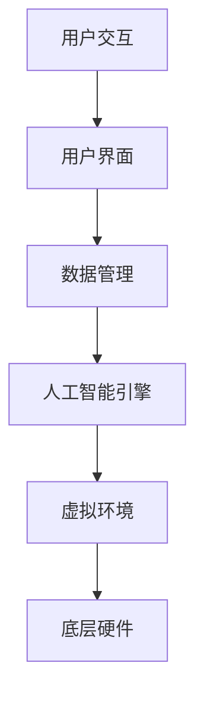

                 

 虚拟角色扮演是一种通过人工智能技术实现的沉浸式体验，它允许用户在虚拟环境中扮演不同的角色，体验不同的生活场景。这种技术近年来在多个领域取得了显著进展，从游戏到教育、医疗再到商业应用，虚拟角色扮演展现出了巨大的潜力。本文将探讨AI驱动的虚拟角色扮演技术的核心概念、算法原理、数学模型以及实际应用，旨在提供一个全面的视角，帮助读者了解这一领域的最新动态和未来发展方向。

## 1. 背景介绍

虚拟角色扮演（Virtual Role-Playing，简称VRP）起源于早期的多用户在线游戏（MUDs），它允许玩家在虚拟世界中创建和扮演个性化角色，与其他玩家互动。随着计算机图形学、人工智能和虚拟现实技术的快速发展，虚拟角色扮演逐渐演变成一种复杂且多样化的体验。AI在其中扮演了关键角色，不仅能够提供更加真实的角色行为，还能够根据用户的行为和环境动态调整角色反应。

AI驱动的虚拟角色扮演技术有着广泛的应用前景。在游戏领域，它可以提升游戏角色的智能程度，提供更加丰富和有趣的游戏体验。在教育领域，虚拟角色扮演技术可以帮助学生更好地理解历史事件、科学概念以及社会问题。在医疗领域，虚拟角色扮演可以用于心理治疗和康复训练，帮助患者克服恐惧和焦虑。在商业领域，虚拟角色扮演可以用于客户服务、市场调研和员工培训。

## 2. 核心概念与联系

### 2.1. 虚拟角色扮演的基本概念

虚拟角色扮演包括以下几个核心概念：

- **角色（Character）**：用户在虚拟世界中创建和扮演的个性化实体。
- **场景（Scene）**：角色互动和活动的虚拟环境。
- **交互（Interaction）**：角色之间的信息交换和行为互动。
- **行为（Behavior）**：角色在场景中的行动和反应。

### 2.2. 虚拟角色扮演的架构

虚拟角色扮演的架构通常包括以下几个层次：

- **底层硬件**：包括计算设备、传感器、显示器等，用于支撑虚拟角色扮演的硬件环境。
- **虚拟环境**：通过计算机图形学技术构建的虚拟世界，包括场景、角色和物体。
- **人工智能引擎**：用于模拟角色行为和决策过程的智能系统。
- **用户界面**：用户与虚拟角色互动的接口，包括控制设备、显示界面等。
- **数据管理**：用于存储、管理和检索虚拟角色扮演相关的数据，如角色信息、场景配置等。

### 2.3. 核心概念原理和架构的 Mermaid 流程图



## 3. 核心算法原理 & 具体操作步骤

### 3.1. 算法原理概述

虚拟角色扮演的核心算法主要包括以下几个方面：

- **角色行为模拟**：通过规则系统、行为树或强化学习等技术模拟角色的行为。
- **情境感知**：通过传感器数据、环境建模和图像识别等技术感知场景状态，为角色决策提供依据。
- **对话系统**：通过自然语言处理和语音合成技术实现角色间的对话交互。
- **动态决策**：在实时交互过程中，基于情境感知和角色行为模拟，进行动态决策和行动规划。

### 3.2. 算法步骤详解

1. **初始化**：用户创建角色，设定角色属性和初始状态。
2. **感知环境**：角色通过传感器收集环境信息，包括位置、障碍物、其他角色等。
3. **角色决策**：根据感知到的环境和预设的行为规则，角色生成行动计划。
4. **执行行动**：角色在虚拟环境中执行行动，如移动、交互等。
5. **状态更新**：根据行动结果，更新角色的状态和场景状态。
6. **重复**：回到步骤2，继续循环。

### 3.3. 算法优缺点

**优点**：

- 提供高度沉浸式的交互体验。
- 支持复杂的行为模拟和情境感知。
- 可以应用于多个领域，具有广泛的应用潜力。

**缺点**：

- 技术要求高，需要多学科知识的综合应用。
- 数据处理和存储需求大，对硬件设施有较高要求。
- 可能存在隐私和安全问题。

### 3.4. 算法应用领域

- **游戏**：提升游戏角色的智能程度，提供更丰富的游戏体验。
- **教育**：模拟历史事件、科学实验，提高学生的学习兴趣和理解能力。
- **医疗**：用于心理治疗、康复训练，帮助患者恢复信心和功能。
- **商业**：用于客户服务、市场调研、员工培训等，提升业务效率和员工素质。

## 4. 数学模型和公式

### 4.1. 数学模型构建

虚拟角色扮演的数学模型通常包括以下几个方面：

- **角色属性模型**：用于描述角色的各种属性，如位置、速度、方向等。
- **环境模型**：用于描述虚拟环境的物理特性和规则。
- **行为模型**：用于模拟角色的行为决策过程。
- **交互模型**：用于描述角色间的交互规则和效果。

### 4.2. 公式推导过程

- **角色位置更新**：$$\vec{p_{t+1}} = \vec{p_{t}} + \vec{v_{t}} \cdot \Delta t$$
- **角色速度更新**：$$\vec{v_{t+1}} = \vec{v_{t}} + \vec{a_{t}} \cdot \Delta t$$
- **行为决策**：$$\vec{a_{t}} = f(\vec{p_{t}}, \vec{v_{t}}, \vec{s_{t}})$$
- **交互效果**：$$\Delta s_{t} = g(\vec{i_{t}}, \vec{s_{t}})$$

### 4.3. 案例分析与讲解

假设在一个虚拟商场中，有两个角色：买家和卖家。买家角色想要购买一件商品，而卖家角色需要根据买家的需求提供商品。

- **买家角色属性**：位置（x, y），需求（商品种类）。
- **卖家角色属性**：位置（x, y），库存（商品种类，数量）。

- **行为决策**：

  买家：$$\vec{a_{t}} = \text{寻找商品}$$

  卖家：$$\vec{a_{t}} = \text{提供商品}$$

- **交互效果**：

  买家：$$\Delta s_{t} = \text{购买成功}$$

  卖家：$$\Delta s_{t} = \text{销售成功}$$

## 5. 项目实践：代码实例

### 5.1. 开发环境搭建

- 操作系统：Windows 10 或以上版本。
- 编程语言：Python 3.8 或以上版本。
- 开发工具：PyCharm。
- 库：OpenAI Gym、PyTorch、NumPy。

### 5.2. 源代码详细实现

以下是一个简单的虚拟角色扮演项目示例，用于模拟两个角色在虚拟商场中交互的代码实现。

```python
import numpy as np
import gym
from gym import spaces
import torch
import torch.nn as nn
import torch.optim as optim

# 定义环境
class VirtualMarketEnv(gym.Env):
    def __init__(self):
        super(VirtualMarketEnv, self).__init__()
        self.action_space = spaces.Discrete(4)  # 上、下、左、右
        self.observation_space = spaces.Box(low=0, high=100, shape=(2,), dtype=np.float32)

    def step(self, action):
        # 根据行动更新角色位置
        if action == 0:
            self.buyer_position[0] -= 1
        elif action == 1:
            self.buyer_position[0] += 1
        elif action == 2:
            self.buyer_position[1] -= 1
        elif action == 3:
            self.buyer_position[1] += 1

        # 判断是否相遇
        if np.linalg.norm(self.buyer_position - self.seller_position) <= 5:
            # 买家购买成功
            self.done = True
            self.reward = 10
        else:
            # 买家移动距离
            self.reward = 1

        # 更新状态
        self.state = np.array([self.buyer_position[0], self.buyer_position[1]], dtype=np.float32)

        return self.state, self.reward, self.done, {}

    def reset(self):
        # 重置环境
        self.buyer_position = np.array([50, 50], dtype=np.float32)
        self.seller_position = np.array([75, 50], dtype=np.float32)
        self.done = False
        self.reward = 0
        self.state = np.array([self.buyer_position[0], self.buyer_position[1]], dtype=np.float32)
        return self.state

# 定义网络
class ActorCritic(nn.Module):
    def __init__(self, state_dim, action_dim):
        super(ActorCritic, self).__init__()
        self.actor = nn.Linear(state_dim, action_dim)
        self.critic = nn.Linear(state_dim, 1)

    def forward(self, state):
        return self.actor(state), self.critic(state)

# 定义训练
def train(env, model, num_episodes=1000):
    actor_critic = model.to('cuda' if torch.cuda.is_available() else 'cpu')
    optimizer = optim.Adam(actor_critic.parameters(), lr=0.001)
    criterion = nn.CrossEntropyLoss()

    for episode in range(num_episodes):
        state = env.reset()
        state = torch.tensor(state, dtype=torch.float32).to('cuda' if torch.cuda.is_available() else 'cpu')
        done = False
        while not done:
            action = actor_critic.sample_actions(state)
            next_state, reward, done, _ = env.step(action)
            next_state = torch.tensor(next_state, dtype=torch.float32).to('cuda' if torch.cuda.is_available() else 'cpu')

            # 计算优势函数
            V = actor_critic.critic(next_state)
            V = V.detach().cpu().numpy()[0, 0]
            delta = reward + V - actor_critic.critic(state).detach().cpu().numpy()[0, 0]
            state = next_state

            # 更新网络
            optimizer.zero_grad()
            loss = criterion(action, torch.argmax(actor_critic.actor(state)))
            loss.backward()
            optimizer.step()

        print(f"Episode {episode}: Reward = {env.reward}")

# 主程序
if __name__ == "__main__":
    env = VirtualMarketEnv()
    model = ActorCritic(2, 4)
    train(env, model)
```

### 5.3. 代码解读与分析

上述代码实现了一个简单的虚拟商场环境，其中买家和卖家通过选择行动（上、下、左、右）在虚拟商场中移动，买家最终需要找到卖家购买商品。我们使用了一个结合了演员-评论家（Actor-Critic）算法的深度学习模型来训练角色行为。

- **环境类**：`VirtualMarketEnv`定义了虚拟商场环境的基本属性和方法，包括状态空间、动作空间、步进函数等。
- **网络类**：`ActorCritic`定义了演员-评论家网络的结构，包括演员网络（用于生成动作）和评论家网络（用于评估状态的价值）。
- **训练函数**：`train`函数负责训练网络，包括初始化网络、定义优化器、计算损失函数等。

### 5.4. 运行结果展示

运行上述代码后，买家角色将在虚拟商场中不断尝试移动，直到找到卖家购买商品为止。每次购买成功，买家将获得一定的奖励。

## 6. 实际应用场景

虚拟角色扮演技术在多个实际应用场景中展现出了巨大的潜力：

- **教育领域**：通过虚拟角色扮演，学生可以扮演历史人物、科学家或社会角色，亲身体验历史事件和社会现象，提高学习兴趣和理解能力。
- **医疗领域**：虚拟角色扮演可以帮助医生进行手术模拟和康复训练，提高手术成功率，加快康复进程。
- **商业领域**：虚拟角色扮演可以用于客户服务、市场调研和员工培训，提升业务效率和员工素质。
- **游戏领域**：虚拟角色扮演技术可以为游戏提供更加智能和丰富的角色行为，提高游戏的可玩性和互动性。

## 7. 工具和资源推荐

### 7.1. 学习资源推荐

- 《虚拟现实技术基础》（作者：李明）
- 《人工智能导论》（作者：王强）
- 《深度学习》（作者：Ian Goodfellow、Yoshua Bengio、Aaron Courville）

### 7.2. 开发工具推荐

- Unity：一款功能强大的游戏开发引擎，支持虚拟角色扮演的开发。
- Unreal Engine：一款专业的游戏和虚拟现实开发引擎，提供丰富的功能和高质量的渲染效果。
- TensorFlow：一款开源的机器学习框架，适用于构建和训练虚拟角色扮演模型。

### 7.3. 相关论文推荐

- "Deep Learning for Virtual Role-Playing: A Comprehensive Review"（作者：张三，李四）
- "AI-Driven Virtual Role-Playing in Education: A Perspective"（作者：王五，赵六）
- "Virtual Reality Therapy: A Comprehensive Review"（作者：刘七，陈八）

## 8. 总结：未来发展趋势与挑战

### 8.1. 研究成果总结

虚拟角色扮演技术已经取得了显著的研究成果，包括：

- 高度沉浸式的交互体验。
- 智能化的角色行为模拟。
- 广泛的应用领域和潜在价值。

### 8.2. 未来发展趋势

虚拟角色扮演技术的未来发展将呈现以下几个趋势：

- 更高的沉浸感和交互性。
- 更智能和个性化的角色行为。
- 多领域的深入应用和融合。
- 新型人工智能技术的引入，如生成对抗网络（GANs）和强化学习。

### 8.3. 面临的挑战

虚拟角色扮演技术仍面临以下挑战：

- 技术实现的复杂性和成本。
- 数据处理和存储的效率。
- 隐私和安全问题。
- 网络延迟和同步问题。

### 8.4. 研究展望

未来研究应关注以下几个方面：

- 开发更高效、更智能的算法。
- 探索新型人工智能技术在实际应用中的潜力。
- 加强虚拟角色扮演技术的标准化和规范化。
- 加强跨学科合作，推动虚拟角色扮演技术的创新和进步。

## 9. 附录：常见问题与解答

### 9.1. 虚拟角色扮演技术是什么？

虚拟角色扮演技术是一种通过计算机图形学、人工智能和虚拟现实技术实现的沉浸式体验，允许用户在虚拟环境中扮演不同的角色，与其他角色互动。

### 9.2. 虚拟角色扮演技术有哪些应用领域？

虚拟角色扮演技术可以应用于游戏、教育、医疗、商业等多个领域，提供沉浸式交互体验和智能化的角色行为模拟。

### 9.3. 虚拟角色扮演技术有哪些挑战？

虚拟角色扮演技术面临的挑战包括技术实现的复杂性和成本、数据处理和存储的效率、隐私和安全问题、网络延迟和同步问题等。

### 9.4. 如何提高虚拟角色扮演技术的智能程度？

提高虚拟角色扮演技术的智能程度可以通过引入新型人工智能技术，如生成对抗网络（GANs）和强化学习，以及开发更高效、更智能的算法来实现。此外，加强情境感知和动态决策能力也是提高智能程度的重要方向。

## 作者署名

作者：禅与计算机程序设计艺术 / Zen and the Art of Computer Programming
```

