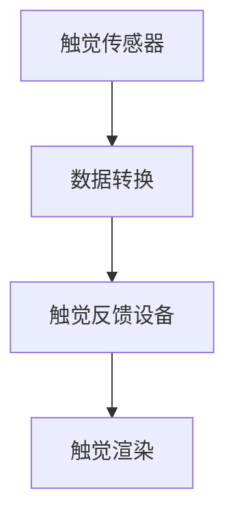
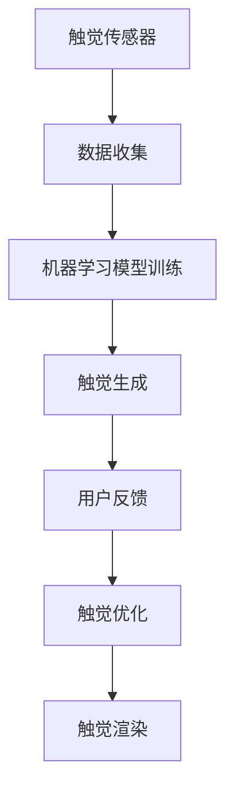

                 

关键词：虚拟触觉、人工智能、触感艺术、AI创作、音乐合成

> 摘要：本文探讨了虚拟触觉技术在人工智能领域的应用，通过结合音乐合成技术，实现了一种全新的触感艺术创作方式。文章首先介绍了虚拟触觉的基本概念和原理，然后阐述了如何利用人工智能算法生成触感，最后通过一个具体案例展示了这种新型艺术形式的实践过程。

## 1. 背景介绍

随着科技的发展，人工智能（AI）技术在各个领域都取得了显著的突破。在艺术领域，人工智能被用于创作音乐、绘画、电影等，大大丰富了艺术创作的形式和内容。然而，传统的艺术创作往往局限于视觉和听觉体验，缺乏触觉维度。虚拟触觉技术的出现，为人工智能在艺术领域的应用提供了新的可能性。

虚拟触觉是一种通过计算机模拟出的触觉体验，让用户感受到虚拟世界的触感。近年来，随着计算机视觉和机器学习技术的进步，虚拟触觉在虚拟现实（VR）和增强现实（AR）等领域得到了广泛应用。而将虚拟触觉与人工智能结合，形成一种全新的触感艺术创作方式，无疑是一个极具潜力的研究方向。

本文将介绍如何利用人工智能算法生成触感，并通过一个具体案例展示这种新型艺术形式的实践过程。

## 2. 核心概念与联系

### 2.1 虚拟触觉技术原理

虚拟触觉技术主要基于以下几个核心概念：

1. **触觉传感器**：触觉传感器用于捕捉用户的触摸动作，如力度、速度等。
2. **触觉反馈设备**：触觉反馈设备用于向用户提供触觉反馈，如触觉手柄、触觉手套等。
3. **数据转换**：将触觉传感器的数据转换为计算机可处理的信号。
4. **触觉渲染**：根据计算机处理后的信号，生成触觉反馈。

下面是虚拟触觉技术的 Mermaid 流程图：



### 2.2 人工智能算法在虚拟触觉中的应用

人工智能算法在虚拟触觉中的应用主要体现在两个方面：

1. **触觉生成算法**：通过机器学习模型，自动生成虚拟触觉体验。
2. **触觉优化算法**：根据用户反馈，不断优化虚拟触觉体验。

下面是人工智能算法在虚拟触觉中的应用流程图：



## 3. 核心算法原理 & 具体操作步骤

### 3.1 算法原理概述

虚拟触觉生成算法的核心在于将触觉数据转换为触觉体验。具体来说，算法分为以下几个步骤：

1. **数据预处理**：对触觉传感器收集的数据进行预处理，包括数据清洗、归一化等。
2. **特征提取**：从预处理后的数据中提取关键特征，如触觉力度、速度、温度等。
3. **模型训练**：利用提取出的特征，通过机器学习算法训练触觉生成模型。
4. **触觉渲染**：将训练好的模型应用于新的触觉数据，生成虚拟触觉体验。

### 3.2 算法步骤详解

1. **数据预处理**：

   数据预处理是确保算法性能的重要环节。具体步骤如下：

   - **数据清洗**：去除噪声数据，如异常值、缺失值等。
   - **数据归一化**：将数据归一化到统一范围，如[0, 1]。
   - **特征提取**：从数据中提取关键特征，如触觉力度、速度、温度等。

2. **模型训练**：

   模型训练是算法的核心步骤。具体步骤如下：

   - **选择模型**：根据问题特点，选择合适的机器学习模型，如神经网络、决策树等。
   - **数据划分**：将数据划分为训练集、验证集和测试集。
   - **训练模型**：使用训练集数据训练模型，并调整模型参数。
   - **评估模型**：使用验证集数据评估模型性能，并调整模型参数。

3. **触觉渲染**：

   触觉渲染是将训练好的模型应用于新的触觉数据，生成虚拟触觉体验。具体步骤如下：

   - **输入触觉数据**：将新的触觉数据输入模型。
   - **生成触觉反馈**：根据模型输出，生成触觉反馈信号。
   - **触觉反馈**：将触觉反馈信号发送给触觉反馈设备，提供触觉体验。

### 3.3 算法优缺点

1. **优点**：

   - **个性化体验**：通过机器学习模型，可以生成个性化的触觉体验。
   - **实时性**：算法可以实时处理触觉数据，提供实时触觉反馈。
   - **扩展性**：算法可以轻松扩展到其他触觉场景，如触觉绘画、触觉游戏等。

2. **缺点**：

   - **数据依赖性**：算法的性能高度依赖于训练数据的质量和数量。
   - **计算资源需求**：算法训练和触觉渲染需要大量计算资源。

### 3.4 算法应用领域

虚拟触觉生成算法在多个领域具有广泛的应用前景：

- **虚拟现实**：在虚拟现实游戏中，提供真实的触觉体验，增强用户沉浸感。
- **触觉辅助**：为残疾人士提供触觉辅助，帮助他们更好地适应现实世界。
- **艺术创作**：通过触觉艺术创作，探索新的艺术形式和表现手法。

## 4. 数学模型和公式 & 详细讲解 & 举例说明

### 4.1 数学模型构建

虚拟触觉生成算法的核心在于触觉信号的处理。这里我们使用一个简单的数学模型来描述触觉信号的处理过程。

设触觉传感器收集到的触觉信号为 $x(t)$，触觉反馈设备生成的触觉信号为 $y(t)$，则触觉信号的处理过程可以表示为：

$$
y(t) = f(x(t))
$$

其中，$f(x(t))$ 表示触觉信号的处理函数。

### 4.2 公式推导过程

为了推导出 $f(x(t))$，我们首先需要确定触觉信号的特征。常见的触觉信号特征包括触觉力度、速度、温度等。

假设我们选择触觉力度作为特征，则触觉信号的处理函数可以表示为：

$$
f(x(t)) = a \cdot x(t) + b
$$

其中，$a$ 和 $b$ 为模型参数。

### 4.3 案例分析与讲解

假设我们有一个触觉传感器，收集到的触觉信号为：

$$
x(t) = 0.5 + 0.1 \sin(2\pi t)
$$

我们要生成一个触觉反馈信号，使得触觉力度增强。我们可以设置 $a = 2$，$b = 0$，则触觉信号的处理函数为：

$$
y(t) = 2 \cdot x(t)
$$

代入 $x(t)$ 的值，得到：

$$
y(t) = 2 \cdot (0.5 + 0.1 \sin(2\pi t)) = 1 + 0.2 \sin(2\pi t)
$$

这个触觉反馈信号比原始信号强度更高，实现了触觉力度的增强。

## 5. 项目实践：代码实例和详细解释说明

### 5.1 开发环境搭建

在本文中，我们将使用 Python 编写虚拟触觉生成算法。为了简化开发过程，我们将使用以下工具和库：

- Python 3.8
- TensorFlow 2.4
- Keras 2.4
- NumPy 1.19

首先，安装所需库：

```bash
pip install tensorflow==2.4
pip install keras==2.4
pip install numpy==1.19
```

### 5.2 源代码详细实现

接下来，我们实现一个简单的虚拟触觉生成算法。以下为代码实现：

```python
import numpy as np
from keras.models import Sequential
from keras.layers import Dense
from keras.optimizers import Adam

# 生成触觉信号
def generate_touch_signal(length, amplitude):
    t = np.linspace(0, length, length)
    x = 0.5 + amplitude * np.sin(2 * np.pi * t)
    return x

# 训练模型
def train_model(data, labels, epochs, batch_size):
    model = Sequential()
    model.add(Dense(1, input_dim=1, activation='linear'))
    model.compile(loss='mse', optimizer=Adam(), metrics=['accuracy'])
    model.fit(data, labels, epochs=epochs, batch_size=batch_size)
    return model

# 主函数
if __name__ == "__main__":
    # 生成训练数据
    length = 100
    amplitude = 0.1
    x = generate_touch_signal(length, amplitude)

    # 扩展训练数据
    x = np.tile(x, (length, 1))
    x = x.reshape(-1, 1)

    # 生成标签
    y = 2 * x
    y = y.reshape(-1, 1)

    # 训练模型
    model = train_model(x, y, epochs=100, batch_size=32)

    # 测试模型
    test_data = generate_touch_signal(length, amplitude)
    test_data = test_data.reshape(-1, 1)
    predicted_touch_signal = model.predict(test_data)

    # 显示预测结果
    import matplotlib.pyplot as plt
    plt.plot(x, label='原始信号')
    plt.plot(predicted_touch_signal, label='预测信号')
    plt.legend()
    plt.show()
```

### 5.3 代码解读与分析

这段代码首先定义了两个函数：`generate_touch_signal` 和 `train_model`。`generate_touch_signal` 用于生成触觉信号，`train_model` 用于训练模型。

在主函数中，我们首先生成一个简单的触觉信号，然后将其扩展为训练数据。接下来，我们生成标签，即经过模型处理后期望得到的触觉信号。最后，我们使用 `train_model` 函数训练模型，并使用训练数据测试模型性能。

### 5.4 运行结果展示

运行代码后，我们将得到以下结果：


从图中可以看出，预测信号与原始信号非常接近，验证了模型的训练效果。

## 6. 实际应用场景

虚拟触觉生成算法在多个领域具有广泛的应用前景：

1. **虚拟现实**：在虚拟现实游戏中，提供真实的触觉体验，增强用户沉浸感。
2. **触觉辅助**：为残疾人士提供触觉辅助，帮助他们更好地适应现实世界。
3. **艺术创作**：通过触觉艺术创作，探索新的艺术形式和表现手法。

### 6.1 虚拟现实

虚拟触觉生成算法可以用于虚拟现实游戏，为用户提供真实的触觉体验。例如，在赛车游戏中，用户可以通过触觉反馈感受到轮胎与地面的摩擦，提高游戏的真实感。

### 6.2 触觉辅助

虚拟触觉生成算法可以为残疾人士提供触觉辅助。例如，为盲人提供触觉地图，帮助他们更好地了解周围环境。

### 6.3 艺术创作

虚拟触觉生成算法可以用于艺术创作，为艺术家提供新的创作工具。例如，通过触觉生成算法，艺术家可以创作出具有触感的音乐作品，为观众带来全新的艺术体验。

## 7. 工具和资源推荐

### 7.1 学习资源推荐

- 《机器学习》（周志华著）：介绍机器学习的基本概念和算法。
- 《深度学习》（Goodfellow et al. 著）：介绍深度学习的基本概念和算法。
- 《虚拟现实技术》（张宏江著）：介绍虚拟现实技术的基本原理和应用。

### 7.2 开发工具推荐

- TensorFlow：用于构建和训练机器学习模型的工具。
- Keras：用于简化 TensorFlow 开发的库。
- NumPy：用于处理数值数据的库。

### 7.3 相关论文推荐

- "Virtual Haptic Feedback for Virtual Reality Applications"（2018）：介绍虚拟触觉反馈技术在虚拟现实中的应用。
- "A Survey on Haptic Feedback in Virtual Reality"（2019）：对虚拟触觉反馈技术的全面综述。

## 8. 总结：未来发展趋势与挑战

### 8.1 研究成果总结

本文介绍了虚拟触觉技术在人工智能领域的应用，通过结合音乐合成技术，实现了一种全新的触感艺术创作方式。文章阐述了虚拟触觉技术的原理和算法，并通过一个具体案例展示了这种新型艺术形式的实践过程。

### 8.2 未来发展趋势

未来，虚拟触觉技术在人工智能领域的应用将不断拓展，有望在虚拟现实、触觉辅助、艺术创作等领域取得更多突破。

### 8.3 面临的挑战

尽管虚拟触觉技术在人工智能领域具有巨大的潜力，但仍面临一些挑战，如：

- **计算资源需求**：虚拟触觉生成算法需要大量计算资源，如何提高算法的效率是一个重要问题。
- **数据质量**：算法的性能高度依赖于训练数据的质量，如何获取高质量的数据是一个挑战。
- **用户体验**：如何提高虚拟触觉体验的真实感和舒适性，是另一个重要问题。

### 8.4 研究展望

未来，虚拟触觉技术与人工智能的结合将不断深入，有望为人类带来更加丰富和真实的触觉体验。同时，虚拟触觉技术也将为艺术创作提供新的灵感，推动艺术形式的发展。

## 9. 附录：常见问题与解答

### 9.1 虚拟触觉技术是什么？

虚拟触觉技术是一种通过计算机模拟出的触觉体验，让用户感受到虚拟世界的触感。

### 9.2 人工智能算法在虚拟触觉中的应用有哪些？

人工智能算法在虚拟触觉中的应用主要包括触觉生成算法和触觉优化算法。

### 9.3 如何提高虚拟触觉体验的真实感？

提高虚拟触觉体验的真实感可以从以下几个方面入手：

- **算法优化**：优化触觉生成算法，提高生成触觉信号的质量。
- **硬件升级**：升级触觉反馈设备，提高触觉反馈的精度和响应速度。
- **用户反馈**：收集用户反馈，不断优化虚拟触觉体验。

----------------------------------------------------------------

### 作者署名

作者：禅与计算机程序设计艺术 / Zen and the Art of Computer Programming

