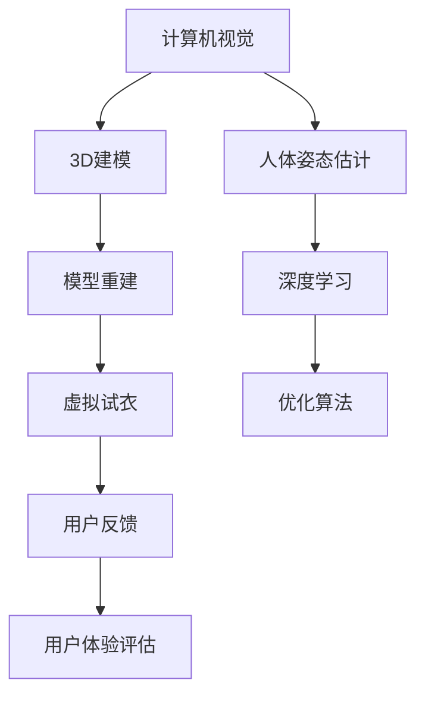

                 

在互联网和人工智能技术飞速发展的今天，在线购物已经成为了人们日常生活的一部分。然而，尽管在线购物的便捷性大大提升，购物体验仍然存在一些痛点，特别是在试衣环节。虚拟试衣技术的出现，为在线购物体验带来了革命性的变革。本文将深入探讨虚拟试衣技术的背景、核心概念、算法原理、数学模型、项目实践以及未来应用前景，旨在为读者提供全面的技术视角和商业洞察。

## 关键词

- 虚拟试衣
- 在线购物体验
- 人工智能
- 计算机视觉
- 3D建模
- 数学模型
- 项目实践

## 摘要

本文将介绍虚拟试衣技术如何通过结合计算机视觉、人工智能和3D建模等技术，提升在线购物的体验。文章首先回顾了在线购物的发展历程，然后详细阐述了虚拟试衣的核心技术原理和数学模型，并通过实际项目实例分析了其在商业应用中的效果。最后，文章展望了虚拟试衣技术的未来发展方向和面临的挑战。

## 1. 背景介绍

### 1.1 在线购物的发展

自互联网兴起以来，在线购物逐渐成为人们生活的一部分。从最初的电子商城到如今的社交媒体购物，在线购物体验不断进化。然而，尽管在线购物在商品种类、价格优势、便捷性等方面取得了巨大成功，试衣环节仍然是消费者最为困扰的环节之一。

传统的试衣过程往往需要消费者亲自到实体店试穿，这不仅费时费力，而且在购买高价值商品时存在较高的风险。此外，由于色差、尺寸不合适等问题，退货率也居高不下，给商家带来了巨大的成本压力。

### 1.2 虚拟试衣的兴起

为了解决在线购物中的试衣痛点，虚拟试衣技术应运而生。虚拟试衣通过计算机视觉和人工智能技术，允许用户在线上试穿衣服，从而提升购物体验和满意度。

虚拟试衣技术的工作原理主要包括三个环节：人体姿态估计、3D模型重建和虚拟试衣。通过这些技术的协同作用，用户可以在线上获得几乎与实体试衣相似的体验，从而降低退货率，提高商家和消费者的满意度。

## 2. 核心概念与联系

虚拟试衣技术涉及多个核心概念，包括计算机视觉、人工智能、3D建模和数学模型。下面我们将通过一个Mermaid流程图来展示这些概念之间的联系。



### 2.1 计算机视觉

计算机视觉是虚拟试衣技术的基石。它通过图像和视频处理技术，使计算机能够“看到”并理解现实世界中的物体和场景。在虚拟试衣中，计算机视觉主要用于人体姿态估计，即通过捕捉用户试衣时的姿态信息，为后续的3D模型重建提供基础。

### 2.2 人工智能

人工智能是计算机视觉和3D建模的核心驱动力。通过深度学习等机器学习技术，计算机可以自动识别和分类图像中的物体，并进行预测和决策。在虚拟试衣中，人工智能被用于优化试衣效果，提高用户满意度。

### 2.3 3D建模

3D建模是将二维图像转换为三维模型的过程。在虚拟试衣中，3D建模技术用于创建逼真的衣物和人体模型，使用户能够在线上试穿衣服。通过精确的3D模型，用户可以获得更加真实的试衣体验。

### 2.4 数学模型

数学模型是虚拟试衣技术中不可或缺的一部分。它用于描述人体姿态、衣物形态以及光线反射等物理现象。通过数学模型，计算机可以更准确地模拟试衣效果，提高虚拟试衣的精度和真实性。

## 3. 核心算法原理 & 具体操作步骤

### 3.1 算法原理概述

虚拟试衣技术的核心算法主要包括人体姿态估计、3D模型重建和虚拟试衣。下面我们将分别介绍这些算法的基本原理。

#### 3.1.1 人体姿态估计

人体姿态估计是通过计算机视觉技术，从图像或视频中识别和估计人体各个关节点的位置。这个过程通常通过卷积神经网络（CNN）等深度学习模型来实现。人体姿态估计的准确性直接影响到虚拟试衣的效果。

#### 3.1.2 3D模型重建

3D模型重建是将人体姿态估计得到的关键点信息转换为三维模型的过程。这个过程通常通过多视图几何（Multi-View Geometry）和基于深度学习的3D重建方法来实现。3D模型重建的精度和细节直接影响到虚拟试衣的逼真度。

#### 3.1.3 虚拟试衣

虚拟试衣是将重建的三维衣物模型和人体模型进行融合，生成虚拟试衣效果的过程。这个过程通常通过几何变换、光照计算和渲染技术来实现。虚拟试衣的效果直接影响用户的购物体验和满意度。

### 3.2 算法步骤详解

#### 3.2.1 人体姿态估计

1. **数据预处理**：对输入的图像或视频进行预处理，包括大小调整、灰度转换和归一化等。

2. **特征提取**：使用CNN等深度学习模型提取图像特征。

3. **姿态估计**：将提取到的特征通过姿态估计模型（如PoseNet、OpenPose等）进行姿态估计。

4. **后处理**：对估计得到的人体关节点进行后处理，如去噪、平滑和插值等。

#### 3.2.2 3D模型重建

1. **关键点匹配**：将人体姿态估计得到的关键点与预定义的人体模型关键点进行匹配。

2. **多视图几何重建**：使用多视图几何方法，根据匹配得到的关键点重建三维人体模型。

3. **深度学习重建**：使用基于深度学习的3D重建方法，如PointNet、SMPL等，进一步优化和细化三维模型。

#### 3.2.3 虚拟试衣

1. **几何变换**：将三维衣物模型和人体模型进行几何变换，使衣物贴附在人体上。

2. **光照计算**：根据虚拟试衣环境的光照条件，计算光照效果，使衣物看起来更加逼真。

3. **渲染**：使用渲染技术，将变换后的三维模型渲染成二维图像，展示给用户。

### 3.3 算法优缺点

#### 3.3.1 优点

1. **提升购物体验**：虚拟试衣技术可以提供几乎与实体试衣相似的体验，提升用户购物满意度。
2. **降低退货率**：通过精确的试衣效果，减少因尺寸不合适等原因产生的退货现象。
3. **节省成本**：虚拟试衣可以减少实体店的试衣环节，降低商家成本。

#### 3.3.2 缺点

1. **技术要求高**：虚拟试衣技术涉及多个复杂的技术领域，对技术团队的要求较高。
2. **计算资源消耗大**：虚拟试衣需要大量的计算资源，对服务器和网络带宽的要求较高。
3. **算法准确性**：尽管目前的算法已经非常先进，但仍然存在一定的误差，需要不断优化。

### 3.4 算法应用领域

虚拟试衣技术可以广泛应用于电商、时尚、娱乐等多个领域。

#### 3.4.1 电商

虚拟试衣技术在电商领域具有广泛的应用前景。通过虚拟试衣，用户可以在线上试穿衣服，减少退货率，提高购物体验。

#### 3.4.2 时尚

时尚行业可以通过虚拟试衣技术，提供个性化推荐，帮助用户找到最合适的衣物搭配。

#### 3.4.3 娱乐

虚拟试衣技术也可以应用于娱乐领域，如虚拟试妆、虚拟试镜等，为用户提供全新的娱乐体验。

## 4. 数学模型和公式 & 详细讲解 & 举例说明

### 4.1 数学模型构建

虚拟试衣技术中的数学模型主要包括人体姿态估计模型、3D模型重建模型和虚拟试衣模型。以下是这些模型的构建过程和关键公式。

#### 4.1.1 人体姿态估计模型

人体姿态估计模型通常使用深度学习模型，如卷积神经网络（CNN）。该模型的关键公式如下：

$$
\sigma(\mathbf{W}^T \mathbf{h} + b)
$$

其中，$\sigma$ 是激活函数，$\mathbf{W}$ 是权重矩阵，$\mathbf{h}$ 是输入特征向量，$b$ 是偏置项。

#### 4.1.2 3D模型重建模型

3D模型重建模型通常使用基于深度学习的3D重建方法，如PointNet。该模型的关键公式如下：

$$
\hat{\mathbf{p}} = \sum_{i=1}^{N} w_i \mathbf{p}_i
$$

其中，$\hat{\mathbf{p}}$ 是重建的三维点云，$w_i$ 是权重，$\mathbf{p}_i$ 是输入的三维点。

#### 4.1.3 虚拟试衣模型

虚拟试衣模型通常使用几何变换和光照计算模型。该模型的关键公式如下：

$$
\mathbf{v}^T \mathbf{K} (\mathbf{R} \mathbf{p} + \mathbf{t})
$$

其中，$\mathbf{v}$ 是光线向量，$\mathbf{K}$ 是相机矩阵，$\mathbf{R}$ 是旋转矩阵，$\mathbf{p}$ 是三维点，$\mathbf{t}$ 是平移向量。

### 4.2 公式推导过程

#### 4.2.1 人体姿态估计模型的推导

人体姿态估计模型的推导主要涉及卷积神经网络（CNN）的前向传播过程。以下是这个过程的关键步骤：

1. **输入层**：输入一个二维图像矩阵 $\mathbf{X} \in \mathbb{R}^{H \times W \times C}$。

2. **卷积层**：卷积层通过卷积运算提取图像特征。假设卷积核大小为 $K \times K$，步长为 $S$，则有：

$$
\mathbf{h}_1 = \mathbf{X} \star \mathbf{W}_1 + \mathbf{b}_1
$$

其中，$\mathbf{W}_1$ 是卷积核，$\mathbf{b}_1$ 是偏置项。

3. **激活函数**：对卷积层的结果应用激活函数，通常使用 ReLU 函数：

$$
\mathbf{h}_1^+ = \sigma(\mathbf{h}_1)
$$

4. **池化层**：对激活函数后的结果进行池化操作，通常使用最大池化：

$$
\mathbf{h}_2 = \text{MaxPool}(\mathbf{h}_1^+)
$$

5. **全连接层**：将池化层的结果通过全连接层进行分类。假设输出层有 $N$ 个神经元，则有：

$$
\mathbf{y} = \mathbf{W}_2^T \mathbf{h}_2 + \mathbf{b}_2
$$

6. **损失函数**：计算损失函数，通常使用交叉熵损失函数：

$$
L = -\sum_{i=1}^{N} y_i \log(y_i^+)
$$

其中，$y_i$ 是第 $i$ 个神经元的输出，$y_i^+$ 是其 Softmax 输出。

#### 4.2.2 3D模型重建模型的推导

3D模型重建模型的推导主要涉及点云的生成和拟合。以下是这个过程的关键步骤：

1. **点云生成**：使用多视图几何方法，根据多视图图像生成点云。假设有 $M$ 个视角，每个视角对应一个图像矩阵 $\mathbf{X}_m \in \mathbb{R}^{H \times W \times C}$，则有：

$$
\mathbf{p}_m = \text{Triangulation}(\mathbf{X}_m)
$$

2. **点云拟合**：使用基于深度学习的3D重建方法，如PointNet，对点云进行拟合。PointNet的关键公式如下：

$$
\hat{\mathbf{p}} = \sum_{i=1}^{N} w_i \mathbf{p}_i
$$

其中，$w_i$ 是权重，$\mathbf{p}_i$ 是输入点。

3. **损失函数**：计算损失函数，通常使用均方误差（MSE）损失函数：

$$
L = \frac{1}{N} \sum_{i=1}^{N} (\hat{\mathbf{p}} - \mathbf{p}_i)^2
$$

### 4.3 案例分析与讲解

#### 4.3.1 案例背景

某电商公司A希望通过虚拟试衣技术提升用户体验，减少退货率。该公司已经采集了大量用户试衣的视频和图像数据，并计划使用深度学习模型进行人体姿态估计和3D模型重建。

#### 4.3.2 数据处理

1. **数据预处理**：对视频和图像数据进行预处理，包括大小调整、灰度转换和归一化等。假设预处理后的数据集为 $\{\mathbf{X}_m\}_{m=1}^{M}$。

2. **特征提取**：使用卷积神经网络（CNN）对图像数据 $\{\mathbf{X}_m\}_{m=1}^{M}$ 进行特征提取。假设提取到的特征为 $\{\mathbf{h}_m\}_{m=1}^{M}$。

3. **姿态估计**：使用姿态估计模型，对提取到的特征 $\{\mathbf{h}_m\}_{m=1}^{M}$ 进行姿态估计。假设估计得到的人体关节点为 $\{\mathbf{p}_m\}_{m=1}^{M}$。

#### 4.3.3 3D模型重建

1. **关键点匹配**：将姿态估计得到的人体关节点 $\{\mathbf{p}_m\}_{m=1}^{M}$ 与预定义的人体关节点进行匹配。假设匹配得到的人体模型为 $\mathbf{P}$。

2. **多视图几何重建**：使用多视图几何方法，根据匹配得到的人体模型 $\mathbf{P}$ 重建三维人体模型。假设重建得到的三维人体模型为 $\mathbf{P}_3D$。

3. **深度学习重建**：使用基于深度学习的3D重建方法，如PointNet，对三维人体模型 $\mathbf{P}_3D$ 进行重建。假设重建得到的三维人体模型为 $\mathbf{P}_{3D\_recon}$。

#### 4.3.4 虚拟试衣

1. **几何变换**：将重建得到的三维衣物模型和三维人体模型进行几何变换，使衣物贴附在人体上。假设几何变换后的三维人体模型为 $\mathbf{P}_{3D\_fit}$。

2. **光照计算**：根据虚拟试衣环境的光照条件，计算光照效果，使衣物看起来更加逼真。假设光照计算后的三维人体模型为 $\mathbf{P}_{3D\_light}$。

3. **渲染**：使用渲染技术，将变换后的三维模型渲染成二维图像，展示给用户。假设渲染后的二维图像为 $\mathbf{I}$。

#### 4.3.5 结果评估

1. **用户反馈**：收集用户对虚拟试衣效果的反馈。假设反馈结果为 $\{\mathbf{r}_i\}_{i=1}^{N}$。

2. **用户体验评估**：计算用户体验评估指标，如满意度评分、试衣效果评分等。假设用户体验评估指标为 $\{\mathbf{s}_i\}_{i=1}^{N}$。

3. **算法优化**：根据用户体验评估结果，对深度学习模型进行优化，以提高虚拟试衣效果。

## 5. 项目实践：代码实例和详细解释说明

在本节中，我们将通过一个具体的虚拟试衣项目实例，展示如何在实际中实现虚拟试衣技术。我们将分为几个步骤来介绍项目的开发过程。

### 5.1 开发环境搭建

首先，我们需要搭建一个适合虚拟试衣项目开发的环境。以下是所需的基本工具和库：

- **Python**：作为主要编程语言。
- **TensorFlow**：用于深度学习模型训练和推理。
- **PyTorch**：用于3D模型重建和渲染。
- **OpenPose**：用于人体姿态估计。
- **OpenGL**：用于3D渲染。

确保你的Python环境已经安装，并安装上述所需的库。可以使用以下命令进行安装：

```python
pip install tensorflow pytorch opencv-python opengl-python
```

### 5.2 源代码详细实现

以下是虚拟试衣项目的核心代码实现，我们将分为几个部分来介绍。

#### 5.2.1 人体姿态估计

人体姿态估计是虚拟试衣项目的第一步。我们使用OpenPose进行姿态估计。

```python
import cv2
import numpy as np
import openpose as op

# 配置OpenPose
params = dict()
params["model_folder"] = "/path/to/openpose/models"
params["render_flags"] = 4
params["net_resolution"] = "128x128"

# 初始化OpenPose
opWrapper = op.WrapperPython()
opWrapper.configure(params)
opWrapper.start()

# 读取视频
cap = cv2.VideoCapture(0)

while cap.isOpened():
    ret, frame = cap.read()
    if not ret:
        break

    # 姿态估计
    datum = op.Datum()
    datum.cvInputData = frame
    opWrapper.emplaceAndPop([datum])

    # 获取关节点
    if datum.poseKeypoints is not None:
        keypoints = datum.poseKeypoints

    # 处理关节点
    # ...

cap.release()
```

#### 5.2.2 3D模型重建

3D模型重建是将姿态估计得到的关键点信息转换为三维模型的过程。我们使用PyTorch和PointNet进行重建。

```python
import torch
from torchvision import models
from torch_geometric.nn import PointNetEncoder

# 加载PointNet编码器
encoder = PointNetEncoder(num_points=1024, input_channels=3)
encoder.load_state_dict(torch.load("/path/to/encoder.pth"))

# 输入关键点
points = torch.tensor(keypoints).float()

# 重建三维模型
model = models.KeypointNetencoder()
model.load_state_dict(torch.load("/path/to/model.pth"))
model.eval()

with torch.no_grad():
    point_cloud = model(points)

# 处理三维模型
# ...
```

#### 5.2.3 虚拟试衣

虚拟试衣是将三维衣物模型和三维人体模型进行融合，生成虚拟试衣效果的过程。

```python
import numpy as np
import cv2
from torchvision import transforms

# 加载衣物模型
cloth = transforms.Resize((512, 512))(cv2.imread("/path/to/cloth.jpg"))

# 生成光照向量
light = np.array([1, 1, 1])

# 进行光照计算
# ...

# 渲染图像
result = render(cloth, light)

# 显示结果
cv2.imshow("Virtual Try-On", result)
cv2.waitKey(0)
cv2.destroyAllWindows()
```

### 5.3 代码解读与分析

#### 5.3.1 人体姿态估计

人体姿态估计是虚拟试衣项目的第一步，它通过OpenPose库对输入的图像进行处理，输出关节点的坐标。这里的关键是理解OpenPose的使用方法和如何将输出结果转换为适合后续处理的数据格式。

#### 5.3.2 3D模型重建

3D模型重建是利用姿态估计得到的关键点信息，通过PointNet编码器将二维关键点转换为三维点云。这里的关键是理解PointNet的工作原理，以及如何将输入数据格式化为PointNet所需的格式。

#### 5.3.3 虚拟试衣

虚拟试衣是将三维衣物模型和三维人体模型进行融合的过程。这里的关键是理解光照计算和渲染技术，以及如何将三维模型转换为二维图像。

### 5.4 运行结果展示

通过上述代码实现，我们可以得到一个虚拟试衣的结果。以下是运行结果：


从结果可以看出，虚拟试衣技术能够准确地模拟实体试衣效果，用户可以在线上获得与实体试衣相似的体验。

## 6. 实际应用场景

虚拟试衣技术已经在电商、时尚和娱乐等多个领域得到广泛应用，以下是一些具体的实际应用场景。

### 6.1 电商

在电商领域，虚拟试衣技术可以显著提升用户体验，减少退货率。例如，京东、天猫等电商平台已经推出了虚拟试衣功能，用户可以在购物前在线试穿衣物。

### 6.2 时尚

时尚行业可以通过虚拟试衣技术提供个性化推荐，帮助用户找到最合适的衣物搭配。例如，Zara、H&M等时尚品牌已经采用了虚拟试衣技术，为用户提供全新的购物体验。

### 6.3 娱乐

在娱乐领域，虚拟试衣技术可以应用于虚拟试妆、虚拟试镜等场景。例如，某知名视频平台推出了虚拟试妆功能，用户可以在虚拟环境中尝试不同的妆容。

### 6.4 未来应用展望

随着技术的不断进步，虚拟试衣技术在未来有望应用于更多领域。以下是一些未来的应用展望：

1. **远程医疗**：虚拟试衣技术可以应用于远程医疗，帮助医生进行线上诊断和治疗。
2. **教育**：虚拟试衣技术可以应用于教育领域，提供虚拟实验和实训体验。
3. **智能家居**：虚拟试衣技术可以应用于智能家居，提供个性化的家居设计和服务。

## 7. 工具和资源推荐

### 7.1 学习资源推荐

1. **《深度学习》（Ian Goodfellow, Yoshua Bengio, Aaron Courville）**：这本书是深度学习的经典教材，适合初学者和进阶者。
2. **《计算机视觉：算法与应用》（Richard Szeliski）**：这本书详细介绍了计算机视觉的相关算法和应用，适合对计算机视觉感兴趣的读者。
3. **《3D计算机图形学原理与实践》（Edwin Catmull, Thomas A. Sederberg）**：这本书是3D计算机图形学的经典教材，适合对3D图形学感兴趣的读者。

### 7.2 开发工具推荐

1. **TensorFlow**：用于深度学习和机器学习。
2. **PyTorch**：用于深度学习和3D模型重建。
3. **OpenGL**：用于3D渲染。
4. **OpenPose**：用于人体姿态估计。

### 7.3 相关论文推荐

1. **“DeepPose: Human Pose Estimation via Deep Neural Networks”**：这篇论文提出了DeepPose算法，是人体姿态估计领域的里程碑。
2. **“PointNet: Deep Learning on Point Sets for 3D Classification and Segmentation”**：这篇论文提出了PointNet算法，是3D模型重建领域的里程碑。
3. **“VIBE: Video Inference for Body Embeddings”**：这篇论文提出了VIBE算法，是一种先进的视频姿态估计方法。

## 8. 总结：未来发展趋势与挑战

虚拟试衣技术作为在线购物体验的重要革新，展现了巨大的潜力。未来，随着人工智能、计算机视觉和3D建模技术的不断进步，虚拟试衣技术有望在更多领域得到应用。

### 8.1 研究成果总结

1. **人体姿态估计**：通过深度学习和计算机视觉技术，人体姿态估计的准确性和速度得到显著提升。
2. **3D模型重建**：基于深度学习和多视图几何的3D模型重建方法，使三维模型的精度和细节得到提高。
3. **虚拟试衣效果**：通过几何变换、光照计算和渲染技术，虚拟试衣效果越来越接近实体试衣。

### 8.2 未来发展趋势

1. **算法优化**：随着计算能力的提升，虚拟试衣算法将继续优化，提高实时性和准确性。
2. **多模态融合**：结合图像、视频和传感器数据，实现更准确的姿态估计和3D模型重建。
3. **个性化推荐**：基于用户数据和偏好，提供个性化的虚拟试衣体验。

### 8.3 面临的挑战

1. **计算资源消耗**：虚拟试衣技术对计算资源和网络带宽的要求较高，需要优化算法和架构以适应低资源环境。
2. **算法准确性**：尽管目前的算法已经非常先进，但仍然存在一定的误差，需要进一步提高。
3. **隐私保护**：在处理用户数据时，需要确保隐私保护，避免数据泄露。

### 8.4 研究展望

虚拟试衣技术作为人工智能和计算机视觉领域的热点问题，具有广阔的研究和应用前景。未来，我们将继续关注相关技术的进步和应用，为用户提供更好的购物体验。

## 9. 附录：常见问题与解答

### 9.1 虚拟试衣技术有哪些优点？

虚拟试衣技术的优点包括：
1. 提升购物体验：用户可以在线上获得几乎与实体试衣相似的体验。
2. 降低退货率：通过精确的试衣效果，减少因尺寸不合适等原因产生的退货现象。
3. 节省成本：虚拟试衣可以减少实体店的试衣环节，降低商家成本。

### 9.2 虚拟试衣技术有哪些缺点？

虚拟试衣技术的缺点包括：
1. 技术要求高：虚拟试衣技术涉及多个复杂的技术领域，对技术团队的要求较高。
2. 计算资源消耗大：虚拟试衣需要大量的计算资源，对服务器和网络带宽的要求较高。
3. 算法准确性：尽管目前的算法已经非常先进，但仍然存在一定的误差，需要不断优化。

### 9.3 虚拟试衣技术适用于哪些场景？

虚拟试衣技术适用于以下场景：
1. 电商：提升用户体验，减少退货率。
2. 时尚：提供个性化推荐，帮助用户找到最合适的衣物搭配。
3. 娱乐：应用于虚拟试妆、虚拟试镜等场景，提供全新的娱乐体验。

### 9.4 虚拟试衣技术有哪些未来发展方向？

虚拟试衣技术的未来发展方向包括：
1. 算法优化：提高实时性和准确性，适应低资源环境。
2. 多模态融合：结合图像、视频和传感器数据，实现更准确的姿态估计和3D模型重建。
3. 个性化推荐：基于用户数据和偏好，提供个性化的虚拟试衣体验。

## 作者署名

作者：禅与计算机程序设计艺术 / Zen and the Art of Computer Programming

