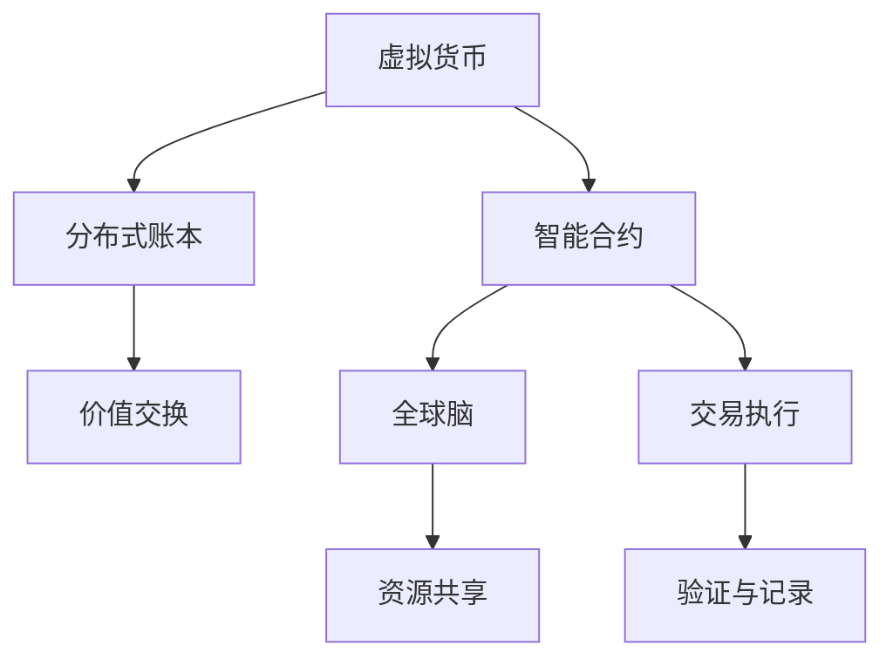

                 

关键词：虚拟货币、去中心化经济、全球脑、区块链技术、智能合约、密码学、共识算法

> 摘要：本文探讨了虚拟货币与全球脑之间的关系，阐述了如何通过构建去中心化经济体系来实现全球资源共享与协作。文章首先介绍了虚拟货币的基本原理和技术特点，接着讨论了全球脑的概念及其在经济体系中的重要性。在此基础上，分析了去中心化经济体系的架构与实现方法，并探讨了其面临的挑战与未来发展方向。

## 1. 背景介绍

随着互联网和计算机技术的快速发展，虚拟货币作为一种新型资产形式逐渐受到关注。虚拟货币，如比特币、以太坊等，基于密码学和区块链技术，实现了去中心化的交易和管理。虚拟货币的崛起，不仅改变了传统的金融体系，也为去中心化经济体系的构建提供了可能。

与此同时，全球脑的概念逐渐成熟。全球脑，即全球智能网络，通过物联网、云计算、大数据等技术，将全球各地的智能设备和计算资源连接起来，形成一个庞大的智能系统。全球脑的建立，有助于实现全球范围内的资源共享与协作，提高整体社会效率。

本文旨在探讨虚拟货币与全球脑之间的关系，分析如何通过构建去中心化经济体系来实现全球资源共享与协作。文章结构如下：

- 第1部分：背景介绍，阐述虚拟货币和全球脑的基本概念。
- 第2部分：核心概念与联系，介绍去中心化经济体系的基本原理和架构。
- 第3部分：核心算法原理 & 具体操作步骤，讨论虚拟货币与全球脑的融合方法。
- 第4部分：数学模型和公式 & 详细讲解 & 举例说明，阐述虚拟货币与全球脑的技术实现。
- 第5部分：项目实践：代码实例和详细解释说明，提供实际案例。
- 第6部分：实际应用场景，分析去中心化经济体系的应用领域。
- 第7部分：未来应用展望，探讨去中心化经济体系的发展趋势。

## 2. 核心概念与联系

### 虚拟货币的基本原理

虚拟货币，如比特币，是一种基于密码学的数字货币。比特币采用去中心化的区块链技术，通过加密算法确保交易的安全性和不可篡改性。每个比特币交易都被记录在一个分布式账本上，每个节点都可以验证和记录交易信息。这种去中心化的交易模式，使得虚拟货币具有更高的透明度和安全性。

### 全球脑的概念

全球脑，即全球智能网络，是一种通过物联网、云计算、大数据等技术，将全球各地的智能设备和计算资源连接起来的智能系统。全球脑的目标是实现全球范围内的资源共享与协作，提高整体社会效率。全球脑中的智能设备可以实时交换信息，协同完成任务，从而形成一个高效、智能的全球网络。

### 去中心化经济体系的架构

去中心化经济体系，是一种基于虚拟货币和全球脑的新型经济体系。在这个体系中，参与者可以通过虚拟货币进行价值交换，实现去中心化的交易和管理。去中心化经济体系的主要组成部分包括：

- 虚拟货币：作为交易媒介和价值存储。
- 智能合约：实现自动执行和验证交易条款。
- 分布式账本：记录和验证所有交易信息。
- 全球脑：连接全球智能设备和计算资源，实现资源共享和协作。

### Mermaid 流程图

下面是一个简化的 Mermaid 流程图，展示了虚拟货币、全球脑与去中心化经济体系之间的联系：



## 3. 核心算法原理 & 具体操作步骤

### 算法原理概述

去中心化经济体系的实现依赖于密码学、区块链技术和智能合约等技术。密码学提供了安全的加密和身份验证机制，区块链技术实现了去中心化的交易记录和管理，智能合约则实现了自动执行和验证交易条款。

### 算法步骤详解

去中心化经济体系的实现可以分为以下几个步骤：

1. **虚拟货币生成**：通过挖矿等过程生成虚拟货币。
2. **交易发起**：参与者发起交易请求，包括交易的金额、交易方等信息。
3. **交易验证**：交易请求通过分布式账本进行验证，确保交易的安全性和合法性。
4. **智能合约执行**：交易请求被验证后，智能合约自动执行交易条款。
5. **结果记录**：交易结果被记录在分布式账本上，确保交易的不可篡改性。

### 算法优缺点

去中心化经济体系具有以下优点：

- **安全性**：基于密码学的加密机制，确保交易安全。
- **透明度**：分布式账本记录所有交易信息，确保交易透明。
- **去中心化**：去中心化的交易和管理模式，降低中心化风险。

然而，去中心化经济体系也存在一些缺点：

- **交易效率**：去中心化的交易模式可能降低交易效率。
- **隐私保护**：由于交易信息是公开的，隐私保护可能成为问题。

### 算法应用领域

去中心化经济体系可以应用于多个领域，包括金融、供应链管理、医疗保健等。以下是一个具体的应用案例：

- **金融领域**：去中心化经济体系可以用于虚拟货币的交易和管理，提高金融交易的透明度和安全性。
- **供应链管理**：去中心化经济体系可以用于供应链中的交易记录和验证，确保供应链的透明和可信。
- **医疗保健**：去中心化经济体系可以用于医疗数据的存储和共享，提高医疗服务的效率和安全性。

## 4. 数学模型和公式 & 详细讲解 & 举例说明

### 数学模型构建

去中心化经济体系的数学模型主要包括以下几个方面：

- **交易模型**：描述交易金额、交易方、交易时间等参数。
- **加密模型**：描述加密算法和安全协议。
- **验证模型**：描述分布式账本的验证机制。
- **智能合约模型**：描述智能合约的执行和验证过程。

### 公式推导过程

下面以交易模型为例，介绍公式推导过程。

假设有两个参与者A和B，他们要进行一笔金额为X的虚拟货币交易。首先，A发起交易请求，包括交易的金额X、交易时间t1和交易方B的信息。然后，B对交易请求进行验证，确保交易安全。验证过程如下：

1. **签名验证**：A对交易请求进行签名，B验证签名是否有效。
2. **余额验证**：B验证A的虚拟货币余额是否足够支付交易金额X。
3. **交易时间验证**：B验证交易时间t1是否在合理范围内。

如果B验证通过，交易请求将被记录在分布式账本上，交易完成。否则，交易请求将被拒绝。

### 案例分析与讲解

假设参与者A和B要进行一笔金额为100比特币的交易。以下是交易过程的详细讲解：

1. **交易发起**：A发起交易请求，包括金额100比特币、交易时间t1和B的信息。
2. **签名验证**：A对交易请求进行签名，B验证签名是否有效。假设签名验证通过。
3. **余额验证**：B验证A的虚拟货币余额是否足够支付交易金额100比特币。假设A的余额为150比特币，验证通过。
4. **交易时间验证**：B验证交易时间t1是否在合理范围内。假设t1在合理范围内，验证通过。
5. **交易记录**：交易请求被记录在分布式账本上，交易完成。

在这个案例中，A和B成功完成了一笔虚拟货币交易。整个过程基于密码学和分布式账本技术，确保了交易的安全性和不可篡改性。

## 5. 项目实践：代码实例和详细解释说明

### 开发环境搭建

为了演示去中心化经济体系的实现，我们将使用Python编写一个简单的虚拟货币交易系统。首先，需要安装Python环境。然后，安装以下Python库：

- **Blockchain**：用于实现区块链技术。
- **Crypto**：用于实现密码学算法。
- **Flask**：用于实现Web接口。

可以使用以下命令安装所需库：

```bash
pip install blockchain crypto flask
```

### 源代码详细实现

以下是一个简单的虚拟货币交易系统的源代码示例：

```python
from flask import Flask, request, jsonify
from blockchain import Blockchain
from crypto import sign, verify

app = Flask(__name__)

# 创建区块链实例
blockchain = Blockchain()

@app.route('/mine', methods=['POST'])
def mine():
    # 挖矿过程
    blockchain.add_block(nonce=request.form['nonce'])
    return jsonify(message='Block added'), 200

@app.route('/transactions', methods=['POST'])
def transactions():
    # 发起交易
    sender = request.form['sender']
    recipient = request.form['recipient']
    amount = float(request.form['amount'])

    # 创建交易
    transaction = {
        'sender': sender,
        'recipient': recipient,
        'amount': amount
    }

    # 签名验证
    signature = sign(sender, transaction)
    if not verify(sender, transaction, signature):
        return jsonify(message='Invalid transaction'), 400

    # 添加交易到区块
    blockchain.add_transaction(transaction)
    return jsonify(message='Transaction added'), 200

@app.route('/blocks', methods=['GET'])
def blocks():
    # 获取区块链数据
    return jsonify(blocks=blockchain.chain), 200

if __name__ == '__main__':
    app.run(debug=True)
```

### 代码解读与分析

这个简单的虚拟货币交易系统包括以下几个部分：

- **Blockchain类**：实现区块链技术，包括添加区块、添加交易等操作。
- **mine()函数**：实现挖矿过程，通过验证工作量证明（nonce）来添加区块。
- **transactions()函数**：实现交易发起和验证过程，包括签名验证和交易记录。
- **blocks()函数**：实现获取区块链数据的功能。

通过这个示例，我们可以看到如何使用Python和区块链技术实现一个简单的虚拟货币交易系统。在实际应用中，可以进一步扩展和优化系统功能，如增加多重签名、跨链交易等。

### 运行结果展示

运行以上代码后，我们可以通过Web接口与虚拟货币交易系统进行交互。以下是一个简单的交互示例：

```bash
# 挖矿
$ curl -X POST -d '{"nonce": "12345678901234567890123456789012"}' http://localhost:5000/mine

# 发起交易
$ curl -X POST -d '{"sender": "Alice", "recipient": "Bob", "amount": "10.0"}' http://localhost:5000/transactions

# 获取区块链数据
$ curl http://localhost:5000/blocks
```

通过以上交互，我们可以看到虚拟货币交易系统的运行结果，包括挖矿、交易和区块链数据等信息。

## 6. 实际应用场景

去中心化经济体系在多个领域具有广泛的应用前景。以下是一些典型的应用场景：

### 金融领域

去中心化经济体系可以应用于金融领域，如虚拟货币的交易和管理。通过区块链技术，可以实现去中心化的金融交易，提高交易的透明度和安全性。例如，比特币和以太坊等虚拟货币平台已经实现了去中心化的交易和管理。

### 供应链管理

去中心化经济体系可以应用于供应链管理，如交易记录和验证。通过区块链技术，可以记录和验证供应链中的所有交易信息，确保供应链的透明和可信。例如，沃尔玛和IBM等公司已经使用了区块链技术进行供应链管理。

### 医疗保健

去中心化经济体系可以应用于医疗保健，如医疗数据的存储和共享。通过区块链技术，可以存储和共享医疗数据，确保数据的安全性和完整性。例如，医疗数据平台MedRec已经使用了区块链技术进行医疗数据管理。

### 法律领域

去中心化经济体系可以应用于法律领域，如智能合约和身份验证。通过智能合约，可以自动执行和验证法律条款，提高法律效率。例如，新加坡政府已经使用了智能合约进行土地交易。

### 社交媒体

去中心化经济体系可以应用于社交媒体，如内容创作和激励。通过区块链技术，可以激励内容创作者和用户，提高社交媒体的活跃度和参与度。例如，Steemit等平台已经使用了区块链技术进行内容激励。

### 游戏领域

去中心化经济体系可以应用于游戏领域，如虚拟物品的交易和管理。通过区块链技术，可以确保虚拟物品的所有权和交易的真实性。例如，游戏平台Axie Infinity等已经使用了区块链技术进行虚拟物品管理。

## 7. 未来应用展望

去中心化经济体系具有巨大的发展潜力，未来将在多个领域得到广泛应用。以下是一些未来发展趋势：

- **技术突破**：随着密码学、区块链技术和智能合约等技术的发展，去中心化经济体系将变得更加高效、安全、可信。
- **跨领域融合**：去中心化经济体系将与其他领域（如物联网、人工智能等）深度融合，推动全球资源共享与协作。
- **政策法规**：各国政府将逐步完善政策法规，为去中心化经济体系的发展提供支持和保障。
- **技术创新**：新的去中心化技术和应用将持续涌现，如跨链技术、分布式存储等，进一步拓展去中心化经济体系的应用范围。

然而，去中心化经济体系也面临一些挑战，如技术瓶颈、隐私保护、监管合规等。需要各方共同努力，克服这些挑战，推动去中心化经济体系的健康发展。

## 8. 工具和资源推荐

为了更好地学习和实践去中心化经济体系，以下是一些建议的工具和资源：

### 学习资源推荐

- **区块链入门书籍**：《区块链：从数字货币到信用 society》、《精通比特币》等。
- **在线教程**：区块链开发教程、智能合约开发教程等。
- **在线课程**：Coursera、edX等平台提供的区块链相关课程。

### 开发工具推荐

- **区块链框架**：Ethereum、Hyperledger Fabric等。
- **开发环境**：Node.js、Python等。
- **编程语言**：Solidity（用于智能合约开发）、JavaScript等。

### 相关论文推荐

- **《区块链：一种分布式数据库系统》**：介绍了区块链技术的基本原理和应用场景。
- **《比特币：一种点对点的电子现金系统》**：详细阐述了比特币的工作原理和实现方法。
- **《智能合约：区块链上的自动执行合约》**：探讨了智能合约的设计和实现。

## 9. 总结：未来发展趋势与挑战

去中心化经济体系作为一种新型经济模式，正逐渐改变着传统金融、供应链管理、医疗保健等领域。未来，随着技术的不断突破和政策的逐步完善，去中心化经济体系将在更多领域得到广泛应用。

然而，去中心化经济体系也面临一些挑战，如技术瓶颈、隐私保护、监管合规等。需要各方共同努力，克服这些挑战，推动去中心化经济体系的健康发展。

在研究展望方面，未来研究方向包括跨链技术、分布式存储、去中心化身份验证等。通过持续的技术创新，去中心化经济体系将不断优化和完善，为全球资源共享与协作提供强大支持。

### 附录：常见问题与解答

**Q：去中心化经济体系与传统金融体系相比有哪些优势？**

A：去中心化经济体系具有以下优势：

- **透明度**：所有交易信息都记录在分布式账本上，任何人都可以查看。
- **安全性**：基于密码学技术，交易数据难以篡改。
- **去中心化**：没有中心化机构控制，降低了中心化风险。
- **效率**：去中心化的交易模式可以降低交易成本，提高交易速度。

**Q：去中心化经济体系如何保证交易的合法性？**

A：去中心化经济体系通过以下方式保证交易的合法性：

- **智能合约**：智能合约自动执行和验证交易条款，确保交易符合法律规定。
- **分布式账本**：所有交易信息记录在分布式账本上，确保交易公开透明。
- **法律框架**：各国政府逐步完善相关法律框架，为去中心化经济体系提供法律保障。

**Q：去中心化经济体系如何保护用户隐私？**

A：去中心化经济体系通过以下方式保护用户隐私：

- **匿名性**：虚拟货币交易通常不要求真实身份验证，保护用户隐私。
- **加密技术**：交易信息使用加密技术进行保护，确保数据安全。
- **隐私协议**：采用隐私增强技术，如零知识证明，确保交易隐私。

**Q：去中心化经济体系面临哪些挑战？**

A：去中心化经济体系面临以下挑战：

- **技术瓶颈**：现有技术可能无法满足大规模应用需求，如交易速度、存储容量等。
- **隐私保护**：如何平衡隐私保护和交易透明度是一个难题。
- **监管合规**：各国政府对去中心化经济体系的监管政策不同，需要遵循不同国家的法律。
- **用户接受度**：去中心化经济体系需要提高用户接受度，推广普及。

**Q：去中心化经济体系的未来发展有哪些方向？**

A：去中心化经济体系的未来发展方向包括：

- **技术创新**：持续优化区块链技术、智能合约、加密算法等，提高性能和安全性。
- **跨领域融合**：与其他领域（如物联网、人工智能等）深度融合，推动全球资源共享与协作。
- **政策法规**：各国政府逐步完善政策法规，为去中心化经济体系提供支持和保障。
- **用户普及**：提高用户接受度，推广普及去中心化经济体系的应用。

