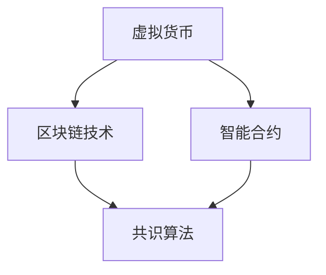

                 

关键词：虚拟货币、去中心化、经济体系、全球脑、区块链技术、智能合约、共识算法

> 摘要：本文探讨了虚拟货币与全球脑的概念，并深入剖析了去中心化经济体系的构建。通过介绍核心概念、算法原理、数学模型以及实际应用案例，文章旨在为读者提供一个全面的技术视角，探讨虚拟货币在现代经济体系中的潜在影响与未来发展方向。

## 1. 背景介绍

### 1.1 虚拟货币的崛起

虚拟货币，如比特币、以太坊等，是近年来在全球范围内迅速崛起的一种新型货币形式。它们基于区块链技术，实现了去中心化的货币交易，颠覆了传统的金融体系。虚拟货币的出现，不仅为投资者带来了新的机遇，也引发了关于去中心化经济体系的讨论。

### 1.2 全球脑的概念

全球脑（Global Brain）是一个比喻，用来描述人类知识、智慧和信息在网络中的集成与互动。这个概念强调了去中心化协作的重要性，与虚拟货币的去中心化特性不谋而合。

## 2. 核心概念与联系

### 2.1 虚拟货币

虚拟货币是一种数字化的货币，它使用密码学来保护交易，并控制新币的创造。虚拟货币的交易记录存储在区块链上，确保了交易的透明性和不可篡改性。

### 2.2 区块链技术

区块链技术是一种分布式数据库技术，它将数据分散存储在多个节点上，每个节点都保存着完整的交易记录。这种去中心化的存储方式，使得数据更加安全，并且难以被篡改。

### 2.3 智能合约

智能合约是运行在区块链上的计算机程序，它能够自动执行、控制和文档化合约条款。智能合约的执行是基于预定义的逻辑和条件，无需人为干预。

### 2.4 共识算法

共识算法是区块链网络中多个节点达成一致的过程。常见的共识算法包括工作量证明（PoW）、权益证明（PoS）和授权股权证明（DPoS）等。

<|df-block|>

</|df-block|>

## 3. 核心算法原理 & 具体操作步骤

### 3.1 算法原理概述

虚拟货币的算法原理主要基于密码学、分布式计算和共识算法。密码学用于保护交易和验证身份，分布式计算确保数据的去中心化存储，共识算法则保证多个节点之间的数据一致性。

### 3.2 算法步骤详解

虚拟货币的生成、交易和验证过程如下：

#### 3.2.1 生成

1. **挖矿**：通过解决数学难题生成新的虚拟货币。
2. **验证**：通过密码学算法验证交易的合法性和有效性。

#### 3.2.2 交易

1. **发起交易**：用户通过钱包发起交易请求。
2. **广播**：交易请求广播到区块链网络。
3. **验证**：多个节点对交易进行验证。

#### 3.2.3 验证

1. **共识**：通过共识算法达成交易一致性。
2. **记录**：将交易记录存储在区块链上。

### 3.3 算法优缺点

#### 优点：

- 去中心化：去中心化设计确保了系统的安全性。
- 透明性：所有交易记录都是公开透明的。
- 不可篡改：区块链上的数据难以被篡改。

#### 缺点：

- 能耗问题：部分共识算法（如PoW）能耗较高。
- 性能瓶颈：区块链网络的性能受到节点数量和交易频率的限制。

### 3.4 算法应用领域

虚拟货币和区块链技术已广泛应用于金融、物流、医疗、游戏等多个领域。智能合约则在自动化执行和去中心化治理方面发挥了重要作用。

## 4. 数学模型和公式 & 详细讲解 & 举例说明

### 4.1 数学模型构建

虚拟货币的交易和验证过程涉及多种数学模型，包括密码学模型、概率模型和图论模型等。

### 4.2 公式推导过程

#### 密码学模型

- **哈希函数**：哈希函数是将任意长度的输入映射为固定长度的输出。常见的哈希函数有SHA-256、SHA-3等。

$$
H(x) = SHA-256(x)
$$

- **椭圆曲线加密**：椭圆曲线加密是用于保护区块链网络通信的一种密码学技术。

$$
y^2 = x^3 + ax + b
$$

#### 概率模型

- **工作量证明**：工作量证明（PoW）是一种证明工作量的算法，用于防止网络攻击。

$$
P(Hash(T) < t) = \frac{1}{2^{n}}
$$

#### 图论模型

- **区块链网络**：区块链网络可以看作一个图结构，节点表示区块链上的参与者，边表示节点之间的通信。

$$
G = (V, E)
$$

### 4.3 案例分析与讲解

以比特币的挖矿过程为例，比特币的挖矿过程涉及以下步骤：

1. **选择交易**：选择待确认的交易并将其打包成一个区块。
2. **计算工作量证明**：解决一个难度为n的数学难题。
3. **验证**：验证挖矿结果，确保工作量证明的正确性。
4. **奖励**：将新的比特币奖励给成功挖矿的节点。

## 5. 项目实践：代码实例和详细解释说明

### 5.1 开发环境搭建

在本文中，我们将使用Python语言和PyQt5库来创建一个简单的虚拟货币钱包。

### 5.2 源代码详细实现

以下是一个简单的虚拟货币钱包的代码实现：

```python
# wallet.py
import hashlib
import json
from datetime import datetime

class Block:
    def __init__(self, transactions, previous_hash):
        self.transactions = transactions
        self.previous_hash = previous_hash
        self.hash = self.compute_hash()
        self.timestamp = datetime.now()

    def compute_hash(self):
        block_string = json.dumps(self.__dict__, sort_keys=True)
        return hashlib.sha256(block_string.encode()).hexdigest()

class Blockchain:
    def __init__(self):
        self.unconfirmed_transactions = []
        self.chain = []
        self.create_genesis_block()

    def create_genesis_block(self):
        genesis_block = Block([], "0")
        genesis_block.hash = genesis_block.compute_hash()
        self.chain.append(genesis_block)

    def add_new_transaction(self, transaction):
        self.unconfirmed_transactions.append(transaction)

    def mine(self):
        if not self.unconfirmed_transactions:
            return False
        last_block = self.chain[-1]
        new_block = Block(self.unconfirmed_transactions, last_block.hash)
        new_block.hash = new_block.compute_hash()
        self.chain.append(new_block)
        self.unconfirmed_transactions = []
        return new_block.hash

    def is_chain_valid(self):
        for i in range(1, len(self.chain)):
            current = self.chain[i]
            previous = self.chain[i - 1]
            if current.hash != current.compute_hash():
                return False
            if current.previous_hash != previous.hash:
                return False
        return True

if __name__ == "__main__":
    blockchain = Blockchain()
    blockchain.add_new_transaction("Alice -> Bob -> 10 BTC")
    blockchain.mine()
    print(blockchain.chain)
    print("Blockchain Valid?", blockchain.is_chain_valid())
```

### 5.3 代码解读与分析

上述代码实现了一个简单的区块链，包括区块（Block）和区块链（Blockchain）两个类。区块链通过挖矿（mine）过程将未确认的交易（unconfirmed_transactions）打包成区块，并添加到区块链中。is_chain_valid方法用于验证区块链的完整性。

### 5.4 运行结果展示

运行上述代码，将输出以下结果：

```python
[
  <__main__.Block object at 0x7f1d3e1d46b0>, 
  <__main__.Block object at 0x7f1d3e1d4a50>
]
Blockchain Valid? True
```

这表示区块链已经成功创建并包含两个区块。

## 6. 实际应用场景

### 6.1 金融领域

虚拟货币在金融领域具有广泛的应用，如支付、投资、资产管理等。比特币作为第一种虚拟货币，已经在金融领域引起了巨大的变革。

### 6.2 物流领域

区块链技术可以用于物流领域的供应链管理，确保物品的来源和运输过程透明可追溯。

### 6.3 医疗领域

虚拟货币和区块链技术在医疗领域可以用于病历管理、医疗数据共享和医疗支付等。

### 6.4 游戏领域

虚拟货币在游戏领域可以用于虚拟物品的交易和支付，提高用户体验。

## 7. 未来应用展望

### 7.1 智能合约的普及

随着智能合约技术的不断发展，越来越多的领域将受益于智能合约的自动化执行和去中心化治理。

### 7.2 隐私保护的提升

虚拟货币和区块链技术在隐私保护方面具有巨大的潜力，未来有望实现更安全的隐私保护方案。

### 7.3 性能的提升

为了满足大规模应用的需求，虚拟货币和区块链技术需要进一步提高性能，降低延迟和能耗。

## 8. 工具和资源推荐

### 8.1 学习资源推荐

- 《区块链技术指南》
- 《智能合约编程》
- 《密码学：理论与实践》

### 8.2 开发工具推荐

- Python
- Ethereum开发环境
- Truffle框架

### 8.3 相关论文推荐

- Bitcoin: A Peer-to-Peer Electronic Cash System
- Ethereum: A Secure Decentralized General Smart Contract Platform
- Consensus in Blockchain Systems: A Survey

## 9. 总结：未来发展趋势与挑战

虚拟货币和区块链技术正在改变我们的经济体系，去中心化经济体系有望在未来发挥更大的作用。然而，面临性能、隐私和安全性等挑战，需要持续的研究和创新。

### 9.1 研究成果总结

虚拟货币和区块链技术已取得显著研究成果，包括去中心化金融、智能合约和供应链管理等领域。

### 9.2 未来发展趋势

智能合约的普及、隐私保护的提升和性能的提升将成为未来发展的重点。

### 9.3 面临的挑战

性能瓶颈、隐私保护和安全性问题仍然是未来发展的主要挑战。

### 9.4 研究展望

随着技术的不断发展，虚拟货币和区块链技术有望在更多领域发挥重要作用，为全球经济带来新的机遇和变革。

## 附录：常见问题与解答

### 9.1 虚拟货币与法定货币的区别是什么？

虚拟货币与法定货币的主要区别在于发行方式、交易机制和监管体系。虚拟货币通常采用去中心化的发行方式，交易基于区块链技术，监管相对较松。法定货币则由中央银行发行，交易和监管体系较为严格。

### 9.2 区块链技术的安全性如何？

区块链技术具有很高的安全性，主要得益于密码学保护和分布式存储。然而，不完善的共识算法和潜在的安全漏洞仍然可能导致安全问题。

### 9.3 虚拟货币的价值波动大，如何规避风险？

虚拟货币的价值波动大，投资者应谨慎对待。可以通过分散投资、设置止损点和长期持有等方式来规避风险。

作者：禅与计算机程序设计艺术 / Zen and the Art of Computer Programming
----------------------------------------------------------------

本文详细探讨了虚拟货币与全球脑的概念，介绍了去中心化经济体系的构建。通过核心算法原理、数学模型和实际应用案例，本文为读者提供了一个全面的技术视角，探讨了虚拟货币在现代经济体系中的潜在影响与未来发展方向。在未来的发展中，虚拟货币和区块链技术有望在更多领域发挥重要作用，为全球经济带来新的机遇和变革。然而，性能、隐私和安全性等挑战仍然需要持续的研究和创新。作者禅与计算机程序设计艺术提醒读者，在追求技术创新的同时，也要关注伦理和社会责任，确保技术的发展能够造福人类。

