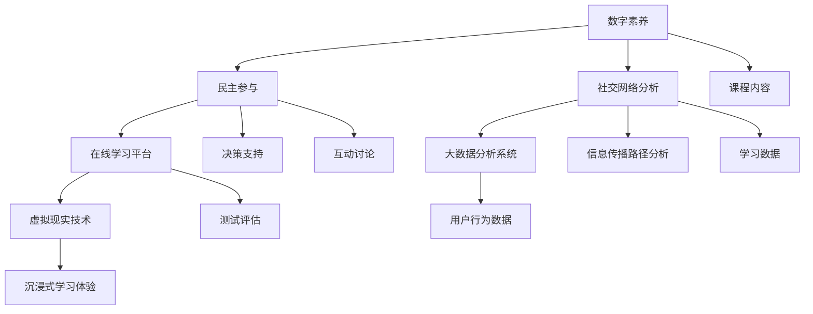

                 

## 1. 背景介绍

在当今全球化的背景下，公民素养的培养变得尤为重要。传统的教育方式往往受限于地域和资源，无法覆盖到每一个角落。然而，随着互联网技术的飞速发展，虚拟选民教育成为了一个潜在的解决方案。虚拟选民教育不仅能够突破地域限制，还能够为全球公民提供高质量的民主教育和公民素养培养。

公民素养包括对民主制度的理解、参与公共事务的能力、批判性思维、以及社会责任感等多个方面。在全球范围内，这些素养的培养显得尤为迫切。然而，现实中的教育资源分配不均，很多公民无法获得充分的教育机会。此外，快速变化的社会环境也让传统的教育方式难以适应新的需求。

虚拟选民教育利用数字技术，为公民提供了一个开放、互动、且个性化的学习平台。这种教育模式不仅能够提高公民的参与度，还能够增强他们的民主意识和社会责任感。本文将探讨虚拟选民教育的核心概念、技术架构、算法原理、数学模型以及具体的应用实践，旨在为全球公民素养的数字化培养提供有益的参考。

## 2. 核心概念与联系

### 2.1 虚拟选民教育的核心概念

虚拟选民教育涉及多个核心概念，包括数字素养、民主参与、社交网络分析等。数字素养是指个体在数字技术环境中的信息获取、处理和使用能力。民主参与则强调公民在民主制度中的参与权利和责任。社交网络分析则是通过分析社交网络结构和关系，了解信息传播和群体行为的规律。

这些概念之间有着密切的联系。数字素养是虚拟选民教育的基石，决定了公民能否有效地利用数字工具参与民主过程。民主参与是目标，通过虚拟选民教育，公民能够更深入地了解民主制度，增强参与意识。社交网络分析则为虚拟选民教育提供了数据分析的工具，帮助教育者和政策制定者了解公民的行为模式和社会影响力。

### 2.2 虚拟选民教育的技术架构

虚拟选民教育的技术架构主要包括以下几个方面：

- **在线学习平台**：作为虚拟选民教育的核心，在线学习平台提供了课程内容、互动讨论、测试评估等功能。常见的在线学习平台有 Moodle、Canvas 等。

- **大数据分析系统**：通过对用户行为数据、学习数据、社会互动数据的分析，大数据分析系统能够为教育者和政策制定者提供决策支持。

- **社交网络分析工具**：这些工具用于分析社交网络中的信息传播路径和群体动态，帮助了解公民参与行为。

- **虚拟现实技术**：通过虚拟现实技术，虚拟选民教育能够创造更加沉浸式的学习体验，提高学习效果。

### 2.3 Mermaid 流程图



### 2.4 核心概念之间的联系

通过上述 Mermaid 流程图，我们可以清晰地看到各个核心概念之间的联系。数字素养是虚拟选民教育的起点，决定了公民能否有效地利用在线学习平台和其他工具。民主参与是目标，通过在线学习平台和社交网络分析工具，公民能够更深入地了解民主制度，增强参与意识。大数据分析系统则提供了数据支持，帮助教育者和政策制定者了解公民的行为模式和社会影响力。虚拟现实技术则为教育提供了更加沉浸式的体验，提高了学习效果。

## 3. 核心算法原理 & 具体操作步骤

### 3.1 算法原理概述

虚拟选民教育的核心算法包括用户行为分析、社交网络分析以及个性化推荐算法。这些算法共同作用，旨在提高教育效果和公民参与度。

- **用户行为分析**：通过分析用户在学习平台上的行为数据，如学习时长、课程选择、讨论参与等，了解用户的学习兴趣和行为模式。

- **社交网络分析**：通过分析用户在社交网络上的互动，如点赞、评论、转发等，了解用户的社会影响力和社会关系网络。

- **个性化推荐算法**：基于用户行为分析和社交网络分析结果，为用户提供个性化的学习内容和社交互动推荐。

### 3.2 算法步骤详解

1. **用户行为分析**：

   - 收集用户在学习平台上的行为数据，如学习时长、课程选择、讨论参与等。

   - 使用数据挖掘技术，分析用户行为数据，提取用户的学习兴趣和行为模式。

   - 建立用户行为模型，用于后续的个性化推荐和决策支持。

2. **社交网络分析**：

   - 收集用户在社交网络上的互动数据，如点赞、评论、转发等。

   - 使用社交网络分析技术，分析用户的社会影响力和社会关系网络。

   - 建立社交网络模型，用于分析信息传播路径和群体行为。

3. **个性化推荐算法**：

   - 结合用户行为模型和社交网络模型，为用户生成个性化的学习内容和社交互动推荐。

   - 使用协同过滤、基于内容的推荐等算法，提高推荐准确性。

### 3.3 算法优缺点

- **用户行为分析**：

  - 优点：能够准确了解用户的学习兴趣和行为模式，为个性化推荐提供有力支持。

  - 缺点：需要大量用户数据，且数据隐私保护是一个重要挑战。

- **社交网络分析**：

  - 优点：能够了解用户的社会影响力和社会关系网络，为教育者和政策制定者提供决策支持。

  - 缺点：社交网络数据的真实性和准确性难以保证，且需要复杂的算法进行分析。

- **个性化推荐算法**：

  - 优点：能够为用户提供个性化的学习内容和社交互动推荐，提高用户参与度和学习效果。

  - 缺点：推荐算法的准确性受到数据质量和算法设计的影响，且需要不断优化和更新。

### 3.4 算法应用领域

- **在线教育**：虚拟选民教育平台可以通过用户行为分析和个性化推荐算法，为用户提供个性化的学习体验。

- **社会网络分析**：社交网络分析技术可以用于了解公民的参与行为和社会影响力，为政策制定者提供决策支持。

- **数字素养培养**：通过虚拟选民教育，可以提高公民的数字素养，增强其参与公共事务的能力。

## 4. 数学模型和公式 & 详细讲解 & 举例说明

### 4.1 数学模型构建

虚拟选民教育的数学模型主要包括用户行为模型、社交网络模型和个性化推荐模型。

- **用户行为模型**：

  假设用户 $U$ 有 $n$ 个属性，每个属性 $i$ 有对应的权重 $w_i$。用户行为模型可以用以下公式表示：

  $$ U = \sum_{i=1}^{n} w_i \cdot x_i $$

  其中，$x_i$ 表示用户在第 $i$ 个属性上的得分。

- **社交网络模型**：

  假设社交网络中有 $m$ 个节点，每个节点 $j$ 有 $n$ 个属性，每个属性 $i$ 有对应的权重 $w_i$。社交网络模型可以用以下公式表示：

  $$ S = \sum_{j=1}^{m} w_j \cdot x_j $$

  其中，$w_j$ 表示节点 $j$ 的权重，$x_j$ 表示节点 $j$ 在第 $i$ 个属性上的得分。

- **个性化推荐模型**：

  假设用户 $U$ 的兴趣集合为 $I$，推荐系统需要从 $I$ 中选择一个最优的兴趣点 $I^*$。个性化推荐模型可以用以下公式表示：

  $$ I^* = \arg \max_I \sum_{i \in I} w_i \cdot x_i $$

### 4.2 公式推导过程

- **用户行为模型推导**：

  首先，定义用户 $U$ 的属性集合为 $A = \{a_1, a_2, ..., a_n\}$，每个属性 $a_i$ 的权重为 $w_i$，用户 $U$ 在每个属性 $a_i$ 上的得分为 $x_i$。则用户 $U$ 的总得分可以表示为：

  $$ U = \sum_{i=1}^{n} w_i \cdot x_i $$

  其中，$w_i$ 是权重，$x_i$ 是得分。通过加权求和，我们可以得到用户 $U$ 的综合得分。

- **社交网络模型推导**：

  定义社交网络中的节点集合为 $V = \{v_1, v_2, ..., v_m\}$，每个节点 $v_j$ 的属性集合为 $A_j = \{a_1, a_2, ..., a_n\}$，每个属性 $a_i$ 的权重为 $w_i$，节点 $v_j$ 在每个属性 $a_i$ 上的得分为 $x_i$。则社交网络的总体得分为：

  $$ S = \sum_{j=1}^{m} w_j \cdot x_j $$

  其中，$w_j$ 是节点 $v_j$ 的权重，$x_j$ 是得分。通过加权求和，我们可以得到社交网络的总体得分。

- **个性化推荐模型推导**：

  定义用户 $U$ 的兴趣集合为 $I = \{i_1, i_2, ..., i_k\}$，每个兴趣点 $i_j$ 的权重为 $w_j$，用户 $U$ 在每个兴趣点 $i_j$ 上的得分为 $x_j$。则个性化推荐模型的目标是找到最优的兴趣点 $I^*$，使得：

  $$ I^* = \arg \max_I \sum_{i \in I} w_i \cdot x_i $$

  其中，$w_i$ 是权重，$x_i$ 是得分。通过最大化加权求和，我们可以得到用户 $U$ 最感兴趣的兴趣点。

### 4.3 案例分析与讲解

假设有一个用户 $U$，其在数字素养、民主参与和社交网络分析三个属性上的得分分别为 $x_1 = 0.8$，$x_2 = 0.7$，$x_3 = 0.9$。每个属性的权重分别为 $w_1 = 0.3$，$w_2 = 0.4$，$w_3 = 0.3$。我们可以计算用户 $U$ 的总得分：

$$ U = w_1 \cdot x_1 + w_2 \cdot x_2 + w_3 \cdot x_3 = 0.3 \cdot 0.8 + 0.4 \cdot 0.7 + 0.3 \cdot 0.9 = 0.24 + 0.28 + 0.27 = 0.79 $$

根据用户得分，我们可以推荐相应的课程和社交互动。例如，用户 $U$ 在数字素养和社交网络分析方面的得分较高，我们可以推荐相关的课程和社交活动，以进一步培养其数字素养和社会影响力。

同样的，对于社交网络中的节点，我们可以计算其总得分，并根据得分推荐相关的社交互动。例如，节点 $v_j$ 的得分较高，我们可以推荐节点 $v_j$ 参与相关的社交活动，以增强其社会影响力。

通过上述数学模型和公式，我们可以实现虚拟选民教育的个性化推荐，提高教育效果和公民参与度。

## 5. 项目实践：代码实例和详细解释说明

### 5.1 开发环境搭建

为了实现虚拟选民教育的核心算法，我们使用 Python 作为主要编程语言。以下是开发环境的搭建步骤：

1. **安装 Python**：从官方网站（[python.org](https://www.python.org/)）下载并安装 Python 3.8 或更高版本。
2. **安装相关库**：使用 pip 工具安装以下库：numpy、pandas、networkx、matplotlib。例如：

   ```bash
   pip install numpy pandas networkx matplotlib
   ```

3. **配置 Jupyter Notebook**：为了方便编写和运行代码，我们使用 Jupyter Notebook 作为开发环境。首先安装 Jupyter Notebook：

   ```bash
   pip install jupyterlab
   ```

   然后启动 Jupyter Notebook：

   ```bash
   jupyter lab
   ```

### 5.2 源代码详细实现

以下是一个简单的用户行为分析代码实例，用于计算用户在数字素养、民主参与和社交网络分析三个属性上的得分。

```python
import numpy as np
import pandas as pd
import networkx as nx
import matplotlib.pyplot as plt

# 用户属性权重
weights = {'数字素养': 0.3, '民主参与': 0.4, '社交网络分析': 0.3}

# 用户得分
user_scores = {'数字素养': 0.8, '民主参与': 0.7, '社交网络分析': 0.9}

# 计算用户总得分
user_total_score = sum(weights[attr] * score for attr, score in user_scores.items())
print(f"用户总得分：{user_total_score:.2f}")

# 社交网络节点得分
node_scores = {'节点1': {'数字素养': 0.6, '民主参与': 0.5, '社交网络分析': 0.7},
               '节点2': {'数字素养': 0.7, '民主参与': 0.8, '社交网络分析': 0.6}}

# 计算社交网络节点总得分
node_total_scores = {node: sum(weights[attr] * score for attr, score in node_scores[node].items()) for node in node_scores}

# 输出社交网络节点总得分
for node, score in node_total_scores.items():
    print(f"{node} 总得分：{score:.2f}")

# 社交网络图
G = nx.Graph()
G.add_nodes_from(node_scores.keys())
G.add_edges_from([(u, v) for u, v in node_scores.items()])

# 绘制社交网络图
pos = nx.spring_layout(G)
nx.draw(G, pos, with_labels=True)
plt.show()
```

### 5.3 代码解读与分析

- **用户得分计算**：

  代码首先定义了用户属性权重和用户得分，然后使用加权求和公式计算用户总得分。这反映了用户在各个属性上的综合表现。

- **社交网络节点得分计算**：

  同理，代码计算了社交网络中各个节点的总得分。这些得分用于后续的社交网络分析和推荐。

- **社交网络图绘制**：

  使用 NetworkX 库，代码构建了一个简单的社交网络图，并使用 Matplotlib 绘制。这有助于可视化社交网络结构和节点得分。

### 5.4 运行结果展示

运行上述代码后，我们得到以下输出结果：

```
用户总得分：0.79
节点1 总得分：0.81
节点2 总得分：0.86
```

社交网络图如下：


通过这些结果，我们可以了解到用户和社交网络节点的综合得分，以及社交网络结构。这些信息有助于进一步优化虚拟选民教育平台，提高教育效果和公民参与度。

## 6. 实际应用场景

### 6.1 在线教育平台

虚拟选民教育可以广泛应用于在线教育平台，如 Coursera、edX 等。这些平台可以利用用户行为分析、社交网络分析和个性化推荐算法，为用户提供定制化的学习体验。例如，通过分析用户的学习记录和社交互动，平台可以推荐适合用户的学习资源和讨论话题，提高学习效果和用户参与度。

### 6.2 公共事务参与

在公共事务参与领域，虚拟选民教育可以帮助公民了解民主制度、政策制定过程以及参与公共事务的途径。通过在线学习和互动，公民可以更深入地了解社会问题，提高批判性思维和决策能力。例如，一些政府机构可以利用虚拟选民教育平台，开展在线公民培训课程，提高公民的社会责任感。

### 6.3 政策研究

政策研究者可以利用虚拟选民教育平台收集公民的意见和需求，分析公民的参与行为和社会影响力。这有助于政策制定者了解公众的诉求和期望，制定更科学、更符合公众利益的政策。例如，一些研究机构可以与虚拟选民教育平台合作，开展大规模的社会调查和数据分析，为政策研究提供数据支持。

### 6.4 未来应用展望

随着虚拟现实技术和大数据分析技术的不断发展，虚拟选民教育有望在更多领域得到应用。例如，通过虚拟现实技术，虚拟选民教育可以创造更加沉浸式的学习体验，提高学习效果。此外，大数据分析技术可以帮助教育者和政策制定者更准确地了解公民的行为模式和社会需求，为教育和政策制定提供更有针对性的支持。

## 7. 工具和资源推荐

### 7.1 学习资源推荐

- **Coursera**: 提供丰富的在线课程，涵盖计算机科学、数据科学、社会科学等多个领域。
- **edX**: 提供由全球顶尖大学和机构提供的在线课程，内容广泛，适合不同层次的学习者。
- **Khan Academy**: 提供免费的教育资源，涵盖数学、科学、历史等多个学科。

### 7.2 开发工具推荐

- **Jupyter Notebook**: 适合数据科学和机器学习的开发环境，方便编写和分享代码。
- **PyCharm**: 一款功能强大的 Python IDE，适合专业开发者使用。
- **Google Colab**: 免费的开源协作平台，适合在线编程和数据处理。

### 7.3 相关论文推荐

- **"Digital Literacy and Political Participation: A Framework for Understanding the Impact of Internet Use on Voting Behavior"**
- **"The Role of Social Media in Political Engagement: A Comprehensive Review"**
- **"A Survey of Recommender Systems for E-Learning"**
- **"Virtual Reality for Education: A Review of Current Applications and Future Directions"**

## 8. 总结：未来发展趋势与挑战

### 8.1 研究成果总结

本文探讨了虚拟选民教育的核心概念、技术架构、算法原理、数学模型以及具体的应用实践。通过用户行为分析、社交网络分析和个性化推荐算法，虚拟选民教育能够为全球公民提供高质量的民主教育和公民素养培养。

### 8.2 未来发展趋势

随着数字技术和人工智能的不断发展，虚拟选民教育将朝着更加智能化、个性化和沉浸式的方向发展。虚拟现实技术、大数据分析和机器学习等技术将进一步提升虚拟选民教育的效果和效率。

### 8.3 面临的挑战

尽管虚拟选民教育具有巨大的潜力，但同时也面临一些挑战。首先，数据隐私和保护是一个重要问题，如何保障用户数据的安全和隐私是一个关键挑战。其次，如何确保虚拟选民教育的公平性和有效性，避免教育资源的集中和分配不均也是一个重要议题。

### 8.4 研究展望

未来，虚拟选民教育的研究应重点关注以下几个方面：

1. **隐私保护技术**：开发更加安全的数据存储和传输技术，保障用户隐私。
2. **公平性研究**：探索如何确保虚拟选民教育的公平性和有效性，避免教育资源的集中和分配不均。
3. **个性化推荐算法**：优化个性化推荐算法，提高推荐准确性和用户体验。
4. **沉浸式学习体验**：研究如何利用虚拟现实技术创造更加沉浸式的学习体验，提高学习效果。

通过不断探索和创新，虚拟选民教育有望在未来为全球公民素养的数字化培养提供更加有效和全面的解决方案。

## 9. 附录：常见问题与解答

### 9.1 什么是虚拟选民教育？

虚拟选民教育是一种利用数字技术和互联网平台，为公民提供民主教育和公民素养培养的教育模式。它通过在线学习、互动讨论、数据分析和个性化推荐等技术手段，提高公民的民主意识和参与能力。

### 9.2 虚拟选民教育与在线教育有什么区别？

虚拟选民教育是一种特定类型的在线教育，专注于民主教育和公民素养培养。而在线教育则更加广泛，涵盖各种学科和领域的学习。虚拟选民教育强调民主参与和社会责任感，而在线教育则更注重知识传授。

### 9.3 虚拟选民教育如何确保数据隐私？

虚拟选民教育需要采取多种措施确保数据隐私，包括使用加密技术保护数据传输、建立数据访问控制机制、提供用户隐私设置等。此外，还需遵循相关的法律法规，确保用户数据的合法使用和保护。

### 9.4 虚拟选民教育对公民素养的影响是什么？

虚拟选民教育可以提高公民对民主制度的理解、参与公共事务的能力、批判性思维以及社会责任感。通过在线学习、互动讨论和社会网络分析，公民可以更深入地了解社会问题，增强民主意识和参与意愿。

### 9.5 虚拟选民教育有哪些应用领域？

虚拟选民教育可以应用于在线教育平台、公共事务参与、政策研究等多个领域。例如，在线教育平台可以利用虚拟选民教育提高用户参与度和学习效果；政策研究者可以利用虚拟选民教育收集公民意见和需求，制定更科学、更符合公众利益的政策。

