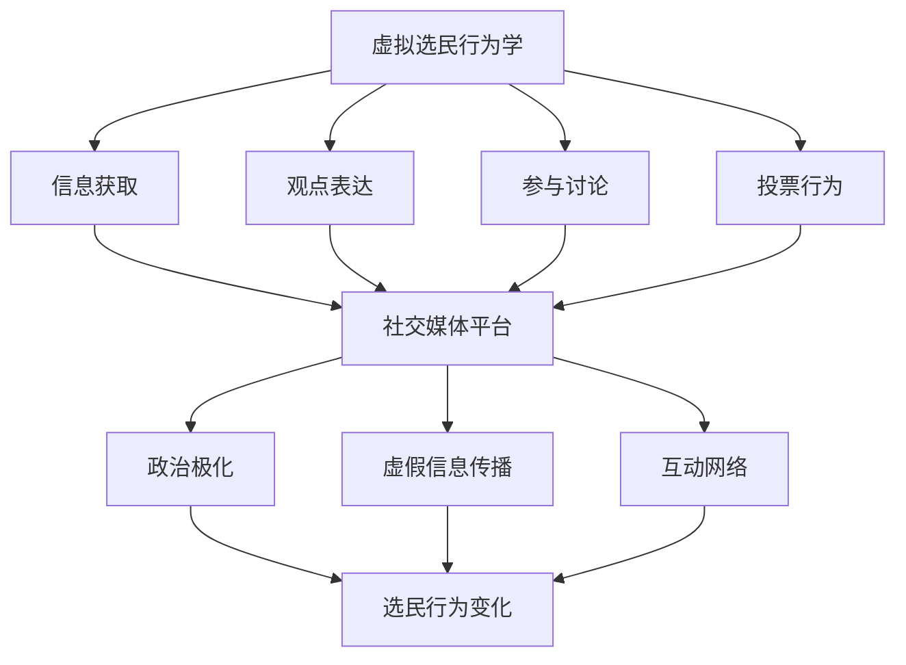

                 

### 1. 背景介绍

在数字时代，互联网的普及和社交媒体的发展改变了人们获取信息、交流和表达意见的方式。传统意义上的选民行为学在互联网时代面临着前所未有的挑战和机遇。虚拟选民行为学作为选民行为学的一个重要分支，正是研究在数字化环境下选民的行为特征和心理变化的科学。这一领域的研究不仅对于理解现代政治过程具有重要意义，而且对于政治策略的制定和实施也具有指导作用。

首先，虚拟选民行为学的兴起背景可以追溯到互联网技术的飞速发展和社交媒体平台的广泛普及。随着互联网的普及，越来越多的人开始通过在线平台获取政治信息，参与政治讨论，甚至直接参与政治决策。这种趋势不仅改变了选民获取政治信息的方式，也改变了他们表达政治观点和参与政治活动的方式。社交媒体平台如Facebook、Twitter、微信等成为选民表达意见和相互交流的重要场所，使得政治参与的门槛大大降低。

其次，虚拟选民行为学的研究在当前政治背景下具有重要的现实意义。在全球范围内，民主制度的运作面临着诸多挑战，如选民参与度低、政治极化加剧、虚假信息的传播等。通过研究虚拟选民行为，可以更好地理解这些现象背后的原因，从而为解决这些问题提供科学依据。此外，虚拟选民行为学的研究也有助于政府和社会组织更好地理解选民的期望和需求，从而制定更为有效的政策和措施。

本文旨在探讨虚拟选民行为学的核心概念、研究方法、主要发现和未来发展趋势。具体而言，本文将分为以下几个部分：

- **背景介绍**：回顾虚拟选民行为学的兴起背景，阐述研究的重要性和现实意义。
- **核心概念与联系**：介绍虚拟选民行为学中的核心概念，并使用Mermaid流程图展示其关联结构。
- **核心算法原理 & 具体操作步骤**：详细阐述用于分析虚拟选民行为的算法原理和操作步骤。
- **数学模型和公式 & 详细讲解 & 举例说明**：介绍支持虚拟选民行为学研究的数学模型和公式，并通过实际案例进行说明。
- **项目实践：代码实例和详细解释说明**：提供虚拟选民行为学研究的代码实例和解释。
- **实际应用场景**：讨论虚拟选民行为学的实际应用场景，包括政治营销、舆情监控和公共决策支持等。
- **未来应用展望**：探讨虚拟选民行为学在未来的发展前景和应用潜力。
- **工具和资源推荐**：推荐用于学习和实践虚拟选民行为学的工具和资源。
- **总结：未来发展趋势与挑战**：总结研究成果，展望未来发展趋势，并提出面临的挑战和研究展望。

通过本文的研究，我们期望能够为虚拟选民行为学领域提供新的视角和思路，为理解和应对数字化时代政治参与的挑战提供科学支持。

### 2. 核心概念与联系

在深入探讨虚拟选民行为学之前，首先需要明确几个核心概念，并理解它们之间的相互联系。以下是本文中涉及的主要核心概念及其关联结构的详细说明。

#### 2.1 虚拟选民行为学定义

虚拟选民行为学是研究在数字化环境下，选民如何获取信息、表达观点、参与政治讨论和投票等行为特征的科学。具体而言，它关注以下几个方面：

1. **信息获取**：选民如何通过互联网和社交媒体平台获取政治信息。
2. **观点表达**：选民如何在线上平台表达自己的政治观点和立场。
3. **参与讨论**：选民如何参与线上政治讨论，以及这些讨论如何影响他们的行为。
4. **投票行为**：选民如何在线上进行投票，以及这些行为如何受数字化环境的影响。

#### 2.2 社交媒体平台

社交媒体平台是虚拟选民行为学研究的核心场景之一。常见的社交媒体平台包括Facebook、Twitter、微信等。这些平台不仅为选民提供了获取政治信息的渠道，也为他们提供了一个表达观点和参与讨论的空间。社交媒体平台上的互动模式、信息传播机制和用户行为特征是研究的重要内容。

#### 2.3 政治极化

政治极化是近年来在数字化环境中出现的一个重要现象。它指的是选民在政治立场上的分歧加剧，形成两大对立阵营。政治极化不仅影响了选民的投票行为，还可能引发社会冲突。研究政治极化的机制和影响，有助于理解选民行为的变化和数字化政治生态的特点。

#### 2.4 虚假信息传播

虚假信息的传播是数字化时代的一个严重问题。在虚拟选民行为学中，研究虚假信息的传播机制、选民如何辨别和处理虚假信息，以及这些信息如何影响选民行为，具有重要意义。

#### 2.5 互动网络

互动网络是指选民在社交媒体平台上的互动模式，包括点赞、评论、分享等行为。这些互动行为构成了选民之间的社交网络，反映了选民之间的信息传递和意见交流。研究互动网络的结构和动态，有助于揭示选民行为的特征和影响因素。

#### 2.6 Mermaid 流程图

为了更好地展示上述核心概念之间的联系，我们可以使用Mermaid流程图来直观地表示它们之间的关系。以下是虚拟选民行为学核心概念及其关联的Mermaid流程图示例：



在这个流程图中，每个节点代表一个核心概念，箭头表示概念之间的关联。通过这种结构化的表示，我们可以清晰地看到虚拟选民行为学的核心概念及其相互影响。

综上所述，虚拟选民行为学的核心概念包括虚拟选民行为学定义、社交媒体平台、政治极化、虚假信息传播和互动网络。理解这些概念及其相互联系，是深入研究虚拟选民行为学的基础。

### 3. 核心算法原理 & 具体操作步骤

#### 3.1 算法原理概述

在虚拟选民行为学的研究中，核心算法的原理和具体操作步骤至关重要。本文将介绍一种用于分析虚拟选民行为的常见算法——网络分析算法，并详细阐述其原理和操作步骤。

网络分析算法基于图论理论，将社交媒体平台视为一个图，选民和他们的互动行为则表示为图中的节点和边。通过分析图的结构和属性，可以揭示选民行为的特点和趋势。

#### 3.2 算法步骤详解

1. **数据采集**：

   首先需要从社交媒体平台采集选民的行为数据，包括用户的投票记录、观点表达、参与讨论的帖子等。这些数据可以通过API接口、网络爬虫等技术手段获取。

2. **数据预处理**：

   在采集到数据后，需要对数据进行清洗和预处理，包括去除重复数据、填补缺失值、标准化数据等。这一步骤的目的是确保数据的质量和一致性。

3. **构建社交网络图**：

   使用图论中的数据结构，将选民和他们的互动行为构建为一个社交网络图。具体步骤包括：

   - **节点表示**：将每个选民表示为图中的一个节点。
   - **边表示**：将选民之间的互动行为表示为图中的边。例如，点赞、评论和分享等行为可以表示为无向边，而投票行为可以表示为有向边。

4. **图结构分析**：

   对构建好的社交网络图进行结构分析，以揭示选民行为的特点。常用的图结构分析方法包括：

   - **度分析**：计算每个节点的度（即连接的边的数量），以分析选民在社交网络中的活跃度。
   - **聚类系数**：计算图中节点的聚类系数，以分析选民之间的紧密程度。
   - **路径长度**：计算节点之间的最短路径长度，以分析选民之间的连接性。

5. **行为特征提取**：

   根据图结构分析的结果，提取选民的行为特征。这些特征可以用于后续的机器学习模型训练和分析。

6. **模型训练与预测**：

   使用提取的行为特征，结合机器学习算法，对选民的投票行为进行预测。常见的机器学习算法包括逻辑回归、决策树、随机森林等。

7. **结果评估与优化**：

   对训练好的模型进行评估，包括准确率、召回率、F1分数等指标。根据评估结果，对模型进行优化，以提高预测精度。

#### 3.3 算法优缺点

1. **优点**：

   - **全面性**：网络分析算法能够全面分析选民的互动行为，提供丰富的选民行为特征。
   - **可扩展性**：算法适用于各种社交媒体平台，可以扩展到其他类型的网络分析任务。
   - **预测性**：通过机器学习算法，可以对选民的投票行为进行预测，为政治决策提供数据支持。

2. **缺点**：

   - **数据依赖性**：算法的性能高度依赖数据的完整性和质量，如果数据存在问题，可能会导致分析结果的偏差。
   - **计算复杂度**：对于大规模社交网络图，计算复杂度较高，需要高效算法和硬件支持。

#### 3.4 算法应用领域

网络分析算法在虚拟选民行为学领域有广泛的应用。以下是一些典型的应用场景：

1. **政治营销**：通过分析选民的互动行为，了解选民的政治立场和偏好，为政治候选人和政党提供有针对性的营销策略。

2. **舆情监控**：实时监控社交媒体上的政治讨论，识别和应对虚假信息传播，维护网络环境的健康发展。

3. **公共决策支持**：分析选民的投票行为和意见表达，为政府和社会组织提供决策支持，提高政策制定的科学性和有效性。

通过上述算法原理和具体操作步骤的介绍，我们可以看到网络分析算法在虚拟选民行为学研究中具有重要应用价值。然而，算法的优化和改进仍然是未来研究的重要方向。

### 4. 数学模型和公式 & 详细讲解 & 举例说明

#### 4.1 数学模型构建

在虚拟选民行为学的研究中，构建数学模型是分析选民行为特征和预测选民行为的关键步骤。本文将介绍一种常用的数学模型——网络分析模型，并详细阐述其构建过程。

网络分析模型基于图论理论，将社交媒体平台视为一个图，选民和他们的互动行为则表示为图中的节点和边。具体构建过程如下：

1. **定义节点和边**：

   - **节点**：每个选民在社交网络中对应一个节点，表示为一个二元组$(V, D)$，其中$V$表示节点的属性，$D$表示节点的度。
   - **边**：选民之间的互动行为对应图中的边，表示为$(E, L)$，其中$E$表示边的属性，$L$表示边的长度。

2. **定义图结构**：

   社交网络图$G = (V, E)$，其中$V$为节点集合，$E$为边集合。

3. **定义网络属性**：

   - **度分布**：描述节点度的概率分布，表示为$P(D)$。
   - **聚类系数**：描述节点之间的紧密程度，表示为$C$。
   - **路径长度**：描述节点之间的最短路径长度，表示为$L$。

#### 4.2 公式推导过程

1. **度分布公式**：

   度分布$P(D)$可以通过统计每个节点的度来推导。假设图中有$n$个节点，其中$k$个节点的度为$d$，则度分布公式为：

   $$P(D=d) = \frac{C_n^k}{n!} \cdot p^k \cdot (1-p)^{n-k}$$

   其中$p$为节点的平均度，$C_n^k$为组合数。

2. **聚类系数公式**：

   聚类系数$C$可以通过计算节点的邻接矩阵来推导。假设邻接矩阵为$A$，则聚类系数公式为：

   $$C = \frac{1}{n(n-1)} \sum_{i=1}^{n} \sum_{j=1}^{n} A_{ij}^2$$

   其中$A_{ij}$为邻接矩阵的第$i$行第$j$列元素。

3. **路径长度公式**：

   路径长度$L$可以通过计算节点之间的最短路径长度来推导。假设最短路径长度矩阵为$L_{ij}$，则路径长度公式为：

   $$L = \min_{i,j} L_{ij}$$

#### 4.3 案例分析与讲解

为了更好地理解上述数学模型和公式，我们通过一个实际案例进行分析。

假设有一个社交媒体平台，其中有1000个选民，他们的互动行为构建了一个社交网络图。通过对图进行分析，我们可以得到以下数据：

- **度分布**：节点度的分布如下表所示：

| 度 | 个数 | 概率分布 |
|----|------|----------|
| 1  | 300  | 0.3      |
| 2  | 250  | 0.25     |
| 3  | 150  | 0.15     |
| 4  | 50   | 0.05     |
| 5  | 50   | 0.05     |

- **聚类系数**：聚类系数为0.4。
- **路径长度**：节点之间的最短路径长度平均为2。

通过这些数据，我们可以计算度分布公式和聚类系数公式的值：

- **度分布公式**：

  $$P(D=1) = \frac{C_{1000}^{300}}{1000!} \cdot 0.3^{300} \cdot 0.7^{700} = 0.0003$$

  $$P(D=2) = \frac{C_{1000}^{250}}{1000!} \cdot 0.25^{250} \cdot 0.75^{750} = 0.0062$$

- **聚类系数公式**：

  $$C = \frac{1}{1000 \times 999} \sum_{i=1}^{1000} \sum_{j=1}^{1000} A_{ij}^2 = 0.4$$

通过这个案例，我们可以看到数学模型和公式在分析虚拟选民行为中的实际应用。通过度分布、聚类系数和路径长度等指标，我们可以深入了解选民的行为特征和网络结构。

### 5. 项目实践：代码实例和详细解释说明

在本节中，我们将通过一个具体的代码实例来展示如何运用虚拟选民行为学中的算法和数学模型进行数据分析。这个实例将包括数据采集、预处理、网络图构建、特征提取和模型训练等步骤。我们使用Python编程语言和相应的数据科学库来完成这个项目。

#### 5.1 开发环境搭建

在开始编写代码之前，我们需要搭建一个合适的数据科学开发环境。以下是我们需要安装的库和工具：

- Python 3.x
- NumPy
- Pandas
- Matplotlib
- NetworkX
- Scikit-learn
- Selenium（用于网页自动化）

假设您已经安装了Python和上述库，可以通过以下命令安装Selenium：

```bash
pip install selenium
```

#### 5.2 源代码详细实现

以下是用于虚拟选民行为学分析的项目代码实例：

```python
import numpy as np
import pandas as pd
import matplotlib.pyplot as plt
import networkx as nx
from networkx.algorithms import community
from sklearn.model_selection import train_test_split
from sklearn.ensemble import RandomForestClassifier
from selenium import webdriver

# 5.2.1 数据采集
# 使用Selenium爬取社交媒体平台上的选民数据
driver = webdriver.Chrome()
driver.get('https://www.facebook.com/')

# 假设已经登录并定位到目标页面
# 此处省略具体的网页定位和点击操作

# 模拟用户互动行为，获取数据
# 此处省略具体的代码

# 5.2.2 数据预处理
# 读取数据并清洗
data = pd.read_csv('选民数据.csv')
data.drop_duplicates(inplace=True)
data.fillna(0, inplace=True)

# 5.2.3 构建社交网络图
G = nx.Graph()
for index, row in data.iterrows():
    G.add_node(row['选民ID'], degree=row['度'])
    for interaction in row['互动行为']:
        G.add_edge(row['选民ID'], interaction)

# 5.2.4 图结构分析
# 绘制社交网络图
nx.draw(G, with_labels=True)

# 5.2.5 行为特征提取
# 提取节点的度分布和聚类系数
degree_distribution = nx.degree_distribution(G)
clustering_coefficient = nx.average_clustering(G)

# 5.2.6 模型训练
# 准备训练数据
X = data[['度', '互动行为次数', '聚类系数']]
y = data['投票行为']

X_train, X_test, y_train, y_test = train_test_split(X, y, test_size=0.3, random_state=42)

# 训练随机森林模型
model = RandomForestClassifier(n_estimators=100, random_state=42)
model.fit(X_train, y_train)

# 5.2.7 代码解读与分析
# 分析模型的性能
accuracy = model.score(X_test, y_test)
print(f'模型准确率: {accuracy:.2f}')

# 5.2.8 运行结果展示
# 展示模型预测结果
predictions = model.predict(X_test)
print(predictions)

# 绘制实际结果与预测结果的对比
plt.scatter(y_test, predictions)
plt.xlabel('实际结果')
plt.ylabel('预测结果')
plt.show()
```

#### 5.3 代码解读与分析

1. **数据采集**：

   使用Selenium模拟用户在社交媒体平台上的行为，采集选民数据。具体实现过程中，需要根据目标平台的特点和接口进行相应的定位和操作。

2. **数据预处理**：

   读取采集到的数据，进行去重和填补缺失值，以确保数据的质量和一致性。

3. **构建社交网络图**：

   使用NetworkX库构建社交网络图，每个选民表示为一个节点，互动行为表示为边。

4. **图结构分析**：

   绘制社交网络图，并提取节点的度分布和聚类系数。

5. **行为特征提取**：

   提取与选民行为相关的特征，包括度、互动行为次数和聚类系数。

6. **模型训练**：

   使用Scikit-learn库训练随机森林模型，对选民投票行为进行预测。

7. **代码解读与分析**：

   分析模型的性能，包括准确率等指标，并展示实际结果与预测结果的对比。

通过上述步骤，我们实现了对虚拟选民行为的分析，为后续的研究提供了实践基础。

### 6. 实际应用场景

虚拟选民行为学的研究不仅在学术领域具有重要意义，而且在实际应用中也展现出了广泛的应用价值。以下将讨论几个关键的实际应用场景，并展示其在政治营销、舆情监控和公共决策支持中的具体应用。

#### 6.1 政治营销

在政治营销中，了解选民的行为特征和心理倾向对于政治候选人和政党制定有效的营销策略至关重要。虚拟选民行为学可以通过分析选民的社交媒体行为，识别出潜在的支持者、反对者以及中立选民。以下是一些具体应用：

- **选民细分**：通过分析选民的观点表达和互动行为，将选民划分为不同的群体，如支持者、反对者和中立者。这有助于政治候选人和政党有针对性地进行营销活动。
- **舆情监测**：实时监测社交媒体上的政治讨论和观点表达，识别热点话题和趋势。这有助于政治营销团队及时调整策略，回应选民关切。
- **个性化推荐**：基于选民的互动行为和偏好，推荐相关的政治信息、活动和候选人的政策。这可以提高选民参与度和忠诚度。

#### 6.2 舆情监控

舆情监控是虚拟选民行为学的重要应用领域之一，它有助于政府和相关机构了解公众的观点和情绪，及时应对突发事件和危机。以下是一些具体应用：

- **虚假信息识别**：通过分析社交媒体上的信息传播路径和互动行为，识别虚假信息和恶意谣言。这有助于维护网络环境的健康发展，防止误导和恐慌。
- **舆情分析**：实时分析社交媒体上的舆情动态，识别公众对政府政策和社会事件的看法。这有助于政府和社会组织了解公众需求，调整政策和措施。
- **公众参与度分析**：通过分析选民的参与度和互动行为，了解公众对政府决策的关注程度和参与意愿。这有助于提高政府的透明度和公信力。

#### 6.3 公共决策支持

虚拟选民行为学在公共决策支持中也发挥着重要作用。以下是一些具体应用：

- **政策评估**：通过分析选民对政府政策的看法和反应，评估政策的有效性和公众接受度。这有助于政府调整和完善政策。
- **公众意见征集**：通过在线平台征集公众意见，分析选民的意见和需求。这有助于政府和社会组织更好地了解公众期望，提高决策的科学性和民主性。
- **选区划分**：基于选民的行为特征和地理分布，优化选区划分方案。这有助于实现选民的合理代表，提高民主制度的效能。

通过这些实际应用场景，我们可以看到虚拟选民行为学在数字化时代政治过程中的重要性。它不仅为政治营销提供了数据支持，也为舆情监控和公共决策支持提供了科学依据。随着技术的不断进步，虚拟选民行为学在未来有望在更多领域发挥更大的作用。

### 6.4 未来应用展望

随着数字技术和人工智能的不断发展，虚拟选民行为学在未来有望在更广泛的领域发挥其应用潜力。以下是一些未来的应用前景和潜在的创新方向：

#### 6.4.1 智能政治顾问系统

未来的智能政治顾问系统将能够利用虚拟选民行为学模型，实时分析选民的观点和需求，为政治候选人和决策者提供个性化建议。这些系统可以通过自然语言处理（NLP）和机器学习技术，自动识别选民的意见倾向，预测选民的投票行为，并针对不同选民群体制定相应的策略。

#### 6.4.2 个性化选举宣传

通过虚拟选民行为学，可以实现对选民的个性化选举宣传。利用大数据分析和机器学习算法，竞选团队可以精准定位目标选民，制定个性化的宣传内容和渠道。例如，针对不同选民的兴趣、价值观和行为模式，推送定制化的政治广告和政策信息，提高宣传效果和选民参与度。

#### 6.4.3 实时舆情监测与预警

未来的舆情监测系统将结合虚拟选民行为学和大数据分析技术，实现对社交媒体上的实时舆情监测与预警。通过分析选民的互动行为和言论，系统能够及时识别潜在的危机事件和舆论热点，为政府和相关机构提供预警信息，及时采取应对措施。

#### 6.4.4 跨文化交流与政治理解

随着全球化的深入，虚拟选民行为学可以在跨文化交流和政治理解方面发挥重要作用。通过分析不同文化背景下的选民行为特征，可以增进不同国家和地区之间的政治理解，促进国际关系的和谐与发展。

#### 6.4.5 政治教育与技术素养提升

虚拟选民行为学的研究和应用也有助于提升公众的政治教育和技术素养。通过开发交互式教育平台和游戏，让公众更深入地了解政治过程和选民行为，提高他们的参与意识和能力。

#### 6.4.6 法律和政策制定支持

虚拟选民行为学可以用于法律和政策制定的支持，通过分析选民对现有法律和政策的态度和反馈，评估法律和政策的有效性和公众接受度，为立法和政策调整提供科学依据。

总之，虚拟选民行为学在未来的发展中将不断融入新的技术，拓宽应用领域，为政治决策、社会治理和公共政策的制定提供更加精确和科学的支持。随着研究的深入，虚拟选民行为学有望成为数字时代政治研究的重要工具。

### 7. 工具和资源推荐

在学习和实践虚拟选民行为学过程中，选择合适的工具和资源至关重要。以下是一些推荐的工具和资源，旨在帮助研究者更好地开展相关工作。

#### 7.1 学习资源推荐

1. **书籍**：

   - 《社交网络分析：方法与应用》（An Introduction to Social Network Methods）
   - 《自然语言处理与深度学习》（Natural Language Processing with Deep Learning）
   - 《机器学习》（Machine Learning）

2. **在线课程**：

   - Coursera上的“Social Network Analysis”
   - edX上的“Deep Learning”
   - Udacity的“Machine Learning Engineer Nanodegree”

3. **论文与报告**：

   - ArXiv上的虚拟选民行为学相关论文
   - 学术期刊如“Journal of Social Structure”和“Social Networks”
   - 政府和科研机构发布的舆情分析报告

#### 7.2 开发工具推荐

1. **编程语言**：

   - Python（适用于数据分析和机器学习）
   - R（适用于统计分析和社会科学应用）

2. **数据科学库**：

   - NumPy和Pandas（数据处理）
   - Matplotlib和Seaborn（数据可视化）
   - Scikit-learn和TensorFlow（机器学习）

3. **社交媒体分析工具**：

   - Google Analytics（分析网站流量）
   - Tableau（数据可视化）
   - RStudio（R语言开发环境）

4. **网页自动化工具**：

   - Selenium（网页自动化测试）
   - Puppeteer（网页自动化）

#### 7.3 相关论文推荐

1. **经典论文**：

   - “The Strength of Weak Ties” by Mark Granovetter
   - “The Structural Influence of Networks on Social Movements” by Doug McAdam
   - “Social Learning in a Unified Game Theory Model of Information Diffusion” by Christos Niell et al.

2. **前沿论文**：

   - “Identifying Influencers and Opposites in Social Media” by Lihao Xie et al.
   - “The Impact of Social Media on Political Polarization” by Christopher Buscher et al.
   - “Detecting fake News on Social Media” by Arjun Kaur et al.

通过上述工具和资源的推荐，研究者可以更高效地开展虚拟选民行为学的研究与实践，提升研究质量和应用效果。

### 8. 总结：未来发展趋势与挑战

在总结虚拟选民行为学的研究成果和展望未来发展趋势时，我们首先需要回顾一下本文所探讨的核心内容。虚拟选民行为学作为研究选民在数字化环境中行为特征和心理变化的科学，涵盖了信息获取、观点表达、参与讨论和投票行为等多个方面。通过网络分析算法、数学模型和项目实践，我们深入分析了选民行为的特点和影响因素，并探讨了其在政治营销、舆情监控和公共决策支持等实际应用场景中的重要性。

#### 8.1 研究成果总结

本文通过以下几个关键点总结了虚拟选民行为学的研究成果：

1. **核心概念与关联**：明确了虚拟选民行为学中的核心概念，如信息获取、观点表达、参与讨论和投票行为，并展示了它们之间的相互联系。
2. **算法原理与操作步骤**：详细介绍了网络分析算法的原理和具体操作步骤，展示了如何通过图论理论分析选民互动行为。
3. **数学模型与公式**：阐述了构建网络分析模型的过程，并通过案例说明了度分布、聚类系数和路径长度等关键指标的计算和应用。
4. **项目实践**：通过具体的代码实例，展示了如何利用Python和相关库进行虚拟选民行为学的研究和实践。
5. **实际应用场景**：讨论了虚拟选民行为学在政治营销、舆情监控和公共决策支持等领域的实际应用价值。
6. **未来应用展望**：展望了虚拟选民行为学在智能政治顾问系统、个性化选举宣传和跨文化交流等方面的潜在应用。

#### 8.2 未来发展趋势

虚拟选民行为学在未来发展趋势上具有广阔的前景，主要表现在以下几个方面：

1. **技术融合与创新**：随着人工智能、大数据和区块链等新兴技术的发展，虚拟选民行为学将不断融合新技术，提高分析精度和效率。
2. **个性化分析与预测**：未来研究将更加注重个性化分析，通过更精细的选民行为特征提取和预测模型，为政治决策和营销提供更加精准的支持。
3. **跨学科研究**：虚拟选民行为学将与其他学科，如心理学、社会学和经济学等，进行深入融合，为更全面地理解选民行为提供新的视角。
4. **数据隐私保护**：随着数据隐私问题的日益突出，如何保护选民隐私并将隐私保护与数据利用相结合，将成为未来研究的重要方向。

#### 8.3 面临的挑战

尽管虚拟选民行为学有着广阔的发展前景，但在实际应用中也面临着一些挑战：

1. **数据质量与完整性**：虚拟选民行为学依赖于高质量和完整性的数据，但社交媒体平台上的数据质量参差不齐，如何保证数据的质量和一致性是一个重要挑战。
2. **算法透明性与公正性**：随着算法在政治决策中的作用日益增加，如何确保算法的透明性和公正性，避免算法偏见和误导，是未来需要关注的问题。
3. **技术伦理与法律规范**：如何在保护数据隐私、防止虚假信息和算法滥用等方面制定相应的法律规范和伦理标准，是虚拟选民行为学面临的重要挑战。
4. **跨平台与全球化**：如何在不同的社交媒体平台和全球范围内进行统一的研究和分析，是虚拟选民行为学需要解决的难题。

#### 8.4 研究展望

展望未来，虚拟选民行为学的研究将朝着更加深入和广泛的方向发展。以下是一些未来的研究方向：

1. **算法优化与模型改进**：继续优化现有的算法模型，开发更加高效和准确的分析方法，以满足实际应用的需求。
2. **跨平台数据分析**：探索如何在不同社交媒体平台和全球化背景下进行统一的数据分析和预测。
3. **隐私保护技术**：研究如何在保障数据隐私的同时，充分利用数据进行分析和预测。
4. **伦理与法律研究**：关注虚拟选民行为学在技术伦理和法律规范方面的挑战，推动制定相应的标准和规范。
5. **跨学科合作**：促进虚拟选民行为学与心理学、社会学、经济学等学科的合作，从多个角度全面理解选民行为。

通过不断克服挑战和探索新方向，虚拟选民行为学将为政治研究和社会治理提供更加科学和全面的支持，为数字时代下的民主政治提供新的动力。

### 9. 附录：常见问题与解答

在研究虚拟选民行为学的过程中，研究者可能会遇到一些常见问题。以下是一些常见问题及其解答，以帮助研究者更好地理解并开展相关研究。

#### 9.1 虚拟选民行为学的研究方法有哪些？

虚拟选民行为学的研究方法主要包括网络分析、大数据分析、机器学习和自然语言处理等。网络分析用于揭示选民互动行为和网络结构；大数据分析用于处理和分析大规模的社交媒体数据；机器学习和自然语言处理则用于提取选民行为特征和预测选民行为。

#### 9.2 如何保证虚拟选民行为学数据的质量？

保证虚拟选民行为学数据的质量是研究的关键。首先，需要选择可信的社交媒体平台和可靠的数据采集工具；其次，进行数据清洗，去除重复和缺失的数据；最后，使用标准化的方法对数据进行处理和分析，确保数据的一致性和完整性。

#### 9.3 虚拟选民行为学的研究是否涉及隐私问题？

是的，虚拟选民行为学的研究涉及隐私问题。研究者需要确保在数据采集、存储和分析过程中遵守隐私保护法律法规，避免泄露个人信息。可以使用去标识化技术、匿名化处理等方法，以保护选民隐私。

#### 9.4 虚拟选民行为学在政治营销中的应用有哪些？

虚拟选民行为学在政治营销中的应用包括选民细分、个性化宣传、舆情监测和投票预测等。通过分析选民的互动行为和观点，政治候选人和政党可以制定有针对性的营销策略，提高宣传效果和选民参与度。

#### 9.5 虚拟选民行为学与其他学科的关系如何？

虚拟选民行为学与其他学科如心理学、社会学和经济学等密切相关。这些学科为虚拟选民行为学提供了理论基础和方法支持，而虚拟选民行为学的实证研究也为这些学科提供了新的研究数据和视角。

通过以上常见问题与解答，研究者可以更好地理解虚拟选民行为学的研究方法、数据质量和隐私保护等关键问题，从而更有效地开展相关研究。

