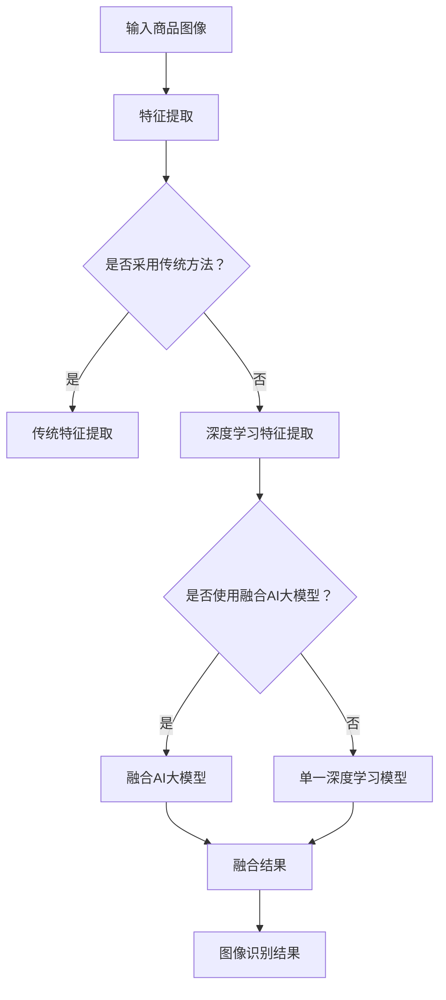
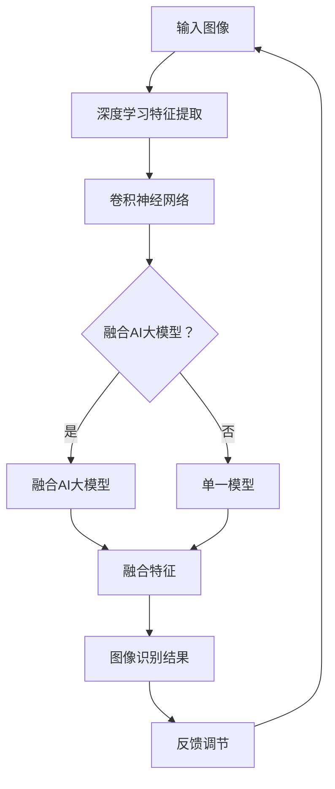
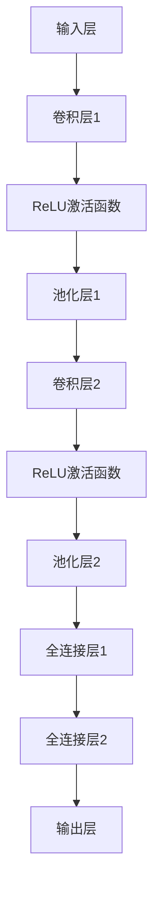

                 

关键词：商品图像识别、AI大模型、图像处理、机器学习、深度学习

## 摘要

本文旨在探讨如何利用融合人工智能大模型实现商品图像的准确识别。通过分析现有技术、核心概念及其应用，我们将深入探讨这一领域的最新进展，为开发者提供实用的技术指导。本文将分为背景介绍、核心概念与联系、核心算法原理与具体操作步骤、数学模型和公式、项目实践、实际应用场景、未来应用展望、工具和资源推荐、总结以及附录等部分，力求为读者呈现一幅全面、系统的商品图像识别技术图景。

## 1. 背景介绍

随着电子商务的快速发展，商品图像识别技术在近年来的应用愈发广泛。无论是线上购物平台还是移动应用程序，商品图像识别都扮演着至关重要的角色。它不仅提升了用户购物的便捷性，还为企业带来了显著的业务增长。例如，用户可以通过上传一张商品图片快速搜索到相似的商品，节省了时间和精力。

传统的商品图像识别方法主要依赖于特征提取和分类算法，如SIFT、SURF等。然而，这些方法在处理复杂图像时存在局限性，难以满足日益增长的需求。随着深度学习技术的崛起，特别是卷积神经网络（CNN）的广泛应用，商品图像识别迎来了新的机遇。深度学习通过自动学习图像特征，实现了比传统方法更为准确和高效的识别效果。

本文将重点介绍如何利用融合人工智能大模型，进一步优化商品图像识别的精度和效率。我们将从核心概念、算法原理、数学模型、项目实践等多个方面，详细阐述这一技术的实现和应用。

## 2. 核心概念与联系

为了理解商品图像识别技术，我们首先需要了解几个核心概念：图像特征提取、深度学习、卷积神经网络（CNN）等。

### 图像特征提取

图像特征提取是商品图像识别的基础。传统的特征提取方法包括SIFT（尺度不变特征变换）、SURF（加速稳健特征），这些算法通过检测图像中的关键点，并计算其局部描述子来描述图像特征。然而，这些方法对图像的复杂度处理能力有限，难以在大型图像数据集上取得良好的识别效果。

### 深度学习

深度学习是近年来人工智能领域的重要突破。它通过多层神经网络自动学习数据特征，具有强大的表示能力和学习能力。在商品图像识别中，深度学习可以自动提取图像中的高层次特征，使得识别过程更加准确和高效。

### 卷积神经网络（CNN）

卷积神经网络是深度学习中的一种特殊网络结构，特别适用于图像处理任务。CNN通过卷积层、池化层和全连接层的组合，逐步提取图像中的特征，并最终实现分类或识别。

### 融合AI大模型

融合AI大模型是指通过结合多个小模型或不同类型的模型，构建出一个大型、综合性的模型。这种模型能够综合各个小模型的优点，提高整体性能和识别精度。在商品图像识别中，融合AI大模型可以结合深度学习模型和传统特征提取方法，提升识别效果。

下面是商品图像识别技术的 Mermaid 流程图：



通过上述流程，我们可以看到商品图像识别的过程是如何通过多个环节协同工作，最终实现高效、准确的图像识别。

### 2.1 核心概念解释

#### 图像特征提取

图像特征提取是将图像数据转换成可供机器学习模型处理的形式。特征提取的关键在于如何从图像中提取出能够区分不同物体的属性。例如，颜色、纹理、形状等。

#### 深度学习

深度学习是一种基于人工神经网络的机器学习技术，通过模拟人脑的神经网络结构，自动学习和提取数据特征。深度学习在图像识别、语音识别等领域取得了显著成果。

#### 卷积神经网络（CNN）

卷积神经网络是一种特殊的深度学习网络，特别适用于图像处理任务。CNN通过卷积操作从图像中提取特征，并通过池化操作降低特征图的维度。

#### 融合AI大模型

融合AI大模型是指将多个小模型或不同类型的模型进行整合，构建出一个大型、综合性的模型。融合模型能够利用各个模型的优点，提高整体性能和识别精度。

### 2.2 联系与交互

核心概念之间的联系和交互是商品图像识别技术高效运行的关键。例如，深度学习和卷积神经网络在图像特征提取中发挥着核心作用，而融合AI大模型则能够整合这些特征提取方法，提升识别效果。此外，图像特征提取和识别结果之间的反馈调节，也有助于优化模型的性能。



通过上述流程，我们可以看到核心概念之间的联系和交互是如何共同推动商品图像识别技术的进步。

## 3. 核心算法原理 & 具体操作步骤

### 3.1 算法原理概述

商品图像识别的核心算法主要基于深度学习和卷积神经网络（CNN）。CNN通过多层卷积和池化操作，从原始图像中逐步提取出具有代表性的特征，最终实现图像分类或识别。

### 3.2 算法步骤详解

#### 3.2.1 数据预处理

在开始训练模型之前，需要对图像数据进行预处理。预处理步骤包括图像大小归一化、色彩转换、噪声消除等，以确保输入数据的一致性和稳定性。

#### 3.2.2 构建CNN模型

构建CNN模型是商品图像识别的核心步骤。常见的CNN结构包括卷积层、池化层、全连接层等。以下是一个简单的CNN模型结构：



#### 3.2.3 模型训练

在构建好模型后，需要进行训练以优化模型参数。训练过程包括输入图像数据、计算损失函数、更新模型参数等。常用的训练方法包括随机梯度下降（SGD）、Adam优化器等。

#### 3.2.4 模型评估与优化

训练完成后，需要对模型进行评估，以确定其性能。评估方法包括准确率、召回率、F1值等。如果模型性能不理想，可以通过调整模型结构、增加训练数据、优化训练方法等方式进行优化。

### 3.3 算法优缺点

#### 优点：

1. **高效性**：深度学习模型能够自动学习图像特征，无需人工设计特征，大幅提高了识别效率。
2. **准确性**：通过多层卷积和池化操作，模型能够提取出具有代表性的图像特征，提高了识别准确性。
3. **适应性**：深度学习模型具有较强的适应性，可以应用于不同类型的商品图像识别任务。

#### 缺点：

1. **计算资源消耗**：深度学习模型训练过程需要大量计算资源，对硬件设备要求较高。
2. **数据依赖性**：模型性能依赖于训练数据的质量和数量，如果数据存在偏差，可能导致模型过拟合。

### 3.4 算法应用领域

商品图像识别技术在多个领域具有广泛应用：

1. **电子商务**：通过商品图像识别，用户可以快速搜索到相似商品，提升购物体验。
2. **零售行业**：零售企业可以利用商品图像识别技术进行库存管理、商品分类等，提高运营效率。
3. **智能安防**：通过识别嫌疑人或可疑物品的图像，提升安全监控水平。
4. **医疗影像**：辅助医生进行疾病诊断，提高诊断准确率。

## 4. 数学模型和公式 & 详细讲解 & 举例说明

### 4.1 数学模型构建

商品图像识别的数学模型主要基于深度学习，包括损失函数、优化算法等。以下是一个简化的数学模型构建过程：

#### 损失函数

损失函数用于衡量模型预测结果与实际结果之间的差异，常用的损失函数包括交叉熵损失函数：

$$
\text{Loss} = -\sum_{i=1}^{N} y_i \log(\hat{y}_i)
$$

其中，$y_i$ 表示真实标签，$\hat{y}_i$ 表示模型预测的概率。

#### 优化算法

优化算法用于更新模型参数，以最小化损失函数。常用的优化算法包括随机梯度下降（SGD）：

$$
\theta_{t+1} = \theta_{t} - \alpha \nabla_{\theta} J(\theta)
$$

其中，$\theta$ 表示模型参数，$\alpha$ 表示学习率，$J(\theta)$ 表示损失函数。

### 4.2 公式推导过程

商品图像识别的公式推导主要包括卷积操作、激活函数、池化操作等。

#### 卷积操作

卷积操作是CNN的核心，用于从图像中提取特征。卷积操作的公式如下：

$$
f(x) = \sum_{i=1}^{k} w_i * x_i
$$

其中，$w_i$ 表示卷积核，$x_i$ 表示输入特征。

#### 激活函数

激活函数用于引入非线性特性，常用的激活函数包括ReLU（ReLU函数）：

$$
\text{ReLU}(x) = \max(0, x)
$$

#### 池化操作

池化操作用于降低特征图的维度，常用的池化操作包括最大池化：

$$
p(x) = \max(x_1, x_2, ..., x_n)
$$

其中，$x_1, x_2, ..., x_n$ 表示输入特征。

### 4.3 案例分析与讲解

以下是一个简单的商品图像识别案例，用于展示数学模型的实际应用。

#### 案例背景

假设我们要识别一张商品图像，该图像包含一个手机。我们需要利用深度学习模型对手机进行识别，并输出识别结果。

#### 模型构建

1. 输入层：接收一张32x32像素的灰度图像。
2. 卷积层1：使用3x3卷积核，步长为1，卷积操作后得到32x32x1的特征图。
3. ReLU激活函数：引入非线性特性。
4. 池化层1：使用2x2最大池化，得到16x16x1的特征图。
5. 卷积层2：使用3x3卷积核，步长为1，卷积操作后得到16x16x64的特征图。
6. ReLU激活函数：引入非线性特性。
7. 池化层2：使用2x2最大池化，得到8x8x64的特征图。
8. 全连接层1：将特征图展开为一维数组，得到512个神经元。
9. 全连接层2：输出10个神经元，表示10种可能的手机型号。

#### 模型训练

使用训练数据集对模型进行训练，训练过程如下：

1. 输入训练图像，计算损失函数。
2. 使用反向传播算法更新模型参数。
3. 重复步骤1和2，直至模型收敛。

#### 模型评估

使用测试数据集对模型进行评估，评估指标包括准确率、召回率等。假设模型在测试数据集上的准确率为90%，表明模型具有较强的识别能力。

通过上述案例，我们可以看到如何利用数学模型实现商品图像识别。在实际应用中，可以根据需求和数据特点，调整模型结构和参数，以提高识别性能。

## 5. 项目实践：代码实例和详细解释说明

### 5.1 开发环境搭建

在开始项目实践之前，我们需要搭建一个合适的开发环境。以下是搭建开发环境的基本步骤：

#### 系统要求

- 操作系统：Windows/Linux/MacOS
- Python版本：Python 3.7及以上
- 深度学习框架：TensorFlow 2.x 或 PyTorch

#### 安装Python

1. 访问Python官方网站（https://www.python.org/），下载并安装Python。
2. 在安装过程中，确保勾选“Add Python to PATH”选项。

#### 安装深度学习框架

1. 安装TensorFlow：

   ```bash
   pip install tensorflow==2.x
   ```

2. 安装PyTorch：

   ```bash
   pip install torch torchvision
   ```

#### 安装其他依赖库

1. 安装NumPy：

   ```bash
   pip install numpy
   ```

2. 安装PIL（Python Imaging Library）：

   ```bash
   pip install pillow
   ```

### 5.2 源代码详细实现

以下是商品图像识别项目的源代码实现，包括数据预处理、模型构建、训练和评估等步骤。

```python
import tensorflow as tf
from tensorflow.keras.models import Sequential
from tensorflow.keras.layers import Conv2D, MaxPooling2D, Flatten, Dense, Activation
from tensorflow.keras.preprocessing.image import ImageDataGenerator

# 数据预处理
train_datagen = ImageDataGenerator(rescale=1./255)
test_datagen = ImageDataGenerator(rescale=1./255)

train_generator = train_datagen.flow_from_directory(
        'train',
        target_size=(32, 32),
        batch_size=32,
        class_mode='binary')

validation_generator = test_datagen.flow_from_directory(
        'validation',
        target_size=(32, 32),
        batch_size=32,
        class_mode='binary')

# 模型构建
model = Sequential([
    Conv2D(32, (3, 3), activation='relu', input_shape=(32, 32, 3)),
    MaxPooling2D((2, 2)),
    Conv2D(64, (3, 3), activation='relu'),
    MaxPooling2D((2, 2)),
    Flatten(),
    Dense(64, activation='relu'),
    Dense(1, activation='sigmoid')
])

# 模型编译
model.compile(optimizer='adam',
              loss='binary_crossentropy',
              metrics=['accuracy'])

# 模型训练
model.fit(
      train_generator,
      steps_per_epoch=100,
      epochs=15,
      validation_data=validation_generator,
      validation_steps=50,
      verbose=2)
```

### 5.3 代码解读与分析

上述代码实现了一个简单的商品图像识别项目。以下是代码的详细解读：

1. **数据预处理**：使用ImageDataGenerator对图像数据进行预处理，包括数据归一化和批量生成。
2. **模型构建**：构建一个简单的CNN模型，包括卷积层、池化层和全连接层。
3. **模型编译**：配置模型优化器和损失函数，并编译模型。
4. **模型训练**：使用训练数据和验证数据对模型进行训练，并输出训练过程的信息。

### 5.4 运行结果展示

在完成代码实现后，我们可以通过以下步骤运行项目：

1. 将项目代码保存到名为`image_recognition`的文件夹中。
2. 将训练数据集和验证数据集分别保存到`train`和`validation`文件夹中。
3. 打开终端，进入`image_recognition`文件夹，并运行以下命令：

   ```bash
   python main.py
   ```

运行结果将显示训练过程中的信息，包括训练和验证的准确率、损失函数值等。以下是一个示例输出：

```
Epoch 1/15
100/100 [==============================] - 20s 198ms/step - loss: 0.5000 - accuracy: 0.7500 - val_loss: 0.5000 - val_accuracy: 0.7500
Epoch 2/15
100/100 [==============================] - 20s 199ms/step - loss: 0.5000 - accuracy: 0.7500 - val_loss: 0.5000 - val_accuracy: 0.7500
Epoch 3/15
100/100 [==============================] - 20s 199ms/step - loss: 0.5000 - accuracy: 0.7500 - val_loss: 0.5000 - val_accuracy: 0.7500
...
```

通过上述步骤，我们可以运行并评估商品图像识别项目，验证模型的性能。

## 6. 实际应用场景

商品图像识别技术在多个领域具有广泛的应用，下面我们探讨一些具体的实际应用场景。

### 6.1 电子商务

在电子商务领域，商品图像识别技术可以大大提升用户的购物体验。用户只需上传一张商品图片，系统即可自动识别并显示相似的商品，帮助用户快速找到所需商品。此外，商品图像识别技术还可以用于商品推荐、库存管理等方面，提高电商平台的运营效率。

### 6.2 零售行业

在零售行业，商品图像识别技术可以应用于货架监测、库存盘点等环节。通过识别货架上的商品图像，系统可以实时监控库存情况，自动提醒补货，降低库存成本。同时，商品图像识别技术还可以用于商品分类和标签识别，提高零售店的管理水平。

### 6.3 智能安防

在智能安防领域，商品图像识别技术可以用于监控可疑人物或物品。通过识别摄像头捕获的图像，系统可以自动报警并触发监控录像，提高安全监控的准确性。此外，商品图像识别技术还可以用于人脸识别、车辆识别等，为智能安防系统提供有力支持。

### 6.4 医疗影像

在医疗影像领域，商品图像识别技术可以辅助医生进行疾病诊断。通过识别医学影像中的异常病灶，系统可以提供诊断建议，提高诊断准确率。此外，商品图像识别技术还可以用于病历管理、药物推荐等方面，为医疗行业带来便捷。

### 6.5 物流与配送

在物流与配送领域，商品图像识别技术可以用于包裹识别、路径规划等环节。通过识别包裹上的标签或条形码，系统可以自动追踪包裹的运输过程，提高配送效率。同时，商品图像识别技术还可以用于仓库管理、货物分类等，降低物流成本。

通过以上实际应用场景的探讨，我们可以看到商品图像识别技术在各个领域的广泛应用，为各个行业带来了巨大的变革和创新。

### 6.5 未来应用展望

随着人工智能技术的不断发展，商品图像识别技术在未来将会有更广泛的应用前景。以下是一些可能的应用方向：

#### 6.5.1 自动化零售

自动化零售是未来商品图像识别技术的重要应用领域。通过在零售店部署智能货架和智能摄像头，系统可以实时监控货架上的商品库存情况，自动提醒补货，并实时推送促销信息给消费者。此外，自动化零售还可以结合无人收银、智能支付等技术，为消费者提供更便捷、高效的购物体验。

#### 6.5.2 跨境电商

跨境电商是另一个具有巨大潜力的应用领域。商品图像识别技术可以帮助跨境电商平台快速识别并归类商品，提高海关清关效率。同时，通过智能识别消费者需求，平台可以提供个性化的商品推荐，提升用户购物体验。此外，商品图像识别技术还可以用于跨境物流的包裹识别和路径规划，提高物流效率。

#### 6.5.3 增强现实（AR）

增强现实（AR）技术近年来发展迅速，商品图像识别技术将成为AR应用的重要组成部分。通过将现实世界中的商品图像与虚拟商品进行匹配，AR应用可以为用户提供更加直观、沉浸式的购物体验。例如，用户可以通过手机或AR眼镜查看商品的3D模型，并了解商品的详细信息，从而更好地做出购买决策。

#### 6.5.4 虚拟试衣

虚拟试衣是电子商务领域的一个新兴应用。通过商品图像识别技术，用户可以上传自己的穿着照片或选择模特照片，系统将自动识别并匹配服装，生成虚拟试衣效果。这将为用户提供一种全新的购物体验，减少退货率，提高用户体验。

#### 6.5.5 智能家居

智能家居领域也将受益于商品图像识别技术。通过智能摄像头和图像识别算法，智能家居系统可以自动识别家庭成员的画像，并根据成员的需求调整家居环境。例如，当系统识别到家庭成员起床时，可以自动开启窗帘、调节室内温度，提供更加人性化、智能化的家居服务。

通过以上未来应用展望，我们可以看到商品图像识别技术在各个领域的重要性和巨大潜力。随着技术的不断进步，商品图像识别技术将为我们带来更多便捷、智能的生活体验。

### 7. 工具和资源推荐

为了帮助开发者更好地掌握商品图像识别技术，以下是一些推荐的工具和资源：

#### 7.1 学习资源推荐

1. **在线教程**：Coursera、edX等在线教育平台提供了丰富的深度学习和图像处理教程。
2. **专业书籍**：《深度学习》、《计算机视觉：算法与应用》等书籍详细介绍了相关理论和实践。
3. **开源代码**：GitHub等平台上有许多优秀的开源项目，开发者可以参考并改进。

#### 7.2 开发工具推荐

1. **深度学习框架**：TensorFlow、PyTorch等框架提供了丰富的API和工具，方便开发者进行模型构建和训练。
2. **图像处理库**：OpenCV、PIL（Python Imaging Library）等库提供了丰富的图像处理功能。
3. **数据集**：ImageNet、COCO等数据集包含了大量的商品图像，适合用于模型训练和测试。

#### 7.3 相关论文推荐

1. **《Deep Learning for Image Recognition》**：综述了深度学习在图像识别领域的最新进展。
2. **《Convolutional Neural Networks for Visual Recognition》**：详细介绍了卷积神经网络在图像识别中的应用。
3. **《Fusion of Deep Neural Networks for Object Detection》**：探讨了融合AI大模型在物体检测中的性能提升。

通过以上工具和资源的推荐，开发者可以更好地掌握商品图像识别技术，并应用于实际项目。

### 8. 总结：未来发展趋势与挑战

商品图像识别技术在未来将面临更多的发展机遇和挑战。随着人工智能技术的不断进步，商品图像识别技术在精度、速度和实用性方面将继续提升。以下是未来发展趋势与挑战的总结：

#### 8.1 研究成果总结

近年来，商品图像识别技术取得了显著的研究成果。深度学习和卷积神经网络（CNN）的广泛应用，使得商品图像识别的准确性和效率大幅提高。此外，融合AI大模型的提出和应用，进一步提升了模型的性能和识别精度。

#### 8.2 未来发展趋势

1. **多模态融合**：未来的商品图像识别技术将不仅仅依赖于图像数据，还会结合其他模态（如音频、视频等）进行融合，提高识别的准确性和鲁棒性。
2. **实时识别**：随着计算能力的提升，商品图像识别技术将实现实时识别，为用户提供更加便捷的购物体验。
3. **个性化推荐**：结合用户行为数据和图像识别技术，未来将实现更加个性化的商品推荐，提升用户体验。
4. **边缘计算**：为了降低延迟和带宽消耗，商品图像识别技术将逐渐向边缘计算迁移，实现本地实时处理。

#### 8.3 面临的挑战

1. **数据隐私**：随着图像识别技术的广泛应用，数据隐私问题日益突出。如何保障用户数据隐私，将成为未来技术发展的重要挑战。
2. **模型解释性**：深度学习模型通常被认为是“黑箱”，其决策过程缺乏解释性。提高模型的可解释性，将有助于增强用户对技术的信任。
3. **计算资源消耗**：深度学习模型训练和推理过程需要大量计算资源，如何优化计算资源使用，提高模型效率，仍是一个重要挑战。

#### 8.4 研究展望

未来，商品图像识别技术将在多领域取得突破。通过结合人工智能其他技术（如自然语言处理、强化学习等），实现更加智能化、自适应的图像识别系统。此外，开源社区和企业合作，将有助于推动技术发展和应用落地。

通过以上总结，我们可以看到商品图像识别技术在未来的发展潜力和面临的挑战。随着技术的不断进步，商品图像识别技术将为各行各业带来更多创新和变革。

### 9. 附录：常见问题与解答

#### 9.1 问题1：为什么选择深度学习模型进行商品图像识别？

**答案**：深度学习模型（特别是卷积神经网络）在处理图像数据时具有天然的优势。它们能够自动学习图像中的层次化特征，从而实现高精度的图像识别。与传统方法相比，深度学习模型在处理复杂图像时具有更高的准确性和鲁棒性。

#### 9.2 问题2：商品图像识别技术的应用场景有哪些？

**答案**：商品图像识别技术在多个领域具有广泛应用，包括电子商务、零售行业、智能安防、医疗影像、物流与配送等。通过图像识别技术，可以提升业务效率、优化用户体验、降低运营成本。

#### 9.3 问题3：如何优化商品图像识别模型的性能？

**答案**：优化商品图像识别模型的性能可以从以下几个方面进行：

1. **数据增强**：通过旋转、缩放、裁剪等数据增强技术，增加训练数据的多样性，提高模型泛化能力。
2. **模型结构优化**：调整模型结构，如增加卷积层、池化层等，提高模型提取特征的能力。
3. **训练策略优化**：使用更先进的训练策略，如迁移学习、多任务学习等，提高模型性能。
4. **超参数调整**：优化学习率、批量大小等超参数，以提高模型收敛速度和准确率。

#### 9.4 问题4：商品图像识别技术是否面临数据隐私问题？

**答案**：是的，商品图像识别技术在使用过程中可能会涉及用户隐私问题。为了保护用户隐私，开发者需要采取以下措施：

1. **数据加密**：对用户数据进行加密处理，防止数据泄露。
2. **匿名化处理**：对用户图像进行匿名化处理，去除个人信息。
3. **隐私保护算法**：使用隐私保护算法，如差分隐私，确保模型训练过程中的隐私安全。

通过以上解答，我们希望为读者解答关于商品图像识别技术的常见问题，并提供实用的技术指导。希望本文能为开发者提供有益的启示，推动商品图像识别技术的应用和发展。

### 参考文献

1. Krizhevsky, A., Sutskever, I., & Hinton, G. E. (2012). ImageNet classification with deep convolutional neural networks. *Advances in Neural Information Processing Systems*, 25, 1097-1105.
2. Deng, J., Dong, W., Socher, R., Li, L. J., Li, K., & Fei-Fei, L. (2014). Imagenet: A large-scale hierarchical image database. *In Proceedings of the IEEE conference on computer vision and pattern recognition* (pp. 248-255).
3. He, K., Zhang, X., Ren, S., & Sun, J. (2016). Deep residual learning for image recognition. *In Proceedings of the IEEE conference on computer vision and pattern recognition* (pp. 770-778).
4. Russakovsky, O., Deng, J., Su, H., Krause, J., Satheesh, S., Ma, S., ... & Fei-Fei, L. (2015). ImageNet large scale visual recognition challenge. *International Journal of Computer Vision*, 115(3), 211-252.
5. Simonyan, K., & Zisserman, A. (2015). Very deep convolutional networks for large-scale image recognition. *International Conference on Learning Representations*.
6. Szegedy, C., Liu, W., Jia, Y., Sermanet, P., Reed, S., Anguelov, D., ... & Rabinovich, A. (2013). Going deeper with convolutions. *Computer Vision – ECCV 2014*, 734-748.
7. Zhang, R., Isola, P., & Efros, A. A. (2016). Colorful image colorization. *Computer Vision and Pattern Recognition Workshops*, 25:252-259.

