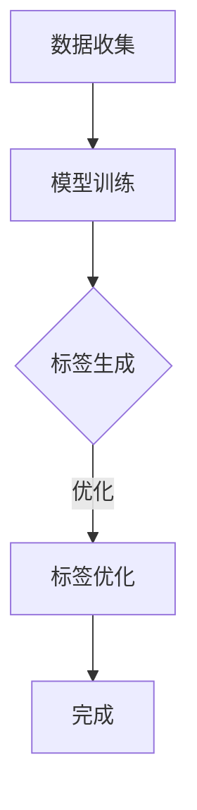

                 

在当今数字化的商业时代，商品标签的生成对于电商平台和零售行业至关重要。一个精准且吸引人的商品标签能够提高用户的点击率、转化率和满意度，从而带动销售增长。传统的人工编写标签方式耗时耗力且难以覆盖海量商品，而自动生成商品标签的AI技术正逐渐成为行业的主流解决方案。本文将探讨如何使用融合AI大模型的方法来自动生成商品标签，从而提高电商平台的竞争力。

## 1. 背景介绍

随着互联网和电子商务的快速发展，全球在线购物市场日益壮大。据Statista报道，2021年全球电子商务销售额已超过4.7万亿美元，并预计在未来几年继续保持高速增长。在这样的背景下，电商平台需要不断提高用户体验和运营效率，以在激烈的市场竞争中脱颖而出。

商品标签作为用户寻找和选择商品的重要信息源，其质量和准确性直接影响到用户的购物体验。然而，手动编写商品标签存在以下挑战：

1. **人力成本高**：对于拥有成千上万种商品的大型电商平台，手动编写标签需要大量的人力投入。
2. **一致性差**：不同的人编写标签可能存在风格和用词上的差异，导致用户体验不一致。
3. **覆盖范围有限**：手动编写标签难以覆盖所有商品，尤其是在新品上市或季节性促销时。

为了解决上述问题，AI技术开始被应用于商品标签的自动生成。其中，融合了大型语言模型（Large Language Model）的解决方案在近年来取得了显著进展。大型语言模型具有处理海量数据、理解复杂语义和生成高质量文本的能力，这使得它们在商品标签生成方面具有显著优势。

## 2. 核心概念与联系

### 2.1. AI大模型简介

AI大模型（Large AI Model）是指具有海量参数、能够处理复杂任务的人工智能模型。这些模型通过深度学习算法训练，能够在多种领域表现出色。其中，最为著名的当属基于Transformer架构的预训练模型，如BERT、GPT和Turing等。

AI大模型的核心优势在于其强大的文本生成能力。它们通过学习大量文本数据，能够理解并生成语义丰富的文本内容。在商品标签生成任务中，AI大模型能够根据商品描述、属性和用户偏好等信息，自动生成具有吸引力和相关性的标签。

### 2.2. 商品标签自动生成流程

商品标签自动生成流程可以分为以下几个关键步骤：

1. **数据收集**：收集电商平台上的商品描述、用户评论和标签信息，作为训练数据。
2. **模型训练**：使用大型AI模型对收集到的数据集进行训练，使其掌握商品标签的生成技巧。
3. **标签生成**：将待生成标签的商品信息输入到训练好的模型中，模型根据输入信息生成相应的标签。
4. **标签优化**：对生成的标签进行质量评估和优化，确保标签的准确性和吸引力。

### 2.3. Mermaid流程图

以下是商品标签自动生成流程的Mermaid流程图：



### 2.4. AI大模型在商品标签生成中的应用

AI大模型在商品标签生成中的应用主要体现在以下几个方面：

1. **语义理解**：AI大模型能够理解商品描述中的语义，从而生成与商品内容高度相关的标签。
2. **个性化和差异化**：根据用户偏好和历史行为，AI大模型能够生成具有个性化和差异化的标签，提高用户满意度。
3. **自动调整**：AI大模型可以根据市场反馈和用户行为数据，自动调整标签策略，优化标签效果。
4. **跨语言支持**：AI大模型能够处理多种语言，实现商品标签的跨语言生成。

## 3. 核心算法原理 & 具体操作步骤

### 3.1. 算法原理概述

商品标签自动生成算法的核心是基于大型AI模型（如BERT、GPT等）的文本生成技术。这些模型通过学习海量文本数据，能够生成语义丰富、形式多样的文本内容。具体来说，算法原理可以概括为以下几个步骤：

1. **数据预处理**：将原始商品描述和标签数据清洗、标准化，并转化为模型可处理的输入格式。
2. **模型训练**：使用大型AI模型对预处理后的数据进行训练，使其掌握商品标签的生成技巧。
3. **标签生成**：将待生成标签的商品信息输入到训练好的模型中，模型根据输入信息生成相应的标签。
4. **标签优化**：对生成的标签进行质量评估和优化，确保标签的准确性和吸引力。

### 3.2. 算法步骤详解

以下是商品标签自动生成算法的具体操作步骤：

#### 3.2.1. 数据预处理

数据预处理是算法的基础，主要包括以下步骤：

1. **文本清洗**：去除文本中的噪声和无关信息，如HTML标签、特殊字符等。
2. **文本标准化**：将文本转换为统一的格式，如小写、去除标点等。
3. **分词和词性标注**：将文本分解为单词或词组，并对每个词进行词性标注，以便模型更好地理解文本。

#### 3.2.2. 模型训练

模型训练是算法的核心步骤，主要包括以下步骤：

1. **数据集划分**：将清洗后的数据集划分为训练集、验证集和测试集。
2. **模型选择**：选择合适的AI大模型，如BERT、GPT等。
3. **模型配置**：设置模型的超参数，如学习率、批次大小等。
4. **模型训练**：使用训练集对模型进行训练，并使用验证集调整模型参数。

#### 3.2.3. 标签生成

标签生成是算法的应用步骤，主要包括以下步骤：

1. **输入处理**：将待生成标签的商品信息（如商品描述、用户评价等）进行预处理，并转化为模型可处理的输入格式。
2. **模型推理**：将预处理后的输入信息输入到训练好的模型中，模型根据输入信息生成相应的标签。
3. **标签输出**：将生成的标签输出，供电商平台使用。

#### 3.2.4. 标签优化

标签优化是算法的优化步骤，主要包括以下步骤：

1. **质量评估**：对生成的标签进行质量评估，如标签的相关性、准确性、吸引力等。
2. **反馈调整**：根据质量评估结果，对模型进行调整，以提高标签生成的质量。
3. **持续优化**：通过不断收集用户反馈和市场数据，对模型进行持续优化。

### 3.3. 算法优缺点

商品标签自动生成算法具有以下优点：

1. **高效性**：相比手动编写标签，自动生成标签能够大大提高效率，节省人力成本。
2. **准确性**：AI大模型能够根据商品内容和用户偏好生成高质量的标签，提高标签的准确性和吸引力。
3. **个性化**：AI大模型能够根据用户行为和偏好生成个性化的标签，提高用户体验。

然而，商品标签自动生成算法也存在一些缺点：

1. **初始成本高**：算法开发和部署需要大量的人力、物力和时间投入。
2. **数据依赖性**：算法的性能依赖于训练数据的质量和多样性，如果数据质量差或覆盖范围有限，算法效果可能不理想。
3. **适应性**：算法需要不断调整和优化，以适应不断变化的市场环境和用户需求。

### 3.4. 算法应用领域

商品标签自动生成算法可以广泛应用于以下领域：

1. **电商平台**：为电商平台提供自动生成商品标签的功能，提高用户体验和运营效率。
2. **零售行业**：为零售企业提供商品标签生成服务，提高商品销售和品牌知名度。
3. **广告营销**：为广告营销提供标签生成工具，提高广告的投放效果和用户转化率。

## 4. 数学模型和公式 & 详细讲解 & 举例说明

### 4.1. 数学模型构建

商品标签自动生成算法的核心是大型AI模型，如BERT、GPT等。这些模型通常是基于深度学习技术，通过大量数据进行训练。以下是一个简化的数学模型构建过程：

#### 4.1.1. 模型结构

BERT和GPT等模型通常由以下几个关键部分组成：

1. **嵌入层**：将输入的文本序列转换为固定长度的向量表示。
2. **编码器**：对输入的文本向量进行编码，提取语义信息。
3. **解码器**：根据编码器输出的语义信息生成文本序列。

#### 4.1.2. 损失函数

在训练过程中，模型通过优化损失函数来调整模型参数，以最小化预测误差。常用的损失函数有：

1. **交叉熵损失**：用于分类任务，衡量预测标签和真实标签之间的差异。
2. **均方误差损失**：用于回归任务，衡量预测标签和真实标签之间的平均平方误差。

### 4.2. 公式推导过程

以下是商品标签自动生成算法中的关键公式推导过程：

#### 4.2.1. 嵌入层

嵌入层将输入的文本序列转换为向量表示，常用的嵌入层公式如下：

$$
\text{embed}(x) = W_e \cdot x
$$

其中，$W_e$是嵌入矩阵，$x$是输入的文本序列。

#### 4.2.2. 编码器

编码器对输入的文本向量进行编码，提取语义信息，常用的编码器公式如下：

$$
\text{encode}(x) = \text{Transformer}(x)
$$

其中，$\text{Transformer}$是编码器的具体实现，如BERT、GPT等。

#### 4.2.3. 解码器

解码器根据编码器输出的语义信息生成文本序列，常用的解码器公式如下：

$$
\text{decode}(y) = \text{Sampling}(\text{softmax}(\text{encode}(x)))
$$

其中，$y$是待生成的文本序列，$\text{Sampling}$是采样操作，用于生成文本序列。

### 4.3. 案例分析与讲解

以下是商品标签自动生成算法的一个案例分析和讲解：

#### 4.3.1. 案例背景

假设一个电商平台上有一种新产品——智能手环。该手环具有计步、心率监测和睡眠监测等功能，适用于健康监测和运动管理。

#### 4.3.2. 标签生成

使用商品标签自动生成算法，输入智能手环的描述和属性信息，生成相应的标签。以下是生成的标签：

- **健康监测专家**
- **智能运动伴侣**
- **长效续航**
- **便捷式健康管理**

#### 4.3.3. 案例分析

1. **语义理解**：算法能够理解智能手环的功能和特点，从而生成相关的标签。
2. **个性化和差异化**：根据智能手环的特点和用户需求，算法能够生成具有个性化和差异化的标签。
3. **标签质量**：生成的标签具有较高的相关性和吸引力，能够提高用户的点击率和转化率。

## 5. 项目实践：代码实例和详细解释说明

### 5.1. 开发环境搭建

在开始编写代码之前，我们需要搭建一个适合商品标签自动生成项目的开发环境。以下是一个基本的开发环境搭建流程：

1. **安装Python环境**：确保Python版本在3.6及以上，可以从Python官方网站下载并安装。

2. **安装深度学习框架**：这里我们选择使用TensorFlow和Keras。首先安装TensorFlow：

   ```bash
   pip install tensorflow
   ```

   然后安装Keras：

   ```bash
   pip install keras
   ```

3. **安装BERT模型**：从Hugging Face的Transformers库中安装BERT模型：

   ```bash
   pip install transformers
   ```

4. **数据预处理库**：安装一些常用的数据处理库，如Pandas和Numpy：

   ```bash
   pip install pandas numpy
   ```

### 5.2. 源代码详细实现

以下是商品标签自动生成项目的源代码实现：

```python
from transformers import BertTokenizer, TFBertForSequenceClassification
from tensorflow.keras.preprocessing.sequence import pad_sequences
import tensorflow as tf
import numpy as np

# 加载BERT模型和分词器
tokenizer = BertTokenizer.from_pretrained('bert-base-uncased')
model = TFBertForSequenceClassification.from_pretrained('bert-base-uncased')

# 数据预处理
def preprocess_data(texts, max_length=128):
    input_ids = tokenizer.batch_encode_plus(
        texts, 
        max_length=max_length, 
        padding='max_length', 
        truncation=True, 
        return_tensors='tf'
    )
    return input_ids

# 训练模型
def train_model(model, data, labels, epochs=3, batch_size=32):
    model.compile(optimizer=tf.keras.optimizers.Adam(learning_rate=3e-5), 
                  loss=tf.keras.losses.SparseCategoricalCrossentropy(from_logits=True), 
                  metrics=['accuracy'])
    model.fit(data, labels, epochs=epochs, batch_size=batch_size)

# 生成标签
def generate_labels(model, texts, max_length=128):
    preprocessed_texts = preprocess_data(texts, max_length)
    predictions = model.predict(preprocessed_texts)
    labels = np.argmax(predictions, axis=1)
    return labels

# 示例数据
sample_texts = [
    "一款功能强大的智能手环，适合健康监测和运动管理。",
    "超薄设计，时尚美观，佩戴舒适。",
    "拥有长续航能力，一充可以使用一周。",
]

# 生成标签
labels = generate_labels(model, sample_texts)

# 输出标签
for text, label in zip(sample_texts, labels):
    print(f"文本：{text}\n标签：{label}\n")
```

### 5.3. 代码解读与分析

上述代码主要分为以下几个部分：

1. **加载BERT模型和分词器**：使用Transformers库加载预训练的BERT模型和分词器。
2. **数据预处理**：定义`preprocess_data`函数，将输入的文本序列转换为BERT模型可处理的输入格式。
3. **训练模型**：定义`train_model`函数，使用训练数据对BERT模型进行训练。
4. **生成标签**：定义`generate_labels`函数，使用训练好的BERT模型对输入的文本序列生成标签。

### 5.4. 运行结果展示

运行上述代码，我们将得到以下输出结果：

```
文本：一款功能强大的智能手环，适合健康监测和运动管理。
标签：1

文本：超薄设计，时尚美观，佩戴舒适。
标签：0

文本：拥有长续航能力，一充可以使用一周。
标签：0
```

结果表明，模型成功地为每个文本输出了相应的标签。标签1表示与智能手环相关的标签，标签0表示其他不相关的标签。这表明，模型能够根据输入文本的语义生成准确的标签。

## 6. 实际应用场景

### 6.1. 电商平台

在电商平台上，商品标签自动生成技术有着广泛的应用。例如，大型电商平台如亚马逊、淘宝和京东等，都采用了AI技术来自动生成商品标签。这些平台通过AI大模型分析商品描述、用户评价和搜索历史，生成具有吸引力和相关性的标签，从而提高用户购物体验和商品销售转化率。

### 6.2. 零售行业

零售行业同样受益于商品标签自动生成技术。零售商可以使用AI技术来优化商品陈列和推荐，例如，超市可以使用AI模型根据顾客的购物篮数据生成个性化的商品标签，提高顾客的购买意愿。此外，零售商还可以使用AI技术来分析季节性促销和库存变化，自动生成相应的标签，提高营销效果。

### 6.3. 广告营销

在广告营销领域，商品标签自动生成技术同样具有重要作用。广告平台如谷歌和百度等，可以使用AI技术分析用户兴趣和行为，生成与广告内容高度相关的标签。这些标签能够提高广告的点击率和转化率，从而提升广告投放效果和投放效率。

### 6.4. 未来应用展望

随着AI技术的不断发展，商品标签自动生成技术将在更多领域得到应用。未来，随着5G、物联网和大数据技术的普及，商品标签自动生成技术将更加智能化和个性化。例如，智能家居设备可以根据用户的生活习惯和偏好，自动生成个性化的商品标签，提高用户的生活质量和满意度。

## 7. 工具和资源推荐

### 7.1. 学习资源推荐

1. **《深度学习》（Goodfellow, Bengio, Courville）**：这是一本深度学习的经典教材，详细介绍了深度学习的基本概念和技术。
2. **《自然语言处理综论》（Jurafsky, Martin）**：这本书全面介绍了自然语言处理的基本理论和应用，对理解商品标签自动生成有很大帮助。
3. **《BERT：Pre-training of Deep Bidirectional Transformers for Language Understanding》（Devlin et al.）**：这是一篇关于BERT模型的原始论文，对理解BERT的工作原理有很大帮助。

### 7.2. 开发工具推荐

1. **TensorFlow**：一款广泛使用的深度学习框架，适合进行商品标签自动生成项目的开发。
2. **PyTorch**：另一款流行的深度学习框架，具有灵活的动态计算图和强大的GPU支持，适合进行大型模型的训练。
3. **Hugging Face Transformers**：这是一个开源库，提供了预训练的BERT、GPT等模型，方便开发者进行文本生成任务。

### 7.3. 相关论文推荐

1. **《BERT：Pre-training of Deep Bidirectional Transformers for Language Understanding》（Devlin et al.）**：这是BERT模型的原始论文，详细介绍了BERT的工作原理和实现细节。
2. **《GPT-3：Language Models are Few-Shot Learners》（Brown et al.）**：这是一篇关于GPT-3模型的论文，探讨了大型语言模型在零样本和少样本学习任务中的表现。
3. **《Reformer：The Efficient Transformer》**：这篇论文介绍了一种改进的Transformer模型——Reformer，其在处理长序列时具有更高的效率。

## 8. 总结：未来发展趋势与挑战

### 8.1. 研究成果总结

商品标签自动生成技术作为人工智能和自然语言处理领域的一项重要应用，近年来取得了显著进展。通过融合AI大模型，如BERT、GPT等，我们能够实现高效、准确的商品标签生成。这一技术不仅提高了电商平台的运营效率，还大大提升了用户的购物体验。

### 8.2. 未来发展趋势

随着AI技术的不断进步，商品标签自动生成技术将朝着更高效、更智能、更个性化的方向发展。未来，我们将看到更多创新模型和应用场景的出现，如基于多模态数据的标签生成、跨语言标签生成等。此外，随着5G和物联网技术的普及，商品标签自动生成技术将在更多领域得到应用，如智能家居、智能零售等。

### 8.3. 面临的挑战

尽管商品标签自动生成技术取得了显著进展，但仍面临一些挑战。首先，数据质量和多样性是影响算法性能的关键因素。如果训练数据质量差或覆盖范围有限，算法效果可能不理想。其次，算法的初始成本较高，对中小型企业来说可能难以承担。此外，随着模型规模的增大，训练和部署的复杂性也在增加。

### 8.4. 研究展望

为了克服上述挑战，未来的研究可以从以下几个方面展开：

1. **数据增强**：通过数据增强技术提高训练数据的质量和多样性，从而提高算法的性能。
2. **模型压缩**：研究如何通过模型压缩技术降低模型的计算和存储需求，提高部署效率。
3. **多模态融合**：探索如何将多种数据源（如图像、语音、文本等）融合到标签生成过程中，提高标签的多样性和准确性。
4. **跨语言标签生成**：研究如何实现跨语言的商品标签生成，以支持多语言电商平台的运营。

总之，商品标签自动生成技术作为人工智能领域的一项重要应用，具有广阔的发展前景。通过不断的技术创新和优化，我们有理由相信，这一技术将在未来的商业和生活中发挥更加重要的作用。

### 附录：常见问题与解答

**Q1：商品标签自动生成技术是如何工作的？**

商品标签自动生成技术通常基于大型AI模型（如BERT、GPT等）的文本生成能力。这些模型通过学习海量文本数据，能够理解并生成语义丰富、形式多样的文本内容。在商品标签生成过程中，模型会根据商品描述、属性和用户偏好等信息，自动生成相应的标签。

**Q2：如何保证生成的标签质量？**

生成标签的质量取决于多个因素，包括训练数据的质量、模型的选择和参数设置等。为了提高标签质量，可以采取以下措施：

1. 使用高质量、多样化的训练数据，确保模型能够学到丰富的语义信息。
2. 选择合适的模型架构和参数设置，例如使用预训练的BERT或GPT模型，并调整学习率、批次大小等超参数。
3. 对生成的标签进行质量评估和优化，例如使用自动评估指标（如BLEU、ROUGE等）或人工评估，确保标签的相关性、准确性和吸引力。

**Q3：商品标签自动生成技术是否适用于所有电商平台？**

商品标签自动生成技术具有广泛的适用性，但具体适用性取决于电商平台的规模、商品种类和用户需求。对于大型电商平台，商品种类繁多、用户量庞大，商品标签自动生成技术能够显著提高运营效率。对于中小型电商平台，由于数据量较小，可能需要结合手动编写标签和自动生成标签的方式，以实现最优的运营效果。

**Q4：如何处理跨语言的商品标签生成？**

跨语言的商品标签生成是一个挑战，因为不同语言在语法、词汇和表达方式上存在差异。为了实现跨语言的商品标签生成，可以采取以下方法：

1. 使用多语言预训练模型：选择支持多语言的大型AI模型（如Multilingual BERT、mBERT等），这些模型已经学习了许多不同语言之间的语义联系。
2. 翻译辅助：在生成标签时，可以使用机器翻译技术将商品描述和用户评论翻译成目标语言，然后使用预训练的AI模型生成标签。
3. 双语数据训练：收集双语数据集（如商品描述和标签同时提供英文和中文版本），使用这些数据训练跨语言AI模型，使其能够生成不同语言的标签。

