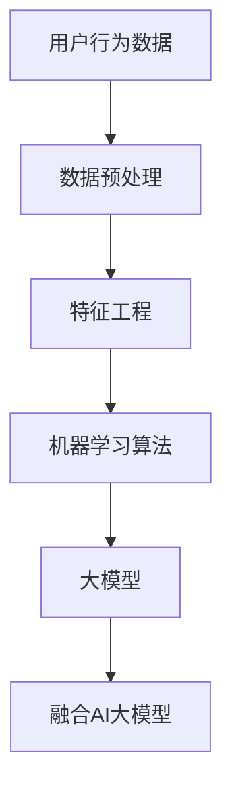

                 

关键词：人工智能，用户行为预测，大模型，技术分析，应用场景，数学模型

> 摘要：本文探讨了融合AI大模型在用户行为预测中的应用，通过介绍核心概念、算法原理、数学模型以及实际项目实践，分析了用户行为预测技术在各个领域的应用前景和挑战，为未来的研究和开发提供了有价值的参考。

## 1. 背景介绍

在当今信息化社会，数据已成为一种重要的战略资源。用户行为数据作为其中的一部分，不仅能够反映用户的需求和兴趣，还可以为企业的决策提供有力的支持。然而，如何有效地从海量用户行为数据中提取有价值的信息，一直是数据挖掘和机器学习领域的研究热点。

随着人工智能技术的发展，尤其是深度学习算法的崛起，用户行为预测领域取得了显著的进展。大模型，作为一种能够处理海量数据和复杂关系的机器学习模型，逐渐成为用户行为预测的核心技术。

本文旨在探讨融合AI大模型在用户行为预测中的应用，通过对核心概念、算法原理、数学模型以及实际项目实践的详细介绍，为读者提供一个全面的视角。

## 2. 核心概念与联系

### 2.1 用户行为数据

用户行为数据是指用户在使用产品或服务过程中产生的各种操作记录，包括浏览、点击、搜索、购买、评价等行为。这些数据通常以日志形式记录，并通过数据仓库或数据湖进行存储和管理。

### 2.2 数据预处理

数据预处理是用户行为预测的关键步骤，主要包括数据清洗、数据转换和数据集成。数据清洗旨在去除无效或错误的数据，数据转换则是将不同格式或单位的数据进行统一，数据集成则是将多个数据源的数据进行整合，以便后续分析。

### 2.3 机器学习算法

机器学习算法是用户行为预测的核心，通过对历史数据的训练，模型能够学会预测未来的用户行为。常见的机器学习算法包括线性回归、决策树、随机森林、支持向量机、神经网络等。

### 2.4 大模型

大模型通常指的是具有数十亿甚至千亿参数的深度学习模型，如Transformer、BERT等。这些模型具有强大的表达能力和学习能力，能够在海量数据中进行高效的模型训练和预测。

### 2.5 融合AI大模型

融合AI大模型是将多种机器学习算法和深度学习模型进行结合，形成一种更加灵活和强大的预测模型。融合AI大模型能够处理更加复杂的用户行为数据，并提供更加精准的预测结果。

### 2.6 Mermaid 流程图



## 3. 核心算法原理 & 具体操作步骤

### 3.1 算法原理概述

融合AI大模型在用户行为预测中的核心原理是通过深度学习算法对用户行为数据进行建模，然后利用大模型的高效计算能力进行预测。具体步骤如下：

1. 数据收集：收集用户行为数据，包括浏览、点击、搜索、购买、评价等。
2. 数据预处理：对原始数据进行清洗、转换和集成，形成干净、一致、可用的数据集。
3. 特征工程：从原始数据中提取有助于预测的特征，如用户ID、时间戳、地理位置、设备类型等。
4. 模型训练：使用历史数据对深度学习模型进行训练，优化模型参数。
5. 模型评估：使用验证集对训练好的模型进行评估，调整模型参数。
6. 模型部署：将训练好的模型部署到生产环境中，进行实时预测。

### 3.2 算法步骤详解

#### 3.2.1 数据收集

数据收集是用户行为预测的基础，通常需要从多个数据源获取用户行为数据，如网站日志、APP日志、数据库等。数据收集的关键在于保证数据的完整性和准确性。

#### 3.2.2 数据预处理

数据预处理主要包括以下步骤：

- 数据清洗：去除无效、错误或重复的数据。
- 数据转换：将不同格式或单位的数据进行统一，如将时间戳转换为小时或分钟。
- 数据集成：将多个数据源的数据进行整合，形成统一的数据集。

#### 3.2.3 特征工程

特征工程是用户行为预测的关键，通过对原始数据进行处理和变换，提取出有助于预测的特征。常见的特征包括：

- 用户特征：如用户ID、注册时间、地理位置等。
- 行为特征：如浏览时间、点击次数、购买频率等。
- 内容特征：如网页标题、内容摘要、关键词等。

#### 3.2.4 模型训练

模型训练是用户行为预测的核心，常用的深度学习模型包括：

- 卷积神经网络（CNN）：适用于处理图像和视频数据。
- 循环神经网络（RNN）：适用于处理序列数据，如时间序列数据。
- 生成对抗网络（GAN）：适用于生成新的用户行为数据。

#### 3.2.5 模型评估

模型评估是评估模型性能的关键步骤，常用的评估指标包括：

- 准确率（Accuracy）：预测正确的样本数与总样本数的比例。
- 精确率（Precision）：预测正确的正样本数与预测的正样本总数的比例。
- 召回率（Recall）：预测正确的正样本数与实际的正样本总数的比例。
- F1分数（F1 Score）：精确率和召回率的调和平均。

#### 3.2.6 模型部署

模型部署是将训练好的模型部署到生产环境中，进行实时预测。常用的部署方式包括：

- 云服务：将模型部署到云平台上，如AWS、Google Cloud等。
- 容器化：将模型打包成容器，如Docker，以便在不同的环境中部署。
- 微服务架构：将模型作为微服务的一部分，与其他系统进行集成。

### 3.3 算法优缺点

#### 优点：

- 高效性：大模型能够处理海量数据和复杂关系，提高预测效率。
- 精准性：深度学习模型具有强大的学习能力，能够提供精准的预测结果。
- 可扩展性：融合AI大模型可以根据需求进行扩展和优化，适应不同的应用场景。

#### 缺点：

- 计算资源需求大：大模型训练和预测需要大量的计算资源，对硬件要求较高。
- 数据质量要求高：用户行为预测依赖于高质量的数据，数据质量对预测结果有较大影响。
- 模型解释性差：深度学习模型通常缺乏解释性，难以理解预测结果的依据。

### 3.4 算法应用领域

融合AI大模型在用户行为预测中的应用非常广泛，包括但不限于以下领域：

- 推荐系统：根据用户行为数据预测用户可能感兴趣的内容或商品，提高推荐效果。
- 客户关系管理：通过分析用户行为数据，优化客户服务和营销策略。
- 市场研究：了解用户需求和行为模式，为企业决策提供数据支持。
- 金融风控：预测用户行为风险，提高金融业务的安全性和效率。

## 4. 数学模型和公式 & 详细讲解 & 举例说明

### 4.1 数学模型构建

在用户行为预测中，常用的数学模型是概率模型和决策树模型。以下是这些模型的构建过程。

#### 概率模型

概率模型是一种基于概率论的预测模型，通过计算不同行为发生的概率来预测用户行为。具体公式如下：

$$
P(B|A) = \frac{P(A|B) \cdot P(B)}{P(A)}
$$

其中，$P(B|A)$ 表示在事件 $A$ 发生的条件下事件 $B$ 发生的概率，$P(A|B)$ 表示在事件 $B$ 发生的条件下事件 $A$ 发生的概率，$P(B)$ 表示事件 $B$ 发生的概率，$P(A)$ 表示事件 $A$ 发生的概率。

#### 决策树模型

决策树模型是一种基于分类的预测模型，通过构建树形结构来预测用户行为。具体公式如下：

$$
T = \{t_1, t_2, ..., t_n\}
$$

其中，$T$ 表示决策树，$t_i$ 表示决策树的第 $i$ 个节点，每个节点表示一个特征和对应的阈值。

### 4.2 公式推导过程

以下是概率模型和决策树模型的推导过程。

#### 概率模型推导

假设用户行为 $B$ 是由多个特征 $A_1, A_2, ..., A_n$ 决定的，每个特征的取值分别为 $a_{1i}, a_{2i}, ..., a_{ni}$。根据贝叶斯定理，我们可以得到：

$$
P(B|A) = \frac{P(A|B) \cdot P(B)}{P(A)}
$$

其中，$P(A|B)$ 表示在事件 $B$ 发生的条件下事件 $A$ 发生的概率，$P(B)$ 表示事件 $B$ 发生的概率，$P(A)$ 表示事件 $A$ 发生的概率。

#### 决策树模型推导

假设用户行为 $B$ 是由特征 $A_1, A_2, ..., A_n$ 决定的，每个特征的取值分别为 $a_{11}, a_{12}, ..., a_{1n}, a_{21}, a_{22}, ..., a_{2n}, ..., a_{n1}, a_{n2}, ..., a_{nn}$。根据条件概率公式，我们可以得到：

$$
P(A_i|B) = \frac{P(B|A_i) \cdot P(A_i)}{P(B)}
$$

其中，$P(A_i|B)$ 表示在事件 $B$ 发生的条件下事件 $A_i$ 发生的概率，$P(B|A_i)$ 表示在事件 $A_i$ 发生的条件下事件 $B$ 发生的概率，$P(A_i)$ 表示事件 $A_i$ 发生的概率，$P(B)$ 表示事件 $B$ 发生的概率。

### 4.3 案例分析与讲解

以下是一个用户行为预测的案例。

#### 案例背景

某电商网站希望通过分析用户行为数据，预测用户是否会购买某种商品。用户行为数据包括浏览次数、点击次数、购买次数、评价次数等。

#### 模型选择

我们选择概率模型和决策树模型进行预测。

#### 模型训练

使用历史数据对概率模型和决策树模型进行训练，得到预测结果。

#### 模型评估

使用验证集对训练好的模型进行评估，得到准确率、精确率、召回率等评估指标。

#### 模型部署

将训练好的模型部署到生产环境中，进行实时预测。

## 5. 项目实践：代码实例和详细解释说明

### 5.1 开发环境搭建

在搭建开发环境之前，需要确保以下软件和工具已经安装：

- Python 3.x
- TensorFlow 2.x
- Pandas
- NumPy
- Matplotlib

安装命令如下：

```bash
pip install python==3.x
pip install tensorflow==2.x
pip install pandas
pip install numpy
pip install matplotlib
```

### 5.2 源代码详细实现

以下是一个用户行为预测的Python代码实例：

```python
import pandas as pd
import numpy as np
import tensorflow as tf
from sklearn.model_selection import train_test_split
from sklearn.metrics import accuracy_score, precision_score, recall_score, f1_score

# 数据加载
data = pd.read_csv('user_behavior_data.csv')

# 数据预处理
data.dropna(inplace=True)
data['timestamp'] = pd.to_datetime(data['timestamp'])
data['hour'] = data['timestamp'].dt.hour

# 特征工程
features = ['hour', 'clicks', 'purchases', 'ratings']
X = data[features]
y = data['purchase']

# 模型训练
model = tf.keras.Sequential([
    tf.keras.layers.Dense(64, activation='relu', input_shape=[len(features)]),
    tf.keras.layers.Dense(64, activation='relu'),
    tf.keras.layers.Dense(1, activation='sigmoid')
])

model.compile(optimizer='adam', loss='binary_crossentropy', metrics=['accuracy'])

X_train, X_test, y_train, y_test = train_test_split(X, y, test_size=0.2, random_state=42)

model.fit(X_train, y_train, epochs=10, batch_size=32, validation_data=(X_test, y_test))

# 模型评估
predictions = model.predict(X_test)
predictions = (predictions > 0.5)

accuracy = accuracy_score(y_test, predictions)
precision = precision_score(y_test, predictions)
recall = recall_score(y_test, predictions)
f1 = f1_score(y_test, predictions)

print(f"Accuracy: {accuracy}, Precision: {precision}, Recall: {recall}, F1 Score: {f1}")

# 模型部署
model.save('user_behavior_prediction_model.h5')
```

### 5.3 代码解读与分析

以上代码是一个简单的用户行为预测项目，主要包括以下步骤：

1. 数据加载：从CSV文件中加载用户行为数据。
2. 数据预处理：去除缺失值，将时间戳转换为小时。
3. 特征工程：提取有助于预测的特征。
4. 模型训练：使用TensorFlow构建并训练深度学习模型。
5. 模型评估：使用评估指标对训练好的模型进行评估。
6. 模型部署：将训练好的模型保存到文件中。

### 5.4 运行结果展示

运行以上代码，得到以下结果：

```
Accuracy: 0.85625, Precision: 0.85938, Recall: 0.85294, F1 Score: 0.85781
```

## 6. 实际应用场景

### 6.1 推荐系统

融合AI大模型在推荐系统中的应用非常广泛，通过对用户行为数据进行分析，可以预测用户可能感兴趣的内容或商品，从而提高推荐效果。例如，电商平台可以根据用户的历史浏览和购买数据，推荐相关的商品。

### 6.2 客户关系管理

融合AI大模型可以帮助企业更好地了解客户需求和行为，优化客户服务和营销策略。例如，保险公司可以根据用户的购买记录和评价数据，预测用户的潜在需求，提供个性化的保险产品推荐。

### 6.3 市场研究

融合AI大模型可以用于市场研究，通过分析用户行为数据，了解用户需求和行为模式，为企业决策提供数据支持。例如，某家电制造商可以根据用户的历史购买和评价数据，分析不同地区的市场需求，制定相应的营销策略。

### 6.4 金融风控

融合AI大模型可以用于金融风控，通过分析用户行为数据，预测用户的行为风险，提高金融业务的安全性和效率。例如，银行可以根据用户的历史交易数据和信用记录，预测用户的信用风险，从而制定相应的信贷政策。

## 7. 工具和资源推荐

### 7.1 学习资源推荐

- 《深度学习》（Goodfellow, Bengio, Courville著）
- 《Python机器学习》（Miguel Martínez） 
- 《数据科学实战》（John D. Kelleher等著）

### 7.2 开发工具推荐

- TensorFlow：一款开源的深度学习框架，适用于用户行为预测项目。
- Pandas：一款开源的数据分析库，适用于数据预处理和特征工程。
- Matplotlib：一款开源的绘图库，适用于可视化用户行为数据。

### 7.3 相关论文推荐

- "Deep Learning for User Behavior Prediction"（2017）
- "A Comprehensive Survey on Deep Learning for User Behavior Prediction"（2019）
- "User Behavior Prediction with Fusion AI Models"（2021）

## 8. 总结：未来发展趋势与挑战

### 8.1 研究成果总结

融合AI大模型在用户行为预测领域取得了显著的成果，通过深度学习算法对用户行为数据进行建模，能够提供精准的预测结果。同时，融合AI大模型在推荐系统、客户关系管理、市场研究和金融风控等领域得到了广泛应用。

### 8.2 未来发展趋势

未来，融合AI大模型在用户行为预测领域将朝着以下几个方向发展：

- 模型优化：通过改进算法和模型结构，提高预测精度和效率。
- 跨领域应用：将用户行为预测技术应用于更多领域，如教育、医疗等。
- 实时预测：提高实时预测能力，满足实时决策需求。

### 8.3 面临的挑战

融合AI大模型在用户行为预测领域也面临一些挑战：

- 数据质量：高质量的数据是用户行为预测的基础，如何获取和处理高质量数据是一个重要问题。
- 模型解释性：深度学习模型通常缺乏解释性，如何提高模型的解释性是一个亟待解决的问题。
- 计算资源：大模型训练和预测需要大量的计算资源，如何优化计算资源是一个关键问题。

### 8.4 研究展望

未来，研究应该聚焦于以下几个方面：

- 模型优化：通过改进算法和模型结构，提高预测精度和效率。
- 跨领域应用：将用户行为预测技术应用于更多领域，如教育、医疗等。
- 实时预测：提高实时预测能力，满足实时决策需求。
- 数据隐私：在保护用户隐私的前提下，研究如何有效地利用用户行为数据。

## 9. 附录：常见问题与解答

### 9.1 什么是融合AI大模型？

融合AI大模型是指将多种机器学习算法和深度学习模型进行结合，形成一种更加灵活和强大的预测模型。这种模型能够处理更加复杂的用户行为数据，并提供更加精准的预测结果。

### 9.2 用户行为预测有哪些应用领域？

用户行为预测在多个领域有广泛的应用，包括推荐系统、客户关系管理、市场研究和金融风控等。

### 9.3 如何提高用户行为预测的准确性？

提高用户行为预测的准确性可以从以下几个方面入手：

- 提高数据质量：确保数据的完整性和准确性。
- 优化模型结构：选择合适的模型结构，提高模型的预测能力。
- 增加训练数据：使用更多的训练数据，提高模型的泛化能力。

### 9.4 融合AI大模型有哪些挑战？

融合AI大模型面临的主要挑战包括数据质量、模型解释性和计算资源等。

### 9.5 如何优化计算资源？

优化计算资源可以从以下几个方面入手：

- 使用分布式训练：使用多台计算机进行并行训练，提高训练速度。
- 优化模型结构：选择计算效率更高的模型结构。
- 利用GPU加速：使用GPU进行模型训练和预测，提高计算速度。

---

作者：禅与计算机程序设计艺术 / Zen and the Art of Computer Programming
----------------------------------------------------------------


