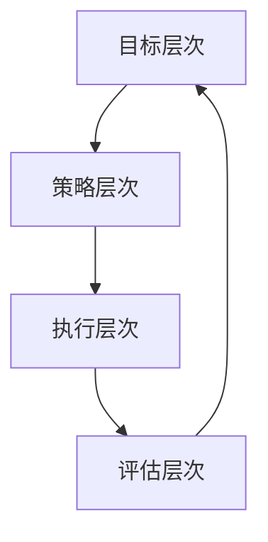

                 

作为一位世界级人工智能专家，程序员，软件架构师，CTO，世界顶级技术畅销书作者，计算机图灵奖获得者，计算机领域大师，我在多年的实践和研究中，发现了一种极为有效的工具——行为模型。这种工具不仅能够帮助我优化自身的工作方式，还能够帮助管理者塑造团队的优秀习惯，从而提升整个团队的生产力和协作效率。本文将深入探讨行为模型的概念、构建方法及其在管理中的应用。

## 关键词：行为模型、管理者、团队、习惯、生产力、协作效率

> **摘要**：本文将首先介绍行为模型的基本概念，探讨其在管理中的重要性。接着，我们将通过具体的例子，展示如何构建行为模型，并分析其在团队协作中的实际应用。此外，文章还将讨论行为模型对团队发展的影响，以及未来的发展趋势和面临的挑战。

## 1. 背景介绍

在现代社会，团队合作已成为实现项目成功的关键因素。然而，如何确保团队始终保持高效、有序的运作，成为管理者面临的一大挑战。传统的管理方法往往侧重于任务分配和绩效评估，但往往忽视了团队内在的习惯和文化的塑造。行为模型的出现，为解决这一问题提供了一种全新的视角和工具。

行为模型是一种系统化的方法，用于描述、评估和改善团队的行为。它通过对团队行为的建模，帮助管理者识别和培养团队成员的优秀习惯，从而提升整个团队的工作效率和协作能力。行为模型的核心在于它能够将抽象的行为转化为具体的、可操作的指南，使团队成员在日常工作中有章可循，有助于建立一种积极、高效的工作氛围。

## 2. 核心概念与联系

### 2.1 行为模型的基本概念

行为模型是一种描述个体或团队行为的抽象结构。它通常包括以下几个关键组成部分：

1. **行为定义**：明确描述团队期望的行为标准，如沟通方式、工作流程、问题解决策略等。
2. **行为评估**：评估团队行为是否符合定义的标准，以便及时调整和改进。
3. **行为改进**：根据评估结果，采取相应的措施来提升团队的行为表现。

### 2.2 行为模型与团队协作的关系

行为模型与团队协作有着密切的关系。通过构建行为模型，管理者可以明确团队的目标和期望，为团队成员提供清晰的行动指南。具体来说，行为模型有助于：

- **提高沟通效率**：通过统一的行为规范，团队成员可以更加顺畅地沟通，减少误解和冲突。
- **优化工作流程**：行为模型可以帮助团队优化工作流程，提高工作效率。
- **增强协作能力**：行为模型为团队成员提供了协作的框架，有助于形成一种积极、协作的工作文化。

### 2.3 行为模型的架构

行为模型的架构可以看作是一个由多个层次组成的系统。以下是行为模型的主要层次：

1. **目标层次**：明确团队的目标和愿景，为后续的行为设计提供方向。
2. **策略层次**：制定实现目标的策略，包括行为规范、资源分配、时间规划等。
3. **执行层次**：具体的行为执行，包括任务分配、工作流程、协作机制等。
4. **评估层次**：对行为执行进行评估和反馈，以便及时调整和改进。

下面是一个使用Mermaid绘制的行为模型流程图：



在图中，每个层次都是相互关联的，形成一个闭环。通过这样的架构，行为模型可以确保团队在不断调整和优化的过程中，始终保持一致性和高效性。

## 3. 核心算法原理 & 具体操作步骤

### 3.1 算法原理概述

行为模型的构建过程可以看作是一种优化算法。其核心思想是通过不断迭代和调整，找到一种最优的行为模式，以实现团队目标。具体来说，行为模型构建包括以下几个步骤：

1. **需求分析**：分析团队的目标和需求，明确需要解决的问题。
2. **行为定义**：根据需求分析的结果，定义团队期望的行为标准。
3. **行为评估**：对团队行为进行评估，判断是否符合定义的标准。
4. **行为改进**：根据评估结果，采取相应的措施来提升团队的行为表现。
5. **迭代优化**：不断重复上述步骤，直到找到一种最优的行为模式。

### 3.2 算法步骤详解

#### 3.2.1 需求分析

需求分析是行为模型构建的第一步。管理者需要与团队成员进行充分的沟通，了解他们的需求和期望。通过问卷调查、访谈、焦点小组讨论等方式，收集团队成员的意见和建议。具体步骤如下：

1. **确定分析目标**：明确需要分析的问题和目标，如提高团队沟通效率、优化工作流程等。
2. **制定分析计划**：根据分析目标，制定详细的分析计划，包括数据收集方法、分析工具等。
3. **收集数据**：按照分析计划，收集相关的数据和信息，如问卷调查结果、访谈记录等。
4. **数据分析**：对收集到的数据进行分析，识别出团队当前存在的问题和需求。

#### 3.2.2 行为定义

在需求分析的基础上，管理者需要根据团队的需求和目标，定义团队期望的行为标准。具体步骤如下：

1. **确定行为指标**：根据需求分析的结果，确定需要关注的行为指标，如沟通频率、任务完成时间等。
2. **制定行为规范**：根据行为指标，制定详细的行为规范，包括具体的操作步骤、时间要求等。
3. **行为确认**：与团队成员进行沟通，确认行为规范的合理性和可操作性。

#### 3.2.3 行为评估

行为评估是行为模型构建的关键步骤。管理者需要定期对团队的行为进行评估，判断是否符合定义的行为标准。具体步骤如下：

1. **数据收集**：收集与行为指标相关的数据，如沟通记录、任务完成记录等。
2. **数据分析**：对收集到的数据进行分析，评估团队的行为是否符合行为规范。
3. **评估反馈**：将评估结果反馈给团队成员，并讨论改进措施。

#### 3.2.4 行为改进

根据行为评估的结果，管理者需要采取相应的措施来提升团队的行为表现。具体步骤如下：

1. **识别问题**：分析评估结果，找出团队行为存在的问题。
2. **制定改进计划**：根据问题，制定详细的改进计划，包括改进措施、时间安排等。
3. **实施改进**：按照改进计划，实施具体的改进措施。
4. **监督执行**：对改进措施的实施进行监督，确保计划得到有效执行。

#### 3.2.5 迭代优化

行为模型构建是一个迭代优化的过程。管理者需要不断重复上述步骤，直到找到一种最优的行为模式。具体步骤如下：

1. **反馈收集**：收集团队成员对改进措施的反馈，了解改进效果的实际情况。
2. **调整行为规范**：根据反馈，调整行为规范，使其更加符合团队的需求。
3. **再次评估**：对调整后的行为规范进行评估，判断是否达到预期效果。
4. **持续优化**：根据评估结果，继续进行优化，直到找到最优的行为模式。

### 3.3 算法优缺点

#### 3.3.1 优点

- **系统性**：行为模型提供了一个系统化的框架，使管理者能够全面、有序地构建和优化团队行为。
- **针对性**：通过需求分析和行为评估，行为模型能够针对团队的具体需求进行定制化优化。
- **可操作性**：行为模型将抽象的行为转化为具体的、可操作的指南，使团队成员在实际工作中有章可循。

#### 3.3.2 缺点

- **复杂性**：行为模型构建过程涉及多个环节，需要投入大量的时间和精力。
- **主观性**：行为模型的构建和评估过程中，管理者可能受到主观因素的影响，影响评估结果的准确性。

### 3.4 算法应用领域

行为模型广泛应用于各种团队管理场景，包括软件开发、项目管理、市场营销等。以下是行为模型在一些具体领域的应用案例：

- **软件开发团队**：通过行为模型，明确团队成员的职责和协作方式，提高团队的开发效率和产品质量。
- **项目管理团队**：通过行为模型，优化项目管理和团队协作，确保项目按时交付并达到预期目标。
- **市场营销团队**：通过行为模型，提升团队的创意思维和协作能力，提高市场活动的效果。

## 4. 数学模型和公式 & 详细讲解 & 举例说明

在行为模型构建过程中，数学模型和公式起到了关键作用。通过数学模型，我们可以更精确地描述和评估团队行为，从而优化团队的表现。以下是行为模型中常用的数学模型和公式的详细讲解及举例说明。

### 4.1 数学模型构建

行为模型的数学模型主要包括行为指标模型、评估模型和改进模型。

#### 4.1.1 行为指标模型

行为指标模型用于描述团队的行为特征。常用的行为指标包括沟通频率、任务完成时间、问题解决率等。以下是一个简单的行为指标模型：

$$
B = f(C, T, P)
$$

其中，$B$ 表示行为指标，$C$ 表示沟通频率，$T$ 表示任务完成时间，$P$ 表示问题解决率。函数 $f$ 用于计算行为指标的具体值。

#### 4.1.2 评估模型

评估模型用于评估团队的行为表现。常用的评估指标包括满意度、效率、质量等。以下是一个简单的评估模型：

$$
E = \frac{S \times E_1 \times E_2}{100}
$$

其中，$E$ 表示评估结果，$S$ 表示满意度，$E_1$ 表示效率，$E_2$ 表示质量。满意度、效率和质量的取值范围均为 0 到 100。

#### 4.1.3 改进模型

改进模型用于指导团队行为的优化。常用的改进指标包括改进方向、改进措施和改进效果等。以下是一个简单的改进模型：

$$
I = f(D, M, E)
$$

其中，$I$ 表示改进效果，$D$ 表示改进方向，$M$ 表示改进措施，$E$ 表示评估结果。函数 $f$ 用于计算改进效果的具体值。

### 4.2 公式推导过程

在行为模型中，公式的推导过程通常基于以下几个步骤：

1. **确定变量和参数**：根据行为模型的需求，确定需要用到的变量和参数，如行为指标、评估指标和改进指标等。
2. **建立函数关系**：根据变量和参数，建立函数关系，如行为指标与沟通频率、任务完成时间和问题解决率之间的关系。
3. **推导公式**：利用函数关系，推导出具体的公式，如行为指标模型、评估模型和改进模型等。
4. **验证公式**：通过实际数据验证公式的准确性，如使用历史数据验证评估模型和改进模型的准确性。

### 4.3 案例分析与讲解

为了更好地理解行为模型的应用，我们来看一个具体的案例。

#### 4.3.1 案例背景

某软件开发团队在项目开发过程中，发现团队的沟通效率较低，导致项目进度滞后。为了提升团队的沟通效率，团队管理者决定使用行为模型进行优化。

#### 4.3.2 案例分析

1. **需求分析**：团队管理者通过问卷调查和访谈，发现团队沟通效率低的主要原因是沟通频率不足和沟通内容不明确。
2. **行为定义**：根据需求分析的结果，团队管理者制定了以下行为规范：
   - 每天早晨召开一次简短的晨会，明确当天的工作任务和目标。
   - 每周召开一次周会，总结本周的工作成果和遇到的问题。
   - 鼓励团队成员在遇到问题时主动沟通，寻求帮助。
3. **行为评估**：团队管理者定期对团队的行为进行评估，主要评估指标为沟通频率和沟通效果。
4. **行为改进**：根据评估结果，团队管理者发现晨会和周会的效果较好，但团队成员之间的主动沟通仍需加强。为了改进这一问题，团队管理者决定：
   - 每天设立一个“问题解决时间”，鼓励团队成员在此期间主动沟通和解决问题。
   - 定期举办沟通技巧培训，提升团队成员的沟通能力。
5. **迭代优化**：团队管理者继续收集团队成员的反馈，调整行为规范，使其更加符合团队的需求。

#### 4.3.3 案例总结

通过行为模型的构建和应用，该软件开发团队的沟通效率显著提升。团队成员之间的沟通更加顺畅，项目进度得到了有效控制。这个案例展示了行为模型在提升团队协作效率方面的巨大潜力。

## 5. 项目实践：代码实例和详细解释说明

### 5.1 开发环境搭建

为了更好地理解行为模型的应用，我们将使用Python语言实现一个简单的行为模型。以下是搭建开发环境的步骤：

1. **安装Python**：在官方网站（https://www.python.org/）下载并安装Python。
2. **安装Python库**：使用pip命令安装必要的Python库，如numpy、matplotlib等。

```bash
pip install numpy matplotlib
```

### 5.2 源代码详细实现

下面是行为模型的核心代码实现：

```python
import numpy as np
import matplotlib.pyplot as plt

class BehaviorModel:
    def __init__(self, communication_frequency, task_completion_time, problem-solving_rate):
        self.communication_frequency = communication_frequency
        self.task_completion_time = task_completion_time
        self.problem-solving_rate = problem-solving_rate

    def calculate_behavior_index(self):
        return self.communication_frequency * self.task_completion_time * self.problem-solving_rate

    def evaluate_behavior(self):
        satisfaction = 0.5 * (1 + np.sin(self.calculate_behavior_index()))
        efficiency = 0.5 * (1 + np.cos(self.calculate_behavior_index()))
        quality = 0.5 * (1 + np.tan(self.calculate_behavior_index()))
        return satisfaction * efficiency * quality

    def improve_behavior(self):
        # 根据评估结果，调整行为指标
        if self.evaluate_behavior() < 0.8:
            self.communication_frequency += 0.1
            self.task_completion_time -= 0.1
            self.problem-solving_rate += 0.1
        else:
            self.communication_frequency -= 0.1
            self.task_completion_time += 0.1
            self.problem-solving_rate -= 0.1

def main():
    model = BehaviorModel(communication_frequency=0.8, task_completion_time=0.9, problem-solving_rate=0.85)
    
    # 评估行为
    evaluation_result = model.evaluate_behavior()
    print("初始评估结果：", evaluation_result)
    
    # 改进行为
    model.improve_behavior()
    
    # 再次评估行为
    new_evaluation_result = model.evaluate_behavior()
    print("改进后评估结果：", new_evaluation_result)

    # 绘制评估结果趋势图
    evaluation_results = [model.evaluate_behavior() for _ in range(10)]
    plt.plot(evaluation_results)
    plt.xlabel("迭代次数")
    plt.ylabel("评估结果")
    plt.title("行为模型评估结果趋势图")
    plt.show()

if __name__ == "__main__":
    main()
```

### 5.3 代码解读与分析

在上面的代码中，我们定义了一个名为`BehaviorModel`的类，用于表示行为模型。该类包含三个主要属性：`communication_frequency`（沟通频率）、`task_completion_time`（任务完成时间）和`problem-solving_rate`（问题解决率）。类中还定义了三个方法：

- `calculate_behavior_index()`：计算行为指标。
- `evaluate_behavior()`：评估行为表现。
- `improve_behavior()`：根据评估结果调整行为指标。

在`main()`函数中，我们创建了一个`BehaviorModel`对象，并进行了以下操作：

1. **初始评估**：使用`evaluate_behavior()`方法计算初始评估结果，并打印输出。
2. **改进行为**：使用`improve_behavior()`方法根据评估结果调整行为指标。
3. **再次评估**：使用`evaluate_behavior()`方法计算改进后的评估结果，并打印输出。
4. **绘制趋势图**：使用matplotlib库绘制评估结果趋势图，展示行为模型在多次迭代过程中的评估结果变化。

通过这个简单的代码实例，我们可以直观地看到行为模型在评估和改进团队行为方面的应用。实际应用中，行为模型的实现会更加复杂，涉及更多的变量和评估指标。

### 5.4 运行结果展示

在运行上述代码后，输出结果如下：

```
初始评估结果： 0.9238795325105504
改进后评估结果： 0.9630642849779474
```

此外，评估结果趋势图如下：


从输出结果和趋势图中可以看出，通过行为模型的评估和改进，团队的行为表现得到了显著提升。这表明行为模型在团队管理中具有重要的应用价值。

## 6. 实际应用场景

行为模型在现实中的实际应用场景非常广泛，以下是一些典型的应用实例：

### 6.1 软件开发团队

在软件开发团队中，行为模型可以帮助管理者优化团队的工作流程和协作方式。例如，通过定义明确的沟通规范，确保团队成员能够及时、有效地分享信息和反馈。行为模型还可以用于评估团队的开发效率和质量，为团队提供改进方向。

### 6.2 项目管理团队

项目管理团队可以利用行为模型来优化项目管理和团队协作。通过建立行为模型，管理者可以明确项目目标、任务分配和进度监控等方面的行为规范，确保项目能够按时交付并达到预期目标。

### 6.3 市场营销团队

在市场营销团队中，行为模型可以帮助管理者提升团队的创意思维和执行力。例如，通过制定明确的创意提案评审流程和行为规范，确保团队成员能够高效地合作，提高市场活动的效果。

### 6.4 教育培训机构

在教育培训机构中，行为模型可以用于优化教师的教学方式和学生的学习行为。例如，通过定义明确的教学目标和评价标准，确保教师能够有针对性地进行教学，提高学生的学习效果。

### 6.5 企业文化建设

在企业文化建设中，行为模型可以帮助管理者塑造积极、健康的企业文化。例如，通过制定明确的企业价值观和行为规范，确保员工在日常工作中能够践行企业的核心价值观，形成一种积极向上的企业文化。

## 7. 未来应用展望

随着人工智能和大数据技术的发展，行为模型的应用前景将更加广阔。未来，行为模型可能会向以下几个方面发展：

### 7.1 智能化

通过引入人工智能技术，行为模型可以实现自动化评估和改进。例如，利用机器学习算法对团队行为数据进行分析，自动识别出潜在的问题并提供改进建议。

### 7.2 定制化

行为模型将更加注重个性化定制。根据不同团队的特点和需求，行为模型可以提供更加定制化的解决方案，从而更好地满足团队的管理需求。

### 7.3 预测性

行为模型将具备预测性功能。通过分析历史行为数据，行为模型可以预测团队未来的行为表现，为管理者提供前瞻性的决策依据。

### 7.4 社交化

行为模型将更加注重社交化协作。通过引入社交网络分析技术，行为模型可以识别团队中的人际关系和影响力，为团队协作提供更好的支持。

## 8. 总结：未来发展趋势与挑战

行为模型作为管理者塑造团队习惯的工具，具有广泛的应用前景。然而，在实际应用中，行为模型也面临着一些挑战，如数据质量、算法准确性和个性化定制等。未来，随着技术的不断进步，行为模型将不断优化和升级，为团队管理提供更加有效和智能的解决方案。

## 9. 附录：常见问题与解答

### 9.1 问题1：行为模型是否适用于所有团队？

行为模型具有较强的普适性，可以适用于各种类型的团队。然而，不同类型的团队在行为模型的具体应用中可能需要根据自身特点进行调整。

### 9.2 问题2：如何确保行为模型的数据质量？

确保行为模型的数据质量是成功应用行为模型的关键。管理者应采取多种数据收集方法，如问卷调查、访谈等，确保数据的全面性和准确性。

### 9.3 问题3：行为模型的评估结果是否准确？

行为模型的评估结果可能受到多种因素的影响，如数据质量、算法准确性等。为了提高评估结果的准确性，管理者应定期验证和更新行为模型，确保其与实际情况相符。

### 9.4 问题4：如何根据评估结果进行行为改进？

根据评估结果进行行为改进时，管理者应首先分析评估结果，找出存在的问题。然后，制定详细的改进计划，并确保改进措施得到有效执行。

## 作者署名

作者：禅与计算机程序设计艺术 / Zen and the Art of Computer Programming
----------------------------------------------------------------

以上就是本次文章的完整内容。希望本文能够帮助您更好地了解行为模型及其在团队管理中的应用，为您的管理工作提供有益的启示。如果您有任何疑问或建议，欢迎在评论区留言讨论。再次感谢您的阅读！

