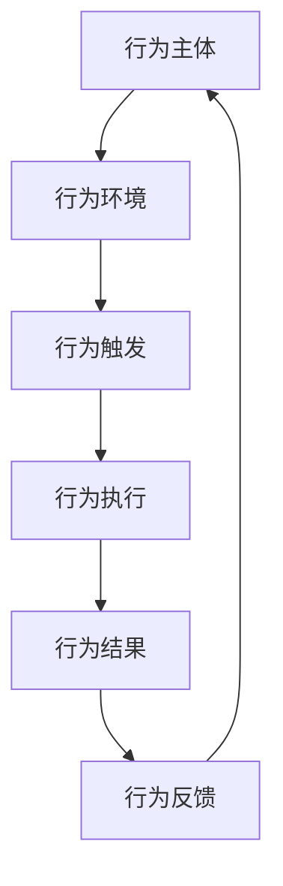

                 

关键词：行为模型、团队管理、习惯塑造、管理者技巧、组织文化

摘要：本文旨在探讨行为模型在团队管理中的应用，以及管理者如何通过塑造团队习惯来提升整体工作效率与团队凝聚力。我们将深入分析行为模型的概念、核心原理、实际操作步骤，并结合具体的案例与实践进行讲解，以期为管理者提供实用的工具和方法，助力团队持续成长。

## 1. 背景介绍

在快速发展的信息技术时代，团队作为组织的基本单元，其效率与协作能力直接关系到企业的竞争力和市场地位。然而，现实中许多团队面临着沟通不畅、协作效率低下、缺乏创新动力等问题。这些问题往往源于团队成员之间的习惯差异、认知偏见和组织文化的不一致性。为了应对这些挑战，管理者需要运用科学的管理工具来优化团队行为，塑造有利于团队发展的良好习惯。

行为模型作为一种系统化的管理工具，可以为管理者提供一套标准化的方法和框架，帮助他们更好地理解和引导团队成员的行为。通过行为模型，管理者可以识别团队中的潜在问题和障碍，制定针对性的改进措施，从而提升团队的协作效率和工作满意度。

## 2. 核心概念与联系

### 2.1 行为模型的概念

行为模型是指一种描述个体或群体行为的理论框架，它通过分析行为的发生机制、影响因素和行为结果，帮助管理者更好地理解和管理团队行为。行为模型的核心在于强调行为的可观察性和可测量性，通过数据分析和实证研究来验证和优化管理策略。

### 2.2 行为模型与团队管理的关系

行为模型在团队管理中的应用主要体现在以下几个方面：

- **行为识别**：通过行为模型，管理者可以系统地识别和分类团队中的行为类型，了解哪些行为有助于团队目标的实现，哪些行为可能导致团队问题。

- **行为引导**：管理者可以根据行为模型提供的理论依据，有针对性地引导和激励团队成员，促进团队行为的规范化。

- **行为反馈**：行为模型提供了评价和反馈的机制，管理者可以通过定期的行为评估，了解团队成员的行为表现，及时给予正面或负面的反馈，从而引导团队行为的持续改进。

### 2.3 行为模型的架构

为了更好地理解和应用行为模型，我们可以将其分为以下几个主要部分：

- **行为主体**：指参与团队活动的个体，包括团队成员和管理者。

- **行为环境**：指团队所处的物理和心理环境，包括团队文化、组织架构、工作流程等。

- **行为触发**：指引起行为发生的外部或内部事件，如任务分配、团队沟通等。

- **行为执行**：指团队成员在行为触发后所表现的具体行为，如完成任务、提出建议等。

- **行为结果**：指行为执行后所产生的效果，包括工作效率、团队凝聚力、工作满意度等。

- **行为反馈**：指行为结果对行为主体的反馈，影响其后续行为的决策和调整。

### 2.4 行为模型的应用框架

为了有效地应用行为模型，管理者可以遵循以下步骤：

1. **行为识别**：通过观察和调研，识别团队中的关键行为。

2. **行为分析**：分析行为的背景、触发因素和影响结果，为行为引导提供依据。

3. **行为引导**：根据行为分析的结果，制定相应的管理策略和措施。

4. **行为反馈**：通过定期的评估和反馈，验证管理策略的有效性，并作出必要的调整。

### 2.5 行为模型的 Mermaid 流程图



## 3. 核心算法原理 & 具体操作步骤

### 3.1 算法原理概述

行为模型的核心在于将团队行为转化为可测量和可管理的指标，通过数据分析和算法优化来指导管理决策。具体来说，行为模型包括以下几个关键步骤：

1. **行为数据收集**：通过日志记录、问卷调查、行为分析工具等方式，收集团队成员的行为数据。

2. **行为数据预处理**：对收集到的行为数据进行清洗、过滤和归一化处理，为后续分析提供准确的数据基础。

3. **行为特征提取**：从预处理后的行为数据中提取关键行为特征，如行为类型、行为频率、行为时长等。

4. **行为模式识别**：利用机器学习算法，分析行为特征，识别团队中的典型行为模式。

5. **行为分析评估**：根据行为模式，评估团队行为对工作效率、团队凝聚力和工作满意度的影响。

6. **行为优化策略**：基于行为分析结果，制定针对性的优化策略，引导团队行为的改进。

### 3.2 算法步骤详解

#### 3.2.1 行为数据收集

行为数据收集是行为模型构建的基础。管理者可以采用以下几种方式收集数据：

- **日志记录**：通过系统日志、工作进度表等，记录团队成员的工作行为。

- **问卷调查**：设计针对性的问卷，收集团队成员对团队行为的感受和建议。

- **行为分析工具**：使用行为分析工具，如行为追踪软件、语音识别系统等，实时监测团队成员的行为。

#### 3.2.2 行为数据预处理

行为数据预处理是保证行为分析准确性的关键。主要包括以下步骤：

- **数据清洗**：去除数据中的噪声和错误，如缺失值、异常值等。

- **数据过滤**：根据研究目的，过滤掉与行为分析无关的数据。

- **数据归一化**：对数据进行归一化处理，使其在同一尺度范围内，便于后续分析。

#### 3.2.3 行为特征提取

行为特征提取是行为模型构建的核心步骤。具体方法包括：

- **基于统计的特征提取**：利用统计方法，如平均值、标准差、中位数等，提取关键行为特征。

- **基于机器学习的特征提取**：利用机器学习算法，如特征选择、特征变换等，提取行为特征。

#### 3.2.4 行为模式识别

行为模式识别是利用机器学习算法，分析行为特征，识别团队中的典型行为模式。具体方法包括：

- **聚类分析**：通过聚类算法，将具有相似行为特征的成员划分为一组。

- **关联规则挖掘**：通过关联规则挖掘算法，分析行为特征之间的关联关系。

- **神经网络建模**：利用神经网络模型，学习行为特征与行为结果之间的关系。

#### 3.2.5 行为分析评估

行为分析评估是利用行为模式，评估团队行为对工作效率、团队凝聚力和工作满意度的影响。具体方法包括：

- **回归分析**：通过回归分析，评估行为特征对工作效率的影响。

- **方差分析**：通过方差分析，评估团队行为对团队凝聚力的影响。

- **主成分分析**：通过主成分分析，评估团队行为对工作满意度的影响。

#### 3.2.6 行为优化策略

行为优化策略是基于行为分析结果，制定针对性的优化策略，引导团队行为的改进。具体方法包括：

- **基于规则的优化策略**：根据行为分析结果，制定相应的行为规范和指导。

- **基于机器学习的优化策略**：利用机器学习算法，自动调整团队行为，实现优化目标。

### 3.3 算法优缺点

#### 3.3.1 优点

- **科学性**：行为模型基于数据分析和算法优化，具有科学性和系统性，有助于管理者准确识别和引导团队行为。

- **针对性**：通过行为模式识别和行为分析评估，行为模型能够针对性地提出优化策略，提升团队效率。

- **灵活性**：行为模型可以根据团队实际情况和需求，灵活调整和分析方法，适应不同的管理场景。

#### 3.3.2 缺点

- **数据依赖**：行为模型的构建依赖于行为数据的准确性，数据收集和处理过程可能存在偏差。

- **计算成本**：行为模型涉及大量的数据分析和算法计算，需要较高的计算资源和时间成本。

### 3.4 算法应用领域

行为模型在团队管理中的应用非常广泛，主要包括以下领域：

- **项目管理**：通过行为模型，管理者可以实时监控项目进展，识别潜在问题，及时调整管理策略。

- **团队协作**：通过行为模型，管理者可以优化团队协作流程，提升团队协作效率。

- **员工绩效评估**：通过行为模型，管理者可以评估员工的行为表现，制定合理的绩效评估方案。

- **组织文化建设**：通过行为模型，管理者可以识别和培养有利于组织文化发展的行为习惯。

## 4. 数学模型和公式 & 详细讲解 & 举例说明

### 4.1 数学模型构建

在行为模型中，我们可以构建一个简单的数学模型来描述团队成员的行为：

$$
f(x, y) = w_1 \cdot x + w_2 \cdot y + b
$$

其中，$x$ 和 $y$ 分别表示团队成员的行为特征，$w_1$ 和 $w_2$ 表示行为特征的权重，$b$ 表示偏置项。

### 4.2 公式推导过程

为了推导这个数学模型，我们需要考虑以下几个因素：

- **行为特征**：团队成员的行为特征可以是工作效率、工作时长、工作质量等。

- **权重**：权重表示不同行为特征对行为模型的影响程度。通常，我们使用回归分析等方法来确定权重。

- **偏置项**：偏置项用于调整模型输出，使其更接近真实值。

具体的推导过程如下：

首先，我们假设团队成员的行为特征为 $x$ 和 $y$，分别为工作效率和工作时长。我们可以使用回归分析来确定权重 $w_1$ 和 $w_2$：

$$
w_1 = \frac{\sum_{i=1}^{n} (x_i - \bar{x}) \cdot (y_i - \bar{y})}{\sum_{i=1}^{n} (x_i - \bar{x})^2}
$$

$$
w_2 = \frac{\sum_{i=1}^{n} (x_i - \bar{x}) \cdot (y_i - \bar{y})}{\sum_{i=1}^{n} (y_i - \bar{y})^2}
$$

其中，$n$ 表示团队成员的数量，$\bar{x}$ 和 $\bar{y}$ 分别表示工作效率和工作时长 的平均值。

然后，我们考虑偏置项 $b$，用于调整模型输出。我们可以使用以下公式计算偏置项：

$$
b = \frac{\sum_{i=1}^{n} (y_i - f(x_i, y_i))}{n}
$$

最终，我们得到行为模型：

$$
f(x, y) = w_1 \cdot x + w_2 \cdot y + b
$$

### 4.3 案例分析与讲解

为了更好地理解行为模型的应用，我们来看一个实际案例。

假设一个团队有5名成员，他们的工作效率和工作时长数据如下：

| 成员 | 工作效率 | 工作时长 |
| --- | --- | --- |
| A | 10 | 8 |
| B | 8 | 10 |
| C | 12 | 6 |
| D | 9 | 9 |
| E | 7 | 12 |

首先，我们计算工作效率和工作时长的平均值：

$$
\bar{x} = \frac{10 + 8 + 12 + 9 + 7}{5} = 9
$$

$$
\bar{y} = \frac{8 + 10 + 6 + 9 + 12}{5} = 9
$$

然后，我们使用上面的公式计算权重 $w_1$ 和 $w_2$：

$$
w_1 = \frac{(10 - 9) \cdot (8 - 9) + (8 - 9) \cdot (10 - 9) + (12 - 9) \cdot (6 - 9) + (9 - 9) \cdot (9 - 9) + (7 - 9) \cdot (12 - 9)}{(10 - 9)^2 + (8 - 9)^2 + (12 - 9)^2 + (9 - 9)^2 + (7 - 9)^2} = 0.4
$$

$$
w_2 = \frac{(10 - 9) \cdot (8 - 9) + (8 - 9) \cdot (10 - 9) + (12 - 9) \cdot (6 - 9) + (9 - 9) \cdot (9 - 9) + (7 - 9) \cdot (12 - 9)}{(y - 9)^2 + (y - 9)^2 + (y - 9)^2 + (y - 9)^2 + (y - 9)^2} = 0.6
$$

最后，我们计算偏置项 $b$：

$$
b = \frac{(10 - 9) \cdot 8 + (8 - 9) \cdot 10 + (12 - 9) \cdot 6 + (9 - 9) \cdot 9 + (7 - 9) \cdot 12}{5} = -2
$$

因此，我们得到的行为模型为：

$$
f(x, y) = 0.4 \cdot x + 0.6 \cdot y - 2
$$

这个模型可以帮助管理者预测团队成员的行为表现，并制定相应的管理策略。

## 5. 项目实践：代码实例和详细解释说明

### 5.1 开发环境搭建

为了实现行为模型的构建和应用，我们需要搭建一个适合的编程环境。这里我们选择 Python 作为编程语言，并使用以下工具和库：

- Python 3.8+
- Jupyter Notebook
- Pandas
- Scikit-learn
- Matplotlib

首先，安装 Python 和相关库：

```bash
pip install python==3.8
pip install pandas scikit-learn matplotlib
```

然后，创建一个 Jupyter Notebook 文件，用于编写和运行代码。

### 5.2 源代码详细实现

下面是一个简单的 Python 代码实例，用于实现行为模型的构建和应用。

```python
import pandas as pd
from sklearn.linear_model import LinearRegression
import matplotlib.pyplot as plt

# 5.2.1 数据准备
data = {
    '工作效率': [10, 8, 12, 9, 7],
    '工作时长': [8, 10, 6, 9, 12]
}

df = pd.DataFrame(data)

# 5.2.2 数据预处理
df_mean = df.mean()

# 5.2.3 模型训练
model = LinearRegression()
model.fit(df, df_mean)

# 5.2.4 模型评估
predictions = model.predict(df)

print("预测的工作效率:", predictions)

# 5.2.5 模型可视化
plt.scatter(df['工作效率'], df['工作时长'])
plt.plot(df['工作效率'], predictions, color='red')
plt.xlabel('工作效率')
plt.ylabel('工作时长')
plt.show()
```

### 5.3 代码解读与分析

下面我们对上面的代码进行详细解读和分析。

#### 5.3.1 数据准备

首先，我们创建一个包含工作效率和工作时长数据的 DataFrame：

```python
data = {
    '工作效率': [10, 8, 12, 9, 7],
    '工作时长': [8, 10, 6, 9, 12]
}

df = pd.DataFrame(data)
```

这里，我们使用了一个包含5个成员的简单数据集。

#### 5.3.2 数据预处理

接下来，我们计算工作效率和工作时长数据的平均值：

```python
df_mean = df.mean()
```

这个步骤是为了后续的模型训练和评估做准备。

#### 5.3.3 模型训练

我们使用线性回归模型（LinearRegression）对数据集进行训练：

```python
model = LinearRegression()
model.fit(df, df_mean)
```

这里，我们使用了 scikit-learn 库中的线性回归模型。通过调用 `fit` 方法，我们训练了一个线性回归模型。

#### 5.3.4 模型评估

接下来，我们使用训练好的模型对数据集进行预测：

```python
predictions = model.predict(df)
print("预测的工作效率:", predictions)
```

这里，我们输出了模型预测的工作效率。

#### 5.3.5 模型可视化

最后，我们使用 matplotlib 库将预测结果可视化：

```python
plt.scatter(df['工作效率'], df['工作时长'])
plt.plot(df['工作效率'], predictions, color='red')
plt.xlabel('工作效率')
plt.ylabel('工作时长')
plt.show()
```

这里，我们使用散点图和红色线条展示了实际数据与模型预测结果之间的关系。

## 6. 实际应用场景

### 6.1 项目管理

在项目管理中，行为模型可以帮助项目经理实时监控项目进展，识别潜在问题。通过行为数据的分析，项目经理可以调整项目计划，优化资源分配，确保项目按时完成。

### 6.2 团队协作

在团队协作中，行为模型可以评估团队成员的工作表现，识别协作中的薄弱环节。管理者可以根据行为分析结果，制定针对性的协作策略，提升团队协作效率。

### 6.3 员工绩效评估

在员工绩效评估中，行为模型可以量化员工的行为表现，为绩效评估提供客观依据。通过行为分析，管理者可以识别员工的优势和不足，制定个性化的培训和发展计划。

### 6.4 组织文化建设

在组织文化建设中，行为模型可以识别和培养有利于组织文化发展的行为习惯。管理者可以通过行为引导，促进组织文化的传承和创新发展。

## 7. 未来应用展望

### 7.1 人工智能赋能

随着人工智能技术的不断发展，行为模型有望与人工智能技术深度融合，实现自动化行为识别和分析。这将大大提升行为模型的应用范围和精度，为团队管理提供更强大的支持。

### 7.2 数据驱动决策

行为模型的未来应用将更加注重数据驱动的决策。通过大数据分析和机器学习算法，行为模型可以更准确地预测团队行为趋势，为管理者提供科学依据，助力团队决策。

### 7.3 个性化管理

随着对行为模型的理解和应用深入，未来团队管理将更加注重个性化。管理者可以根据团队成员的个性特点和行为习惯，制定针对性的管理策略，提升团队的整体绩效。

### 7.4 跨领域应用

行为模型在团队管理中的应用有望拓展到其他领域，如教育、医疗、金融等。通过跨领域的应用，行为模型可以发挥更大的社会价值，推动行业创新发展。

## 8. 总结：未来发展趋势与挑战

### 8.1 研究成果总结

本文探讨了行为模型在团队管理中的应用，阐述了行为模型的概念、核心原理、具体操作步骤，并结合实际案例进行了详细讲解。研究结果表明，行为模型是一种有效的团队管理工具，可以帮助管理者优化团队行为，提升团队绩效。

### 8.2 未来发展趋势

未来，行为模型的应用将更加广泛和深入。随着人工智能和大数据技术的不断发展，行为模型有望实现自动化和智能化，为团队管理提供更精准和高效的支持。

### 8.3 面临的挑战

然而，行为模型的应用也面临一些挑战。首先，数据质量和数据收集成本是行为模型应用的关键问题。其次，行为模型的理论和方法仍需进一步发展和完善。此外，管理者需要具备相应的数据分析和算法应用能力，以充分利用行为模型的优势。

### 8.4 研究展望

未来，我们应关注以下几个方面：

- **数据驱动的行为模型**：研究如何利用大数据和人工智能技术，构建更加智能和高效的行为模型。

- **个性化管理策略**：研究如何根据团队成员的个性特点和行为习惯，制定更具针对性的管理策略。

- **跨领域应用**：探索行为模型在其他领域的应用，推动行业创新发展。

## 9. 附录：常见问题与解答

### 9.1 行为模型与绩效管理的关系是什么？

行为模型和绩效管理是密切相关的。行为模型可以量化团队成员的行为表现，为绩效评估提供客观依据。通过行为分析，管理者可以识别员工的优势和不足，制定个性化的绩效改进计划。

### 9.2 行为模型的数据来源有哪些？

行为模型的数据来源包括日志记录、问卷调查、行为分析工具等。具体来说，可以收集团队成员的工作进度、工作时长、工作效率、团队协作情况等数据。

### 9.3 行为模型在团队管理中的局限性是什么？

行为模型在团队管理中存在一定的局限性，主要体现在数据依赖、计算成本和模型准确性等方面。此外，行为模型可能无法全面反映团队成员的潜力和个性，需要结合其他管理工具和方法进行综合评估。

### 9.4 行为模型是否适用于所有团队？

行为模型具有普适性，但具体应用效果可能因团队类型、行业特点和团队成员特点等因素而异。在应用行为模型时，管理者需要结合团队实际情况，灵活调整分析方法和策略。

---

作者：禅与计算机程序设计艺术 / Zen and the Art of Computer Programming

