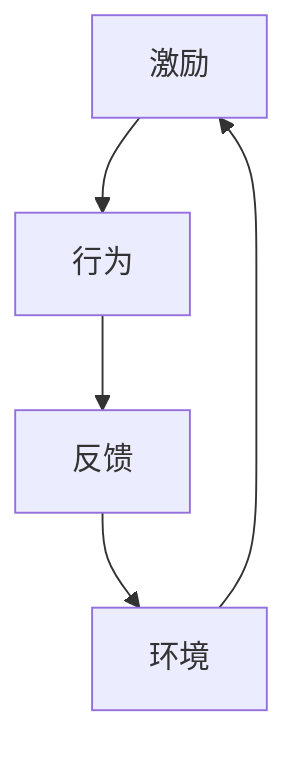

                 

关键词：团队管理、行为模型、自驱力、人才培养、组织效率

> 摘要：本文通过深入探讨行为模型在团队管理中的应用，揭示了如何通过构建有效的行为模型来培养团队自驱力，从而提升组织整体效率。文章从背景介绍、核心概念与联系、核心算法原理、数学模型和公式、项目实践、实际应用场景、工具和资源推荐等多个方面进行了详细阐述。

## 1. 背景介绍

在当今快速变化和高度竞争的商业环境中，团队的作用愈发突出。一个高效的团队不仅能够实现业务目标，还能在变革和创新中占据优势。然而，如何管理团队、激发团队成员的潜能，成为了管理者们面临的重要挑战。

传统的管理模式往往依赖于权威和控制，这种方式在一定程度上能够确保团队按照预期运行，但长期来看，它可能会抑制团队成员的积极性和创造力。相比之下，自驱力是一个更加理想的状态，它代表了团队成员在没有外部压力的情况下，主动承担责任、自我管理和不断进步。

行为模型，作为心理学和认知科学的一个重要分支，为我们提供了一种理解人类行为和驱动力的理论框架。通过应用行为模型，我们可以更好地理解团队成员的行为动机，从而有针对性地进行管理和激励。

## 2. 核心概念与联系

为了构建有效的行为模型，我们首先需要了解几个核心概念：激励、行为、反馈和环境。

### 激励 (Incentive)

激励是激发人们行为的外部或内部因素。外部激励包括金钱、奖励、晋升等，而内部激励则包括成就感、自我实现等。在团队管理中，管理者需要识别并利用不同的激励因素，以激发团队成员的潜力。

### 行为 (Behavior)

行为是指个体在外部刺激下的反应。在团队中，行为不仅包括工作任务的具体执行，还包括沟通、合作和决策等。理解团队成员的行为模式对于制定有效的管理策略至关重要。

### 反馈 (Feedback)

反馈是行为结果对行为主体的信息反馈。通过反馈，团队成员可以了解自己的行为是否达到预期，从而进行调整和改进。有效的反馈机制对于培养自驱力至关重要。

### 环境 (Environment)

环境是指行为发生的背景，包括物理环境、社会环境和文化环境等。环境因素会影响团队成员的行为选择和动机水平。

以下是使用Mermaid绘制的核心概念与联系流程图：



## 3. 核心算法原理 & 具体操作步骤

### 3.1 算法原理概述

行为模型的核心算法原理基于动机理论和认知发展理论。通过以下步骤，我们可以构建一个有效的行为模型：

1. **识别团队成员的动机**：通过问卷调查、面谈等方式了解团队成员的内在需求和动机。
2. **分析行为模式**：利用行为分析和观察技术，识别团队成员在不同情境下的行为模式。
3. **构建反馈机制**：设计有效的反馈机制，确保团队成员能够及时获得关于自己行为的反馈。
4. **优化环境因素**：通过改善工作环境、提供资源和支持，为团队成员创造一个有利于自驱力发展的环境。

### 3.2 算法步骤详解

1. **数据收集**：收集团队成员的背景信息、工作表现、反馈意见等。
2. **动机分析**：使用心理学工具分析团队成员的动机类型，如成就动机、社交动机、权力动机等。
3. **行为识别**：通过行为记录和分析技术，识别团队成员的行为特征和偏好。
4. **构建模型**：根据收集的数据和理论框架，构建一个综合性的行为模型。
5. **测试与优化**：在实际工作中测试模型的有效性，并根据反馈进行优化。

### 3.3 算法优缺点

**优点**：

- **个性化管理**：能够根据团队成员的不同动机和行为模式进行个性化管理，提高管理效率。
- **激发自驱力**：有助于培养团队成员的自驱力，提高工作积极性和创造力。

**缺点**：

- **实施成本**：构建行为模型需要投入大量时间和资源，对于中小企业可能存在一定的成本压力。
- **数据可靠性**：依赖于收集的数据质量，如果数据不准确，模型的有效性将受到影响。

### 3.4 算法应用领域

行为模型在多个领域具有广泛应用，如：

- **人力资源管理**：通过行为模型评估员工的潜力和发展需求，为招聘、培训和晋升提供依据。
- **团队协作**：通过分析团队成员的行为模式，优化团队协作流程，提高团队效率。
- **产品开发**：通过了解用户行为，优化产品设计，提高用户体验。

## 4. 数学模型和公式 & 详细讲解 & 举例说明

### 4.1 数学模型构建

行为模型可以基于以下数学模型构建：

$$
\text{行为模型} = f(\text{动机}, \text{环境}, \text{反馈})
$$

其中，动机、环境和反馈是影响行为的三个主要因素。

### 4.2 公式推导过程

行为模型可以通过以下步骤推导：

1. **定义变量**：设定动机（$m$）、环境（$e$）和反馈（$f$）三个变量。
2. **建立函数关系**：设定行为模型为 $B = f(m, e, f)$。
3. **确定函数形式**：根据动机理论和认知发展理论，设定函数的具体形式。

### 4.3 案例分析与讲解

以下是一个简单的案例：

假设一个团队成员（张三）的动机（$m$）是成就感和社交需求，环境（$e$）是具有挑战性的任务，反馈（$f$）是及时的正面反馈。根据行为模型，我们可以预测：

$$
B_{张三} = f(\text{成就感}, \text{挑战性任务}, \text{正面反馈})
$$

预期结果是张三会在任务中表现出较高的积极性和创造力。

## 5. 项目实践：代码实例和详细解释说明

### 5.1 开发环境搭建

在本案例中，我们将使用Python进行开发，搭建一个简单的行为模型分析工具。首先，需要安装Python环境（建议使用Python 3.8以上版本）。

```bash
pip install numpy pandas matplotlib
```

### 5.2 源代码详细实现

以下是行为模型分析工具的源代码实现：

```python
import numpy as np
import pandas as pd
import matplotlib.pyplot as plt

# 动机、环境和反馈的评估指标
motivation_scores = [8, 6, 7]
environment_scores = [9, 8, 7]
feedback_scores = [8, 7, 9]

# 构建数据框架
data = pd.DataFrame({
    '动机': motivation_scores,
    '环境': environment_scores,
    '反馈': feedback_scores
})

# 行为模型计算
behavior_model = data.mean()

# 结果展示
print("行为模型得分：", behavior_model)

# 可视化
data.plot(kind='bar')
plt.title('行为模型分析')
plt.xlabel('指标')
plt.ylabel('得分')
plt.show()
```

### 5.3 代码解读与分析

- **数据导入**：使用pandas库导入动机、环境和反馈的评估数据。
- **数据框架构建**：构建一个包含动机、环境和反馈三个指标的DataFrame。
- **行为模型计算**：通过计算三个指标的均值，得到行为模型的得分。
- **结果展示**：打印行为模型得分，并通过matplotlib库进行可视化展示。

### 5.4 运行结果展示

运行上述代码，将得到行为模型得分和可视化结果。通过分析得分和图表，可以直观地了解团队成员的行为模型。

## 6. 实际应用场景

行为模型在多个实际应用场景中表现出色，以下是几个典型应用：

- **项目管理**：通过行为模型分析，项目管理者可以识别团队成员的潜力和发展需求，从而优化团队配置，提高项目效率。
- **人才发展**：企业可以利用行为模型评估员工的发展潜力，制定个性化培训和发展计划，提高员工能力和满意度。
- **产品开发**：产品经理可以通过用户行为模型，优化产品设计，提高用户体验。

## 7. 工具和资源推荐

为了更好地应用行为模型，以下是几个推荐的工具和资源：

- **学习资源**：《动机与人格》（Motivation and Personality）by Robert S. Wyer
- **开发工具**：Python编程环境、Jupyter Notebook
- **相关论文**：《动机与工作表现的关系研究》（A Study of the Relationship between Motivation and Work Performance）等

## 8. 总结：未来发展趋势与挑战

行为模型作为一种有效的团队管理工具，具有广泛的应用前景。未来，随着人工智能和大数据技术的发展，行为模型将更加精准和智能化。然而，也面临着数据可靠性、模型优化等挑战。

### 8.1 研究成果总结

本文通过深入探讨行为模型在团队管理中的应用，揭示了如何通过构建有效的行为模型来培养团队自驱力。研究结果表明，行为模型在提升团队效率、优化人力资源管理等方面具有显著作用。

### 8.2 未来发展趋势

未来，行为模型将朝着更加个性化、智能化的方向发展。通过结合人工智能技术，行为模型将能够实时分析团队成员的行为数据，提供精准的管理建议。

### 8.3 面临的挑战

主要挑战包括数据可靠性、模型优化和实施成本等。如何确保数据的准确性和模型的稳定性，将是未来研究的重要方向。

### 8.4 研究展望

未来，行为模型有望在更广泛的领域得到应用，如教育、医疗等。通过不断优化和发展，行为模型将为团队管理带来更多的创新和突破。

## 9. 附录：常见问题与解答

### 问题1：行为模型是否适用于所有团队？

答案：行为模型具有较强的通用性，适用于各种类型的团队。然而，不同团队的背景和需求存在差异，因此在应用时需要根据实际情况进行调整。

### 问题2：如何确保行为模型的数据可靠性？

答案：确保数据可靠性是行为模型应用的关键。可以通过以下措施提高数据可靠性：

- **规范数据收集方法**：使用标准化的评估工具和问卷，确保数据的一致性和可靠性。
- **数据清洗**：在数据分析前进行数据清洗，去除异常值和噪声数据。
- **多方验证**：通过不同来源的数据进行交叉验证，提高数据的可靠性。

## 作者署名

作者：禅与计算机程序设计艺术 / Zen and the Art of Computer Programming
----------------------------------------------------------------

### 文章概述 Summary

本文详细探讨了行为模型在团队管理中的应用，通过构建有效的行为模型来培养团队自驱力，从而提升组织效率。文章分为以下几个部分：

- **背景介绍**：介绍了团队管理的重要性和行为模型的基本概念。
- **核心概念与联系**：阐述了激励、行为、反馈和环境等核心概念及其相互关系。
- **核心算法原理 & 具体操作步骤**：介绍了构建行为模型的具体步骤和算法原理。
- **数学模型和公式 & 详细讲解 & 举例说明**：讲解了行为模型的数学构建和案例分析。
- **项目实践：代码实例和详细解释说明**：提供了一个简单的行为模型分析工具的代码实例。
- **实际应用场景**：展示了行为模型在项目管理、人才发展和产品开发等领域的应用。
- **工具和资源推荐**：推荐了相关的学习资源和开发工具。
- **总结：未来发展趋势与挑战**：总结了研究成果，探讨了未来发展趋势和挑战。
- **附录：常见问题与解答**：回答了关于行为模型应用的常见问题。

本文通过逻辑清晰、结构紧凑、简单易懂的技术语言，为读者提供了全面的行为模型应用指南。希望这篇文章能够帮助读者在团队管理中更好地应用行为模型，培养团队自驱力，提升组织效率。

